Gapminder exploration
================
Amanda Cheung
9/26/2017

Exploring the Gapminder data for STAT 545 homework 02

Bring rectangular data in
-------------------------

Load gapminder and dplyr via the tidyverse meta-package.

``` r
library(gapminder)
library(tidyverse)
```

    ## Loading tidyverse: ggplot2
    ## Loading tidyverse: tibble
    ## Loading tidyverse: tidyr
    ## Loading tidyverse: readr
    ## Loading tidyverse: purrr
    ## Loading tidyverse: dplyr

    ## Conflicts with tidy packages ----------------------------------------------

    ## filter(): dplyr, stats
    ## lag():    dplyr, stats

Smell test the data
-------------------

**Is it a data.frame, a matrix, a vector, a list? What's its class?**

Display the structure of the gapminder object.

``` r
str(gapminder)
```

    ## Classes 'tbl_df', 'tbl' and 'data.frame':    1704 obs. of  6 variables:
    ##  $ country  : Factor w/ 142 levels "Afghanistan",..: 1 1 1 1 1 1 1 1 1 1 ...
    ##  $ continent: Factor w/ 5 levels "Africa","Americas",..: 3 3 3 3 3 3 3 3 3 3 ...
    ##  $ year     : int  1952 1957 1962 1967 1972 1977 1982 1987 1992 1997 ...
    ##  $ lifeExp  : num  28.8 30.3 32 34 36.1 ...
    ##  $ pop      : int  8425333 9240934 10267083 11537966 13079460 14880372 12881816 13867957 16317921 22227415 ...
    ##  $ gdpPercap: num  779 821 853 836 740 ...

Alternatively, you can display the class.

``` r
class(gapminder)
```

    ## [1] "tbl_df"     "tbl"        "data.frame"

-   Gapminder is a data.frame. It is class tbl\_df, tbl, and data.frame.

**How many variables/columns? How many rows/observations?**

Find the number of columns and rows.

``` r
ncol(gapminder)
```

    ## [1] 6

``` r
nrow(gapminder)
```

    ## [1] 1704

-   Gapminder has 6 variables/columns and 1604 rows/observations. This information is also seen above with str().

**Can you get these facts about “extent” or “size” in more than one way? Can you imagine different functions being useful in different contexts?**

-   Alternative ways to get facts about "extent" or "size".

``` r
summary(gapminder)
```

    ##         country        continent        year         lifeExp     
    ##  Afghanistan:  12   Africa  :624   Min.   :1952   Min.   :23.60  
    ##  Albania    :  12   Americas:300   1st Qu.:1966   1st Qu.:48.20  
    ##  Algeria    :  12   Asia    :396   Median :1980   Median :60.71  
    ##  Angola     :  12   Europe  :360   Mean   :1980   Mean   :59.47  
    ##  Argentina  :  12   Oceania : 24   3rd Qu.:1993   3rd Qu.:70.85  
    ##  Australia  :  12                  Max.   :2007   Max.   :82.60  
    ##  (Other)    :1632                                                
    ##       pop              gdpPercap       
    ##  Min.   :6.001e+04   Min.   :   241.2  
    ##  1st Qu.:2.794e+06   1st Qu.:  1202.1  
    ##  Median :7.024e+06   Median :  3531.8  
    ##  Mean   :2.960e+07   Mean   :  7215.3  
    ##  3rd Qu.:1.959e+07   3rd Qu.:  9325.5  
    ##  Max.   :1.319e+09   Max.   :113523.1  
    ## 

``` r
dim(gapminder)
```

    ## [1] 1704    6

``` r
length(gapminder)
```

    ## [1] 6

-   Different functions can be used depending on the type of information you want.
    -   str() provides an overview of the object.
    -   class() provides information about the class of the object.
    -   ncol() and length() provides the number of columns/length of the object.
    -   nrow() provides the number of rows of the object.
    -   dim() provides the dimensions, number of rows x number of columns, of the object.
    -   summary() provides a statistical overview.

**What data type is each variable?**

From the structure function, str(), above:

| variable  | data type |
|-----------|-----------|
| country   | factor    |
| continent | factor    |
| year      | integer   |
| lifeExp   | numeric   |
| pop       | integer   |
| gdpPercap | numeric   |

Explore individual variables
----------------------------

### Continent as a categorical variable

**What are possible values (or range, whichever is appropriate) of each variable?**

Looking at the summary, table, and levels of the continent variable.

``` r
summary(gapminder$continent)
```

    ##   Africa Americas     Asia   Europe  Oceania 
    ##      624      300      396      360       24

``` r
table(gapminder$continent)
```

    ## 
    ##   Africa Americas     Asia   Europe  Oceania 
    ##      624      300      396      360       24

``` r
levels(gapminder$continent)
```

    ## [1] "Africa"   "Americas" "Asia"     "Europe"   "Oceania"

-   The continent variable has 5 values.

1.  Africa
2.  Americas
3.  Asia
4.  Europe
5.  Oceania

**What values are typical? What’s the spread? What’s the distribution?**

Observations associated with each continent in a bar graph.

``` r
ggplot(gapminder, aes(x=continent, fill=continent)) + geom_bar()
```

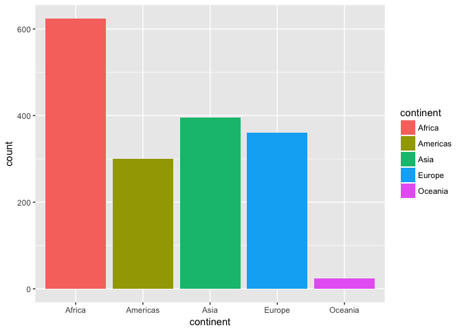

Observations associated with each continent in a density plot.

``` r
ggplot(gapminder, aes(x=continent, fill=continent, colour=continent)) + geom_density(alpha=0.5)
```

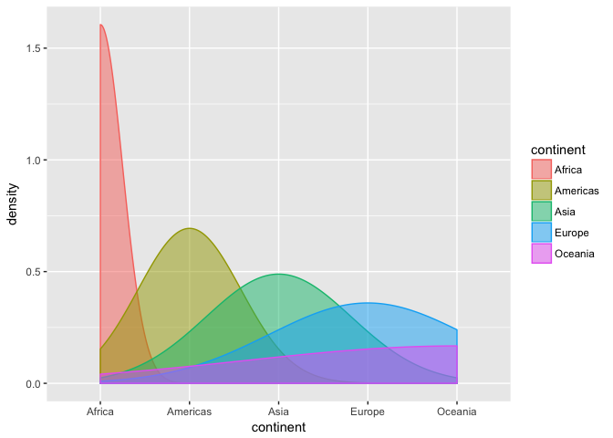

Observations associated with each continent in a pie chart.

``` r
pie(table(gapminder$continent), col=c("blue","red","yellow", "orange", "green"), main="Observations associated with each continent")
```

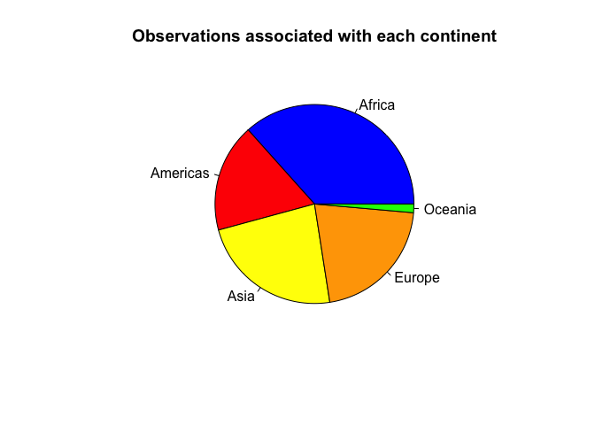

### Life expectancy as a quantitative variable

**What are possible values (or range, whichever is appropriate) of each variable?**

Looking at the summary, head and tail values, and range of the life expectancy variable.

``` r
summary(gapminder$lifeExp)
```

    ##    Min. 1st Qu.  Median    Mean 3rd Qu.    Max. 
    ##   23.60   48.20   60.71   59.47   70.85   82.60

``` r
head(gapminder$lifeExp)
```

    ## [1] 28.801 30.332 31.997 34.020 36.088 38.438

``` r
tail(gapminder$lifeExp)
```

    ## [1] 60.363 62.351 60.377 46.809 39.989 43.487

``` r
range(gapminder$lifeExp)
```

    ## [1] 23.599 82.603

**What values are typical? What’s the spread? What’s the distribution?**

Histogram of life expectancy values to illustrate the spread and distribution.

``` r
ggplot(gapminder, aes(x=lifeExp, fill=continent)) + geom_histogram(binwidth=10)
```

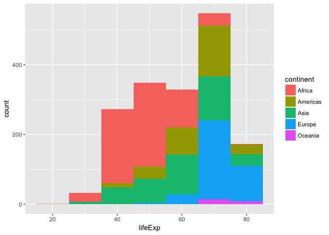

Density plot of life expectancy values to illustrate the spread and distribution.

``` r
ggplot(gapminder, aes(x=lifeExp)) + geom_density(colour="blue", fill="blue", alpha=0.25)
```

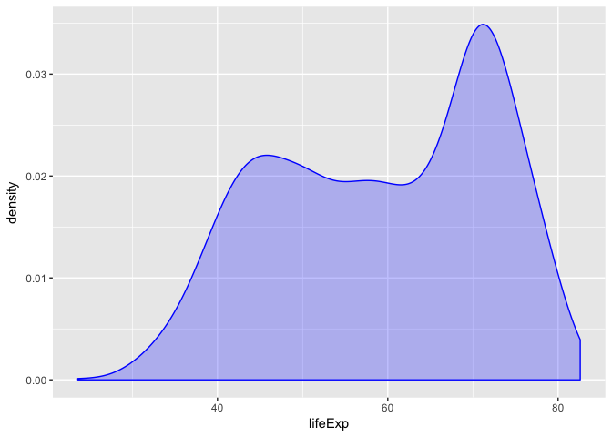

Explore various plot types
--------------------------

#### Scatterplot

Scatterplot of year vs. life expectancy in Europe.

``` r
ggplot(filter(gapminder, continent == "Europe" ), aes(x=year, y=lifeExp, colour=country)) + geom_line() + geom_point()
```

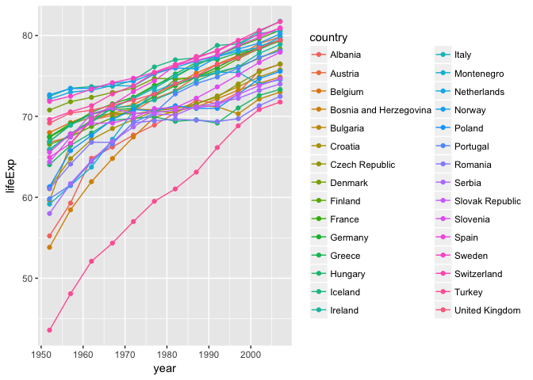

Scatterplot of population vs. life expectancy in the '80s and '90s in Africa, the Americas, and Asia.

``` r
ggplot(gapminder %>% 
         filter(year <= 1999, year >= 1980, continent %in% c("Americas", "Africa", "Asia")) %>% 
         select(continent, pop, lifeExp, gdpPercap),
         aes(x=pop, y=lifeExp, colour=continent)) + geom_point(aes(size=gdpPercap), alpha=0.5) + geom_smooth(se=FALSE, method="loess") + scale_x_log10()
```

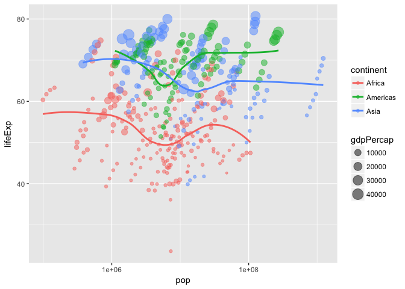

``` r
ggplot(gapminder, aes(x=gdpPercap, y=pop)) + scale_y_log10() + facet_wrap(~ continent) + geom_point(alpha=0.25) + geom_smooth(se=FALSE, method="loess", aes(colour=continent))
```

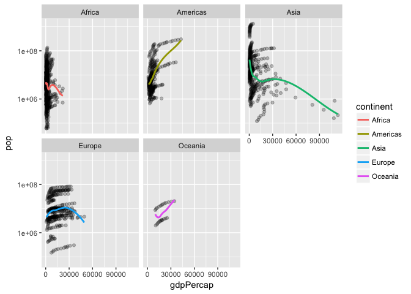

#### Frequency polygon

Frequency polygon of life expectancy in China, Japan, Vietnam, and Thailand.

``` r
ggplot(gapminder %>%  
         filter(continent == "Asia", country %in% c("China", "Japan", "Vietnam", "Thailand")) %>%
         select(country, lifeExp), 
         aes(x=lifeExp, colour=country)) + geom_freqpoly(binwidth=10)
```

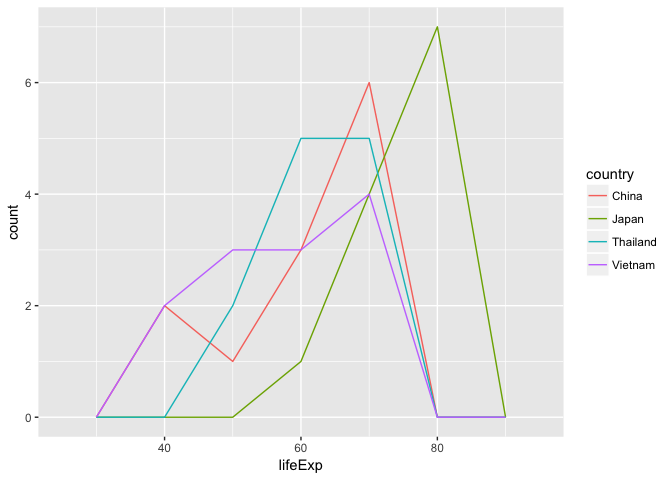

#### Histogram

Histogram of GDP in billions (calculated by multiplying GPD per capita with population) in Oceania.

``` r
ggplot(gapminder %>% 
         mutate(gdpBill = (gdpPercap * pop)/1000000000) %>% 
         filter(continent == "Oceania") %>% 
         select(gdpBill, country), 
         aes(x=gdpBill, fill=country)) + geom_histogram(binwidth=50)
```

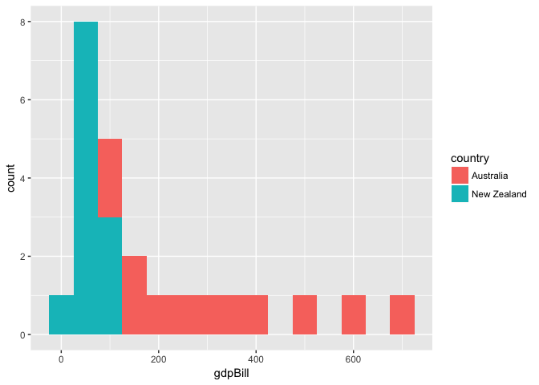

#### Boxplot

The distribution of population of each continent in the '90s shown in a boxplot.

``` r
ggplot(gapminder %>% 
         filter(year <= 1999, year >= 1990),
       aes(x=continent, y=pop, colour=continent)) + 
  geom_boxplot(outlier.alpha = 0.5, outlier.shape = 1) + scale_y_log10()
```

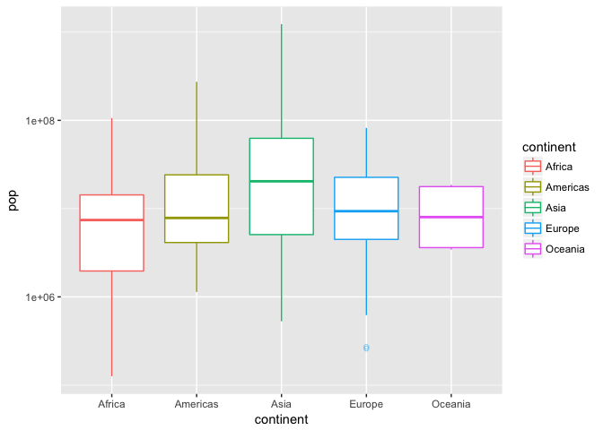

#### Area chart

The spread of GPD per capita each year in Algeria, Canada, Denmark, and India.

``` r
ggplot(gapminder %>% 
         filter(country %in% c("Canada", "India", "Denmark", "Algeria")),
       aes(x=year, y=gdpPercap, fill=country)) + geom_area(colour="black", alpha=0.6)
```

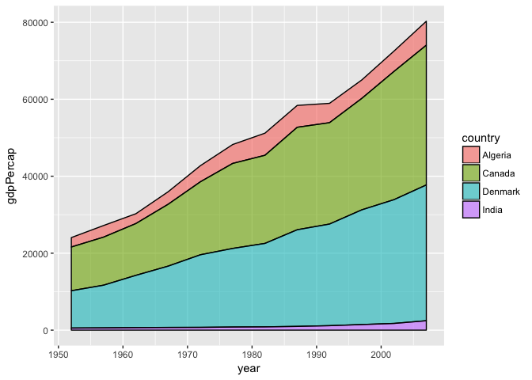

I want to do more!
------------------

``` r
filter(gapminder, country == c("Rwanda", "Afghanistan"))
```

    ## # A tibble: 12 x 6
    ##        country continent  year lifeExp      pop gdpPercap
    ##         <fctr>    <fctr> <int>   <dbl>    <int>     <dbl>
    ##  1 Afghanistan      Asia  1957  30.332  9240934  820.8530
    ##  2 Afghanistan      Asia  1967  34.020 11537966  836.1971
    ##  3 Afghanistan      Asia  1977  38.438 14880372  786.1134
    ##  4 Afghanistan      Asia  1987  40.822 13867957  852.3959
    ##  5 Afghanistan      Asia  1997  41.763 22227415  635.3414
    ##  6 Afghanistan      Asia  2007  43.828 31889923  974.5803
    ##  7      Rwanda    Africa  1952  40.000  2534927  493.3239
    ##  8      Rwanda    Africa  1962  43.000  3051242  597.4731
    ##  9      Rwanda    Africa  1972  44.600  3992121  590.5807
    ## 10      Rwanda    Africa  1982  46.218  5507565  881.5706
    ## 11      Rwanda    Africa  1992  23.599  7290203  737.0686
    ## 12      Rwanda    Africa  2002  43.413  7852401  785.6538

The code above does not suceed in retrieving all the data for Afghanistan and Rwanda. The "==" operator does not work for more than one category where there is overlapping data (i.e. if Afghanistan and Rwanda share the same year, only one set of data will be retrieved).

The "%in%" operator is used along with c(), to create a vector, allowing retrieval of all the data where both countries share the same element (i.e. year).

``` r
filter(gapminder, country %in% c("Rwanda", "Afghanistan"))
```

    ## # A tibble: 24 x 6
    ##        country continent  year lifeExp      pop gdpPercap
    ##         <fctr>    <fctr> <int>   <dbl>    <int>     <dbl>
    ##  1 Afghanistan      Asia  1952  28.801  8425333  779.4453
    ##  2 Afghanistan      Asia  1957  30.332  9240934  820.8530
    ##  3 Afghanistan      Asia  1962  31.997 10267083  853.1007
    ##  4 Afghanistan      Asia  1967  34.020 11537966  836.1971
    ##  5 Afghanistan      Asia  1972  36.088 13079460  739.9811
    ##  6 Afghanistan      Asia  1977  38.438 14880372  786.1134
    ##  7 Afghanistan      Asia  1982  39.854 12881816  978.0114
    ##  8 Afghanistan      Asia  1987  40.822 13867957  852.3959
    ##  9 Afghanistan      Asia  1992  41.674 16317921  649.3414
    ## 10 Afghanistan      Asia  1997  41.763 22227415  635.3414
    ## # ... with 14 more rows
