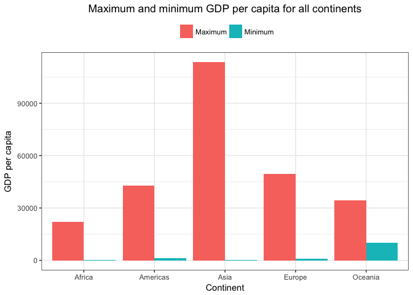

Dplyr and ggplot2 exploration
================
Amanda Cheung
10/1/2017

STAT545 Homework 03
-------------------

Exploration and manipulation of the Gapminder dataset using dplyr and ggplot2.

Gapminder, dplyr, and ggplot2
-----------------------------

Load gapminder, and dplyr and ggplot2 via the tidyverse meta-package.

``` r
library(gapminder)
library(tidyverse)
```

    ## Loading tidyverse: ggplot2
    ## Loading tidyverse: tibble
    ## Loading tidyverse: tidyr
    ## Loading tidyverse: readr
    ## Loading tidyverse: purrr
    ## Loading tidyverse: dplyr

    ## Conflicts with tidy packages ----------------------------------------------

    ## filter(): dplyr, stats
    ## lag():    dplyr, stats

Task 1: Get the maximum and minimum of GDP per capita for all continents
------------------------------------------------------------------------

#### Table 1: Maximum and minimum GDP per capita for all continents.

``` r
knitr::kable(gapminder %>%
               group_by(continent) %>% 
               summarize(maximum_gdpPercap = max(gdpPercap),
                         minimum_gdpPercap = min(gdpPercap)))
```

| continent |  maximum\_gdpPercap|  minimum\_gdpPercap|
|:----------|-------------------:|-------------------:|
| Africa    |            21951.21|            241.1659|
| Americas  |            42951.65|           1201.6372|
| Asia      |           113523.13|            331.0000|
| Europe    |            49357.19|            973.5332|
| Oceania   |            34435.37|          10039.5956|

#### Figure 1: Grouped bar plot of maximum and minimum GDP per capita for all continents.

Load reshape2 package.

``` r
library(reshape2)
```

    ## 
    ## Attaching package: 'reshape2'

    ## The following object is masked from 'package:tidyr':
    ## 
    ##     smiths

Melt data of interest using `melt` function.

``` r
gdp_melt = melt(gapminder %>%
       group_by(continent) %>% 
       summarize(maximum_gdpPercap = max(gdpPercap),
                 minimum_gdpPercap = min(gdpPercap)))
```

    ## Using continent as id variables

Grouped bar plot of maximum and minimum GDP per capita for all continents

``` r
ggplot(gdp_melt, aes(x=continent, y=value, fill=variable)) +
  geom_bar(position="dodge", stat="identity") + 
  theme_bw() +
  theme(legend.position="top", legend.title = element_blank(),
        plot.title = element_text(hjust = 0.5)) +
  scale_fill_discrete(labels=c("Maximum", "Minimum")) +
  labs(x="Continent", y="GDP per capita") +
  ggtitle("Maximum and minimum GDP per capita for all continents")
```


