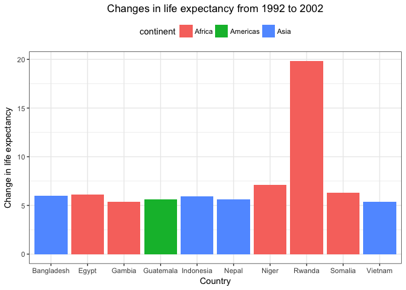
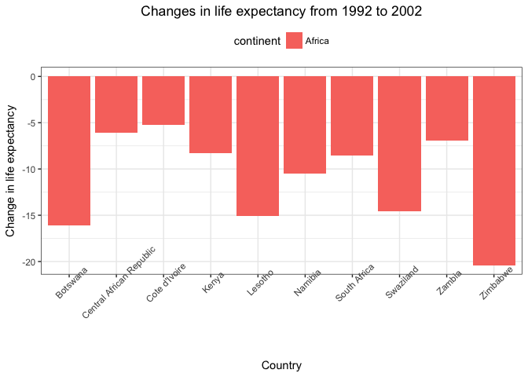

Dplyr and ggplot2 exploration
================
Amanda Cheung
10/1/2017

STAT545 Homework 03
-------------------

Exploration and manipulation of the Gapminder dataset using dplyr and ggplot2.

Gapminder, dplyr, and ggplot2
-----------------------------

Load gapminder, and dplyr and ggplot2 via the tidyverse meta-package.

``` r
library(gapminder)
library(tidyverse)
```

    ## Loading tidyverse: ggplot2
    ## Loading tidyverse: tibble
    ## Loading tidyverse: tidyr
    ## Loading tidyverse: readr
    ## Loading tidyverse: purrr
    ## Loading tidyverse: dplyr

    ## Conflicts with tidy packages ----------------------------------------------

    ## filter(): dplyr, stats
    ## lag():    dplyr, stats

Task 1: Get the maximum and minimum of GDP per capita for all continents
------------------------------------------------------------------------

#### Table 1: Maximum and minimum GDP per capita for all continents.

``` r
knitr::kable(gapminder %>%
               group_by(continent) %>% 
               summarize(maximum_gdpPercap = max(gdpPercap),
                         minimum_gdpPercap = min(gdpPercap)))
```

| continent |  maximum\_gdpPercap|  minimum\_gdpPercap|
|:----------|-------------------:|-------------------:|
| Africa    |            21951.21|            241.1659|
| Americas  |            42951.65|           1201.6372|
| Asia      |           113523.13|            331.0000|
| Europe    |            49357.19|            973.5332|
| Oceania   |            34435.37|          10039.5956|

#### Figure 1: Grouped bar plot of maximum and minimum GDP per capita for all continents.

Load reshape2 package.

``` r
library(reshape2)
```

    ## 
    ## Attaching package: 'reshape2'

    ## The following object is masked from 'package:tidyr':
    ## 
    ##     smiths

Melt data of interest using `melt` function.

``` r
gdp_melt = melt(gapminder %>%
       group_by(continent) %>% 
       summarize(maximum_gdpPercap = max(gdpPercap),
                 minimum_gdpPercap = min(gdpPercap)))
```

    ## Using continent as id variables

Grouped bar plot of maximum and minimum GDP per capita for all continents

``` r
ggplot(gdp_melt, aes(x=continent, y=value, fill=variable)) +
  geom_bar(position="dodge", stat="identity") + 
  theme_bw() +
  theme(legend.position="top", legend.title = element_blank(),
        plot.title = element_text(hjust = 0.5)) +
  scale_fill_discrete(labels=c("Maximum", "Minimum")) +
  labs(x="Continent", y="GDP per capita") +
  ggtitle("Maximum and minimum GDP per capita for all continents")
```


Task 2: Look at the spread of GDP per capita within the continents.
-------------------------------------------------------------------

#### Table 1: Maximum, minimum, median, average, and standard deviation of GDP per capita for all continents.

``` r
knitr::kable(gapminder %>%
               group_by(continent) %>% 
               summarize(maximum_gdpPercap = max(gdpPercap),
                         minimum_gdpPercap = min(gdpPercap),
                         median_gdpPercap = median(gdpPercap),
                         average_gdpPercap = mean(gdpPercap),
                         standard_deviation_gdpPercap = sd(gdpPercap)))
```

| continent |  maximum\_gdpPercap|  minimum\_gdpPercap|  median\_gdpPercap|  average\_gdpPercap|  standard\_deviation\_gdpPercap|
|:----------|-------------------:|-------------------:|------------------:|-------------------:|-------------------------------:|
| Africa    |            21951.21|            241.1659|           1192.138|            2193.755|                        2827.930|
| Americas  |            42951.65|           1201.6372|           5465.510|            7136.110|                        6396.764|
| Asia      |           113523.13|            331.0000|           2646.787|            7902.150|                       14045.373|
| Europe    |            49357.19|            973.5332|          12081.749|           14469.476|                        9355.213|
| Oceania   |            34435.37|          10039.5956|          17983.304|           18621.609|                        6358.983|

#### Figure 1: Distribution of GDP per capita within each continent using histograms.

``` r
ggplot(gapminder, aes(x=gdpPercap)) +
  facet_wrap(~ continent) +
  geom_histogram(aes(fill=continent), bins=20) +
  scale_x_log10("GDP per capita") +
  theme_bw() +
  labs(title="Distribution of GDP per capita") +
  scale_y_continuous("Frequency") +
  scale_color_discrete("Continent") +
  theme(legend.position="bottom",
        plot.title=element_text(hjust=0.5),
        strip.background = element_rect(fill="lightcyan"),
        strip.text = element_text(size=12, face="bold"))
```


#### Figure 2: Box plot of GDP per capita distribution.

``` r
ggplot(gapminder, aes(x=continent, y=gdpPercap)) +
  geom_boxplot(aes(colour=continent), outlier.shape=1) +
  theme_bw() +
  labs(title="Distribution of GDP per capita") +
  scale_x_discrete("Continent") +
  scale_y_continuous("GDP per capita") +
  scale_color_discrete("Continent") +
  theme(plot.title=element_text(hjust=0.5))
```


#### Figure 3: Violin plot of GDP per capita distribution.

``` r
ggplot(gapminder, aes(x=continent, y=gdpPercap)) +
  geom_violin(scale = "area", aes(fill=continent)) +
  theme_bw() +
  labs(title="Distribution of GDP per capita") +
  scale_x_discrete("Continent") +
  scale_y_continuous("GDP per capita") +
  scale_color_discrete("Continent") +
  theme(plot.title=element_text(hjust=0.5))
```


#### Figure 4: Distribution of GDP per capita within each continent using frequency plots.

``` r
ggplot(gapminder, aes(x=gdpPercap)) +
  facet_grid(~ continent) +
  geom_freqpoly(aes(colour=continent), bins=20) +
  scale_x_log10("GDP per capita") +
  theme_bw() +
  labs(title="Distribution of GDP per capita") +
  scale_y_continuous("Frequency") +
  scale_color_discrete("Continent") +
  theme(legend.position = "bottom",
        plot.title=element_text(hjust=0.5),
        strip.background = element_rect(fill="pink"),
        strip.text = element_text(size=12, face="bold"))
```


Task 3: Compute a trimmed mean of life expectancy for different years.
----------------------------------------------------------------------

#### Table 1: 20% Trimmed mean of life expectancy for different years.

``` r
knitr::kable(gapminder %>%
               group_by(year) %>%
               summarize(trimmed_mean=round(mean(lifeExp, trim=0.20, na.rm=FALSE), digits=1)))
```

|  year|  trimmed\_mean|
|-----:|--------------:|
|  1952|           47.7|
|  1957|           50.6|
|  1962|           53.1|
|  1967|           55.6|
|  1972|           58.1|
|  1977|           60.4|
|  1982|           62.5|
|  1987|           64.5|
|  1992|           65.9|
|  1997|           66.8|
|  2002|           67.8|
|  2007|           69.2|

#### Figure 1: 20% Trimmed mean life expectancy for different years.

``` r
ggplot(gapminder %>%
         group_by(year) %>%
         summarize(trimmed_mean=mean(lifeExp, trim=0.20, na.rm=FALSE)),
       aes(x=year, y=trimmed_mean)) +
  geom_point() +
  geom_smooth(se=FALSE, method="loess") +
  theme_bw() +
  labs(title="Trimmed Mean Life Expectancy by Year") +
  scale_x_continuous("Year") +
  scale_y_continuous("Trimmed Mean Life Expectancy") +
  theme(plot.title=element_text(hjust=0.5))
```


Task 4: How is life expectancy changing over time on different continents?
--------------------------------------------------------------------------

#### Table 1: Maximum, minimum, and trimmed mean life expectancy for each continent over time.

``` r
knitr::kable(gapminder %>%
               select(continent, year, lifeExp) %>% 
               group_by(continent, year) %>%
               summarize(max_lifeExp=max(lifeExp),
                         min_lifeExp=min(lifeExp),
                         trimmed_mean=round(mean(lifeExp, trim=0.20, na.rm=FALSE), digit=1)))
```

| continent |  year|  max\_lifeExp|  min\_lifeExp|  trimmed\_mean|
|:----------|-----:|-------------:|-------------:|--------------:|
| Africa    |  1952|        52.724|        30.000|           39.1|
| Africa    |  1957|        58.089|        31.570|           41.0|
| Africa    |  1962|        60.246|        32.767|           43.1|
| Africa    |  1967|        61.557|        34.113|           45.1|
| Africa    |  1972|        64.274|        35.400|           47.2|
| Africa    |  1977|        67.064|        36.788|           49.3|
| Africa    |  1982|        69.885|        38.445|           51.2|
| Africa    |  1987|        71.913|        39.906|           52.8|
| Africa    |  1992|        73.615|        23.599|           53.6|
| Africa    |  1997|        74.772|        36.087|           52.8|
| Africa    |  2002|        75.744|        39.193|           51.7|
| Africa    |  2007|        76.442|        39.613|           53.5|
| Americas  |  1952|        68.750|        37.579|           53.2|
| Americas  |  1957|        69.960|        40.696|           56.2|
| Americas  |  1962|        71.300|        43.428|           59.0|
| Americas  |  1967|        72.130|        45.032|           61.1|
| Americas  |  1972|        72.880|        46.714|           63.1|
| Americas  |  1977|        74.210|        49.923|           65.0|
| Americas  |  1982|        75.760|        51.461|           67.0|
| Americas  |  1987|        76.860|        53.636|           68.7|
| Americas  |  1992|        77.950|        55.089|           70.0|
| Americas  |  1997|        78.610|        56.671|           71.5|
| Americas  |  2002|        79.770|        58.137|           72.7|
| Americas  |  2007|        80.653|        60.916|           73.9|
| Asia      |  1952|        65.390|        28.801|           45.4|
| Asia      |  1957|        67.840|        30.332|           48.6|
| Asia      |  1962|        69.390|        31.997|           50.9|
| Asia      |  1967|        71.430|        34.020|           54.5|
| Asia      |  1972|        73.420|        36.088|           57.8|
| Asia      |  1977|        75.380|        31.220|           60.7|
| Asia      |  1982|        77.110|        39.854|           63.3|
| Asia      |  1987|        78.670|        40.822|           65.6|
| Asia      |  1992|        79.360|        41.674|           67.3|
| Asia      |  1997|        80.690|        41.763|           68.7|
| Asia      |  2002|        82.000|        42.129|           70.1|
| Asia      |  2007|        82.603|        43.828|           71.4|
| Europe    |  1952|        72.670|        43.585|           65.2|
| Europe    |  1957|        73.470|        48.079|           67.5|
| Europe    |  1962|        73.680|        52.098|           69.3|
| Europe    |  1967|        74.160|        54.336|           70.3|
| Europe    |  1972|        74.720|        57.005|           71.1|
| Europe    |  1977|        76.110|        59.507|           72.1|
| Europe    |  1982|        76.990|        61.036|           73.1|
| Europe    |  1987|        77.410|        63.108|           74.0|
| Europe    |  1992|        78.770|        66.146|           74.9|
| Europe    |  1997|        79.390|        68.835|           75.9|
| Europe    |  2002|        80.620|        70.845|           77.0|
| Europe    |  2007|        81.757|        71.777|           78.0|
| Oceania   |  1952|        69.390|        69.120|           69.3|
| Oceania   |  1957|        70.330|        70.260|           70.3|
| Oceania   |  1962|        71.240|        70.930|           71.1|
| Oceania   |  1967|        71.520|        71.100|           71.3|
| Oceania   |  1972|        71.930|        71.890|           71.9|
| Oceania   |  1977|        73.490|        72.220|           72.9|
| Oceania   |  1982|        74.740|        73.840|           74.3|
| Oceania   |  1987|        76.320|        74.320|           75.3|
| Oceania   |  1992|        77.560|        76.330|           76.9|
| Oceania   |  1997|        78.830|        77.550|           78.2|
| Oceania   |  2002|        80.370|        79.110|           79.7|
| Oceania   |  2007|        81.235|        80.204|           80.7|

#### Figure 1: Trends in life expectancy

``` r
ggplot(gapminder, aes(x=year, y=lifeExp)) +
  geom_point(alpha=0.2, aes(colour=continent)) +
  geom_smooth(se=FALSE, method="loess", aes(colour=continent)) +
  theme_bw() +
  labs(title="Trends in Life Expectancy") +
  scale_x_continuous("Year") +
  scale_y_continuous("Life Expectancy") +
  scale_color_discrete("Continent") +
  theme(legend.position="top",
        plot.title=element_text(hjust=0.5))
```


#### Figure 2: Trends in life expectancy.

``` r
ggplot(gapminder, aes(x=year, y=lifeExp, group=country)) +
  facet_wrap(~ continent) +
  geom_line(alpha=0.3, aes(colour=continent)) +
  theme_bw() +
  labs(title="Trends in Life Expectancy") +
  scale_x_continuous("Year") +
  scale_y_continuous("Life Expectancy") +
  scale_color_discrete("Continent") +
  theme(legend.position = "bottom",
        plot.title=element_text(hjust=0.5),
        strip.background = element_rect(fill="peachpuff"),
        strip.text = element_text(size=12, face="bold"),
        axis.text.x=element_text(angle=90))
```


Task 5: Report the absolute and/or relative abundance of countries with low life expectancy over time by continent: Compute some measure of worldwide life expectancy – you decide – a mean or median or some other quantile or perhaps your current age. Then determine how many countries on each continent have a life expectancy less than this benchmark, for each year.
-----------------------------------------------------------------------------------------------------------------------------------------------------------------------------------------------------------------------------------------------------------------------------------------------------------------------------------------------------------------------------

#### Table 1: Number of countries below mean life expectancy.

Mean life expectancy

``` r
mean(gapminder$lifeExp)
```

    ## [1] 59.47444

``` r
knitr::kable(gapminder %>%
               select(country, continent, year, lifeExp) %>%
               filter(lifeExp < mean(lifeExp)) %>%
               group_by(continent, year) %>%
               summarize(countries_below_mean_lifeExp=n_distinct(country)))
```

| continent |  year|  countries\_below\_mean\_lifeExp|
|:----------|-----:|--------------------------------:|
| Africa    |  1952|                               52|
| Africa    |  1957|                               52|
| Africa    |  1962|                               51|
| Africa    |  1967|                               50|
| Africa    |  1972|                               50|
| Africa    |  1977|                               49|
| Africa    |  1982|                               43|
| Africa    |  1987|                               39|
| Africa    |  1992|                               38|
| Africa    |  1997|                               39|
| Africa    |  2002|                               41|
| Africa    |  2007|                               40|
| Americas  |  1952|                               19|
| Americas  |  1957|                               15|
| Americas  |  1962|                               13|
| Americas  |  1967|                               10|
| Americas  |  1972|                                8|
| Americas  |  1977|                                7|
| Americas  |  1982|                                5|
| Americas  |  1987|                                2|
| Americas  |  1992|                                1|
| Americas  |  1997|                                1|
| Americas  |  2002|                                1|
| Asia      |  1952|                               29|
| Asia      |  1957|                               26|
| Asia      |  1962|                               25|
| Asia      |  1967|                               23|
| Asia      |  1972|                               19|
| Asia      |  1977|                               14|
| Asia      |  1982|                               11|
| Asia      |  1987|                                8|
| Asia      |  1992|                                7|
| Asia      |  1997|                                6|
| Asia      |  2002|                                3|
| Asia      |  2007|                                1|
| Europe    |  1952|                                5|
| Europe    |  1957|                                3|
| Europe    |  1962|                                1|
| Europe    |  1967|                                1|
| Europe    |  1972|                                1|

#### Figure 1: Number of countries below mean life expectancy.

``` r
low_lifeExp <- gapminder %>%
  select(country, continent, year, lifeExp) %>%
  filter(lifeExp < mean(lifeExp)) %>%
  group_by(continent, year) %>%
  summarize(countries_below_mean_lifeExp=n_distinct(country))

ggplot(low_lifeExp, aes(x=year, y=countries_below_mean_lifeExp)) +
  geom_line(aes(colour=continent)) +
  facet_wrap(~ continent) +
  theme_bw() +
  labs(title="Number of countries below mean life expectancy") +
  scale_x_continuous("Year") +
  scale_y_continuous("Number of countries") +
  scale_color_discrete("Continent") +
  theme(legend.position = "bottom",
        plot.title=element_text(hjust=0.5),
        strip.background = element_rect(fill="lightskyblue1"),
        strip.text = element_text(size=12, face="bold"))
```


Task 6: Find countries with interesting stories! Which countries show the greatest change in life expectancy from 1990 to 2000?
-------------------------------------------------------------------------------------------------------------------------------

#### Table 1: Top 10 countries showing the greatest positive change in life expectancy from 1990 to 2000.

``` r
pos_change <- gapminder %>%
               filter(year == 1992 | year == 2002) %>% 
               group_by(country) %>%
               arrange(year) %>% 
               mutate(lifeExp_change=lifeExp[year==2002] - lifeExp[year==1992]) %>% 
               arrange(desc(lifeExp_change)) %>%
               filter(year == 2002) %>% 
               select(country, continent, lifeExp_change) %>% 
               head(10)

knitr::kable(pos_change)
```

| country    | continent |  lifeExp\_change|
|:-----------|:----------|----------------:|
| Rwanda     | Africa    |           19.814|
| Niger      | Africa    |            7.105|
| Somalia    | Africa    |            6.278|
| Egypt      | Africa    |            6.132|
| Bangladesh | Asia      |            5.995|
| Indonesia  | Asia      |            5.907|
| Nepal      | Asia      |            5.613|
| Guatemala  | Americas  |            5.605|
| Gambia     | Africa    |            5.397|
| Vietnam    | Asia      |            5.355|

#### Table 2: Top 10 countries showing the greatest negative change in life expectancy from 1990 to 2000.

``` r
neg_change <- (gapminder %>%
                 filter(year == 1992 | year == 2002) %>% 
                 group_by(country) %>%
                 arrange(year) %>% 
                 mutate(lifeExp_change=lifeExp[year==2002] - lifeExp[year==1992]) %>% 
                 arrange(lifeExp_change)) %>%
                 filter(year == 2002) %>% 
                 select(country, continent, lifeExp_change) %>% 
                 head(10)

knitr::kable(neg_change)
```

| country                  | continent |  lifeExp\_change|
|:-------------------------|:----------|----------------:|
| Zimbabwe                 | Africa    |          -20.388|
| Botswana                 | Africa    |          -16.111|
| Lesotho                  | Africa    |          -15.092|
| Swaziland                | Africa    |          -14.605|
| Namibia                  | Africa    |          -10.520|
| South Africa             | Africa    |           -8.523|
| Kenya                    | Africa    |           -8.293|
| Zambia                   | Africa    |           -6.907|
| Central African Republic | Africa    |           -6.088|
| Cote d'Ivoire            | Africa    |           -5.212|

#### Figure 1: Positive changes in life expectancy from 1992 to 2002

``` r
ggplot(pos_change, aes(x=country, y=lifeExp_change)) +
  geom_col(aes(fill=continent)) +
  theme_bw() +
  labs(title="Changes in life expectancy from 1992 to 2002") +
  scale_x_discrete("Country") +
  scale_y_continuous("Change in life expectancy") +
  theme(legend.position="top",
        plot.title=element_text(hjust=0.5))
```



#### Figure 2: Negative changes in life expectancy from 1992 to 2002

``` r
ggplot(neg_change, aes(x=country, y=lifeExp_change)) +
  geom_col(aes(fill=continent)) +
  theme_bw() +
  labs(title="Changes in life expectancy from 1992 to 2002") +
  scale_x_discrete("Country") +
  scale_y_continuous("Change in life expectancy") +
  theme(legend.position="top",
        plot.title=element_text(hjust=0.5),
        axis.text.x=element_text(angle=45))
```


