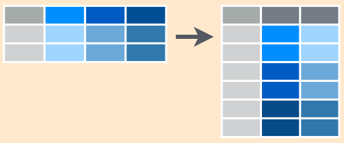
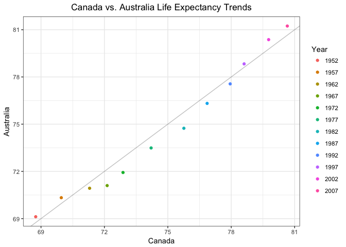
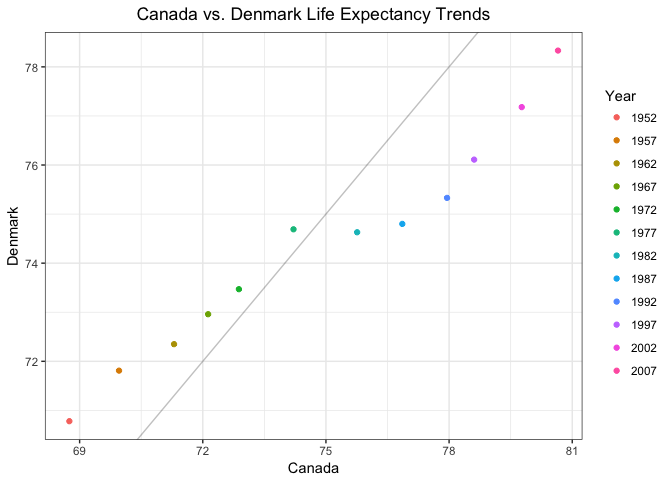
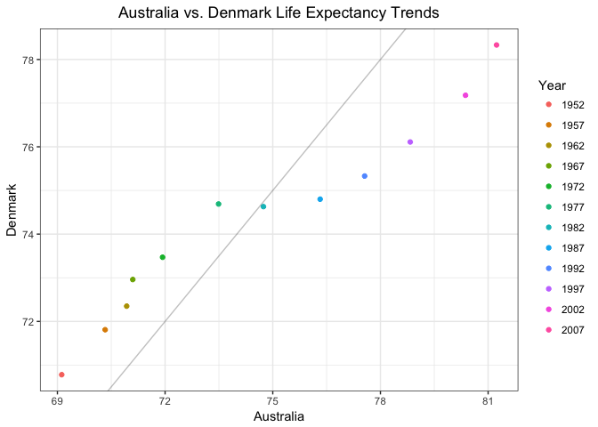
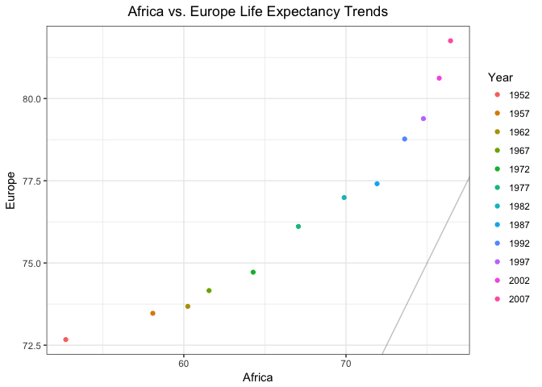
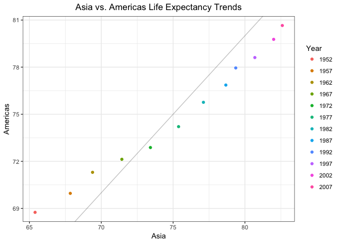

Homework 04: Tidy data and joins
================
Amanda Cheung

Putting my data wrangling skills to the test!

#### Gapminder and tidyveryse

Load gapminder and tidyverse.

``` r
suppressPackageStartupMessages(library(gapminder))
suppressPackageStartupMessages(library(tidyverse))
```

General data reshaping and relationship to aggregation
------------------------------------------------------

**Problem:** You have data in one “shape”, but you wish it were in another...

**Solution:** Reshape your data! Use `gather()` and `spread()` from `tidyr` for simple reshaping!

Activity 1: `tidyr` cheatsheet
------------------------------

A minimal cheatsheet. Check out the [R studio version](https://www.rstudio.com/wp-content/uploads/2015/02/data-wrangling-cheatsheet.pdf), for a more comprehensive one.

### Main functions: `gather()` and `spread()`

| `tidyr` function | action                           |
|------------------|----------------------------------|
| `gather()`       | long format :arrow\_up\_down:    |
| `spread()`       | wide format :left\_right\_arrow: |

### Example data

``` r
## Creating a data frame about students' grades
student <- c('A', 'B', 'C')
biology <- c(88, 90, 75)
chemistry <- c(95, 85, 90)
french <- c(83, 77, 85) 

ex.data <- data.frame(student, biology, chemistry, french) 

knitr::kable(ex.data)
```

| student |  biology|  chemistry|  french|
|:--------|--------:|----------:|-------:|
| A       |       88|         95|      83|
| B       |       90|         85|      77|
| C       |       75|         90|      85|

### `gather()`

Gather columns into rows.



``` r
knitr::kable(ex.data %>%
               gather(key=subject, value=grade, biology:french))
```

| student | subject   |  grade|
|:--------|:----------|------:|
| A       | biology   |     88|
| B       | biology   |     90|
| C       | biology   |     75|
| A       | chemistry |     95|
| B       | chemistry |     85|
| C       | chemistry |     90|
| A       | french    |     83|
| B       | french    |     77|
| C       | french    |     85|

``` r
## Alternative ways to call gather()
## gather(subject, grade, biology:french)
## gather(subject, grade, -c(student))
## gather(subject, grade, biology, chemistry, french)
```

### `spread()`

Spread rows into columns.


``` r
knitr::kable(ex.data %>%
               gather(key=subject, value=grade, biology:french) %>% 
               spread(key=subject, value=grade))
```

| student |  biology|  chemistry|  french|
|:--------|--------:|----------:|-------:|
| A       |       88|         95|      83|
| B       |       90|         85|      77|
| C       |       75|         90|      85|

Activity 2: Exploring life expectancy
-------------------------------------

### Tibble: One row per year and columns for life expectancy for two or more countries

``` r
lifeExp.tbl <- gapminder %>%
  filter(country %in% c('Australia', 'Canada', 'Denmark')) %>% 
  select(year, country, lifeExp) %>% 
  spread(country, lifeExp) ## Spread rows into columns of country and their respective life expectancy

knitr::kable(lifeExp.tbl)
```

|  year|  Australia|  Canada|  Denmark|
|-----:|----------:|-------:|--------:|
|  1952|     69.120|  68.750|   70.780|
|  1957|     70.330|  69.960|   71.810|
|  1962|     70.930|  71.300|   72.350|
|  1967|     71.100|  72.130|   72.960|
|  1972|     71.930|  72.880|   73.470|
|  1977|     73.490|  74.210|   74.690|
|  1982|     74.740|  75.760|   74.630|
|  1987|     76.320|  76.860|   74.800|
|  1992|     77.560|  77.950|   75.330|
|  1997|     78.830|  78.610|   76.110|
|  2002|     80.370|  79.770|   77.180|
|  2007|     81.235|  80.653|   78.332|

### Scatterplot: Life expectancy for one country against that of another using the new data shape created above

``` r
ggplot(lifeExp.tbl, aes(x=Canada, y=Australia)) + 
  geom_point(aes(colour=factor(year))) +
  geom_abline(alpha=0.25) +
  theme_bw() +
  labs(title='Canada vs. Australia Life Expectancy Trends') +
  scale_color_discrete("Year") +
  theme(plot.title=element_text(hjust=0.5))
```



The life expectancy between Canada and Australia are quite similar. The line where life expectancy is the same for both countries is showed. Points above this line indicate the country on the y-axis (Australia) has a higher life expectancy than the country on the x-axis (Canada) at a specific point in time (and vice versa).

``` r
ggplot(lifeExp.tbl, aes(x=Canada, y=Denmark)) + 
  geom_point(aes(colour=factor(year))) +
  geom_abline(alpha=0.25) +
  theme_bw() +
  labs(title='Canada vs. Denmark Life Expectancy Trends') +
  scale_color_discrete("Year") +
  theme(plot.title=element_text(hjust=0.5))
```



``` r
ggplot(lifeExp.tbl, aes(x=Australia, y=Denmark)) + 
  geom_point(aes(colour=factor(year))) +
  geom_abline(alpha=0.25) +
  theme_bw() +
  labs(title='Australia vs. Denmark Life Expectancy Trends') +
  scale_color_discrete("Year") +
  theme(plot.title=element_text(hjust=0.5))
```



Activity 3: Maximum life expectancy
-----------------------------------

### Tibble: Maximum life expectancy for all possible combinations of continent and year. One row per year and one variable for each continent.

``` r
maxlifeExp.tbl <- gapminder %>%
  group_by(year, continent) %>%
  summarize(maxlifeExp = max(lifeExp)) %>%
  spread(continent, maxlifeExp) %>%
  arrange(year)

knitr::kable(maxlifeExp.tbl)
```

|  year|  Africa|  Americas|    Asia|  Europe|  Oceania|
|-----:|-------:|---------:|-------:|-------:|--------:|
|  1952|  52.724|    68.750|  65.390|  72.670|   69.390|
|  1957|  58.089|    69.960|  67.840|  73.470|   70.330|
|  1962|  60.246|    71.300|  69.390|  73.680|   71.240|
|  1967|  61.557|    72.130|  71.430|  74.160|   71.520|
|  1972|  64.274|    72.880|  73.420|  74.720|   71.930|
|  1977|  67.064|    74.210|  75.380|  76.110|   73.490|
|  1982|  69.885|    75.760|  77.110|  76.990|   74.740|
|  1987|  71.913|    76.860|  78.670|  77.410|   76.320|
|  1992|  73.615|    77.950|  79.360|  78.770|   77.560|
|  1997|  74.772|    78.610|  80.690|  79.390|   78.830|
|  2002|  75.744|    79.770|  82.000|  80.620|   80.370|
|  2007|  76.442|    80.653|  82.603|  81.757|   81.235|

### Scatterplot: Life expectancy for one continent against that of another using the new data shape

It is easier to make a scatterplot comparing one continent against another with the new data shape.

``` r
ggplot(maxlifeExp.tbl, aes(x=Africa, y=Europe)) + 
  geom_point(aes(colour=factor(year))) +
  geom_abline(alpha=0.25) +
  theme_bw() +
  labs(title='Africa vs. Europe Life Expectancy Trends') +
  scale_color_discrete("Year") +
  theme(plot.title=element_text(hjust=0.5))
```



Europe has a higher life expectancy than Africa.

``` r
ggplot(maxlifeExp.tbl, aes(x=Asia, y=Americas)) + 
  geom_point(aes(colour=factor(year))) +
  geom_abline(alpha=0.25) +
  theme_bw() +
  labs(title='Asia vs. Americas Life Expectancy Trends') +
  scale_color_discrete("Year") +
  theme(plot.title=element_text(hjust=0.5))
```



The life expectancy in Asia becomes greater than the Americas over time.

Activity 4: A table giving the country with both the lowest and highest life expectancy for all continents and reshape it so you have one row per year
------------------------------------------------------------------------------------------------------------------------------------------------------

``` r
continent.tbl <- gapminder %>%
  select(year, continent, country, lifeExp) %>%
  group_by(year, continent) %>%
  filter(min_rank(desc(lifeExp)) < 2 | min_rank(lifeExp) < 2) %>% 
  arrange(year, continent, lifeExp) %>% 
  ## Paste the min and max life expectancy with the corresponding country for each continent
  summarize(country_combined = paste(country, lifeExp, collapse=", ")) %>% 
  spread(continent, country_combined)

knitr::kable(continent.tbl)
```

|  year| Africa                                | Americas                     | Asia                             | Europe                           | Oceania                              |
|-----:|:--------------------------------------|:-----------------------------|:---------------------------------|:---------------------------------|:-------------------------------------|
|  1952| Gambia 30, Reunion 52.724             | Haiti 37.579, Canada 68.75   | Afghanistan 28.801, Israel 65.39 | Turkey 43.585, Norway 72.67      | Australia 69.12, New Zealand 69.39   |
|  1957| Sierra Leone 31.57, Mauritius 58.089  | Haiti 40.696, Canada 69.96   | Afghanistan 30.332, Israel 67.84 | Turkey 48.079, Iceland 73.47     | New Zealand 70.26, Australia 70.33   |
|  1962| Sierra Leone 32.767, Mauritius 60.246 | Bolivia 43.428, Canada 71.3  | Afghanistan 31.997, Israel 69.39 | Turkey 52.098, Iceland 73.68     | Australia 70.93, New Zealand 71.24   |
|  1967| Sierra Leone 34.113, Mauritius 61.557 | Bolivia 45.032, Canada 72.13 | Afghanistan 34.02, Japan 71.43   | Turkey 54.336, Sweden 74.16      | Australia 71.1, New Zealand 71.52    |
|  1972| Sierra Leone 35.4, Reunion 64.274     | Bolivia 46.714, Canada 72.88 | Afghanistan 36.088, Japan 73.42  | Turkey 57.005, Sweden 74.72      | New Zealand 71.89, Australia 71.93   |
|  1977| Sierra Leone 36.788, Reunion 67.064   | Haiti 49.923, Canada 74.21   | Cambodia 31.22, Japan 75.38      | Turkey 59.507, Iceland 76.11     | New Zealand 72.22, Australia 73.49   |
|  1982| Sierra Leone 38.445, Reunion 69.885   | Haiti 51.461, Canada 75.76   | Afghanistan 39.854, Japan 77.11  | Turkey 61.036, Iceland 76.99     | New Zealand 73.84, Australia 74.74   |
|  1987| Angola 39.906, Reunion 71.913         | Haiti 53.636, Canada 76.86   | Afghanistan 40.822, Japan 78.67  | Turkey 63.108, Switzerland 77.41 | New Zealand 74.32, Australia 76.32   |
|  1992| Rwanda 23.599, Reunion 73.615         | Haiti 55.089, Canada 77.95   | Afghanistan 41.674, Japan 79.36  | Turkey 66.146, Iceland 78.77     | New Zealand 76.33, Australia 77.56   |
|  1997| Rwanda 36.087, Reunion 74.772         | Haiti 56.671, Canada 78.61   | Afghanistan 41.763, Japan 80.69  | Turkey 68.835, Sweden 79.39      | New Zealand 77.55, Australia 78.83   |
|  2002| Zambia 39.193, Reunion 75.744         | Haiti 58.137, Canada 79.77   | Afghanistan 42.129, Japan 82     | Turkey 70.845, Switzerland 80.62 | New Zealand 79.11, Australia 80.37   |
|  2007| Swaziland 39.613, Reunion 76.442      | Haiti 60.916, Canada 80.653  | Afghanistan 43.828, Japan 82.603 | Turkey 71.777, Iceland 81.757    | New Zealand 80.204, Australia 81.235 |

Join, merge, look up
--------------------

**Problem:** You have two data sources and you need info from both in one new data object.

**Solution:** Perform a join, which borrows terminology from the database world, specifically SQL.

Activity 1: Create a second data frame, complementary to Gapminder. Join this with (part of) Gapminder using a `dplyr` join function and make some observations about the process and result. Explore the different types of joins.
-----------------------------------------------------------------------------------------------------------------------------------------------------------------------------------------------------------------------------------

A second data frame with one row per country, and capital city and language spoken as variables.

``` r
country <- c('Argentina', 'Austria', 'Bangladesh', 'Chad', 
             'Ecuador', 'Gambia', 'Italy', 'Nepal', 
             'New Zealand', 'Switzerland', 'Taiwan', 'United Kingdom')
capital_city <- c('Buenos Aires', 'Vienna', 'Dhaka', "N'Djamena", 
                  'Quito', 'Banjul', 'Rome', 'Kathmandu',
                  'Wellington', 'Bern', 'Taipei', 'London')
language_spoken <- c('Spanish', 'German, Hungarian', 'Bengali',
                     'French, Arabic', 'Spanish', 'English',
                     'Italian', 'Nepali', 'English', 'German, French, Italian, Romansh',
                     'Mandarin Chinese', 'English')

country_data <- data.frame(country, capital_city, language_spoken) 

knitr::kable(country_data)
```

| country        | capital\_city | language\_spoken                 |
|:---------------|:--------------|:---------------------------------|
| Argentina      | Buenos Aires  | Spanish                          |
| Austria        | Vienna        | German, Hungarian                |
| Bangladesh     | Dhaka         | Bengali                          |
| Chad           | N'Djamena     | French, Arabic                   |
| Ecuador        | Quito         | Spanish                          |
| Gambia         | Banjul        | English                          |
| Italy          | Rome          | Italian                          |
| Nepal          | Kathmandu     | Nepali                           |
| New Zealand    | Wellington    | English                          |
| Switzerland    | Bern          | German, French, Italian, Romansh |
| Taiwan         | Taipei        | Mandarin Chinese                 |
| United Kingdom | London        | English                          |

### `left_join()`

``` r
left_join(gapminder, country_data)
```

    ## Joining, by = "country"

    ## Warning: Column `country` joining factors with different levels, coercing
    ## to character vector

    ## # A tibble: 1,704 x 8
    ##        country continent  year lifeExp      pop gdpPercap capital_city
    ##          <chr>    <fctr> <int>   <dbl>    <int>     <dbl>       <fctr>
    ##  1 Afghanistan      Asia  1952  28.801  8425333  779.4453         <NA>
    ##  2 Afghanistan      Asia  1957  30.332  9240934  820.8530         <NA>
    ##  3 Afghanistan      Asia  1962  31.997 10267083  853.1007         <NA>
    ##  4 Afghanistan      Asia  1967  34.020 11537966  836.1971         <NA>
    ##  5 Afghanistan      Asia  1972  36.088 13079460  739.9811         <NA>
    ##  6 Afghanistan      Asia  1977  38.438 14880372  786.1134         <NA>
    ##  7 Afghanistan      Asia  1982  39.854 12881816  978.0114         <NA>
    ##  8 Afghanistan      Asia  1987  40.822 13867957  852.3959         <NA>
    ##  9 Afghanistan      Asia  1992  41.674 16317921  649.3414         <NA>
    ## 10 Afghanistan      Asia  1997  41.763 22227415  635.3414         <NA>
    ## # ... with 1,694 more rows, and 1 more variables: language_spoken <fctr>

Returns all rows from `gapminder`, and all columns from `gapminder` and `country_data`. Countries that do not appear in `country_data` have an `NA` for `capital_city` and `language_spoken`. Mutating join.

``` r
left_join(country_data, gapminder)
```

    ## Joining, by = "country"

    ## Warning: Column `country` joining factors with different levels, coercing
    ## to character vector

    ##            country capital_city                  language_spoken continent
    ## 1        Argentina Buenos Aires                          Spanish  Americas
    ## 2        Argentina Buenos Aires                          Spanish  Americas
    ## 3        Argentina Buenos Aires                          Spanish  Americas
    ## 4        Argentina Buenos Aires                          Spanish  Americas
    ## 5        Argentina Buenos Aires                          Spanish  Americas
    ## 6        Argentina Buenos Aires                          Spanish  Americas
    ## 7        Argentina Buenos Aires                          Spanish  Americas
    ## 8        Argentina Buenos Aires                          Spanish  Americas
    ## 9        Argentina Buenos Aires                          Spanish  Americas
    ## 10       Argentina Buenos Aires                          Spanish  Americas
    ## 11       Argentina Buenos Aires                          Spanish  Americas
    ## 12       Argentina Buenos Aires                          Spanish  Americas
    ## 13         Austria       Vienna                German, Hungarian    Europe
    ## 14         Austria       Vienna                German, Hungarian    Europe
    ## 15         Austria       Vienna                German, Hungarian    Europe
    ## 16         Austria       Vienna                German, Hungarian    Europe
    ## 17         Austria       Vienna                German, Hungarian    Europe
    ## 18         Austria       Vienna                German, Hungarian    Europe
    ## 19         Austria       Vienna                German, Hungarian    Europe
    ## 20         Austria       Vienna                German, Hungarian    Europe
    ## 21         Austria       Vienna                German, Hungarian    Europe
    ## 22         Austria       Vienna                German, Hungarian    Europe
    ## 23         Austria       Vienna                German, Hungarian    Europe
    ## 24         Austria       Vienna                German, Hungarian    Europe
    ## 25      Bangladesh        Dhaka                          Bengali      Asia
    ## 26      Bangladesh        Dhaka                          Bengali      Asia
    ## 27      Bangladesh        Dhaka                          Bengali      Asia
    ## 28      Bangladesh        Dhaka                          Bengali      Asia
    ## 29      Bangladesh        Dhaka                          Bengali      Asia
    ## 30      Bangladesh        Dhaka                          Bengali      Asia
    ## 31      Bangladesh        Dhaka                          Bengali      Asia
    ## 32      Bangladesh        Dhaka                          Bengali      Asia
    ## 33      Bangladesh        Dhaka                          Bengali      Asia
    ## 34      Bangladesh        Dhaka                          Bengali      Asia
    ## 35      Bangladesh        Dhaka                          Bengali      Asia
    ## 36      Bangladesh        Dhaka                          Bengali      Asia
    ## 37            Chad    N'Djamena                   French, Arabic    Africa
    ## 38            Chad    N'Djamena                   French, Arabic    Africa
    ## 39            Chad    N'Djamena                   French, Arabic    Africa
    ## 40            Chad    N'Djamena                   French, Arabic    Africa
    ## 41            Chad    N'Djamena                   French, Arabic    Africa
    ## 42            Chad    N'Djamena                   French, Arabic    Africa
    ## 43            Chad    N'Djamena                   French, Arabic    Africa
    ## 44            Chad    N'Djamena                   French, Arabic    Africa
    ## 45            Chad    N'Djamena                   French, Arabic    Africa
    ## 46            Chad    N'Djamena                   French, Arabic    Africa
    ## 47            Chad    N'Djamena                   French, Arabic    Africa
    ## 48            Chad    N'Djamena                   French, Arabic    Africa
    ## 49         Ecuador        Quito                          Spanish  Americas
    ## 50         Ecuador        Quito                          Spanish  Americas
    ## 51         Ecuador        Quito                          Spanish  Americas
    ## 52         Ecuador        Quito                          Spanish  Americas
    ## 53         Ecuador        Quito                          Spanish  Americas
    ## 54         Ecuador        Quito                          Spanish  Americas
    ## 55         Ecuador        Quito                          Spanish  Americas
    ## 56         Ecuador        Quito                          Spanish  Americas
    ## 57         Ecuador        Quito                          Spanish  Americas
    ## 58         Ecuador        Quito                          Spanish  Americas
    ## 59         Ecuador        Quito                          Spanish  Americas
    ## 60         Ecuador        Quito                          Spanish  Americas
    ## 61          Gambia       Banjul                          English    Africa
    ## 62          Gambia       Banjul                          English    Africa
    ## 63          Gambia       Banjul                          English    Africa
    ## 64          Gambia       Banjul                          English    Africa
    ## 65          Gambia       Banjul                          English    Africa
    ## 66          Gambia       Banjul                          English    Africa
    ## 67          Gambia       Banjul                          English    Africa
    ## 68          Gambia       Banjul                          English    Africa
    ## 69          Gambia       Banjul                          English    Africa
    ## 70          Gambia       Banjul                          English    Africa
    ## 71          Gambia       Banjul                          English    Africa
    ## 72          Gambia       Banjul                          English    Africa
    ## 73           Italy         Rome                          Italian    Europe
    ## 74           Italy         Rome                          Italian    Europe
    ## 75           Italy         Rome                          Italian    Europe
    ## 76           Italy         Rome                          Italian    Europe
    ## 77           Italy         Rome                          Italian    Europe
    ## 78           Italy         Rome                          Italian    Europe
    ## 79           Italy         Rome                          Italian    Europe
    ## 80           Italy         Rome                          Italian    Europe
    ## 81           Italy         Rome                          Italian    Europe
    ## 82           Italy         Rome                          Italian    Europe
    ## 83           Italy         Rome                          Italian    Europe
    ## 84           Italy         Rome                          Italian    Europe
    ## 85           Nepal    Kathmandu                           Nepali      Asia
    ## 86           Nepal    Kathmandu                           Nepali      Asia
    ## 87           Nepal    Kathmandu                           Nepali      Asia
    ## 88           Nepal    Kathmandu                           Nepali      Asia
    ## 89           Nepal    Kathmandu                           Nepali      Asia
    ## 90           Nepal    Kathmandu                           Nepali      Asia
    ## 91           Nepal    Kathmandu                           Nepali      Asia
    ## 92           Nepal    Kathmandu                           Nepali      Asia
    ## 93           Nepal    Kathmandu                           Nepali      Asia
    ## 94           Nepal    Kathmandu                           Nepali      Asia
    ## 95           Nepal    Kathmandu                           Nepali      Asia
    ## 96           Nepal    Kathmandu                           Nepali      Asia
    ## 97     New Zealand   Wellington                          English   Oceania
    ## 98     New Zealand   Wellington                          English   Oceania
    ## 99     New Zealand   Wellington                          English   Oceania
    ## 100    New Zealand   Wellington                          English   Oceania
    ## 101    New Zealand   Wellington                          English   Oceania
    ## 102    New Zealand   Wellington                          English   Oceania
    ## 103    New Zealand   Wellington                          English   Oceania
    ## 104    New Zealand   Wellington                          English   Oceania
    ## 105    New Zealand   Wellington                          English   Oceania
    ## 106    New Zealand   Wellington                          English   Oceania
    ## 107    New Zealand   Wellington                          English   Oceania
    ## 108    New Zealand   Wellington                          English   Oceania
    ## 109    Switzerland         Bern German, French, Italian, Romansh    Europe
    ## 110    Switzerland         Bern German, French, Italian, Romansh    Europe
    ## 111    Switzerland         Bern German, French, Italian, Romansh    Europe
    ## 112    Switzerland         Bern German, French, Italian, Romansh    Europe
    ## 113    Switzerland         Bern German, French, Italian, Romansh    Europe
    ## 114    Switzerland         Bern German, French, Italian, Romansh    Europe
    ## 115    Switzerland         Bern German, French, Italian, Romansh    Europe
    ## 116    Switzerland         Bern German, French, Italian, Romansh    Europe
    ## 117    Switzerland         Bern German, French, Italian, Romansh    Europe
    ## 118    Switzerland         Bern German, French, Italian, Romansh    Europe
    ## 119    Switzerland         Bern German, French, Italian, Romansh    Europe
    ## 120    Switzerland         Bern German, French, Italian, Romansh    Europe
    ## 121         Taiwan       Taipei                 Mandarin Chinese      Asia
    ## 122         Taiwan       Taipei                 Mandarin Chinese      Asia
    ## 123         Taiwan       Taipei                 Mandarin Chinese      Asia
    ## 124         Taiwan       Taipei                 Mandarin Chinese      Asia
    ## 125         Taiwan       Taipei                 Mandarin Chinese      Asia
    ## 126         Taiwan       Taipei                 Mandarin Chinese      Asia
    ## 127         Taiwan       Taipei                 Mandarin Chinese      Asia
    ## 128         Taiwan       Taipei                 Mandarin Chinese      Asia
    ## 129         Taiwan       Taipei                 Mandarin Chinese      Asia
    ## 130         Taiwan       Taipei                 Mandarin Chinese      Asia
    ## 131         Taiwan       Taipei                 Mandarin Chinese      Asia
    ## 132         Taiwan       Taipei                 Mandarin Chinese      Asia
    ## 133 United Kingdom       London                          English    Europe
    ## 134 United Kingdom       London                          English    Europe
    ## 135 United Kingdom       London                          English    Europe
    ## 136 United Kingdom       London                          English    Europe
    ## 137 United Kingdom       London                          English    Europe
    ## 138 United Kingdom       London                          English    Europe
    ## 139 United Kingdom       London                          English    Europe
    ## 140 United Kingdom       London                          English    Europe
    ## 141 United Kingdom       London                          English    Europe
    ## 142 United Kingdom       London                          English    Europe
    ## 143 United Kingdom       London                          English    Europe
    ## 144 United Kingdom       London                          English    Europe
    ##     year lifeExp       pop  gdpPercap
    ## 1   1952  62.485  17876956  5911.3151
    ## 2   1957  64.399  19610538  6856.8562
    ## 3   1962  65.142  21283783  7133.1660
    ## 4   1967  65.634  22934225  8052.9530
    ## 5   1972  67.065  24779799  9443.0385
    ## 6   1977  68.481  26983828 10079.0267
    ## 7   1982  69.942  29341374  8997.8974
    ## 8   1987  70.774  31620918  9139.6714
    ## 9   1992  71.868  33958947  9308.4187
    ## 10  1997  73.275  36203463 10967.2820
    ## 11  2002  74.340  38331121  8797.6407
    ## 12  2007  75.320  40301927 12779.3796
    ## 13  1952  66.800   6927772  6137.0765
    ## 14  1957  67.480   6965860  8842.5980
    ## 15  1962  69.540   7129864 10750.7211
    ## 16  1967  70.140   7376998 12834.6024
    ## 17  1972  70.630   7544201 16661.6256
    ## 18  1977  72.170   7568430 19749.4223
    ## 19  1982  73.180   7574613 21597.0836
    ## 20  1987  74.940   7578903 23687.8261
    ## 21  1992  76.040   7914969 27042.0187
    ## 22  1997  77.510   8069876 29095.9207
    ## 23  2002  78.980   8148312 32417.6077
    ## 24  2007  79.829   8199783 36126.4927
    ## 25  1952  37.484  46886859   684.2442
    ## 26  1957  39.348  51365468   661.6375
    ## 27  1962  41.216  56839289   686.3416
    ## 28  1967  43.453  62821884   721.1861
    ## 29  1972  45.252  70759295   630.2336
    ## 30  1977  46.923  80428306   659.8772
    ## 31  1982  50.009  93074406   676.9819
    ## 32  1987  52.819 103764241   751.9794
    ## 33  1992  56.018 113704579   837.8102
    ## 34  1997  59.412 123315288   972.7700
    ## 35  2002  62.013 135656790  1136.3904
    ## 36  2007  64.062 150448339  1391.2538
    ## 37  1952  38.092   2682462  1178.6659
    ## 38  1957  39.881   2894855  1308.4956
    ## 39  1962  41.716   3150417  1389.8176
    ## 40  1967  43.601   3495967  1196.8106
    ## 41  1972  45.569   3899068  1104.1040
    ## 42  1977  47.383   4388260  1133.9850
    ## 43  1982  49.517   4875118   797.9081
    ## 44  1987  51.051   5498955   952.3861
    ## 45  1992  51.724   6429417  1058.0643
    ## 46  1997  51.573   7562011  1004.9614
    ## 47  2002  50.525   8835739  1156.1819
    ## 48  2007  50.651  10238807  1704.0637
    ## 49  1952  48.357   3548753  3522.1107
    ## 50  1957  51.356   4058385  3780.5467
    ## 51  1962  54.640   4681707  4086.1141
    ## 52  1967  56.678   5432424  4579.0742
    ## 53  1972  58.796   6298651  5280.9947
    ## 54  1977  61.310   7278866  6679.6233
    ## 55  1982  64.342   8365850  7213.7913
    ## 56  1987  67.231   9545158  6481.7770
    ## 57  1992  69.613  10748394  7103.7026
    ## 58  1997  72.312  11911819  7429.4559
    ## 59  2002  74.173  12921234  5773.0445
    ## 60  2007  74.994  13755680  6873.2623
    ## 61  1952  30.000    284320   485.2307
    ## 62  1957  32.065    323150   520.9267
    ## 63  1962  33.896    374020   599.6503
    ## 64  1967  35.857    439593   734.7829
    ## 65  1972  38.308    517101   756.0868
    ## 66  1977  41.842    608274   884.7553
    ## 67  1982  45.580    715523   835.8096
    ## 68  1987  49.265    848406   611.6589
    ## 69  1992  52.644   1025384   665.6244
    ## 70  1997  55.861   1235767   653.7302
    ## 71  2002  58.041   1457766   660.5856
    ## 72  2007  59.448   1688359   752.7497
    ## 73  1952  65.940  47666000  4931.4042
    ## 74  1957  67.810  49182000  6248.6562
    ## 75  1962  69.240  50843200  8243.5823
    ## 76  1967  71.060  52667100 10022.4013
    ## 77  1972  72.190  54365564 12269.2738
    ## 78  1977  73.480  56059245 14255.9847
    ## 79  1982  74.980  56535636 16537.4835
    ## 80  1987  76.420  56729703 19207.2348
    ## 81  1992  77.440  56840847 22013.6449
    ## 82  1997  78.820  57479469 24675.0245
    ## 83  2002  80.240  57926999 27968.0982
    ## 84  2007  80.546  58147733 28569.7197
    ## 85  1952  36.157   9182536   545.8657
    ## 86  1957  37.686   9682338   597.9364
    ## 87  1962  39.393  10332057   652.3969
    ## 88  1967  41.472  11261690   676.4422
    ## 89  1972  43.971  12412593   674.7881
    ## 90  1977  46.748  13933198   694.1124
    ## 91  1982  49.594  15796314   718.3731
    ## 92  1987  52.537  17917180   775.6325
    ## 93  1992  55.727  20326209   897.7404
    ## 94  1997  59.426  23001113  1010.8921
    ## 95  2002  61.340  25873917  1057.2063
    ## 96  2007  63.785  28901790  1091.3598
    ## 97  1952  69.390   1994794 10556.5757
    ## 98  1957  70.260   2229407 12247.3953
    ## 99  1962  71.240   2488550 13175.6780
    ## 100 1967  71.520   2728150 14463.9189
    ## 101 1972  71.890   2929100 16046.0373
    ## 102 1977  72.220   3164900 16233.7177
    ## 103 1982  73.840   3210650 17632.4104
    ## 104 1987  74.320   3317166 19007.1913
    ## 105 1992  76.330   3437674 18363.3249
    ## 106 1997  77.550   3676187 21050.4138
    ## 107 2002  79.110   3908037 23189.8014
    ## 108 2007  80.204   4115771 25185.0091
    ## 109 1952  69.620   4815000 14734.2327
    ## 110 1957  70.560   5126000 17909.4897
    ## 111 1962  71.320   5666000 20431.0927
    ## 112 1967  72.770   6063000 22966.1443
    ## 113 1972  73.780   6401400 27195.1130
    ## 114 1977  75.390   6316424 26982.2905
    ## 115 1982  76.210   6468126 28397.7151
    ## 116 1987  77.410   6649942 30281.7046
    ## 117 1992  78.030   6995447 31871.5303
    ## 118 1997  79.370   7193761 32135.3230
    ## 119 2002  80.620   7361757 34480.9577
    ## 120 2007  81.701   7554661 37506.4191
    ## 121 1952  58.500   8550362  1206.9479
    ## 122 1957  62.400  10164215  1507.8613
    ## 123 1962  65.200  11918938  1822.8790
    ## 124 1967  67.500  13648692  2643.8587
    ## 125 1972  69.390  15226039  4062.5239
    ## 126 1977  70.590  16785196  5596.5198
    ## 127 1982  72.160  18501390  7426.3548
    ## 128 1987  73.400  19757799 11054.5618
    ## 129 1992  74.260  20686918 15215.6579
    ## 130 1997  75.250  21628605 20206.8210
    ## 131 2002  76.990  22454239 23235.4233
    ## 132 2007  78.400  23174294 28718.2768
    ## 133 1952  69.180  50430000  9979.5085
    ## 134 1957  70.420  51430000 11283.1779
    ## 135 1962  70.760  53292000 12477.1771
    ## 136 1967  71.360  54959000 14142.8509
    ## 137 1972  72.010  56079000 15895.1164
    ## 138 1977  72.760  56179000 17428.7485
    ## 139 1982  74.040  56339704 18232.4245
    ## 140 1987  75.007  56981620 21664.7877
    ## 141 1992  76.420  57866349 22705.0925
    ## 142 1997  77.218  58808266 26074.5314
    ## 143 2002  78.471  59912431 29478.9992
    ## 144 2007  79.425  60776238 33203.2613

Returns all rows from `country_data`, and all columns from `country_data` and `gapminder`. Only countries that appear in `country_data` are included. Mutating join.

### `inner_join()`

``` r
inner_join(gapminder, country_data)
```

    ## Joining, by = "country"

    ## Warning: Column `country` joining factors with different levels, coercing
    ## to character vector

    ## # A tibble: 144 x 8
    ##      country continent  year lifeExp      pop gdpPercap capital_city
    ##        <chr>    <fctr> <int>   <dbl>    <int>     <dbl>       <fctr>
    ##  1 Argentina  Americas  1952  62.485 17876956  5911.315 Buenos Aires
    ##  2 Argentina  Americas  1957  64.399 19610538  6856.856 Buenos Aires
    ##  3 Argentina  Americas  1962  65.142 21283783  7133.166 Buenos Aires
    ##  4 Argentina  Americas  1967  65.634 22934225  8052.953 Buenos Aires
    ##  5 Argentina  Americas  1972  67.065 24779799  9443.039 Buenos Aires
    ##  6 Argentina  Americas  1977  68.481 26983828 10079.027 Buenos Aires
    ##  7 Argentina  Americas  1982  69.942 29341374  8997.897 Buenos Aires
    ##  8 Argentina  Americas  1987  70.774 31620918  9139.671 Buenos Aires
    ##  9 Argentina  Americas  1992  71.868 33958947  9308.419 Buenos Aires
    ## 10 Argentina  Americas  1997  73.275 36203463 10967.282 Buenos Aires
    ## # ... with 134 more rows, and 1 more variables: language_spoken <fctr>

Returns all rows from `gapminder` that appear in `country_data`, and all columns from both data frames. Similar to `left_join(country_data, gapminder)`. Mutating join.

``` r
inner_join(country_data, gapminder)
```

    ## Joining, by = "country"

    ## Warning: Column `country` joining factors with different levels, coercing
    ## to character vector

    ##            country capital_city                  language_spoken continent
    ## 1        Argentina Buenos Aires                          Spanish  Americas
    ## 2        Argentina Buenos Aires                          Spanish  Americas
    ## 3        Argentina Buenos Aires                          Spanish  Americas
    ## 4        Argentina Buenos Aires                          Spanish  Americas
    ## 5        Argentina Buenos Aires                          Spanish  Americas
    ## 6        Argentina Buenos Aires                          Spanish  Americas
    ## 7        Argentina Buenos Aires                          Spanish  Americas
    ## 8        Argentina Buenos Aires                          Spanish  Americas
    ## 9        Argentina Buenos Aires                          Spanish  Americas
    ## 10       Argentina Buenos Aires                          Spanish  Americas
    ## 11       Argentina Buenos Aires                          Spanish  Americas
    ## 12       Argentina Buenos Aires                          Spanish  Americas
    ## 13         Austria       Vienna                German, Hungarian    Europe
    ## 14         Austria       Vienna                German, Hungarian    Europe
    ## 15         Austria       Vienna                German, Hungarian    Europe
    ## 16         Austria       Vienna                German, Hungarian    Europe
    ## 17         Austria       Vienna                German, Hungarian    Europe
    ## 18         Austria       Vienna                German, Hungarian    Europe
    ## 19         Austria       Vienna                German, Hungarian    Europe
    ## 20         Austria       Vienna                German, Hungarian    Europe
    ## 21         Austria       Vienna                German, Hungarian    Europe
    ## 22         Austria       Vienna                German, Hungarian    Europe
    ## 23         Austria       Vienna                German, Hungarian    Europe
    ## 24         Austria       Vienna                German, Hungarian    Europe
    ## 25      Bangladesh        Dhaka                          Bengali      Asia
    ## 26      Bangladesh        Dhaka                          Bengali      Asia
    ## 27      Bangladesh        Dhaka                          Bengali      Asia
    ## 28      Bangladesh        Dhaka                          Bengali      Asia
    ## 29      Bangladesh        Dhaka                          Bengali      Asia
    ## 30      Bangladesh        Dhaka                          Bengali      Asia
    ## 31      Bangladesh        Dhaka                          Bengali      Asia
    ## 32      Bangladesh        Dhaka                          Bengali      Asia
    ## 33      Bangladesh        Dhaka                          Bengali      Asia
    ## 34      Bangladesh        Dhaka                          Bengali      Asia
    ## 35      Bangladesh        Dhaka                          Bengali      Asia
    ## 36      Bangladesh        Dhaka                          Bengali      Asia
    ## 37            Chad    N'Djamena                   French, Arabic    Africa
    ## 38            Chad    N'Djamena                   French, Arabic    Africa
    ## 39            Chad    N'Djamena                   French, Arabic    Africa
    ## 40            Chad    N'Djamena                   French, Arabic    Africa
    ## 41            Chad    N'Djamena                   French, Arabic    Africa
    ## 42            Chad    N'Djamena                   French, Arabic    Africa
    ## 43            Chad    N'Djamena                   French, Arabic    Africa
    ## 44            Chad    N'Djamena                   French, Arabic    Africa
    ## 45            Chad    N'Djamena                   French, Arabic    Africa
    ## 46            Chad    N'Djamena                   French, Arabic    Africa
    ## 47            Chad    N'Djamena                   French, Arabic    Africa
    ## 48            Chad    N'Djamena                   French, Arabic    Africa
    ## 49         Ecuador        Quito                          Spanish  Americas
    ## 50         Ecuador        Quito                          Spanish  Americas
    ## 51         Ecuador        Quito                          Spanish  Americas
    ## 52         Ecuador        Quito                          Spanish  Americas
    ## 53         Ecuador        Quito                          Spanish  Americas
    ## 54         Ecuador        Quito                          Spanish  Americas
    ## 55         Ecuador        Quito                          Spanish  Americas
    ## 56         Ecuador        Quito                          Spanish  Americas
    ## 57         Ecuador        Quito                          Spanish  Americas
    ## 58         Ecuador        Quito                          Spanish  Americas
    ## 59         Ecuador        Quito                          Spanish  Americas
    ## 60         Ecuador        Quito                          Spanish  Americas
    ## 61          Gambia       Banjul                          English    Africa
    ## 62          Gambia       Banjul                          English    Africa
    ## 63          Gambia       Banjul                          English    Africa
    ## 64          Gambia       Banjul                          English    Africa
    ## 65          Gambia       Banjul                          English    Africa
    ## 66          Gambia       Banjul                          English    Africa
    ## 67          Gambia       Banjul                          English    Africa
    ## 68          Gambia       Banjul                          English    Africa
    ## 69          Gambia       Banjul                          English    Africa
    ## 70          Gambia       Banjul                          English    Africa
    ## 71          Gambia       Banjul                          English    Africa
    ## 72          Gambia       Banjul                          English    Africa
    ## 73           Italy         Rome                          Italian    Europe
    ## 74           Italy         Rome                          Italian    Europe
    ## 75           Italy         Rome                          Italian    Europe
    ## 76           Italy         Rome                          Italian    Europe
    ## 77           Italy         Rome                          Italian    Europe
    ## 78           Italy         Rome                          Italian    Europe
    ## 79           Italy         Rome                          Italian    Europe
    ## 80           Italy         Rome                          Italian    Europe
    ## 81           Italy         Rome                          Italian    Europe
    ## 82           Italy         Rome                          Italian    Europe
    ## 83           Italy         Rome                          Italian    Europe
    ## 84           Italy         Rome                          Italian    Europe
    ## 85           Nepal    Kathmandu                           Nepali      Asia
    ## 86           Nepal    Kathmandu                           Nepali      Asia
    ## 87           Nepal    Kathmandu                           Nepali      Asia
    ## 88           Nepal    Kathmandu                           Nepali      Asia
    ## 89           Nepal    Kathmandu                           Nepali      Asia
    ## 90           Nepal    Kathmandu                           Nepali      Asia
    ## 91           Nepal    Kathmandu                           Nepali      Asia
    ## 92           Nepal    Kathmandu                           Nepali      Asia
    ## 93           Nepal    Kathmandu                           Nepali      Asia
    ## 94           Nepal    Kathmandu                           Nepali      Asia
    ## 95           Nepal    Kathmandu                           Nepali      Asia
    ## 96           Nepal    Kathmandu                           Nepali      Asia
    ## 97     New Zealand   Wellington                          English   Oceania
    ## 98     New Zealand   Wellington                          English   Oceania
    ## 99     New Zealand   Wellington                          English   Oceania
    ## 100    New Zealand   Wellington                          English   Oceania
    ## 101    New Zealand   Wellington                          English   Oceania
    ## 102    New Zealand   Wellington                          English   Oceania
    ## 103    New Zealand   Wellington                          English   Oceania
    ## 104    New Zealand   Wellington                          English   Oceania
    ## 105    New Zealand   Wellington                          English   Oceania
    ## 106    New Zealand   Wellington                          English   Oceania
    ## 107    New Zealand   Wellington                          English   Oceania
    ## 108    New Zealand   Wellington                          English   Oceania
    ## 109    Switzerland         Bern German, French, Italian, Romansh    Europe
    ## 110    Switzerland         Bern German, French, Italian, Romansh    Europe
    ## 111    Switzerland         Bern German, French, Italian, Romansh    Europe
    ## 112    Switzerland         Bern German, French, Italian, Romansh    Europe
    ## 113    Switzerland         Bern German, French, Italian, Romansh    Europe
    ## 114    Switzerland         Bern German, French, Italian, Romansh    Europe
    ## 115    Switzerland         Bern German, French, Italian, Romansh    Europe
    ## 116    Switzerland         Bern German, French, Italian, Romansh    Europe
    ## 117    Switzerland         Bern German, French, Italian, Romansh    Europe
    ## 118    Switzerland         Bern German, French, Italian, Romansh    Europe
    ## 119    Switzerland         Bern German, French, Italian, Romansh    Europe
    ## 120    Switzerland         Bern German, French, Italian, Romansh    Europe
    ## 121         Taiwan       Taipei                 Mandarin Chinese      Asia
    ## 122         Taiwan       Taipei                 Mandarin Chinese      Asia
    ## 123         Taiwan       Taipei                 Mandarin Chinese      Asia
    ## 124         Taiwan       Taipei                 Mandarin Chinese      Asia
    ## 125         Taiwan       Taipei                 Mandarin Chinese      Asia
    ## 126         Taiwan       Taipei                 Mandarin Chinese      Asia
    ## 127         Taiwan       Taipei                 Mandarin Chinese      Asia
    ## 128         Taiwan       Taipei                 Mandarin Chinese      Asia
    ## 129         Taiwan       Taipei                 Mandarin Chinese      Asia
    ## 130         Taiwan       Taipei                 Mandarin Chinese      Asia
    ## 131         Taiwan       Taipei                 Mandarin Chinese      Asia
    ## 132         Taiwan       Taipei                 Mandarin Chinese      Asia
    ## 133 United Kingdom       London                          English    Europe
    ## 134 United Kingdom       London                          English    Europe
    ## 135 United Kingdom       London                          English    Europe
    ## 136 United Kingdom       London                          English    Europe
    ## 137 United Kingdom       London                          English    Europe
    ## 138 United Kingdom       London                          English    Europe
    ## 139 United Kingdom       London                          English    Europe
    ## 140 United Kingdom       London                          English    Europe
    ## 141 United Kingdom       London                          English    Europe
    ## 142 United Kingdom       London                          English    Europe
    ## 143 United Kingdom       London                          English    Europe
    ## 144 United Kingdom       London                          English    Europe
    ##     year lifeExp       pop  gdpPercap
    ## 1   1952  62.485  17876956  5911.3151
    ## 2   1957  64.399  19610538  6856.8562
    ## 3   1962  65.142  21283783  7133.1660
    ## 4   1967  65.634  22934225  8052.9530
    ## 5   1972  67.065  24779799  9443.0385
    ## 6   1977  68.481  26983828 10079.0267
    ## 7   1982  69.942  29341374  8997.8974
    ## 8   1987  70.774  31620918  9139.6714
    ## 9   1992  71.868  33958947  9308.4187
    ## 10  1997  73.275  36203463 10967.2820
    ## 11  2002  74.340  38331121  8797.6407
    ## 12  2007  75.320  40301927 12779.3796
    ## 13  1952  66.800   6927772  6137.0765
    ## 14  1957  67.480   6965860  8842.5980
    ## 15  1962  69.540   7129864 10750.7211
    ## 16  1967  70.140   7376998 12834.6024
    ## 17  1972  70.630   7544201 16661.6256
    ## 18  1977  72.170   7568430 19749.4223
    ## 19  1982  73.180   7574613 21597.0836
    ## 20  1987  74.940   7578903 23687.8261
    ## 21  1992  76.040   7914969 27042.0187
    ## 22  1997  77.510   8069876 29095.9207
    ## 23  2002  78.980   8148312 32417.6077
    ## 24  2007  79.829   8199783 36126.4927
    ## 25  1952  37.484  46886859   684.2442
    ## 26  1957  39.348  51365468   661.6375
    ## 27  1962  41.216  56839289   686.3416
    ## 28  1967  43.453  62821884   721.1861
    ## 29  1972  45.252  70759295   630.2336
    ## 30  1977  46.923  80428306   659.8772
    ## 31  1982  50.009  93074406   676.9819
    ## 32  1987  52.819 103764241   751.9794
    ## 33  1992  56.018 113704579   837.8102
    ## 34  1997  59.412 123315288   972.7700
    ## 35  2002  62.013 135656790  1136.3904
    ## 36  2007  64.062 150448339  1391.2538
    ## 37  1952  38.092   2682462  1178.6659
    ## 38  1957  39.881   2894855  1308.4956
    ## 39  1962  41.716   3150417  1389.8176
    ## 40  1967  43.601   3495967  1196.8106
    ## 41  1972  45.569   3899068  1104.1040
    ## 42  1977  47.383   4388260  1133.9850
    ## 43  1982  49.517   4875118   797.9081
    ## 44  1987  51.051   5498955   952.3861
    ## 45  1992  51.724   6429417  1058.0643
    ## 46  1997  51.573   7562011  1004.9614
    ## 47  2002  50.525   8835739  1156.1819
    ## 48  2007  50.651  10238807  1704.0637
    ## 49  1952  48.357   3548753  3522.1107
    ## 50  1957  51.356   4058385  3780.5467
    ## 51  1962  54.640   4681707  4086.1141
    ## 52  1967  56.678   5432424  4579.0742
    ## 53  1972  58.796   6298651  5280.9947
    ## 54  1977  61.310   7278866  6679.6233
    ## 55  1982  64.342   8365850  7213.7913
    ## 56  1987  67.231   9545158  6481.7770
    ## 57  1992  69.613  10748394  7103.7026
    ## 58  1997  72.312  11911819  7429.4559
    ## 59  2002  74.173  12921234  5773.0445
    ## 60  2007  74.994  13755680  6873.2623
    ## 61  1952  30.000    284320   485.2307
    ## 62  1957  32.065    323150   520.9267
    ## 63  1962  33.896    374020   599.6503
    ## 64  1967  35.857    439593   734.7829
    ## 65  1972  38.308    517101   756.0868
    ## 66  1977  41.842    608274   884.7553
    ## 67  1982  45.580    715523   835.8096
    ## 68  1987  49.265    848406   611.6589
    ## 69  1992  52.644   1025384   665.6244
    ## 70  1997  55.861   1235767   653.7302
    ## 71  2002  58.041   1457766   660.5856
    ## 72  2007  59.448   1688359   752.7497
    ## 73  1952  65.940  47666000  4931.4042
    ## 74  1957  67.810  49182000  6248.6562
    ## 75  1962  69.240  50843200  8243.5823
    ## 76  1967  71.060  52667100 10022.4013
    ## 77  1972  72.190  54365564 12269.2738
    ## 78  1977  73.480  56059245 14255.9847
    ## 79  1982  74.980  56535636 16537.4835
    ## 80  1987  76.420  56729703 19207.2348
    ## 81  1992  77.440  56840847 22013.6449
    ## 82  1997  78.820  57479469 24675.0245
    ## 83  2002  80.240  57926999 27968.0982
    ## 84  2007  80.546  58147733 28569.7197
    ## 85  1952  36.157   9182536   545.8657
    ## 86  1957  37.686   9682338   597.9364
    ## 87  1962  39.393  10332057   652.3969
    ## 88  1967  41.472  11261690   676.4422
    ## 89  1972  43.971  12412593   674.7881
    ## 90  1977  46.748  13933198   694.1124
    ## 91  1982  49.594  15796314   718.3731
    ## 92  1987  52.537  17917180   775.6325
    ## 93  1992  55.727  20326209   897.7404
    ## 94  1997  59.426  23001113  1010.8921
    ## 95  2002  61.340  25873917  1057.2063
    ## 96  2007  63.785  28901790  1091.3598
    ## 97  1952  69.390   1994794 10556.5757
    ## 98  1957  70.260   2229407 12247.3953
    ## 99  1962  71.240   2488550 13175.6780
    ## 100 1967  71.520   2728150 14463.9189
    ## 101 1972  71.890   2929100 16046.0373
    ## 102 1977  72.220   3164900 16233.7177
    ## 103 1982  73.840   3210650 17632.4104
    ## 104 1987  74.320   3317166 19007.1913
    ## 105 1992  76.330   3437674 18363.3249
    ## 106 1997  77.550   3676187 21050.4138
    ## 107 2002  79.110   3908037 23189.8014
    ## 108 2007  80.204   4115771 25185.0091
    ## 109 1952  69.620   4815000 14734.2327
    ## 110 1957  70.560   5126000 17909.4897
    ## 111 1962  71.320   5666000 20431.0927
    ## 112 1967  72.770   6063000 22966.1443
    ## 113 1972  73.780   6401400 27195.1130
    ## 114 1977  75.390   6316424 26982.2905
    ## 115 1982  76.210   6468126 28397.7151
    ## 116 1987  77.410   6649942 30281.7046
    ## 117 1992  78.030   6995447 31871.5303
    ## 118 1997  79.370   7193761 32135.3230
    ## 119 2002  80.620   7361757 34480.9577
    ## 120 2007  81.701   7554661 37506.4191
    ## 121 1952  58.500   8550362  1206.9479
    ## 122 1957  62.400  10164215  1507.8613
    ## 123 1962  65.200  11918938  1822.8790
    ## 124 1967  67.500  13648692  2643.8587
    ## 125 1972  69.390  15226039  4062.5239
    ## 126 1977  70.590  16785196  5596.5198
    ## 127 1982  72.160  18501390  7426.3548
    ## 128 1987  73.400  19757799 11054.5618
    ## 129 1992  74.260  20686918 15215.6579
    ## 130 1997  75.250  21628605 20206.8210
    ## 131 2002  76.990  22454239 23235.4233
    ## 132 2007  78.400  23174294 28718.2768
    ## 133 1952  69.180  50430000  9979.5085
    ## 134 1957  70.420  51430000 11283.1779
    ## 135 1962  70.760  53292000 12477.1771
    ## 136 1967  71.360  54959000 14142.8509
    ## 137 1972  72.010  56079000 15895.1164
    ## 138 1977  72.760  56179000 17428.7485
    ## 139 1982  74.040  56339704 18232.4245
    ## 140 1987  75.007  56981620 21664.7877
    ## 141 1992  76.420  57866349 22705.0925
    ## 142 1997  77.218  58808266 26074.5314
    ## 143 2002  78.471  59912431 29478.9992
    ## 144 2007  79.425  60776238 33203.2613

Returns all rows from `country_data` that appear in `gapminder`, and all columns from both data frames. Similar to `left_join(country_data, gapminder)` and `inner_join(gapminder, country_data)`. Mutating join.

### `full_join()`

``` r
full_join(gapminder, country_data)
```

    ## Joining, by = "country"

    ## Warning: Column `country` joining factors with different levels, coercing
    ## to character vector

    ## # A tibble: 1,704 x 8
    ##        country continent  year lifeExp      pop gdpPercap capital_city
    ##          <chr>    <fctr> <int>   <dbl>    <int>     <dbl>       <fctr>
    ##  1 Afghanistan      Asia  1952  28.801  8425333  779.4453         <NA>
    ##  2 Afghanistan      Asia  1957  30.332  9240934  820.8530         <NA>
    ##  3 Afghanistan      Asia  1962  31.997 10267083  853.1007         <NA>
    ##  4 Afghanistan      Asia  1967  34.020 11537966  836.1971         <NA>
    ##  5 Afghanistan      Asia  1972  36.088 13079460  739.9811         <NA>
    ##  6 Afghanistan      Asia  1977  38.438 14880372  786.1134         <NA>
    ##  7 Afghanistan      Asia  1982  39.854 12881816  978.0114         <NA>
    ##  8 Afghanistan      Asia  1987  40.822 13867957  852.3959         <NA>
    ##  9 Afghanistan      Asia  1992  41.674 16317921  649.3414         <NA>
    ## 10 Afghanistan      Asia  1997  41.763 22227415  635.3414         <NA>
    ## # ... with 1,694 more rows, and 1 more variables: language_spoken <fctr>

Returns all rows and columns from `gapminder` and `country_data`. Countries that do not appear in `country_data` have an `NA` for `capital_city` and `language_spoken`. Similar to `left_join(gapminder, country_data)`. Mutating join.

``` r
full_join(country_data, gapminder)
```

    ## Joining, by = "country"

    ## Warning: Column `country` joining factors with different levels, coercing
    ## to character vector

    ##                       country capital_city
    ## 1                   Argentina Buenos Aires
    ## 2                   Argentina Buenos Aires
    ## 3                   Argentina Buenos Aires
    ## 4                   Argentina Buenos Aires
    ## 5                   Argentina Buenos Aires
    ## 6                   Argentina Buenos Aires
    ## 7                   Argentina Buenos Aires
    ## 8                   Argentina Buenos Aires
    ## 9                   Argentina Buenos Aires
    ## 10                  Argentina Buenos Aires
    ## 11                  Argentina Buenos Aires
    ## 12                  Argentina Buenos Aires
    ## 13                    Austria       Vienna
    ## 14                    Austria       Vienna
    ## 15                    Austria       Vienna
    ## 16                    Austria       Vienna
    ## 17                    Austria       Vienna
    ## 18                    Austria       Vienna
    ## 19                    Austria       Vienna
    ## 20                    Austria       Vienna
    ## 21                    Austria       Vienna
    ## 22                    Austria       Vienna
    ## 23                    Austria       Vienna
    ## 24                    Austria       Vienna
    ## 25                 Bangladesh        Dhaka
    ## 26                 Bangladesh        Dhaka
    ## 27                 Bangladesh        Dhaka
    ## 28                 Bangladesh        Dhaka
    ## 29                 Bangladesh        Dhaka
    ## 30                 Bangladesh        Dhaka
    ## 31                 Bangladesh        Dhaka
    ## 32                 Bangladesh        Dhaka
    ## 33                 Bangladesh        Dhaka
    ## 34                 Bangladesh        Dhaka
    ## 35                 Bangladesh        Dhaka
    ## 36                 Bangladesh        Dhaka
    ## 37                       Chad    N'Djamena
    ## 38                       Chad    N'Djamena
    ## 39                       Chad    N'Djamena
    ## 40                       Chad    N'Djamena
    ## 41                       Chad    N'Djamena
    ## 42                       Chad    N'Djamena
    ## 43                       Chad    N'Djamena
    ## 44                       Chad    N'Djamena
    ## 45                       Chad    N'Djamena
    ## 46                       Chad    N'Djamena
    ## 47                       Chad    N'Djamena
    ## 48                       Chad    N'Djamena
    ## 49                    Ecuador        Quito
    ## 50                    Ecuador        Quito
    ## 51                    Ecuador        Quito
    ## 52                    Ecuador        Quito
    ## 53                    Ecuador        Quito
    ## 54                    Ecuador        Quito
    ## 55                    Ecuador        Quito
    ## 56                    Ecuador        Quito
    ## 57                    Ecuador        Quito
    ## 58                    Ecuador        Quito
    ## 59                    Ecuador        Quito
    ## 60                    Ecuador        Quito
    ## 61                     Gambia       Banjul
    ## 62                     Gambia       Banjul
    ## 63                     Gambia       Banjul
    ## 64                     Gambia       Banjul
    ## 65                     Gambia       Banjul
    ## 66                     Gambia       Banjul
    ## 67                     Gambia       Banjul
    ## 68                     Gambia       Banjul
    ## 69                     Gambia       Banjul
    ## 70                     Gambia       Banjul
    ## 71                     Gambia       Banjul
    ## 72                     Gambia       Banjul
    ## 73                      Italy         Rome
    ## 74                      Italy         Rome
    ## 75                      Italy         Rome
    ## 76                      Italy         Rome
    ## 77                      Italy         Rome
    ## 78                      Italy         Rome
    ## 79                      Italy         Rome
    ## 80                      Italy         Rome
    ## 81                      Italy         Rome
    ## 82                      Italy         Rome
    ## 83                      Italy         Rome
    ## 84                      Italy         Rome
    ## 85                      Nepal    Kathmandu
    ## 86                      Nepal    Kathmandu
    ## 87                      Nepal    Kathmandu
    ## 88                      Nepal    Kathmandu
    ## 89                      Nepal    Kathmandu
    ## 90                      Nepal    Kathmandu
    ## 91                      Nepal    Kathmandu
    ## 92                      Nepal    Kathmandu
    ## 93                      Nepal    Kathmandu
    ## 94                      Nepal    Kathmandu
    ## 95                      Nepal    Kathmandu
    ## 96                      Nepal    Kathmandu
    ## 97                New Zealand   Wellington
    ## 98                New Zealand   Wellington
    ## 99                New Zealand   Wellington
    ## 100               New Zealand   Wellington
    ## 101               New Zealand   Wellington
    ## 102               New Zealand   Wellington
    ## 103               New Zealand   Wellington
    ## 104               New Zealand   Wellington
    ## 105               New Zealand   Wellington
    ## 106               New Zealand   Wellington
    ## 107               New Zealand   Wellington
    ## 108               New Zealand   Wellington
    ## 109               Switzerland         Bern
    ## 110               Switzerland         Bern
    ## 111               Switzerland         Bern
    ## 112               Switzerland         Bern
    ## 113               Switzerland         Bern
    ## 114               Switzerland         Bern
    ## 115               Switzerland         Bern
    ## 116               Switzerland         Bern
    ## 117               Switzerland         Bern
    ## 118               Switzerland         Bern
    ## 119               Switzerland         Bern
    ## 120               Switzerland         Bern
    ## 121                    Taiwan       Taipei
    ## 122                    Taiwan       Taipei
    ## 123                    Taiwan       Taipei
    ## 124                    Taiwan       Taipei
    ## 125                    Taiwan       Taipei
    ## 126                    Taiwan       Taipei
    ## 127                    Taiwan       Taipei
    ## 128                    Taiwan       Taipei
    ## 129                    Taiwan       Taipei
    ## 130                    Taiwan       Taipei
    ## 131                    Taiwan       Taipei
    ## 132                    Taiwan       Taipei
    ## 133            United Kingdom       London
    ## 134            United Kingdom       London
    ## 135            United Kingdom       London
    ## 136            United Kingdom       London
    ## 137            United Kingdom       London
    ## 138            United Kingdom       London
    ## 139            United Kingdom       London
    ## 140            United Kingdom       London
    ## 141            United Kingdom       London
    ## 142            United Kingdom       London
    ## 143            United Kingdom       London
    ## 144            United Kingdom       London
    ## 145               Afghanistan         <NA>
    ## 146               Afghanistan         <NA>
    ## 147               Afghanistan         <NA>
    ## 148               Afghanistan         <NA>
    ## 149               Afghanistan         <NA>
    ## 150               Afghanistan         <NA>
    ## 151               Afghanistan         <NA>
    ## 152               Afghanistan         <NA>
    ## 153               Afghanistan         <NA>
    ## 154               Afghanistan         <NA>
    ## 155               Afghanistan         <NA>
    ## 156               Afghanistan         <NA>
    ## 157                   Albania         <NA>
    ## 158                   Albania         <NA>
    ## 159                   Albania         <NA>
    ## 160                   Albania         <NA>
    ## 161                   Albania         <NA>
    ## 162                   Albania         <NA>
    ## 163                   Albania         <NA>
    ## 164                   Albania         <NA>
    ## 165                   Albania         <NA>
    ## 166                   Albania         <NA>
    ## 167                   Albania         <NA>
    ## 168                   Albania         <NA>
    ## 169                   Algeria         <NA>
    ## 170                   Algeria         <NA>
    ## 171                   Algeria         <NA>
    ## 172                   Algeria         <NA>
    ## 173                   Algeria         <NA>
    ## 174                   Algeria         <NA>
    ## 175                   Algeria         <NA>
    ## 176                   Algeria         <NA>
    ## 177                   Algeria         <NA>
    ## 178                   Algeria         <NA>
    ## 179                   Algeria         <NA>
    ## 180                   Algeria         <NA>
    ## 181                    Angola         <NA>
    ## 182                    Angola         <NA>
    ## 183                    Angola         <NA>
    ## 184                    Angola         <NA>
    ## 185                    Angola         <NA>
    ## 186                    Angola         <NA>
    ## 187                    Angola         <NA>
    ## 188                    Angola         <NA>
    ## 189                    Angola         <NA>
    ## 190                    Angola         <NA>
    ## 191                    Angola         <NA>
    ## 192                    Angola         <NA>
    ## 193                 Australia         <NA>
    ## 194                 Australia         <NA>
    ## 195                 Australia         <NA>
    ## 196                 Australia         <NA>
    ## 197                 Australia         <NA>
    ## 198                 Australia         <NA>
    ## 199                 Australia         <NA>
    ## 200                 Australia         <NA>
    ## 201                 Australia         <NA>
    ## 202                 Australia         <NA>
    ## 203                 Australia         <NA>
    ## 204                 Australia         <NA>
    ## 205                   Bahrain         <NA>
    ## 206                   Bahrain         <NA>
    ## 207                   Bahrain         <NA>
    ## 208                   Bahrain         <NA>
    ## 209                   Bahrain         <NA>
    ## 210                   Bahrain         <NA>
    ## 211                   Bahrain         <NA>
    ## 212                   Bahrain         <NA>
    ## 213                   Bahrain         <NA>
    ## 214                   Bahrain         <NA>
    ## 215                   Bahrain         <NA>
    ## 216                   Bahrain         <NA>
    ## 217                   Belgium         <NA>
    ## 218                   Belgium         <NA>
    ## 219                   Belgium         <NA>
    ## 220                   Belgium         <NA>
    ## 221                   Belgium         <NA>
    ## 222                   Belgium         <NA>
    ## 223                   Belgium         <NA>
    ## 224                   Belgium         <NA>
    ## 225                   Belgium         <NA>
    ## 226                   Belgium         <NA>
    ## 227                   Belgium         <NA>
    ## 228                   Belgium         <NA>
    ## 229                     Benin         <NA>
    ## 230                     Benin         <NA>
    ## 231                     Benin         <NA>
    ## 232                     Benin         <NA>
    ## 233                     Benin         <NA>
    ## 234                     Benin         <NA>
    ## 235                     Benin         <NA>
    ## 236                     Benin         <NA>
    ## 237                     Benin         <NA>
    ## 238                     Benin         <NA>
    ## 239                     Benin         <NA>
    ## 240                     Benin         <NA>
    ## 241                   Bolivia         <NA>
    ## 242                   Bolivia         <NA>
    ## 243                   Bolivia         <NA>
    ## 244                   Bolivia         <NA>
    ## 245                   Bolivia         <NA>
    ## 246                   Bolivia         <NA>
    ## 247                   Bolivia         <NA>
    ## 248                   Bolivia         <NA>
    ## 249                   Bolivia         <NA>
    ## 250                   Bolivia         <NA>
    ## 251                   Bolivia         <NA>
    ## 252                   Bolivia         <NA>
    ## 253    Bosnia and Herzegovina         <NA>
    ## 254    Bosnia and Herzegovina         <NA>
    ## 255    Bosnia and Herzegovina         <NA>
    ## 256    Bosnia and Herzegovina         <NA>
    ## 257    Bosnia and Herzegovina         <NA>
    ## 258    Bosnia and Herzegovina         <NA>
    ## 259    Bosnia and Herzegovina         <NA>
    ## 260    Bosnia and Herzegovina         <NA>
    ## 261    Bosnia and Herzegovina         <NA>
    ## 262    Bosnia and Herzegovina         <NA>
    ## 263    Bosnia and Herzegovina         <NA>
    ## 264    Bosnia and Herzegovina         <NA>
    ## 265                  Botswana         <NA>
    ## 266                  Botswana         <NA>
    ## 267                  Botswana         <NA>
    ## 268                  Botswana         <NA>
    ## 269                  Botswana         <NA>
    ## 270                  Botswana         <NA>
    ## 271                  Botswana         <NA>
    ## 272                  Botswana         <NA>
    ## 273                  Botswana         <NA>
    ## 274                  Botswana         <NA>
    ## 275                  Botswana         <NA>
    ## 276                  Botswana         <NA>
    ## 277                    Brazil         <NA>
    ## 278                    Brazil         <NA>
    ## 279                    Brazil         <NA>
    ## 280                    Brazil         <NA>
    ## 281                    Brazil         <NA>
    ## 282                    Brazil         <NA>
    ## 283                    Brazil         <NA>
    ## 284                    Brazil         <NA>
    ## 285                    Brazil         <NA>
    ## 286                    Brazil         <NA>
    ## 287                    Brazil         <NA>
    ## 288                    Brazil         <NA>
    ## 289                  Bulgaria         <NA>
    ## 290                  Bulgaria         <NA>
    ## 291                  Bulgaria         <NA>
    ## 292                  Bulgaria         <NA>
    ## 293                  Bulgaria         <NA>
    ## 294                  Bulgaria         <NA>
    ## 295                  Bulgaria         <NA>
    ## 296                  Bulgaria         <NA>
    ## 297                  Bulgaria         <NA>
    ## 298                  Bulgaria         <NA>
    ## 299                  Bulgaria         <NA>
    ## 300                  Bulgaria         <NA>
    ## 301              Burkina Faso         <NA>
    ## 302              Burkina Faso         <NA>
    ## 303              Burkina Faso         <NA>
    ## 304              Burkina Faso         <NA>
    ## 305              Burkina Faso         <NA>
    ## 306              Burkina Faso         <NA>
    ## 307              Burkina Faso         <NA>
    ## 308              Burkina Faso         <NA>
    ## 309              Burkina Faso         <NA>
    ## 310              Burkina Faso         <NA>
    ## 311              Burkina Faso         <NA>
    ## 312              Burkina Faso         <NA>
    ## 313                   Burundi         <NA>
    ## 314                   Burundi         <NA>
    ## 315                   Burundi         <NA>
    ## 316                   Burundi         <NA>
    ## 317                   Burundi         <NA>
    ## 318                   Burundi         <NA>
    ## 319                   Burundi         <NA>
    ## 320                   Burundi         <NA>
    ## 321                   Burundi         <NA>
    ## 322                   Burundi         <NA>
    ## 323                   Burundi         <NA>
    ## 324                   Burundi         <NA>
    ## 325                  Cambodia         <NA>
    ## 326                  Cambodia         <NA>
    ## 327                  Cambodia         <NA>
    ## 328                  Cambodia         <NA>
    ## 329                  Cambodia         <NA>
    ## 330                  Cambodia         <NA>
    ## 331                  Cambodia         <NA>
    ## 332                  Cambodia         <NA>
    ## 333                  Cambodia         <NA>
    ## 334                  Cambodia         <NA>
    ## 335                  Cambodia         <NA>
    ## 336                  Cambodia         <NA>
    ## 337                  Cameroon         <NA>
    ## 338                  Cameroon         <NA>
    ## 339                  Cameroon         <NA>
    ## 340                  Cameroon         <NA>
    ## 341                  Cameroon         <NA>
    ## 342                  Cameroon         <NA>
    ## 343                  Cameroon         <NA>
    ## 344                  Cameroon         <NA>
    ## 345                  Cameroon         <NA>
    ## 346                  Cameroon         <NA>
    ## 347                  Cameroon         <NA>
    ## 348                  Cameroon         <NA>
    ## 349                    Canada         <NA>
    ## 350                    Canada         <NA>
    ## 351                    Canada         <NA>
    ## 352                    Canada         <NA>
    ## 353                    Canada         <NA>
    ## 354                    Canada         <NA>
    ## 355                    Canada         <NA>
    ## 356                    Canada         <NA>
    ## 357                    Canada         <NA>
    ## 358                    Canada         <NA>
    ## 359                    Canada         <NA>
    ## 360                    Canada         <NA>
    ## 361  Central African Republic         <NA>
    ## 362  Central African Republic         <NA>
    ## 363  Central African Republic         <NA>
    ## 364  Central African Republic         <NA>
    ## 365  Central African Republic         <NA>
    ## 366  Central African Republic         <NA>
    ## 367  Central African Republic         <NA>
    ## 368  Central African Republic         <NA>
    ## 369  Central African Republic         <NA>
    ## 370  Central African Republic         <NA>
    ## 371  Central African Republic         <NA>
    ## 372  Central African Republic         <NA>
    ## 373                     Chile         <NA>
    ## 374                     Chile         <NA>
    ## 375                     Chile         <NA>
    ## 376                     Chile         <NA>
    ## 377                     Chile         <NA>
    ## 378                     Chile         <NA>
    ## 379                     Chile         <NA>
    ## 380                     Chile         <NA>
    ## 381                     Chile         <NA>
    ## 382                     Chile         <NA>
    ## 383                     Chile         <NA>
    ## 384                     Chile         <NA>
    ## 385                     China         <NA>
    ## 386                     China         <NA>
    ## 387                     China         <NA>
    ## 388                     China         <NA>
    ## 389                     China         <NA>
    ## 390                     China         <NA>
    ## 391                     China         <NA>
    ## 392                     China         <NA>
    ## 393                     China         <NA>
    ## 394                     China         <NA>
    ## 395                     China         <NA>
    ## 396                     China         <NA>
    ## 397                  Colombia         <NA>
    ## 398                  Colombia         <NA>
    ## 399                  Colombia         <NA>
    ## 400                  Colombia         <NA>
    ## 401                  Colombia         <NA>
    ## 402                  Colombia         <NA>
    ## 403                  Colombia         <NA>
    ## 404                  Colombia         <NA>
    ## 405                  Colombia         <NA>
    ## 406                  Colombia         <NA>
    ## 407                  Colombia         <NA>
    ## 408                  Colombia         <NA>
    ## 409                   Comoros         <NA>
    ## 410                   Comoros         <NA>
    ## 411                   Comoros         <NA>
    ## 412                   Comoros         <NA>
    ## 413                   Comoros         <NA>
    ## 414                   Comoros         <NA>
    ## 415                   Comoros         <NA>
    ## 416                   Comoros         <NA>
    ## 417                   Comoros         <NA>
    ## 418                   Comoros         <NA>
    ## 419                   Comoros         <NA>
    ## 420                   Comoros         <NA>
    ## 421          Congo, Dem. Rep.         <NA>
    ## 422          Congo, Dem. Rep.         <NA>
    ## 423          Congo, Dem. Rep.         <NA>
    ## 424          Congo, Dem. Rep.         <NA>
    ## 425          Congo, Dem. Rep.         <NA>
    ## 426          Congo, Dem. Rep.         <NA>
    ## 427          Congo, Dem. Rep.         <NA>
    ## 428          Congo, Dem. Rep.         <NA>
    ## 429          Congo, Dem. Rep.         <NA>
    ## 430          Congo, Dem. Rep.         <NA>
    ## 431          Congo, Dem. Rep.         <NA>
    ## 432          Congo, Dem. Rep.         <NA>
    ## 433               Congo, Rep.         <NA>
    ## 434               Congo, Rep.         <NA>
    ## 435               Congo, Rep.         <NA>
    ## 436               Congo, Rep.         <NA>
    ## 437               Congo, Rep.         <NA>
    ## 438               Congo, Rep.         <NA>
    ## 439               Congo, Rep.         <NA>
    ## 440               Congo, Rep.         <NA>
    ## 441               Congo, Rep.         <NA>
    ## 442               Congo, Rep.         <NA>
    ## 443               Congo, Rep.         <NA>
    ## 444               Congo, Rep.         <NA>
    ## 445                Costa Rica         <NA>
    ## 446                Costa Rica         <NA>
    ## 447                Costa Rica         <NA>
    ## 448                Costa Rica         <NA>
    ## 449                Costa Rica         <NA>
    ## 450                Costa Rica         <NA>
    ## 451                Costa Rica         <NA>
    ## 452                Costa Rica         <NA>
    ## 453                Costa Rica         <NA>
    ## 454                Costa Rica         <NA>
    ## 455                Costa Rica         <NA>
    ## 456                Costa Rica         <NA>
    ## 457             Cote d'Ivoire         <NA>
    ## 458             Cote d'Ivoire         <NA>
    ## 459             Cote d'Ivoire         <NA>
    ## 460             Cote d'Ivoire         <NA>
    ## 461             Cote d'Ivoire         <NA>
    ## 462             Cote d'Ivoire         <NA>
    ## 463             Cote d'Ivoire         <NA>
    ## 464             Cote d'Ivoire         <NA>
    ## 465             Cote d'Ivoire         <NA>
    ## 466             Cote d'Ivoire         <NA>
    ## 467             Cote d'Ivoire         <NA>
    ## 468             Cote d'Ivoire         <NA>
    ## 469                   Croatia         <NA>
    ## 470                   Croatia         <NA>
    ## 471                   Croatia         <NA>
    ## 472                   Croatia         <NA>
    ## 473                   Croatia         <NA>
    ## 474                   Croatia         <NA>
    ## 475                   Croatia         <NA>
    ## 476                   Croatia         <NA>
    ## 477                   Croatia         <NA>
    ## 478                   Croatia         <NA>
    ## 479                   Croatia         <NA>
    ## 480                   Croatia         <NA>
    ## 481                      Cuba         <NA>
    ## 482                      Cuba         <NA>
    ## 483                      Cuba         <NA>
    ## 484                      Cuba         <NA>
    ## 485                      Cuba         <NA>
    ## 486                      Cuba         <NA>
    ## 487                      Cuba         <NA>
    ## 488                      Cuba         <NA>
    ## 489                      Cuba         <NA>
    ## 490                      Cuba         <NA>
    ## 491                      Cuba         <NA>
    ## 492                      Cuba         <NA>
    ## 493            Czech Republic         <NA>
    ## 494            Czech Republic         <NA>
    ## 495            Czech Republic         <NA>
    ## 496            Czech Republic         <NA>
    ## 497            Czech Republic         <NA>
    ## 498            Czech Republic         <NA>
    ## 499            Czech Republic         <NA>
    ## 500            Czech Republic         <NA>
    ## 501            Czech Republic         <NA>
    ## 502            Czech Republic         <NA>
    ## 503            Czech Republic         <NA>
    ## 504            Czech Republic         <NA>
    ## 505                   Denmark         <NA>
    ## 506                   Denmark         <NA>
    ## 507                   Denmark         <NA>
    ## 508                   Denmark         <NA>
    ## 509                   Denmark         <NA>
    ## 510                   Denmark         <NA>
    ## 511                   Denmark         <NA>
    ## 512                   Denmark         <NA>
    ## 513                   Denmark         <NA>
    ## 514                   Denmark         <NA>
    ## 515                   Denmark         <NA>
    ## 516                   Denmark         <NA>
    ## 517                  Djibouti         <NA>
    ## 518                  Djibouti         <NA>
    ## 519                  Djibouti         <NA>
    ## 520                  Djibouti         <NA>
    ## 521                  Djibouti         <NA>
    ## 522                  Djibouti         <NA>
    ## 523                  Djibouti         <NA>
    ## 524                  Djibouti         <NA>
    ## 525                  Djibouti         <NA>
    ## 526                  Djibouti         <NA>
    ## 527                  Djibouti         <NA>
    ## 528                  Djibouti         <NA>
    ## 529        Dominican Republic         <NA>
    ## 530        Dominican Republic         <NA>
    ## 531        Dominican Republic         <NA>
    ## 532        Dominican Republic         <NA>
    ## 533        Dominican Republic         <NA>
    ## 534        Dominican Republic         <NA>
    ## 535        Dominican Republic         <NA>
    ## 536        Dominican Republic         <NA>
    ## 537        Dominican Republic         <NA>
    ## 538        Dominican Republic         <NA>
    ## 539        Dominican Republic         <NA>
    ## 540        Dominican Republic         <NA>
    ## 541                     Egypt         <NA>
    ## 542                     Egypt         <NA>
    ## 543                     Egypt         <NA>
    ## 544                     Egypt         <NA>
    ## 545                     Egypt         <NA>
    ## 546                     Egypt         <NA>
    ## 547                     Egypt         <NA>
    ## 548                     Egypt         <NA>
    ## 549                     Egypt         <NA>
    ## 550                     Egypt         <NA>
    ## 551                     Egypt         <NA>
    ## 552                     Egypt         <NA>
    ## 553               El Salvador         <NA>
    ## 554               El Salvador         <NA>
    ## 555               El Salvador         <NA>
    ## 556               El Salvador         <NA>
    ## 557               El Salvador         <NA>
    ## 558               El Salvador         <NA>
    ## 559               El Salvador         <NA>
    ## 560               El Salvador         <NA>
    ## 561               El Salvador         <NA>
    ## 562               El Salvador         <NA>
    ## 563               El Salvador         <NA>
    ## 564               El Salvador         <NA>
    ## 565         Equatorial Guinea         <NA>
    ## 566         Equatorial Guinea         <NA>
    ## 567         Equatorial Guinea         <NA>
    ## 568         Equatorial Guinea         <NA>
    ## 569         Equatorial Guinea         <NA>
    ## 570         Equatorial Guinea         <NA>
    ## 571         Equatorial Guinea         <NA>
    ## 572         Equatorial Guinea         <NA>
    ## 573         Equatorial Guinea         <NA>
    ## 574         Equatorial Guinea         <NA>
    ## 575         Equatorial Guinea         <NA>
    ## 576         Equatorial Guinea         <NA>
    ## 577                   Eritrea         <NA>
    ## 578                   Eritrea         <NA>
    ## 579                   Eritrea         <NA>
    ## 580                   Eritrea         <NA>
    ## 581                   Eritrea         <NA>
    ## 582                   Eritrea         <NA>
    ## 583                   Eritrea         <NA>
    ## 584                   Eritrea         <NA>
    ## 585                   Eritrea         <NA>
    ## 586                   Eritrea         <NA>
    ## 587                   Eritrea         <NA>
    ## 588                   Eritrea         <NA>
    ## 589                  Ethiopia         <NA>
    ## 590                  Ethiopia         <NA>
    ## 591                  Ethiopia         <NA>
    ## 592                  Ethiopia         <NA>
    ## 593                  Ethiopia         <NA>
    ## 594                  Ethiopia         <NA>
    ## 595                  Ethiopia         <NA>
    ## 596                  Ethiopia         <NA>
    ## 597                  Ethiopia         <NA>
    ## 598                  Ethiopia         <NA>
    ## 599                  Ethiopia         <NA>
    ## 600                  Ethiopia         <NA>
    ## 601                   Finland         <NA>
    ## 602                   Finland         <NA>
    ## 603                   Finland         <NA>
    ## 604                   Finland         <NA>
    ## 605                   Finland         <NA>
    ## 606                   Finland         <NA>
    ## 607                   Finland         <NA>
    ## 608                   Finland         <NA>
    ## 609                   Finland         <NA>
    ## 610                   Finland         <NA>
    ## 611                   Finland         <NA>
    ## 612                   Finland         <NA>
    ## 613                    France         <NA>
    ## 614                    France         <NA>
    ## 615                    France         <NA>
    ## 616                    France         <NA>
    ## 617                    France         <NA>
    ## 618                    France         <NA>
    ## 619                    France         <NA>
    ## 620                    France         <NA>
    ## 621                    France         <NA>
    ## 622                    France         <NA>
    ## 623                    France         <NA>
    ## 624                    France         <NA>
    ## 625                     Gabon         <NA>
    ## 626                     Gabon         <NA>
    ## 627                     Gabon         <NA>
    ## 628                     Gabon         <NA>
    ## 629                     Gabon         <NA>
    ## 630                     Gabon         <NA>
    ## 631                     Gabon         <NA>
    ## 632                     Gabon         <NA>
    ## 633                     Gabon         <NA>
    ## 634                     Gabon         <NA>
    ## 635                     Gabon         <NA>
    ## 636                     Gabon         <NA>
    ## 637                   Germany         <NA>
    ## 638                   Germany         <NA>
    ## 639                   Germany         <NA>
    ## 640                   Germany         <NA>
    ## 641                   Germany         <NA>
    ## 642                   Germany         <NA>
    ## 643                   Germany         <NA>
    ## 644                   Germany         <NA>
    ## 645                   Germany         <NA>
    ## 646                   Germany         <NA>
    ## 647                   Germany         <NA>
    ## 648                   Germany         <NA>
    ## 649                     Ghana         <NA>
    ## 650                     Ghana         <NA>
    ## 651                     Ghana         <NA>
    ## 652                     Ghana         <NA>
    ## 653                     Ghana         <NA>
    ## 654                     Ghana         <NA>
    ## 655                     Ghana         <NA>
    ## 656                     Ghana         <NA>
    ## 657                     Ghana         <NA>
    ## 658                     Ghana         <NA>
    ## 659                     Ghana         <NA>
    ## 660                     Ghana         <NA>
    ## 661                    Greece         <NA>
    ## 662                    Greece         <NA>
    ## 663                    Greece         <NA>
    ## 664                    Greece         <NA>
    ## 665                    Greece         <NA>
    ## 666                    Greece         <NA>
    ## 667                    Greece         <NA>
    ## 668                    Greece         <NA>
    ## 669                    Greece         <NA>
    ## 670                    Greece         <NA>
    ## 671                    Greece         <NA>
    ## 672                    Greece         <NA>
    ## 673                 Guatemala         <NA>
    ## 674                 Guatemala         <NA>
    ## 675                 Guatemala         <NA>
    ## 676                 Guatemala         <NA>
    ## 677                 Guatemala         <NA>
    ## 678                 Guatemala         <NA>
    ## 679                 Guatemala         <NA>
    ## 680                 Guatemala         <NA>
    ## 681                 Guatemala         <NA>
    ## 682                 Guatemala         <NA>
    ## 683                 Guatemala         <NA>
    ## 684                 Guatemala         <NA>
    ## 685                    Guinea         <NA>
    ## 686                    Guinea         <NA>
    ## 687                    Guinea         <NA>
    ## 688                    Guinea         <NA>
    ## 689                    Guinea         <NA>
    ## 690                    Guinea         <NA>
    ## 691                    Guinea         <NA>
    ## 692                    Guinea         <NA>
    ## 693                    Guinea         <NA>
    ## 694                    Guinea         <NA>
    ## 695                    Guinea         <NA>
    ## 696                    Guinea         <NA>
    ## 697             Guinea-Bissau         <NA>
    ## 698             Guinea-Bissau         <NA>
    ## 699             Guinea-Bissau         <NA>
    ## 700             Guinea-Bissau         <NA>
    ## 701             Guinea-Bissau         <NA>
    ## 702             Guinea-Bissau         <NA>
    ## 703             Guinea-Bissau         <NA>
    ## 704             Guinea-Bissau         <NA>
    ## 705             Guinea-Bissau         <NA>
    ## 706             Guinea-Bissau         <NA>
    ## 707             Guinea-Bissau         <NA>
    ## 708             Guinea-Bissau         <NA>
    ## 709                     Haiti         <NA>
    ## 710                     Haiti         <NA>
    ## 711                     Haiti         <NA>
    ## 712                     Haiti         <NA>
    ## 713                     Haiti         <NA>
    ## 714                     Haiti         <NA>
    ## 715                     Haiti         <NA>
    ## 716                     Haiti         <NA>
    ## 717                     Haiti         <NA>
    ## 718                     Haiti         <NA>
    ## 719                     Haiti         <NA>
    ## 720                     Haiti         <NA>
    ## 721                  Honduras         <NA>
    ## 722                  Honduras         <NA>
    ## 723                  Honduras         <NA>
    ## 724                  Honduras         <NA>
    ## 725                  Honduras         <NA>
    ## 726                  Honduras         <NA>
    ## 727                  Honduras         <NA>
    ## 728                  Honduras         <NA>
    ## 729                  Honduras         <NA>
    ## 730                  Honduras         <NA>
    ## 731                  Honduras         <NA>
    ## 732                  Honduras         <NA>
    ## 733          Hong Kong, China         <NA>
    ## 734          Hong Kong, China         <NA>
    ## 735          Hong Kong, China         <NA>
    ## 736          Hong Kong, China         <NA>
    ## 737          Hong Kong, China         <NA>
    ## 738          Hong Kong, China         <NA>
    ## 739          Hong Kong, China         <NA>
    ## 740          Hong Kong, China         <NA>
    ## 741          Hong Kong, China         <NA>
    ## 742          Hong Kong, China         <NA>
    ## 743          Hong Kong, China         <NA>
    ## 744          Hong Kong, China         <NA>
    ## 745                   Hungary         <NA>
    ## 746                   Hungary         <NA>
    ## 747                   Hungary         <NA>
    ## 748                   Hungary         <NA>
    ## 749                   Hungary         <NA>
    ## 750                   Hungary         <NA>
    ## 751                   Hungary         <NA>
    ## 752                   Hungary         <NA>
    ## 753                   Hungary         <NA>
    ## 754                   Hungary         <NA>
    ## 755                   Hungary         <NA>
    ## 756                   Hungary         <NA>
    ## 757                   Iceland         <NA>
    ## 758                   Iceland         <NA>
    ## 759                   Iceland         <NA>
    ## 760                   Iceland         <NA>
    ## 761                   Iceland         <NA>
    ## 762                   Iceland         <NA>
    ## 763                   Iceland         <NA>
    ## 764                   Iceland         <NA>
    ## 765                   Iceland         <NA>
    ## 766                   Iceland         <NA>
    ## 767                   Iceland         <NA>
    ## 768                   Iceland         <NA>
    ## 769                     India         <NA>
    ## 770                     India         <NA>
    ## 771                     India         <NA>
    ## 772                     India         <NA>
    ## 773                     India         <NA>
    ## 774                     India         <NA>
    ## 775                     India         <NA>
    ## 776                     India         <NA>
    ## 777                     India         <NA>
    ## 778                     India         <NA>
    ## 779                     India         <NA>
    ## 780                     India         <NA>
    ## 781                 Indonesia         <NA>
    ## 782                 Indonesia         <NA>
    ## 783                 Indonesia         <NA>
    ## 784                 Indonesia         <NA>
    ## 785                 Indonesia         <NA>
    ## 786                 Indonesia         <NA>
    ## 787                 Indonesia         <NA>
    ## 788                 Indonesia         <NA>
    ## 789                 Indonesia         <NA>
    ## 790                 Indonesia         <NA>
    ## 791                 Indonesia         <NA>
    ## 792                 Indonesia         <NA>
    ## 793                      Iran         <NA>
    ## 794                      Iran         <NA>
    ## 795                      Iran         <NA>
    ## 796                      Iran         <NA>
    ## 797                      Iran         <NA>
    ## 798                      Iran         <NA>
    ## 799                      Iran         <NA>
    ## 800                      Iran         <NA>
    ## 801                      Iran         <NA>
    ## 802                      Iran         <NA>
    ## 803                      Iran         <NA>
    ## 804                      Iran         <NA>
    ## 805                      Iraq         <NA>
    ## 806                      Iraq         <NA>
    ## 807                      Iraq         <NA>
    ## 808                      Iraq         <NA>
    ## 809                      Iraq         <NA>
    ## 810                      Iraq         <NA>
    ## 811                      Iraq         <NA>
    ## 812                      Iraq         <NA>
    ## 813                      Iraq         <NA>
    ## 814                      Iraq         <NA>
    ## 815                      Iraq         <NA>
    ## 816                      Iraq         <NA>
    ## 817                   Ireland         <NA>
    ## 818                   Ireland         <NA>
    ## 819                   Ireland         <NA>
    ## 820                   Ireland         <NA>
    ## 821                   Ireland         <NA>
    ## 822                   Ireland         <NA>
    ## 823                   Ireland         <NA>
    ## 824                   Ireland         <NA>
    ## 825                   Ireland         <NA>
    ## 826                   Ireland         <NA>
    ## 827                   Ireland         <NA>
    ## 828                   Ireland         <NA>
    ## 829                    Israel         <NA>
    ## 830                    Israel         <NA>
    ## 831                    Israel         <NA>
    ## 832                    Israel         <NA>
    ## 833                    Israel         <NA>
    ## 834                    Israel         <NA>
    ## 835                    Israel         <NA>
    ## 836                    Israel         <NA>
    ## 837                    Israel         <NA>
    ## 838                    Israel         <NA>
    ## 839                    Israel         <NA>
    ## 840                    Israel         <NA>
    ## 841                   Jamaica         <NA>
    ## 842                   Jamaica         <NA>
    ## 843                   Jamaica         <NA>
    ## 844                   Jamaica         <NA>
    ## 845                   Jamaica         <NA>
    ## 846                   Jamaica         <NA>
    ## 847                   Jamaica         <NA>
    ## 848                   Jamaica         <NA>
    ## 849                   Jamaica         <NA>
    ## 850                   Jamaica         <NA>
    ## 851                   Jamaica         <NA>
    ## 852                   Jamaica         <NA>
    ## 853                     Japan         <NA>
    ## 854                     Japan         <NA>
    ## 855                     Japan         <NA>
    ## 856                     Japan         <NA>
    ## 857                     Japan         <NA>
    ## 858                     Japan         <NA>
    ## 859                     Japan         <NA>
    ## 860                     Japan         <NA>
    ## 861                     Japan         <NA>
    ## 862                     Japan         <NA>
    ## 863                     Japan         <NA>
    ## 864                     Japan         <NA>
    ## 865                    Jordan         <NA>
    ## 866                    Jordan         <NA>
    ## 867                    Jordan         <NA>
    ## 868                    Jordan         <NA>
    ## 869                    Jordan         <NA>
    ## 870                    Jordan         <NA>
    ## 871                    Jordan         <NA>
    ## 872                    Jordan         <NA>
    ## 873                    Jordan         <NA>
    ## 874                    Jordan         <NA>
    ## 875                    Jordan         <NA>
    ## 876                    Jordan         <NA>
    ## 877                     Kenya         <NA>
    ## 878                     Kenya         <NA>
    ## 879                     Kenya         <NA>
    ## 880                     Kenya         <NA>
    ## 881                     Kenya         <NA>
    ## 882                     Kenya         <NA>
    ## 883                     Kenya         <NA>
    ## 884                     Kenya         <NA>
    ## 885                     Kenya         <NA>
    ## 886                     Kenya         <NA>
    ## 887                     Kenya         <NA>
    ## 888                     Kenya         <NA>
    ## 889          Korea, Dem. Rep.         <NA>
    ## 890          Korea, Dem. Rep.         <NA>
    ## 891          Korea, Dem. Rep.         <NA>
    ## 892          Korea, Dem. Rep.         <NA>
    ## 893          Korea, Dem. Rep.         <NA>
    ## 894          Korea, Dem. Rep.         <NA>
    ## 895          Korea, Dem. Rep.         <NA>
    ## 896          Korea, Dem. Rep.         <NA>
    ## 897          Korea, Dem. Rep.         <NA>
    ## 898          Korea, Dem. Rep.         <NA>
    ## 899          Korea, Dem. Rep.         <NA>
    ## 900          Korea, Dem. Rep.         <NA>
    ## 901               Korea, Rep.         <NA>
    ## 902               Korea, Rep.         <NA>
    ## 903               Korea, Rep.         <NA>
    ## 904               Korea, Rep.         <NA>
    ## 905               Korea, Rep.         <NA>
    ## 906               Korea, Rep.         <NA>
    ## 907               Korea, Rep.         <NA>
    ## 908               Korea, Rep.         <NA>
    ## 909               Korea, Rep.         <NA>
    ## 910               Korea, Rep.         <NA>
    ## 911               Korea, Rep.         <NA>
    ## 912               Korea, Rep.         <NA>
    ## 913                    Kuwait         <NA>
    ## 914                    Kuwait         <NA>
    ## 915                    Kuwait         <NA>
    ## 916                    Kuwait         <NA>
    ## 917                    Kuwait         <NA>
    ## 918                    Kuwait         <NA>
    ## 919                    Kuwait         <NA>
    ## 920                    Kuwait         <NA>
    ## 921                    Kuwait         <NA>
    ## 922                    Kuwait         <NA>
    ## 923                    Kuwait         <NA>
    ## 924                    Kuwait         <NA>
    ## 925                   Lebanon         <NA>
    ## 926                   Lebanon         <NA>
    ## 927                   Lebanon         <NA>
    ## 928                   Lebanon         <NA>
    ## 929                   Lebanon         <NA>
    ## 930                   Lebanon         <NA>
    ## 931                   Lebanon         <NA>
    ## 932                   Lebanon         <NA>
    ## 933                   Lebanon         <NA>
    ## 934                   Lebanon         <NA>
    ## 935                   Lebanon         <NA>
    ## 936                   Lebanon         <NA>
    ## 937                   Lesotho         <NA>
    ## 938                   Lesotho         <NA>
    ## 939                   Lesotho         <NA>
    ## 940                   Lesotho         <NA>
    ## 941                   Lesotho         <NA>
    ## 942                   Lesotho         <NA>
    ## 943                   Lesotho         <NA>
    ## 944                   Lesotho         <NA>
    ## 945                   Lesotho         <NA>
    ## 946                   Lesotho         <NA>
    ## 947                   Lesotho         <NA>
    ## 948                   Lesotho         <NA>
    ## 949                   Liberia         <NA>
    ## 950                   Liberia         <NA>
    ## 951                   Liberia         <NA>
    ## 952                   Liberia         <NA>
    ## 953                   Liberia         <NA>
    ## 954                   Liberia         <NA>
    ## 955                   Liberia         <NA>
    ## 956                   Liberia         <NA>
    ## 957                   Liberia         <NA>
    ## 958                   Liberia         <NA>
    ## 959                   Liberia         <NA>
    ## 960                   Liberia         <NA>
    ## 961                     Libya         <NA>
    ## 962                     Libya         <NA>
    ## 963                     Libya         <NA>
    ## 964                     Libya         <NA>
    ## 965                     Libya         <NA>
    ## 966                     Libya         <NA>
    ## 967                     Libya         <NA>
    ## 968                     Libya         <NA>
    ## 969                     Libya         <NA>
    ## 970                     Libya         <NA>
    ## 971                     Libya         <NA>
    ## 972                     Libya         <NA>
    ## 973                Madagascar         <NA>
    ## 974                Madagascar         <NA>
    ## 975                Madagascar         <NA>
    ## 976                Madagascar         <NA>
    ## 977                Madagascar         <NA>
    ## 978                Madagascar         <NA>
    ## 979                Madagascar         <NA>
    ## 980                Madagascar         <NA>
    ## 981                Madagascar         <NA>
    ## 982                Madagascar         <NA>
    ## 983                Madagascar         <NA>
    ## 984                Madagascar         <NA>
    ## 985                    Malawi         <NA>
    ## 986                    Malawi         <NA>
    ## 987                    Malawi         <NA>
    ## 988                    Malawi         <NA>
    ## 989                    Malawi         <NA>
    ## 990                    Malawi         <NA>
    ## 991                    Malawi         <NA>
    ## 992                    Malawi         <NA>
    ## 993                    Malawi         <NA>
    ## 994                    Malawi         <NA>
    ## 995                    Malawi         <NA>
    ## 996                    Malawi         <NA>
    ## 997                  Malaysia         <NA>
    ## 998                  Malaysia         <NA>
    ## 999                  Malaysia         <NA>
    ## 1000                 Malaysia         <NA>
    ## 1001                 Malaysia         <NA>
    ## 1002                 Malaysia         <NA>
    ## 1003                 Malaysia         <NA>
    ## 1004                 Malaysia         <NA>
    ## 1005                 Malaysia         <NA>
    ## 1006                 Malaysia         <NA>
    ## 1007                 Malaysia         <NA>
    ## 1008                 Malaysia         <NA>
    ## 1009                     Mali         <NA>
    ## 1010                     Mali         <NA>
    ## 1011                     Mali         <NA>
    ## 1012                     Mali         <NA>
    ## 1013                     Mali         <NA>
    ## 1014                     Mali         <NA>
    ## 1015                     Mali         <NA>
    ## 1016                     Mali         <NA>
    ## 1017                     Mali         <NA>
    ## 1018                     Mali         <NA>
    ## 1019                     Mali         <NA>
    ## 1020                     Mali         <NA>
    ## 1021               Mauritania         <NA>
    ## 1022               Mauritania         <NA>
    ## 1023               Mauritania         <NA>
    ## 1024               Mauritania         <NA>
    ## 1025               Mauritania         <NA>
    ## 1026               Mauritania         <NA>
    ## 1027               Mauritania         <NA>
    ## 1028               Mauritania         <NA>
    ## 1029               Mauritania         <NA>
    ## 1030               Mauritania         <NA>
    ## 1031               Mauritania         <NA>
    ## 1032               Mauritania         <NA>
    ## 1033                Mauritius         <NA>
    ## 1034                Mauritius         <NA>
    ## 1035                Mauritius         <NA>
    ## 1036                Mauritius         <NA>
    ## 1037                Mauritius         <NA>
    ## 1038                Mauritius         <NA>
    ## 1039                Mauritius         <NA>
    ## 1040                Mauritius         <NA>
    ## 1041                Mauritius         <NA>
    ## 1042                Mauritius         <NA>
    ## 1043                Mauritius         <NA>
    ## 1044                Mauritius         <NA>
    ## 1045                   Mexico         <NA>
    ## 1046                   Mexico         <NA>
    ## 1047                   Mexico         <NA>
    ## 1048                   Mexico         <NA>
    ## 1049                   Mexico         <NA>
    ## 1050                   Mexico         <NA>
    ## 1051                   Mexico         <NA>
    ## 1052                   Mexico         <NA>
    ## 1053                   Mexico         <NA>
    ## 1054                   Mexico         <NA>
    ## 1055                   Mexico         <NA>
    ## 1056                   Mexico         <NA>
    ## 1057                 Mongolia         <NA>
    ## 1058                 Mongolia         <NA>
    ## 1059                 Mongolia         <NA>
    ## 1060                 Mongolia         <NA>
    ## 1061                 Mongolia         <NA>
    ## 1062                 Mongolia         <NA>
    ## 1063                 Mongolia         <NA>
    ## 1064                 Mongolia         <NA>
    ## 1065                 Mongolia         <NA>
    ## 1066                 Mongolia         <NA>
    ## 1067                 Mongolia         <NA>
    ## 1068                 Mongolia         <NA>
    ## 1069               Montenegro         <NA>
    ## 1070               Montenegro         <NA>
    ## 1071               Montenegro         <NA>
    ## 1072               Montenegro         <NA>
    ## 1073               Montenegro         <NA>
    ## 1074               Montenegro         <NA>
    ## 1075               Montenegro         <NA>
    ## 1076               Montenegro         <NA>
    ## 1077               Montenegro         <NA>
    ## 1078               Montenegro         <NA>
    ## 1079               Montenegro         <NA>
    ## 1080               Montenegro         <NA>
    ## 1081                  Morocco         <NA>
    ## 1082                  Morocco         <NA>
    ## 1083                  Morocco         <NA>
    ## 1084                  Morocco         <NA>
    ## 1085                  Morocco         <NA>
    ## 1086                  Morocco         <NA>
    ## 1087                  Morocco         <NA>
    ## 1088                  Morocco         <NA>
    ## 1089                  Morocco         <NA>
    ## 1090                  Morocco         <NA>
    ## 1091                  Morocco         <NA>
    ## 1092                  Morocco         <NA>
    ## 1093               Mozambique         <NA>
    ## 1094               Mozambique         <NA>
    ## 1095               Mozambique         <NA>
    ## 1096               Mozambique         <NA>
    ## 1097               Mozambique         <NA>
    ## 1098               Mozambique         <NA>
    ## 1099               Mozambique         <NA>
    ## 1100               Mozambique         <NA>
    ## 1101               Mozambique         <NA>
    ## 1102               Mozambique         <NA>
    ## 1103               Mozambique         <NA>
    ## 1104               Mozambique         <NA>
    ## 1105                  Myanmar         <NA>
    ## 1106                  Myanmar         <NA>
    ## 1107                  Myanmar         <NA>
    ## 1108                  Myanmar         <NA>
    ## 1109                  Myanmar         <NA>
    ## 1110                  Myanmar         <NA>
    ## 1111                  Myanmar         <NA>
    ## 1112                  Myanmar         <NA>
    ## 1113                  Myanmar         <NA>
    ## 1114                  Myanmar         <NA>
    ## 1115                  Myanmar         <NA>
    ## 1116                  Myanmar         <NA>
    ## 1117                  Namibia         <NA>
    ## 1118                  Namibia         <NA>
    ## 1119                  Namibia         <NA>
    ## 1120                  Namibia         <NA>
    ## 1121                  Namibia         <NA>
    ## 1122                  Namibia         <NA>
    ## 1123                  Namibia         <NA>
    ## 1124                  Namibia         <NA>
    ## 1125                  Namibia         <NA>
    ## 1126                  Namibia         <NA>
    ## 1127                  Namibia         <NA>
    ## 1128                  Namibia         <NA>
    ## 1129              Netherlands         <NA>
    ## 1130              Netherlands         <NA>
    ## 1131              Netherlands         <NA>
    ## 1132              Netherlands         <NA>
    ## 1133              Netherlands         <NA>
    ## 1134              Netherlands         <NA>
    ## 1135              Netherlands         <NA>
    ## 1136              Netherlands         <NA>
    ## 1137              Netherlands         <NA>
    ## 1138              Netherlands         <NA>
    ## 1139              Netherlands         <NA>
    ## 1140              Netherlands         <NA>
    ## 1141                Nicaragua         <NA>
    ## 1142                Nicaragua         <NA>
    ## 1143                Nicaragua         <NA>
    ## 1144                Nicaragua         <NA>
    ## 1145                Nicaragua         <NA>
    ## 1146                Nicaragua         <NA>
    ## 1147                Nicaragua         <NA>
    ## 1148                Nicaragua         <NA>
    ## 1149                Nicaragua         <NA>
    ## 1150                Nicaragua         <NA>
    ## 1151                Nicaragua         <NA>
    ## 1152                Nicaragua         <NA>
    ## 1153                    Niger         <NA>
    ## 1154                    Niger         <NA>
    ## 1155                    Niger         <NA>
    ## 1156                    Niger         <NA>
    ## 1157                    Niger         <NA>
    ## 1158                    Niger         <NA>
    ## 1159                    Niger         <NA>
    ## 1160                    Niger         <NA>
    ## 1161                    Niger         <NA>
    ## 1162                    Niger         <NA>
    ## 1163                    Niger         <NA>
    ## 1164                    Niger         <NA>
    ## 1165                  Nigeria         <NA>
    ## 1166                  Nigeria         <NA>
    ## 1167                  Nigeria         <NA>
    ## 1168                  Nigeria         <NA>
    ## 1169                  Nigeria         <NA>
    ## 1170                  Nigeria         <NA>
    ## 1171                  Nigeria         <NA>
    ## 1172                  Nigeria         <NA>
    ## 1173                  Nigeria         <NA>
    ## 1174                  Nigeria         <NA>
    ## 1175                  Nigeria         <NA>
    ## 1176                  Nigeria         <NA>
    ## 1177                   Norway         <NA>
    ## 1178                   Norway         <NA>
    ## 1179                   Norway         <NA>
    ## 1180                   Norway         <NA>
    ## 1181                   Norway         <NA>
    ## 1182                   Norway         <NA>
    ## 1183                   Norway         <NA>
    ## 1184                   Norway         <NA>
    ## 1185                   Norway         <NA>
    ## 1186                   Norway         <NA>
    ## 1187                   Norway         <NA>
    ## 1188                   Norway         <NA>
    ## 1189                     Oman         <NA>
    ## 1190                     Oman         <NA>
    ## 1191                     Oman         <NA>
    ## 1192                     Oman         <NA>
    ## 1193                     Oman         <NA>
    ## 1194                     Oman         <NA>
    ## 1195                     Oman         <NA>
    ## 1196                     Oman         <NA>
    ## 1197                     Oman         <NA>
    ## 1198                     Oman         <NA>
    ## 1199                     Oman         <NA>
    ## 1200                     Oman         <NA>
    ## 1201                 Pakistan         <NA>
    ## 1202                 Pakistan         <NA>
    ## 1203                 Pakistan         <NA>
    ## 1204                 Pakistan         <NA>
    ## 1205                 Pakistan         <NA>
    ## 1206                 Pakistan         <NA>
    ## 1207                 Pakistan         <NA>
    ## 1208                 Pakistan         <NA>
    ## 1209                 Pakistan         <NA>
    ## 1210                 Pakistan         <NA>
    ## 1211                 Pakistan         <NA>
    ## 1212                 Pakistan         <NA>
    ## 1213                   Panama         <NA>
    ## 1214                   Panama         <NA>
    ## 1215                   Panama         <NA>
    ## 1216                   Panama         <NA>
    ## 1217                   Panama         <NA>
    ## 1218                   Panama         <NA>
    ## 1219                   Panama         <NA>
    ## 1220                   Panama         <NA>
    ## 1221                   Panama         <NA>
    ## 1222                   Panama         <NA>
    ## 1223                   Panama         <NA>
    ## 1224                   Panama         <NA>
    ## 1225                 Paraguay         <NA>
    ## 1226                 Paraguay         <NA>
    ## 1227                 Paraguay         <NA>
    ## 1228                 Paraguay         <NA>
    ## 1229                 Paraguay         <NA>
    ## 1230                 Paraguay         <NA>
    ## 1231                 Paraguay         <NA>
    ## 1232                 Paraguay         <NA>
    ## 1233                 Paraguay         <NA>
    ## 1234                 Paraguay         <NA>
    ## 1235                 Paraguay         <NA>
    ## 1236                 Paraguay         <NA>
    ## 1237                     Peru         <NA>
    ## 1238                     Peru         <NA>
    ## 1239                     Peru         <NA>
    ## 1240                     Peru         <NA>
    ## 1241                     Peru         <NA>
    ## 1242                     Peru         <NA>
    ## 1243                     Peru         <NA>
    ## 1244                     Peru         <NA>
    ## 1245                     Peru         <NA>
    ## 1246                     Peru         <NA>
    ## 1247                     Peru         <NA>
    ## 1248                     Peru         <NA>
    ## 1249              Philippines         <NA>
    ## 1250              Philippines         <NA>
    ## 1251              Philippines         <NA>
    ## 1252              Philippines         <NA>
    ## 1253              Philippines         <NA>
    ## 1254              Philippines         <NA>
    ## 1255              Philippines         <NA>
    ## 1256              Philippines         <NA>
    ## 1257              Philippines         <NA>
    ## 1258              Philippines         <NA>
    ## 1259              Philippines         <NA>
    ## 1260              Philippines         <NA>
    ## 1261                   Poland         <NA>
    ## 1262                   Poland         <NA>
    ## 1263                   Poland         <NA>
    ## 1264                   Poland         <NA>
    ## 1265                   Poland         <NA>
    ## 1266                   Poland         <NA>
    ## 1267                   Poland         <NA>
    ## 1268                   Poland         <NA>
    ## 1269                   Poland         <NA>
    ## 1270                   Poland         <NA>
    ## 1271                   Poland         <NA>
    ## 1272                   Poland         <NA>
    ## 1273                 Portugal         <NA>
    ## 1274                 Portugal         <NA>
    ## 1275                 Portugal         <NA>
    ## 1276                 Portugal         <NA>
    ## 1277                 Portugal         <NA>
    ## 1278                 Portugal         <NA>
    ## 1279                 Portugal         <NA>
    ## 1280                 Portugal         <NA>
    ## 1281                 Portugal         <NA>
    ## 1282                 Portugal         <NA>
    ## 1283                 Portugal         <NA>
    ## 1284                 Portugal         <NA>
    ## 1285              Puerto Rico         <NA>
    ## 1286              Puerto Rico         <NA>
    ## 1287              Puerto Rico         <NA>
    ## 1288              Puerto Rico         <NA>
    ## 1289              Puerto Rico         <NA>
    ## 1290              Puerto Rico         <NA>
    ## 1291              Puerto Rico         <NA>
    ## 1292              Puerto Rico         <NA>
    ## 1293              Puerto Rico         <NA>
    ## 1294              Puerto Rico         <NA>
    ## 1295              Puerto Rico         <NA>
    ## 1296              Puerto Rico         <NA>
    ## 1297                  Reunion         <NA>
    ## 1298                  Reunion         <NA>
    ## 1299                  Reunion         <NA>
    ## 1300                  Reunion         <NA>
    ## 1301                  Reunion         <NA>
    ## 1302                  Reunion         <NA>
    ## 1303                  Reunion         <NA>
    ## 1304                  Reunion         <NA>
    ## 1305                  Reunion         <NA>
    ## 1306                  Reunion         <NA>
    ## 1307                  Reunion         <NA>
    ## 1308                  Reunion         <NA>
    ## 1309                  Romania         <NA>
    ## 1310                  Romania         <NA>
    ## 1311                  Romania         <NA>
    ## 1312                  Romania         <NA>
    ## 1313                  Romania         <NA>
    ## 1314                  Romania         <NA>
    ## 1315                  Romania         <NA>
    ## 1316                  Romania         <NA>
    ## 1317                  Romania         <NA>
    ## 1318                  Romania         <NA>
    ## 1319                  Romania         <NA>
    ## 1320                  Romania         <NA>
    ## 1321                   Rwanda         <NA>
    ## 1322                   Rwanda         <NA>
    ## 1323                   Rwanda         <NA>
    ## 1324                   Rwanda         <NA>
    ## 1325                   Rwanda         <NA>
    ## 1326                   Rwanda         <NA>
    ## 1327                   Rwanda         <NA>
    ## 1328                   Rwanda         <NA>
    ## 1329                   Rwanda         <NA>
    ## 1330                   Rwanda         <NA>
    ## 1331                   Rwanda         <NA>
    ## 1332                   Rwanda         <NA>
    ## 1333    Sao Tome and Principe         <NA>
    ## 1334    Sao Tome and Principe         <NA>
    ## 1335    Sao Tome and Principe         <NA>
    ## 1336    Sao Tome and Principe         <NA>
    ## 1337    Sao Tome and Principe         <NA>
    ## 1338    Sao Tome and Principe         <NA>
    ## 1339    Sao Tome and Principe         <NA>
    ## 1340    Sao Tome and Principe         <NA>
    ## 1341    Sao Tome and Principe         <NA>
    ## 1342    Sao Tome and Principe         <NA>
    ## 1343    Sao Tome and Principe         <NA>
    ## 1344    Sao Tome and Principe         <NA>
    ## 1345             Saudi Arabia         <NA>
    ## 1346             Saudi Arabia         <NA>
    ## 1347             Saudi Arabia         <NA>
    ## 1348             Saudi Arabia         <NA>
    ## 1349             Saudi Arabia         <NA>
    ## 1350             Saudi Arabia         <NA>
    ## 1351             Saudi Arabia         <NA>
    ## 1352             Saudi Arabia         <NA>
    ## 1353             Saudi Arabia         <NA>
    ## 1354             Saudi Arabia         <NA>
    ## 1355             Saudi Arabia         <NA>
    ## 1356             Saudi Arabia         <NA>
    ## 1357                  Senegal         <NA>
    ## 1358                  Senegal         <NA>
    ## 1359                  Senegal         <NA>
    ## 1360                  Senegal         <NA>
    ## 1361                  Senegal         <NA>
    ## 1362                  Senegal         <NA>
    ## 1363                  Senegal         <NA>
    ## 1364                  Senegal         <NA>
    ## 1365                  Senegal         <NA>
    ## 1366                  Senegal         <NA>
    ## 1367                  Senegal         <NA>
    ## 1368                  Senegal         <NA>
    ## 1369                   Serbia         <NA>
    ## 1370                   Serbia         <NA>
    ## 1371                   Serbia         <NA>
    ## 1372                   Serbia         <NA>
    ## 1373                   Serbia         <NA>
    ## 1374                   Serbia         <NA>
    ## 1375                   Serbia         <NA>
    ## 1376                   Serbia         <NA>
    ## 1377                   Serbia         <NA>
    ## 1378                   Serbia         <NA>
    ## 1379                   Serbia         <NA>
    ## 1380                   Serbia         <NA>
    ## 1381             Sierra Leone         <NA>
    ## 1382             Sierra Leone         <NA>
    ## 1383             Sierra Leone         <NA>
    ## 1384             Sierra Leone         <NA>
    ## 1385             Sierra Leone         <NA>
    ## 1386             Sierra Leone         <NA>
    ## 1387             Sierra Leone         <NA>
    ## 1388             Sierra Leone         <NA>
    ## 1389             Sierra Leone         <NA>
    ## 1390             Sierra Leone         <NA>
    ## 1391             Sierra Leone         <NA>
    ## 1392             Sierra Leone         <NA>
    ## 1393                Singapore         <NA>
    ## 1394                Singapore         <NA>
    ## 1395                Singapore         <NA>
    ## 1396                Singapore         <NA>
    ## 1397                Singapore         <NA>
    ## 1398                Singapore         <NA>
    ## 1399                Singapore         <NA>
    ## 1400                Singapore         <NA>
    ## 1401                Singapore         <NA>
    ## 1402                Singapore         <NA>
    ## 1403                Singapore         <NA>
    ## 1404                Singapore         <NA>
    ## 1405          Slovak Republic         <NA>
    ## 1406          Slovak Republic         <NA>
    ## 1407          Slovak Republic         <NA>
    ## 1408          Slovak Republic         <NA>
    ## 1409          Slovak Republic         <NA>
    ## 1410          Slovak Republic         <NA>
    ## 1411          Slovak Republic         <NA>
    ## 1412          Slovak Republic         <NA>
    ## 1413          Slovak Republic         <NA>
    ## 1414          Slovak Republic         <NA>
    ## 1415          Slovak Republic         <NA>
    ## 1416          Slovak Republic         <NA>
    ## 1417                 Slovenia         <NA>
    ## 1418                 Slovenia         <NA>
    ## 1419                 Slovenia         <NA>
    ## 1420                 Slovenia         <NA>
    ## 1421                 Slovenia         <NA>
    ## 1422                 Slovenia         <NA>
    ## 1423                 Slovenia         <NA>
    ## 1424                 Slovenia         <NA>
    ## 1425                 Slovenia         <NA>
    ## 1426                 Slovenia         <NA>
    ## 1427                 Slovenia         <NA>
    ## 1428                 Slovenia         <NA>
    ## 1429                  Somalia         <NA>
    ## 1430                  Somalia         <NA>
    ## 1431                  Somalia         <NA>
    ## 1432                  Somalia         <NA>
    ## 1433                  Somalia         <NA>
    ## 1434                  Somalia         <NA>
    ## 1435                  Somalia         <NA>
    ## 1436                  Somalia         <NA>
    ## 1437                  Somalia         <NA>
    ## 1438                  Somalia         <NA>
    ## 1439                  Somalia         <NA>
    ## 1440                  Somalia         <NA>
    ## 1441             South Africa         <NA>
    ## 1442             South Africa         <NA>
    ## 1443             South Africa         <NA>
    ## 1444             South Africa         <NA>
    ## 1445             South Africa         <NA>
    ## 1446             South Africa         <NA>
    ## 1447             South Africa         <NA>
    ## 1448             South Africa         <NA>
    ## 1449             South Africa         <NA>
    ## 1450             South Africa         <NA>
    ## 1451             South Africa         <NA>
    ## 1452             South Africa         <NA>
    ## 1453                    Spain         <NA>
    ## 1454                    Spain         <NA>
    ## 1455                    Spain         <NA>
    ## 1456                    Spain         <NA>
    ## 1457                    Spain         <NA>
    ## 1458                    Spain         <NA>
    ## 1459                    Spain         <NA>
    ## 1460                    Spain         <NA>
    ## 1461                    Spain         <NA>
    ## 1462                    Spain         <NA>
    ## 1463                    Spain         <NA>
    ## 1464                    Spain         <NA>
    ## 1465                Sri Lanka         <NA>
    ## 1466                Sri Lanka         <NA>
    ## 1467                Sri Lanka         <NA>
    ## 1468                Sri Lanka         <NA>
    ## 1469                Sri Lanka         <NA>
    ## 1470                Sri Lanka         <NA>
    ## 1471                Sri Lanka         <NA>
    ## 1472                Sri Lanka         <NA>
    ## 1473                Sri Lanka         <NA>
    ## 1474                Sri Lanka         <NA>
    ## 1475                Sri Lanka         <NA>
    ## 1476                Sri Lanka         <NA>
    ## 1477                    Sudan         <NA>
    ## 1478                    Sudan         <NA>
    ## 1479                    Sudan         <NA>
    ## 1480                    Sudan         <NA>
    ## 1481                    Sudan         <NA>
    ## 1482                    Sudan         <NA>
    ## 1483                    Sudan         <NA>
    ## 1484                    Sudan         <NA>
    ## 1485                    Sudan         <NA>
    ## 1486                    Sudan         <NA>
    ## 1487                    Sudan         <NA>
    ## 1488                    Sudan         <NA>
    ## 1489                Swaziland         <NA>
    ## 1490                Swaziland         <NA>
    ## 1491                Swaziland         <NA>
    ## 1492                Swaziland         <NA>
    ## 1493                Swaziland         <NA>
    ## 1494                Swaziland         <NA>
    ## 1495                Swaziland         <NA>
    ## 1496                Swaziland         <NA>
    ## 1497                Swaziland         <NA>
    ## 1498                Swaziland         <NA>
    ## 1499                Swaziland         <NA>
    ## 1500                Swaziland         <NA>
    ## 1501                   Sweden         <NA>
    ## 1502                   Sweden         <NA>
    ## 1503                   Sweden         <NA>
    ## 1504                   Sweden         <NA>
    ## 1505                   Sweden         <NA>
    ## 1506                   Sweden         <NA>
    ## 1507                   Sweden         <NA>
    ## 1508                   Sweden         <NA>
    ## 1509                   Sweden         <NA>
    ## 1510                   Sweden         <NA>
    ## 1511                   Sweden         <NA>
    ## 1512                   Sweden         <NA>
    ## 1513                    Syria         <NA>
    ## 1514                    Syria         <NA>
    ## 1515                    Syria         <NA>
    ## 1516                    Syria         <NA>
    ## 1517                    Syria         <NA>
    ## 1518                    Syria         <NA>
    ## 1519                    Syria         <NA>
    ## 1520                    Syria         <NA>
    ## 1521                    Syria         <NA>
    ## 1522                    Syria         <NA>
    ## 1523                    Syria         <NA>
    ## 1524                    Syria         <NA>
    ## 1525                 Tanzania         <NA>
    ## 1526                 Tanzania         <NA>
    ## 1527                 Tanzania         <NA>
    ## 1528                 Tanzania         <NA>
    ## 1529                 Tanzania         <NA>
    ## 1530                 Tanzania         <NA>
    ## 1531                 Tanzania         <NA>
    ## 1532                 Tanzania         <NA>
    ## 1533                 Tanzania         <NA>
    ## 1534                 Tanzania         <NA>
    ## 1535                 Tanzania         <NA>
    ## 1536                 Tanzania         <NA>
    ## 1537                 Thailand         <NA>
    ## 1538                 Thailand         <NA>
    ## 1539                 Thailand         <NA>
    ## 1540                 Thailand         <NA>
    ## 1541                 Thailand         <NA>
    ## 1542                 Thailand         <NA>
    ## 1543                 Thailand         <NA>
    ## 1544                 Thailand         <NA>
    ## 1545                 Thailand         <NA>
    ## 1546                 Thailand         <NA>
    ## 1547                 Thailand         <NA>
    ## 1548                 Thailand         <NA>
    ## 1549                     Togo         <NA>
    ## 1550                     Togo         <NA>
    ## 1551                     Togo         <NA>
    ## 1552                     Togo         <NA>
    ## 1553                     Togo         <NA>
    ## 1554                     Togo         <NA>
    ## 1555                     Togo         <NA>
    ## 1556                     Togo         <NA>
    ## 1557                     Togo         <NA>
    ## 1558                     Togo         <NA>
    ## 1559                     Togo         <NA>
    ## 1560                     Togo         <NA>
    ## 1561      Trinidad and Tobago         <NA>
    ## 1562      Trinidad and Tobago         <NA>
    ## 1563      Trinidad and Tobago         <NA>
    ## 1564      Trinidad and Tobago         <NA>
    ## 1565      Trinidad and Tobago         <NA>
    ## 1566      Trinidad and Tobago         <NA>
    ## 1567      Trinidad and Tobago         <NA>
    ## 1568      Trinidad and Tobago         <NA>
    ## 1569      Trinidad and Tobago         <NA>
    ## 1570      Trinidad and Tobago         <NA>
    ## 1571      Trinidad and Tobago         <NA>
    ## 1572      Trinidad and Tobago         <NA>
    ## 1573                  Tunisia         <NA>
    ## 1574                  Tunisia         <NA>
    ## 1575                  Tunisia         <NA>
    ## 1576                  Tunisia         <NA>
    ## 1577                  Tunisia         <NA>
    ## 1578                  Tunisia         <NA>
    ## 1579                  Tunisia         <NA>
    ## 1580                  Tunisia         <NA>
    ## 1581                  Tunisia         <NA>
    ## 1582                  Tunisia         <NA>
    ## 1583                  Tunisia         <NA>
    ## 1584                  Tunisia         <NA>
    ## 1585                   Turkey         <NA>
    ## 1586                   Turkey         <NA>
    ## 1587                   Turkey         <NA>
    ## 1588                   Turkey         <NA>
    ## 1589                   Turkey         <NA>
    ## 1590                   Turkey         <NA>
    ## 1591                   Turkey         <NA>
    ## 1592                   Turkey         <NA>
    ## 1593                   Turkey         <NA>
    ## 1594                   Turkey         <NA>
    ## 1595                   Turkey         <NA>
    ## 1596                   Turkey         <NA>
    ## 1597                   Uganda         <NA>
    ## 1598                   Uganda         <NA>
    ## 1599                   Uganda         <NA>
    ## 1600                   Uganda         <NA>
    ## 1601                   Uganda         <NA>
    ## 1602                   Uganda         <NA>
    ## 1603                   Uganda         <NA>
    ## 1604                   Uganda         <NA>
    ## 1605                   Uganda         <NA>
    ## 1606                   Uganda         <NA>
    ## 1607                   Uganda         <NA>
    ## 1608                   Uganda         <NA>
    ## 1609            United States         <NA>
    ## 1610            United States         <NA>
    ## 1611            United States         <NA>
    ## 1612            United States         <NA>
    ## 1613            United States         <NA>
    ## 1614            United States         <NA>
    ## 1615            United States         <NA>
    ## 1616            United States         <NA>
    ## 1617            United States         <NA>
    ## 1618            United States         <NA>
    ## 1619            United States         <NA>
    ## 1620            United States         <NA>
    ## 1621                  Uruguay         <NA>
    ## 1622                  Uruguay         <NA>
    ## 1623                  Uruguay         <NA>
    ## 1624                  Uruguay         <NA>
    ## 1625                  Uruguay         <NA>
    ## 1626                  Uruguay         <NA>
    ## 1627                  Uruguay         <NA>
    ## 1628                  Uruguay         <NA>
    ## 1629                  Uruguay         <NA>
    ## 1630                  Uruguay         <NA>
    ## 1631                  Uruguay         <NA>
    ## 1632                  Uruguay         <NA>
    ## 1633                Venezuela         <NA>
    ## 1634                Venezuela         <NA>
    ## 1635                Venezuela         <NA>
    ## 1636                Venezuela         <NA>
    ## 1637                Venezuela         <NA>
    ## 1638                Venezuela         <NA>
    ## 1639                Venezuela         <NA>
    ## 1640                Venezuela         <NA>
    ## 1641                Venezuela         <NA>
    ## 1642                Venezuela         <NA>
    ## 1643                Venezuela         <NA>
    ## 1644                Venezuela         <NA>
    ## 1645                  Vietnam         <NA>
    ## 1646                  Vietnam         <NA>
    ## 1647                  Vietnam         <NA>
    ## 1648                  Vietnam         <NA>
    ## 1649                  Vietnam         <NA>
    ## 1650                  Vietnam         <NA>
    ## 1651                  Vietnam         <NA>
    ## 1652                  Vietnam         <NA>
    ## 1653                  Vietnam         <NA>
    ## 1654                  Vietnam         <NA>
    ## 1655                  Vietnam         <NA>
    ## 1656                  Vietnam         <NA>
    ## 1657       West Bank and Gaza         <NA>
    ## 1658       West Bank and Gaza         <NA>
    ## 1659       West Bank and Gaza         <NA>
    ## 1660       West Bank and Gaza         <NA>
    ## 1661       West Bank and Gaza         <NA>
    ## 1662       West Bank and Gaza         <NA>
    ## 1663       West Bank and Gaza         <NA>
    ## 1664       West Bank and Gaza         <NA>
    ## 1665       West Bank and Gaza         <NA>
    ## 1666       West Bank and Gaza         <NA>
    ## 1667       West Bank and Gaza         <NA>
    ## 1668       West Bank and Gaza         <NA>
    ## 1669              Yemen, Rep.         <NA>
    ## 1670              Yemen, Rep.         <NA>
    ## 1671              Yemen, Rep.         <NA>
    ## 1672              Yemen, Rep.         <NA>
    ## 1673              Yemen, Rep.         <NA>
    ## 1674              Yemen, Rep.         <NA>
    ## 1675              Yemen, Rep.         <NA>
    ## 1676              Yemen, Rep.         <NA>
    ## 1677              Yemen, Rep.         <NA>
    ## 1678              Yemen, Rep.         <NA>
    ## 1679              Yemen, Rep.         <NA>
    ## 1680              Yemen, Rep.         <NA>
    ## 1681                   Zambia         <NA>
    ## 1682                   Zambia         <NA>
    ## 1683                   Zambia         <NA>
    ## 1684                   Zambia         <NA>
    ## 1685                   Zambia         <NA>
    ## 1686                   Zambia         <NA>
    ## 1687                   Zambia         <NA>
    ## 1688                   Zambia         <NA>
    ## 1689                   Zambia         <NA>
    ## 1690                   Zambia         <NA>
    ## 1691                   Zambia         <NA>
    ## 1692                   Zambia         <NA>
    ## 1693                 Zimbabwe         <NA>
    ## 1694                 Zimbabwe         <NA>
    ## 1695                 Zimbabwe         <NA>
    ## 1696                 Zimbabwe         <NA>
    ## 1697                 Zimbabwe         <NA>
    ## 1698                 Zimbabwe         <NA>
    ## 1699                 Zimbabwe         <NA>
    ## 1700                 Zimbabwe         <NA>
    ## 1701                 Zimbabwe         <NA>
    ## 1702                 Zimbabwe         <NA>
    ## 1703                 Zimbabwe         <NA>
    ## 1704                 Zimbabwe         <NA>
    ##                       language_spoken continent year  lifeExp        pop
    ## 1                             Spanish  Americas 1952 62.48500   17876956
    ## 2                             Spanish  Americas 1957 64.39900   19610538
    ## 3                             Spanish  Americas 1962 65.14200   21283783
    ## 4                             Spanish  Americas 1967 65.63400   22934225
    ## 5                             Spanish  Americas 1972 67.06500   24779799
    ## 6                             Spanish  Americas 1977 68.48100   26983828
    ## 7                             Spanish  Americas 1982 69.94200   29341374
    ## 8                             Spanish  Americas 1987 70.77400   31620918
    ## 9                             Spanish  Americas 1992 71.86800   33958947
    ## 10                            Spanish  Americas 1997 73.27500   36203463
    ## 11                            Spanish  Americas 2002 74.34000   38331121
    ## 12                            Spanish  Americas 2007 75.32000   40301927
    ## 13                  German, Hungarian    Europe 1952 66.80000    6927772
    ## 14                  German, Hungarian    Europe 1957 67.48000    6965860
    ## 15                  German, Hungarian    Europe 1962 69.54000    7129864
    ## 16                  German, Hungarian    Europe 1967 70.14000    7376998
    ## 17                  German, Hungarian    Europe 1972 70.63000    7544201
    ## 18                  German, Hungarian    Europe 1977 72.17000    7568430
    ## 19                  German, Hungarian    Europe 1982 73.18000    7574613
    ## 20                  German, Hungarian    Europe 1987 74.94000    7578903
    ## 21                  German, Hungarian    Europe 1992 76.04000    7914969
    ## 22                  German, Hungarian    Europe 1997 77.51000    8069876
    ## 23                  German, Hungarian    Europe 2002 78.98000    8148312
    ## 24                  German, Hungarian    Europe 2007 79.82900    8199783
    ## 25                            Bengali      Asia 1952 37.48400   46886859
    ## 26                            Bengali      Asia 1957 39.34800   51365468
    ## 27                            Bengali      Asia 1962 41.21600   56839289
    ## 28                            Bengali      Asia 1967 43.45300   62821884
    ## 29                            Bengali      Asia 1972 45.25200   70759295
    ## 30                            Bengali      Asia 1977 46.92300   80428306
    ## 31                            Bengali      Asia 1982 50.00900   93074406
    ## 32                            Bengali      Asia 1987 52.81900  103764241
    ## 33                            Bengali      Asia 1992 56.01800  113704579
    ## 34                            Bengali      Asia 1997 59.41200  123315288
    ## 35                            Bengali      Asia 2002 62.01300  135656790
    ## 36                            Bengali      Asia 2007 64.06200  150448339
    ## 37                     French, Arabic    Africa 1952 38.09200    2682462
    ## 38                     French, Arabic    Africa 1957 39.88100    2894855
    ## 39                     French, Arabic    Africa 1962 41.71600    3150417
    ## 40                     French, Arabic    Africa 1967 43.60100    3495967
    ## 41                     French, Arabic    Africa 1972 45.56900    3899068
    ## 42                     French, Arabic    Africa 1977 47.38300    4388260
    ## 43                     French, Arabic    Africa 1982 49.51700    4875118
    ## 44                     French, Arabic    Africa 1987 51.05100    5498955
    ## 45                     French, Arabic    Africa 1992 51.72400    6429417
    ## 46                     French, Arabic    Africa 1997 51.57300    7562011
    ## 47                     French, Arabic    Africa 2002 50.52500    8835739
    ## 48                     French, Arabic    Africa 2007 50.65100   10238807
    ## 49                            Spanish  Americas 1952 48.35700    3548753
    ## 50                            Spanish  Americas 1957 51.35600    4058385
    ## 51                            Spanish  Americas 1962 54.64000    4681707
    ## 52                            Spanish  Americas 1967 56.67800    5432424
    ## 53                            Spanish  Americas 1972 58.79600    6298651
    ## 54                            Spanish  Americas 1977 61.31000    7278866
    ## 55                            Spanish  Americas 1982 64.34200    8365850
    ## 56                            Spanish  Americas 1987 67.23100    9545158
    ## 57                            Spanish  Americas 1992 69.61300   10748394
    ## 58                            Spanish  Americas 1997 72.31200   11911819
    ## 59                            Spanish  Americas 2002 74.17300   12921234
    ## 60                            Spanish  Americas 2007 74.99400   13755680
    ## 61                            English    Africa 1952 30.00000     284320
    ## 62                            English    Africa 1957 32.06500     323150
    ## 63                            English    Africa 1962 33.89600     374020
    ## 64                            English    Africa 1967 35.85700     439593
    ## 65                            English    Africa 1972 38.30800     517101
    ## 66                            English    Africa 1977 41.84200     608274
    ## 67                            English    Africa 1982 45.58000     715523
    ## 68                            English    Africa 1987 49.26500     848406
    ## 69                            English    Africa 1992 52.64400    1025384
    ## 70                            English    Africa 1997 55.86100    1235767
    ## 71                            English    Africa 2002 58.04100    1457766
    ## 72                            English    Africa 2007 59.44800    1688359
    ## 73                            Italian    Europe 1952 65.94000   47666000
    ## 74                            Italian    Europe 1957 67.81000   49182000
    ## 75                            Italian    Europe 1962 69.24000   50843200
    ## 76                            Italian    Europe 1967 71.06000   52667100
    ## 77                            Italian    Europe 1972 72.19000   54365564
    ## 78                            Italian    Europe 1977 73.48000   56059245
    ## 79                            Italian    Europe 1982 74.98000   56535636
    ## 80                            Italian    Europe 1987 76.42000   56729703
    ## 81                            Italian    Europe 1992 77.44000   56840847
    ## 82                            Italian    Europe 1997 78.82000   57479469
    ## 83                            Italian    Europe 2002 80.24000   57926999
    ## 84                            Italian    Europe 2007 80.54600   58147733
    ## 85                             Nepali      Asia 1952 36.15700    9182536
    ## 86                             Nepali      Asia 1957 37.68600    9682338
    ## 87                             Nepali      Asia 1962 39.39300   10332057
    ## 88                             Nepali      Asia 1967 41.47200   11261690
    ## 89                             Nepali      Asia 1972 43.97100   12412593
    ## 90                             Nepali      Asia 1977 46.74800   13933198
    ## 91                             Nepali      Asia 1982 49.59400   15796314
    ## 92                             Nepali      Asia 1987 52.53700   17917180
    ## 93                             Nepali      Asia 1992 55.72700   20326209
    ## 94                             Nepali      Asia 1997 59.42600   23001113
    ## 95                             Nepali      Asia 2002 61.34000   25873917
    ## 96                             Nepali      Asia 2007 63.78500   28901790
    ## 97                            English   Oceania 1952 69.39000    1994794
    ## 98                            English   Oceania 1957 70.26000    2229407
    ## 99                            English   Oceania 1962 71.24000    2488550
    ## 100                           English   Oceania 1967 71.52000    2728150
    ## 101                           English   Oceania 1972 71.89000    2929100
    ## 102                           English   Oceania 1977 72.22000    3164900
    ## 103                           English   Oceania 1982 73.84000    3210650
    ## 104                           English   Oceania 1987 74.32000    3317166
    ## 105                           English   Oceania 1992 76.33000    3437674
    ## 106                           English   Oceania 1997 77.55000    3676187
    ## 107                           English   Oceania 2002 79.11000    3908037
    ## 108                           English   Oceania 2007 80.20400    4115771
    ## 109  German, French, Italian, Romansh    Europe 1952 69.62000    4815000
    ## 110  German, French, Italian, Romansh    Europe 1957 70.56000    5126000
    ## 111  German, French, Italian, Romansh    Europe 1962 71.32000    5666000
    ## 112  German, French, Italian, Romansh    Europe 1967 72.77000    6063000
    ## 113  German, French, Italian, Romansh    Europe 1972 73.78000    6401400
    ## 114  German, French, Italian, Romansh    Europe 1977 75.39000    6316424
    ## 115  German, French, Italian, Romansh    Europe 1982 76.21000    6468126
    ## 116  German, French, Italian, Romansh    Europe 1987 77.41000    6649942
    ## 117  German, French, Italian, Romansh    Europe 1992 78.03000    6995447
    ## 118  German, French, Italian, Romansh    Europe 1997 79.37000    7193761
    ## 119  German, French, Italian, Romansh    Europe 2002 80.62000    7361757
    ## 120  German, French, Italian, Romansh    Europe 2007 81.70100    7554661
    ## 121                  Mandarin Chinese      Asia 1952 58.50000    8550362
    ## 122                  Mandarin Chinese      Asia 1957 62.40000   10164215
    ## 123                  Mandarin Chinese      Asia 1962 65.20000   11918938
    ## 124                  Mandarin Chinese      Asia 1967 67.50000   13648692
    ## 125                  Mandarin Chinese      Asia 1972 69.39000   15226039
    ## 126                  Mandarin Chinese      Asia 1977 70.59000   16785196
    ## 127                  Mandarin Chinese      Asia 1982 72.16000   18501390
    ## 128                  Mandarin Chinese      Asia 1987 73.40000   19757799
    ## 129                  Mandarin Chinese      Asia 1992 74.26000   20686918
    ## 130                  Mandarin Chinese      Asia 1997 75.25000   21628605
    ## 131                  Mandarin Chinese      Asia 2002 76.99000   22454239
    ## 132                  Mandarin Chinese      Asia 2007 78.40000   23174294
    ## 133                           English    Europe 1952 69.18000   50430000
    ## 134                           English    Europe 1957 70.42000   51430000
    ## 135                           English    Europe 1962 70.76000   53292000
    ## 136                           English    Europe 1967 71.36000   54959000
    ## 137                           English    Europe 1972 72.01000   56079000
    ## 138                           English    Europe 1977 72.76000   56179000
    ## 139                           English    Europe 1982 74.04000   56339704
    ## 140                           English    Europe 1987 75.00700   56981620
    ## 141                           English    Europe 1992 76.42000   57866349
    ## 142                           English    Europe 1997 77.21800   58808266
    ## 143                           English    Europe 2002 78.47100   59912431
    ## 144                           English    Europe 2007 79.42500   60776238
    ## 145                              <NA>      Asia 1952 28.80100    8425333
    ## 146                              <NA>      Asia 1957 30.33200    9240934
    ## 147                              <NA>      Asia 1962 31.99700   10267083
    ## 148                              <NA>      Asia 1967 34.02000   11537966
    ## 149                              <NA>      Asia 1972 36.08800   13079460
    ## 150                              <NA>      Asia 1977 38.43800   14880372
    ## 151                              <NA>      Asia 1982 39.85400   12881816
    ## 152                              <NA>      Asia 1987 40.82200   13867957
    ## 153                              <NA>      Asia 1992 41.67400   16317921
    ## 154                              <NA>      Asia 1997 41.76300   22227415
    ## 155                              <NA>      Asia 2002 42.12900   25268405
    ## 156                              <NA>      Asia 2007 43.82800   31889923
    ## 157                              <NA>    Europe 1952 55.23000    1282697
    ## 158                              <NA>    Europe 1957 59.28000    1476505
    ## 159                              <NA>    Europe 1962 64.82000    1728137
    ## 160                              <NA>    Europe 1967 66.22000    1984060
    ## 161                              <NA>    Europe 1972 67.69000    2263554
    ## 162                              <NA>    Europe 1977 68.93000    2509048
    ## 163                              <NA>    Europe 1982 70.42000    2780097
    ## 164                              <NA>    Europe 1987 72.00000    3075321
    ## 165                              <NA>    Europe 1992 71.58100    3326498
    ## 166                              <NA>    Europe 1997 72.95000    3428038
    ## 167                              <NA>    Europe 2002 75.65100    3508512
    ## 168                              <NA>    Europe 2007 76.42300    3600523
    ## 169                              <NA>    Africa 1952 43.07700    9279525
    ## 170                              <NA>    Africa 1957 45.68500   10270856
    ## 171                              <NA>    Africa 1962 48.30300   11000948
    ## 172                              <NA>    Africa 1967 51.40700   12760499
    ## 173                              <NA>    Africa 1972 54.51800   14760787
    ## 174                              <NA>    Africa 1977 58.01400   17152804
    ## 175                              <NA>    Africa 1982 61.36800   20033753
    ## 176                              <NA>    Africa 1987 65.79900   23254956
    ## 177                              <NA>    Africa 1992 67.74400   26298373
    ## 178                              <NA>    Africa 1997 69.15200   29072015
    ## 179                              <NA>    Africa 2002 70.99400   31287142
    ## 180                              <NA>    Africa 2007 72.30100   33333216
    ## 181                              <NA>    Africa 1952 30.01500    4232095
    ## 182                              <NA>    Africa 1957 31.99900    4561361
    ## 183                              <NA>    Africa 1962 34.00000    4826015
    ## 184                              <NA>    Africa 1967 35.98500    5247469
    ## 185                              <NA>    Africa 1972 37.92800    5894858
    ## 186                              <NA>    Africa 1977 39.48300    6162675
    ## 187                              <NA>    Africa 1982 39.94200    7016384
    ## 188                              <NA>    Africa 1987 39.90600    7874230
    ## 189                              <NA>    Africa 1992 40.64700    8735988
    ## 190                              <NA>    Africa 1997 40.96300    9875024
    ## 191                              <NA>    Africa 2002 41.00300   10866106
    ## 192                              <NA>    Africa 2007 42.73100   12420476
    ## 193                              <NA>   Oceania 1952 69.12000    8691212
    ## 194                              <NA>   Oceania 1957 70.33000    9712569
    ## 195                              <NA>   Oceania 1962 70.93000   10794968
    ## 196                              <NA>   Oceania 1967 71.10000   11872264
    ## 197                              <NA>   Oceania 1972 71.93000   13177000
    ## 198                              <NA>   Oceania 1977 73.49000   14074100
    ## 199                              <NA>   Oceania 1982 74.74000   15184200
    ## 200                              <NA>   Oceania 1987 76.32000   16257249
    ## 201                              <NA>   Oceania 1992 77.56000   17481977
    ## 202                              <NA>   Oceania 1997 78.83000   18565243
    ## 203                              <NA>   Oceania 2002 80.37000   19546792
    ## 204                              <NA>   Oceania 2007 81.23500   20434176
    ## 205                              <NA>      Asia 1952 50.93900     120447
    ## 206                              <NA>      Asia 1957 53.83200     138655
    ## 207                              <NA>      Asia 1962 56.92300     171863
    ## 208                              <NA>      Asia 1967 59.92300     202182
    ## 209                              <NA>      Asia 1972 63.30000     230800
    ## 210                              <NA>      Asia 1977 65.59300     297410
    ## 211                              <NA>      Asia 1982 69.05200     377967
    ## 212                              <NA>      Asia 1987 70.75000     454612
    ## 213                              <NA>      Asia 1992 72.60100     529491
    ## 214                              <NA>      Asia 1997 73.92500     598561
    ## 215                              <NA>      Asia 2002 74.79500     656397
    ## 216                              <NA>      Asia 2007 75.63500     708573
    ## 217                              <NA>    Europe 1952 68.00000    8730405
    ## 218                              <NA>    Europe 1957 69.24000    8989111
    ## 219                              <NA>    Europe 1962 70.25000    9218400
    ## 220                              <NA>    Europe 1967 70.94000    9556500
    ## 221                              <NA>    Europe 1972 71.44000    9709100
    ## 222                              <NA>    Europe 1977 72.80000    9821800
    ## 223                              <NA>    Europe 1982 73.93000    9856303
    ## 224                              <NA>    Europe 1987 75.35000    9870200
    ## 225                              <NA>    Europe 1992 76.46000   10045622
    ## 226                              <NA>    Europe 1997 77.53000   10199787
    ## 227                              <NA>    Europe 2002 78.32000   10311970
    ## 228                              <NA>    Europe 2007 79.44100   10392226
    ## 229                              <NA>    Africa 1952 38.22300    1738315
    ## 230                              <NA>    Africa 1957 40.35800    1925173
    ## 231                              <NA>    Africa 1962 42.61800    2151895
    ## 232                              <NA>    Africa 1967 44.88500    2427334
    ## 233                              <NA>    Africa 1972 47.01400    2761407
    ## 234                              <NA>    Africa 1977 49.19000    3168267
    ## 235                              <NA>    Africa 1982 50.90400    3641603
    ## 236                              <NA>    Africa 1987 52.33700    4243788
    ## 237                              <NA>    Africa 1992 53.91900    4981671
    ## 238                              <NA>    Africa 1997 54.77700    6066080
    ## 239                              <NA>    Africa 2002 54.40600    7026113
    ## 240                              <NA>    Africa 2007 56.72800    8078314
    ## 241                              <NA>  Americas 1952 40.41400    2883315
    ## 242                              <NA>  Americas 1957 41.89000    3211738
    ## 243                              <NA>  Americas 1962 43.42800    3593918
    ## 244                              <NA>  Americas 1967 45.03200    4040665
    ## 245                              <NA>  Americas 1972 46.71400    4565872
    ## 246                              <NA>  Americas 1977 50.02300    5079716
    ## 247                              <NA>  Americas 1982 53.85900    5642224
    ## 248                              <NA>  Americas 1987 57.25100    6156369
    ## 249                              <NA>  Americas 1992 59.95700    6893451
    ## 250                              <NA>  Americas 1997 62.05000    7693188
    ## 251                              <NA>  Americas 2002 63.88300    8445134
    ## 252                              <NA>  Americas 2007 65.55400    9119152
    ## 253                              <NA>    Europe 1952 53.82000    2791000
    ## 254                              <NA>    Europe 1957 58.45000    3076000
    ## 255                              <NA>    Europe 1962 61.93000    3349000
    ## 256                              <NA>    Europe 1967 64.79000    3585000
    ## 257                              <NA>    Europe 1972 67.45000    3819000
    ## 258                              <NA>    Europe 1977 69.86000    4086000
    ## 259                              <NA>    Europe 1982 70.69000    4172693
    ## 260                              <NA>    Europe 1987 71.14000    4338977
    ## 261                              <NA>    Europe 1992 72.17800    4256013
    ## 262                              <NA>    Europe 1997 73.24400    3607000
    ## 263                              <NA>    Europe 2002 74.09000    4165416
    ## 264                              <NA>    Europe 2007 74.85200    4552198
    ## 265                              <NA>    Africa 1952 47.62200     442308
    ## 266                              <NA>    Africa 1957 49.61800     474639
    ## 267                              <NA>    Africa 1962 51.52000     512764
    ## 268                              <NA>    Africa 1967 53.29800     553541
    ## 269                              <NA>    Africa 1972 56.02400     619351
    ## 270                              <NA>    Africa 1977 59.31900     781472
    ## 271                              <NA>    Africa 1982 61.48400     970347
    ## 272                              <NA>    Africa 1987 63.62200    1151184
    ## 273                              <NA>    Africa 1992 62.74500    1342614
    ## 274                              <NA>    Africa 1997 52.55600    1536536
    ## 275                              <NA>    Africa 2002 46.63400    1630347
    ## 276                              <NA>    Africa 2007 50.72800    1639131
    ## 277                              <NA>  Americas 1952 50.91700   56602560
    ## 278                              <NA>  Americas 1957 53.28500   65551171
    ## 279                              <NA>  Americas 1962 55.66500   76039390
    ## 280                              <NA>  Americas 1967 57.63200   88049823
    ## 281                              <NA>  Americas 1972 59.50400  100840058
    ## 282                              <NA>  Americas 1977 61.48900  114313951
    ## 283                              <NA>  Americas 1982 63.33600  128962939
    ## 284                              <NA>  Americas 1987 65.20500  142938076
    ## 285                              <NA>  Americas 1992 67.05700  155975974
    ## 286                              <NA>  Americas 1997 69.38800  168546719
    ## 287                              <NA>  Americas 2002 71.00600  179914212
    ## 288                              <NA>  Americas 2007 72.39000  190010647
    ## 289                              <NA>    Europe 1952 59.60000    7274900
    ## 290                              <NA>    Europe 1957 66.61000    7651254
    ## 291                              <NA>    Europe 1962 69.51000    8012946
    ## 292                              <NA>    Europe 1967 70.42000    8310226
    ## 293                              <NA>    Europe 1972 70.90000    8576200
    ## 294                              <NA>    Europe 1977 70.81000    8797022
    ## 295                              <NA>    Europe 1982 71.08000    8892098
    ## 296                              <NA>    Europe 1987 71.34000    8971958
    ## 297                              <NA>    Europe 1992 71.19000    8658506
    ## 298                              <NA>    Europe 1997 70.32000    8066057
    ## 299                              <NA>    Europe 2002 72.14000    7661799
    ## 300                              <NA>    Europe 2007 73.00500    7322858
    ## 301                              <NA>    Africa 1952 31.97500    4469979
    ## 302                              <NA>    Africa 1957 34.90600    4713416
    ## 303                              <NA>    Africa 1962 37.81400    4919632
    ## 304                              <NA>    Africa 1967 40.69700    5127935
    ## 305                              <NA>    Africa 1972 43.59100    5433886
    ## 306                              <NA>    Africa 1977 46.13700    5889574
    ## 307                              <NA>    Africa 1982 48.12200    6634596
    ## 308                              <NA>    Africa 1987 49.55700    7586551
    ## 309                              <NA>    Africa 1992 50.26000    8878303
    ## 310                              <NA>    Africa 1997 50.32400   10352843
    ## 311                              <NA>    Africa 2002 50.65000   12251209
    ## 312                              <NA>    Africa 2007 52.29500   14326203
    ## 313                              <NA>    Africa 1952 39.03100    2445618
    ## 314                              <NA>    Africa 1957 40.53300    2667518
    ## 315                              <NA>    Africa 1962 42.04500    2961915
    ## 316                              <NA>    Africa 1967 43.54800    3330989
    ## 317                              <NA>    Africa 1972 44.05700    3529983
    ## 318                              <NA>    Africa 1977 45.91000    3834415
    ## 319                              <NA>    Africa 1982 47.47100    4580410
    ## 320                              <NA>    Africa 1987 48.21100    5126023
    ## 321                              <NA>    Africa 1992 44.73600    5809236
    ## 322                              <NA>    Africa 1997 45.32600    6121610
    ## 323                              <NA>    Africa 2002 47.36000    7021078
    ## 324                              <NA>    Africa 2007 49.58000    8390505
    ## 325                              <NA>      Asia 1952 39.41700    4693836
    ## 326                              <NA>      Asia 1957 41.36600    5322536
    ## 327                              <NA>      Asia 1962 43.41500    6083619
    ## 328                              <NA>      Asia 1967 45.41500    6960067
    ## 329                              <NA>      Asia 1972 40.31700    7450606
    ## 330                              <NA>      Asia 1977 31.22000    6978607
    ## 331                              <NA>      Asia 1982 50.95700    7272485
    ## 332                              <NA>      Asia 1987 53.91400    8371791
    ## 333                              <NA>      Asia 1992 55.80300   10150094
    ## 334                              <NA>      Asia 1997 56.53400   11782962
    ## 335                              <NA>      Asia 2002 56.75200   12926707
    ## 336                              <NA>      Asia 2007 59.72300   14131858
    ## 337                              <NA>    Africa 1952 38.52300    5009067
    ## 338                              <NA>    Africa 1957 40.42800    5359923
    ## 339                              <NA>    Africa 1962 42.64300    5793633
    ## 340                              <NA>    Africa 1967 44.79900    6335506
    ## 341                              <NA>    Africa 1972 47.04900    7021028
    ## 342                              <NA>    Africa 1977 49.35500    7959865
    ## 343                              <NA>    Africa 1982 52.96100    9250831
    ## 344                              <NA>    Africa 1987 54.98500   10780667
    ## 345                              <NA>    Africa 1992 54.31400   12467171
    ## 346                              <NA>    Africa 1997 52.19900   14195809
    ## 347                              <NA>    Africa 2002 49.85600   15929988
    ## 348                              <NA>    Africa 2007 50.43000   17696293
    ## 349                              <NA>  Americas 1952 68.75000   14785584
    ## 350                              <NA>  Americas 1957 69.96000   17010154
    ## 351                              <NA>  Americas 1962 71.30000   18985849
    ## 352                              <NA>  Americas 1967 72.13000   20819767
    ## 353                              <NA>  Americas 1972 72.88000   22284500
    ## 354                              <NA>  Americas 1977 74.21000   23796400
    ## 355                              <NA>  Americas 1982 75.76000   25201900
    ## 356                              <NA>  Americas 1987 76.86000   26549700
    ## 357                              <NA>  Americas 1992 77.95000   28523502
    ## 358                              <NA>  Americas 1997 78.61000   30305843
    ## 359                              <NA>  Americas 2002 79.77000   31902268
    ## 360                              <NA>  Americas 2007 80.65300   33390141
    ## 361                              <NA>    Africa 1952 35.46300    1291695
    ## 362                              <NA>    Africa 1957 37.46400    1392284
    ## 363                              <NA>    Africa 1962 39.47500    1523478
    ## 364                              <NA>    Africa 1967 41.47800    1733638
    ## 365                              <NA>    Africa 1972 43.45700    1927260
    ## 366                              <NA>    Africa 1977 46.77500    2167533
    ## 367                              <NA>    Africa 1982 48.29500    2476971
    ## 368                              <NA>    Africa 1987 50.48500    2840009
    ## 369                              <NA>    Africa 1992 49.39600    3265124
    ## 370                              <NA>    Africa 1997 46.06600    3696513
    ## 371                              <NA>    Africa 2002 43.30800    4048013
    ## 372                              <NA>    Africa 2007 44.74100    4369038
    ## 373                              <NA>  Americas 1952 54.74500    6377619
    ## 374                              <NA>  Americas 1957 56.07400    7048426
    ## 375                              <NA>  Americas 1962 57.92400    7961258
    ## 376                              <NA>  Americas 1967 60.52300    8858908
    ## 377                              <NA>  Americas 1972 63.44100    9717524
    ## 378                              <NA>  Americas 1977 67.05200   10599793
    ## 379                              <NA>  Americas 1982 70.56500   11487112
    ## 380                              <NA>  Americas 1987 72.49200   12463354
    ## 381                              <NA>  Americas 1992 74.12600   13572994
    ## 382                              <NA>  Americas 1997 75.81600   14599929
    ## 383                              <NA>  Americas 2002 77.86000   15497046
    ## 384                              <NA>  Americas 2007 78.55300   16284741
    ## 385                              <NA>      Asia 1952 44.00000  556263527
    ## 386                              <NA>      Asia 1957 50.54896  637408000
    ## 387                              <NA>      Asia 1962 44.50136  665770000
    ## 388                              <NA>      Asia 1967 58.38112  754550000
    ## 389                              <NA>      Asia 1972 63.11888  862030000
    ## 390                              <NA>      Asia 1977 63.96736  943455000
    ## 391                              <NA>      Asia 1982 65.52500 1000281000
    ## 392                              <NA>      Asia 1987 67.27400 1084035000
    ## 393                              <NA>      Asia 1992 68.69000 1164970000
    ## 394                              <NA>      Asia 1997 70.42600 1230075000
    ## 395                              <NA>      Asia 2002 72.02800 1280400000
    ## 396                              <NA>      Asia 2007 72.96100 1318683096
    ## 397                              <NA>  Americas 1952 50.64300   12350771
    ## 398                              <NA>  Americas 1957 55.11800   14485993
    ## 399                              <NA>  Americas 1962 57.86300   17009885
    ## 400                              <NA>  Americas 1967 59.96300   19764027
    ## 401                              <NA>  Americas 1972 61.62300   22542890
    ## 402                              <NA>  Americas 1977 63.83700   25094412
    ## 403                              <NA>  Americas 1982 66.65300   27764644
    ## 404                              <NA>  Americas 1987 67.76800   30964245
    ## 405                              <NA>  Americas 1992 68.42100   34202721
    ## 406                              <NA>  Americas 1997 70.31300   37657830
    ## 407                              <NA>  Americas 2002 71.68200   41008227
    ## 408                              <NA>  Americas 2007 72.88900   44227550
    ## 409                              <NA>    Africa 1952 40.71500     153936
    ## 410                              <NA>    Africa 1957 42.46000     170928
    ## 411                              <NA>    Africa 1962 44.46700     191689
    ## 412                              <NA>    Africa 1967 46.47200     217378
    ## 413                              <NA>    Africa 1972 48.94400     250027
    ## 414                              <NA>    Africa 1977 50.93900     304739
    ## 415                              <NA>    Africa 1982 52.93300     348643
    ## 416                              <NA>    Africa 1987 54.92600     395114
    ## 417                              <NA>    Africa 1992 57.93900     454429
    ## 418                              <NA>    Africa 1997 60.66000     527982
    ## 419                              <NA>    Africa 2002 62.97400     614382
    ## 420                              <NA>    Africa 2007 65.15200     710960
    ## 421                              <NA>    Africa 1952 39.14300   14100005
    ## 422                              <NA>    Africa 1957 40.65200   15577932
    ## 423                              <NA>    Africa 1962 42.12200   17486434
    ## 424                              <NA>    Africa 1967 44.05600   19941073
    ## 425                              <NA>    Africa 1972 45.98900   23007669
    ## 426                              <NA>    Africa 1977 47.80400   26480870
    ## 427                              <NA>    Africa 1982 47.78400   30646495
    ## 428                              <NA>    Africa 1987 47.41200   35481645
    ## 429                              <NA>    Africa 1992 45.54800   41672143
    ## 430                              <NA>    Africa 1997 42.58700   47798986
    ## 431                              <NA>    Africa 2002 44.96600   55379852
    ## 432                              <NA>    Africa 2007 46.46200   64606759
    ## 433                              <NA>    Africa 1952 42.11100     854885
    ## 434                              <NA>    Africa 1957 45.05300     940458
    ## 435                              <NA>    Africa 1962 48.43500    1047924
    ## 436                              <NA>    Africa 1967 52.04000    1179760
    ## 437                              <NA>    Africa 1972 54.90700    1340458
    ## 438                              <NA>    Africa 1977 55.62500    1536769
    ## 439                              <NA>    Africa 1982 56.69500    1774735
    ## 440                              <NA>    Africa 1987 57.47000    2064095
    ## 441                              <NA>    Africa 1992 56.43300    2409073
    ## 442                              <NA>    Africa 1997 52.96200    2800947
    ## 443                              <NA>    Africa 2002 52.97000    3328795
    ## 444                              <NA>    Africa 2007 55.32200    3800610
    ## 445                              <NA>  Americas 1952 57.20600     926317
    ## 446                              <NA>  Americas 1957 60.02600    1112300
    ## 447                              <NA>  Americas 1962 62.84200    1345187
    ## 448                              <NA>  Americas 1967 65.42400    1588717
    ## 449                              <NA>  Americas 1972 67.84900    1834796
    ## 450                              <NA>  Americas 1977 70.75000    2108457
    ## 451                              <NA>  Americas 1982 73.45000    2424367
    ## 452                              <NA>  Americas 1987 74.75200    2799811
    ## 453                              <NA>  Americas 1992 75.71300    3173216
    ## 454                              <NA>  Americas 1997 77.26000    3518107
    ## 455                              <NA>  Americas 2002 78.12300    3834934
    ## 456                              <NA>  Americas 2007 78.78200    4133884
    ## 457                              <NA>    Africa 1952 40.47700    2977019
    ## 458                              <NA>    Africa 1957 42.46900    3300000
    ## 459                              <NA>    Africa 1962 44.93000    3832408
    ## 460                              <NA>    Africa 1967 47.35000    4744870
    ## 461                              <NA>    Africa 1972 49.80100    6071696
    ## 462                              <NA>    Africa 1977 52.37400    7459574
    ## 463                              <NA>    Africa 1982 53.98300    9025951
    ## 464                              <NA>    Africa 1987 54.65500   10761098
    ## 465                              <NA>    Africa 1992 52.04400   12772596
    ## 466                              <NA>    Africa 1997 47.99100   14625967
    ## 467                              <NA>    Africa 2002 46.83200   16252726
    ## 468                              <NA>    Africa 2007 48.32800   18013409
    ## 469                              <NA>    Europe 1952 61.21000    3882229
    ## 470                              <NA>    Europe 1957 64.77000    3991242
    ## 471                              <NA>    Europe 1962 67.13000    4076557
    ## 472                              <NA>    Europe 1967 68.50000    4174366
    ## 473                              <NA>    Europe 1972 69.61000    4225310
    ## 474                              <NA>    Europe 1977 70.64000    4318673
    ## 475                              <NA>    Europe 1982 70.46000    4413368
    ## 476                              <NA>    Europe 1987 71.52000    4484310
    ## 477                              <NA>    Europe 1992 72.52700    4494013
    ## 478                              <NA>    Europe 1997 73.68000    4444595
    ## 479                              <NA>    Europe 2002 74.87600    4481020
    ## 480                              <NA>    Europe 2007 75.74800    4493312
    ## 481                              <NA>  Americas 1952 59.42100    6007797
    ## 482                              <NA>  Americas 1957 62.32500    6640752
    ## 483                              <NA>  Americas 1962 65.24600    7254373
    ## 484                              <NA>  Americas 1967 68.29000    8139332
    ## 485                              <NA>  Americas 1972 70.72300    8831348
    ## 486                              <NA>  Americas 1977 72.64900    9537988
    ## 487                              <NA>  Americas 1982 73.71700    9789224
    ## 488                              <NA>  Americas 1987 74.17400   10239839
    ## 489                              <NA>  Americas 1992 74.41400   10723260
    ## 490                              <NA>  Americas 1997 76.15100   10983007
    ## 491                              <NA>  Americas 2002 77.15800   11226999
    ## 492                              <NA>  Americas 2007 78.27300   11416987
    ## 493                              <NA>    Europe 1952 66.87000    9125183
    ## 494                              <NA>    Europe 1957 69.03000    9513758
    ## 495                              <NA>    Europe 1962 69.90000    9620282
    ## 496                              <NA>    Europe 1967 70.38000    9835109
    ## 497                              <NA>    Europe 1972 70.29000    9862158
    ## 498                              <NA>    Europe 1977 70.71000   10161915
    ## 499                              <NA>    Europe 1982 70.96000   10303704
    ## 500                              <NA>    Europe 1987 71.58000   10311597
    ## 501                              <NA>    Europe 1992 72.40000   10315702
    ## 502                              <NA>    Europe 1997 74.01000   10300707
    ## 503                              <NA>    Europe 2002 75.51000   10256295
    ## 504                              <NA>    Europe 2007 76.48600   10228744
    ## 505                              <NA>    Europe 1952 70.78000    4334000
    ## 506                              <NA>    Europe 1957 71.81000    4487831
    ## 507                              <NA>    Europe 1962 72.35000    4646899
    ## 508                              <NA>    Europe 1967 72.96000    4838800
    ## 509                              <NA>    Europe 1972 73.47000    4991596
    ## 510                              <NA>    Europe 1977 74.69000    5088419
    ## 511                              <NA>    Europe 1982 74.63000    5117810
    ## 512                              <NA>    Europe 1987 74.80000    5127024
    ## 513                              <NA>    Europe 1992 75.33000    5171393
    ## 514                              <NA>    Europe 1997 76.11000    5283663
    ## 515                              <NA>    Europe 2002 77.18000    5374693
    ## 516                              <NA>    Europe 2007 78.33200    5468120
    ## 517                              <NA>    Africa 1952 34.81200      63149
    ## 518                              <NA>    Africa 1957 37.32800      71851
    ## 519                              <NA>    Africa 1962 39.69300      89898
    ## 520                              <NA>    Africa 1967 42.07400     127617
    ## 521                              <NA>    Africa 1972 44.36600     178848
    ## 522                              <NA>    Africa 1977 46.51900     228694
    ## 523                              <NA>    Africa 1982 48.81200     305991
    ## 524                              <NA>    Africa 1987 50.04000     311025
    ## 525                              <NA>    Africa 1992 51.60400     384156
    ## 526                              <NA>    Africa 1997 53.15700     417908
    ## 527                              <NA>    Africa 2002 53.37300     447416
    ## 528                              <NA>    Africa 2007 54.79100     496374
    ## 529                              <NA>  Americas 1952 45.92800    2491346
    ## 530                              <NA>  Americas 1957 49.82800    2923186
    ## 531                              <NA>  Americas 1962 53.45900    3453434
    ## 532                              <NA>  Americas 1967 56.75100    4049146
    ## 533                              <NA>  Americas 1972 59.63100    4671329
    ## 534                              <NA>  Americas 1977 61.78800    5302800
    ## 535                              <NA>  Americas 1982 63.72700    5968349
    ## 536                              <NA>  Americas 1987 66.04600    6655297
    ## 537                              <NA>  Americas 1992 68.45700    7351181
    ## 538                              <NA>  Americas 1997 69.95700    7992357
    ## 539                              <NA>  Americas 2002 70.84700    8650322
    ## 540                              <NA>  Americas 2007 72.23500    9319622
    ## 541                              <NA>    Africa 1952 41.89300   22223309
    ## 542                              <NA>    Africa 1957 44.44400   25009741
    ## 543                              <NA>    Africa 1962 46.99200   28173309
    ## 544                              <NA>    Africa 1967 49.29300   31681188
    ## 545                              <NA>    Africa 1972 51.13700   34807417
    ## 546                              <NA>    Africa 1977 53.31900   38783863
    ## 547                              <NA>    Africa 1982 56.00600   45681811
    ## 548                              <NA>    Africa 1987 59.79700   52799062
    ## 549                              <NA>    Africa 1992 63.67400   59402198
    ## 550                              <NA>    Africa 1997 67.21700   66134291
    ## 551                              <NA>    Africa 2002 69.80600   73312559
    ## 552                              <NA>    Africa 2007 71.33800   80264543
    ## 553                              <NA>  Americas 1952 45.26200    2042865
    ## 554                              <NA>  Americas 1957 48.57000    2355805
    ## 555                              <NA>  Americas 1962 52.30700    2747687
    ## 556                              <NA>  Americas 1967 55.85500    3232927
    ## 557                              <NA>  Americas 1972 58.20700    3790903
    ## 558                              <NA>  Americas 1977 56.69600    4282586
    ## 559                              <NA>  Americas 1982 56.60400    4474873
    ## 560                              <NA>  Americas 1987 63.15400    4842194
    ## 561                              <NA>  Americas 1992 66.79800    5274649
    ## 562                              <NA>  Americas 1997 69.53500    5783439
    ## 563                              <NA>  Americas 2002 70.73400    6353681
    ## 564                              <NA>  Americas 2007 71.87800    6939688
    ## 565                              <NA>    Africa 1952 34.48200     216964
    ## 566                              <NA>    Africa 1957 35.98300     232922
    ## 567                              <NA>    Africa 1962 37.48500     249220
    ## 568                              <NA>    Africa 1967 38.98700     259864
    ## 569                              <NA>    Africa 1972 40.51600     277603
    ## 570                              <NA>    Africa 1977 42.02400     192675
    ## 571                              <NA>    Africa 1982 43.66200     285483
    ## 572                              <NA>    Africa 1987 45.66400     341244
    ## 573                              <NA>    Africa 1992 47.54500     387838
    ## 574                              <NA>    Africa 1997 48.24500     439971
    ## 575                              <NA>    Africa 2002 49.34800     495627
    ## 576                              <NA>    Africa 2007 51.57900     551201
    ## 577                              <NA>    Africa 1952 35.92800    1438760
    ## 578                              <NA>    Africa 1957 38.04700    1542611
    ## 579                              <NA>    Africa 1962 40.15800    1666618
    ## 580                              <NA>    Africa 1967 42.18900    1820319
    ## 581                              <NA>    Africa 1972 44.14200    2260187
    ## 582                              <NA>    Africa 1977 44.53500    2512642
    ## 583                              <NA>    Africa 1982 43.89000    2637297
    ## 584                              <NA>    Africa 1987 46.45300    2915959
    ## 585                              <NA>    Africa 1992 49.99100    3668440
    ## 586                              <NA>    Africa 1997 53.37800    4058319
    ## 587                              <NA>    Africa 2002 55.24000    4414865
    ## 588                              <NA>    Africa 2007 58.04000    4906585
    ## 589                              <NA>    Africa 1952 34.07800   20860941
    ## 590                              <NA>    Africa 1957 36.66700   22815614
    ## 591                              <NA>    Africa 1962 40.05900   25145372
    ## 592                              <NA>    Africa 1967 42.11500   27860297
    ## 593                              <NA>    Africa 1972 43.51500   30770372
    ## 594                              <NA>    Africa 1977 44.51000   34617799
    ## 595                              <NA>    Africa 1982 44.91600   38111756
    ## 596                              <NA>    Africa 1987 46.68400   42999530
    ## 597                              <NA>    Africa 1992 48.09100   52088559
    ## 598                              <NA>    Africa 1997 49.40200   59861301
    ## 599                              <NA>    Africa 2002 50.72500   67946797
    ## 600                              <NA>    Africa 2007 52.94700   76511887
    ## 601                              <NA>    Europe 1952 66.55000    4090500
    ## 602                              <NA>    Europe 1957 67.49000    4324000
    ## 603                              <NA>    Europe 1962 68.75000    4491443
    ## 604                              <NA>    Europe 1967 69.83000    4605744
    ## 605                              <NA>    Europe 1972 70.87000    4639657
    ## 606                              <NA>    Europe 1977 72.52000    4738902
    ## 607                              <NA>    Europe 1982 74.55000    4826933
    ## 608                              <NA>    Europe 1987 74.83000    4931729
    ## 609                              <NA>    Europe 1992 75.70000    5041039
    ## 610                              <NA>    Europe 1997 77.13000    5134406
    ## 611                              <NA>    Europe 2002 78.37000    5193039
    ## 612                              <NA>    Europe 2007 79.31300    5238460
    ## 613                              <NA>    Europe 1952 67.41000   42459667
    ## 614                              <NA>    Europe 1957 68.93000   44310863
    ## 615                              <NA>    Europe 1962 70.51000   47124000
    ## 616                              <NA>    Europe 1967 71.55000   49569000
    ## 617                              <NA>    Europe 1972 72.38000   51732000
    ## 618                              <NA>    Europe 1977 73.83000   53165019
    ## 619                              <NA>    Europe 1982 74.89000   54433565
    ## 620                              <NA>    Europe 1987 76.34000   55630100
    ## 621                              <NA>    Europe 1992 77.46000   57374179
    ## 622                              <NA>    Europe 1997 78.64000   58623428
    ## 623                              <NA>    Europe 2002 79.59000   59925035
    ## 624                              <NA>    Europe 2007 80.65700   61083916
    ## 625                              <NA>    Africa 1952 37.00300     420702
    ## 626                              <NA>    Africa 1957 38.99900     434904
    ## 627                              <NA>    Africa 1962 40.48900     455661
    ## 628                              <NA>    Africa 1967 44.59800     489004
    ## 629                              <NA>    Africa 1972 48.69000     537977
    ## 630                              <NA>    Africa 1977 52.79000     706367
    ## 631                              <NA>    Africa 1982 56.56400     753874
    ## 632                              <NA>    Africa 1987 60.19000     880397
    ## 633                              <NA>    Africa 1992 61.36600     985739
    ## 634                              <NA>    Africa 1997 60.46100    1126189
    ## 635                              <NA>    Africa 2002 56.76100    1299304
    ## 636                              <NA>    Africa 2007 56.73500    1454867
    ## 637                              <NA>    Europe 1952 67.50000   69145952
    ## 638                              <NA>    Europe 1957 69.10000   71019069
    ## 639                              <NA>    Europe 1962 70.30000   73739117
    ## 640                              <NA>    Europe 1967 70.80000   76368453
    ## 641                              <NA>    Europe 1972 71.00000   78717088
    ## 642                              <NA>    Europe 1977 72.50000   78160773
    ## 643                              <NA>    Europe 1982 73.80000   78335266
    ## 644                              <NA>    Europe 1987 74.84700   77718298
    ## 645                              <NA>    Europe 1992 76.07000   80597764
    ## 646                              <NA>    Europe 1997 77.34000   82011073
    ## 647                              <NA>    Europe 2002 78.67000   82350671
    ## 648                              <NA>    Europe 2007 79.40600   82400996
    ## 649                              <NA>    Africa 1952 43.14900    5581001
    ## 650                              <NA>    Africa 1957 44.77900    6391288
    ## 651                              <NA>    Africa 1962 46.45200    7355248
    ## 652                              <NA>    Africa 1967 48.07200    8490213
    ## 653                              <NA>    Africa 1972 49.87500    9354120
    ## 654                              <NA>    Africa 1977 51.75600   10538093
    ## 655                              <NA>    Africa 1982 53.74400   11400338
    ## 656                              <NA>    Africa 1987 55.72900   14168101
    ## 657                              <NA>    Africa 1992 57.50100   16278738
    ## 658                              <NA>    Africa 1997 58.55600   18418288
    ## 659                              <NA>    Africa 2002 58.45300   20550751
    ## 660                              <NA>    Africa 2007 60.02200   22873338
    ## 661                              <NA>    Europe 1952 65.86000    7733250
    ## 662                              <NA>    Europe 1957 67.86000    8096218
    ## 663                              <NA>    Europe 1962 69.51000    8448233
    ## 664                              <NA>    Europe 1967 71.00000    8716441
    ## 665                              <NA>    Europe 1972 72.34000    8888628
    ## 666                              <NA>    Europe 1977 73.68000    9308479
    ## 667                              <NA>    Europe 1982 75.24000    9786480
    ## 668                              <NA>    Europe 1987 76.67000    9974490
    ## 669                              <NA>    Europe 1992 77.03000   10325429
    ## 670                              <NA>    Europe 1997 77.86900   10502372
    ## 671                              <NA>    Europe 2002 78.25600   10603863
    ## 672                              <NA>    Europe 2007 79.48300   10706290
    ## 673                              <NA>  Americas 1952 42.02300    3146381
    ## 674                              <NA>  Americas 1957 44.14200    3640876
    ## 675                              <NA>  Americas 1962 46.95400    4208858
    ## 676                              <NA>  Americas 1967 50.01600    4690773
    ## 677                              <NA>  Americas 1972 53.73800    5149581
    ## 678                              <NA>  Americas 1977 56.02900    5703430
    ## 679                              <NA>  Americas 1982 58.13700    6395630
    ## 680                              <NA>  Americas 1987 60.78200    7326406
    ## 681                              <NA>  Americas 1992 63.37300    8486949
    ## 682                              <NA>  Americas 1997 66.32200    9803875
    ## 683                              <NA>  Americas 2002 68.97800   11178650
    ## 684                              <NA>  Americas 2007 70.25900   12572928
    ## 685                              <NA>    Africa 1952 33.60900    2664249
    ## 686                              <NA>    Africa 1957 34.55800    2876726
    ## 687                              <NA>    Africa 1962 35.75300    3140003
    ## 688                              <NA>    Africa 1967 37.19700    3451418
    ## 689                              <NA>    Africa 1972 38.84200    3811387
    ## 690                              <NA>    Africa 1977 40.76200    4227026
    ## 691                              <NA>    Africa 1982 42.89100    4710497
    ## 692                              <NA>    Africa 1987 45.55200    5650262
    ## 693                              <NA>    Africa 1992 48.57600    6990574
    ## 694                              <NA>    Africa 1997 51.45500    8048834
    ## 695                              <NA>    Africa 2002 53.67600    8807818
    ## 696                              <NA>    Africa 2007 56.00700    9947814
    ## 697                              <NA>    Africa 1952 32.50000     580653
    ## 698                              <NA>    Africa 1957 33.48900     601095
    ## 699                              <NA>    Africa 1962 34.48800     627820
    ## 700                              <NA>    Africa 1967 35.49200     601287
    ## 701                              <NA>    Africa 1972 36.48600     625361
    ## 702                              <NA>    Africa 1977 37.46500     745228
    ## 703                              <NA>    Africa 1982 39.32700     825987
    ## 704                              <NA>    Africa 1987 41.24500     927524
    ## 705                              <NA>    Africa 1992 43.26600    1050938
    ## 706                              <NA>    Africa 1997 44.87300    1193708
    ## 707                              <NA>    Africa 2002 45.50400    1332459
    ## 708                              <NA>    Africa 2007 46.38800    1472041
    ## 709                              <NA>  Americas 1952 37.57900    3201488
    ## 710                              <NA>  Americas 1957 40.69600    3507701
    ## 711                              <NA>  Americas 1962 43.59000    3880130
    ## 712                              <NA>  Americas 1967 46.24300    4318137
    ## 713                              <NA>  Americas 1972 48.04200    4698301
    ## 714                              <NA>  Americas 1977 49.92300    4908554
    ## 715                              <NA>  Americas 1982 51.46100    5198399
    ## 716                              <NA>  Americas 1987 53.63600    5756203
    ## 717                              <NA>  Americas 1992 55.08900    6326682
    ## 718                              <NA>  Americas 1997 56.67100    6913545
    ## 719                              <NA>  Americas 2002 58.13700    7607651
    ## 720                              <NA>  Americas 2007 60.91600    8502814
    ## 721                              <NA>  Americas 1952 41.91200    1517453
    ## 722                              <NA>  Americas 1957 44.66500    1770390
    ## 723                              <NA>  Americas 1962 48.04100    2090162
    ## 724                              <NA>  Americas 1967 50.92400    2500689
    ## 725                              <NA>  Americas 1972 53.88400    2965146
    ## 726                              <NA>  Americas 1977 57.40200    3055235
    ## 727                              <NA>  Americas 1982 60.90900    3669448
    ## 728                              <NA>  Americas 1987 64.49200    4372203
    ## 729                              <NA>  Americas 1992 66.39900    5077347
    ## 730                              <NA>  Americas 1997 67.65900    5867957
    ## 731                              <NA>  Americas 2002 68.56500    6677328
    ## 732                              <NA>  Americas 2007 70.19800    7483763
    ## 733                              <NA>      Asia 1952 60.96000    2125900
    ## 734                              <NA>      Asia 1957 64.75000    2736300
    ## 735                              <NA>      Asia 1962 67.65000    3305200
    ## 736                              <NA>      Asia 1967 70.00000    3722800
    ## 737                              <NA>      Asia 1972 72.00000    4115700
    ## 738                              <NA>      Asia 1977 73.60000    4583700
    ## 739                              <NA>      Asia 1982 75.45000    5264500
    ## 740                              <NA>      Asia 1987 76.20000    5584510
    ## 741                              <NA>      Asia 1992 77.60100    5829696
    ## 742                              <NA>      Asia 1997 80.00000    6495918
    ## 743                              <NA>      Asia 2002 81.49500    6762476
    ## 744                              <NA>      Asia 2007 82.20800    6980412
    ## 745                              <NA>    Europe 1952 64.03000    9504000
    ## 746                              <NA>    Europe 1957 66.41000    9839000
    ## 747                              <NA>    Europe 1962 67.96000   10063000
    ## 748                              <NA>    Europe 1967 69.50000   10223422
    ## 749                              <NA>    Europe 1972 69.76000   10394091
    ## 750                              <NA>    Europe 1977 69.95000   10637171
    ## 751                              <NA>    Europe 1982 69.39000   10705535
    ## 752                              <NA>    Europe 1987 69.58000   10612740
    ## 753                              <NA>    Europe 1992 69.17000   10348684
    ## 754                              <NA>    Europe 1997 71.04000   10244684
    ## 755                              <NA>    Europe 2002 72.59000   10083313
    ## 756                              <NA>    Europe 2007 73.33800    9956108
    ## 757                              <NA>    Europe 1952 72.49000     147962
    ## 758                              <NA>    Europe 1957 73.47000     165110
    ## 759                              <NA>    Europe 1962 73.68000     182053
    ## 760                              <NA>    Europe 1967 73.73000     198676
    ## 761                              <NA>    Europe 1972 74.46000     209275
    ## 762                              <NA>    Europe 1977 76.11000     221823
    ## 763                              <NA>    Europe 1982 76.99000     233997
    ## 764                              <NA>    Europe 1987 77.23000     244676
    ## 765                              <NA>    Europe 1992 78.77000     259012
    ## 766                              <NA>    Europe 1997 78.95000     271192
    ## 767                              <NA>    Europe 2002 80.50000     288030
    ## 768                              <NA>    Europe 2007 81.75700     301931
    ## 769                              <NA>      Asia 1952 37.37300  372000000
    ## 770                              <NA>      Asia 1957 40.24900  409000000
    ## 771                              <NA>      Asia 1962 43.60500  454000000
    ## 772                              <NA>      Asia 1967 47.19300  506000000
    ## 773                              <NA>      Asia 1972 50.65100  567000000
    ## 774                              <NA>      Asia 1977 54.20800  634000000
    ## 775                              <NA>      Asia 1982 56.59600  708000000
    ## 776                              <NA>      Asia 1987 58.55300  788000000
    ## 777                              <NA>      Asia 1992 60.22300  872000000
    ## 778                              <NA>      Asia 1997 61.76500  959000000
    ## 779                              <NA>      Asia 2002 62.87900 1034172547
    ## 780                              <NA>      Asia 2007 64.69800 1110396331
    ## 781                              <NA>      Asia 1952 37.46800   82052000
    ## 782                              <NA>      Asia 1957 39.91800   90124000
    ## 783                              <NA>      Asia 1962 42.51800   99028000
    ## 784                              <NA>      Asia 1967 45.96400  109343000
    ## 785                              <NA>      Asia 1972 49.20300  121282000
    ## 786                              <NA>      Asia 1977 52.70200  136725000
    ## 787                              <NA>      Asia 1982 56.15900  153343000
    ## 788                              <NA>      Asia 1987 60.13700  169276000
    ## 789                              <NA>      Asia 1992 62.68100  184816000
    ## 790                              <NA>      Asia 1997 66.04100  199278000
    ## 791                              <NA>      Asia 2002 68.58800  211060000
    ## 792                              <NA>      Asia 2007 70.65000  223547000
    ## 793                              <NA>      Asia 1952 44.86900   17272000
    ## 794                              <NA>      Asia 1957 47.18100   19792000
    ## 795                              <NA>      Asia 1962 49.32500   22874000
    ## 796                              <NA>      Asia 1967 52.46900   26538000
    ## 797                              <NA>      Asia 1972 55.23400   30614000
    ## 798                              <NA>      Asia 1977 57.70200   35480679
    ## 799                              <NA>      Asia 1982 59.62000   43072751
    ## 800                              <NA>      Asia 1987 63.04000   51889696
    ## 801                              <NA>      Asia 1992 65.74200   60397973
    ## 802                              <NA>      Asia 1997 68.04200   63327987
    ## 803                              <NA>      Asia 2002 69.45100   66907826
    ## 804                              <NA>      Asia 2007 70.96400   69453570
    ## 805                              <NA>      Asia 1952 45.32000    5441766
    ## 806                              <NA>      Asia 1957 48.43700    6248643
    ## 807                              <NA>      Asia 1962 51.45700    7240260
    ## 808                              <NA>      Asia 1967 54.45900    8519282
    ## 809                              <NA>      Asia 1972 56.95000   10061506
    ## 810                              <NA>      Asia 1977 60.41300   11882916
    ## 811                              <NA>      Asia 1982 62.03800   14173318
    ## 812                              <NA>      Asia 1987 65.04400   16543189
    ## 813                              <NA>      Asia 1992 59.46100   17861905
    ## 814                              <NA>      Asia 1997 58.81100   20775703
    ## 815                              <NA>      Asia 2002 57.04600   24001816
    ## 816                              <NA>      Asia 2007 59.54500   27499638
    ## 817                              <NA>    Europe 1952 66.91000    2952156
    ## 818                              <NA>    Europe 1957 68.90000    2878220
    ## 819                              <NA>    Europe 1962 70.29000    2830000
    ## 820                              <NA>    Europe 1967 71.08000    2900100
    ## 821                              <NA>    Europe 1972 71.28000    3024400
    ## 822                              <NA>    Europe 1977 72.03000    3271900
    ## 823                              <NA>    Europe 1982 73.10000    3480000
    ## 824                              <NA>    Europe 1987 74.36000    3539900
    ## 825                              <NA>    Europe 1992 75.46700    3557761
    ## 826                              <NA>    Europe 1997 76.12200    3667233
    ## 827                              <NA>    Europe 2002 77.78300    3879155
    ## 828                              <NA>    Europe 2007 78.88500    4109086
    ## 829                              <NA>      Asia 1952 65.39000    1620914
    ## 830                              <NA>      Asia 1957 67.84000    1944401
    ## 831                              <NA>      Asia 1962 69.39000    2310904
    ## 832                              <NA>      Asia 1967 70.75000    2693585
    ## 833                              <NA>      Asia 1972 71.63000    3095893
    ## 834                              <NA>      Asia 1977 73.06000    3495918
    ## 835                              <NA>      Asia 1982 74.45000    3858421
    ## 836                              <NA>      Asia 1987 75.60000    4203148
    ## 837                              <NA>      Asia 1992 76.93000    4936550
    ## 838                              <NA>      Asia 1997 78.26900    5531387
    ## 839                              <NA>      Asia 2002 79.69600    6029529
    ## 840                              <NA>      Asia 2007 80.74500    6426679
    ## 841                              <NA>  Americas 1952 58.53000    1426095
    ## 842                              <NA>  Americas 1957 62.61000    1535090
    ## 843                              <NA>  Americas 1962 65.61000    1665128
    ## 844                              <NA>  Americas 1967 67.51000    1861096
    ## 845                              <NA>  Americas 1972 69.00000    1997616
    ## 846                              <NA>  Americas 1977 70.11000    2156814
    ## 847                              <NA>  Americas 1982 71.21000    2298309
    ## 848                              <NA>  Americas 1987 71.77000    2326606
    ## 849                              <NA>  Americas 1992 71.76600    2378618
    ## 850                              <NA>  Americas 1997 72.26200    2531311
    ## 851                              <NA>  Americas 2002 72.04700    2664659
    ## 852                              <NA>  Americas 2007 72.56700    2780132
    ## 853                              <NA>      Asia 1952 63.03000   86459025
    ## 854                              <NA>      Asia 1957 65.50000   91563009
    ## 855                              <NA>      Asia 1962 68.73000   95831757
    ## 856                              <NA>      Asia 1967 71.43000  100825279
    ## 857                              <NA>      Asia 1972 73.42000  107188273
    ## 858                              <NA>      Asia 1977 75.38000  113872473
    ## 859                              <NA>      Asia 1982 77.11000  118454974
    ## 860                              <NA>      Asia 1987 78.67000  122091325
    ## 861                              <NA>      Asia 1992 79.36000  124329269
    ## 862                              <NA>      Asia 1997 80.69000  125956499
    ## 863                              <NA>      Asia 2002 82.00000  127065841
    ## 864                              <NA>      Asia 2007 82.60300  127467972
    ## 865                              <NA>      Asia 1952 43.15800     607914
    ## 866                              <NA>      Asia 1957 45.66900     746559
    ## 867                              <NA>      Asia 1962 48.12600     933559
    ## 868                              <NA>      Asia 1967 51.62900    1255058
    ## 869                              <NA>      Asia 1972 56.52800    1613551
    ## 870                              <NA>      Asia 1977 61.13400    1937652
    ## 871                              <NA>      Asia 1982 63.73900    2347031
    ## 872                              <NA>      Asia 1987 65.86900    2820042
    ## 873                              <NA>      Asia 1992 68.01500    3867409
    ## 874                              <NA>      Asia 1997 69.77200    4526235
    ## 875                              <NA>      Asia 2002 71.26300    5307470
    ## 876                              <NA>      Asia 2007 72.53500    6053193
    ## 877                              <NA>    Africa 1952 42.27000    6464046
    ## 878                              <NA>    Africa 1957 44.68600    7454779
    ## 879                              <NA>    Africa 1962 47.94900    8678557
    ## 880                              <NA>    Africa 1967 50.65400   10191512
    ## 881                              <NA>    Africa 1972 53.55900   12044785
    ## 882                              <NA>    Africa 1977 56.15500   14500404
    ## 883                              <NA>    Africa 1982 58.76600   17661452
    ## 884                              <NA>    Africa 1987 59.33900   21198082
    ## 885                              <NA>    Africa 1992 59.28500   25020539
    ## 886                              <NA>    Africa 1997 54.40700   28263827
    ## 887                              <NA>    Africa 2002 50.99200   31386842
    ## 888                              <NA>    Africa 2007 54.11000   35610177
    ## 889                              <NA>      Asia 1952 50.05600    8865488
    ## 890                              <NA>      Asia 1957 54.08100    9411381
    ## 891                              <NA>      Asia 1962 56.65600   10917494
    ## 892                              <NA>      Asia 1967 59.94200   12617009
    ## 893                              <NA>      Asia 1972 63.98300   14781241
    ## 894                              <NA>      Asia 1977 67.15900   16325320
    ## 895                              <NA>      Asia 1982 69.10000   17647518
    ## 896                              <NA>      Asia 1987 70.64700   19067554
    ## 897                              <NA>      Asia 1992 69.97800   20711375
    ## 898                              <NA>      Asia 1997 67.72700   21585105
    ## 899                              <NA>      Asia 2002 66.66200   22215365
    ## 900                              <NA>      Asia 2007 67.29700   23301725
    ## 901                              <NA>      Asia 1952 47.45300   20947571
    ## 902                              <NA>      Asia 1957 52.68100   22611552
    ## 903                              <NA>      Asia 1962 55.29200   26420307
    ## 904                              <NA>      Asia 1967 57.71600   30131000
    ## 905                              <NA>      Asia 1972 62.61200   33505000
    ## 906                              <NA>      Asia 1977 64.76600   36436000
    ## 907                              <NA>      Asia 1982 67.12300   39326000
    ## 908                              <NA>      Asia 1987 69.81000   41622000
    ## 909                              <NA>      Asia 1992 72.24400   43805450
    ## 910                              <NA>      Asia 1997 74.64700   46173816
    ## 911                              <NA>      Asia 2002 77.04500   47969150
    ## 912                              <NA>      Asia 2007 78.62300   49044790
    ## 913                              <NA>      Asia 1952 55.56500     160000
    ## 914                              <NA>      Asia 1957 58.03300     212846
    ## 915                              <NA>      Asia 1962 60.47000     358266
    ## 916                              <NA>      Asia 1967 64.62400     575003
    ## 917                              <NA>      Asia 1972 67.71200     841934
    ## 918                              <NA>      Asia 1977 69.34300    1140357
    ## 919                              <NA>      Asia 1982 71.30900    1497494
    ## 920                              <NA>      Asia 1987 74.17400    1891487
    ## 921                              <NA>      Asia 1992 75.19000    1418095
    ## 922                              <NA>      Asia 1997 76.15600    1765345
    ## 923                              <NA>      Asia 2002 76.90400    2111561
    ## 924                              <NA>      Asia 2007 77.58800    2505559
    ## 925                              <NA>      Asia 1952 55.92800    1439529
    ## 926                              <NA>      Asia 1957 59.48900    1647412
    ## 927                              <NA>      Asia 1962 62.09400    1886848
    ## 928                              <NA>      Asia 1967 63.87000    2186894
    ## 929                              <NA>      Asia 1972 65.42100    2680018
    ## 930                              <NA>      Asia 1977 66.09900    3115787
    ## 931                              <NA>      Asia 1982 66.98300    3086876
    ## 932                              <NA>      Asia 1987 67.92600    3089353
    ## 933                              <NA>      Asia 1992 69.29200    3219994
    ## 934                              <NA>      Asia 1997 70.26500    3430388
    ## 935                              <NA>      Asia 2002 71.02800    3677780
    ## 936                              <NA>      Asia 2007 71.99300    3921278
    ## 937                              <NA>    Africa 1952 42.13800     748747
    ## 938                              <NA>    Africa 1957 45.04700     813338
    ## 939                              <NA>    Africa 1962 47.74700     893143
    ## 940                              <NA>    Africa 1967 48.49200     996380
    ## 941                              <NA>    Africa 1972 49.76700    1116779
    ## 942                              <NA>    Africa 1977 52.20800    1251524
    ## 943                              <NA>    Africa 1982 55.07800    1411807
    ## 944                              <NA>    Africa 1987 57.18000    1599200
    ## 945                              <NA>    Africa 1992 59.68500    1803195
    ## 946                              <NA>    Africa 1997 55.55800    1982823
    ## 947                              <NA>    Africa 2002 44.59300    2046772
    ## 948                              <NA>    Africa 2007 42.59200    2012649
    ## 949                              <NA>    Africa 1952 38.48000     863308
    ## 950                              <NA>    Africa 1957 39.48600     975950
    ## 951                              <NA>    Africa 1962 40.50200    1112796
    ## 952                              <NA>    Africa 1967 41.53600    1279406
    ## 953                              <NA>    Africa 1972 42.61400    1482628
    ## 954                              <NA>    Africa 1977 43.76400    1703617
    ## 955                              <NA>    Africa 1982 44.85200    1956875
    ## 956                              <NA>    Africa 1987 46.02700    2269414
    ## 957                              <NA>    Africa 1992 40.80200    1912974
    ## 958                              <NA>    Africa 1997 42.22100    2200725
    ## 959                              <NA>    Africa 2002 43.75300    2814651
    ## 960                              <NA>    Africa 2007 45.67800    3193942
    ## 961                              <NA>    Africa 1952 42.72300    1019729
    ## 962                              <NA>    Africa 1957 45.28900    1201578
    ## 963                              <NA>    Africa 1962 47.80800    1441863
    ## 964                              <NA>    Africa 1967 50.22700    1759224
    ## 965                              <NA>    Africa 1972 52.77300    2183877
    ## 966                              <NA>    Africa 1977 57.44200    2721783
    ## 967                              <NA>    Africa 1982 62.15500    3344074
    ## 968                              <NA>    Africa 1987 66.23400    3799845
    ## 969                              <NA>    Africa 1992 68.75500    4364501
    ## 970                              <NA>    Africa 1997 71.55500    4759670
    ## 971                              <NA>    Africa 2002 72.73700    5368585
    ## 972                              <NA>    Africa 2007 73.95200    6036914
    ## 973                              <NA>    Africa 1952 36.68100    4762912
    ## 974                              <NA>    Africa 1957 38.86500    5181679
    ## 975                              <NA>    Africa 1962 40.84800    5703324
    ## 976                              <NA>    Africa 1967 42.88100    6334556
    ## 977                              <NA>    Africa 1972 44.85100    7082430
    ## 978                              <NA>    Africa 1977 46.88100    8007166
    ## 979                              <NA>    Africa 1982 48.96900    9171477
    ## 980                              <NA>    Africa 1987 49.35000   10568642
    ## 981                              <NA>    Africa 1992 52.21400   12210395
    ## 982                              <NA>    Africa 1997 54.97800   14165114
    ## 983                              <NA>    Africa 2002 57.28600   16473477
    ## 984                              <NA>    Africa 2007 59.44300   19167654
    ## 985                              <NA>    Africa 1952 36.25600    2917802
    ## 986                              <NA>    Africa 1957 37.20700    3221238
    ## 987                              <NA>    Africa 1962 38.41000    3628608
    ## 988                              <NA>    Africa 1967 39.48700    4147252
    ## 989                              <NA>    Africa 1972 41.76600    4730997
    ## 990                              <NA>    Africa 1977 43.76700    5637246
    ## 991                              <NA>    Africa 1982 45.64200    6502825
    ## 992                              <NA>    Africa 1987 47.45700    7824747
    ## 993                              <NA>    Africa 1992 49.42000   10014249
    ## 994                              <NA>    Africa 1997 47.49500   10419991
    ## 995                              <NA>    Africa 2002 45.00900   11824495
    ## 996                              <NA>    Africa 2007 48.30300   13327079
    ## 997                              <NA>      Asia 1952 48.46300    6748378
    ## 998                              <NA>      Asia 1957 52.10200    7739235
    ## 999                              <NA>      Asia 1962 55.73700    8906385
    ## 1000                             <NA>      Asia 1967 59.37100   10154878
    ## 1001                             <NA>      Asia 1972 63.01000   11441462
    ## 1002                             <NA>      Asia 1977 65.25600   12845381
    ## 1003                             <NA>      Asia 1982 68.00000   14441916
    ## 1004                             <NA>      Asia 1987 69.50000   16331785
    ## 1005                             <NA>      Asia 1992 70.69300   18319502
    ## 1006                             <NA>      Asia 1997 71.93800   20476091
    ## 1007                             <NA>      Asia 2002 73.04400   22662365
    ## 1008                             <NA>      Asia 2007 74.24100   24821286
    ## 1009                             <NA>    Africa 1952 33.68500    3838168
    ## 1010                             <NA>    Africa 1957 35.30700    4241884
    ## 1011                             <NA>    Africa 1962 36.93600    4690372
    ## 1012                             <NA>    Africa 1967 38.48700    5212416
    ## 1013                             <NA>    Africa 1972 39.97700    5828158
    ## 1014                             <NA>    Africa 1977 41.71400    6491649
    ## 1015                             <NA>    Africa 1982 43.91600    6998256
    ## 1016                             <NA>    Africa 1987 46.36400    7634008
    ## 1017                             <NA>    Africa 1992 48.38800    8416215
    ## 1018                             <NA>    Africa 1997 49.90300    9384984
    ## 1019                             <NA>    Africa 2002 51.81800   10580176
    ## 1020                             <NA>    Africa 2007 54.46700   12031795
    ## 1021                             <NA>    Africa 1952 40.54300    1022556
    ## 1022                             <NA>    Africa 1957 42.33800    1076852
    ## 1023                             <NA>    Africa 1962 44.24800    1146757
    ## 1024                             <NA>    Africa 1967 46.28900    1230542
    ## 1025                             <NA>    Africa 1972 48.43700    1332786
    ## 1026                             <NA>    Africa 1977 50.85200    1456688
    ## 1027                             <NA>    Africa 1982 53.59900    1622136
    ## 1028                             <NA>    Africa 1987 56.14500    1841240
    ## 1029                             <NA>    Africa 1992 58.33300    2119465
    ## 1030                             <NA>    Africa 1997 60.43000    2444741
    ## 1031                             <NA>    Africa 2002 62.24700    2828858
    ## 1032                             <NA>    Africa 2007 64.16400    3270065
    ## 1033                             <NA>    Africa 1952 50.98600     516556
    ## 1034                             <NA>    Africa 1957 58.08900     609816
    ## 1035                             <NA>    Africa 1962 60.24600     701016
    ## 1036                             <NA>    Africa 1967 61.55700     789309
    ## 1037                             <NA>    Africa 1972 62.94400     851334
    ## 1038                             <NA>    Africa 1977 64.93000     913025
    ## 1039                             <NA>    Africa 1982 66.71100     992040
    ## 1040                             <NA>    Africa 1987 68.74000    1042663
    ## 1041                             <NA>    Africa 1992 69.74500    1096202
    ## 1042                             <NA>    Africa 1997 70.73600    1149818
    ## 1043                             <NA>    Africa 2002 71.95400    1200206
    ## 1044                             <NA>    Africa 2007 72.80100    1250882
    ## 1045                             <NA>  Americas 1952 50.78900   30144317
    ## 1046                             <NA>  Americas 1957 55.19000   35015548
    ## 1047                             <NA>  Americas 1962 58.29900   41121485
    ## 1048                             <NA>  Americas 1967 60.11000   47995559
    ## 1049                             <NA>  Americas 1972 62.36100   55984294
    ## 1050                             <NA>  Americas 1977 65.03200   63759976
    ## 1051                             <NA>  Americas 1982 67.40500   71640904
    ## 1052                             <NA>  Americas 1987 69.49800   80122492
    ## 1053                             <NA>  Americas 1992 71.45500   88111030
    ## 1054                             <NA>  Americas 1997 73.67000   95895146
    ## 1055                             <NA>  Americas 2002 74.90200  102479927
    ## 1056                             <NA>  Americas 2007 76.19500  108700891
    ## 1057                             <NA>      Asia 1952 42.24400     800663
    ## 1058                             <NA>      Asia 1957 45.24800     882134
    ## 1059                             <NA>      Asia 1962 48.25100    1010280
    ## 1060                             <NA>      Asia 1967 51.25300    1149500
    ## 1061                             <NA>      Asia 1972 53.75400    1320500
    ## 1062                             <NA>      Asia 1977 55.49100    1528000
    ## 1063                             <NA>      Asia 1982 57.48900    1756032
    ## 1064                             <NA>      Asia 1987 60.22200    2015133
    ## 1065                             <NA>      Asia 1992 61.27100    2312802
    ## 1066                             <NA>      Asia 1997 63.62500    2494803
    ## 1067                             <NA>      Asia 2002 65.03300    2674234
    ## 1068                             <NA>      Asia 2007 66.80300    2874127
    ## 1069                             <NA>    Europe 1952 59.16400     413834
    ## 1070                             <NA>    Europe 1957 61.44800     442829
    ## 1071                             <NA>    Europe 1962 63.72800     474528
    ## 1072                             <NA>    Europe 1967 67.17800     501035
    ## 1073                             <NA>    Europe 1972 70.63600     527678
    ## 1074                             <NA>    Europe 1977 73.06600     560073
    ## 1075                             <NA>    Europe 1982 74.10100     562548
    ## 1076                             <NA>    Europe 1987 74.86500     569473
    ## 1077                             <NA>    Europe 1992 75.43500     621621
    ## 1078                             <NA>    Europe 1997 75.44500     692651
    ## 1079                             <NA>    Europe 2002 73.98100     720230
    ## 1080                             <NA>    Europe 2007 74.54300     684736
    ## 1081                             <NA>    Africa 1952 42.87300    9939217
    ## 1082                             <NA>    Africa 1957 45.42300   11406350
    ## 1083                             <NA>    Africa 1962 47.92400   13056604
    ## 1084                             <NA>    Africa 1967 50.33500   14770296
    ## 1085                             <NA>    Africa 1972 52.86200   16660670
    ## 1086                             <NA>    Africa 1977 55.73000   18396941
    ## 1087                             <NA>    Africa 1982 59.65000   20198730
    ## 1088                             <NA>    Africa 1987 62.67700   22987397
    ## 1089                             <NA>    Africa 1992 65.39300   25798239
    ## 1090                             <NA>    Africa 1997 67.66000   28529501
    ## 1091                             <NA>    Africa 2002 69.61500   31167783
    ## 1092                             <NA>    Africa 2007 71.16400   33757175
    ## 1093                             <NA>    Africa 1952 31.28600    6446316
    ## 1094                             <NA>    Africa 1957 33.77900    7038035
    ## 1095                             <NA>    Africa 1962 36.16100    7788944
    ## 1096                             <NA>    Africa 1967 38.11300    8680909
    ## 1097                             <NA>    Africa 1972 40.32800    9809596
    ## 1098                             <NA>    Africa 1977 42.49500   11127868
    ## 1099                             <NA>    Africa 1982 42.79500   12587223
    ## 1100                             <NA>    Africa 1987 42.86100   12891952
    ## 1101                             <NA>    Africa 1992 44.28400   13160731
    ## 1102                             <NA>    Africa 1997 46.34400   16603334
    ## 1103                             <NA>    Africa 2002 44.02600   18473780
    ## 1104                             <NA>    Africa 2007 42.08200   19951656
    ## 1105                             <NA>      Asia 1952 36.31900   20092996
    ## 1106                             <NA>      Asia 1957 41.90500   21731844
    ## 1107                             <NA>      Asia 1962 45.10800   23634436
    ## 1108                             <NA>      Asia 1967 49.37900   25870271
    ## 1109                             <NA>      Asia 1972 53.07000   28466390
    ## 1110                             <NA>      Asia 1977 56.05900   31528087
    ## 1111                             <NA>      Asia 1982 58.05600   34680442
    ## 1112                             <NA>      Asia 1987 58.33900   38028578
    ## 1113                             <NA>      Asia 1992 59.32000   40546538
    ## 1114                             <NA>      Asia 1997 60.32800   43247867
    ## 1115                             <NA>      Asia 2002 59.90800   45598081
    ## 1116                             <NA>      Asia 2007 62.06900   47761980
    ## 1117                             <NA>    Africa 1952 41.72500     485831
    ## 1118                             <NA>    Africa 1957 45.22600     548080
    ## 1119                             <NA>    Africa 1962 48.38600     621392
    ## 1120                             <NA>    Africa 1967 51.15900     706640
    ## 1121                             <NA>    Africa 1972 53.86700     821782
    ## 1122                             <NA>    Africa 1977 56.43700     977026
    ## 1123                             <NA>    Africa 1982 58.96800    1099010
    ## 1124                             <NA>    Africa 1987 60.83500    1278184
    ## 1125                             <NA>    Africa 1992 61.99900    1554253
    ## 1126                             <NA>    Africa 1997 58.90900    1774766
    ## 1127                             <NA>    Africa 2002 51.47900    1972153
    ## 1128                             <NA>    Africa 2007 52.90600    2055080
    ## 1129                             <NA>    Europe 1952 72.13000   10381988
    ## 1130                             <NA>    Europe 1957 72.99000   11026383
    ## 1131                             <NA>    Europe 1962 73.23000   11805689
    ## 1132                             <NA>    Europe 1967 73.82000   12596822
    ## 1133                             <NA>    Europe 1972 73.75000   13329874
    ## 1134                             <NA>    Europe 1977 75.24000   13852989
    ## 1135                             <NA>    Europe 1982 76.05000   14310401
    ## 1136                             <NA>    Europe 1987 76.83000   14665278
    ## 1137                             <NA>    Europe 1992 77.42000   15174244
    ## 1138                             <NA>    Europe 1997 78.03000   15604464
    ## 1139                             <NA>    Europe 2002 78.53000   16122830
    ## 1140                             <NA>    Europe 2007 79.76200   16570613
    ## 1141                             <NA>  Americas 1952 42.31400    1165790
    ## 1142                             <NA>  Americas 1957 45.43200    1358828
    ## 1143                             <NA>  Americas 1962 48.63200    1590597
    ## 1144                             <NA>  Americas 1967 51.88400    1865490
    ## 1145                             <NA>  Americas 1972 55.15100    2182908
    ## 1146                             <NA>  Americas 1977 57.47000    2554598
    ## 1147                             <NA>  Americas 1982 59.29800    2979423
    ## 1148                             <NA>  Americas 1987 62.00800    3344353
    ## 1149                             <NA>  Americas 1992 65.84300    4017939
    ## 1150                             <NA>  Americas 1997 68.42600    4609572
    ## 1151                             <NA>  Americas 2002 70.83600    5146848
    ## 1152                             <NA>  Americas 2007 72.89900    5675356
    ## 1153                             <NA>    Africa 1952 37.44400    3379468
    ## 1154                             <NA>    Africa 1957 38.59800    3692184
    ## 1155                             <NA>    Africa 1962 39.48700    4076008
    ## 1156                             <NA>    Africa 1967 40.11800    4534062
    ## 1157                             <NA>    Africa 1972 40.54600    5060262
    ## 1158                             <NA>    Africa 1977 41.29100    5682086
    ## 1159                             <NA>    Africa 1982 42.59800    6437188
    ## 1160                             <NA>    Africa 1987 44.55500    7332638
    ## 1161                             <NA>    Africa 1992 47.39100    8392818
    ## 1162                             <NA>    Africa 1997 51.31300    9666252
    ## 1163                             <NA>    Africa 2002 54.49600   11140655
    ## 1164                             <NA>    Africa 2007 56.86700   12894865
    ## 1165                             <NA>    Africa 1952 36.32400   33119096
    ## 1166                             <NA>    Africa 1957 37.80200   37173340
    ## 1167                             <NA>    Africa 1962 39.36000   41871351
    ## 1168                             <NA>    Africa 1967 41.04000   47287752
    ## 1169                             <NA>    Africa 1972 42.82100   53740085
    ## 1170                             <NA>    Africa 1977 44.51400   62209173
    ## 1171                             <NA>    Africa 1982 45.82600   73039376
    ## 1172                             <NA>    Africa 1987 46.88600   81551520
    ## 1173                             <NA>    Africa 1992 47.47200   93364244
    ## 1174                             <NA>    Africa 1997 47.46400  106207839
    ## 1175                             <NA>    Africa 2002 46.60800  119901274
    ## 1176                             <NA>    Africa 2007 46.85900  135031164
    ## 1177                             <NA>    Europe 1952 72.67000    3327728
    ## 1178                             <NA>    Europe 1957 73.44000    3491938
    ## 1179                             <NA>    Europe 1962 73.47000    3638919
    ## 1180                             <NA>    Europe 1967 74.08000    3786019
    ## 1181                             <NA>    Europe 1972 74.34000    3933004
    ## 1182                             <NA>    Europe 1977 75.37000    4043205
    ## 1183                             <NA>    Europe 1982 75.97000    4114787
    ## 1184                             <NA>    Europe 1987 75.89000    4186147
    ## 1185                             <NA>    Europe 1992 77.32000    4286357
    ## 1186                             <NA>    Europe 1997 78.32000    4405672
    ## 1187                             <NA>    Europe 2002 79.05000    4535591
    ## 1188                             <NA>    Europe 2007 80.19600    4627926
    ## 1189                             <NA>      Asia 1952 37.57800     507833
    ## 1190                             <NA>      Asia 1957 40.08000     561977
    ## 1191                             <NA>      Asia 1962 43.16500     628164
    ## 1192                             <NA>      Asia 1967 46.98800     714775
    ## 1193                             <NA>      Asia 1972 52.14300     829050
    ## 1194                             <NA>      Asia 1977 57.36700    1004533
    ## 1195                             <NA>      Asia 1982 62.72800    1301048
    ## 1196                             <NA>      Asia 1987 67.73400    1593882
    ## 1197                             <NA>      Asia 1992 71.19700    1915208
    ## 1198                             <NA>      Asia 1997 72.49900    2283635
    ## 1199                             <NA>      Asia 2002 74.19300    2713462
    ## 1200                             <NA>      Asia 2007 75.64000    3204897
    ## 1201                             <NA>      Asia 1952 43.43600   41346560
    ## 1202                             <NA>      Asia 1957 45.55700   46679944
    ## 1203                             <NA>      Asia 1962 47.67000   53100671
    ## 1204                             <NA>      Asia 1967 49.80000   60641899
    ## 1205                             <NA>      Asia 1972 51.92900   69325921
    ## 1206                             <NA>      Asia 1977 54.04300   78152686
    ## 1207                             <NA>      Asia 1982 56.15800   91462088
    ## 1208                             <NA>      Asia 1987 58.24500  105186881
    ## 1209                             <NA>      Asia 1992 60.83800  120065004
    ## 1210                             <NA>      Asia 1997 61.81800  135564834
    ## 1211                             <NA>      Asia 2002 63.61000  153403524
    ## 1212                             <NA>      Asia 2007 65.48300  169270617
    ## 1213                             <NA>  Americas 1952 55.19100     940080
    ## 1214                             <NA>  Americas 1957 59.20100    1063506
    ## 1215                             <NA>  Americas 1962 61.81700    1215725
    ## 1216                             <NA>  Americas 1967 64.07100    1405486
    ## 1217                             <NA>  Americas 1972 66.21600    1616384
    ## 1218                             <NA>  Americas 1977 68.68100    1839782
    ## 1219                             <NA>  Americas 1982 70.47200    2036305
    ## 1220                             <NA>  Americas 1987 71.52300    2253639
    ## 1221                             <NA>  Americas 1992 72.46200    2484997
    ## 1222                             <NA>  Americas 1997 73.73800    2734531
    ## 1223                             <NA>  Americas 2002 74.71200    2990875
    ## 1224                             <NA>  Americas 2007 75.53700    3242173
    ## 1225                             <NA>  Americas 1952 62.64900    1555876
    ## 1226                             <NA>  Americas 1957 63.19600    1770902
    ## 1227                             <NA>  Americas 1962 64.36100    2009813
    ## 1228                             <NA>  Americas 1967 64.95100    2287985
    ## 1229                             <NA>  Americas 1972 65.81500    2614104
    ## 1230                             <NA>  Americas 1977 66.35300    2984494
    ## 1231                             <NA>  Americas 1982 66.87400    3366439
    ## 1232                             <NA>  Americas 1987 67.37800    3886512
    ## 1233                             <NA>  Americas 1992 68.22500    4483945
    ## 1234                             <NA>  Americas 1997 69.40000    5154123
    ## 1235                             <NA>  Americas 2002 70.75500    5884491
    ## 1236                             <NA>  Americas 2007 71.75200    6667147
    ## 1237                             <NA>  Americas 1952 43.90200    8025700
    ## 1238                             <NA>  Americas 1957 46.26300    9146100
    ## 1239                             <NA>  Americas 1962 49.09600   10516500
    ## 1240                             <NA>  Americas 1967 51.44500   12132200
    ## 1241                             <NA>  Americas 1972 55.44800   13954700
    ## 1242                             <NA>  Americas 1977 58.44700   15990099
    ## 1243                             <NA>  Americas 1982 61.40600   18125129
    ## 1244                             <NA>  Americas 1987 64.13400   20195924
    ## 1245                             <NA>  Americas 1992 66.45800   22430449
    ## 1246                             <NA>  Americas 1997 68.38600   24748122
    ## 1247                             <NA>  Americas 2002 69.90600   26769436
    ## 1248                             <NA>  Americas 2007 71.42100   28674757
    ## 1249                             <NA>      Asia 1952 47.75200   22438691
    ## 1250                             <NA>      Asia 1957 51.33400   26072194
    ## 1251                             <NA>      Asia 1962 54.75700   30325264
    ## 1252                             <NA>      Asia 1967 56.39300   35356600
    ## 1253                             <NA>      Asia 1972 58.06500   40850141
    ## 1254                             <NA>      Asia 1977 60.06000   46850962
    ## 1255                             <NA>      Asia 1982 62.08200   53456774
    ## 1256                             <NA>      Asia 1987 64.15100   60017788
    ## 1257                             <NA>      Asia 1992 66.45800   67185766
    ## 1258                             <NA>      Asia 1997 68.56400   75012988
    ## 1259                             <NA>      Asia 2002 70.30300   82995088
    ## 1260                             <NA>      Asia 2007 71.68800   91077287
    ## 1261                             <NA>    Europe 1952 61.31000   25730551
    ## 1262                             <NA>    Europe 1957 65.77000   28235346
    ## 1263                             <NA>    Europe 1962 67.64000   30329617
    ## 1264                             <NA>    Europe 1967 69.61000   31785378
    ## 1265                             <NA>    Europe 1972 70.85000   33039545
    ## 1266                             <NA>    Europe 1977 70.67000   34621254
    ## 1267                             <NA>    Europe 1982 71.32000   36227381
    ## 1268                             <NA>    Europe 1987 70.98000   37740710
    ## 1269                             <NA>    Europe 1992 70.99000   38370697
    ## 1270                             <NA>    Europe 1997 72.75000   38654957
    ## 1271                             <NA>    Europe 2002 74.67000   38625976
    ## 1272                             <NA>    Europe 2007 75.56300   38518241
    ## 1273                             <NA>    Europe 1952 59.82000    8526050
    ## 1274                             <NA>    Europe 1957 61.51000    8817650
    ## 1275                             <NA>    Europe 1962 64.39000    9019800
    ## 1276                             <NA>    Europe 1967 66.60000    9103000
    ## 1277                             <NA>    Europe 1972 69.26000    8970450
    ## 1278                             <NA>    Europe 1977 70.41000    9662600
    ## 1279                             <NA>    Europe 1982 72.77000    9859650
    ## 1280                             <NA>    Europe 1987 74.06000    9915289
    ## 1281                             <NA>    Europe 1992 74.86000    9927680
    ## 1282                             <NA>    Europe 1997 75.97000   10156415
    ## 1283                             <NA>    Europe 2002 77.29000   10433867
    ## 1284                             <NA>    Europe 2007 78.09800   10642836
    ## 1285                             <NA>  Americas 1952 64.28000    2227000
    ## 1286                             <NA>  Americas 1957 68.54000    2260000
    ## 1287                             <NA>  Americas 1962 69.62000    2448046
    ## 1288                             <NA>  Americas 1967 71.10000    2648961
    ## 1289                             <NA>  Americas 1972 72.16000    2847132
    ## 1290                             <NA>  Americas 1977 73.44000    3080828
    ## 1291                             <NA>  Americas 1982 73.75000    3279001
    ## 1292                             <NA>  Americas 1987 74.63000    3444468
    ## 1293                             <NA>  Americas 1992 73.91100    3585176
    ## 1294                             <NA>  Americas 1997 74.91700    3759430
    ## 1295                             <NA>  Americas 2002 77.77800    3859606
    ## 1296                             <NA>  Americas 2007 78.74600    3942491
    ## 1297                             <NA>    Africa 1952 52.72400     257700
    ## 1298                             <NA>    Africa 1957 55.09000     308700
    ## 1299                             <NA>    Africa 1962 57.66600     358900
    ## 1300                             <NA>    Africa 1967 60.54200     414024
    ## 1301                             <NA>    Africa 1972 64.27400     461633
    ## 1302                             <NA>    Africa 1977 67.06400     492095
    ## 1303                             <NA>    Africa 1982 69.88500     517810
    ## 1304                             <NA>    Africa 1987 71.91300     562035
    ## 1305                             <NA>    Africa 1992 73.61500     622191
    ## 1306                             <NA>    Africa 1997 74.77200     684810
    ## 1307                             <NA>    Africa 2002 75.74400     743981
    ## 1308                             <NA>    Africa 2007 76.44200     798094
    ## 1309                             <NA>    Europe 1952 61.05000   16630000
    ## 1310                             <NA>    Europe 1957 64.10000   17829327
    ## 1311                             <NA>    Europe 1962 66.80000   18680721
    ## 1312                             <NA>    Europe 1967 66.80000   19284814
    ## 1313                             <NA>    Europe 1972 69.21000   20662648
    ## 1314                             <NA>    Europe 1977 69.46000   21658597
    ## 1315                             <NA>    Europe 1982 69.66000   22356726
    ## 1316                             <NA>    Europe 1987 69.53000   22686371
    ## 1317                             <NA>    Europe 1992 69.36000   22797027
    ## 1318                             <NA>    Europe 1997 69.72000   22562458
    ## 1319                             <NA>    Europe 2002 71.32200   22404337
    ## 1320                             <NA>    Europe 2007 72.47600   22276056
    ## 1321                             <NA>    Africa 1952 40.00000    2534927
    ## 1322                             <NA>    Africa 1957 41.50000    2822082
    ## 1323                             <NA>    Africa 1962 43.00000    3051242
    ## 1324                             <NA>    Africa 1967 44.10000    3451079
    ## 1325                             <NA>    Africa 1972 44.60000    3992121
    ## 1326                             <NA>    Africa 1977 45.00000    4657072
    ## 1327                             <NA>    Africa 1982 46.21800    5507565
    ## 1328                             <NA>    Africa 1987 44.02000    6349365
    ## 1329                             <NA>    Africa 1992 23.59900    7290203
    ## 1330                             <NA>    Africa 1997 36.08700    7212583
    ## 1331                             <NA>    Africa 2002 43.41300    7852401
    ## 1332                             <NA>    Africa 2007 46.24200    8860588
    ## 1333                             <NA>    Africa 1952 46.47100      60011
    ## 1334                             <NA>    Africa 1957 48.94500      61325
    ## 1335                             <NA>    Africa 1962 51.89300      65345
    ## 1336                             <NA>    Africa 1967 54.42500      70787
    ## 1337                             <NA>    Africa 1972 56.48000      76595
    ## 1338                             <NA>    Africa 1977 58.55000      86796
    ## 1339                             <NA>    Africa 1982 60.35100      98593
    ## 1340                             <NA>    Africa 1987 61.72800     110812
    ## 1341                             <NA>    Africa 1992 62.74200     125911
    ## 1342                             <NA>    Africa 1997 63.30600     145608
    ## 1343                             <NA>    Africa 2002 64.33700     170372
    ## 1344                             <NA>    Africa 2007 65.52800     199579
    ## 1345                             <NA>      Asia 1952 39.87500    4005677
    ## 1346                             <NA>      Asia 1957 42.86800    4419650
    ## 1347                             <NA>      Asia 1962 45.91400    4943029
    ## 1348                             <NA>      Asia 1967 49.90100    5618198
    ## 1349                             <NA>      Asia 1972 53.88600    6472756
    ## 1350                             <NA>      Asia 1977 58.69000    8128505
    ## 1351                             <NA>      Asia 1982 63.01200   11254672
    ## 1352                             <NA>      Asia 1987 66.29500   14619745
    ## 1353                             <NA>      Asia 1992 68.76800   16945857
    ## 1354                             <NA>      Asia 1997 70.53300   21229759
    ## 1355                             <NA>      Asia 2002 71.62600   24501530
    ## 1356                             <NA>      Asia 2007 72.77700   27601038
    ## 1357                             <NA>    Africa 1952 37.27800    2755589
    ## 1358                             <NA>    Africa 1957 39.32900    3054547
    ## 1359                             <NA>    Africa 1962 41.45400    3430243
    ## 1360                             <NA>    Africa 1967 43.56300    3965841
    ## 1361                             <NA>    Africa 1972 45.81500    4588696
    ## 1362                             <NA>    Africa 1977 48.87900    5260855
    ## 1363                             <NA>    Africa 1982 52.37900    6147783
    ## 1364                             <NA>    Africa 1987 55.76900    7171347
    ## 1365                             <NA>    Africa 1992 58.19600    8307920
    ## 1366                             <NA>    Africa 1997 60.18700    9535314
    ## 1367                             <NA>    Africa 2002 61.60000   10870037
    ## 1368                             <NA>    Africa 2007 63.06200   12267493
    ## 1369                             <NA>    Europe 1952 57.99600    6860147
    ## 1370                             <NA>    Europe 1957 61.68500    7271135
    ## 1371                             <NA>    Europe 1962 64.53100    7616060
    ## 1372                             <NA>    Europe 1967 66.91400    7971222
    ## 1373                             <NA>    Europe 1972 68.70000    8313288
    ## 1374                             <NA>    Europe 1977 70.30000    8686367
    ## 1375                             <NA>    Europe 1982 70.16200    9032824
    ## 1376                             <NA>    Europe 1987 71.21800    9230783
    ## 1377                             <NA>    Europe 1992 71.65900    9826397
    ## 1378                             <NA>    Europe 1997 72.23200   10336594
    ## 1379                             <NA>    Europe 2002 73.21300   10111559
    ## 1380                             <NA>    Europe 2007 74.00200   10150265
    ## 1381                             <NA>    Africa 1952 30.33100    2143249
    ## 1382                             <NA>    Africa 1957 31.57000    2295678
    ## 1383                             <NA>    Africa 1962 32.76700    2467895
    ## 1384                             <NA>    Africa 1967 34.11300    2662190
    ## 1385                             <NA>    Africa 1972 35.40000    2879013
    ## 1386                             <NA>    Africa 1977 36.78800    3140897
    ## 1387                             <NA>    Africa 1982 38.44500    3464522
    ## 1388                             <NA>    Africa 1987 40.00600    3868905
    ## 1389                             <NA>    Africa 1992 38.33300    4260884
    ## 1390                             <NA>    Africa 1997 39.89700    4578212
    ## 1391                             <NA>    Africa 2002 41.01200    5359092
    ## 1392                             <NA>    Africa 2007 42.56800    6144562
    ## 1393                             <NA>      Asia 1952 60.39600    1127000
    ## 1394                             <NA>      Asia 1957 63.17900    1445929
    ## 1395                             <NA>      Asia 1962 65.79800    1750200
    ## 1396                             <NA>      Asia 1967 67.94600    1977600
    ## 1397                             <NA>      Asia 1972 69.52100    2152400
    ## 1398                             <NA>      Asia 1977 70.79500    2325300
    ## 1399                             <NA>      Asia 1982 71.76000    2651869
    ## 1400                             <NA>      Asia 1987 73.56000    2794552
    ## 1401                             <NA>      Asia 1992 75.78800    3235865
    ## 1402                             <NA>      Asia 1997 77.15800    3802309
    ## 1403                             <NA>      Asia 2002 78.77000    4197776
    ## 1404                             <NA>      Asia 2007 79.97200    4553009
    ## 1405                             <NA>    Europe 1952 64.36000    3558137
    ## 1406                             <NA>    Europe 1957 67.45000    3844277
    ## 1407                             <NA>    Europe 1962 70.33000    4237384
    ## 1408                             <NA>    Europe 1967 70.98000    4442238
    ## 1409                             <NA>    Europe 1972 70.35000    4593433
    ## 1410                             <NA>    Europe 1977 70.45000    4827803
    ## 1411                             <NA>    Europe 1982 70.80000    5048043
    ## 1412                             <NA>    Europe 1987 71.08000    5199318
    ## 1413                             <NA>    Europe 1992 71.38000    5302888
    ## 1414                             <NA>    Europe 1997 72.71000    5383010
    ## 1415                             <NA>    Europe 2002 73.80000    5410052
    ## 1416                             <NA>    Europe 2007 74.66300    5447502
    ## 1417                             <NA>    Europe 1952 65.57000    1489518
    ## 1418                             <NA>    Europe 1957 67.85000    1533070
    ## 1419                             <NA>    Europe 1962 69.15000    1582962
    ## 1420                             <NA>    Europe 1967 69.18000    1646912
    ## 1421                             <NA>    Europe 1972 69.82000    1694510
    ## 1422                             <NA>    Europe 1977 70.97000    1746919
    ## 1423                             <NA>    Europe 1982 71.06300    1861252
    ## 1424                             <NA>    Europe 1987 72.25000    1945870
    ## 1425                             <NA>    Europe 1992 73.64000    1999210
    ## 1426                             <NA>    Europe 1997 75.13000    2011612
    ## 1427                             <NA>    Europe 2002 76.66000    2011497
    ## 1428                             <NA>    Europe 2007 77.92600    2009245
    ## 1429                             <NA>    Africa 1952 32.97800    2526994
    ## 1430                             <NA>    Africa 1957 34.97700    2780415
    ## 1431                             <NA>    Africa 1962 36.98100    3080153
    ## 1432                             <NA>    Africa 1967 38.97700    3428839
    ## 1433                             <NA>    Africa 1972 40.97300    3840161
    ## 1434                             <NA>    Africa 1977 41.97400    4353666
    ## 1435                             <NA>    Africa 1982 42.95500    5828892
    ## 1436                             <NA>    Africa 1987 44.50100    6921858
    ## 1437                             <NA>    Africa 1992 39.65800    6099799
    ## 1438                             <NA>    Africa 1997 43.79500    6633514
    ## 1439                             <NA>    Africa 2002 45.93600    7753310
    ## 1440                             <NA>    Africa 2007 48.15900    9118773
    ## 1441                             <NA>    Africa 1952 45.00900   14264935
    ## 1442                             <NA>    Africa 1957 47.98500   16151549
    ## 1443                             <NA>    Africa 1962 49.95100   18356657
    ## 1444                             <NA>    Africa 1967 51.92700   20997321
    ## 1445                             <NA>    Africa 1972 53.69600   23935810
    ## 1446                             <NA>    Africa 1977 55.52700   27129932
    ## 1447                             <NA>    Africa 1982 58.16100   31140029
    ## 1448                             <NA>    Africa 1987 60.83400   35933379
    ## 1449                             <NA>    Africa 1992 61.88800   39964159
    ## 1450                             <NA>    Africa 1997 60.23600   42835005
    ## 1451                             <NA>    Africa 2002 53.36500   44433622
    ## 1452                             <NA>    Africa 2007 49.33900   43997828
    ## 1453                             <NA>    Europe 1952 64.94000   28549870
    ## 1454                             <NA>    Europe 1957 66.66000   29841614
    ## 1455                             <NA>    Europe 1962 69.69000   31158061
    ## 1456                             <NA>    Europe 1967 71.44000   32850275
    ## 1457                             <NA>    Europe 1972 73.06000   34513161
    ## 1458                             <NA>    Europe 1977 74.39000   36439000
    ## 1459                             <NA>    Europe 1982 76.30000   37983310
    ## 1460                             <NA>    Europe 1987 76.90000   38880702
    ## 1461                             <NA>    Europe 1992 77.57000   39549438
    ## 1462                             <NA>    Europe 1997 78.77000   39855442
    ## 1463                             <NA>    Europe 2002 79.78000   40152517
    ## 1464                             <NA>    Europe 2007 80.94100   40448191
    ## 1465                             <NA>      Asia 1952 57.59300    7982342
    ## 1466                             <NA>      Asia 1957 61.45600    9128546
    ## 1467                             <NA>      Asia 1962 62.19200   10421936
    ## 1468                             <NA>      Asia 1967 64.26600   11737396
    ## 1469                             <NA>      Asia 1972 65.04200   13016733
    ## 1470                             <NA>      Asia 1977 65.94900   14116836
    ## 1471                             <NA>      Asia 1982 68.75700   15410151
    ## 1472                             <NA>      Asia 1987 69.01100   16495304
    ## 1473                             <NA>      Asia 1992 70.37900   17587060
    ## 1474                             <NA>      Asia 1997 70.45700   18698655
    ## 1475                             <NA>      Asia 2002 70.81500   19576783
    ## 1476                             <NA>      Asia 2007 72.39600   20378239
    ## 1477                             <NA>    Africa 1952 38.63500    8504667
    ## 1478                             <NA>    Africa 1957 39.62400    9753392
    ## 1479                             <NA>    Africa 1962 40.87000   11183227
    ## 1480                             <NA>    Africa 1967 42.85800   12716129
    ## 1481                             <NA>    Africa 1972 45.08300   14597019
    ## 1482                             <NA>    Africa 1977 47.80000   17104986
    ## 1483                             <NA>    Africa 1982 50.33800   20367053
    ## 1484                             <NA>    Africa 1987 51.74400   24725960
    ## 1485                             <NA>    Africa 1992 53.55600   28227588
    ## 1486                             <NA>    Africa 1997 55.37300   32160729
    ## 1487                             <NA>    Africa 2002 56.36900   37090298
    ## 1488                             <NA>    Africa 2007 58.55600   42292929
    ## 1489                             <NA>    Africa 1952 41.40700     290243
    ## 1490                             <NA>    Africa 1957 43.42400     326741
    ## 1491                             <NA>    Africa 1962 44.99200     370006
    ## 1492                             <NA>    Africa 1967 46.63300     420690
    ## 1493                             <NA>    Africa 1972 49.55200     480105
    ## 1494                             <NA>    Africa 1977 52.53700     551425
    ## 1495                             <NA>    Africa 1982 55.56100     649901
    ## 1496                             <NA>    Africa 1987 57.67800     779348
    ## 1497                             <NA>    Africa 1992 58.47400     962344
    ## 1498                             <NA>    Africa 1997 54.28900    1054486
    ## 1499                             <NA>    Africa 2002 43.86900    1130269
    ## 1500                             <NA>    Africa 2007 39.61300    1133066
    ## 1501                             <NA>    Europe 1952 71.86000    7124673
    ## 1502                             <NA>    Europe 1957 72.49000    7363802
    ## 1503                             <NA>    Europe 1962 73.37000    7561588
    ## 1504                             <NA>    Europe 1967 74.16000    7867931
    ## 1505                             <NA>    Europe 1972 74.72000    8122293
    ## 1506                             <NA>    Europe 1977 75.44000    8251648
    ## 1507                             <NA>    Europe 1982 76.42000    8325260
    ## 1508                             <NA>    Europe 1987 77.19000    8421403
    ## 1509                             <NA>    Europe 1992 78.16000    8718867
    ## 1510                             <NA>    Europe 1997 79.39000    8897619
    ## 1511                             <NA>    Europe 2002 80.04000    8954175
    ## 1512                             <NA>    Europe 2007 80.88400    9031088
    ## 1513                             <NA>      Asia 1952 45.88300    3661549
    ## 1514                             <NA>      Asia 1957 48.28400    4149908
    ## 1515                             <NA>      Asia 1962 50.30500    4834621
    ## 1516                             <NA>      Asia 1967 53.65500    5680812
    ## 1517                             <NA>      Asia 1972 57.29600    6701172
    ## 1518                             <NA>      Asia 1977 61.19500    7932503
    ## 1519                             <NA>      Asia 1982 64.59000    9410494
    ## 1520                             <NA>      Asia 1987 66.97400   11242847
    ## 1521                             <NA>      Asia 1992 69.24900   13219062
    ## 1522                             <NA>      Asia 1997 71.52700   15081016
    ## 1523                             <NA>      Asia 2002 73.05300   17155814
    ## 1524                             <NA>      Asia 2007 74.14300   19314747
    ## 1525                             <NA>    Africa 1952 41.21500    8322925
    ## 1526                             <NA>    Africa 1957 42.97400    9452826
    ## 1527                             <NA>    Africa 1962 44.24600   10863958
    ## 1528                             <NA>    Africa 1967 45.75700   12607312
    ## 1529                             <NA>    Africa 1972 47.62000   14706593
    ## 1530                             <NA>    Africa 1977 49.91900   17129565
    ## 1531                             <NA>    Africa 1982 50.60800   19844382
    ## 1532                             <NA>    Africa 1987 51.53500   23040630
    ## 1533                             <NA>    Africa 1992 50.44000   26605473
    ## 1534                             <NA>    Africa 1997 48.46600   30686889
    ## 1535                             <NA>    Africa 2002 49.65100   34593779
    ## 1536                             <NA>    Africa 2007 52.51700   38139640
    ## 1537                             <NA>      Asia 1952 50.84800   21289402
    ## 1538                             <NA>      Asia 1957 53.63000   25041917
    ## 1539                             <NA>      Asia 1962 56.06100   29263397
    ## 1540                             <NA>      Asia 1967 58.28500   34024249
    ## 1541                             <NA>      Asia 1972 60.40500   39276153
    ## 1542                             <NA>      Asia 1977 62.49400   44148285
    ## 1543                             <NA>      Asia 1982 64.59700   48827160
    ## 1544                             <NA>      Asia 1987 66.08400   52910342
    ## 1545                             <NA>      Asia 1992 67.29800   56667095
    ## 1546                             <NA>      Asia 1997 67.52100   60216677
    ## 1547                             <NA>      Asia 2002 68.56400   62806748
    ## 1548                             <NA>      Asia 2007 70.61600   65068149
    ## 1549                             <NA>    Africa 1952 38.59600    1219113
    ## 1550                             <NA>    Africa 1957 41.20800    1357445
    ## 1551                             <NA>    Africa 1962 43.92200    1528098
    ## 1552                             <NA>    Africa 1967 46.76900    1735550
    ## 1553                             <NA>    Africa 1972 49.75900    2056351
    ## 1554                             <NA>    Africa 1977 52.88700    2308582
    ## 1555                             <NA>    Africa 1982 55.47100    2644765
    ## 1556                             <NA>    Africa 1987 56.94100    3154264
    ## 1557                             <NA>    Africa 1992 58.06100    3747553
    ## 1558                             <NA>    Africa 1997 58.39000    4320890
    ## 1559                             <NA>    Africa 2002 57.56100    4977378
    ## 1560                             <NA>    Africa 2007 58.42000    5701579
    ## 1561                             <NA>  Americas 1952 59.10000     662850
    ## 1562                             <NA>  Americas 1957 61.80000     764900
    ## 1563                             <NA>  Americas 1962 64.90000     887498
    ## 1564                             <NA>  Americas 1967 65.40000     960155
    ## 1565                             <NA>  Americas 1972 65.90000     975199
    ## 1566                             <NA>  Americas 1977 68.30000    1039009
    ## 1567                             <NA>  Americas 1982 68.83200    1116479
    ## 1568                             <NA>  Americas 1987 69.58200    1191336
    ## 1569                             <NA>  Americas 1992 69.86200    1183669
    ## 1570                             <NA>  Americas 1997 69.46500    1138101
    ## 1571                             <NA>  Americas 2002 68.97600    1101832
    ## 1572                             <NA>  Americas 2007 69.81900    1056608
    ## 1573                             <NA>    Africa 1952 44.60000    3647735
    ## 1574                             <NA>    Africa 1957 47.10000    3950849
    ## 1575                             <NA>    Africa 1962 49.57900    4286552
    ## 1576                             <NA>    Africa 1967 52.05300    4786986
    ## 1577                             <NA>    Africa 1972 55.60200    5303507
    ## 1578                             <NA>    Africa 1977 59.83700    6005061
    ## 1579                             <NA>    Africa 1982 64.04800    6734098
    ## 1580                             <NA>    Africa 1987 66.89400    7724976
    ## 1581                             <NA>    Africa 1992 70.00100    8523077
    ## 1582                             <NA>    Africa 1997 71.97300    9231669
    ## 1583                             <NA>    Africa 2002 73.04200    9770575
    ## 1584                             <NA>    Africa 2007 73.92300   10276158
    ## 1585                             <NA>    Europe 1952 43.58500   22235677
    ## 1586                             <NA>    Europe 1957 48.07900   25670939
    ## 1587                             <NA>    Europe 1962 52.09800   29788695
    ## 1588                             <NA>    Europe 1967 54.33600   33411317
    ## 1589                             <NA>    Europe 1972 57.00500   37492953
    ## 1590                             <NA>    Europe 1977 59.50700   42404033
    ## 1591                             <NA>    Europe 1982 61.03600   47328791
    ## 1592                             <NA>    Europe 1987 63.10800   52881328
    ## 1593                             <NA>    Europe 1992 66.14600   58179144
    ## 1594                             <NA>    Europe 1997 68.83500   63047647
    ## 1595                             <NA>    Europe 2002 70.84500   67308928
    ## 1596                             <NA>    Europe 2007 71.77700   71158647
    ## 1597                             <NA>    Africa 1952 39.97800    5824797
    ## 1598                             <NA>    Africa 1957 42.57100    6675501
    ## 1599                             <NA>    Africa 1962 45.34400    7688797
    ## 1600                             <NA>    Africa 1967 48.05100    8900294
    ## 1601                             <NA>    Africa 1972 51.01600   10190285
    ## 1602                             <NA>    Africa 1977 50.35000   11457758
    ## 1603                             <NA>    Africa 1982 49.84900   12939400
    ## 1604                             <NA>    Africa 1987 51.50900   15283050
    ## 1605                             <NA>    Africa 1992 48.82500   18252190
    ## 1606                             <NA>    Africa 1997 44.57800   21210254
    ## 1607                             <NA>    Africa 2002 47.81300   24739869
    ## 1608                             <NA>    Africa 2007 51.54200   29170398
    ## 1609                             <NA>  Americas 1952 68.44000  157553000
    ## 1610                             <NA>  Americas 1957 69.49000  171984000
    ## 1611                             <NA>  Americas 1962 70.21000  186538000
    ## 1612                             <NA>  Americas 1967 70.76000  198712000
    ## 1613                             <NA>  Americas 1972 71.34000  209896000
    ## 1614                             <NA>  Americas 1977 73.38000  220239000
    ## 1615                             <NA>  Americas 1982 74.65000  232187835
    ## 1616                             <NA>  Americas 1987 75.02000  242803533
    ## 1617                             <NA>  Americas 1992 76.09000  256894189
    ## 1618                             <NA>  Americas 1997 76.81000  272911760
    ## 1619                             <NA>  Americas 2002 77.31000  287675526
    ## 1620                             <NA>  Americas 2007 78.24200  301139947
    ## 1621                             <NA>  Americas 1952 66.07100    2252965
    ## 1622                             <NA>  Americas 1957 67.04400    2424959
    ## 1623                             <NA>  Americas 1962 68.25300    2598466
    ## 1624                             <NA>  Americas 1967 68.46800    2748579
    ## 1625                             <NA>  Americas 1972 68.67300    2829526
    ## 1626                             <NA>  Americas 1977 69.48100    2873520
    ## 1627                             <NA>  Americas 1982 70.80500    2953997
    ## 1628                             <NA>  Americas 1987 71.91800    3045153
    ## 1629                             <NA>  Americas 1992 72.75200    3149262
    ## 1630                             <NA>  Americas 1997 74.22300    3262838
    ## 1631                             <NA>  Americas 2002 75.30700    3363085
    ## 1632                             <NA>  Americas 2007 76.38400    3447496
    ## 1633                             <NA>  Americas 1952 55.08800    5439568
    ## 1634                             <NA>  Americas 1957 57.90700    6702668
    ## 1635                             <NA>  Americas 1962 60.77000    8143375
    ## 1636                             <NA>  Americas 1967 63.47900    9709552
    ## 1637                             <NA>  Americas 1972 65.71200   11515649
    ## 1638                             <NA>  Americas 1977 67.45600   13503563
    ## 1639                             <NA>  Americas 1982 68.55700   15620766
    ## 1640                             <NA>  Americas 1987 70.19000   17910182
    ## 1641                             <NA>  Americas 1992 71.15000   20265563
    ## 1642                             <NA>  Americas 1997 72.14600   22374398
    ## 1643                             <NA>  Americas 2002 72.76600   24287670
    ## 1644                             <NA>  Americas 2007 73.74700   26084662
    ## 1645                             <NA>      Asia 1952 40.41200   26246839
    ## 1646                             <NA>      Asia 1957 42.88700   28998543
    ## 1647                             <NA>      Asia 1962 45.36300   33796140
    ## 1648                             <NA>      Asia 1967 47.83800   39463910
    ## 1649                             <NA>      Asia 1972 50.25400   44655014
    ## 1650                             <NA>      Asia 1977 55.76400   50533506
    ## 1651                             <NA>      Asia 1982 58.81600   56142181
    ## 1652                             <NA>      Asia 1987 62.82000   62826491
    ## 1653                             <NA>      Asia 1992 67.66200   69940728
    ## 1654                             <NA>      Asia 1997 70.67200   76048996
    ## 1655                             <NA>      Asia 2002 73.01700   80908147
    ## 1656                             <NA>      Asia 2007 74.24900   85262356
    ## 1657                             <NA>      Asia 1952 43.16000    1030585
    ## 1658                             <NA>      Asia 1957 45.67100    1070439
    ## 1659                             <NA>      Asia 1962 48.12700    1133134
    ## 1660                             <NA>      Asia 1967 51.63100    1142636
    ## 1661                             <NA>      Asia 1972 56.53200    1089572
    ## 1662                             <NA>      Asia 1977 60.76500    1261091
    ## 1663                             <NA>      Asia 1982 64.40600    1425876
    ## 1664                             <NA>      Asia 1987 67.04600    1691210
    ## 1665                             <NA>      Asia 1992 69.71800    2104779
    ## 1666                             <NA>      Asia 1997 71.09600    2826046
    ## 1667                             <NA>      Asia 2002 72.37000    3389578
    ## 1668                             <NA>      Asia 2007 73.42200    4018332
    ## 1669                             <NA>      Asia 1952 32.54800    4963829
    ## 1670                             <NA>      Asia 1957 33.97000    5498090
    ## 1671                             <NA>      Asia 1962 35.18000    6120081
    ## 1672                             <NA>      Asia 1967 36.98400    6740785
    ## 1673                             <NA>      Asia 1972 39.84800    7407075
    ## 1674                             <NA>      Asia 1977 44.17500    8403990
    ## 1675                             <NA>      Asia 1982 49.11300    9657618
    ## 1676                             <NA>      Asia 1987 52.92200   11219340
    ## 1677                             <NA>      Asia 1992 55.59900   13367997
    ## 1678                             <NA>      Asia 1997 58.02000   15826497
    ## 1679                             <NA>      Asia 2002 60.30800   18701257
    ## 1680                             <NA>      Asia 2007 62.69800   22211743
    ## 1681                             <NA>    Africa 1952 42.03800    2672000
    ## 1682                             <NA>    Africa 1957 44.07700    3016000
    ## 1683                             <NA>    Africa 1962 46.02300    3421000
    ## 1684                             <NA>    Africa 1967 47.76800    3900000
    ## 1685                             <NA>    Africa 1972 50.10700    4506497
    ## 1686                             <NA>    Africa 1977 51.38600    5216550
    ## 1687                             <NA>    Africa 1982 51.82100    6100407
    ## 1688                             <NA>    Africa 1987 50.82100    7272406
    ## 1689                             <NA>    Africa 1992 46.10000    8381163
    ## 1690                             <NA>    Africa 1997 40.23800    9417789
    ## 1691                             <NA>    Africa 2002 39.19300   10595811
    ## 1692                             <NA>    Africa 2007 42.38400   11746035
    ## 1693                             <NA>    Africa 1952 48.45100    3080907
    ## 1694                             <NA>    Africa 1957 50.46900    3646340
    ## 1695                             <NA>    Africa 1962 52.35800    4277736
    ## 1696                             <NA>    Africa 1967 53.99500    4995432
    ## 1697                             <NA>    Africa 1972 55.63500    5861135
    ## 1698                             <NA>    Africa 1977 57.67400    6642107
    ## 1699                             <NA>    Africa 1982 60.36300    7636524
    ## 1700                             <NA>    Africa 1987 62.35100    9216418
    ## 1701                             <NA>    Africa 1992 60.37700   10704340
    ## 1702                             <NA>    Africa 1997 46.80900   11404948
    ## 1703                             <NA>    Africa 2002 39.98900   11926563
    ## 1704                             <NA>    Africa 2007 43.48700   12311143
    ##        gdpPercap
    ## 1      5911.3151
    ## 2      6856.8562
    ## 3      7133.1660
    ## 4      8052.9530
    ## 5      9443.0385
    ## 6     10079.0267
    ## 7      8997.8974
    ## 8      9139.6714
    ## 9      9308.4187
    ## 10    10967.2820
    ## 11     8797.6407
    ## 12    12779.3796
    ## 13     6137.0765
    ## 14     8842.5980
    ## 15    10750.7211
    ## 16    12834.6024
    ## 17    16661.6256
    ## 18    19749.4223
    ## 19    21597.0836
    ## 20    23687.8261
    ## 21    27042.0187
    ## 22    29095.9207
    ## 23    32417.6077
    ## 24    36126.4927
    ## 25      684.2442
    ## 26      661.6375
    ## 27      686.3416
    ## 28      721.1861
    ## 29      630.2336
    ## 30      659.8772
    ## 31      676.9819
    ## 32      751.9794
    ## 33      837.8102
    ## 34      972.7700
    ## 35     1136.3904
    ## 36     1391.2538
    ## 37     1178.6659
    ## 38     1308.4956
    ## 39     1389.8176
    ## 40     1196.8106
    ## 41     1104.1040
    ## 42     1133.9850
    ## 43      797.9081
    ## 44      952.3861
    ## 45     1058.0643
    ## 46     1004.9614
    ## 47     1156.1819
    ## 48     1704.0637
    ## 49     3522.1107
    ## 50     3780.5467
    ## 51     4086.1141
    ## 52     4579.0742
    ## 53     5280.9947
    ## 54     6679.6233
    ## 55     7213.7913
    ## 56     6481.7770
    ## 57     7103.7026
    ## 58     7429.4559
    ## 59     5773.0445
    ## 60     6873.2623
    ## 61      485.2307
    ## 62      520.9267
    ## 63      599.6503
    ## 64      734.7829
    ## 65      756.0868
    ## 66      884.7553
    ## 67      835.8096
    ## 68      611.6589
    ## 69      665.6244
    ## 70      653.7302
    ## 71      660.5856
    ## 72      752.7497
    ## 73     4931.4042
    ## 74     6248.6562
    ## 75     8243.5823
    ## 76    10022.4013
    ## 77    12269.2738
    ## 78    14255.9847
    ## 79    16537.4835
    ## 80    19207.2348
    ## 81    22013.6449
    ## 82    24675.0245
    ## 83    27968.0982
    ## 84    28569.7197
    ## 85      545.8657
    ## 86      597.9364
    ## 87      652.3969
    ## 88      676.4422
    ## 89      674.7881
    ## 90      694.1124
    ## 91      718.3731
    ## 92      775.6325
    ## 93      897.7404
    ## 94     1010.8921
    ## 95     1057.2063
    ## 96     1091.3598
    ## 97    10556.5757
    ## 98    12247.3953
    ## 99    13175.6780
    ## 100   14463.9189
    ## 101   16046.0373
    ## 102   16233.7177
    ## 103   17632.4104
    ## 104   19007.1913
    ## 105   18363.3249
    ## 106   21050.4138
    ## 107   23189.8014
    ## 108   25185.0091
    ## 109   14734.2327
    ## 110   17909.4897
    ## 111   20431.0927
    ## 112   22966.1443
    ## 113   27195.1130
    ## 114   26982.2905
    ## 115   28397.7151
    ## 116   30281.7046
    ## 117   31871.5303
    ## 118   32135.3230
    ## 119   34480.9577
    ## 120   37506.4191
    ## 121    1206.9479
    ## 122    1507.8613
    ## 123    1822.8790
    ## 124    2643.8587
    ## 125    4062.5239
    ## 126    5596.5198
    ## 127    7426.3548
    ## 128   11054.5618
    ## 129   15215.6579
    ## 130   20206.8210
    ## 131   23235.4233
    ## 132   28718.2768
    ## 133    9979.5085
    ## 134   11283.1779
    ## 135   12477.1771
    ## 136   14142.8509
    ## 137   15895.1164
    ## 138   17428.7485
    ## 139   18232.4245
    ## 140   21664.7877
    ## 141   22705.0925
    ## 142   26074.5314
    ## 143   29478.9992
    ## 144   33203.2613
    ## 145     779.4453
    ## 146     820.8530
    ## 147     853.1007
    ## 148     836.1971
    ## 149     739.9811
    ## 150     786.1134
    ## 151     978.0114
    ## 152     852.3959
    ## 153     649.3414
    ## 154     635.3414
    ## 155     726.7341
    ## 156     974.5803
    ## 157    1601.0561
    ## 158    1942.2842
    ## 159    2312.8890
    ## 160    2760.1969
    ## 161    3313.4222
    ## 162    3533.0039
    ## 163    3630.8807
    ## 164    3738.9327
    ## 165    2497.4379
    ## 166    3193.0546
    ## 167    4604.2117
    ## 168    5937.0295
    ## 169    2449.0082
    ## 170    3013.9760
    ## 171    2550.8169
    ## 172    3246.9918
    ## 173    4182.6638
    ## 174    4910.4168
    ## 175    5745.1602
    ## 176    5681.3585
    ## 177    5023.2166
    ## 178    4797.2951
    ## 179    5288.0404
    ## 180    6223.3675
    ## 181    3520.6103
    ## 182    3827.9405
    ## 183    4269.2767
    ## 184    5522.7764
    ## 185    5473.2880
    ## 186    3008.6474
    ## 187    2756.9537
    ## 188    2430.2083
    ## 189    2627.8457
    ## 190    2277.1409
    ## 191    2773.2873
    ## 192    4797.2313
    ## 193   10039.5956
    ## 194   10949.6496
    ## 195   12217.2269
    ## 196   14526.1246
    ## 197   16788.6295
    ## 198   18334.1975
    ## 199   19477.0093
    ## 200   21888.8890
    ## 201   23424.7668
    ## 202   26997.9366
    ## 203   30687.7547
    ## 204   34435.3674
    ## 205    9867.0848
    ## 206   11635.7995
    ## 207   12753.2751
    ## 208   14804.6727
    ## 209   18268.6584
    ## 210   19340.1020
    ## 211   19211.1473
    ## 212   18524.0241
    ## 213   19035.5792
    ## 214   20292.0168
    ## 215   23403.5593
    ## 216   29796.0483
    ## 217    8343.1051
    ## 218    9714.9606
    ## 219   10991.2068
    ## 220   13149.0412
    ## 221   16672.1436
    ## 222   19117.9745
    ## 223   20979.8459
    ## 224   22525.5631
    ## 225   25575.5707
    ## 226   27561.1966
    ## 227   30485.8838
    ## 228   33692.6051
    ## 229    1062.7522
    ## 230     959.6011
    ## 231     949.4991
    ## 232    1035.8314
    ## 233    1085.7969
    ## 234    1029.1613
    ## 235    1277.8976
    ## 236    1225.8560
    ## 237    1191.2077
    ## 238    1232.9753
    ## 239    1372.8779
    ## 240    1441.2849
    ## 241    2677.3263
    ## 242    2127.6863
    ## 243    2180.9725
    ## 244    2586.8861
    ## 245    2980.3313
    ## 246    3548.0978
    ## 247    3156.5105
    ## 248    2753.6915
    ## 249    2961.6997
    ## 250    3326.1432
    ## 251    3413.2627
    ## 252    3822.1371
    ## 253     973.5332
    ## 254    1353.9892
    ## 255    1709.6837
    ## 256    2172.3524
    ## 257    2860.1698
    ## 258    3528.4813
    ## 259    4126.6132
    ## 260    4314.1148
    ## 261    2546.7814
    ## 262    4766.3559
    ## 263    6018.9752
    ## 264    7446.2988
    ## 265     851.2411
    ## 266     918.2325
    ## 267     983.6540
    ## 268    1214.7093
    ## 269    2263.6111
    ## 270    3214.8578
    ## 271    4551.1421
    ## 272    6205.8839
    ## 273    7954.1116
    ## 274    8647.1423
    ## 275   11003.6051
    ## 276   12569.8518
    ## 277    2108.9444
    ## 278    2487.3660
    ## 279    3336.5858
    ## 280    3429.8644
    ## 281    4985.7115
    ## 282    6660.1187
    ## 283    7030.8359
    ## 284    7807.0958
    ## 285    6950.2830
    ## 286    7957.9808
    ## 287    8131.2128
    ## 288    9065.8008
    ## 289    2444.2866
    ## 290    3008.6707
    ## 291    4254.3378
    ## 292    5577.0028
    ## 293    6597.4944
    ## 294    7612.2404
    ## 295    8224.1916
    ## 296    8239.8548
    ## 297    6302.6234
    ## 298    5970.3888
    ## 299    7696.7777
    ## 300   10680.7928
    ## 301     543.2552
    ## 302     617.1835
    ## 303     722.5120
    ## 304     794.8266
    ## 305     854.7360
    ## 306     743.3870
    ## 307     807.1986
    ## 308     912.0631
    ## 309     931.7528
    ## 310     946.2950
    ## 311    1037.6452
    ## 312    1217.0330
    ## 313     339.2965
    ## 314     379.5646
    ## 315     355.2032
    ## 316     412.9775
    ## 317     464.0995
    ## 318     556.1033
    ## 319     559.6032
    ## 320     621.8188
    ## 321     631.6999
    ## 322     463.1151
    ## 323     446.4035
    ## 324     430.0707
    ## 325     368.4693
    ## 326     434.0383
    ## 327     496.9136
    ## 328     523.4323
    ## 329     421.6240
    ## 330     524.9722
    ## 331     624.4755
    ## 332     683.8956
    ## 333     682.3032
    ## 334     734.2852
    ## 335     896.2260
    ## 336    1713.7787
    ## 337    1172.6677
    ## 338    1313.0481
    ## 339    1399.6074
    ## 340    1508.4531
    ## 341    1684.1465
    ## 342    1783.4329
    ## 343    2367.9833
    ## 344    2602.6642
    ## 345    1793.1633
    ## 346    1694.3375
    ## 347    1934.0114
    ## 348    2042.0952
    ## 349   11367.1611
    ## 350   12489.9501
    ## 351   13462.4855
    ## 352   16076.5880
    ## 353   18970.5709
    ## 354   22090.8831
    ## 355   22898.7921
    ## 356   26626.5150
    ## 357   26342.8843
    ## 358   28954.9259
    ## 359   33328.9651
    ## 360   36319.2350
    ## 361    1071.3107
    ## 362    1190.8443
    ## 363    1193.0688
    ## 364    1136.0566
    ## 365    1070.0133
    ## 366    1109.3743
    ## 367     956.7530
    ## 368     844.8764
    ## 369     747.9055
    ## 370     740.5063
    ## 371     738.6906
    ## 372     706.0165
    ## 373    3939.9788
    ## 374    4315.6227
    ## 375    4519.0943
    ## 376    5106.6543
    ## 377    5494.0244
    ## 378    4756.7638
    ## 379    5095.6657
    ## 380    5547.0638
    ## 381    7596.1260
    ## 382   10118.0532
    ## 383   10778.7838
    ## 384   13171.6388
    ## 385     400.4486
    ## 386     575.9870
    ## 387     487.6740
    ## 388     612.7057
    ## 389     676.9001
    ## 390     741.2375
    ## 391     962.4214
    ## 392    1378.9040
    ## 393    1655.7842
    ## 394    2289.2341
    ## 395    3119.2809
    ## 396    4959.1149
    ## 397    2144.1151
    ## 398    2323.8056
    ## 399    2492.3511
    ## 400    2678.7298
    ## 401    3264.6600
    ## 402    3815.8079
    ## 403    4397.5757
    ## 404    4903.2191
    ## 405    5444.6486
    ## 406    6117.3617
    ## 407    5755.2600
    ## 408    7006.5804
    ## 409    1102.9909
    ## 410    1211.1485
    ## 411    1406.6483
    ## 412    1876.0296
    ## 413    1937.5777
    ## 414    1172.6030
    ## 415    1267.1001
    ## 416    1315.9808
    ## 417    1246.9074
    ## 418    1173.6182
    ## 419    1075.8116
    ## 420     986.1479
    ## 421     780.5423
    ## 422     905.8602
    ## 423     896.3146
    ## 424     861.5932
    ## 425     904.8961
    ## 426     795.7573
    ## 427     673.7478
    ## 428     672.7748
    ## 429     457.7192
    ## 430     312.1884
    ## 431     241.1659
    ## 432     277.5519
    ## 433    2125.6214
    ## 434    2315.0566
    ## 435    2464.7832
    ## 436    2677.9396
    ## 437    3213.1527
    ## 438    3259.1790
    ## 439    4879.5075
    ## 440    4201.1949
    ## 441    4016.2395
    ## 442    3484.1644
    ## 443    3484.0620
    ## 444    3632.5578
    ## 445    2627.0095
    ## 446    2990.0108
    ## 447    3460.9370
    ## 448    4161.7278
    ## 449    5118.1469
    ## 450    5926.8770
    ## 451    5262.7348
    ## 452    5629.9153
    ## 453    6160.4163
    ## 454    6677.0453
    ## 455    7723.4472
    ## 456    9645.0614
    ## 457    1388.5947
    ## 458    1500.8959
    ## 459    1728.8694
    ## 460    2052.0505
    ## 461    2378.2011
    ## 462    2517.7365
    ## 463    2602.7102
    ## 464    2156.9561
    ## 465    1648.0738
    ## 466    1786.2654
    ## 467    1648.8008
    ## 468    1544.7501
    ## 469    3119.2365
    ## 470    4338.2316
    ## 471    5477.8900
    ## 472    6960.2979
    ## 473    9164.0901
    ## 474   11305.3852
    ## 475   13221.8218
    ## 476   13822.5839
    ## 477    8447.7949
    ## 478    9875.6045
    ## 479   11628.3890
    ## 480   14619.2227
    ## 481    5586.5388
    ## 482    6092.1744
    ## 483    5180.7559
    ## 484    5690.2680
    ## 485    5305.4453
    ## 486    6380.4950
    ## 487    7316.9181
    ## 488    7532.9248
    ## 489    5592.8440
    ## 490    5431.9904
    ## 491    6340.6467
    ## 492    8948.1029
    ## 493    6876.1403
    ## 494    8256.3439
    ## 495   10136.8671
    ## 496   11399.4449
    ## 497   13108.4536
    ## 498   14800.1606
    ## 499   15377.2285
    ## 500   16310.4434
    ## 501   14297.0212
    ## 502   16048.5142
    ## 503   17596.2102
    ## 504   22833.3085
    ## 505    9692.3852
    ## 506   11099.6593
    ## 507   13583.3135
    ## 508   15937.2112
    ## 509   18866.2072
    ## 510   20422.9015
    ## 511   21688.0405
    ## 512   25116.1758
    ## 513   26406.7399
    ## 514   29804.3457
    ## 515   32166.5001
    ## 516   35278.4187
    ## 517    2669.5295
    ## 518    2864.9691
    ## 519    3020.9893
    ## 520    3020.0505
    ## 521    3694.2124
    ## 522    3081.7610
    ## 523    2879.4681
    ## 524    2880.1026
    ## 525    2377.1562
    ## 526    1895.0170
    ## 527    1908.2609
    ## 528    2082.4816
    ## 529    1397.7171
    ## 530    1544.4030
    ## 531    1662.1374
    ## 532    1653.7230
    ## 533    2189.8745
    ## 534    2681.9889
    ## 535    2861.0924
    ## 536    2899.8422
    ## 537    3044.2142
    ## 538    3614.1013
    ## 539    4563.8082
    ## 540    6025.3748
    ## 541    1418.8224
    ## 542    1458.9153
    ## 543    1693.3359
    ## 544    1814.8807
    ## 545    2024.0081
    ## 546    2785.4936
    ## 547    3503.7296
    ## 548    3885.4607
    ## 549    3794.7552
    ## 550    4173.1818
    ## 551    4754.6044
    ## 552    5581.1810
    ## 553    3048.3029
    ## 554    3421.5232
    ## 555    3776.8036
    ## 556    4358.5954
    ## 557    4520.2460
    ## 558    5138.9224
    ## 559    4098.3442
    ## 560    4140.4421
    ## 561    4444.2317
    ## 562    5154.8255
    ## 563    5351.5687
    ## 564    5728.3535
    ## 565     375.6431
    ## 566     426.0964
    ## 567     582.8420
    ## 568     915.5960
    ## 569     672.4123
    ## 570     958.5668
    ## 571     927.8253
    ## 572     966.8968
    ## 573    1132.0550
    ## 574    2814.4808
    ## 575    7703.4959
    ## 576   12154.0897
    ## 577     328.9406
    ## 578     344.1619
    ## 579     380.9958
    ## 580     468.7950
    ## 581     514.3242
    ## 582     505.7538
    ## 583     524.8758
    ## 584     521.1341
    ## 585     582.8585
    ## 586     913.4708
    ## 587     765.3500
    ## 588     641.3695
    ## 589     362.1463
    ## 590     378.9042
    ## 591     419.4564
    ## 592     516.1186
    ## 593     566.2439
    ## 594     556.8084
    ## 595     577.8607
    ## 596     573.7413
    ## 597     421.3535
    ## 598     515.8894
    ## 599     530.0535
    ## 600     690.8056
    ## 601    6424.5191
    ## 602    7545.4154
    ## 603    9371.8426
    ## 604   10921.6363
    ## 605   14358.8759
    ## 606   15605.4228
    ## 607   18533.1576
    ## 608   21141.0122
    ## 609   20647.1650
    ## 610   23723.9502
    ## 611   28204.5906
    ## 612   33207.0844
    ## 613    7029.8093
    ## 614    8662.8349
    ## 615   10560.4855
    ## 616   12999.9177
    ## 617   16107.1917
    ## 618   18292.6351
    ## 619   20293.8975
    ## 620   22066.4421
    ## 621   24703.7961
    ## 622   25889.7849
    ## 623   28926.0323
    ## 624   30470.0167
    ## 625    4293.4765
    ## 626    4976.1981
    ## 627    6631.4592
    ## 628    8358.7620
    ## 629   11401.9484
    ## 630   21745.5733
    ## 631   15113.3619
    ## 632   11864.4084
    ## 633   13522.1575
    ## 634   14722.8419
    ## 635   12521.7139
    ## 636   13206.4845
    ## 637    7144.1144
    ## 638   10187.8267
    ## 639   12902.4629
    ## 640   14745.6256
    ## 641   18016.1803
    ## 642   20512.9212
    ## 643   22031.5327
    ## 644   24639.1857
    ## 645   26505.3032
    ## 646   27788.8842
    ## 647   30035.8020
    ## 648   32170.3744
    ## 649     911.2989
    ## 650    1043.5615
    ## 651    1190.0411
    ## 652    1125.6972
    ## 653    1178.2237
    ## 654     993.2240
    ## 655     876.0326
    ## 656     847.0061
    ## 657     925.0602
    ## 658    1005.2458
    ## 659    1111.9846
    ## 660    1327.6089
    ## 661    3530.6901
    ## 662    4916.2999
    ## 663    6017.1907
    ## 664    8513.0970
    ## 665   12724.8296
    ## 666   14195.5243
    ## 667   15268.4209
    ## 668   16120.5284
    ## 669   17541.4963
    ## 670   18747.6981
    ## 671   22514.2548
    ## 672   27538.4119
    ## 673    2428.2378
    ## 674    2617.1560
    ## 675    2750.3644
    ## 676    3242.5311
    ## 677    4031.4083
    ## 678    4879.9927
    ## 679    4820.4948
    ## 680    4246.4860
    ## 681    4439.4508
    ## 682    4684.3138
    ## 683    4858.3475
    ## 684    5186.0500
    ## 685     510.1965
    ## 686     576.2670
    ## 687     686.3737
    ## 688     708.7595
    ## 689     741.6662
    ## 690     874.6859
    ## 691     857.2504
    ## 692     805.5725
    ## 693     794.3484
    ## 694     869.4498
    ## 695     945.5836
    ## 696     942.6542
    ## 697     299.8503
    ## 698     431.7905
    ## 699     522.0344
    ## 700     715.5806
    ## 701     820.2246
    ## 702     764.7260
    ## 703     838.1240
    ## 704     736.4154
    ## 705     745.5399
    ## 706     796.6645
    ## 707     575.7047
    ## 708     579.2317
    ## 709    1840.3669
    ## 710    1726.8879
    ## 711    1796.5890
    ## 712    1452.0577
    ## 713    1654.4569
    ## 714    1874.2989
    ## 715    2011.1595
    ## 716    1823.0160
    ## 717    1456.3095
    ## 718    1341.7269
    ## 719    1270.3649
    ## 720    1201.6372
    ## 721    2194.9262
    ## 722    2220.4877
    ## 723    2291.1568
    ## 724    2538.2694
    ## 725    2529.8423
    ## 726    3203.2081
    ## 727    3121.7608
    ## 728    3023.0967
    ## 729    3081.6946
    ## 730    3160.4549
    ## 731    3099.7287
    ## 732    3548.3308
    ## 733    3054.4212
    ## 734    3629.0765
    ## 735    4692.6483
    ## 736    6197.9628
    ## 737    8315.9281
    ## 738   11186.1413
    ## 739   14560.5305
    ## 740   20038.4727
    ## 741   24757.6030
    ## 742   28377.6322
    ## 743   30209.0152
    ## 744   39724.9787
    ## 745    5263.6738
    ## 746    6040.1800
    ## 747    7550.3599
    ## 748    9326.6447
    ## 749   10168.6561
    ## 750   11674.8374
    ## 751   12545.9907
    ## 752   12986.4800
    ## 753   10535.6285
    ## 754   11712.7768
    ## 755   14843.9356
    ## 756   18008.9444
    ## 757    7267.6884
    ## 758    9244.0014
    ## 759   10350.1591
    ## 760   13319.8957
    ## 761   15798.0636
    ## 762   19654.9625
    ## 763   23269.6075
    ## 764   26923.2063
    ## 765   25144.3920
    ## 766   28061.0997
    ## 767   31163.2020
    ## 768   36180.7892
    ## 769     546.5657
    ## 770     590.0620
    ## 771     658.3472
    ## 772     700.7706
    ## 773     724.0325
    ## 774     813.3373
    ## 775     855.7235
    ## 776     976.5127
    ## 777    1164.4068
    ## 778    1458.8174
    ## 779    1746.7695
    ## 780    2452.2104
    ## 781     749.6817
    ## 782     858.9003
    ## 783     849.2898
    ## 784     762.4318
    ## 785    1111.1079
    ## 786    1382.7021
    ## 787    1516.8730
    ## 788    1748.3570
    ## 789    2383.1409
    ## 790    3119.3356
    ## 791    2873.9129
    ## 792    3540.6516
    ## 793    3035.3260
    ## 794    3290.2576
    ## 795    4187.3298
    ## 796    5906.7318
    ## 797    9613.8186
    ## 798   11888.5951
    ## 799    7608.3346
    ## 800    6642.8814
    ## 801    7235.6532
    ## 802    8263.5903
    ## 803    9240.7620
    ## 804   11605.7145
    ## 805    4129.7661
    ## 806    6229.3336
    ## 807    8341.7378
    ## 808    8931.4598
    ## 809    9576.0376
    ## 810   14688.2351
    ## 811   14517.9071
    ## 812   11643.5727
    ## 813    3745.6407
    ## 814    3076.2398
    ## 815    4390.7173
    ## 816    4471.0619
    ## 817    5210.2803
    ## 818    5599.0779
    ## 819    6631.5973
    ## 820    7655.5690
    ## 821    9530.7729
    ## 822   11150.9811
    ## 823   12618.3214
    ## 824   13872.8665
    ## 825   17558.8155
    ## 826   24521.9471
    ## 827   34077.0494
    ## 828   40675.9964
    ## 829    4086.5221
    ## 830    5385.2785
    ## 831    7105.6307
    ## 832    8393.7414
    ## 833   12786.9322
    ## 834   13306.6192
    ## 835   15367.0292
    ## 836   17122.4799
    ## 837   18051.5225
    ## 838   20896.6092
    ## 839   21905.5951
    ## 840   25523.2771
    ## 841    2898.5309
    ## 842    4756.5258
    ## 843    5246.1075
    ## 844    6124.7035
    ## 845    7433.8893
    ## 846    6650.1956
    ## 847    6068.0513
    ## 848    6351.2375
    ## 849    7404.9237
    ## 850    7121.9247
    ## 851    6994.7749
    ## 852    7320.8803
    ## 853    3216.9563
    ## 854    4317.6944
    ## 855    6576.6495
    ## 856    9847.7886
    ## 857   14778.7864
    ## 858   16610.3770
    ## 859   19384.1057
    ## 860   22375.9419
    ## 861   26824.8951
    ## 862   28816.5850
    ## 863   28604.5919
    ## 864   31656.0681
    ## 865    1546.9078
    ## 866    1886.0806
    ## 867    2348.0092
    ## 868    2741.7963
    ## 869    2110.8563
    ## 870    2852.3516
    ## 871    4161.4160
    ## 872    4448.6799
    ## 873    3431.5936
    ## 874    3645.3796
    ## 875    3844.9172
    ## 876    4519.4612
    ## 877     853.5409
    ## 878     944.4383
    ## 879     896.9664
    ## 880    1056.7365
    ## 881    1222.3600
    ## 882    1267.6132
    ## 883    1348.2258
    ## 884    1361.9369
    ## 885    1341.9217
    ## 886    1360.4850
    ## 887    1287.5147
    ## 888    1463.2493
    ## 889    1088.2778
    ## 890    1571.1347
    ## 891    1621.6936
    ## 892    2143.5406
    ## 893    3701.6215
    ## 894    4106.3012
    ## 895    4106.5253
    ## 896    4106.4923
    ## 897    3726.0635
    ## 898    1690.7568
    ## 899    1646.7582
    ## 900    1593.0655
    ## 901    1030.5922
    ## 902    1487.5935
    ## 903    1536.3444
    ## 904    2029.2281
    ## 905    3030.8767
    ## 906    4657.2210
    ## 907    5622.9425
    ## 908    8533.0888
    ## 909   12104.2787
    ## 910   15993.5280
    ## 911   19233.9882
    ## 912   23348.1397
    ## 913  108382.3529
    ## 914  113523.1329
    ## 915   95458.1118
    ## 916   80894.8833
    ## 917  109347.8670
    ## 918   59265.4771
    ## 919   31354.0357
    ## 920   28118.4300
    ## 921   34932.9196
    ## 922   40300.6200
    ## 923   35110.1057
    ## 924   47306.9898
    ## 925    4834.8041
    ## 926    6089.7869
    ## 927    5714.5606
    ## 928    6006.9830
    ## 929    7486.3843
    ## 930    8659.6968
    ## 931    7640.5195
    ## 932    5377.0913
    ## 933    6890.8069
    ## 934    8754.9639
    ## 935    9313.9388
    ## 936   10461.0587
    ## 937     298.8462
    ## 938     335.9971
    ## 939     411.8006
    ## 940     498.6390
    ## 941     496.5816
    ## 942     745.3695
    ## 943     797.2631
    ## 944     773.9932
    ## 945     977.4863
    ## 946    1186.1480
    ## 947    1275.1846
    ## 948    1569.3314
    ## 949     575.5730
    ## 950     620.9700
    ## 951     634.1952
    ## 952     713.6036
    ## 953     803.0055
    ## 954     640.3224
    ## 955     572.1996
    ## 956     506.1139
    ## 957     636.6229
    ## 958     609.1740
    ## 959     531.4824
    ## 960     414.5073
    ## 961    2387.5481
    ## 962    3448.2844
    ## 963    6757.0308
    ## 964   18772.7517
    ## 965   21011.4972
    ## 966   21951.2118
    ## 967   17364.2754
    ## 968   11770.5898
    ## 969    9640.1385
    ## 970    9467.4461
    ## 971    9534.6775
    ## 972   12057.4993
    ## 973    1443.0117
    ## 974    1589.2027
    ## 975    1643.3871
    ## 976    1634.0473
    ## 977    1748.5630
    ## 978    1544.2286
    ## 979    1302.8787
    ## 980    1155.4419
    ## 981    1040.6762
    ## 982     986.2959
    ## 983     894.6371
    ## 984    1044.7701
    ## 985     369.1651
    ## 986     416.3698
    ## 987     427.9011
    ## 988     495.5148
    ## 989     584.6220
    ## 990     663.2237
    ## 991     632.8039
    ## 992     635.5174
    ## 993     563.2000
    ## 994     692.2758
    ## 995     665.4231
    ## 996     759.3499
    ## 997    1831.1329
    ## 998    1810.0670
    ## 999    2036.8849
    ## 1000   2277.7424
    ## 1001   2849.0948
    ## 1002   3827.9216
    ## 1003   4920.3560
    ## 1004   5249.8027
    ## 1005   7277.9128
    ## 1006  10132.9096
    ## 1007  10206.9779
    ## 1008  12451.6558
    ## 1009    452.3370
    ## 1010    490.3822
    ## 1011    496.1743
    ## 1012    545.0099
    ## 1013    581.3689
    ## 1014    686.3953
    ## 1015    618.0141
    ## 1016    684.1716
    ## 1017    739.0144
    ## 1018    790.2580
    ## 1019    951.4098
    ## 1020   1042.5816
    ## 1021    743.1159
    ## 1022    846.1203
    ## 1023   1055.8960
    ## 1024   1421.1452
    ## 1025   1586.8518
    ## 1026   1497.4922
    ## 1027   1481.1502
    ## 1028   1421.6036
    ## 1029   1361.3698
    ## 1030   1483.1361
    ## 1031   1579.0195
    ## 1032   1803.1515
    ## 1033   1967.9557
    ## 1034   2034.0380
    ## 1035   2529.0675
    ## 1036   2475.3876
    ## 1037   2575.4842
    ## 1038   3710.9830
    ## 1039   3688.0377
    ## 1040   4783.5869
    ## 1041   6058.2538
    ## 1042   7425.7053
    ## 1043   9021.8159
    ## 1044  10956.9911
    ## 1045   3478.1255
    ## 1046   4131.5466
    ## 1047   4581.6094
    ## 1048   5754.7339
    ## 1049   6809.4067
    ## 1050   7674.9291
    ## 1051   9611.1475
    ## 1052   8688.1560
    ## 1053   9472.3843
    ## 1054   9767.2975
    ## 1055  10742.4405
    ## 1056  11977.5750
    ## 1057    786.5669
    ## 1058    912.6626
    ## 1059   1056.3540
    ## 1060   1226.0411
    ## 1061   1421.7420
    ## 1062   1647.5117
    ## 1063   2000.6031
    ## 1064   2338.0083
    ## 1065   1785.4020
    ## 1066   1902.2521
    ## 1067   2140.7393
    ## 1068   3095.7723
    ## 1069   2647.5856
    ## 1070   3682.2599
    ## 1071   4649.5938
    ## 1072   5907.8509
    ## 1073   7778.4140
    ## 1074   9595.9299
    ## 1075  11222.5876
    ## 1076  11732.5102
    ## 1077   7003.3390
    ## 1078   6465.6133
    ## 1079   6557.1943
    ## 1080   9253.8961
    ## 1081   1688.2036
    ## 1082   1642.0023
    ## 1083   1566.3535
    ## 1084   1711.0448
    ## 1085   1930.1950
    ## 1086   2370.6200
    ## 1087   2702.6204
    ## 1088   2755.0470
    ## 1089   2948.0473
    ## 1090   2982.1019
    ## 1091   3258.4956
    ## 1092   3820.1752
    ## 1093    468.5260
    ## 1094    495.5868
    ## 1095    556.6864
    ## 1096    566.6692
    ## 1097    724.9178
    ## 1098    502.3197
    ## 1099    462.2114
    ## 1100    389.8762
    ## 1101    410.8968
    ## 1102    472.3461
    ## 1103    633.6179
    ## 1104    823.6856
    ## 1105    331.0000
    ## 1106    350.0000
    ## 1107    388.0000
    ## 1108    349.0000
    ## 1109    357.0000
    ## 1110    371.0000
    ## 1111    424.0000
    ## 1112    385.0000
    ## 1113    347.0000
    ## 1114    415.0000
    ## 1115    611.0000
    ## 1116    944.0000
    ## 1117   2423.7804
    ## 1118   2621.4481
    ## 1119   3173.2156
    ## 1120   3793.6948
    ## 1121   3746.0809
    ## 1122   3876.4860
    ## 1123   4191.1005
    ## 1124   3693.7313
    ## 1125   3804.5380
    ## 1126   3899.5243
    ## 1127   4072.3248
    ## 1128   4811.0604
    ## 1129   8941.5719
    ## 1130  11276.1934
    ## 1131  12790.8496
    ## 1132  15363.2514
    ## 1133  18794.7457
    ## 1134  21209.0592
    ## 1135  21399.4605
    ## 1136  23651.3236
    ## 1137  26790.9496
    ## 1138  30246.1306
    ## 1139  33724.7578
    ## 1140  36797.9333
    ## 1141   3112.3639
    ## 1142   3457.4159
    ## 1143   3634.3644
    ## 1144   4643.3935
    ## 1145   4688.5933
    ## 1146   5486.3711
    ## 1147   3470.3382
    ## 1148   2955.9844
    ## 1149   2170.1517
    ## 1150   2253.0230
    ## 1151   2474.5488
    ## 1152   2749.3210
    ## 1153    761.8794
    ## 1154    835.5234
    ## 1155    997.7661
    ## 1156   1054.3849
    ## 1157    954.2092
    ## 1158    808.8971
    ## 1159    909.7221
    ## 1160    668.3000
    ## 1161    581.1827
    ## 1162    580.3052
    ## 1163    601.0745
    ## 1164    619.6769
    ## 1165   1077.2819
    ## 1166   1100.5926
    ## 1167   1150.9275
    ## 1168   1014.5141
    ## 1169   1698.3888
    ## 1170   1981.9518
    ## 1171   1576.9738
    ## 1172   1385.0296
    ## 1173   1619.8482
    ## 1174   1624.9413
    ## 1175   1615.2864
    ## 1176   2013.9773
    ## 1177  10095.4217
    ## 1178  11653.9730
    ## 1179  13450.4015
    ## 1180  16361.8765
    ## 1181  18965.0555
    ## 1182  23311.3494
    ## 1183  26298.6353
    ## 1184  31540.9748
    ## 1185  33965.6611
    ## 1186  41283.1643
    ## 1187  44683.9753
    ## 1188  49357.1902
    ## 1189   1828.2303
    ## 1190   2242.7466
    ## 1191   2924.6381
    ## 1192   4720.9427
    ## 1193  10618.0385
    ## 1194  11848.3439
    ## 1195  12954.7910
    ## 1196  18115.2231
    ## 1197  18616.7069
    ## 1198  19702.0558
    ## 1199  19774.8369
    ## 1200  22316.1929
    ## 1201    684.5971
    ## 1202    747.0835
    ## 1203    803.3427
    ## 1204    942.4083
    ## 1205   1049.9390
    ## 1206   1175.9212
    ## 1207   1443.4298
    ## 1208   1704.6866
    ## 1209   1971.8295
    ## 1210   2049.3505
    ## 1211   2092.7124
    ## 1212   2605.9476
    ## 1213   2480.3803
    ## 1214   2961.8009
    ## 1215   3536.5403
    ## 1216   4421.0091
    ## 1217   5364.2497
    ## 1218   5351.9121
    ## 1219   7009.6016
    ## 1220   7034.7792
    ## 1221   6618.7431
    ## 1222   7113.6923
    ## 1223   7356.0319
    ## 1224   9809.1856
    ## 1225   1952.3087
    ## 1226   2046.1547
    ## 1227   2148.0271
    ## 1228   2299.3763
    ## 1229   2523.3380
    ## 1230   3248.3733
    ## 1231   4258.5036
    ## 1232   3998.8757
    ## 1233   4196.4111
    ## 1234   4247.4003
    ## 1235   3783.6742
    ## 1236   4172.8385
    ## 1237   3758.5234
    ## 1238   4245.2567
    ## 1239   4957.0380
    ## 1240   5788.0933
    ## 1241   5937.8273
    ## 1242   6281.2909
    ## 1243   6434.5018
    ## 1244   6360.9434
    ## 1245   4446.3809
    ## 1246   5838.3477
    ## 1247   5909.0201
    ## 1248   7408.9056
    ## 1249   1272.8810
    ## 1250   1547.9448
    ## 1251   1649.5522
    ## 1252   1814.1274
    ## 1253   1989.3741
    ## 1254   2373.2043
    ## 1255   2603.2738
    ## 1256   2189.6350
    ## 1257   2279.3240
    ## 1258   2536.5349
    ## 1259   2650.9211
    ## 1260   3190.4810
    ## 1261   4029.3297
    ## 1262   4734.2530
    ## 1263   5338.7521
    ## 1264   6557.1528
    ## 1265   8006.5070
    ## 1266   9508.1415
    ## 1267   8451.5310
    ## 1268   9082.3512
    ## 1269   7738.8812
    ## 1270  10159.5837
    ## 1271  12002.2391
    ## 1272  15389.9247
    ## 1273   3068.3199
    ## 1274   3774.5717
    ## 1275   4727.9549
    ## 1276   6361.5180
    ## 1277   9022.2474
    ## 1278  10172.4857
    ## 1279  11753.8429
    ## 1280  13039.3088
    ## 1281  16207.2666
    ## 1282  17641.0316
    ## 1283  19970.9079
    ## 1284  20509.6478
    ## 1285   3081.9598
    ## 1286   3907.1562
    ## 1287   5108.3446
    ## 1288   6929.2777
    ## 1289   9123.0417
    ## 1290   9770.5249
    ## 1291  10330.9891
    ## 1292  12281.3419
    ## 1293  14641.5871
    ## 1294  16999.4333
    ## 1295  18855.6062
    ## 1296  19328.7090
    ## 1297   2718.8853
    ## 1298   2769.4518
    ## 1299   3173.7233
    ## 1300   4021.1757
    ## 1301   5047.6586
    ## 1302   4319.8041
    ## 1303   5267.2194
    ## 1304   5303.3775
    ## 1305   6101.2558
    ## 1306   6071.9414
    ## 1307   6316.1652
    ## 1308   7670.1226
    ## 1309   3144.6132
    ## 1310   3943.3702
    ## 1311   4734.9976
    ## 1312   6470.8665
    ## 1313   8011.4144
    ## 1314   9356.3972
    ## 1315   9605.3141
    ## 1316   9696.2733
    ## 1317   6598.4099
    ## 1318   7346.5476
    ## 1319   7885.3601
    ## 1320  10808.4756
    ## 1321    493.3239
    ## 1322    540.2894
    ## 1323    597.4731
    ## 1324    510.9637
    ## 1325    590.5807
    ## 1326    670.0806
    ## 1327    881.5706
    ## 1328    847.9912
    ## 1329    737.0686
    ## 1330    589.9445
    ## 1331    785.6538
    ## 1332    863.0885
    ## 1333    879.5836
    ## 1334    860.7369
    ## 1335   1071.5511
    ## 1336   1384.8406
    ## 1337   1532.9853
    ## 1338   1737.5617
    ## 1339   1890.2181
    ## 1340   1516.5255
    ## 1341   1428.7778
    ## 1342   1339.0760
    ## 1343   1353.0924
    ## 1344   1598.4351
    ## 1345   6459.5548
    ## 1346   8157.5912
    ## 1347  11626.4197
    ## 1348  16903.0489
    ## 1349  24837.4287
    ## 1350  34167.7626
    ## 1351  33693.1753
    ## 1352  21198.2614
    ## 1353  24841.6178
    ## 1354  20586.6902
    ## 1355  19014.5412
    ## 1356  21654.8319
    ## 1357   1450.3570
    ## 1358   1567.6530
    ## 1359   1654.9887
    ## 1360   1612.4046
    ## 1361   1597.7121
    ## 1362   1561.7691
    ## 1363   1518.4800
    ## 1364   1441.7207
    ## 1365   1367.8994
    ## 1366   1392.3683
    ## 1367   1519.6353
    ## 1368   1712.4721
    ## 1369   3581.4594
    ## 1370   4981.0909
    ## 1371   6289.6292
    ## 1372   7991.7071
    ## 1373  10522.0675
    ## 1374  12980.6696
    ## 1375  15181.0927
    ## 1376  15870.8785
    ## 1377   9325.0682
    ## 1378   7914.3203
    ## 1379   7236.0753
    ## 1380   9786.5347
    ## 1381    879.7877
    ## 1382   1004.4844
    ## 1383   1116.6399
    ## 1384   1206.0435
    ## 1385   1353.7598
    ## 1386   1348.2852
    ## 1387   1465.0108
    ## 1388   1294.4478
    ## 1389   1068.6963
    ## 1390    574.6482
    ## 1391    699.4897
    ## 1392    862.5408
    ## 1393   2315.1382
    ## 1394   2843.1044
    ## 1395   3674.7356
    ## 1396   4977.4185
    ## 1397   8597.7562
    ## 1398  11210.0895
    ## 1399  15169.1611
    ## 1400  18861.5308
    ## 1401  24769.8912
    ## 1402  33519.4766
    ## 1403  36023.1054
    ## 1404  47143.1796
    ## 1405   5074.6591
    ## 1406   6093.2630
    ## 1407   7481.1076
    ## 1408   8412.9024
    ## 1409   9674.1676
    ## 1410  10922.6640
    ## 1411  11348.5459
    ## 1412  12037.2676
    ## 1413   9498.4677
    ## 1414  12126.2306
    ## 1415  13638.7784
    ## 1416  18678.3144
    ## 1417   4215.0417
    ## 1418   5862.2766
    ## 1419   7402.3034
    ## 1420   9405.4894
    ## 1421  12383.4862
    ## 1422  15277.0302
    ## 1423  17866.7218
    ## 1424  18678.5349
    ## 1425  14214.7168
    ## 1426  17161.1073
    ## 1427  20660.0194
    ## 1428  25768.2576
    ## 1429   1135.7498
    ## 1430   1258.1474
    ## 1431   1369.4883
    ## 1432   1284.7332
    ## 1433   1254.5761
    ## 1434   1450.9925
    ## 1435   1176.8070
    ## 1436   1093.2450
    ## 1437    926.9603
    ## 1438    930.5964
    ## 1439    882.0818
    ## 1440    926.1411
    ## 1441   4725.2955
    ## 1442   5487.1042
    ## 1443   5768.7297
    ## 1444   7114.4780
    ## 1445   7765.9626
    ## 1446   8028.6514
    ## 1447   8568.2662
    ## 1448   7825.8234
    ## 1449   7225.0693
    ## 1450   7479.1882
    ## 1451   7710.9464
    ## 1452   9269.6578
    ## 1453   3834.0347
    ## 1454   4564.8024
    ## 1455   5693.8439
    ## 1456   7993.5123
    ## 1457  10638.7513
    ## 1458  13236.9212
    ## 1459  13926.1700
    ## 1460  15764.9831
    ## 1461  18603.0645
    ## 1462  20445.2990
    ## 1463  24835.4717
    ## 1464  28821.0637
    ## 1465   1083.5320
    ## 1466   1072.5466
    ## 1467   1074.4720
    ## 1468   1135.5143
    ## 1469   1213.3955
    ## 1470   1348.7757
    ## 1471   1648.0798
    ## 1472   1876.7668
    ## 1473   2153.7392
    ## 1474   2664.4773
    ## 1475   3015.3788
    ## 1476   3970.0954
    ## 1477   1615.9911
    ## 1478   1770.3371
    ## 1479   1959.5938
    ## 1480   1687.9976
    ## 1481   1659.6528
    ## 1482   2202.9884
    ## 1483   1895.5441
    ## 1484   1507.8192
    ## 1485   1492.1970
    ## 1486   1632.2108
    ## 1487   1993.3983
    ## 1488   2602.3950
    ## 1489   1148.3766
    ## 1490   1244.7084
    ## 1491   1856.1821
    ## 1492   2613.1017
    ## 1493   3364.8366
    ## 1494   3781.4106
    ## 1495   3895.3840
    ## 1496   3984.8398
    ## 1497   3553.0224
    ## 1498   3876.7685
    ## 1499   4128.1169
    ## 1500   4513.4806
    ## 1501   8527.8447
    ## 1502   9911.8782
    ## 1503  12329.4419
    ## 1504  15258.2970
    ## 1505  17832.0246
    ## 1506  18855.7252
    ## 1507  20667.3812
    ## 1508  23586.9293
    ## 1509  23880.0168
    ## 1510  25266.5950
    ## 1511  29341.6309
    ## 1512  33859.7484
    ## 1513   1643.4854
    ## 1514   2117.2349
    ## 1515   2193.0371
    ## 1516   1881.9236
    ## 1517   2571.4230
    ## 1518   3195.4846
    ## 1519   3761.8377
    ## 1520   3116.7743
    ## 1521   3340.5428
    ## 1522   4014.2390
    ## 1523   4090.9253
    ## 1524   4184.5481
    ## 1525    716.6501
    ## 1526    698.5356
    ## 1527    722.0038
    ## 1528    848.2187
    ## 1529    915.9851
    ## 1530    962.4923
    ## 1531    874.2426
    ## 1532    831.8221
    ## 1533    825.6825
    ## 1534    789.1862
    ## 1535    899.0742
    ## 1536   1107.4822
    ## 1537    757.7974
    ## 1538    793.5774
    ## 1539   1002.1992
    ## 1540   1295.4607
    ## 1541   1524.3589
    ## 1542   1961.2246
    ## 1543   2393.2198
    ## 1544   2982.6538
    ## 1545   4616.8965
    ## 1546   5852.6255
    ## 1547   5913.1875
    ## 1548   7458.3963
    ## 1549    859.8087
    ## 1550    925.9083
    ## 1551   1067.5348
    ## 1552   1477.5968
    ## 1553   1649.6602
    ## 1554   1532.7770
    ## 1555   1344.5780
    ## 1556   1202.2014
    ## 1557   1034.2989
    ## 1558    982.2869
    ## 1559    886.2206
    ## 1560    882.9699
    ## 1561   3023.2719
    ## 1562   4100.3934
    ## 1563   4997.5240
    ## 1564   5621.3685
    ## 1565   6619.5514
    ## 1566   7899.5542
    ## 1567   9119.5286
    ## 1568   7388.5978
    ## 1569   7370.9909
    ## 1570   8792.5731
    ## 1571  11460.6002
    ## 1572  18008.5092
    ## 1573   1468.4756
    ## 1574   1395.2325
    ## 1575   1660.3032
    ## 1576   1932.3602
    ## 1577   2753.2860
    ## 1578   3120.8768
    ## 1579   3560.2332
    ## 1580   3810.4193
    ## 1581   4332.7202
    ## 1582   4876.7986
    ## 1583   5722.8957
    ## 1584   7092.9230
    ## 1585   1969.1010
    ## 1586   2218.7543
    ## 1587   2322.8699
    ## 1588   2826.3564
    ## 1589   3450.6964
    ## 1590   4269.1223
    ## 1591   4241.3563
    ## 1592   5089.0437
    ## 1593   5678.3483
    ## 1594   6601.4299
    ## 1595   6508.0857
    ## 1596   8458.2764
    ## 1597    734.7535
    ## 1598    774.3711
    ## 1599    767.2717
    ## 1600    908.9185
    ## 1601    950.7359
    ## 1602    843.7331
    ## 1603    682.2662
    ## 1604    617.7244
    ## 1605    644.1708
    ## 1606    816.5591
    ## 1607    927.7210
    ## 1608   1056.3801
    ## 1609  13990.4821
    ## 1610  14847.1271
    ## 1611  16173.1459
    ## 1612  19530.3656
    ## 1613  21806.0359
    ## 1614  24072.6321
    ## 1615  25009.5591
    ## 1616  29884.3504
    ## 1617  32003.9322
    ## 1618  35767.4330
    ## 1619  39097.0995
    ## 1620  42951.6531
    ## 1621   5716.7667
    ## 1622   6150.7730
    ## 1623   5603.3577
    ## 1624   5444.6196
    ## 1625   5703.4089
    ## 1626   6504.3397
    ## 1627   6920.2231
    ## 1628   7452.3990
    ## 1629   8137.0048
    ## 1630   9230.2407
    ## 1631   7727.0020
    ## 1632  10611.4630
    ## 1633   7689.7998
    ## 1634   9802.4665
    ## 1635   8422.9742
    ## 1636   9541.4742
    ## 1637  10505.2597
    ## 1638  13143.9510
    ## 1639  11152.4101
    ## 1640   9883.5846
    ## 1641  10733.9263
    ## 1642  10165.4952
    ## 1643   8605.0478
    ## 1644  11415.8057
    ## 1645    605.0665
    ## 1646    676.2854
    ## 1647    772.0492
    ## 1648    637.1233
    ## 1649    699.5016
    ## 1650    713.5371
    ## 1651    707.2358
    ## 1652    820.7994
    ## 1653    989.0231
    ## 1654   1385.8968
    ## 1655   1764.4567
    ## 1656   2441.5764
    ## 1657   1515.5923
    ## 1658   1827.0677
    ## 1659   2198.9563
    ## 1660   2649.7150
    ## 1661   3133.4093
    ## 1662   3682.8315
    ## 1663   4336.0321
    ## 1664   5107.1974
    ## 1665   6017.6548
    ## 1666   7110.6676
    ## 1667   4515.4876
    ## 1668   3025.3498
    ## 1669    781.7176
    ## 1670    804.8305
    ## 1671    825.6232
    ## 1672    862.4421
    ## 1673   1265.0470
    ## 1674   1829.7652
    ## 1675   1977.5570
    ## 1676   1971.7415
    ## 1677   1879.4967
    ## 1678   2117.4845
    ## 1679   2234.8208
    ## 1680   2280.7699
    ## 1681   1147.3888
    ## 1682   1311.9568
    ## 1683   1452.7258
    ## 1684   1777.0773
    ## 1685   1773.4983
    ## 1686   1588.6883
    ## 1687   1408.6786
    ## 1688   1213.3151
    ## 1689   1210.8846
    ## 1690   1071.3538
    ## 1691   1071.6139
    ## 1692   1271.2116
    ## 1693    406.8841
    ## 1694    518.7643
    ## 1695    527.2722
    ## 1696    569.7951
    ## 1697    799.3622
    ## 1698    685.5877
    ## 1699    788.8550
    ## 1700    706.1573
    ## 1701    693.4208
    ## 1702    792.4500
    ## 1703    672.0386
    ## 1704    469.7093

Similar result as `full_join(gapminder, country_data)`. Countries that appear in `country_data` are displayed first, followed by the rest of the `gapminder` data. Mutating join.

### `anti_join()`

``` r
anti_join(gapminder, country_data)
```

    ## Joining, by = "country"

    ## Warning: Column `country` joining factors with different levels, coercing
    ## to character vector

    ## # A tibble: 1,560 x 6
    ##        country continent  year lifeExp      pop gdpPercap
    ##         <fctr>    <fctr> <int>   <dbl>    <int>     <dbl>
    ##  1 Afghanistan      Asia  1952  28.801  8425333  779.4453
    ##  2 Afghanistan      Asia  1957  30.332  9240934  820.8530
    ##  3 Afghanistan      Asia  1962  31.997 10267083  853.1007
    ##  4 Afghanistan      Asia  1967  34.020 11537966  836.1971
    ##  5 Afghanistan      Asia  1972  36.088 13079460  739.9811
    ##  6 Afghanistan      Asia  1977  38.438 14880372  786.1134
    ##  7 Afghanistan      Asia  1982  39.854 12881816  978.0114
    ##  8 Afghanistan      Asia  1987  40.822 13867957  852.3959
    ##  9 Afghanistan      Asia  1992  41.674 16317921  649.3414
    ## 10 Afghanistan      Asia  1997  41.763 22227415  635.3414
    ## # ... with 1,550 more rows

Returns all countries from `gapminder` that are not in `country_data`. Only `gapminder` columns appear. Filtering join.

``` r
anti_join(country_data, gapminder)
```

    ## Joining, by = "country"

    ## Warning: Column `country` joining factors with different levels, coercing
    ## to character vector

    ## [1] country         capital_city    language_spoken
    ## <0 rows> (or 0-length row.names)

Returns all countries from `country_data` that are not in `gapminder`. Since all countries appear in 'gapminder', a blank data frame is returned. Filtering join.

### `semi_join()`

``` r
semi_join(gapminder, country_data)
```

    ## Joining, by = "country"

    ## Warning: Column `country` joining factors with different levels, coercing
    ## to character vector

    ## # A tibble: 144 x 6
    ##      country continent  year lifeExp      pop gdpPercap
    ##       <fctr>    <fctr> <int>   <dbl>    <int>     <dbl>
    ##  1 Argentina  Americas  1952  62.485 17876956  5911.315
    ##  2 Argentina  Americas  1957  64.399 19610538  6856.856
    ##  3 Argentina  Americas  1962  65.142 21283783  7133.166
    ##  4 Argentina  Americas  1967  65.634 22934225  8052.953
    ##  5 Argentina  Americas  1972  67.065 24779799  9443.039
    ##  6 Argentina  Americas  1977  68.481 26983828 10079.027
    ##  7 Argentina  Americas  1982  69.942 29341374  8997.897
    ##  8 Argentina  Americas  1987  70.774 31620918  9139.671
    ##  9 Argentina  Americas  1992  71.868 33958947  9308.419
    ## 10 Argentina  Americas  1997  73.275 36203463 10967.282
    ## # ... with 134 more rows

Returns all rows from `gapminder` that are appear in `country_data`. Only `gapminder` columns appear. Filtering join.

``` r
semi_join(country_data, gapminder)
```

    ## Joining, by = "country"

    ## Warning: Column `country` joining factors with different levels, coercing
    ## to character vector

    ##           country capital_city                  language_spoken
    ## 1       Argentina Buenos Aires                          Spanish
    ## 2         Austria       Vienna                German, Hungarian
    ## 3      Bangladesh        Dhaka                          Bengali
    ## 4            Chad    N'Djamena                   French, Arabic
    ## 5         Ecuador        Quito                          Spanish
    ## 6          Gambia       Banjul                          English
    ## 7           Italy         Rome                          Italian
    ## 8           Nepal    Kathmandu                           Nepali
    ## 9     New Zealand   Wellington                          English
    ## 10    Switzerland         Bern German, French, Italian, Romansh
    ## 11         Taiwan       Taipei                 Mandarin Chinese
    ## 12 United Kingdom       London                          English

Returns all rows from `country_data` that are appear in `country_data`. Only `country_data` columns appear. Filtering join.

Activity 3: `merge()` and `match()`
-----------------------------------

### `merge()`

This function merges two data frames by matching columns or row names. The `all` argument can be used to mimic `dplyr` joins.

``` r
merge(gapminder, country_data, all=TRUE)
```

    ##                       country continent year  lifeExp        pop
    ## 1                 Afghanistan      Asia 1952 28.80100    8425333
    ## 2                 Afghanistan      Asia 1957 30.33200    9240934
    ## 3                 Afghanistan      Asia 1962 31.99700   10267083
    ## 4                 Afghanistan      Asia 1967 34.02000   11537966
    ## 5                 Afghanistan      Asia 1972 36.08800   13079460
    ## 6                 Afghanistan      Asia 1977 38.43800   14880372
    ## 7                 Afghanistan      Asia 1982 39.85400   12881816
    ## 8                 Afghanistan      Asia 1987 40.82200   13867957
    ## 9                 Afghanistan      Asia 1992 41.67400   16317921
    ## 10                Afghanistan      Asia 1997 41.76300   22227415
    ## 11                Afghanistan      Asia 2002 42.12900   25268405
    ## 12                Afghanistan      Asia 2007 43.82800   31889923
    ## 13                    Albania    Europe 1952 55.23000    1282697
    ## 14                    Albania    Europe 1957 59.28000    1476505
    ## 15                    Albania    Europe 1962 64.82000    1728137
    ## 16                    Albania    Europe 1967 66.22000    1984060
    ## 17                    Albania    Europe 1972 67.69000    2263554
    ## 18                    Albania    Europe 1977 68.93000    2509048
    ## 19                    Albania    Europe 1982 70.42000    2780097
    ## 20                    Albania    Europe 1987 72.00000    3075321
    ## 21                    Albania    Europe 1992 71.58100    3326498
    ## 22                    Albania    Europe 1997 72.95000    3428038
    ## 23                    Albania    Europe 2002 75.65100    3508512
    ## 24                    Albania    Europe 2007 76.42300    3600523
    ## 25                    Algeria    Africa 1952 43.07700    9279525
    ## 26                    Algeria    Africa 1957 45.68500   10270856
    ## 27                    Algeria    Africa 1962 48.30300   11000948
    ## 28                    Algeria    Africa 1967 51.40700   12760499
    ## 29                    Algeria    Africa 1972 54.51800   14760787
    ## 30                    Algeria    Africa 1977 58.01400   17152804
    ## 31                    Algeria    Africa 1982 61.36800   20033753
    ## 32                    Algeria    Africa 1987 65.79900   23254956
    ## 33                    Algeria    Africa 1992 67.74400   26298373
    ## 34                    Algeria    Africa 1997 69.15200   29072015
    ## 35                    Algeria    Africa 2002 70.99400   31287142
    ## 36                    Algeria    Africa 2007 72.30100   33333216
    ## 37                     Angola    Africa 1952 30.01500    4232095
    ## 38                     Angola    Africa 1957 31.99900    4561361
    ## 39                     Angola    Africa 1962 34.00000    4826015
    ## 40                     Angola    Africa 1967 35.98500    5247469
    ## 41                     Angola    Africa 1972 37.92800    5894858
    ## 42                     Angola    Africa 1977 39.48300    6162675
    ## 43                     Angola    Africa 1982 39.94200    7016384
    ## 44                     Angola    Africa 1987 39.90600    7874230
    ## 45                     Angola    Africa 1992 40.64700    8735988
    ## 46                     Angola    Africa 1997 40.96300    9875024
    ## 47                     Angola    Africa 2002 41.00300   10866106
    ## 48                     Angola    Africa 2007 42.73100   12420476
    ## 49                  Argentina  Americas 1967 65.63400   22934225
    ## 50                  Argentina  Americas 2002 74.34000   38331121
    ## 51                  Argentina  Americas 1962 65.14200   21283783
    ## 52                  Argentina  Americas 1957 64.39900   19610538
    ## 53                  Argentina  Americas 1972 67.06500   24779799
    ## 54                  Argentina  Americas 1977 68.48100   26983828
    ## 55                  Argentina  Americas 1987 70.77400   31620918
    ## 56                  Argentina  Americas 2007 75.32000   40301927
    ## 57                  Argentina  Americas 1997 73.27500   36203463
    ## 58                  Argentina  Americas 1992 71.86800   33958947
    ## 59                  Argentina  Americas 1982 69.94200   29341374
    ## 60                  Argentina  Americas 1952 62.48500   17876956
    ## 61                  Australia   Oceania 1952 69.12000    8691212
    ## 62                  Australia   Oceania 1957 70.33000    9712569
    ## 63                  Australia   Oceania 1962 70.93000   10794968
    ## 64                  Australia   Oceania 1967 71.10000   11872264
    ## 65                  Australia   Oceania 1972 71.93000   13177000
    ## 66                  Australia   Oceania 1977 73.49000   14074100
    ## 67                  Australia   Oceania 1982 74.74000   15184200
    ## 68                  Australia   Oceania 1987 76.32000   16257249
    ## 69                  Australia   Oceania 1992 77.56000   17481977
    ## 70                  Australia   Oceania 1997 78.83000   18565243
    ## 71                  Australia   Oceania 2002 80.37000   19546792
    ## 72                  Australia   Oceania 2007 81.23500   20434176
    ## 73                    Austria    Europe 1962 69.54000    7129864
    ## 74                    Austria    Europe 1967 70.14000    7376998
    ## 75                    Austria    Europe 1972 70.63000    7544201
    ## 76                    Austria    Europe 1977 72.17000    7568430
    ## 77                    Austria    Europe 1957 67.48000    6965860
    ## 78                    Austria    Europe 1982 73.18000    7574613
    ## 79                    Austria    Europe 2007 79.82900    8199783
    ## 80                    Austria    Europe 1952 66.80000    6927772
    ## 81                    Austria    Europe 1987 74.94000    7578903
    ## 82                    Austria    Europe 1992 76.04000    7914969
    ## 83                    Austria    Europe 2002 78.98000    8148312
    ## 84                    Austria    Europe 1997 77.51000    8069876
    ## 85                    Bahrain      Asia 1952 50.93900     120447
    ## 86                    Bahrain      Asia 1957 53.83200     138655
    ## 87                    Bahrain      Asia 1962 56.92300     171863
    ## 88                    Bahrain      Asia 1967 59.92300     202182
    ## 89                    Bahrain      Asia 1972 63.30000     230800
    ## 90                    Bahrain      Asia 1977 65.59300     297410
    ## 91                    Bahrain      Asia 1982 69.05200     377967
    ## 92                    Bahrain      Asia 1987 70.75000     454612
    ## 93                    Bahrain      Asia 1992 72.60100     529491
    ## 94                    Bahrain      Asia 1997 73.92500     598561
    ## 95                    Bahrain      Asia 2002 74.79500     656397
    ## 96                    Bahrain      Asia 2007 75.63500     708573
    ## 97                 Bangladesh      Asia 1987 52.81900  103764241
    ## 98                 Bangladesh      Asia 1967 43.45300   62821884
    ## 99                 Bangladesh      Asia 1962 41.21600   56839289
    ## 100                Bangladesh      Asia 2002 62.01300  135656790
    ## 101                Bangladesh      Asia 1992 56.01800  113704579
    ## 102                Bangladesh      Asia 1982 50.00900   93074406
    ## 103                Bangladesh      Asia 1997 59.41200  123315288
    ## 104                Bangladesh      Asia 1952 37.48400   46886859
    ## 105                Bangladesh      Asia 2007 64.06200  150448339
    ## 106                Bangladesh      Asia 1977 46.92300   80428306
    ## 107                Bangladesh      Asia 1957 39.34800   51365468
    ## 108                Bangladesh      Asia 1972 45.25200   70759295
    ## 109                   Belgium    Europe 1952 68.00000    8730405
    ## 110                   Belgium    Europe 1957 69.24000    8989111
    ## 111                   Belgium    Europe 1962 70.25000    9218400
    ## 112                   Belgium    Europe 1967 70.94000    9556500
    ## 113                   Belgium    Europe 1972 71.44000    9709100
    ## 114                   Belgium    Europe 1977 72.80000    9821800
    ## 115                   Belgium    Europe 1982 73.93000    9856303
    ## 116                   Belgium    Europe 1987 75.35000    9870200
    ## 117                   Belgium    Europe 1992 76.46000   10045622
    ## 118                   Belgium    Europe 1997 77.53000   10199787
    ## 119                   Belgium    Europe 2002 78.32000   10311970
    ## 120                   Belgium    Europe 2007 79.44100   10392226
    ## 121                     Benin    Africa 1952 38.22300    1738315
    ## 122                     Benin    Africa 1957 40.35800    1925173
    ## 123                     Benin    Africa 1962 42.61800    2151895
    ## 124                     Benin    Africa 1967 44.88500    2427334
    ## 125                     Benin    Africa 1972 47.01400    2761407
    ## 126                     Benin    Africa 1977 49.19000    3168267
    ## 127                     Benin    Africa 1982 50.90400    3641603
    ## 128                     Benin    Africa 1987 52.33700    4243788
    ## 129                     Benin    Africa 1992 53.91900    4981671
    ## 130                     Benin    Africa 1997 54.77700    6066080
    ## 131                     Benin    Africa 2002 54.40600    7026113
    ## 132                     Benin    Africa 2007 56.72800    8078314
    ## 133                   Bolivia  Americas 1952 40.41400    2883315
    ## 134                   Bolivia  Americas 1957 41.89000    3211738
    ## 135                   Bolivia  Americas 1962 43.42800    3593918
    ## 136                   Bolivia  Americas 1967 45.03200    4040665
    ## 137                   Bolivia  Americas 1972 46.71400    4565872
    ## 138                   Bolivia  Americas 1977 50.02300    5079716
    ## 139                   Bolivia  Americas 1982 53.85900    5642224
    ## 140                   Bolivia  Americas 1987 57.25100    6156369
    ## 141                   Bolivia  Americas 1992 59.95700    6893451
    ## 142                   Bolivia  Americas 1997 62.05000    7693188
    ## 143                   Bolivia  Americas 2002 63.88300    8445134
    ## 144                   Bolivia  Americas 2007 65.55400    9119152
    ## 145    Bosnia and Herzegovina    Europe 1952 53.82000    2791000
    ## 146    Bosnia and Herzegovina    Europe 1957 58.45000    3076000
    ## 147    Bosnia and Herzegovina    Europe 1962 61.93000    3349000
    ## 148    Bosnia and Herzegovina    Europe 1967 64.79000    3585000
    ## 149    Bosnia and Herzegovina    Europe 1972 67.45000    3819000
    ## 150    Bosnia and Herzegovina    Europe 1977 69.86000    4086000
    ## 151    Bosnia and Herzegovina    Europe 1982 70.69000    4172693
    ## 152    Bosnia and Herzegovina    Europe 1987 71.14000    4338977
    ## 153    Bosnia and Herzegovina    Europe 1992 72.17800    4256013
    ## 154    Bosnia and Herzegovina    Europe 1997 73.24400    3607000
    ## 155    Bosnia and Herzegovina    Europe 2002 74.09000    4165416
    ## 156    Bosnia and Herzegovina    Europe 2007 74.85200    4552198
    ## 157                  Botswana    Africa 1952 47.62200     442308
    ## 158                  Botswana    Africa 1957 49.61800     474639
    ## 159                  Botswana    Africa 1962 51.52000     512764
    ## 160                  Botswana    Africa 1967 53.29800     553541
    ## 161                  Botswana    Africa 1972 56.02400     619351
    ## 162                  Botswana    Africa 1977 59.31900     781472
    ## 163                  Botswana    Africa 1982 61.48400     970347
    ## 164                  Botswana    Africa 1987 63.62200    1151184
    ## 165                  Botswana    Africa 1992 62.74500    1342614
    ## 166                  Botswana    Africa 1997 52.55600    1536536
    ## 167                  Botswana    Africa 2002 46.63400    1630347
    ## 168                  Botswana    Africa 2007 50.72800    1639131
    ## 169                    Brazil  Americas 1952 50.91700   56602560
    ## 170                    Brazil  Americas 1957 53.28500   65551171
    ## 171                    Brazil  Americas 1962 55.66500   76039390
    ## 172                    Brazil  Americas 1967 57.63200   88049823
    ## 173                    Brazil  Americas 1972 59.50400  100840058
    ## 174                    Brazil  Americas 1977 61.48900  114313951
    ## 175                    Brazil  Americas 1982 63.33600  128962939
    ## 176                    Brazil  Americas 1987 65.20500  142938076
    ## 177                    Brazil  Americas 1992 67.05700  155975974
    ## 178                    Brazil  Americas 1997 69.38800  168546719
    ## 179                    Brazil  Americas 2002 71.00600  179914212
    ## 180                    Brazil  Americas 2007 72.39000  190010647
    ## 181                  Bulgaria    Europe 1952 59.60000    7274900
    ## 182                  Bulgaria    Europe 1957 66.61000    7651254
    ## 183                  Bulgaria    Europe 1962 69.51000    8012946
    ## 184                  Bulgaria    Europe 1967 70.42000    8310226
    ## 185                  Bulgaria    Europe 1972 70.90000    8576200
    ## 186                  Bulgaria    Europe 1977 70.81000    8797022
    ## 187                  Bulgaria    Europe 1982 71.08000    8892098
    ## 188                  Bulgaria    Europe 1987 71.34000    8971958
    ## 189                  Bulgaria    Europe 1992 71.19000    8658506
    ## 190                  Bulgaria    Europe 1997 70.32000    8066057
    ## 191                  Bulgaria    Europe 2002 72.14000    7661799
    ## 192                  Bulgaria    Europe 2007 73.00500    7322858
    ## 193              Burkina Faso    Africa 1952 31.97500    4469979
    ## 194              Burkina Faso    Africa 1957 34.90600    4713416
    ## 195              Burkina Faso    Africa 1962 37.81400    4919632
    ## 196              Burkina Faso    Africa 1967 40.69700    5127935
    ## 197              Burkina Faso    Africa 1972 43.59100    5433886
    ## 198              Burkina Faso    Africa 1977 46.13700    5889574
    ## 199              Burkina Faso    Africa 1982 48.12200    6634596
    ## 200              Burkina Faso    Africa 1987 49.55700    7586551
    ## 201              Burkina Faso    Africa 1992 50.26000    8878303
    ## 202              Burkina Faso    Africa 1997 50.32400   10352843
    ## 203              Burkina Faso    Africa 2002 50.65000   12251209
    ## 204              Burkina Faso    Africa 2007 52.29500   14326203
    ## 205                   Burundi    Africa 1952 39.03100    2445618
    ## 206                   Burundi    Africa 1957 40.53300    2667518
    ## 207                   Burundi    Africa 1962 42.04500    2961915
    ## 208                   Burundi    Africa 1967 43.54800    3330989
    ## 209                   Burundi    Africa 1972 44.05700    3529983
    ## 210                   Burundi    Africa 1977 45.91000    3834415
    ## 211                   Burundi    Africa 1982 47.47100    4580410
    ## 212                   Burundi    Africa 1987 48.21100    5126023
    ## 213                   Burundi    Africa 1992 44.73600    5809236
    ## 214                   Burundi    Africa 1997 45.32600    6121610
    ## 215                   Burundi    Africa 2002 47.36000    7021078
    ## 216                   Burundi    Africa 2007 49.58000    8390505
    ## 217                  Cambodia      Asia 1952 39.41700    4693836
    ## 218                  Cambodia      Asia 1957 41.36600    5322536
    ## 219                  Cambodia      Asia 1962 43.41500    6083619
    ## 220                  Cambodia      Asia 1967 45.41500    6960067
    ## 221                  Cambodia      Asia 1972 40.31700    7450606
    ## 222                  Cambodia      Asia 1977 31.22000    6978607
    ## 223                  Cambodia      Asia 1982 50.95700    7272485
    ## 224                  Cambodia      Asia 1987 53.91400    8371791
    ## 225                  Cambodia      Asia 1992 55.80300   10150094
    ## 226                  Cambodia      Asia 1997 56.53400   11782962
    ## 227                  Cambodia      Asia 2002 56.75200   12926707
    ## 228                  Cambodia      Asia 2007 59.72300   14131858
    ## 229                  Cameroon    Africa 1952 38.52300    5009067
    ## 230                  Cameroon    Africa 1957 40.42800    5359923
    ## 231                  Cameroon    Africa 1962 42.64300    5793633
    ## 232                  Cameroon    Africa 1967 44.79900    6335506
    ## 233                  Cameroon    Africa 1972 47.04900    7021028
    ## 234                  Cameroon    Africa 1977 49.35500    7959865
    ## 235                  Cameroon    Africa 1982 52.96100    9250831
    ## 236                  Cameroon    Africa 1987 54.98500   10780667
    ## 237                  Cameroon    Africa 1992 54.31400   12467171
    ## 238                  Cameroon    Africa 1997 52.19900   14195809
    ## 239                  Cameroon    Africa 2002 49.85600   15929988
    ## 240                  Cameroon    Africa 2007 50.43000   17696293
    ## 241                    Canada  Americas 1952 68.75000   14785584
    ## 242                    Canada  Americas 1957 69.96000   17010154
    ## 243                    Canada  Americas 1962 71.30000   18985849
    ## 244                    Canada  Americas 1967 72.13000   20819767
    ## 245                    Canada  Americas 1972 72.88000   22284500
    ## 246                    Canada  Americas 1977 74.21000   23796400
    ## 247                    Canada  Americas 1982 75.76000   25201900
    ## 248                    Canada  Americas 1987 76.86000   26549700
    ## 249                    Canada  Americas 1992 77.95000   28523502
    ## 250                    Canada  Americas 1997 78.61000   30305843
    ## 251                    Canada  Americas 2002 79.77000   31902268
    ## 252                    Canada  Americas 2007 80.65300   33390141
    ## 253  Central African Republic    Africa 1952 35.46300    1291695
    ## 254  Central African Republic    Africa 1957 37.46400    1392284
    ## 255  Central African Republic    Africa 1962 39.47500    1523478
    ## 256  Central African Republic    Africa 1967 41.47800    1733638
    ## 257  Central African Republic    Africa 1972 43.45700    1927260
    ## 258  Central African Republic    Africa 1977 46.77500    2167533
    ## 259  Central African Republic    Africa 1982 48.29500    2476971
    ## 260  Central African Republic    Africa 1987 50.48500    2840009
    ## 261  Central African Republic    Africa 1992 49.39600    3265124
    ## 262  Central African Republic    Africa 1997 46.06600    3696513
    ## 263  Central African Republic    Africa 2002 43.30800    4048013
    ## 264  Central African Republic    Africa 2007 44.74100    4369038
    ## 265                      Chad    Africa 1962 41.71600    3150417
    ## 266                      Chad    Africa 2007 50.65100   10238807
    ## 267                      Chad    Africa 1992 51.72400    6429417
    ## 268                      Chad    Africa 1957 39.88100    2894855
    ## 269                      Chad    Africa 1977 47.38300    4388260
    ## 270                      Chad    Africa 1967 43.60100    3495967
    ## 271                      Chad    Africa 1972 45.56900    3899068
    ## 272                      Chad    Africa 1952 38.09200    2682462
    ## 273                      Chad    Africa 1982 49.51700    4875118
    ## 274                      Chad    Africa 2002 50.52500    8835739
    ## 275                      Chad    Africa 1997 51.57300    7562011
    ## 276                      Chad    Africa 1987 51.05100    5498955
    ## 277                     Chile  Americas 1952 54.74500    6377619
    ## 278                     Chile  Americas 1957 56.07400    7048426
    ## 279                     Chile  Americas 1962 57.92400    7961258
    ## 280                     Chile  Americas 1967 60.52300    8858908
    ## 281                     Chile  Americas 1972 63.44100    9717524
    ## 282                     Chile  Americas 1977 67.05200   10599793
    ## 283                     Chile  Americas 1982 70.56500   11487112
    ## 284                     Chile  Americas 1987 72.49200   12463354
    ## 285                     Chile  Americas 1992 74.12600   13572994
    ## 286                     Chile  Americas 1997 75.81600   14599929
    ## 287                     Chile  Americas 2002 77.86000   15497046
    ## 288                     Chile  Americas 2007 78.55300   16284741
    ## 289                     China      Asia 1952 44.00000  556263527
    ## 290                     China      Asia 1957 50.54896  637408000
    ## 291                     China      Asia 1962 44.50136  665770000
    ## 292                     China      Asia 1967 58.38112  754550000
    ## 293                     China      Asia 1972 63.11888  862030000
    ## 294                     China      Asia 1977 63.96736  943455000
    ## 295                     China      Asia 1982 65.52500 1000281000
    ## 296                     China      Asia 1987 67.27400 1084035000
    ## 297                     China      Asia 1992 68.69000 1164970000
    ## 298                     China      Asia 1997 70.42600 1230075000
    ## 299                     China      Asia 2002 72.02800 1280400000
    ## 300                     China      Asia 2007 72.96100 1318683096
    ## 301                  Colombia  Americas 1952 50.64300   12350771
    ## 302                  Colombia  Americas 1957 55.11800   14485993
    ## 303                  Colombia  Americas 1962 57.86300   17009885
    ## 304                  Colombia  Americas 1967 59.96300   19764027
    ## 305                  Colombia  Americas 1972 61.62300   22542890
    ## 306                  Colombia  Americas 1977 63.83700   25094412
    ## 307                  Colombia  Americas 1982 66.65300   27764644
    ## 308                  Colombia  Americas 1987 67.76800   30964245
    ## 309                  Colombia  Americas 1992 68.42100   34202721
    ## 310                  Colombia  Americas 1997 70.31300   37657830
    ## 311                  Colombia  Americas 2002 71.68200   41008227
    ## 312                  Colombia  Americas 2007 72.88900   44227550
    ## 313                   Comoros    Africa 1952 40.71500     153936
    ## 314                   Comoros    Africa 1957 42.46000     170928
    ## 315                   Comoros    Africa 1962 44.46700     191689
    ## 316                   Comoros    Africa 1967 46.47200     217378
    ## 317                   Comoros    Africa 1972 48.94400     250027
    ## 318                   Comoros    Africa 1977 50.93900     304739
    ## 319                   Comoros    Africa 1982 52.93300     348643
    ## 320                   Comoros    Africa 1987 54.92600     395114
    ## 321                   Comoros    Africa 1992 57.93900     454429
    ## 322                   Comoros    Africa 1997 60.66000     527982
    ## 323                   Comoros    Africa 2002 62.97400     614382
    ## 324                   Comoros    Africa 2007 65.15200     710960
    ## 325          Congo, Dem. Rep.    Africa 1952 39.14300   14100005
    ## 326          Congo, Dem. Rep.    Africa 1957 40.65200   15577932
    ## 327          Congo, Dem. Rep.    Africa 1962 42.12200   17486434
    ## 328          Congo, Dem. Rep.    Africa 1967 44.05600   19941073
    ## 329          Congo, Dem. Rep.    Africa 1972 45.98900   23007669
    ## 330          Congo, Dem. Rep.    Africa 1977 47.80400   26480870
    ## 331          Congo, Dem. Rep.    Africa 1982 47.78400   30646495
    ## 332          Congo, Dem. Rep.    Africa 1987 47.41200   35481645
    ## 333          Congo, Dem. Rep.    Africa 1992 45.54800   41672143
    ## 334          Congo, Dem. Rep.    Africa 1997 42.58700   47798986
    ## 335          Congo, Dem. Rep.    Africa 2002 44.96600   55379852
    ## 336          Congo, Dem. Rep.    Africa 2007 46.46200   64606759
    ## 337               Congo, Rep.    Africa 1952 42.11100     854885
    ## 338               Congo, Rep.    Africa 1957 45.05300     940458
    ## 339               Congo, Rep.    Africa 1962 48.43500    1047924
    ## 340               Congo, Rep.    Africa 1967 52.04000    1179760
    ## 341               Congo, Rep.    Africa 1972 54.90700    1340458
    ## 342               Congo, Rep.    Africa 1977 55.62500    1536769
    ## 343               Congo, Rep.    Africa 1982 56.69500    1774735
    ## 344               Congo, Rep.    Africa 1987 57.47000    2064095
    ## 345               Congo, Rep.    Africa 1992 56.43300    2409073
    ## 346               Congo, Rep.    Africa 1997 52.96200    2800947
    ## 347               Congo, Rep.    Africa 2002 52.97000    3328795
    ## 348               Congo, Rep.    Africa 2007 55.32200    3800610
    ## 349                Costa Rica  Americas 1952 57.20600     926317
    ## 350                Costa Rica  Americas 1957 60.02600    1112300
    ## 351                Costa Rica  Americas 1962 62.84200    1345187
    ## 352                Costa Rica  Americas 1967 65.42400    1588717
    ## 353                Costa Rica  Americas 1972 67.84900    1834796
    ## 354                Costa Rica  Americas 1977 70.75000    2108457
    ## 355                Costa Rica  Americas 1982 73.45000    2424367
    ## 356                Costa Rica  Americas 1987 74.75200    2799811
    ## 357                Costa Rica  Americas 1992 75.71300    3173216
    ## 358                Costa Rica  Americas 1997 77.26000    3518107
    ## 359                Costa Rica  Americas 2002 78.12300    3834934
    ## 360                Costa Rica  Americas 2007 78.78200    4133884
    ## 361             Cote d'Ivoire    Africa 1952 40.47700    2977019
    ## 362             Cote d'Ivoire    Africa 1957 42.46900    3300000
    ## 363             Cote d'Ivoire    Africa 1962 44.93000    3832408
    ## 364             Cote d'Ivoire    Africa 1967 47.35000    4744870
    ## 365             Cote d'Ivoire    Africa 1972 49.80100    6071696
    ## 366             Cote d'Ivoire    Africa 1977 52.37400    7459574
    ## 367             Cote d'Ivoire    Africa 1982 53.98300    9025951
    ## 368             Cote d'Ivoire    Africa 1987 54.65500   10761098
    ## 369             Cote d'Ivoire    Africa 1992 52.04400   12772596
    ## 370             Cote d'Ivoire    Africa 1997 47.99100   14625967
    ## 371             Cote d'Ivoire    Africa 2002 46.83200   16252726
    ## 372             Cote d'Ivoire    Africa 2007 48.32800   18013409
    ## 373                   Croatia    Europe 1952 61.21000    3882229
    ## 374                   Croatia    Europe 1957 64.77000    3991242
    ## 375                   Croatia    Europe 1962 67.13000    4076557
    ## 376                   Croatia    Europe 1967 68.50000    4174366
    ## 377                   Croatia    Europe 1972 69.61000    4225310
    ## 378                   Croatia    Europe 1977 70.64000    4318673
    ## 379                   Croatia    Europe 1982 70.46000    4413368
    ## 380                   Croatia    Europe 1987 71.52000    4484310
    ## 381                   Croatia    Europe 1992 72.52700    4494013
    ## 382                   Croatia    Europe 1997 73.68000    4444595
    ## 383                   Croatia    Europe 2002 74.87600    4481020
    ## 384                   Croatia    Europe 2007 75.74800    4493312
    ## 385                      Cuba  Americas 1952 59.42100    6007797
    ## 386                      Cuba  Americas 1957 62.32500    6640752
    ## 387                      Cuba  Americas 1962 65.24600    7254373
    ## 388                      Cuba  Americas 1967 68.29000    8139332
    ## 389                      Cuba  Americas 1972 70.72300    8831348
    ## 390                      Cuba  Americas 1977 72.64900    9537988
    ## 391                      Cuba  Americas 1982 73.71700    9789224
    ## 392                      Cuba  Americas 1987 74.17400   10239839
    ## 393                      Cuba  Americas 1992 74.41400   10723260
    ## 394                      Cuba  Americas 1997 76.15100   10983007
    ## 395                      Cuba  Americas 2002 77.15800   11226999
    ## 396                      Cuba  Americas 2007 78.27300   11416987
    ## 397            Czech Republic    Europe 1952 66.87000    9125183
    ## 398            Czech Republic    Europe 1957 69.03000    9513758
    ## 399            Czech Republic    Europe 1962 69.90000    9620282
    ## 400            Czech Republic    Europe 1967 70.38000    9835109
    ## 401            Czech Republic    Europe 1972 70.29000    9862158
    ## 402            Czech Republic    Europe 1977 70.71000   10161915
    ## 403            Czech Republic    Europe 1982 70.96000   10303704
    ## 404            Czech Republic    Europe 1987 71.58000   10311597
    ## 405            Czech Republic    Europe 1992 72.40000   10315702
    ## 406            Czech Republic    Europe 1997 74.01000   10300707
    ## 407            Czech Republic    Europe 2002 75.51000   10256295
    ## 408            Czech Republic    Europe 2007 76.48600   10228744
    ## 409                   Denmark    Europe 1972 73.47000    4991596
    ## 410                   Denmark    Europe 1977 74.69000    5088419
    ## 411                   Denmark    Europe 1982 74.63000    5117810
    ## 412                   Denmark    Europe 1987 74.80000    5127024
    ## 413                   Denmark    Europe 1992 75.33000    5171393
    ## 414                   Denmark    Europe 1997 76.11000    5283663
    ## 415                   Denmark    Europe 2002 77.18000    5374693
    ## 416                   Denmark    Europe 2007 78.33200    5468120
    ## 417                   Denmark    Europe 1952 70.78000    4334000
    ## 418                   Denmark    Europe 1957 71.81000    4487831
    ## 419                   Denmark    Europe 1962 72.35000    4646899
    ## 420                   Denmark    Europe 1967 72.96000    4838800
    ## 421                  Djibouti    Africa 1952 34.81200      63149
    ## 422                  Djibouti    Africa 1957 37.32800      71851
    ## 423                  Djibouti    Africa 1962 39.69300      89898
    ## 424                  Djibouti    Africa 1967 42.07400     127617
    ## 425                  Djibouti    Africa 1972 44.36600     178848
    ## 426                  Djibouti    Africa 1977 46.51900     228694
    ## 427                  Djibouti    Africa 1982 48.81200     305991
    ## 428                  Djibouti    Africa 1987 50.04000     311025
    ## 429                  Djibouti    Africa 1992 51.60400     384156
    ## 430                  Djibouti    Africa 1997 53.15700     417908
    ## 431                  Djibouti    Africa 2002 53.37300     447416
    ## 432                  Djibouti    Africa 2007 54.79100     496374
    ## 433        Dominican Republic  Americas 1972 59.63100    4671329
    ## 434        Dominican Republic  Americas 1977 61.78800    5302800
    ## 435        Dominican Republic  Americas 1982 63.72700    5968349
    ## 436        Dominican Republic  Americas 1987 66.04600    6655297
    ## 437        Dominican Republic  Americas 1992 68.45700    7351181
    ## 438        Dominican Republic  Americas 1997 69.95700    7992357
    ## 439        Dominican Republic  Americas 2002 70.84700    8650322
    ## 440        Dominican Republic  Americas 2007 72.23500    9319622
    ## 441        Dominican Republic  Americas 1952 45.92800    2491346
    ## 442        Dominican Republic  Americas 1957 49.82800    2923186
    ## 443        Dominican Republic  Americas 1962 53.45900    3453434
    ## 444        Dominican Republic  Americas 1967 56.75100    4049146
    ## 445                   Ecuador  Americas 1997 72.31200   11911819
    ## 446                   Ecuador  Americas 1967 56.67800    5432424
    ## 447                   Ecuador  Americas 1992 69.61300   10748394
    ## 448                   Ecuador  Americas 2007 74.99400   13755680
    ## 449                   Ecuador  Americas 1987 67.23100    9545158
    ## 450                   Ecuador  Americas 2002 74.17300   12921234
    ## 451                   Ecuador  Americas 1962 54.64000    4681707
    ## 452                   Ecuador  Americas 1957 51.35600    4058385
    ## 453                   Ecuador  Americas 1972 58.79600    6298651
    ## 454                   Ecuador  Americas 1982 64.34200    8365850
    ## 455                   Ecuador  Americas 1977 61.31000    7278866
    ## 456                   Ecuador  Americas 1952 48.35700    3548753
    ## 457                     Egypt    Africa 1972 51.13700   34807417
    ## 458                     Egypt    Africa 1977 53.31900   38783863
    ## 459                     Egypt    Africa 1982 56.00600   45681811
    ## 460                     Egypt    Africa 1987 59.79700   52799062
    ## 461                     Egypt    Africa 1992 63.67400   59402198
    ## 462                     Egypt    Africa 1997 67.21700   66134291
    ## 463                     Egypt    Africa 2002 69.80600   73312559
    ## 464                     Egypt    Africa 2007 71.33800   80264543
    ## 465                     Egypt    Africa 1952 41.89300   22223309
    ## 466                     Egypt    Africa 1957 44.44400   25009741
    ## 467                     Egypt    Africa 1962 46.99200   28173309
    ## 468                     Egypt    Africa 1967 49.29300   31681188
    ## 469               El Salvador  Americas 1952 45.26200    2042865
    ## 470               El Salvador  Americas 1957 48.57000    2355805
    ## 471               El Salvador  Americas 1962 52.30700    2747687
    ## 472               El Salvador  Americas 1967 55.85500    3232927
    ## 473               El Salvador  Americas 1972 58.20700    3790903
    ## 474               El Salvador  Americas 1977 56.69600    4282586
    ## 475               El Salvador  Americas 1982 56.60400    4474873
    ## 476               El Salvador  Americas 1987 63.15400    4842194
    ## 477               El Salvador  Americas 1992 66.79800    5274649
    ## 478               El Salvador  Americas 1997 69.53500    5783439
    ## 479               El Salvador  Americas 2002 70.73400    6353681
    ## 480               El Salvador  Americas 2007 71.87800    6939688
    ## 481         Equatorial Guinea    Africa 1952 34.48200     216964
    ## 482         Equatorial Guinea    Africa 1957 35.98300     232922
    ## 483         Equatorial Guinea    Africa 1962 37.48500     249220
    ## 484         Equatorial Guinea    Africa 1967 38.98700     259864
    ## 485         Equatorial Guinea    Africa 1972 40.51600     277603
    ## 486         Equatorial Guinea    Africa 1977 42.02400     192675
    ## 487         Equatorial Guinea    Africa 1982 43.66200     285483
    ## 488         Equatorial Guinea    Africa 1987 45.66400     341244
    ## 489         Equatorial Guinea    Africa 1992 47.54500     387838
    ## 490         Equatorial Guinea    Africa 1997 48.24500     439971
    ## 491         Equatorial Guinea    Africa 2002 49.34800     495627
    ## 492         Equatorial Guinea    Africa 2007 51.57900     551201
    ## 493                   Eritrea    Africa 1952 35.92800    1438760
    ## 494                   Eritrea    Africa 1957 38.04700    1542611
    ## 495                   Eritrea    Africa 1962 40.15800    1666618
    ## 496                   Eritrea    Africa 1967 42.18900    1820319
    ## 497                   Eritrea    Africa 1972 44.14200    2260187
    ## 498                   Eritrea    Africa 1977 44.53500    2512642
    ## 499                   Eritrea    Africa 1982 43.89000    2637297
    ## 500                   Eritrea    Africa 1987 46.45300    2915959
    ## 501                   Eritrea    Africa 1992 49.99100    3668440
    ## 502                   Eritrea    Africa 1997 53.37800    4058319
    ## 503                   Eritrea    Africa 2002 55.24000    4414865
    ## 504                   Eritrea    Africa 2007 58.04000    4906585
    ## 505                  Ethiopia    Africa 1952 34.07800   20860941
    ## 506                  Ethiopia    Africa 1957 36.66700   22815614
    ## 507                  Ethiopia    Africa 1962 40.05900   25145372
    ## 508                  Ethiopia    Africa 1967 42.11500   27860297
    ## 509                  Ethiopia    Africa 1972 43.51500   30770372
    ## 510                  Ethiopia    Africa 1977 44.51000   34617799
    ## 511                  Ethiopia    Africa 1982 44.91600   38111756
    ## 512                  Ethiopia    Africa 1987 46.68400   42999530
    ## 513                  Ethiopia    Africa 1992 48.09100   52088559
    ## 514                  Ethiopia    Africa 1997 49.40200   59861301
    ## 515                  Ethiopia    Africa 2002 50.72500   67946797
    ## 516                  Ethiopia    Africa 2007 52.94700   76511887
    ## 517                   Finland    Europe 1952 66.55000    4090500
    ## 518                   Finland    Europe 1957 67.49000    4324000
    ## 519                   Finland    Europe 1962 68.75000    4491443
    ## 520                   Finland    Europe 1967 69.83000    4605744
    ## 521                   Finland    Europe 1972 70.87000    4639657
    ## 522                   Finland    Europe 1977 72.52000    4738902
    ## 523                   Finland    Europe 1982 74.55000    4826933
    ## 524                   Finland    Europe 1987 74.83000    4931729
    ## 525                   Finland    Europe 1992 75.70000    5041039
    ## 526                   Finland    Europe 1997 77.13000    5134406
    ## 527                   Finland    Europe 2002 78.37000    5193039
    ## 528                   Finland    Europe 2007 79.31300    5238460
    ## 529                    France    Europe 1952 67.41000   42459667
    ## 530                    France    Europe 1957 68.93000   44310863
    ## 531                    France    Europe 1962 70.51000   47124000
    ## 532                    France    Europe 1967 71.55000   49569000
    ## 533                    France    Europe 1972 72.38000   51732000
    ## 534                    France    Europe 1977 73.83000   53165019
    ## 535                    France    Europe 1982 74.89000   54433565
    ## 536                    France    Europe 1987 76.34000   55630100
    ## 537                    France    Europe 1992 77.46000   57374179
    ## 538                    France    Europe 1997 78.64000   58623428
    ## 539                    France    Europe 2002 79.59000   59925035
    ## 540                    France    Europe 2007 80.65700   61083916
    ## 541                     Gabon    Africa 1952 37.00300     420702
    ## 542                     Gabon    Africa 1957 38.99900     434904
    ## 543                     Gabon    Africa 1962 40.48900     455661
    ## 544                     Gabon    Africa 1967 44.59800     489004
    ## 545                     Gabon    Africa 1972 48.69000     537977
    ## 546                     Gabon    Africa 1977 52.79000     706367
    ## 547                     Gabon    Africa 1982 56.56400     753874
    ## 548                     Gabon    Africa 1987 60.19000     880397
    ## 549                     Gabon    Africa 1992 61.36600     985739
    ## 550                     Gabon    Africa 1997 60.46100    1126189
    ## 551                     Gabon    Africa 2002 56.76100    1299304
    ## 552                     Gabon    Africa 2007 56.73500    1454867
    ## 553                    Gambia    Africa 1977 41.84200     608274
    ## 554                    Gambia    Africa 1972 38.30800     517101
    ## 555                    Gambia    Africa 1987 49.26500     848406
    ## 556                    Gambia    Africa 1962 33.89600     374020
    ## 557                    Gambia    Africa 1982 45.58000     715523
    ## 558                    Gambia    Africa 1952 30.00000     284320
    ## 559                    Gambia    Africa 1957 32.06500     323150
    ## 560                    Gambia    Africa 1992 52.64400    1025384
    ## 561                    Gambia    Africa 1997 55.86100    1235767
    ## 562                    Gambia    Africa 2002 58.04100    1457766
    ## 563                    Gambia    Africa 2007 59.44800    1688359
    ## 564                    Gambia    Africa 1967 35.85700     439593
    ## 565                   Germany    Europe 1952 67.50000   69145952
    ## 566                   Germany    Europe 1957 69.10000   71019069
    ## 567                   Germany    Europe 1962 70.30000   73739117
    ## 568                   Germany    Europe 1967 70.80000   76368453
    ## 569                   Germany    Europe 1972 71.00000   78717088
    ## 570                   Germany    Europe 1977 72.50000   78160773
    ## 571                   Germany    Europe 1982 73.80000   78335266
    ## 572                   Germany    Europe 1987 74.84700   77718298
    ## 573                   Germany    Europe 1992 76.07000   80597764
    ## 574                   Germany    Europe 1997 77.34000   82011073
    ## 575                   Germany    Europe 2002 78.67000   82350671
    ## 576                   Germany    Europe 2007 79.40600   82400996
    ## 577                     Ghana    Africa 1952 43.14900    5581001
    ## 578                     Ghana    Africa 1957 44.77900    6391288
    ## 579                     Ghana    Africa 1962 46.45200    7355248
    ## 580                     Ghana    Africa 1967 48.07200    8490213
    ## 581                     Ghana    Africa 1972 49.87500    9354120
    ## 582                     Ghana    Africa 1977 51.75600   10538093
    ## 583                     Ghana    Africa 1982 53.74400   11400338
    ## 584                     Ghana    Africa 1987 55.72900   14168101
    ## 585                     Ghana    Africa 1992 57.50100   16278738
    ## 586                     Ghana    Africa 1997 58.55600   18418288
    ## 587                     Ghana    Africa 2002 58.45300   20550751
    ## 588                     Ghana    Africa 2007 60.02200   22873338
    ## 589                    Greece    Europe 1952 65.86000    7733250
    ## 590                    Greece    Europe 1957 67.86000    8096218
    ## 591                    Greece    Europe 1962 69.51000    8448233
    ## 592                    Greece    Europe 1967 71.00000    8716441
    ## 593                    Greece    Europe 1972 72.34000    8888628
    ## 594                    Greece    Europe 1977 73.68000    9308479
    ## 595                    Greece    Europe 1982 75.24000    9786480
    ## 596                    Greece    Europe 1987 76.67000    9974490
    ## 597                    Greece    Europe 1992 77.03000   10325429
    ## 598                    Greece    Europe 1997 77.86900   10502372
    ## 599                    Greece    Europe 2002 78.25600   10603863
    ## 600                    Greece    Europe 2007 79.48300   10706290
    ## 601                 Guatemala  Americas 1952 42.02300    3146381
    ## 602                 Guatemala  Americas 1957 44.14200    3640876
    ## 603                 Guatemala  Americas 1962 46.95400    4208858
    ## 604                 Guatemala  Americas 1967 50.01600    4690773
    ## 605                 Guatemala  Americas 1972 53.73800    5149581
    ## 606                 Guatemala  Americas 1977 56.02900    5703430
    ## 607                 Guatemala  Americas 1982 58.13700    6395630
    ## 608                 Guatemala  Americas 1987 60.78200    7326406
    ## 609                 Guatemala  Americas 1992 63.37300    8486949
    ## 610                 Guatemala  Americas 1997 66.32200    9803875
    ## 611                 Guatemala  Americas 2002 68.97800   11178650
    ## 612                 Guatemala  Americas 2007 70.25900   12572928
    ## 613                    Guinea    Africa 1952 33.60900    2664249
    ## 614                    Guinea    Africa 1957 34.55800    2876726
    ## 615                    Guinea    Africa 1962 35.75300    3140003
    ## 616                    Guinea    Africa 1967 37.19700    3451418
    ## 617                    Guinea    Africa 1972 38.84200    3811387
    ## 618                    Guinea    Africa 1977 40.76200    4227026
    ## 619                    Guinea    Africa 1982 42.89100    4710497
    ## 620                    Guinea    Africa 1987 45.55200    5650262
    ## 621                    Guinea    Africa 1992 48.57600    6990574
    ## 622                    Guinea    Africa 1997 51.45500    8048834
    ## 623                    Guinea    Africa 2002 53.67600    8807818
    ## 624                    Guinea    Africa 2007 56.00700    9947814
    ## 625             Guinea-Bissau    Africa 1972 36.48600     625361
    ## 626             Guinea-Bissau    Africa 1977 37.46500     745228
    ## 627             Guinea-Bissau    Africa 1982 39.32700     825987
    ## 628             Guinea-Bissau    Africa 1987 41.24500     927524
    ## 629             Guinea-Bissau    Africa 1992 43.26600    1050938
    ## 630             Guinea-Bissau    Africa 1997 44.87300    1193708
    ## 631             Guinea-Bissau    Africa 2002 45.50400    1332459
    ## 632             Guinea-Bissau    Africa 2007 46.38800    1472041
    ## 633             Guinea-Bissau    Africa 1952 32.50000     580653
    ## 634             Guinea-Bissau    Africa 1957 33.48900     601095
    ## 635             Guinea-Bissau    Africa 1962 34.48800     627820
    ## 636             Guinea-Bissau    Africa 1967 35.49200     601287
    ## 637                     Haiti  Americas 1952 37.57900    3201488
    ## 638                     Haiti  Americas 1957 40.69600    3507701
    ## 639                     Haiti  Americas 1962 43.59000    3880130
    ## 640                     Haiti  Americas 1967 46.24300    4318137
    ## 641                     Haiti  Americas 1972 48.04200    4698301
    ## 642                     Haiti  Americas 1977 49.92300    4908554
    ## 643                     Haiti  Americas 1982 51.46100    5198399
    ## 644                     Haiti  Americas 1987 53.63600    5756203
    ## 645                     Haiti  Americas 1992 55.08900    6326682
    ## 646                     Haiti  Americas 1997 56.67100    6913545
    ## 647                     Haiti  Americas 2002 58.13700    7607651
    ## 648                     Haiti  Americas 2007 60.91600    8502814
    ## 649                  Honduras  Americas 1952 41.91200    1517453
    ## 650                  Honduras  Americas 1957 44.66500    1770390
    ## 651                  Honduras  Americas 1962 48.04100    2090162
    ## 652                  Honduras  Americas 1967 50.92400    2500689
    ## 653                  Honduras  Americas 1972 53.88400    2965146
    ## 654                  Honduras  Americas 1977 57.40200    3055235
    ## 655                  Honduras  Americas 1982 60.90900    3669448
    ## 656                  Honduras  Americas 1987 64.49200    4372203
    ## 657                  Honduras  Americas 1992 66.39900    5077347
    ## 658                  Honduras  Americas 1997 67.65900    5867957
    ## 659                  Honduras  Americas 2002 68.56500    6677328
    ## 660                  Honduras  Americas 2007 70.19800    7483763
    ## 661          Hong Kong, China      Asia 1952 60.96000    2125900
    ## 662          Hong Kong, China      Asia 1957 64.75000    2736300
    ## 663          Hong Kong, China      Asia 1962 67.65000    3305200
    ## 664          Hong Kong, China      Asia 1967 70.00000    3722800
    ## 665          Hong Kong, China      Asia 1972 72.00000    4115700
    ## 666          Hong Kong, China      Asia 1977 73.60000    4583700
    ## 667          Hong Kong, China      Asia 1982 75.45000    5264500
    ## 668          Hong Kong, China      Asia 1987 76.20000    5584510
    ## 669          Hong Kong, China      Asia 1992 77.60100    5829696
    ## 670          Hong Kong, China      Asia 1997 80.00000    6495918
    ## 671          Hong Kong, China      Asia 2002 81.49500    6762476
    ## 672          Hong Kong, China      Asia 2007 82.20800    6980412
    ## 673                   Hungary    Europe 1952 64.03000    9504000
    ## 674                   Hungary    Europe 1957 66.41000    9839000
    ## 675                   Hungary    Europe 1962 67.96000   10063000
    ## 676                   Hungary    Europe 1967 69.50000   10223422
    ## 677                   Hungary    Europe 1972 69.76000   10394091
    ## 678                   Hungary    Europe 1977 69.95000   10637171
    ## 679                   Hungary    Europe 1982 69.39000   10705535
    ## 680                   Hungary    Europe 1987 69.58000   10612740
    ## 681                   Hungary    Europe 1992 69.17000   10348684
    ## 682                   Hungary    Europe 1997 71.04000   10244684
    ## 683                   Hungary    Europe 2002 72.59000   10083313
    ## 684                   Hungary    Europe 2007 73.33800    9956108
    ## 685                   Iceland    Europe 1952 72.49000     147962
    ## 686                   Iceland    Europe 1957 73.47000     165110
    ## 687                   Iceland    Europe 1962 73.68000     182053
    ## 688                   Iceland    Europe 1967 73.73000     198676
    ## 689                   Iceland    Europe 1972 74.46000     209275
    ## 690                   Iceland    Europe 1977 76.11000     221823
    ## 691                   Iceland    Europe 1982 76.99000     233997
    ## 692                   Iceland    Europe 1987 77.23000     244676
    ## 693                   Iceland    Europe 1992 78.77000     259012
    ## 694                   Iceland    Europe 1997 78.95000     271192
    ## 695                   Iceland    Europe 2002 80.50000     288030
    ## 696                   Iceland    Europe 2007 81.75700     301931
    ## 697                     India      Asia 1952 37.37300  372000000
    ## 698                     India      Asia 1957 40.24900  409000000
    ## 699                     India      Asia 1962 43.60500  454000000
    ## 700                     India      Asia 1967 47.19300  506000000
    ## 701                     India      Asia 1972 50.65100  567000000
    ## 702                     India      Asia 1977 54.20800  634000000
    ## 703                     India      Asia 1982 56.59600  708000000
    ## 704                     India      Asia 1987 58.55300  788000000
    ## 705                     India      Asia 1992 60.22300  872000000
    ## 706                     India      Asia 1997 61.76500  959000000
    ## 707                     India      Asia 2002 62.87900 1034172547
    ## 708                     India      Asia 2007 64.69800 1110396331
    ## 709                 Indonesia      Asia 1952 37.46800   82052000
    ## 710                 Indonesia      Asia 1957 39.91800   90124000
    ## 711                 Indonesia      Asia 1962 42.51800   99028000
    ## 712                 Indonesia      Asia 1967 45.96400  109343000
    ## 713                 Indonesia      Asia 1972 49.20300  121282000
    ## 714                 Indonesia      Asia 1977 52.70200  136725000
    ## 715                 Indonesia      Asia 1982 56.15900  153343000
    ## 716                 Indonesia      Asia 1987 60.13700  169276000
    ## 717                 Indonesia      Asia 1992 62.68100  184816000
    ## 718                 Indonesia      Asia 1997 66.04100  199278000
    ## 719                 Indonesia      Asia 2002 68.58800  211060000
    ## 720                 Indonesia      Asia 2007 70.65000  223547000
    ## 721                      Iran      Asia 1952 44.86900   17272000
    ## 722                      Iran      Asia 1957 47.18100   19792000
    ## 723                      Iran      Asia 1962 49.32500   22874000
    ## 724                      Iran      Asia 1967 52.46900   26538000
    ## 725                      Iran      Asia 1972 55.23400   30614000
    ## 726                      Iran      Asia 1977 57.70200   35480679
    ## 727                      Iran      Asia 1982 59.62000   43072751
    ## 728                      Iran      Asia 1987 63.04000   51889696
    ## 729                      Iran      Asia 1992 65.74200   60397973
    ## 730                      Iran      Asia 1997 68.04200   63327987
    ## 731                      Iran      Asia 2002 69.45100   66907826
    ## 732                      Iran      Asia 2007 70.96400   69453570
    ## 733                      Iraq      Asia 1952 45.32000    5441766
    ## 734                      Iraq      Asia 1957 48.43700    6248643
    ## 735                      Iraq      Asia 1962 51.45700    7240260
    ## 736                      Iraq      Asia 1967 54.45900    8519282
    ## 737                      Iraq      Asia 1972 56.95000   10061506
    ## 738                      Iraq      Asia 1977 60.41300   11882916
    ## 739                      Iraq      Asia 1982 62.03800   14173318
    ## 740                      Iraq      Asia 1987 65.04400   16543189
    ## 741                      Iraq      Asia 1992 59.46100   17861905
    ## 742                      Iraq      Asia 1997 58.81100   20775703
    ## 743                      Iraq      Asia 2002 57.04600   24001816
    ## 744                      Iraq      Asia 2007 59.54500   27499638
    ## 745                   Ireland    Europe 1952 66.91000    2952156
    ## 746                   Ireland    Europe 1957 68.90000    2878220
    ## 747                   Ireland    Europe 1962 70.29000    2830000
    ## 748                   Ireland    Europe 1967 71.08000    2900100
    ## 749                   Ireland    Europe 1972 71.28000    3024400
    ## 750                   Ireland    Europe 1977 72.03000    3271900
    ## 751                   Ireland    Europe 1982 73.10000    3480000
    ## 752                   Ireland    Europe 1987 74.36000    3539900
    ## 753                   Ireland    Europe 1992 75.46700    3557761
    ## 754                   Ireland    Europe 1997 76.12200    3667233
    ## 755                   Ireland    Europe 2002 77.78300    3879155
    ## 756                   Ireland    Europe 2007 78.88500    4109086
    ## 757                    Israel      Asia 1952 65.39000    1620914
    ## 758                    Israel      Asia 1957 67.84000    1944401
    ## 759                    Israel      Asia 1962 69.39000    2310904
    ## 760                    Israel      Asia 1967 70.75000    2693585
    ## 761                    Israel      Asia 1972 71.63000    3095893
    ## 762                    Israel      Asia 1977 73.06000    3495918
    ## 763                    Israel      Asia 1982 74.45000    3858421
    ## 764                    Israel      Asia 1987 75.60000    4203148
    ## 765                    Israel      Asia 1992 76.93000    4936550
    ## 766                    Israel      Asia 1997 78.26900    5531387
    ## 767                    Israel      Asia 2002 79.69600    6029529
    ## 768                    Israel      Asia 2007 80.74500    6426679
    ## 769                     Italy    Europe 2007 80.54600   58147733
    ## 770                     Italy    Europe 2002 80.24000   57926999
    ## 771                     Italy    Europe 1977 73.48000   56059245
    ## 772                     Italy    Europe 1997 78.82000   57479469
    ## 773                     Italy    Europe 1972 72.19000   54365564
    ## 774                     Italy    Europe 1957 67.81000   49182000
    ## 775                     Italy    Europe 1992 77.44000   56840847
    ## 776                     Italy    Europe 1987 76.42000   56729703
    ## 777                     Italy    Europe 1982 74.98000   56535636
    ## 778                     Italy    Europe 1967 71.06000   52667100
    ## 779                     Italy    Europe 1962 69.24000   50843200
    ## 780                     Italy    Europe 1952 65.94000   47666000
    ## 781                   Jamaica  Americas 1952 58.53000    1426095
    ## 782                   Jamaica  Americas 1957 62.61000    1535090
    ## 783                   Jamaica  Americas 1962 65.61000    1665128
    ## 784                   Jamaica  Americas 1967 67.51000    1861096
    ## 785                   Jamaica  Americas 1972 69.00000    1997616
    ## 786                   Jamaica  Americas 1977 70.11000    2156814
    ## 787                   Jamaica  Americas 1982 71.21000    2298309
    ## 788                   Jamaica  Americas 1987 71.77000    2326606
    ## 789                   Jamaica  Americas 1992 71.76600    2378618
    ## 790                   Jamaica  Americas 1997 72.26200    2531311
    ## 791                   Jamaica  Americas 2002 72.04700    2664659
    ## 792                   Jamaica  Americas 2007 72.56700    2780132
    ## 793                     Japan      Asia 1992 79.36000  124329269
    ## 794                     Japan      Asia 1997 80.69000  125956499
    ## 795                     Japan      Asia 2002 82.00000  127065841
    ## 796                     Japan      Asia 2007 82.60300  127467972
    ## 797                     Japan      Asia 1952 63.03000   86459025
    ## 798                     Japan      Asia 1957 65.50000   91563009
    ## 799                     Japan      Asia 1962 68.73000   95831757
    ## 800                     Japan      Asia 1967 71.43000  100825279
    ## 801                     Japan      Asia 1972 73.42000  107188273
    ## 802                     Japan      Asia 1977 75.38000  113872473
    ## 803                     Japan      Asia 1982 77.11000  118454974
    ## 804                     Japan      Asia 1987 78.67000  122091325
    ## 805                    Jordan      Asia 1972 56.52800    1613551
    ## 806                    Jordan      Asia 1977 61.13400    1937652
    ## 807                    Jordan      Asia 1982 63.73900    2347031
    ## 808                    Jordan      Asia 1987 65.86900    2820042
    ## 809                    Jordan      Asia 1952 43.15800     607914
    ## 810                    Jordan      Asia 1957 45.66900     746559
    ## 811                    Jordan      Asia 1962 48.12600     933559
    ## 812                    Jordan      Asia 1967 51.62900    1255058
    ## 813                    Jordan      Asia 1992 68.01500    3867409
    ## 814                    Jordan      Asia 1997 69.77200    4526235
    ## 815                    Jordan      Asia 2002 71.26300    5307470
    ## 816                    Jordan      Asia 2007 72.53500    6053193
    ## 817                     Kenya    Africa 1952 42.27000    6464046
    ## 818                     Kenya    Africa 1957 44.68600    7454779
    ## 819                     Kenya    Africa 1962 47.94900    8678557
    ## 820                     Kenya    Africa 1967 50.65400   10191512
    ## 821                     Kenya    Africa 1992 59.28500   25020539
    ## 822                     Kenya    Africa 1997 54.40700   28263827
    ## 823                     Kenya    Africa 2002 50.99200   31386842
    ## 824                     Kenya    Africa 2007 54.11000   35610177
    ## 825                     Kenya    Africa 1972 53.55900   12044785
    ## 826                     Kenya    Africa 1977 56.15500   14500404
    ## 827                     Kenya    Africa 1982 58.76600   17661452
    ## 828                     Kenya    Africa 1987 59.33900   21198082
    ## 829          Korea, Dem. Rep.      Asia 1952 50.05600    8865488
    ## 830          Korea, Dem. Rep.      Asia 1957 54.08100    9411381
    ## 831          Korea, Dem. Rep.      Asia 1962 56.65600   10917494
    ## 832          Korea, Dem. Rep.      Asia 1967 59.94200   12617009
    ## 833          Korea, Dem. Rep.      Asia 1972 63.98300   14781241
    ## 834          Korea, Dem. Rep.      Asia 1977 67.15900   16325320
    ## 835          Korea, Dem. Rep.      Asia 1982 69.10000   17647518
    ## 836          Korea, Dem. Rep.      Asia 1987 70.64700   19067554
    ## 837          Korea, Dem. Rep.      Asia 1992 69.97800   20711375
    ## 838          Korea, Dem. Rep.      Asia 1997 67.72700   21585105
    ## 839          Korea, Dem. Rep.      Asia 2002 66.66200   22215365
    ## 840          Korea, Dem. Rep.      Asia 2007 67.29700   23301725
    ## 841               Korea, Rep.      Asia 1952 47.45300   20947571
    ## 842               Korea, Rep.      Asia 1957 52.68100   22611552
    ## 843               Korea, Rep.      Asia 1962 55.29200   26420307
    ## 844               Korea, Rep.      Asia 1967 57.71600   30131000
    ## 845               Korea, Rep.      Asia 1972 62.61200   33505000
    ## 846               Korea, Rep.      Asia 1977 64.76600   36436000
    ## 847               Korea, Rep.      Asia 1982 67.12300   39326000
    ## 848               Korea, Rep.      Asia 1987 69.81000   41622000
    ## 849               Korea, Rep.      Asia 1992 72.24400   43805450
    ## 850               Korea, Rep.      Asia 1997 74.64700   46173816
    ## 851               Korea, Rep.      Asia 2002 77.04500   47969150
    ## 852               Korea, Rep.      Asia 2007 78.62300   49044790
    ## 853                    Kuwait      Asia 1952 55.56500     160000
    ## 854                    Kuwait      Asia 1957 58.03300     212846
    ## 855                    Kuwait      Asia 1962 60.47000     358266
    ## 856                    Kuwait      Asia 1967 64.62400     575003
    ## 857                    Kuwait      Asia 1972 67.71200     841934
    ## 858                    Kuwait      Asia 1977 69.34300    1140357
    ## 859                    Kuwait      Asia 1982 71.30900    1497494
    ## 860                    Kuwait      Asia 1987 74.17400    1891487
    ## 861                    Kuwait      Asia 1992 75.19000    1418095
    ## 862                    Kuwait      Asia 1997 76.15600    1765345
    ## 863                    Kuwait      Asia 2002 76.90400    2111561
    ## 864                    Kuwait      Asia 2007 77.58800    2505559
    ## 865                   Lebanon      Asia 1952 55.92800    1439529
    ## 866                   Lebanon      Asia 1957 59.48900    1647412
    ## 867                   Lebanon      Asia 1962 62.09400    1886848
    ## 868                   Lebanon      Asia 1967 63.87000    2186894
    ## 869                   Lebanon      Asia 1972 65.42100    2680018
    ## 870                   Lebanon      Asia 1977 66.09900    3115787
    ## 871                   Lebanon      Asia 1982 66.98300    3086876
    ## 872                   Lebanon      Asia 1987 67.92600    3089353
    ## 873                   Lebanon      Asia 1992 69.29200    3219994
    ## 874                   Lebanon      Asia 1997 70.26500    3430388
    ## 875                   Lebanon      Asia 2002 71.02800    3677780
    ## 876                   Lebanon      Asia 2007 71.99300    3921278
    ## 877                   Lesotho    Africa 1952 42.13800     748747
    ## 878                   Lesotho    Africa 1957 45.04700     813338
    ## 879                   Lesotho    Africa 1962 47.74700     893143
    ## 880                   Lesotho    Africa 1967 48.49200     996380
    ## 881                   Lesotho    Africa 1972 49.76700    1116779
    ## 882                   Lesotho    Africa 1977 52.20800    1251524
    ## 883                   Lesotho    Africa 1982 55.07800    1411807
    ## 884                   Lesotho    Africa 1987 57.18000    1599200
    ## 885                   Lesotho    Africa 1992 59.68500    1803195
    ## 886                   Lesotho    Africa 1997 55.55800    1982823
    ## 887                   Lesotho    Africa 2002 44.59300    2046772
    ## 888                   Lesotho    Africa 2007 42.59200    2012649
    ## 889                   Liberia    Africa 1997 42.22100    2200725
    ## 890                   Liberia    Africa 2002 43.75300    2814651
    ## 891                   Liberia    Africa 2007 45.67800    3193942
    ## 892                   Liberia    Africa 1952 38.48000     863308
    ## 893                   Liberia    Africa 1957 39.48600     975950
    ## 894                   Liberia    Africa 1962 40.50200    1112796
    ## 895                   Liberia    Africa 1967 41.53600    1279406
    ## 896                   Liberia    Africa 1972 42.61400    1482628
    ## 897                   Liberia    Africa 1977 43.76400    1703617
    ## 898                   Liberia    Africa 1982 44.85200    1956875
    ## 899                   Liberia    Africa 1987 46.02700    2269414
    ## 900                   Liberia    Africa 1992 40.80200    1912974
    ## 901                     Libya    Africa 1952 42.72300    1019729
    ## 902                     Libya    Africa 1957 45.28900    1201578
    ## 903                     Libya    Africa 1962 47.80800    1441863
    ## 904                     Libya    Africa 1967 50.22700    1759224
    ## 905                     Libya    Africa 1972 52.77300    2183877
    ## 906                     Libya    Africa 1977 57.44200    2721783
    ## 907                     Libya    Africa 1982 62.15500    3344074
    ## 908                     Libya    Africa 1987 66.23400    3799845
    ## 909                     Libya    Africa 1992 68.75500    4364501
    ## 910                     Libya    Africa 1997 71.55500    4759670
    ## 911                     Libya    Africa 2002 72.73700    5368585
    ## 912                     Libya    Africa 2007 73.95200    6036914
    ## 913                Madagascar    Africa 1972 44.85100    7082430
    ## 914                Madagascar    Africa 1977 46.88100    8007166
    ## 915                Madagascar    Africa 1982 48.96900    9171477
    ## 916                Madagascar    Africa 1987 49.35000   10568642
    ## 917                Madagascar    Africa 1992 52.21400   12210395
    ## 918                Madagascar    Africa 1997 54.97800   14165114
    ## 919                Madagascar    Africa 2002 57.28600   16473477
    ## 920                Madagascar    Africa 2007 59.44300   19167654
    ## 921                Madagascar    Africa 1952 36.68100    4762912
    ## 922                Madagascar    Africa 1957 38.86500    5181679
    ## 923                Madagascar    Africa 1962 40.84800    5703324
    ## 924                Madagascar    Africa 1967 42.88100    6334556
    ## 925                    Malawi    Africa 1952 36.25600    2917802
    ## 926                    Malawi    Africa 1957 37.20700    3221238
    ## 927                    Malawi    Africa 1962 38.41000    3628608
    ## 928                    Malawi    Africa 1967 39.48700    4147252
    ## 929                    Malawi    Africa 1972 41.76600    4730997
    ## 930                    Malawi    Africa 1977 43.76700    5637246
    ## 931                    Malawi    Africa 1982 45.64200    6502825
    ## 932                    Malawi    Africa 1987 47.45700    7824747
    ## 933                    Malawi    Africa 1992 49.42000   10014249
    ## 934                    Malawi    Africa 1997 47.49500   10419991
    ## 935                    Malawi    Africa 2002 45.00900   11824495
    ## 936                    Malawi    Africa 2007 48.30300   13327079
    ## 937                  Malaysia      Asia 1952 48.46300    6748378
    ## 938                  Malaysia      Asia 1957 52.10200    7739235
    ## 939                  Malaysia      Asia 1962 55.73700    8906385
    ## 940                  Malaysia      Asia 1967 59.37100   10154878
    ## 941                  Malaysia      Asia 1972 63.01000   11441462
    ## 942                  Malaysia      Asia 1977 65.25600   12845381
    ## 943                  Malaysia      Asia 1982 68.00000   14441916
    ## 944                  Malaysia      Asia 1987 69.50000   16331785
    ## 945                  Malaysia      Asia 1992 70.69300   18319502
    ## 946                  Malaysia      Asia 1997 71.93800   20476091
    ## 947                  Malaysia      Asia 2002 73.04400   22662365
    ## 948                  Malaysia      Asia 2007 74.24100   24821286
    ## 949                      Mali    Africa 1952 33.68500    3838168
    ## 950                      Mali    Africa 1957 35.30700    4241884
    ## 951                      Mali    Africa 1962 36.93600    4690372
    ## 952                      Mali    Africa 1967 38.48700    5212416
    ## 953                      Mali    Africa 1972 39.97700    5828158
    ## 954                      Mali    Africa 1977 41.71400    6491649
    ## 955                      Mali    Africa 1982 43.91600    6998256
    ## 956                      Mali    Africa 1987 46.36400    7634008
    ## 957                      Mali    Africa 1992 48.38800    8416215
    ## 958                      Mali    Africa 1997 49.90300    9384984
    ## 959                      Mali    Africa 2002 51.81800   10580176
    ## 960                      Mali    Africa 2007 54.46700   12031795
    ## 961                Mauritania    Africa 1952 40.54300    1022556
    ## 962                Mauritania    Africa 1957 42.33800    1076852
    ## 963                Mauritania    Africa 1962 44.24800    1146757
    ## 964                Mauritania    Africa 1967 46.28900    1230542
    ## 965                Mauritania    Africa 1972 48.43700    1332786
    ## 966                Mauritania    Africa 1977 50.85200    1456688
    ## 967                Mauritania    Africa 1982 53.59900    1622136
    ## 968                Mauritania    Africa 1987 56.14500    1841240
    ## 969                Mauritania    Africa 1992 58.33300    2119465
    ## 970                Mauritania    Africa 1997 60.43000    2444741
    ## 971                Mauritania    Africa 2002 62.24700    2828858
    ## 972                Mauritania    Africa 2007 64.16400    3270065
    ## 973                 Mauritius    Africa 1952 50.98600     516556
    ## 974                 Mauritius    Africa 1957 58.08900     609816
    ## 975                 Mauritius    Africa 1962 60.24600     701016
    ## 976                 Mauritius    Africa 1967 61.55700     789309
    ## 977                 Mauritius    Africa 1972 62.94400     851334
    ## 978                 Mauritius    Africa 1977 64.93000     913025
    ## 979                 Mauritius    Africa 1982 66.71100     992040
    ## 980                 Mauritius    Africa 1987 68.74000    1042663
    ## 981                 Mauritius    Africa 1992 69.74500    1096202
    ## 982                 Mauritius    Africa 1997 70.73600    1149818
    ## 983                 Mauritius    Africa 2002 71.95400    1200206
    ## 984                 Mauritius    Africa 2007 72.80100    1250882
    ## 985                    Mexico  Americas 1992 71.45500   88111030
    ## 986                    Mexico  Americas 1997 73.67000   95895146
    ## 987                    Mexico  Americas 2002 74.90200  102479927
    ## 988                    Mexico  Americas 2007 76.19500  108700891
    ## 989                    Mexico  Americas 1952 50.78900   30144317
    ## 990                    Mexico  Americas 1957 55.19000   35015548
    ## 991                    Mexico  Americas 1962 58.29900   41121485
    ## 992                    Mexico  Americas 1967 60.11000   47995559
    ## 993                    Mexico  Americas 1972 62.36100   55984294
    ## 994                    Mexico  Americas 1977 65.03200   63759976
    ## 995                    Mexico  Americas 1982 67.40500   71640904
    ## 996                    Mexico  Americas 1987 69.49800   80122492
    ## 997                  Mongolia      Asia 1952 42.24400     800663
    ## 998                  Mongolia      Asia 1957 45.24800     882134
    ## 999                  Mongolia      Asia 1962 48.25100    1010280
    ## 1000                 Mongolia      Asia 1967 51.25300    1149500
    ## 1001                 Mongolia      Asia 1972 53.75400    1320500
    ## 1002                 Mongolia      Asia 1977 55.49100    1528000
    ## 1003                 Mongolia      Asia 1982 57.48900    1756032
    ## 1004                 Mongolia      Asia 1987 60.22200    2015133
    ## 1005                 Mongolia      Asia 1992 61.27100    2312802
    ## 1006                 Mongolia      Asia 1997 63.62500    2494803
    ## 1007                 Mongolia      Asia 2002 65.03300    2674234
    ## 1008                 Mongolia      Asia 2007 66.80300    2874127
    ## 1009               Montenegro    Europe 2002 73.98100     720230
    ## 1010               Montenegro    Europe 2007 74.54300     684736
    ## 1011               Montenegro    Europe 1952 59.16400     413834
    ## 1012               Montenegro    Europe 1957 61.44800     442829
    ## 1013               Montenegro    Europe 1962 63.72800     474528
    ## 1014               Montenegro    Europe 1967 67.17800     501035
    ## 1015               Montenegro    Europe 1972 70.63600     527678
    ## 1016               Montenegro    Europe 1977 73.06600     560073
    ## 1017               Montenegro    Europe 1982 74.10100     562548
    ## 1018               Montenegro    Europe 1987 74.86500     569473
    ## 1019               Montenegro    Europe 1992 75.43500     621621
    ## 1020               Montenegro    Europe 1997 75.44500     692651
    ## 1021                  Morocco    Africa 1952 42.87300    9939217
    ## 1022                  Morocco    Africa 1957 45.42300   11406350
    ## 1023                  Morocco    Africa 1962 47.92400   13056604
    ## 1024                  Morocco    Africa 1967 50.33500   14770296
    ## 1025                  Morocco    Africa 1972 52.86200   16660670
    ## 1026                  Morocco    Africa 1977 55.73000   18396941
    ## 1027                  Morocco    Africa 1982 59.65000   20198730
    ## 1028                  Morocco    Africa 1987 62.67700   22987397
    ## 1029                  Morocco    Africa 1992 65.39300   25798239
    ## 1030                  Morocco    Africa 1997 67.66000   28529501
    ## 1031                  Morocco    Africa 2002 69.61500   31167783
    ## 1032                  Morocco    Africa 2007 71.16400   33757175
    ## 1033               Mozambique    Africa 1952 31.28600    6446316
    ## 1034               Mozambique    Africa 1957 33.77900    7038035
    ## 1035               Mozambique    Africa 1962 36.16100    7788944
    ## 1036               Mozambique    Africa 1967 38.11300    8680909
    ## 1037               Mozambique    Africa 1972 40.32800    9809596
    ## 1038               Mozambique    Africa 1977 42.49500   11127868
    ## 1039               Mozambique    Africa 1982 42.79500   12587223
    ## 1040               Mozambique    Africa 1987 42.86100   12891952
    ## 1041               Mozambique    Africa 1992 44.28400   13160731
    ## 1042               Mozambique    Africa 1997 46.34400   16603334
    ## 1043               Mozambique    Africa 2002 44.02600   18473780
    ## 1044               Mozambique    Africa 2007 42.08200   19951656
    ## 1045                  Myanmar      Asia 1952 36.31900   20092996
    ## 1046                  Myanmar      Asia 1957 41.90500   21731844
    ## 1047                  Myanmar      Asia 1962 45.10800   23634436
    ## 1048                  Myanmar      Asia 1967 49.37900   25870271
    ## 1049                  Myanmar      Asia 1972 53.07000   28466390
    ## 1050                  Myanmar      Asia 1977 56.05900   31528087
    ## 1051                  Myanmar      Asia 1982 58.05600   34680442
    ## 1052                  Myanmar      Asia 1987 58.33900   38028578
    ## 1053                  Myanmar      Asia 1992 59.32000   40546538
    ## 1054                  Myanmar      Asia 1997 60.32800   43247867
    ## 1055                  Myanmar      Asia 2002 59.90800   45598081
    ## 1056                  Myanmar      Asia 2007 62.06900   47761980
    ## 1057                  Namibia    Africa 1952 41.72500     485831
    ## 1058                  Namibia    Africa 1957 45.22600     548080
    ## 1059                  Namibia    Africa 1962 48.38600     621392
    ## 1060                  Namibia    Africa 1967 51.15900     706640
    ## 1061                  Namibia    Africa 1972 53.86700     821782
    ## 1062                  Namibia    Africa 1977 56.43700     977026
    ## 1063                  Namibia    Africa 1982 58.96800    1099010
    ## 1064                  Namibia    Africa 1987 60.83500    1278184
    ## 1065                  Namibia    Africa 1992 61.99900    1554253
    ## 1066                  Namibia    Africa 1997 58.90900    1774766
    ## 1067                  Namibia    Africa 2002 51.47900    1972153
    ## 1068                  Namibia    Africa 2007 52.90600    2055080
    ## 1069                    Nepal      Asia 1967 41.47200   11261690
    ## 1070                    Nepal      Asia 1957 37.68600    9682338
    ## 1071                    Nepal      Asia 1972 43.97100   12412593
    ## 1072                    Nepal      Asia 1982 49.59400   15796314
    ## 1073                    Nepal      Asia 1987 52.53700   17917180
    ## 1074                    Nepal      Asia 1992 55.72700   20326209
    ## 1075                    Nepal      Asia 1977 46.74800   13933198
    ## 1076                    Nepal      Asia 1997 59.42600   23001113
    ## 1077                    Nepal      Asia 1962 39.39300   10332057
    ## 1078                    Nepal      Asia 2007 63.78500   28901790
    ## 1079                    Nepal      Asia 2002 61.34000   25873917
    ## 1080                    Nepal      Asia 1952 36.15700    9182536
    ## 1081              Netherlands    Europe 1952 72.13000   10381988
    ## 1082              Netherlands    Europe 1957 72.99000   11026383
    ## 1083              Netherlands    Europe 1962 73.23000   11805689
    ## 1084              Netherlands    Europe 1967 73.82000   12596822
    ## 1085              Netherlands    Europe 1972 73.75000   13329874
    ## 1086              Netherlands    Europe 1977 75.24000   13852989
    ## 1087              Netherlands    Europe 1982 76.05000   14310401
    ## 1088              Netherlands    Europe 1987 76.83000   14665278
    ## 1089              Netherlands    Europe 1992 77.42000   15174244
    ## 1090              Netherlands    Europe 1997 78.03000   15604464
    ## 1091              Netherlands    Europe 2002 78.53000   16122830
    ## 1092              Netherlands    Europe 2007 79.76200   16570613
    ## 1093              New Zealand   Oceania 1987 74.32000    3317166
    ## 1094              New Zealand   Oceania 1992 76.33000    3437674
    ## 1095              New Zealand   Oceania 2007 80.20400    4115771
    ## 1096              New Zealand   Oceania 1952 69.39000    1994794
    ## 1097              New Zealand   Oceania 1997 77.55000    3676187
    ## 1098              New Zealand   Oceania 1982 73.84000    3210650
    ## 1099              New Zealand   Oceania 1972 71.89000    2929100
    ## 1100              New Zealand   Oceania 1977 72.22000    3164900
    ## 1101              New Zealand   Oceania 2002 79.11000    3908037
    ## 1102              New Zealand   Oceania 1967 71.52000    2728150
    ## 1103              New Zealand   Oceania 1962 71.24000    2488550
    ## 1104              New Zealand   Oceania 1957 70.26000    2229407
    ## 1105                Nicaragua  Americas 1952 42.31400    1165790
    ## 1106                Nicaragua  Americas 1957 45.43200    1358828
    ## 1107                Nicaragua  Americas 1962 48.63200    1590597
    ## 1108                Nicaragua  Americas 1967 51.88400    1865490
    ## 1109                Nicaragua  Americas 1972 55.15100    2182908
    ## 1110                Nicaragua  Americas 1977 57.47000    2554598
    ## 1111                Nicaragua  Americas 1982 59.29800    2979423
    ## 1112                Nicaragua  Americas 1987 62.00800    3344353
    ## 1113                Nicaragua  Americas 1992 65.84300    4017939
    ## 1114                Nicaragua  Americas 1997 68.42600    4609572
    ## 1115                Nicaragua  Americas 2002 70.83600    5146848
    ## 1116                Nicaragua  Americas 2007 72.89900    5675356
    ## 1117                    Niger    Africa 1952 37.44400    3379468
    ## 1118                    Niger    Africa 1957 38.59800    3692184
    ## 1119                    Niger    Africa 1962 39.48700    4076008
    ## 1120                    Niger    Africa 1967 40.11800    4534062
    ## 1121                    Niger    Africa 1972 40.54600    5060262
    ## 1122                    Niger    Africa 1977 41.29100    5682086
    ## 1123                    Niger    Africa 1982 42.59800    6437188
    ## 1124                    Niger    Africa 1987 44.55500    7332638
    ## 1125                    Niger    Africa 1992 47.39100    8392818
    ## 1126                    Niger    Africa 1997 51.31300    9666252
    ## 1127                    Niger    Africa 2002 54.49600   11140655
    ## 1128                    Niger    Africa 2007 56.86700   12894865
    ## 1129                  Nigeria    Africa 1972 42.82100   53740085
    ## 1130                  Nigeria    Africa 1977 44.51400   62209173
    ## 1131                  Nigeria    Africa 1982 45.82600   73039376
    ## 1132                  Nigeria    Africa 1987 46.88600   81551520
    ## 1133                  Nigeria    Africa 1992 47.47200   93364244
    ## 1134                  Nigeria    Africa 1997 47.46400  106207839
    ## 1135                  Nigeria    Africa 2002 46.60800  119901274
    ## 1136                  Nigeria    Africa 2007 46.85900  135031164
    ## 1137                  Nigeria    Africa 1952 36.32400   33119096
    ## 1138                  Nigeria    Africa 1957 37.80200   37173340
    ## 1139                  Nigeria    Africa 1962 39.36000   41871351
    ## 1140                  Nigeria    Africa 1967 41.04000   47287752
    ## 1141                   Norway    Europe 1952 72.67000    3327728
    ## 1142                   Norway    Europe 1957 73.44000    3491938
    ## 1143                   Norway    Europe 1962 73.47000    3638919
    ## 1144                   Norway    Europe 1967 74.08000    3786019
    ## 1145                   Norway    Europe 1972 74.34000    3933004
    ## 1146                   Norway    Europe 1977 75.37000    4043205
    ## 1147                   Norway    Europe 1982 75.97000    4114787
    ## 1148                   Norway    Europe 1987 75.89000    4186147
    ## 1149                   Norway    Europe 1992 77.32000    4286357
    ## 1150                   Norway    Europe 1997 78.32000    4405672
    ## 1151                   Norway    Europe 2002 79.05000    4535591
    ## 1152                   Norway    Europe 2007 80.19600    4627926
    ## 1153                     Oman      Asia 1952 37.57800     507833
    ## 1154                     Oman      Asia 1957 40.08000     561977
    ## 1155                     Oman      Asia 1962 43.16500     628164
    ## 1156                     Oman      Asia 1967 46.98800     714775
    ## 1157                     Oman      Asia 1972 52.14300     829050
    ## 1158                     Oman      Asia 1977 57.36700    1004533
    ## 1159                     Oman      Asia 1982 62.72800    1301048
    ## 1160                     Oman      Asia 1987 67.73400    1593882
    ## 1161                     Oman      Asia 1992 71.19700    1915208
    ## 1162                     Oman      Asia 1997 72.49900    2283635
    ## 1163                     Oman      Asia 2002 74.19300    2713462
    ## 1164                     Oman      Asia 2007 75.64000    3204897
    ## 1165                 Pakistan      Asia 1992 60.83800  120065004
    ## 1166                 Pakistan      Asia 1997 61.81800  135564834
    ## 1167                 Pakistan      Asia 2002 63.61000  153403524
    ## 1168                 Pakistan      Asia 2007 65.48300  169270617
    ## 1169                 Pakistan      Asia 1952 43.43600   41346560
    ## 1170                 Pakistan      Asia 1957 45.55700   46679944
    ## 1171                 Pakistan      Asia 1962 47.67000   53100671
    ## 1172                 Pakistan      Asia 1967 49.80000   60641899
    ## 1173                 Pakistan      Asia 1972 51.92900   69325921
    ## 1174                 Pakistan      Asia 1977 54.04300   78152686
    ## 1175                 Pakistan      Asia 1982 56.15800   91462088
    ## 1176                 Pakistan      Asia 1987 58.24500  105186881
    ## 1177                   Panama  Americas 1952 55.19100     940080
    ## 1178                   Panama  Americas 1957 59.20100    1063506
    ## 1179                   Panama  Americas 1962 61.81700    1215725
    ## 1180                   Panama  Americas 1967 64.07100    1405486
    ## 1181                   Panama  Americas 1972 66.21600    1616384
    ## 1182                   Panama  Americas 1977 68.68100    1839782
    ## 1183                   Panama  Americas 1982 70.47200    2036305
    ## 1184                   Panama  Americas 1987 71.52300    2253639
    ## 1185                   Panama  Americas 1992 72.46200    2484997
    ## 1186                   Panama  Americas 1997 73.73800    2734531
    ## 1187                   Panama  Americas 2002 74.71200    2990875
    ## 1188                   Panama  Americas 2007 75.53700    3242173
    ## 1189                 Paraguay  Americas 1952 62.64900    1555876
    ## 1190                 Paraguay  Americas 1957 63.19600    1770902
    ## 1191                 Paraguay  Americas 1962 64.36100    2009813
    ## 1192                 Paraguay  Americas 1967 64.95100    2287985
    ## 1193                 Paraguay  Americas 1972 65.81500    2614104
    ## 1194                 Paraguay  Americas 1977 66.35300    2984494
    ## 1195                 Paraguay  Americas 1982 66.87400    3366439
    ## 1196                 Paraguay  Americas 1987 67.37800    3886512
    ## 1197                 Paraguay  Americas 1992 68.22500    4483945
    ## 1198                 Paraguay  Americas 1997 69.40000    5154123
    ## 1199                 Paraguay  Americas 2002 70.75500    5884491
    ## 1200                 Paraguay  Americas 2007 71.75200    6667147
    ## 1201                     Peru  Americas 1952 43.90200    8025700
    ## 1202                     Peru  Americas 1957 46.26300    9146100
    ## 1203                     Peru  Americas 1962 49.09600   10516500
    ## 1204                     Peru  Americas 1967 51.44500   12132200
    ## 1205                     Peru  Americas 1972 55.44800   13954700
    ## 1206                     Peru  Americas 1977 58.44700   15990099
    ## 1207                     Peru  Americas 1982 61.40600   18125129
    ## 1208                     Peru  Americas 1987 64.13400   20195924
    ## 1209                     Peru  Americas 1992 66.45800   22430449
    ## 1210                     Peru  Americas 1997 68.38600   24748122
    ## 1211                     Peru  Americas 2002 69.90600   26769436
    ## 1212                     Peru  Americas 2007 71.42100   28674757
    ## 1213              Philippines      Asia 1952 47.75200   22438691
    ## 1214              Philippines      Asia 1957 51.33400   26072194
    ## 1215              Philippines      Asia 1962 54.75700   30325264
    ## 1216              Philippines      Asia 1967 56.39300   35356600
    ## 1217              Philippines      Asia 1972 58.06500   40850141
    ## 1218              Philippines      Asia 1977 60.06000   46850962
    ## 1219              Philippines      Asia 1982 62.08200   53456774
    ## 1220              Philippines      Asia 1987 64.15100   60017788
    ## 1221              Philippines      Asia 1992 66.45800   67185766
    ## 1222              Philippines      Asia 1997 68.56400   75012988
    ## 1223              Philippines      Asia 2002 70.30300   82995088
    ## 1224              Philippines      Asia 2007 71.68800   91077287
    ## 1225                   Poland    Europe 1952 61.31000   25730551
    ## 1226                   Poland    Europe 1957 65.77000   28235346
    ## 1227                   Poland    Europe 1962 67.64000   30329617
    ## 1228                   Poland    Europe 1967 69.61000   31785378
    ## 1229                   Poland    Europe 1972 70.85000   33039545
    ## 1230                   Poland    Europe 1977 70.67000   34621254
    ## 1231                   Poland    Europe 1982 71.32000   36227381
    ## 1232                   Poland    Europe 1987 70.98000   37740710
    ## 1233                   Poland    Europe 1992 70.99000   38370697
    ## 1234                   Poland    Europe 1997 72.75000   38654957
    ## 1235                   Poland    Europe 2002 74.67000   38625976
    ## 1236                   Poland    Europe 2007 75.56300   38518241
    ## 1237                 Portugal    Europe 1952 59.82000    8526050
    ## 1238                 Portugal    Europe 1957 61.51000    8817650
    ## 1239                 Portugal    Europe 1962 64.39000    9019800
    ## 1240                 Portugal    Europe 1967 66.60000    9103000
    ## 1241                 Portugal    Europe 1972 69.26000    8970450
    ## 1242                 Portugal    Europe 1977 70.41000    9662600
    ## 1243                 Portugal    Europe 1982 72.77000    9859650
    ## 1244                 Portugal    Europe 1987 74.06000    9915289
    ## 1245                 Portugal    Europe 1992 74.86000    9927680
    ## 1246                 Portugal    Europe 1997 75.97000   10156415
    ## 1247                 Portugal    Europe 2002 77.29000   10433867
    ## 1248                 Portugal    Europe 2007 78.09800   10642836
    ## 1249              Puerto Rico  Americas 1997 74.91700    3759430
    ## 1250              Puerto Rico  Americas 2002 77.77800    3859606
    ## 1251              Puerto Rico  Americas 2007 78.74600    3942491
    ## 1252              Puerto Rico  Americas 1952 64.28000    2227000
    ## 1253              Puerto Rico  Americas 1957 68.54000    2260000
    ## 1254              Puerto Rico  Americas 1962 69.62000    2448046
    ## 1255              Puerto Rico  Americas 1967 71.10000    2648961
    ## 1256              Puerto Rico  Americas 1972 72.16000    2847132
    ## 1257              Puerto Rico  Americas 1977 73.44000    3080828
    ## 1258              Puerto Rico  Americas 1982 73.75000    3279001
    ## 1259              Puerto Rico  Americas 1987 74.63000    3444468
    ## 1260              Puerto Rico  Americas 1992 73.91100    3585176
    ## 1261                  Reunion    Africa 1952 52.72400     257700
    ## 1262                  Reunion    Africa 1957 55.09000     308700
    ## 1263                  Reunion    Africa 1962 57.66600     358900
    ## 1264                  Reunion    Africa 1967 60.54200     414024
    ## 1265                  Reunion    Africa 1972 64.27400     461633
    ## 1266                  Reunion    Africa 1977 67.06400     492095
    ## 1267                  Reunion    Africa 1982 69.88500     517810
    ## 1268                  Reunion    Africa 1987 71.91300     562035
    ## 1269                  Reunion    Africa 1992 73.61500     622191
    ## 1270                  Reunion    Africa 1997 74.77200     684810
    ## 1271                  Reunion    Africa 2002 75.74400     743981
    ## 1272                  Reunion    Africa 2007 76.44200     798094
    ## 1273                  Romania    Europe 1992 69.36000   22797027
    ## 1274                  Romania    Europe 1997 69.72000   22562458
    ## 1275                  Romania    Europe 2002 71.32200   22404337
    ## 1276                  Romania    Europe 2007 72.47600   22276056
    ## 1277                  Romania    Europe 1952 61.05000   16630000
    ## 1278                  Romania    Europe 1957 64.10000   17829327
    ## 1279                  Romania    Europe 1962 66.80000   18680721
    ## 1280                  Romania    Europe 1967 66.80000   19284814
    ## 1281                  Romania    Europe 1972 69.21000   20662648
    ## 1282                  Romania    Europe 1977 69.46000   21658597
    ## 1283                  Romania    Europe 1982 69.66000   22356726
    ## 1284                  Romania    Europe 1987 69.53000   22686371
    ## 1285                   Rwanda    Africa 1952 40.00000    2534927
    ## 1286                   Rwanda    Africa 1957 41.50000    2822082
    ## 1287                   Rwanda    Africa 1962 43.00000    3051242
    ## 1288                   Rwanda    Africa 1967 44.10000    3451079
    ## 1289                   Rwanda    Africa 1972 44.60000    3992121
    ## 1290                   Rwanda    Africa 1977 45.00000    4657072
    ## 1291                   Rwanda    Africa 1982 46.21800    5507565
    ## 1292                   Rwanda    Africa 1987 44.02000    6349365
    ## 1293                   Rwanda    Africa 1997 36.08700    7212583
    ## 1294                   Rwanda    Africa 2002 43.41300    7852401
    ## 1295                   Rwanda    Africa 2007 46.24200    8860588
    ## 1296                   Rwanda    Africa 1992 23.59900    7290203
    ## 1297    Sao Tome and Principe    Africa 1952 46.47100      60011
    ## 1298    Sao Tome and Principe    Africa 1957 48.94500      61325
    ## 1299    Sao Tome and Principe    Africa 1962 51.89300      65345
    ## 1300    Sao Tome and Principe    Africa 1967 54.42500      70787
    ## 1301    Sao Tome and Principe    Africa 1972 56.48000      76595
    ## 1302    Sao Tome and Principe    Africa 1977 58.55000      86796
    ## 1303    Sao Tome and Principe    Africa 1982 60.35100      98593
    ## 1304    Sao Tome and Principe    Africa 1987 61.72800     110812
    ## 1305    Sao Tome and Principe    Africa 1992 62.74200     125911
    ## 1306    Sao Tome and Principe    Africa 1997 63.30600     145608
    ## 1307    Sao Tome and Principe    Africa 2002 64.33700     170372
    ## 1308    Sao Tome and Principe    Africa 2007 65.52800     199579
    ## 1309             Saudi Arabia      Asia 1952 39.87500    4005677
    ## 1310             Saudi Arabia      Asia 1957 42.86800    4419650
    ## 1311             Saudi Arabia      Asia 1962 45.91400    4943029
    ## 1312             Saudi Arabia      Asia 1967 49.90100    5618198
    ## 1313             Saudi Arabia      Asia 1972 53.88600    6472756
    ## 1314             Saudi Arabia      Asia 1977 58.69000    8128505
    ## 1315             Saudi Arabia      Asia 1982 63.01200   11254672
    ## 1316             Saudi Arabia      Asia 1987 66.29500   14619745
    ## 1317             Saudi Arabia      Asia 1992 68.76800   16945857
    ## 1318             Saudi Arabia      Asia 1997 70.53300   21229759
    ## 1319             Saudi Arabia      Asia 2002 71.62600   24501530
    ## 1320             Saudi Arabia      Asia 2007 72.77700   27601038
    ## 1321                  Senegal    Africa 1952 37.27800    2755589
    ## 1322                  Senegal    Africa 1957 39.32900    3054547
    ## 1323                  Senegal    Africa 1962 41.45400    3430243
    ## 1324                  Senegal    Africa 1967 43.56300    3965841
    ## 1325                  Senegal    Africa 1972 45.81500    4588696
    ## 1326                  Senegal    Africa 1977 48.87900    5260855
    ## 1327                  Senegal    Africa 1982 52.37900    6147783
    ## 1328                  Senegal    Africa 1987 55.76900    7171347
    ## 1329                  Senegal    Africa 1992 58.19600    8307920
    ## 1330                  Senegal    Africa 1997 60.18700    9535314
    ## 1331                  Senegal    Africa 2002 61.60000   10870037
    ## 1332                  Senegal    Africa 2007 63.06200   12267493
    ## 1333                   Serbia    Europe 1952 57.99600    6860147
    ## 1334                   Serbia    Europe 1957 61.68500    7271135
    ## 1335                   Serbia    Europe 1962 64.53100    7616060
    ## 1336                   Serbia    Europe 1967 66.91400    7971222
    ## 1337                   Serbia    Europe 1972 68.70000    8313288
    ## 1338                   Serbia    Europe 1977 70.30000    8686367
    ## 1339                   Serbia    Europe 1982 70.16200    9032824
    ## 1340                   Serbia    Europe 1987 71.21800    9230783
    ## 1341                   Serbia    Europe 1992 71.65900    9826397
    ## 1342                   Serbia    Europe 1997 72.23200   10336594
    ## 1343                   Serbia    Europe 2002 73.21300   10111559
    ## 1344                   Serbia    Europe 2007 74.00200   10150265
    ## 1345             Sierra Leone    Africa 1952 30.33100    2143249
    ## 1346             Sierra Leone    Africa 1957 31.57000    2295678
    ## 1347             Sierra Leone    Africa 1962 32.76700    2467895
    ## 1348             Sierra Leone    Africa 1967 34.11300    2662190
    ## 1349             Sierra Leone    Africa 1972 35.40000    2879013
    ## 1350             Sierra Leone    Africa 1977 36.78800    3140897
    ## 1351             Sierra Leone    Africa 1982 38.44500    3464522
    ## 1352             Sierra Leone    Africa 1987 40.00600    3868905
    ## 1353             Sierra Leone    Africa 1992 38.33300    4260884
    ## 1354             Sierra Leone    Africa 1997 39.89700    4578212
    ## 1355             Sierra Leone    Africa 2002 41.01200    5359092
    ## 1356             Sierra Leone    Africa 2007 42.56800    6144562
    ## 1357                Singapore      Asia 1952 60.39600    1127000
    ## 1358                Singapore      Asia 1957 63.17900    1445929
    ## 1359                Singapore      Asia 1962 65.79800    1750200
    ## 1360                Singapore      Asia 1967 67.94600    1977600
    ## 1361                Singapore      Asia 1972 69.52100    2152400
    ## 1362                Singapore      Asia 1977 70.79500    2325300
    ## 1363                Singapore      Asia 1982 71.76000    2651869
    ## 1364                Singapore      Asia 1987 73.56000    2794552
    ## 1365                Singapore      Asia 1992 75.78800    3235865
    ## 1366                Singapore      Asia 1997 77.15800    3802309
    ## 1367                Singapore      Asia 2002 78.77000    4197776
    ## 1368                Singapore      Asia 2007 79.97200    4553009
    ## 1369          Slovak Republic    Europe 2002 73.80000    5410052
    ## 1370          Slovak Republic    Europe 2007 74.66300    5447502
    ## 1371          Slovak Republic    Europe 1952 64.36000    3558137
    ## 1372          Slovak Republic    Europe 1957 67.45000    3844277
    ## 1373          Slovak Republic    Europe 1962 70.33000    4237384
    ## 1374          Slovak Republic    Europe 1967 70.98000    4442238
    ## 1375          Slovak Republic    Europe 1972 70.35000    4593433
    ## 1376          Slovak Republic    Europe 1977 70.45000    4827803
    ## 1377          Slovak Republic    Europe 1982 70.80000    5048043
    ## 1378          Slovak Republic    Europe 1987 71.08000    5199318
    ## 1379          Slovak Republic    Europe 1992 71.38000    5302888
    ## 1380          Slovak Republic    Europe 1997 72.71000    5383010
    ## 1381                 Slovenia    Europe 1957 67.85000    1533070
    ## 1382                 Slovenia    Europe 1962 69.15000    1582962
    ## 1383                 Slovenia    Europe 1967 69.18000    1646912
    ## 1384                 Slovenia    Europe 1972 69.82000    1694510
    ## 1385                 Slovenia    Europe 1952 65.57000    1489518
    ## 1386                 Slovenia    Europe 1977 70.97000    1746919
    ## 1387                 Slovenia    Europe 1982 71.06300    1861252
    ## 1388                 Slovenia    Europe 1987 72.25000    1945870
    ## 1389                 Slovenia    Europe 1992 73.64000    1999210
    ## 1390                 Slovenia    Europe 1997 75.13000    2011612
    ## 1391                 Slovenia    Europe 2002 76.66000    2011497
    ## 1392                 Slovenia    Europe 2007 77.92600    2009245
    ## 1393                  Somalia    Africa 1972 40.97300    3840161
    ## 1394                  Somalia    Africa 1977 41.97400    4353666
    ## 1395                  Somalia    Africa 1982 42.95500    5828892
    ## 1396                  Somalia    Africa 1987 44.50100    6921858
    ## 1397                  Somalia    Africa 1992 39.65800    6099799
    ## 1398                  Somalia    Africa 1997 43.79500    6633514
    ## 1399                  Somalia    Africa 2002 45.93600    7753310
    ## 1400                  Somalia    Africa 2007 48.15900    9118773
    ## 1401                  Somalia    Africa 1952 32.97800    2526994
    ## 1402                  Somalia    Africa 1957 34.97700    2780415
    ## 1403                  Somalia    Africa 1962 36.98100    3080153
    ## 1404                  Somalia    Africa 1967 38.97700    3428839
    ## 1405             South Africa    Africa 2002 53.36500   44433622
    ## 1406             South Africa    Africa 2007 49.33900   43997828
    ## 1407             South Africa    Africa 1952 45.00900   14264935
    ## 1408             South Africa    Africa 1957 47.98500   16151549
    ## 1409             South Africa    Africa 1962 49.95100   18356657
    ## 1410             South Africa    Africa 1967 51.92700   20997321
    ## 1411             South Africa    Africa 1972 53.69600   23935810
    ## 1412             South Africa    Africa 1977 55.52700   27129932
    ## 1413             South Africa    Africa 1982 58.16100   31140029
    ## 1414             South Africa    Africa 1987 60.83400   35933379
    ## 1415             South Africa    Africa 1992 61.88800   39964159
    ## 1416             South Africa    Africa 1997 60.23600   42835005
    ## 1417                    Spain    Europe 1952 64.94000   28549870
    ## 1418                    Spain    Europe 1957 66.66000   29841614
    ## 1419                    Spain    Europe 1977 74.39000   36439000
    ## 1420                    Spain    Europe 1982 76.30000   37983310
    ## 1421                    Spain    Europe 1987 76.90000   38880702
    ## 1422                    Spain    Europe 1992 77.57000   39549438
    ## 1423                    Spain    Europe 1962 69.69000   31158061
    ## 1424                    Spain    Europe 1967 71.44000   32850275
    ## 1425                    Spain    Europe 1972 73.06000   34513161
    ## 1426                    Spain    Europe 1997 78.77000   39855442
    ## 1427                    Spain    Europe 2002 79.78000   40152517
    ## 1428                    Spain    Europe 2007 80.94100   40448191
    ## 1429                Sri Lanka      Asia 1972 65.04200   13016733
    ## 1430                Sri Lanka      Asia 1977 65.94900   14116836
    ## 1431                Sri Lanka      Asia 1982 68.75700   15410151
    ## 1432                Sri Lanka      Asia 1987 69.01100   16495304
    ## 1433                Sri Lanka      Asia 1992 70.37900   17587060
    ## 1434                Sri Lanka      Asia 1997 70.45700   18698655
    ## 1435                Sri Lanka      Asia 2002 70.81500   19576783
    ## 1436                Sri Lanka      Asia 2007 72.39600   20378239
    ## 1437                Sri Lanka      Asia 1952 57.59300    7982342
    ## 1438                Sri Lanka      Asia 1957 61.45600    9128546
    ## 1439                Sri Lanka      Asia 1962 62.19200   10421936
    ## 1440                Sri Lanka      Asia 1967 64.26600   11737396
    ## 1441                    Sudan    Africa 1952 38.63500    8504667
    ## 1442                    Sudan    Africa 1957 39.62400    9753392
    ## 1443                    Sudan    Africa 1962 40.87000   11183227
    ## 1444                    Sudan    Africa 1967 42.85800   12716129
    ## 1445                    Sudan    Africa 1972 45.08300   14597019
    ## 1446                    Sudan    Africa 1977 47.80000   17104986
    ## 1447                    Sudan    Africa 1982 50.33800   20367053
    ## 1448                    Sudan    Africa 1987 51.74400   24725960
    ## 1449                    Sudan    Africa 1992 53.55600   28227588
    ## 1450                    Sudan    Africa 1997 55.37300   32160729
    ## 1451                    Sudan    Africa 2002 56.36900   37090298
    ## 1452                    Sudan    Africa 2007 58.55600   42292929
    ## 1453                Swaziland    Africa 1972 49.55200     480105
    ## 1454                Swaziland    Africa 1977 52.53700     551425
    ## 1455                Swaziland    Africa 1982 55.56100     649901
    ## 1456                Swaziland    Africa 1987 57.67800     779348
    ## 1457                Swaziland    Africa 1992 58.47400     962344
    ## 1458                Swaziland    Africa 1997 54.28900    1054486
    ## 1459                Swaziland    Africa 2002 43.86900    1130269
    ## 1460                Swaziland    Africa 2007 39.61300    1133066
    ## 1461                Swaziland    Africa 1952 41.40700     290243
    ## 1462                Swaziland    Africa 1957 43.42400     326741
    ## 1463                Swaziland    Africa 1962 44.99200     370006
    ## 1464                Swaziland    Africa 1967 46.63300     420690
    ## 1465                   Sweden    Europe 1952 71.86000    7124673
    ## 1466                   Sweden    Europe 1957 72.49000    7363802
    ## 1467                   Sweden    Europe 1962 73.37000    7561588
    ## 1468                   Sweden    Europe 1967 74.16000    7867931
    ## 1469                   Sweden    Europe 1972 74.72000    8122293
    ## 1470                   Sweden    Europe 1977 75.44000    8251648
    ## 1471                   Sweden    Europe 1982 76.42000    8325260
    ## 1472                   Sweden    Europe 1987 77.19000    8421403
    ## 1473                   Sweden    Europe 1992 78.16000    8718867
    ## 1474                   Sweden    Europe 1997 79.39000    8897619
    ## 1475                   Sweden    Europe 2002 80.04000    8954175
    ## 1476                   Sweden    Europe 2007 80.88400    9031088
    ## 1477              Switzerland    Europe 1962 71.32000    5666000
    ## 1478              Switzerland    Europe 1982 76.21000    6468126
    ## 1479              Switzerland    Europe 1967 72.77000    6063000
    ## 1480              Switzerland    Europe 1977 75.39000    6316424
    ## 1481              Switzerland    Europe 2002 80.62000    7361757
    ## 1482              Switzerland    Europe 1987 77.41000    6649942
    ## 1483              Switzerland    Europe 1972 73.78000    6401400
    ## 1484              Switzerland    Europe 1997 79.37000    7193761
    ## 1485              Switzerland    Europe 1957 70.56000    5126000
    ## 1486              Switzerland    Europe 1992 78.03000    6995447
    ## 1487              Switzerland    Europe 1952 69.62000    4815000
    ## 1488              Switzerland    Europe 2007 81.70100    7554661
    ## 1489                    Syria      Asia 1992 69.24900   13219062
    ## 1490                    Syria      Asia 1997 71.52700   15081016
    ## 1491                    Syria      Asia 2002 73.05300   17155814
    ## 1492                    Syria      Asia 2007 74.14300   19314747
    ## 1493                    Syria      Asia 1952 45.88300    3661549
    ## 1494                    Syria      Asia 1957 48.28400    4149908
    ## 1495                    Syria      Asia 1962 50.30500    4834621
    ## 1496                    Syria      Asia 1967 53.65500    5680812
    ## 1497                    Syria      Asia 1972 57.29600    6701172
    ## 1498                    Syria      Asia 1977 61.19500    7932503
    ## 1499                    Syria      Asia 1982 64.59000    9410494
    ## 1500                    Syria      Asia 1987 66.97400   11242847
    ## 1501                   Taiwan      Asia 1967 67.50000   13648692
    ## 1502                   Taiwan      Asia 1987 73.40000   19757799
    ## 1503                   Taiwan      Asia 1972 69.39000   15226039
    ## 1504                   Taiwan      Asia 1977 70.59000   16785196
    ## 1505                   Taiwan      Asia 1982 72.16000   18501390
    ## 1506                   Taiwan      Asia 2007 78.40000   23174294
    ## 1507                   Taiwan      Asia 1992 74.26000   20686918
    ## 1508                   Taiwan      Asia 1997 75.25000   21628605
    ## 1509                   Taiwan      Asia 2002 76.99000   22454239
    ## 1510                   Taiwan      Asia 1957 62.40000   10164215
    ## 1511                   Taiwan      Asia 1962 65.20000   11918938
    ## 1512                   Taiwan      Asia 1952 58.50000    8550362
    ## 1513                 Tanzania    Africa 1952 41.21500    8322925
    ## 1514                 Tanzania    Africa 1957 42.97400    9452826
    ## 1515                 Tanzania    Africa 1962 44.24600   10863958
    ## 1516                 Tanzania    Africa 1967 45.75700   12607312
    ## 1517                 Tanzania    Africa 1972 47.62000   14706593
    ## 1518                 Tanzania    Africa 1977 49.91900   17129565
    ## 1519                 Tanzania    Africa 1982 50.60800   19844382
    ## 1520                 Tanzania    Africa 1987 51.53500   23040630
    ## 1521                 Tanzania    Africa 1992 50.44000   26605473
    ## 1522                 Tanzania    Africa 1997 48.46600   30686889
    ## 1523                 Tanzania    Africa 2002 49.65100   34593779
    ## 1524                 Tanzania    Africa 2007 52.51700   38139640
    ## 1525                 Thailand      Asia 1972 60.40500   39276153
    ## 1526                 Thailand      Asia 1977 62.49400   44148285
    ## 1527                 Thailand      Asia 1982 64.59700   48827160
    ## 1528                 Thailand      Asia 1987 66.08400   52910342
    ## 1529                 Thailand      Asia 1992 67.29800   56667095
    ## 1530                 Thailand      Asia 1997 67.52100   60216677
    ## 1531                 Thailand      Asia 2002 68.56400   62806748
    ## 1532                 Thailand      Asia 2007 70.61600   65068149
    ## 1533                 Thailand      Asia 1952 50.84800   21289402
    ## 1534                 Thailand      Asia 1957 53.63000   25041917
    ## 1535                 Thailand      Asia 1962 56.06100   29263397
    ## 1536                 Thailand      Asia 1967 58.28500   34024249
    ## 1537                     Togo    Africa 1952 38.59600    1219113
    ## 1538                     Togo    Africa 1957 41.20800    1357445
    ## 1539                     Togo    Africa 1962 43.92200    1528098
    ## 1540                     Togo    Africa 1967 46.76900    1735550
    ## 1541                     Togo    Africa 1972 49.75900    2056351
    ## 1542                     Togo    Africa 1977 52.88700    2308582
    ## 1543                     Togo    Africa 1982 55.47100    2644765
    ## 1544                     Togo    Africa 1987 56.94100    3154264
    ## 1545                     Togo    Africa 1992 58.06100    3747553
    ## 1546                     Togo    Africa 1997 58.39000    4320890
    ## 1547                     Togo    Africa 2002 57.56100    4977378
    ## 1548                     Togo    Africa 2007 58.42000    5701579
    ## 1549      Trinidad and Tobago  Americas 1972 65.90000     975199
    ## 1550      Trinidad and Tobago  Americas 1977 68.30000    1039009
    ## 1551      Trinidad and Tobago  Americas 1982 68.83200    1116479
    ## 1552      Trinidad and Tobago  Americas 1987 69.58200    1191336
    ## 1553      Trinidad and Tobago  Americas 1992 69.86200    1183669
    ## 1554      Trinidad and Tobago  Americas 1997 69.46500    1138101
    ## 1555      Trinidad and Tobago  Americas 2002 68.97600    1101832
    ## 1556      Trinidad and Tobago  Americas 2007 69.81900    1056608
    ## 1557      Trinidad and Tobago  Americas 1952 59.10000     662850
    ## 1558      Trinidad and Tobago  Americas 1957 61.80000     764900
    ## 1559      Trinidad and Tobago  Americas 1962 64.90000     887498
    ## 1560      Trinidad and Tobago  Americas 1967 65.40000     960155
    ## 1561                  Tunisia    Africa 1952 44.60000    3647735
    ## 1562                  Tunisia    Africa 1957 47.10000    3950849
    ## 1563                  Tunisia    Africa 1962 49.57900    4286552
    ## 1564                  Tunisia    Africa 1967 52.05300    4786986
    ## 1565                  Tunisia    Africa 1972 55.60200    5303507
    ## 1566                  Tunisia    Africa 1977 59.83700    6005061
    ## 1567                  Tunisia    Africa 1997 71.97300    9231669
    ## 1568                  Tunisia    Africa 2002 73.04200    9770575
    ## 1569                  Tunisia    Africa 1992 70.00100    8523077
    ## 1570                  Tunisia    Africa 2007 73.92300   10276158
    ## 1571                  Tunisia    Africa 1982 64.04800    6734098
    ## 1572                  Tunisia    Africa 1987 66.89400    7724976
    ## 1573                   Turkey    Europe 2002 70.84500   67308928
    ## 1574                   Turkey    Europe 2007 71.77700   71158647
    ## 1575                   Turkey    Europe 1977 59.50700   42404033
    ## 1576                   Turkey    Europe 1982 61.03600   47328791
    ## 1577                   Turkey    Europe 1987 63.10800   52881328
    ## 1578                   Turkey    Europe 1992 66.14600   58179144
    ## 1579                   Turkey    Europe 1997 68.83500   63047647
    ## 1580                   Turkey    Europe 1952 43.58500   22235677
    ## 1581                   Turkey    Europe 1957 48.07900   25670939
    ## 1582                   Turkey    Europe 1962 52.09800   29788695
    ## 1583                   Turkey    Europe 1967 54.33600   33411317
    ## 1584                   Turkey    Europe 1972 57.00500   37492953
    ## 1585                   Uganda    Africa 1952 39.97800    5824797
    ## 1586                   Uganda    Africa 1957 42.57100    6675501
    ## 1587                   Uganda    Africa 1962 45.34400    7688797
    ## 1588                   Uganda    Africa 1967 48.05100    8900294
    ## 1589                   Uganda    Africa 1972 51.01600   10190285
    ## 1590                   Uganda    Africa 2007 51.54200   29170398
    ## 1591                   Uganda    Africa 2002 47.81300   24739869
    ## 1592                   Uganda    Africa 1977 50.35000   11457758
    ## 1593                   Uganda    Africa 1982 49.84900   12939400
    ## 1594                   Uganda    Africa 1997 44.57800   21210254
    ## 1595                   Uganda    Africa 1992 48.82500   18252190
    ## 1596                   Uganda    Africa 1987 51.50900   15283050
    ## 1597           United Kingdom    Europe 1962 70.76000   53292000
    ## 1598           United Kingdom    Europe 1967 71.36000   54959000
    ## 1599           United Kingdom    Europe 1977 72.76000   56179000
    ## 1600           United Kingdom    Europe 1982 74.04000   56339704
    ## 1601           United Kingdom    Europe 1987 75.00700   56981620
    ## 1602           United Kingdom    Europe 1972 72.01000   56079000
    ## 1603           United Kingdom    Europe 1997 77.21800   58808266
    ## 1604           United Kingdom    Europe 2002 78.47100   59912431
    ## 1605           United Kingdom    Europe 2007 79.42500   60776238
    ## 1606           United Kingdom    Europe 1992 76.42000   57866349
    ## 1607           United Kingdom    Europe 1952 69.18000   50430000
    ## 1608           United Kingdom    Europe 1957 70.42000   51430000
    ## 1609            United States  Americas 1952 68.44000  157553000
    ## 1610            United States  Americas 1957 69.49000  171984000
    ## 1611            United States  Americas 1997 76.81000  272911760
    ## 1612            United States  Americas 2002 77.31000  287675526
    ## 1613            United States  Americas 2007 78.24200  301139947
    ## 1614            United States  Americas 1977 73.38000  220239000
    ## 1615            United States  Americas 1962 70.21000  186538000
    ## 1616            United States  Americas 1967 70.76000  198712000
    ## 1617            United States  Americas 1972 71.34000  209896000
    ## 1618            United States  Americas 1982 74.65000  232187835
    ## 1619            United States  Americas 1992 76.09000  256894189
    ## 1620            United States  Americas 1987 75.02000  242803533
    ## 1621                  Uruguay  Americas 1967 68.46800    2748579
    ## 1622                  Uruguay  Americas 1972 68.67300    2829526
    ## 1623                  Uruguay  Americas 1977 69.48100    2873520
    ## 1624                  Uruguay  Americas 1982 70.80500    2953997
    ## 1625                  Uruguay  Americas 1952 66.07100    2252965
    ## 1626                  Uruguay  Americas 1957 67.04400    2424959
    ## 1627                  Uruguay  Americas 1962 68.25300    2598466
    ## 1628                  Uruguay  Americas 1987 71.91800    3045153
    ## 1629                  Uruguay  Americas 1992 72.75200    3149262
    ## 1630                  Uruguay  Americas 1997 74.22300    3262838
    ## 1631                  Uruguay  Americas 2002 75.30700    3363085
    ## 1632                  Uruguay  Americas 2007 76.38400    3447496
    ## 1633                Venezuela  Americas 1977 67.45600   13503563
    ## 1634                Venezuela  Americas 1982 68.55700   15620766
    ## 1635                Venezuela  Americas 1987 70.19000   17910182
    ## 1636                Venezuela  Americas 1992 71.15000   20265563
    ## 1637                Venezuela  Americas 1997 72.14600   22374398
    ## 1638                Venezuela  Americas 2002 72.76600   24287670
    ## 1639                Venezuela  Americas 2007 73.74700   26084662
    ## 1640                Venezuela  Americas 1972 65.71200   11515649
    ## 1641                Venezuela  Americas 1952 55.08800    5439568
    ## 1642                Venezuela  Americas 1957 57.90700    6702668
    ## 1643                Venezuela  Americas 1962 60.77000    8143375
    ## 1644                Venezuela  Americas 1967 63.47900    9709552
    ## 1645                  Vietnam      Asia 1952 40.41200   26246839
    ## 1646                  Vietnam      Asia 1957 42.88700   28998543
    ## 1647                  Vietnam      Asia 1962 45.36300   33796140
    ## 1648                  Vietnam      Asia 1967 47.83800   39463910
    ## 1649                  Vietnam      Asia 1972 50.25400   44655014
    ## 1650                  Vietnam      Asia 1977 55.76400   50533506
    ## 1651                  Vietnam      Asia 1982 58.81600   56142181
    ## 1652                  Vietnam      Asia 1987 62.82000   62826491
    ## 1653                  Vietnam      Asia 1992 67.66200   69940728
    ## 1654                  Vietnam      Asia 1997 70.67200   76048996
    ## 1655                  Vietnam      Asia 2002 73.01700   80908147
    ## 1656                  Vietnam      Asia 2007 74.24900   85262356
    ## 1657       West Bank and Gaza      Asia 1952 43.16000    1030585
    ## 1658       West Bank and Gaza      Asia 1957 45.67100    1070439
    ## 1659       West Bank and Gaza      Asia 1962 48.12700    1133134
    ## 1660       West Bank and Gaza      Asia 1967 51.63100    1142636
    ## 1661       West Bank and Gaza      Asia 1982 64.40600    1425876
    ## 1662       West Bank and Gaza      Asia 1987 67.04600    1691210
    ## 1663       West Bank and Gaza      Asia 1992 69.71800    2104779
    ## 1664       West Bank and Gaza      Asia 1997 71.09600    2826046
    ## 1665       West Bank and Gaza      Asia 1972 56.53200    1089572
    ## 1666       West Bank and Gaza      Asia 1977 60.76500    1261091
    ## 1667       West Bank and Gaza      Asia 2002 72.37000    3389578
    ## 1668       West Bank and Gaza      Asia 2007 73.42200    4018332
    ## 1669              Yemen, Rep.      Asia 2002 60.30800   18701257
    ## 1670              Yemen, Rep.      Asia 2007 62.69800   22211743
    ## 1671              Yemen, Rep.      Asia 1982 49.11300    9657618
    ## 1672              Yemen, Rep.      Asia 1987 52.92200   11219340
    ## 1673              Yemen, Rep.      Asia 1992 55.59900   13367997
    ## 1674              Yemen, Rep.      Asia 1997 58.02000   15826497
    ## 1675              Yemen, Rep.      Asia 1952 32.54800    4963829
    ## 1676              Yemen, Rep.      Asia 1972 39.84800    7407075
    ## 1677              Yemen, Rep.      Asia 1977 44.17500    8403990
    ## 1678              Yemen, Rep.      Asia 1957 33.97000    5498090
    ## 1679              Yemen, Rep.      Asia 1962 35.18000    6120081
    ## 1680              Yemen, Rep.      Asia 1967 36.98400    6740785
    ## 1681                   Zambia    Africa 1952 42.03800    2672000
    ## 1682                   Zambia    Africa 1957 44.07700    3016000
    ## 1683                   Zambia    Africa 1962 46.02300    3421000
    ## 1684                   Zambia    Africa 1967 47.76800    3900000
    ## 1685                   Zambia    Africa 1972 50.10700    4506497
    ## 1686                   Zambia    Africa 1977 51.38600    5216550
    ## 1687                   Zambia    Africa 1997 40.23800    9417789
    ## 1688                   Zambia    Africa 1992 46.10000    8381163
    ## 1689                   Zambia    Africa 2007 42.38400   11746035
    ## 1690                   Zambia    Africa 1987 50.82100    7272406
    ## 1691                   Zambia    Africa 2002 39.19300   10595811
    ## 1692                   Zambia    Africa 1982 51.82100    6100407
    ## 1693                 Zimbabwe    Africa 2007 43.48700   12311143
    ## 1694                 Zimbabwe    Africa 2002 39.98900   11926563
    ## 1695                 Zimbabwe    Africa 1982 60.36300    7636524
    ## 1696                 Zimbabwe    Africa 1987 62.35100    9216418
    ## 1697                 Zimbabwe    Africa 1992 60.37700   10704340
    ## 1698                 Zimbabwe    Africa 1997 46.80900   11404948
    ## 1699                 Zimbabwe    Africa 1952 48.45100    3080907
    ## 1700                 Zimbabwe    Africa 1957 50.46900    3646340
    ## 1701                 Zimbabwe    Africa 1977 57.67400    6642107
    ## 1702                 Zimbabwe    Africa 1962 52.35800    4277736
    ## 1703                 Zimbabwe    Africa 1967 53.99500    4995432
    ## 1704                 Zimbabwe    Africa 1972 55.63500    5861135
    ##        gdpPercap capital_city                  language_spoken
    ## 1       779.4453         <NA>                             <NA>
    ## 2       820.8530         <NA>                             <NA>
    ## 3       853.1007         <NA>                             <NA>
    ## 4       836.1971         <NA>                             <NA>
    ## 5       739.9811         <NA>                             <NA>
    ## 6       786.1134         <NA>                             <NA>
    ## 7       978.0114         <NA>                             <NA>
    ## 8       852.3959         <NA>                             <NA>
    ## 9       649.3414         <NA>                             <NA>
    ## 10      635.3414         <NA>                             <NA>
    ## 11      726.7341         <NA>                             <NA>
    ## 12      974.5803         <NA>                             <NA>
    ## 13     1601.0561         <NA>                             <NA>
    ## 14     1942.2842         <NA>                             <NA>
    ## 15     2312.8890         <NA>                             <NA>
    ## 16     2760.1969         <NA>                             <NA>
    ## 17     3313.4222         <NA>                             <NA>
    ## 18     3533.0039         <NA>                             <NA>
    ## 19     3630.8807         <NA>                             <NA>
    ## 20     3738.9327         <NA>                             <NA>
    ## 21     2497.4379         <NA>                             <NA>
    ## 22     3193.0546         <NA>                             <NA>
    ## 23     4604.2117         <NA>                             <NA>
    ## 24     5937.0295         <NA>                             <NA>
    ## 25     2449.0082         <NA>                             <NA>
    ## 26     3013.9760         <NA>                             <NA>
    ## 27     2550.8169         <NA>                             <NA>
    ## 28     3246.9918         <NA>                             <NA>
    ## 29     4182.6638         <NA>                             <NA>
    ## 30     4910.4168         <NA>                             <NA>
    ## 31     5745.1602         <NA>                             <NA>
    ## 32     5681.3585         <NA>                             <NA>
    ## 33     5023.2166         <NA>                             <NA>
    ## 34     4797.2951         <NA>                             <NA>
    ## 35     5288.0404         <NA>                             <NA>
    ## 36     6223.3675         <NA>                             <NA>
    ## 37     3520.6103         <NA>                             <NA>
    ## 38     3827.9405         <NA>                             <NA>
    ## 39     4269.2767         <NA>                             <NA>
    ## 40     5522.7764         <NA>                             <NA>
    ## 41     5473.2880         <NA>                             <NA>
    ## 42     3008.6474         <NA>                             <NA>
    ## 43     2756.9537         <NA>                             <NA>
    ## 44     2430.2083         <NA>                             <NA>
    ## 45     2627.8457         <NA>                             <NA>
    ## 46     2277.1409         <NA>                             <NA>
    ## 47     2773.2873         <NA>                             <NA>
    ## 48     4797.2313         <NA>                             <NA>
    ## 49     8052.9530 Buenos Aires                          Spanish
    ## 50     8797.6407 Buenos Aires                          Spanish
    ## 51     7133.1660 Buenos Aires                          Spanish
    ## 52     6856.8562 Buenos Aires                          Spanish
    ## 53     9443.0385 Buenos Aires                          Spanish
    ## 54    10079.0267 Buenos Aires                          Spanish
    ## 55     9139.6714 Buenos Aires                          Spanish
    ## 56    12779.3796 Buenos Aires                          Spanish
    ## 57    10967.2820 Buenos Aires                          Spanish
    ## 58     9308.4187 Buenos Aires                          Spanish
    ## 59     8997.8974 Buenos Aires                          Spanish
    ## 60     5911.3151 Buenos Aires                          Spanish
    ## 61    10039.5956         <NA>                             <NA>
    ## 62    10949.6496         <NA>                             <NA>
    ## 63    12217.2269         <NA>                             <NA>
    ## 64    14526.1246         <NA>                             <NA>
    ## 65    16788.6295         <NA>                             <NA>
    ## 66    18334.1975         <NA>                             <NA>
    ## 67    19477.0093         <NA>                             <NA>
    ## 68    21888.8890         <NA>                             <NA>
    ## 69    23424.7668         <NA>                             <NA>
    ## 70    26997.9366         <NA>                             <NA>
    ## 71    30687.7547         <NA>                             <NA>
    ## 72    34435.3674         <NA>                             <NA>
    ## 73    10750.7211       Vienna                German, Hungarian
    ## 74    12834.6024       Vienna                German, Hungarian
    ## 75    16661.6256       Vienna                German, Hungarian
    ## 76    19749.4223       Vienna                German, Hungarian
    ## 77     8842.5980       Vienna                German, Hungarian
    ## 78    21597.0836       Vienna                German, Hungarian
    ## 79    36126.4927       Vienna                German, Hungarian
    ## 80     6137.0765       Vienna                German, Hungarian
    ## 81    23687.8261       Vienna                German, Hungarian
    ## 82    27042.0187       Vienna                German, Hungarian
    ## 83    32417.6077       Vienna                German, Hungarian
    ## 84    29095.9207       Vienna                German, Hungarian
    ## 85     9867.0848         <NA>                             <NA>
    ## 86    11635.7995         <NA>                             <NA>
    ## 87    12753.2751         <NA>                             <NA>
    ## 88    14804.6727         <NA>                             <NA>
    ## 89    18268.6584         <NA>                             <NA>
    ## 90    19340.1020         <NA>                             <NA>
    ## 91    19211.1473         <NA>                             <NA>
    ## 92    18524.0241         <NA>                             <NA>
    ## 93    19035.5792         <NA>                             <NA>
    ## 94    20292.0168         <NA>                             <NA>
    ## 95    23403.5593         <NA>                             <NA>
    ## 96    29796.0483         <NA>                             <NA>
    ## 97      751.9794        Dhaka                          Bengali
    ## 98      721.1861        Dhaka                          Bengali
    ## 99      686.3416        Dhaka                          Bengali
    ## 100    1136.3904        Dhaka                          Bengali
    ## 101     837.8102        Dhaka                          Bengali
    ## 102     676.9819        Dhaka                          Bengali
    ## 103     972.7700        Dhaka                          Bengali
    ## 104     684.2442        Dhaka                          Bengali
    ## 105    1391.2538        Dhaka                          Bengali
    ## 106     659.8772        Dhaka                          Bengali
    ## 107     661.6375        Dhaka                          Bengali
    ## 108     630.2336        Dhaka                          Bengali
    ## 109    8343.1051         <NA>                             <NA>
    ## 110    9714.9606         <NA>                             <NA>
    ## 111   10991.2068         <NA>                             <NA>
    ## 112   13149.0412         <NA>                             <NA>
    ## 113   16672.1436         <NA>                             <NA>
    ## 114   19117.9745         <NA>                             <NA>
    ## 115   20979.8459         <NA>                             <NA>
    ## 116   22525.5631         <NA>                             <NA>
    ## 117   25575.5707         <NA>                             <NA>
    ## 118   27561.1966         <NA>                             <NA>
    ## 119   30485.8838         <NA>                             <NA>
    ## 120   33692.6051         <NA>                             <NA>
    ## 121    1062.7522         <NA>                             <NA>
    ## 122     959.6011         <NA>                             <NA>
    ## 123     949.4991         <NA>                             <NA>
    ## 124    1035.8314         <NA>                             <NA>
    ## 125    1085.7969         <NA>                             <NA>
    ## 126    1029.1613         <NA>                             <NA>
    ## 127    1277.8976         <NA>                             <NA>
    ## 128    1225.8560         <NA>                             <NA>
    ## 129    1191.2077         <NA>                             <NA>
    ## 130    1232.9753         <NA>                             <NA>
    ## 131    1372.8779         <NA>                             <NA>
    ## 132    1441.2849         <NA>                             <NA>
    ## 133    2677.3263         <NA>                             <NA>
    ## 134    2127.6863         <NA>                             <NA>
    ## 135    2180.9725         <NA>                             <NA>
    ## 136    2586.8861         <NA>                             <NA>
    ## 137    2980.3313         <NA>                             <NA>
    ## 138    3548.0978         <NA>                             <NA>
    ## 139    3156.5105         <NA>                             <NA>
    ## 140    2753.6915         <NA>                             <NA>
    ## 141    2961.6997         <NA>                             <NA>
    ## 142    3326.1432         <NA>                             <NA>
    ## 143    3413.2627         <NA>                             <NA>
    ## 144    3822.1371         <NA>                             <NA>
    ## 145     973.5332         <NA>                             <NA>
    ## 146    1353.9892         <NA>                             <NA>
    ## 147    1709.6837         <NA>                             <NA>
    ## 148    2172.3524         <NA>                             <NA>
    ## 149    2860.1698         <NA>                             <NA>
    ## 150    3528.4813         <NA>                             <NA>
    ## 151    4126.6132         <NA>                             <NA>
    ## 152    4314.1148         <NA>                             <NA>
    ## 153    2546.7814         <NA>                             <NA>
    ## 154    4766.3559         <NA>                             <NA>
    ## 155    6018.9752         <NA>                             <NA>
    ## 156    7446.2988         <NA>                             <NA>
    ## 157     851.2411         <NA>                             <NA>
    ## 158     918.2325         <NA>                             <NA>
    ## 159     983.6540         <NA>                             <NA>
    ## 160    1214.7093         <NA>                             <NA>
    ## 161    2263.6111         <NA>                             <NA>
    ## 162    3214.8578         <NA>                             <NA>
    ## 163    4551.1421         <NA>                             <NA>
    ## 164    6205.8839         <NA>                             <NA>
    ## 165    7954.1116         <NA>                             <NA>
    ## 166    8647.1423         <NA>                             <NA>
    ## 167   11003.6051         <NA>                             <NA>
    ## 168   12569.8518         <NA>                             <NA>
    ## 169    2108.9444         <NA>                             <NA>
    ## 170    2487.3660         <NA>                             <NA>
    ## 171    3336.5858         <NA>                             <NA>
    ## 172    3429.8644         <NA>                             <NA>
    ## 173    4985.7115         <NA>                             <NA>
    ## 174    6660.1187         <NA>                             <NA>
    ## 175    7030.8359         <NA>                             <NA>
    ## 176    7807.0958         <NA>                             <NA>
    ## 177    6950.2830         <NA>                             <NA>
    ## 178    7957.9808         <NA>                             <NA>
    ## 179    8131.2128         <NA>                             <NA>
    ## 180    9065.8008         <NA>                             <NA>
    ## 181    2444.2866         <NA>                             <NA>
    ## 182    3008.6707         <NA>                             <NA>
    ## 183    4254.3378         <NA>                             <NA>
    ## 184    5577.0028         <NA>                             <NA>
    ## 185    6597.4944         <NA>                             <NA>
    ## 186    7612.2404         <NA>                             <NA>
    ## 187    8224.1916         <NA>                             <NA>
    ## 188    8239.8548         <NA>                             <NA>
    ## 189    6302.6234         <NA>                             <NA>
    ## 190    5970.3888         <NA>                             <NA>
    ## 191    7696.7777         <NA>                             <NA>
    ## 192   10680.7928         <NA>                             <NA>
    ## 193     543.2552         <NA>                             <NA>
    ## 194     617.1835         <NA>                             <NA>
    ## 195     722.5120         <NA>                             <NA>
    ## 196     794.8266         <NA>                             <NA>
    ## 197     854.7360         <NA>                             <NA>
    ## 198     743.3870         <NA>                             <NA>
    ## 199     807.1986         <NA>                             <NA>
    ## 200     912.0631         <NA>                             <NA>
    ## 201     931.7528         <NA>                             <NA>
    ## 202     946.2950         <NA>                             <NA>
    ## 203    1037.6452         <NA>                             <NA>
    ## 204    1217.0330         <NA>                             <NA>
    ## 205     339.2965         <NA>                             <NA>
    ## 206     379.5646         <NA>                             <NA>
    ## 207     355.2032         <NA>                             <NA>
    ## 208     412.9775         <NA>                             <NA>
    ## 209     464.0995         <NA>                             <NA>
    ## 210     556.1033         <NA>                             <NA>
    ## 211     559.6032         <NA>                             <NA>
    ## 212     621.8188         <NA>                             <NA>
    ## 213     631.6999         <NA>                             <NA>
    ## 214     463.1151         <NA>                             <NA>
    ## 215     446.4035         <NA>                             <NA>
    ## 216     430.0707         <NA>                             <NA>
    ## 217     368.4693         <NA>                             <NA>
    ## 218     434.0383         <NA>                             <NA>
    ## 219     496.9136         <NA>                             <NA>
    ## 220     523.4323         <NA>                             <NA>
    ## 221     421.6240         <NA>                             <NA>
    ## 222     524.9722         <NA>                             <NA>
    ## 223     624.4755         <NA>                             <NA>
    ## 224     683.8956         <NA>                             <NA>
    ## 225     682.3032         <NA>                             <NA>
    ## 226     734.2852         <NA>                             <NA>
    ## 227     896.2260         <NA>                             <NA>
    ## 228    1713.7787         <NA>                             <NA>
    ## 229    1172.6677         <NA>                             <NA>
    ## 230    1313.0481         <NA>                             <NA>
    ## 231    1399.6074         <NA>                             <NA>
    ## 232    1508.4531         <NA>                             <NA>
    ## 233    1684.1465         <NA>                             <NA>
    ## 234    1783.4329         <NA>                             <NA>
    ## 235    2367.9833         <NA>                             <NA>
    ## 236    2602.6642         <NA>                             <NA>
    ## 237    1793.1633         <NA>                             <NA>
    ## 238    1694.3375         <NA>                             <NA>
    ## 239    1934.0114         <NA>                             <NA>
    ## 240    2042.0952         <NA>                             <NA>
    ## 241   11367.1611         <NA>                             <NA>
    ## 242   12489.9501         <NA>                             <NA>
    ## 243   13462.4855         <NA>                             <NA>
    ## 244   16076.5880         <NA>                             <NA>
    ## 245   18970.5709         <NA>                             <NA>
    ## 246   22090.8831         <NA>                             <NA>
    ## 247   22898.7921         <NA>                             <NA>
    ## 248   26626.5150         <NA>                             <NA>
    ## 249   26342.8843         <NA>                             <NA>
    ## 250   28954.9259         <NA>                             <NA>
    ## 251   33328.9651         <NA>                             <NA>
    ## 252   36319.2350         <NA>                             <NA>
    ## 253    1071.3107         <NA>                             <NA>
    ## 254    1190.8443         <NA>                             <NA>
    ## 255    1193.0688         <NA>                             <NA>
    ## 256    1136.0566         <NA>                             <NA>
    ## 257    1070.0133         <NA>                             <NA>
    ## 258    1109.3743         <NA>                             <NA>
    ## 259     956.7530         <NA>                             <NA>
    ## 260     844.8764         <NA>                             <NA>
    ## 261     747.9055         <NA>                             <NA>
    ## 262     740.5063         <NA>                             <NA>
    ## 263     738.6906         <NA>                             <NA>
    ## 264     706.0165         <NA>                             <NA>
    ## 265    1389.8176    N'Djamena                   French, Arabic
    ## 266    1704.0637    N'Djamena                   French, Arabic
    ## 267    1058.0643    N'Djamena                   French, Arabic
    ## 268    1308.4956    N'Djamena                   French, Arabic
    ## 269    1133.9850    N'Djamena                   French, Arabic
    ## 270    1196.8106    N'Djamena                   French, Arabic
    ## 271    1104.1040    N'Djamena                   French, Arabic
    ## 272    1178.6659    N'Djamena                   French, Arabic
    ## 273     797.9081    N'Djamena                   French, Arabic
    ## 274    1156.1819    N'Djamena                   French, Arabic
    ## 275    1004.9614    N'Djamena                   French, Arabic
    ## 276     952.3861    N'Djamena                   French, Arabic
    ## 277    3939.9788         <NA>                             <NA>
    ## 278    4315.6227         <NA>                             <NA>
    ## 279    4519.0943         <NA>                             <NA>
    ## 280    5106.6543         <NA>                             <NA>
    ## 281    5494.0244         <NA>                             <NA>
    ## 282    4756.7638         <NA>                             <NA>
    ## 283    5095.6657         <NA>                             <NA>
    ## 284    5547.0638         <NA>                             <NA>
    ## 285    7596.1260         <NA>                             <NA>
    ## 286   10118.0532         <NA>                             <NA>
    ## 287   10778.7838         <NA>                             <NA>
    ## 288   13171.6388         <NA>                             <NA>
    ## 289     400.4486         <NA>                             <NA>
    ## 290     575.9870         <NA>                             <NA>
    ## 291     487.6740         <NA>                             <NA>
    ## 292     612.7057         <NA>                             <NA>
    ## 293     676.9001         <NA>                             <NA>
    ## 294     741.2375         <NA>                             <NA>
    ## 295     962.4214         <NA>                             <NA>
    ## 296    1378.9040         <NA>                             <NA>
    ## 297    1655.7842         <NA>                             <NA>
    ## 298    2289.2341         <NA>                             <NA>
    ## 299    3119.2809         <NA>                             <NA>
    ## 300    4959.1149         <NA>                             <NA>
    ## 301    2144.1151         <NA>                             <NA>
    ## 302    2323.8056         <NA>                             <NA>
    ## 303    2492.3511         <NA>                             <NA>
    ## 304    2678.7298         <NA>                             <NA>
    ## 305    3264.6600         <NA>                             <NA>
    ## 306    3815.8079         <NA>                             <NA>
    ## 307    4397.5757         <NA>                             <NA>
    ## 308    4903.2191         <NA>                             <NA>
    ## 309    5444.6486         <NA>                             <NA>
    ## 310    6117.3617         <NA>                             <NA>
    ## 311    5755.2600         <NA>                             <NA>
    ## 312    7006.5804         <NA>                             <NA>
    ## 313    1102.9909         <NA>                             <NA>
    ## 314    1211.1485         <NA>                             <NA>
    ## 315    1406.6483         <NA>                             <NA>
    ## 316    1876.0296         <NA>                             <NA>
    ## 317    1937.5777         <NA>                             <NA>
    ## 318    1172.6030         <NA>                             <NA>
    ## 319    1267.1001         <NA>                             <NA>
    ## 320    1315.9808         <NA>                             <NA>
    ## 321    1246.9074         <NA>                             <NA>
    ## 322    1173.6182         <NA>                             <NA>
    ## 323    1075.8116         <NA>                             <NA>
    ## 324     986.1479         <NA>                             <NA>
    ## 325     780.5423         <NA>                             <NA>
    ## 326     905.8602         <NA>                             <NA>
    ## 327     896.3146         <NA>                             <NA>
    ## 328     861.5932         <NA>                             <NA>
    ## 329     904.8961         <NA>                             <NA>
    ## 330     795.7573         <NA>                             <NA>
    ## 331     673.7478         <NA>                             <NA>
    ## 332     672.7748         <NA>                             <NA>
    ## 333     457.7192         <NA>                             <NA>
    ## 334     312.1884         <NA>                             <NA>
    ## 335     241.1659         <NA>                             <NA>
    ## 336     277.5519         <NA>                             <NA>
    ## 337    2125.6214         <NA>                             <NA>
    ## 338    2315.0566         <NA>                             <NA>
    ## 339    2464.7832         <NA>                             <NA>
    ## 340    2677.9396         <NA>                             <NA>
    ## 341    3213.1527         <NA>                             <NA>
    ## 342    3259.1790         <NA>                             <NA>
    ## 343    4879.5075         <NA>                             <NA>
    ## 344    4201.1949         <NA>                             <NA>
    ## 345    4016.2395         <NA>                             <NA>
    ## 346    3484.1644         <NA>                             <NA>
    ## 347    3484.0620         <NA>                             <NA>
    ## 348    3632.5578         <NA>                             <NA>
    ## 349    2627.0095         <NA>                             <NA>
    ## 350    2990.0108         <NA>                             <NA>
    ## 351    3460.9370         <NA>                             <NA>
    ## 352    4161.7278         <NA>                             <NA>
    ## 353    5118.1469         <NA>                             <NA>
    ## 354    5926.8770         <NA>                             <NA>
    ## 355    5262.7348         <NA>                             <NA>
    ## 356    5629.9153         <NA>                             <NA>
    ## 357    6160.4163         <NA>                             <NA>
    ## 358    6677.0453         <NA>                             <NA>
    ## 359    7723.4472         <NA>                             <NA>
    ## 360    9645.0614         <NA>                             <NA>
    ## 361    1388.5947         <NA>                             <NA>
    ## 362    1500.8959         <NA>                             <NA>
    ## 363    1728.8694         <NA>                             <NA>
    ## 364    2052.0505         <NA>                             <NA>
    ## 365    2378.2011         <NA>                             <NA>
    ## 366    2517.7365         <NA>                             <NA>
    ## 367    2602.7102         <NA>                             <NA>
    ## 368    2156.9561         <NA>                             <NA>
    ## 369    1648.0738         <NA>                             <NA>
    ## 370    1786.2654         <NA>                             <NA>
    ## 371    1648.8008         <NA>                             <NA>
    ## 372    1544.7501         <NA>                             <NA>
    ## 373    3119.2365         <NA>                             <NA>
    ## 374    4338.2316         <NA>                             <NA>
    ## 375    5477.8900         <NA>                             <NA>
    ## 376    6960.2979         <NA>                             <NA>
    ## 377    9164.0901         <NA>                             <NA>
    ## 378   11305.3852         <NA>                             <NA>
    ## 379   13221.8218         <NA>                             <NA>
    ## 380   13822.5839         <NA>                             <NA>
    ## 381    8447.7949         <NA>                             <NA>
    ## 382    9875.6045         <NA>                             <NA>
    ## 383   11628.3890         <NA>                             <NA>
    ## 384   14619.2227         <NA>                             <NA>
    ## 385    5586.5388         <NA>                             <NA>
    ## 386    6092.1744         <NA>                             <NA>
    ## 387    5180.7559         <NA>                             <NA>
    ## 388    5690.2680         <NA>                             <NA>
    ## 389    5305.4453         <NA>                             <NA>
    ## 390    6380.4950         <NA>                             <NA>
    ## 391    7316.9181         <NA>                             <NA>
    ## 392    7532.9248         <NA>                             <NA>
    ## 393    5592.8440         <NA>                             <NA>
    ## 394    5431.9904         <NA>                             <NA>
    ## 395    6340.6467         <NA>                             <NA>
    ## 396    8948.1029         <NA>                             <NA>
    ## 397    6876.1403         <NA>                             <NA>
    ## 398    8256.3439         <NA>                             <NA>
    ## 399   10136.8671         <NA>                             <NA>
    ## 400   11399.4449         <NA>                             <NA>
    ## 401   13108.4536         <NA>                             <NA>
    ## 402   14800.1606         <NA>                             <NA>
    ## 403   15377.2285         <NA>                             <NA>
    ## 404   16310.4434         <NA>                             <NA>
    ## 405   14297.0212         <NA>                             <NA>
    ## 406   16048.5142         <NA>                             <NA>
    ## 407   17596.2102         <NA>                             <NA>
    ## 408   22833.3085         <NA>                             <NA>
    ## 409   18866.2072         <NA>                             <NA>
    ## 410   20422.9015         <NA>                             <NA>
    ## 411   21688.0405         <NA>                             <NA>
    ## 412   25116.1758         <NA>                             <NA>
    ## 413   26406.7399         <NA>                             <NA>
    ## 414   29804.3457         <NA>                             <NA>
    ## 415   32166.5001         <NA>                             <NA>
    ## 416   35278.4187         <NA>                             <NA>
    ## 417    9692.3852         <NA>                             <NA>
    ## 418   11099.6593         <NA>                             <NA>
    ## 419   13583.3135         <NA>                             <NA>
    ## 420   15937.2112         <NA>                             <NA>
    ## 421    2669.5295         <NA>                             <NA>
    ## 422    2864.9691         <NA>                             <NA>
    ## 423    3020.9893         <NA>                             <NA>
    ## 424    3020.0505         <NA>                             <NA>
    ## 425    3694.2124         <NA>                             <NA>
    ## 426    3081.7610         <NA>                             <NA>
    ## 427    2879.4681         <NA>                             <NA>
    ## 428    2880.1026         <NA>                             <NA>
    ## 429    2377.1562         <NA>                             <NA>
    ## 430    1895.0170         <NA>                             <NA>
    ## 431    1908.2609         <NA>                             <NA>
    ## 432    2082.4816         <NA>                             <NA>
    ## 433    2189.8745         <NA>                             <NA>
    ## 434    2681.9889         <NA>                             <NA>
    ## 435    2861.0924         <NA>                             <NA>
    ## 436    2899.8422         <NA>                             <NA>
    ## 437    3044.2142         <NA>                             <NA>
    ## 438    3614.1013         <NA>                             <NA>
    ## 439    4563.8082         <NA>                             <NA>
    ## 440    6025.3748         <NA>                             <NA>
    ## 441    1397.7171         <NA>                             <NA>
    ## 442    1544.4030         <NA>                             <NA>
    ## 443    1662.1374         <NA>                             <NA>
    ## 444    1653.7230         <NA>                             <NA>
    ## 445    7429.4559        Quito                          Spanish
    ## 446    4579.0742        Quito                          Spanish
    ## 447    7103.7026        Quito                          Spanish
    ## 448    6873.2623        Quito                          Spanish
    ## 449    6481.7770        Quito                          Spanish
    ## 450    5773.0445        Quito                          Spanish
    ## 451    4086.1141        Quito                          Spanish
    ## 452    3780.5467        Quito                          Spanish
    ## 453    5280.9947        Quito                          Spanish
    ## 454    7213.7913        Quito                          Spanish
    ## 455    6679.6233        Quito                          Spanish
    ## 456    3522.1107        Quito                          Spanish
    ## 457    2024.0081         <NA>                             <NA>
    ## 458    2785.4936         <NA>                             <NA>
    ## 459    3503.7296         <NA>                             <NA>
    ## 460    3885.4607         <NA>                             <NA>
    ## 461    3794.7552         <NA>                             <NA>
    ## 462    4173.1818         <NA>                             <NA>
    ## 463    4754.6044         <NA>                             <NA>
    ## 464    5581.1810         <NA>                             <NA>
    ## 465    1418.8224         <NA>                             <NA>
    ## 466    1458.9153         <NA>                             <NA>
    ## 467    1693.3359         <NA>                             <NA>
    ## 468    1814.8807         <NA>                             <NA>
    ## 469    3048.3029         <NA>                             <NA>
    ## 470    3421.5232         <NA>                             <NA>
    ## 471    3776.8036         <NA>                             <NA>
    ## 472    4358.5954         <NA>                             <NA>
    ## 473    4520.2460         <NA>                             <NA>
    ## 474    5138.9224         <NA>                             <NA>
    ## 475    4098.3442         <NA>                             <NA>
    ## 476    4140.4421         <NA>                             <NA>
    ## 477    4444.2317         <NA>                             <NA>
    ## 478    5154.8255         <NA>                             <NA>
    ## 479    5351.5687         <NA>                             <NA>
    ## 480    5728.3535         <NA>                             <NA>
    ## 481     375.6431         <NA>                             <NA>
    ## 482     426.0964         <NA>                             <NA>
    ## 483     582.8420         <NA>                             <NA>
    ## 484     915.5960         <NA>                             <NA>
    ## 485     672.4123         <NA>                             <NA>
    ## 486     958.5668         <NA>                             <NA>
    ## 487     927.8253         <NA>                             <NA>
    ## 488     966.8968         <NA>                             <NA>
    ## 489    1132.0550         <NA>                             <NA>
    ## 490    2814.4808         <NA>                             <NA>
    ## 491    7703.4959         <NA>                             <NA>
    ## 492   12154.0897         <NA>                             <NA>
    ## 493     328.9406         <NA>                             <NA>
    ## 494     344.1619         <NA>                             <NA>
    ## 495     380.9958         <NA>                             <NA>
    ## 496     468.7950         <NA>                             <NA>
    ## 497     514.3242         <NA>                             <NA>
    ## 498     505.7538         <NA>                             <NA>
    ## 499     524.8758         <NA>                             <NA>
    ## 500     521.1341         <NA>                             <NA>
    ## 501     582.8585         <NA>                             <NA>
    ## 502     913.4708         <NA>                             <NA>
    ## 503     765.3500         <NA>                             <NA>
    ## 504     641.3695         <NA>                             <NA>
    ## 505     362.1463         <NA>                             <NA>
    ## 506     378.9042         <NA>                             <NA>
    ## 507     419.4564         <NA>                             <NA>
    ## 508     516.1186         <NA>                             <NA>
    ## 509     566.2439         <NA>                             <NA>
    ## 510     556.8084         <NA>                             <NA>
    ## 511     577.8607         <NA>                             <NA>
    ## 512     573.7413         <NA>                             <NA>
    ## 513     421.3535         <NA>                             <NA>
    ## 514     515.8894         <NA>                             <NA>
    ## 515     530.0535         <NA>                             <NA>
    ## 516     690.8056         <NA>                             <NA>
    ## 517    6424.5191         <NA>                             <NA>
    ## 518    7545.4154         <NA>                             <NA>
    ## 519    9371.8426         <NA>                             <NA>
    ## 520   10921.6363         <NA>                             <NA>
    ## 521   14358.8759         <NA>                             <NA>
    ## 522   15605.4228         <NA>                             <NA>
    ## 523   18533.1576         <NA>                             <NA>
    ## 524   21141.0122         <NA>                             <NA>
    ## 525   20647.1650         <NA>                             <NA>
    ## 526   23723.9502         <NA>                             <NA>
    ## 527   28204.5906         <NA>                             <NA>
    ## 528   33207.0844         <NA>                             <NA>
    ## 529    7029.8093         <NA>                             <NA>
    ## 530    8662.8349         <NA>                             <NA>
    ## 531   10560.4855         <NA>                             <NA>
    ## 532   12999.9177         <NA>                             <NA>
    ## 533   16107.1917         <NA>                             <NA>
    ## 534   18292.6351         <NA>                             <NA>
    ## 535   20293.8975         <NA>                             <NA>
    ## 536   22066.4421         <NA>                             <NA>
    ## 537   24703.7961         <NA>                             <NA>
    ## 538   25889.7849         <NA>                             <NA>
    ## 539   28926.0323         <NA>                             <NA>
    ## 540   30470.0167         <NA>                             <NA>
    ## 541    4293.4765         <NA>                             <NA>
    ## 542    4976.1981         <NA>                             <NA>
    ## 543    6631.4592         <NA>                             <NA>
    ## 544    8358.7620         <NA>                             <NA>
    ## 545   11401.9484         <NA>                             <NA>
    ## 546   21745.5733         <NA>                             <NA>
    ## 547   15113.3619         <NA>                             <NA>
    ## 548   11864.4084         <NA>                             <NA>
    ## 549   13522.1575         <NA>                             <NA>
    ## 550   14722.8419         <NA>                             <NA>
    ## 551   12521.7139         <NA>                             <NA>
    ## 552   13206.4845         <NA>                             <NA>
    ## 553     884.7553       Banjul                          English
    ## 554     756.0868       Banjul                          English
    ## 555     611.6589       Banjul                          English
    ## 556     599.6503       Banjul                          English
    ## 557     835.8096       Banjul                          English
    ## 558     485.2307       Banjul                          English
    ## 559     520.9267       Banjul                          English
    ## 560     665.6244       Banjul                          English
    ## 561     653.7302       Banjul                          English
    ## 562     660.5856       Banjul                          English
    ## 563     752.7497       Banjul                          English
    ## 564     734.7829       Banjul                          English
    ## 565    7144.1144         <NA>                             <NA>
    ## 566   10187.8267         <NA>                             <NA>
    ## 567   12902.4629         <NA>                             <NA>
    ## 568   14745.6256         <NA>                             <NA>
    ## 569   18016.1803         <NA>                             <NA>
    ## 570   20512.9212         <NA>                             <NA>
    ## 571   22031.5327         <NA>                             <NA>
    ## 572   24639.1857         <NA>                             <NA>
    ## 573   26505.3032         <NA>                             <NA>
    ## 574   27788.8842         <NA>                             <NA>
    ## 575   30035.8020         <NA>                             <NA>
    ## 576   32170.3744         <NA>                             <NA>
    ## 577     911.2989         <NA>                             <NA>
    ## 578    1043.5615         <NA>                             <NA>
    ## 579    1190.0411         <NA>                             <NA>
    ## 580    1125.6972         <NA>                             <NA>
    ## 581    1178.2237         <NA>                             <NA>
    ## 582     993.2240         <NA>                             <NA>
    ## 583     876.0326         <NA>                             <NA>
    ## 584     847.0061         <NA>                             <NA>
    ## 585     925.0602         <NA>                             <NA>
    ## 586    1005.2458         <NA>                             <NA>
    ## 587    1111.9846         <NA>                             <NA>
    ## 588    1327.6089         <NA>                             <NA>
    ## 589    3530.6901         <NA>                             <NA>
    ## 590    4916.2999         <NA>                             <NA>
    ## 591    6017.1907         <NA>                             <NA>
    ## 592    8513.0970         <NA>                             <NA>
    ## 593   12724.8296         <NA>                             <NA>
    ## 594   14195.5243         <NA>                             <NA>
    ## 595   15268.4209         <NA>                             <NA>
    ## 596   16120.5284         <NA>                             <NA>
    ## 597   17541.4963         <NA>                             <NA>
    ## 598   18747.6981         <NA>                             <NA>
    ## 599   22514.2548         <NA>                             <NA>
    ## 600   27538.4119         <NA>                             <NA>
    ## 601    2428.2378         <NA>                             <NA>
    ## 602    2617.1560         <NA>                             <NA>
    ## 603    2750.3644         <NA>                             <NA>
    ## 604    3242.5311         <NA>                             <NA>
    ## 605    4031.4083         <NA>                             <NA>
    ## 606    4879.9927         <NA>                             <NA>
    ## 607    4820.4948         <NA>                             <NA>
    ## 608    4246.4860         <NA>                             <NA>
    ## 609    4439.4508         <NA>                             <NA>
    ## 610    4684.3138         <NA>                             <NA>
    ## 611    4858.3475         <NA>                             <NA>
    ## 612    5186.0500         <NA>                             <NA>
    ## 613     510.1965         <NA>                             <NA>
    ## 614     576.2670         <NA>                             <NA>
    ## 615     686.3737         <NA>                             <NA>
    ## 616     708.7595         <NA>                             <NA>
    ## 617     741.6662         <NA>                             <NA>
    ## 618     874.6859         <NA>                             <NA>
    ## 619     857.2504         <NA>                             <NA>
    ## 620     805.5725         <NA>                             <NA>
    ## 621     794.3484         <NA>                             <NA>
    ## 622     869.4498         <NA>                             <NA>
    ## 623     945.5836         <NA>                             <NA>
    ## 624     942.6542         <NA>                             <NA>
    ## 625     820.2246         <NA>                             <NA>
    ## 626     764.7260         <NA>                             <NA>
    ## 627     838.1240         <NA>                             <NA>
    ## 628     736.4154         <NA>                             <NA>
    ## 629     745.5399         <NA>                             <NA>
    ## 630     796.6645         <NA>                             <NA>
    ## 631     575.7047         <NA>                             <NA>
    ## 632     579.2317         <NA>                             <NA>
    ## 633     299.8503         <NA>                             <NA>
    ## 634     431.7905         <NA>                             <NA>
    ## 635     522.0344         <NA>                             <NA>
    ## 636     715.5806         <NA>                             <NA>
    ## 637    1840.3669         <NA>                             <NA>
    ## 638    1726.8879         <NA>                             <NA>
    ## 639    1796.5890         <NA>                             <NA>
    ## 640    1452.0577         <NA>                             <NA>
    ## 641    1654.4569         <NA>                             <NA>
    ## 642    1874.2989         <NA>                             <NA>
    ## 643    2011.1595         <NA>                             <NA>
    ## 644    1823.0160         <NA>                             <NA>
    ## 645    1456.3095         <NA>                             <NA>
    ## 646    1341.7269         <NA>                             <NA>
    ## 647    1270.3649         <NA>                             <NA>
    ## 648    1201.6372         <NA>                             <NA>
    ## 649    2194.9262         <NA>                             <NA>
    ## 650    2220.4877         <NA>                             <NA>
    ## 651    2291.1568         <NA>                             <NA>
    ## 652    2538.2694         <NA>                             <NA>
    ## 653    2529.8423         <NA>                             <NA>
    ## 654    3203.2081         <NA>                             <NA>
    ## 655    3121.7608         <NA>                             <NA>
    ## 656    3023.0967         <NA>                             <NA>
    ## 657    3081.6946         <NA>                             <NA>
    ## 658    3160.4549         <NA>                             <NA>
    ## 659    3099.7287         <NA>                             <NA>
    ## 660    3548.3308         <NA>                             <NA>
    ## 661    3054.4212         <NA>                             <NA>
    ## 662    3629.0765         <NA>                             <NA>
    ## 663    4692.6483         <NA>                             <NA>
    ## 664    6197.9628         <NA>                             <NA>
    ## 665    8315.9281         <NA>                             <NA>
    ## 666   11186.1413         <NA>                             <NA>
    ## 667   14560.5305         <NA>                             <NA>
    ## 668   20038.4727         <NA>                             <NA>
    ## 669   24757.6030         <NA>                             <NA>
    ## 670   28377.6322         <NA>                             <NA>
    ## 671   30209.0152         <NA>                             <NA>
    ## 672   39724.9787         <NA>                             <NA>
    ## 673    5263.6738         <NA>                             <NA>
    ## 674    6040.1800         <NA>                             <NA>
    ## 675    7550.3599         <NA>                             <NA>
    ## 676    9326.6447         <NA>                             <NA>
    ## 677   10168.6561         <NA>                             <NA>
    ## 678   11674.8374         <NA>                             <NA>
    ## 679   12545.9907         <NA>                             <NA>
    ## 680   12986.4800         <NA>                             <NA>
    ## 681   10535.6285         <NA>                             <NA>
    ## 682   11712.7768         <NA>                             <NA>
    ## 683   14843.9356         <NA>                             <NA>
    ## 684   18008.9444         <NA>                             <NA>
    ## 685    7267.6884         <NA>                             <NA>
    ## 686    9244.0014         <NA>                             <NA>
    ## 687   10350.1591         <NA>                             <NA>
    ## 688   13319.8957         <NA>                             <NA>
    ## 689   15798.0636         <NA>                             <NA>
    ## 690   19654.9625         <NA>                             <NA>
    ## 691   23269.6075         <NA>                             <NA>
    ## 692   26923.2063         <NA>                             <NA>
    ## 693   25144.3920         <NA>                             <NA>
    ## 694   28061.0997         <NA>                             <NA>
    ## 695   31163.2020         <NA>                             <NA>
    ## 696   36180.7892         <NA>                             <NA>
    ## 697     546.5657         <NA>                             <NA>
    ## 698     590.0620         <NA>                             <NA>
    ## 699     658.3472         <NA>                             <NA>
    ## 700     700.7706         <NA>                             <NA>
    ## 701     724.0325         <NA>                             <NA>
    ## 702     813.3373         <NA>                             <NA>
    ## 703     855.7235         <NA>                             <NA>
    ## 704     976.5127         <NA>                             <NA>
    ## 705    1164.4068         <NA>                             <NA>
    ## 706    1458.8174         <NA>                             <NA>
    ## 707    1746.7695         <NA>                             <NA>
    ## 708    2452.2104         <NA>                             <NA>
    ## 709     749.6817         <NA>                             <NA>
    ## 710     858.9003         <NA>                             <NA>
    ## 711     849.2898         <NA>                             <NA>
    ## 712     762.4318         <NA>                             <NA>
    ## 713    1111.1079         <NA>                             <NA>
    ## 714    1382.7021         <NA>                             <NA>
    ## 715    1516.8730         <NA>                             <NA>
    ## 716    1748.3570         <NA>                             <NA>
    ## 717    2383.1409         <NA>                             <NA>
    ## 718    3119.3356         <NA>                             <NA>
    ## 719    2873.9129         <NA>                             <NA>
    ## 720    3540.6516         <NA>                             <NA>
    ## 721    3035.3260         <NA>                             <NA>
    ## 722    3290.2576         <NA>                             <NA>
    ## 723    4187.3298         <NA>                             <NA>
    ## 724    5906.7318         <NA>                             <NA>
    ## 725    9613.8186         <NA>                             <NA>
    ## 726   11888.5951         <NA>                             <NA>
    ## 727    7608.3346         <NA>                             <NA>
    ## 728    6642.8814         <NA>                             <NA>
    ## 729    7235.6532         <NA>                             <NA>
    ## 730    8263.5903         <NA>                             <NA>
    ## 731    9240.7620         <NA>                             <NA>
    ## 732   11605.7145         <NA>                             <NA>
    ## 733    4129.7661         <NA>                             <NA>
    ## 734    6229.3336         <NA>                             <NA>
    ## 735    8341.7378         <NA>                             <NA>
    ## 736    8931.4598         <NA>                             <NA>
    ## 737    9576.0376         <NA>                             <NA>
    ## 738   14688.2351         <NA>                             <NA>
    ## 739   14517.9071         <NA>                             <NA>
    ## 740   11643.5727         <NA>                             <NA>
    ## 741    3745.6407         <NA>                             <NA>
    ## 742    3076.2398         <NA>                             <NA>
    ## 743    4390.7173         <NA>                             <NA>
    ## 744    4471.0619         <NA>                             <NA>
    ## 745    5210.2803         <NA>                             <NA>
    ## 746    5599.0779         <NA>                             <NA>
    ## 747    6631.5973         <NA>                             <NA>
    ## 748    7655.5690         <NA>                             <NA>
    ## 749    9530.7729         <NA>                             <NA>
    ## 750   11150.9811         <NA>                             <NA>
    ## 751   12618.3214         <NA>                             <NA>
    ## 752   13872.8665         <NA>                             <NA>
    ## 753   17558.8155         <NA>                             <NA>
    ## 754   24521.9471         <NA>                             <NA>
    ## 755   34077.0494         <NA>                             <NA>
    ## 756   40675.9964         <NA>                             <NA>
    ## 757    4086.5221         <NA>                             <NA>
    ## 758    5385.2785         <NA>                             <NA>
    ## 759    7105.6307         <NA>                             <NA>
    ## 760    8393.7414         <NA>                             <NA>
    ## 761   12786.9322         <NA>                             <NA>
    ## 762   13306.6192         <NA>                             <NA>
    ## 763   15367.0292         <NA>                             <NA>
    ## 764   17122.4799         <NA>                             <NA>
    ## 765   18051.5225         <NA>                             <NA>
    ## 766   20896.6092         <NA>                             <NA>
    ## 767   21905.5951         <NA>                             <NA>
    ## 768   25523.2771         <NA>                             <NA>
    ## 769   28569.7197         Rome                          Italian
    ## 770   27968.0982         Rome                          Italian
    ## 771   14255.9847         Rome                          Italian
    ## 772   24675.0245         Rome                          Italian
    ## 773   12269.2738         Rome                          Italian
    ## 774    6248.6562         Rome                          Italian
    ## 775   22013.6449         Rome                          Italian
    ## 776   19207.2348         Rome                          Italian
    ## 777   16537.4835         Rome                          Italian
    ## 778   10022.4013         Rome                          Italian
    ## 779    8243.5823         Rome                          Italian
    ## 780    4931.4042         Rome                          Italian
    ## 781    2898.5309         <NA>                             <NA>
    ## 782    4756.5258         <NA>                             <NA>
    ## 783    5246.1075         <NA>                             <NA>
    ## 784    6124.7035         <NA>                             <NA>
    ## 785    7433.8893         <NA>                             <NA>
    ## 786    6650.1956         <NA>                             <NA>
    ## 787    6068.0513         <NA>                             <NA>
    ## 788    6351.2375         <NA>                             <NA>
    ## 789    7404.9237         <NA>                             <NA>
    ## 790    7121.9247         <NA>                             <NA>
    ## 791    6994.7749         <NA>                             <NA>
    ## 792    7320.8803         <NA>                             <NA>
    ## 793   26824.8951         <NA>                             <NA>
    ## 794   28816.5850         <NA>                             <NA>
    ## 795   28604.5919         <NA>                             <NA>
    ## 796   31656.0681         <NA>                             <NA>
    ## 797    3216.9563         <NA>                             <NA>
    ## 798    4317.6944         <NA>                             <NA>
    ## 799    6576.6495         <NA>                             <NA>
    ## 800    9847.7886         <NA>                             <NA>
    ## 801   14778.7864         <NA>                             <NA>
    ## 802   16610.3770         <NA>                             <NA>
    ## 803   19384.1057         <NA>                             <NA>
    ## 804   22375.9419         <NA>                             <NA>
    ## 805    2110.8563         <NA>                             <NA>
    ## 806    2852.3516         <NA>                             <NA>
    ## 807    4161.4160         <NA>                             <NA>
    ## 808    4448.6799         <NA>                             <NA>
    ## 809    1546.9078         <NA>                             <NA>
    ## 810    1886.0806         <NA>                             <NA>
    ## 811    2348.0092         <NA>                             <NA>
    ## 812    2741.7963         <NA>                             <NA>
    ## 813    3431.5936         <NA>                             <NA>
    ## 814    3645.3796         <NA>                             <NA>
    ## 815    3844.9172         <NA>                             <NA>
    ## 816    4519.4612         <NA>                             <NA>
    ## 817     853.5409         <NA>                             <NA>
    ## 818     944.4383         <NA>                             <NA>
    ## 819     896.9664         <NA>                             <NA>
    ## 820    1056.7365         <NA>                             <NA>
    ## 821    1341.9217         <NA>                             <NA>
    ## 822    1360.4850         <NA>                             <NA>
    ## 823    1287.5147         <NA>                             <NA>
    ## 824    1463.2493         <NA>                             <NA>
    ## 825    1222.3600         <NA>                             <NA>
    ## 826    1267.6132         <NA>                             <NA>
    ## 827    1348.2258         <NA>                             <NA>
    ## 828    1361.9369         <NA>                             <NA>
    ## 829    1088.2778         <NA>                             <NA>
    ## 830    1571.1347         <NA>                             <NA>
    ## 831    1621.6936         <NA>                             <NA>
    ## 832    2143.5406         <NA>                             <NA>
    ## 833    3701.6215         <NA>                             <NA>
    ## 834    4106.3012         <NA>                             <NA>
    ## 835    4106.5253         <NA>                             <NA>
    ## 836    4106.4923         <NA>                             <NA>
    ## 837    3726.0635         <NA>                             <NA>
    ## 838    1690.7568         <NA>                             <NA>
    ## 839    1646.7582         <NA>                             <NA>
    ## 840    1593.0655         <NA>                             <NA>
    ## 841    1030.5922         <NA>                             <NA>
    ## 842    1487.5935         <NA>                             <NA>
    ## 843    1536.3444         <NA>                             <NA>
    ## 844    2029.2281         <NA>                             <NA>
    ## 845    3030.8767         <NA>                             <NA>
    ## 846    4657.2210         <NA>                             <NA>
    ## 847    5622.9425         <NA>                             <NA>
    ## 848    8533.0888         <NA>                             <NA>
    ## 849   12104.2787         <NA>                             <NA>
    ## 850   15993.5280         <NA>                             <NA>
    ## 851   19233.9882         <NA>                             <NA>
    ## 852   23348.1397         <NA>                             <NA>
    ## 853  108382.3529         <NA>                             <NA>
    ## 854  113523.1329         <NA>                             <NA>
    ## 855   95458.1118         <NA>                             <NA>
    ## 856   80894.8833         <NA>                             <NA>
    ## 857  109347.8670         <NA>                             <NA>
    ## 858   59265.4771         <NA>                             <NA>
    ## 859   31354.0357         <NA>                             <NA>
    ## 860   28118.4300         <NA>                             <NA>
    ## 861   34932.9196         <NA>                             <NA>
    ## 862   40300.6200         <NA>                             <NA>
    ## 863   35110.1057         <NA>                             <NA>
    ## 864   47306.9898         <NA>                             <NA>
    ## 865    4834.8041         <NA>                             <NA>
    ## 866    6089.7869         <NA>                             <NA>
    ## 867    5714.5606         <NA>                             <NA>
    ## 868    6006.9830         <NA>                             <NA>
    ## 869    7486.3843         <NA>                             <NA>
    ## 870    8659.6968         <NA>                             <NA>
    ## 871    7640.5195         <NA>                             <NA>
    ## 872    5377.0913         <NA>                             <NA>
    ## 873    6890.8069         <NA>                             <NA>
    ## 874    8754.9639         <NA>                             <NA>
    ## 875    9313.9388         <NA>                             <NA>
    ## 876   10461.0587         <NA>                             <NA>
    ## 877     298.8462         <NA>                             <NA>
    ## 878     335.9971         <NA>                             <NA>
    ## 879     411.8006         <NA>                             <NA>
    ## 880     498.6390         <NA>                             <NA>
    ## 881     496.5816         <NA>                             <NA>
    ## 882     745.3695         <NA>                             <NA>
    ## 883     797.2631         <NA>                             <NA>
    ## 884     773.9932         <NA>                             <NA>
    ## 885     977.4863         <NA>                             <NA>
    ## 886    1186.1480         <NA>                             <NA>
    ## 887    1275.1846         <NA>                             <NA>
    ## 888    1569.3314         <NA>                             <NA>
    ## 889     609.1740         <NA>                             <NA>
    ## 890     531.4824         <NA>                             <NA>
    ## 891     414.5073         <NA>                             <NA>
    ## 892     575.5730         <NA>                             <NA>
    ## 893     620.9700         <NA>                             <NA>
    ## 894     634.1952         <NA>                             <NA>
    ## 895     713.6036         <NA>                             <NA>
    ## 896     803.0055         <NA>                             <NA>
    ## 897     640.3224         <NA>                             <NA>
    ## 898     572.1996         <NA>                             <NA>
    ## 899     506.1139         <NA>                             <NA>
    ## 900     636.6229         <NA>                             <NA>
    ## 901    2387.5481         <NA>                             <NA>
    ## 902    3448.2844         <NA>                             <NA>
    ## 903    6757.0308         <NA>                             <NA>
    ## 904   18772.7517         <NA>                             <NA>
    ## 905   21011.4972         <NA>                             <NA>
    ## 906   21951.2118         <NA>                             <NA>
    ## 907   17364.2754         <NA>                             <NA>
    ## 908   11770.5898         <NA>                             <NA>
    ## 909    9640.1385         <NA>                             <NA>
    ## 910    9467.4461         <NA>                             <NA>
    ## 911    9534.6775         <NA>                             <NA>
    ## 912   12057.4993         <NA>                             <NA>
    ## 913    1748.5630         <NA>                             <NA>
    ## 914    1544.2286         <NA>                             <NA>
    ## 915    1302.8787         <NA>                             <NA>
    ## 916    1155.4419         <NA>                             <NA>
    ## 917    1040.6762         <NA>                             <NA>
    ## 918     986.2959         <NA>                             <NA>
    ## 919     894.6371         <NA>                             <NA>
    ## 920    1044.7701         <NA>                             <NA>
    ## 921    1443.0117         <NA>                             <NA>
    ## 922    1589.2027         <NA>                             <NA>
    ## 923    1643.3871         <NA>                             <NA>
    ## 924    1634.0473         <NA>                             <NA>
    ## 925     369.1651         <NA>                             <NA>
    ## 926     416.3698         <NA>                             <NA>
    ## 927     427.9011         <NA>                             <NA>
    ## 928     495.5148         <NA>                             <NA>
    ## 929     584.6220         <NA>                             <NA>
    ## 930     663.2237         <NA>                             <NA>
    ## 931     632.8039         <NA>                             <NA>
    ## 932     635.5174         <NA>                             <NA>
    ## 933     563.2000         <NA>                             <NA>
    ## 934     692.2758         <NA>                             <NA>
    ## 935     665.4231         <NA>                             <NA>
    ## 936     759.3499         <NA>                             <NA>
    ## 937    1831.1329         <NA>                             <NA>
    ## 938    1810.0670         <NA>                             <NA>
    ## 939    2036.8849         <NA>                             <NA>
    ## 940    2277.7424         <NA>                             <NA>
    ## 941    2849.0948         <NA>                             <NA>
    ## 942    3827.9216         <NA>                             <NA>
    ## 943    4920.3560         <NA>                             <NA>
    ## 944    5249.8027         <NA>                             <NA>
    ## 945    7277.9128         <NA>                             <NA>
    ## 946   10132.9096         <NA>                             <NA>
    ## 947   10206.9779         <NA>                             <NA>
    ## 948   12451.6558         <NA>                             <NA>
    ## 949     452.3370         <NA>                             <NA>
    ## 950     490.3822         <NA>                             <NA>
    ## 951     496.1743         <NA>                             <NA>
    ## 952     545.0099         <NA>                             <NA>
    ## 953     581.3689         <NA>                             <NA>
    ## 954     686.3953         <NA>                             <NA>
    ## 955     618.0141         <NA>                             <NA>
    ## 956     684.1716         <NA>                             <NA>
    ## 957     739.0144         <NA>                             <NA>
    ## 958     790.2580         <NA>                             <NA>
    ## 959     951.4098         <NA>                             <NA>
    ## 960    1042.5816         <NA>                             <NA>
    ## 961     743.1159         <NA>                             <NA>
    ## 962     846.1203         <NA>                             <NA>
    ## 963    1055.8960         <NA>                             <NA>
    ## 964    1421.1452         <NA>                             <NA>
    ## 965    1586.8518         <NA>                             <NA>
    ## 966    1497.4922         <NA>                             <NA>
    ## 967    1481.1502         <NA>                             <NA>
    ## 968    1421.6036         <NA>                             <NA>
    ## 969    1361.3698         <NA>                             <NA>
    ## 970    1483.1361         <NA>                             <NA>
    ## 971    1579.0195         <NA>                             <NA>
    ## 972    1803.1515         <NA>                             <NA>
    ## 973    1967.9557         <NA>                             <NA>
    ## 974    2034.0380         <NA>                             <NA>
    ## 975    2529.0675         <NA>                             <NA>
    ## 976    2475.3876         <NA>                             <NA>
    ## 977    2575.4842         <NA>                             <NA>
    ## 978    3710.9830         <NA>                             <NA>
    ## 979    3688.0377         <NA>                             <NA>
    ## 980    4783.5869         <NA>                             <NA>
    ## 981    6058.2538         <NA>                             <NA>
    ## 982    7425.7053         <NA>                             <NA>
    ## 983    9021.8159         <NA>                             <NA>
    ## 984   10956.9911         <NA>                             <NA>
    ## 985    9472.3843         <NA>                             <NA>
    ## 986    9767.2975         <NA>                             <NA>
    ## 987   10742.4405         <NA>                             <NA>
    ## 988   11977.5750         <NA>                             <NA>
    ## 989    3478.1255         <NA>                             <NA>
    ## 990    4131.5466         <NA>                             <NA>
    ## 991    4581.6094         <NA>                             <NA>
    ## 992    5754.7339         <NA>                             <NA>
    ## 993    6809.4067         <NA>                             <NA>
    ## 994    7674.9291         <NA>                             <NA>
    ## 995    9611.1475         <NA>                             <NA>
    ## 996    8688.1560         <NA>                             <NA>
    ## 997     786.5669         <NA>                             <NA>
    ## 998     912.6626         <NA>                             <NA>
    ## 999    1056.3540         <NA>                             <NA>
    ## 1000   1226.0411         <NA>                             <NA>
    ## 1001   1421.7420         <NA>                             <NA>
    ## 1002   1647.5117         <NA>                             <NA>
    ## 1003   2000.6031         <NA>                             <NA>
    ## 1004   2338.0083         <NA>                             <NA>
    ## 1005   1785.4020         <NA>                             <NA>
    ## 1006   1902.2521         <NA>                             <NA>
    ## 1007   2140.7393         <NA>                             <NA>
    ## 1008   3095.7723         <NA>                             <NA>
    ## 1009   6557.1943         <NA>                             <NA>
    ## 1010   9253.8961         <NA>                             <NA>
    ## 1011   2647.5856         <NA>                             <NA>
    ## 1012   3682.2599         <NA>                             <NA>
    ## 1013   4649.5938         <NA>                             <NA>
    ## 1014   5907.8509         <NA>                             <NA>
    ## 1015   7778.4140         <NA>                             <NA>
    ## 1016   9595.9299         <NA>                             <NA>
    ## 1017  11222.5876         <NA>                             <NA>
    ## 1018  11732.5102         <NA>                             <NA>
    ## 1019   7003.3390         <NA>                             <NA>
    ## 1020   6465.6133         <NA>                             <NA>
    ## 1021   1688.2036         <NA>                             <NA>
    ## 1022   1642.0023         <NA>                             <NA>
    ## 1023   1566.3535         <NA>                             <NA>
    ## 1024   1711.0448         <NA>                             <NA>
    ## 1025   1930.1950         <NA>                             <NA>
    ## 1026   2370.6200         <NA>                             <NA>
    ## 1027   2702.6204         <NA>                             <NA>
    ## 1028   2755.0470         <NA>                             <NA>
    ## 1029   2948.0473         <NA>                             <NA>
    ## 1030   2982.1019         <NA>                             <NA>
    ## 1031   3258.4956         <NA>                             <NA>
    ## 1032   3820.1752         <NA>                             <NA>
    ## 1033    468.5260         <NA>                             <NA>
    ## 1034    495.5868         <NA>                             <NA>
    ## 1035    556.6864         <NA>                             <NA>
    ## 1036    566.6692         <NA>                             <NA>
    ## 1037    724.9178         <NA>                             <NA>
    ## 1038    502.3197         <NA>                             <NA>
    ## 1039    462.2114         <NA>                             <NA>
    ## 1040    389.8762         <NA>                             <NA>
    ## 1041    410.8968         <NA>                             <NA>
    ## 1042    472.3461         <NA>                             <NA>
    ## 1043    633.6179         <NA>                             <NA>
    ## 1044    823.6856         <NA>                             <NA>
    ## 1045    331.0000         <NA>                             <NA>
    ## 1046    350.0000         <NA>                             <NA>
    ## 1047    388.0000         <NA>                             <NA>
    ## 1048    349.0000         <NA>                             <NA>
    ## 1049    357.0000         <NA>                             <NA>
    ## 1050    371.0000         <NA>                             <NA>
    ## 1051    424.0000         <NA>                             <NA>
    ## 1052    385.0000         <NA>                             <NA>
    ## 1053    347.0000         <NA>                             <NA>
    ## 1054    415.0000         <NA>                             <NA>
    ## 1055    611.0000         <NA>                             <NA>
    ## 1056    944.0000         <NA>                             <NA>
    ## 1057   2423.7804         <NA>                             <NA>
    ## 1058   2621.4481         <NA>                             <NA>
    ## 1059   3173.2156         <NA>                             <NA>
    ## 1060   3793.6948         <NA>                             <NA>
    ## 1061   3746.0809         <NA>                             <NA>
    ## 1062   3876.4860         <NA>                             <NA>
    ## 1063   4191.1005         <NA>                             <NA>
    ## 1064   3693.7313         <NA>                             <NA>
    ## 1065   3804.5380         <NA>                             <NA>
    ## 1066   3899.5243         <NA>                             <NA>
    ## 1067   4072.3248         <NA>                             <NA>
    ## 1068   4811.0604         <NA>                             <NA>
    ## 1069    676.4422    Kathmandu                           Nepali
    ## 1070    597.9364    Kathmandu                           Nepali
    ## 1071    674.7881    Kathmandu                           Nepali
    ## 1072    718.3731    Kathmandu                           Nepali
    ## 1073    775.6325    Kathmandu                           Nepali
    ## 1074    897.7404    Kathmandu                           Nepali
    ## 1075    694.1124    Kathmandu                           Nepali
    ## 1076   1010.8921    Kathmandu                           Nepali
    ## 1077    652.3969    Kathmandu                           Nepali
    ## 1078   1091.3598    Kathmandu                           Nepali
    ## 1079   1057.2063    Kathmandu                           Nepali
    ## 1080    545.8657    Kathmandu                           Nepali
    ## 1081   8941.5719         <NA>                             <NA>
    ## 1082  11276.1934         <NA>                             <NA>
    ## 1083  12790.8496         <NA>                             <NA>
    ## 1084  15363.2514         <NA>                             <NA>
    ## 1085  18794.7457         <NA>                             <NA>
    ## 1086  21209.0592         <NA>                             <NA>
    ## 1087  21399.4605         <NA>                             <NA>
    ## 1088  23651.3236         <NA>                             <NA>
    ## 1089  26790.9496         <NA>                             <NA>
    ## 1090  30246.1306         <NA>                             <NA>
    ## 1091  33724.7578         <NA>                             <NA>
    ## 1092  36797.9333         <NA>                             <NA>
    ## 1093  19007.1913   Wellington                          English
    ## 1094  18363.3249   Wellington                          English
    ## 1095  25185.0091   Wellington                          English
    ## 1096  10556.5757   Wellington                          English
    ## 1097  21050.4138   Wellington                          English
    ## 1098  17632.4104   Wellington                          English
    ## 1099  16046.0373   Wellington                          English
    ## 1100  16233.7177   Wellington                          English
    ## 1101  23189.8014   Wellington                          English
    ## 1102  14463.9189   Wellington                          English
    ## 1103  13175.6780   Wellington                          English
    ## 1104  12247.3953   Wellington                          English
    ## 1105   3112.3639         <NA>                             <NA>
    ## 1106   3457.4159         <NA>                             <NA>
    ## 1107   3634.3644         <NA>                             <NA>
    ## 1108   4643.3935         <NA>                             <NA>
    ## 1109   4688.5933         <NA>                             <NA>
    ## 1110   5486.3711         <NA>                             <NA>
    ## 1111   3470.3382         <NA>                             <NA>
    ## 1112   2955.9844         <NA>                             <NA>
    ## 1113   2170.1517         <NA>                             <NA>
    ## 1114   2253.0230         <NA>                             <NA>
    ## 1115   2474.5488         <NA>                             <NA>
    ## 1116   2749.3210         <NA>                             <NA>
    ## 1117    761.8794         <NA>                             <NA>
    ## 1118    835.5234         <NA>                             <NA>
    ## 1119    997.7661         <NA>                             <NA>
    ## 1120   1054.3849         <NA>                             <NA>
    ## 1121    954.2092         <NA>                             <NA>
    ## 1122    808.8971         <NA>                             <NA>
    ## 1123    909.7221         <NA>                             <NA>
    ## 1124    668.3000         <NA>                             <NA>
    ## 1125    581.1827         <NA>                             <NA>
    ## 1126    580.3052         <NA>                             <NA>
    ## 1127    601.0745         <NA>                             <NA>
    ## 1128    619.6769         <NA>                             <NA>
    ## 1129   1698.3888         <NA>                             <NA>
    ## 1130   1981.9518         <NA>                             <NA>
    ## 1131   1576.9738         <NA>                             <NA>
    ## 1132   1385.0296         <NA>                             <NA>
    ## 1133   1619.8482         <NA>                             <NA>
    ## 1134   1624.9413         <NA>                             <NA>
    ## 1135   1615.2864         <NA>                             <NA>
    ## 1136   2013.9773         <NA>                             <NA>
    ## 1137   1077.2819         <NA>                             <NA>
    ## 1138   1100.5926         <NA>                             <NA>
    ## 1139   1150.9275         <NA>                             <NA>
    ## 1140   1014.5141         <NA>                             <NA>
    ## 1141  10095.4217         <NA>                             <NA>
    ## 1142  11653.9730         <NA>                             <NA>
    ## 1143  13450.4015         <NA>                             <NA>
    ## 1144  16361.8765         <NA>                             <NA>
    ## 1145  18965.0555         <NA>                             <NA>
    ## 1146  23311.3494         <NA>                             <NA>
    ## 1147  26298.6353         <NA>                             <NA>
    ## 1148  31540.9748         <NA>                             <NA>
    ## 1149  33965.6611         <NA>                             <NA>
    ## 1150  41283.1643         <NA>                             <NA>
    ## 1151  44683.9753         <NA>                             <NA>
    ## 1152  49357.1902         <NA>                             <NA>
    ## 1153   1828.2303         <NA>                             <NA>
    ## 1154   2242.7466         <NA>                             <NA>
    ## 1155   2924.6381         <NA>                             <NA>
    ## 1156   4720.9427         <NA>                             <NA>
    ## 1157  10618.0385         <NA>                             <NA>
    ## 1158  11848.3439         <NA>                             <NA>
    ## 1159  12954.7910         <NA>                             <NA>
    ## 1160  18115.2231         <NA>                             <NA>
    ## 1161  18616.7069         <NA>                             <NA>
    ## 1162  19702.0558         <NA>                             <NA>
    ## 1163  19774.8369         <NA>                             <NA>
    ## 1164  22316.1929         <NA>                             <NA>
    ## 1165   1971.8295         <NA>                             <NA>
    ## 1166   2049.3505         <NA>                             <NA>
    ## 1167   2092.7124         <NA>                             <NA>
    ## 1168   2605.9476         <NA>                             <NA>
    ## 1169    684.5971         <NA>                             <NA>
    ## 1170    747.0835         <NA>                             <NA>
    ## 1171    803.3427         <NA>                             <NA>
    ## 1172    942.4083         <NA>                             <NA>
    ## 1173   1049.9390         <NA>                             <NA>
    ## 1174   1175.9212         <NA>                             <NA>
    ## 1175   1443.4298         <NA>                             <NA>
    ## 1176   1704.6866         <NA>                             <NA>
    ## 1177   2480.3803         <NA>                             <NA>
    ## 1178   2961.8009         <NA>                             <NA>
    ## 1179   3536.5403         <NA>                             <NA>
    ## 1180   4421.0091         <NA>                             <NA>
    ## 1181   5364.2497         <NA>                             <NA>
    ## 1182   5351.9121         <NA>                             <NA>
    ## 1183   7009.6016         <NA>                             <NA>
    ## 1184   7034.7792         <NA>                             <NA>
    ## 1185   6618.7431         <NA>                             <NA>
    ## 1186   7113.6923         <NA>                             <NA>
    ## 1187   7356.0319         <NA>                             <NA>
    ## 1188   9809.1856         <NA>                             <NA>
    ## 1189   1952.3087         <NA>                             <NA>
    ## 1190   2046.1547         <NA>                             <NA>
    ## 1191   2148.0271         <NA>                             <NA>
    ## 1192   2299.3763         <NA>                             <NA>
    ## 1193   2523.3380         <NA>                             <NA>
    ## 1194   3248.3733         <NA>                             <NA>
    ## 1195   4258.5036         <NA>                             <NA>
    ## 1196   3998.8757         <NA>                             <NA>
    ## 1197   4196.4111         <NA>                             <NA>
    ## 1198   4247.4003         <NA>                             <NA>
    ## 1199   3783.6742         <NA>                             <NA>
    ## 1200   4172.8385         <NA>                             <NA>
    ## 1201   3758.5234         <NA>                             <NA>
    ## 1202   4245.2567         <NA>                             <NA>
    ## 1203   4957.0380         <NA>                             <NA>
    ## 1204   5788.0933         <NA>                             <NA>
    ## 1205   5937.8273         <NA>                             <NA>
    ## 1206   6281.2909         <NA>                             <NA>
    ## 1207   6434.5018         <NA>                             <NA>
    ## 1208   6360.9434         <NA>                             <NA>
    ## 1209   4446.3809         <NA>                             <NA>
    ## 1210   5838.3477         <NA>                             <NA>
    ## 1211   5909.0201         <NA>                             <NA>
    ## 1212   7408.9056         <NA>                             <NA>
    ## 1213   1272.8810         <NA>                             <NA>
    ## 1214   1547.9448         <NA>                             <NA>
    ## 1215   1649.5522         <NA>                             <NA>
    ## 1216   1814.1274         <NA>                             <NA>
    ## 1217   1989.3741         <NA>                             <NA>
    ## 1218   2373.2043         <NA>                             <NA>
    ## 1219   2603.2738         <NA>                             <NA>
    ## 1220   2189.6350         <NA>                             <NA>
    ## 1221   2279.3240         <NA>                             <NA>
    ## 1222   2536.5349         <NA>                             <NA>
    ## 1223   2650.9211         <NA>                             <NA>
    ## 1224   3190.4810         <NA>                             <NA>
    ## 1225   4029.3297         <NA>                             <NA>
    ## 1226   4734.2530         <NA>                             <NA>
    ## 1227   5338.7521         <NA>                             <NA>
    ## 1228   6557.1528         <NA>                             <NA>
    ## 1229   8006.5070         <NA>                             <NA>
    ## 1230   9508.1415         <NA>                             <NA>
    ## 1231   8451.5310         <NA>                             <NA>
    ## 1232   9082.3512         <NA>                             <NA>
    ## 1233   7738.8812         <NA>                             <NA>
    ## 1234  10159.5837         <NA>                             <NA>
    ## 1235  12002.2391         <NA>                             <NA>
    ## 1236  15389.9247         <NA>                             <NA>
    ## 1237   3068.3199         <NA>                             <NA>
    ## 1238   3774.5717         <NA>                             <NA>
    ## 1239   4727.9549         <NA>                             <NA>
    ## 1240   6361.5180         <NA>                             <NA>
    ## 1241   9022.2474         <NA>                             <NA>
    ## 1242  10172.4857         <NA>                             <NA>
    ## 1243  11753.8429         <NA>                             <NA>
    ## 1244  13039.3088         <NA>                             <NA>
    ## 1245  16207.2666         <NA>                             <NA>
    ## 1246  17641.0316         <NA>                             <NA>
    ## 1247  19970.9079         <NA>                             <NA>
    ## 1248  20509.6478         <NA>                             <NA>
    ## 1249  16999.4333         <NA>                             <NA>
    ## 1250  18855.6062         <NA>                             <NA>
    ## 1251  19328.7090         <NA>                             <NA>
    ## 1252   3081.9598         <NA>                             <NA>
    ## 1253   3907.1562         <NA>                             <NA>
    ## 1254   5108.3446         <NA>                             <NA>
    ## 1255   6929.2777         <NA>                             <NA>
    ## 1256   9123.0417         <NA>                             <NA>
    ## 1257   9770.5249         <NA>                             <NA>
    ## 1258  10330.9891         <NA>                             <NA>
    ## 1259  12281.3419         <NA>                             <NA>
    ## 1260  14641.5871         <NA>                             <NA>
    ## 1261   2718.8853         <NA>                             <NA>
    ## 1262   2769.4518         <NA>                             <NA>
    ## 1263   3173.7233         <NA>                             <NA>
    ## 1264   4021.1757         <NA>                             <NA>
    ## 1265   5047.6586         <NA>                             <NA>
    ## 1266   4319.8041         <NA>                             <NA>
    ## 1267   5267.2194         <NA>                             <NA>
    ## 1268   5303.3775         <NA>                             <NA>
    ## 1269   6101.2558         <NA>                             <NA>
    ## 1270   6071.9414         <NA>                             <NA>
    ## 1271   6316.1652         <NA>                             <NA>
    ## 1272   7670.1226         <NA>                             <NA>
    ## 1273   6598.4099         <NA>                             <NA>
    ## 1274   7346.5476         <NA>                             <NA>
    ## 1275   7885.3601         <NA>                             <NA>
    ## 1276  10808.4756         <NA>                             <NA>
    ## 1277   3144.6132         <NA>                             <NA>
    ## 1278   3943.3702         <NA>                             <NA>
    ## 1279   4734.9976         <NA>                             <NA>
    ## 1280   6470.8665         <NA>                             <NA>
    ## 1281   8011.4144         <NA>                             <NA>
    ## 1282   9356.3972         <NA>                             <NA>
    ## 1283   9605.3141         <NA>                             <NA>
    ## 1284   9696.2733         <NA>                             <NA>
    ## 1285    493.3239         <NA>                             <NA>
    ## 1286    540.2894         <NA>                             <NA>
    ## 1287    597.4731         <NA>                             <NA>
    ## 1288    510.9637         <NA>                             <NA>
    ## 1289    590.5807         <NA>                             <NA>
    ## 1290    670.0806         <NA>                             <NA>
    ## 1291    881.5706         <NA>                             <NA>
    ## 1292    847.9912         <NA>                             <NA>
    ## 1293    589.9445         <NA>                             <NA>
    ## 1294    785.6538         <NA>                             <NA>
    ## 1295    863.0885         <NA>                             <NA>
    ## 1296    737.0686         <NA>                             <NA>
    ## 1297    879.5836         <NA>                             <NA>
    ## 1298    860.7369         <NA>                             <NA>
    ## 1299   1071.5511         <NA>                             <NA>
    ## 1300   1384.8406         <NA>                             <NA>
    ## 1301   1532.9853         <NA>                             <NA>
    ## 1302   1737.5617         <NA>                             <NA>
    ## 1303   1890.2181         <NA>                             <NA>
    ## 1304   1516.5255         <NA>                             <NA>
    ## 1305   1428.7778         <NA>                             <NA>
    ## 1306   1339.0760         <NA>                             <NA>
    ## 1307   1353.0924         <NA>                             <NA>
    ## 1308   1598.4351         <NA>                             <NA>
    ## 1309   6459.5548         <NA>                             <NA>
    ## 1310   8157.5912         <NA>                             <NA>
    ## 1311  11626.4197         <NA>                             <NA>
    ## 1312  16903.0489         <NA>                             <NA>
    ## 1313  24837.4287         <NA>                             <NA>
    ## 1314  34167.7626         <NA>                             <NA>
    ## 1315  33693.1753         <NA>                             <NA>
    ## 1316  21198.2614         <NA>                             <NA>
    ## 1317  24841.6178         <NA>                             <NA>
    ## 1318  20586.6902         <NA>                             <NA>
    ## 1319  19014.5412         <NA>                             <NA>
    ## 1320  21654.8319         <NA>                             <NA>
    ## 1321   1450.3570         <NA>                             <NA>
    ## 1322   1567.6530         <NA>                             <NA>
    ## 1323   1654.9887         <NA>                             <NA>
    ## 1324   1612.4046         <NA>                             <NA>
    ## 1325   1597.7121         <NA>                             <NA>
    ## 1326   1561.7691         <NA>                             <NA>
    ## 1327   1518.4800         <NA>                             <NA>
    ## 1328   1441.7207         <NA>                             <NA>
    ## 1329   1367.8994         <NA>                             <NA>
    ## 1330   1392.3683         <NA>                             <NA>
    ## 1331   1519.6353         <NA>                             <NA>
    ## 1332   1712.4721         <NA>                             <NA>
    ## 1333   3581.4594         <NA>                             <NA>
    ## 1334   4981.0909         <NA>                             <NA>
    ## 1335   6289.6292         <NA>                             <NA>
    ## 1336   7991.7071         <NA>                             <NA>
    ## 1337  10522.0675         <NA>                             <NA>
    ## 1338  12980.6696         <NA>                             <NA>
    ## 1339  15181.0927         <NA>                             <NA>
    ## 1340  15870.8785         <NA>                             <NA>
    ## 1341   9325.0682         <NA>                             <NA>
    ## 1342   7914.3203         <NA>                             <NA>
    ## 1343   7236.0753         <NA>                             <NA>
    ## 1344   9786.5347         <NA>                             <NA>
    ## 1345    879.7877         <NA>                             <NA>
    ## 1346   1004.4844         <NA>                             <NA>
    ## 1347   1116.6399         <NA>                             <NA>
    ## 1348   1206.0435         <NA>                             <NA>
    ## 1349   1353.7598         <NA>                             <NA>
    ## 1350   1348.2852         <NA>                             <NA>
    ## 1351   1465.0108         <NA>                             <NA>
    ## 1352   1294.4478         <NA>                             <NA>
    ## 1353   1068.6963         <NA>                             <NA>
    ## 1354    574.6482         <NA>                             <NA>
    ## 1355    699.4897         <NA>                             <NA>
    ## 1356    862.5408         <NA>                             <NA>
    ## 1357   2315.1382         <NA>                             <NA>
    ## 1358   2843.1044         <NA>                             <NA>
    ## 1359   3674.7356         <NA>                             <NA>
    ## 1360   4977.4185         <NA>                             <NA>
    ## 1361   8597.7562         <NA>                             <NA>
    ## 1362  11210.0895         <NA>                             <NA>
    ## 1363  15169.1611         <NA>                             <NA>
    ## 1364  18861.5308         <NA>                             <NA>
    ## 1365  24769.8912         <NA>                             <NA>
    ## 1366  33519.4766         <NA>                             <NA>
    ## 1367  36023.1054         <NA>                             <NA>
    ## 1368  47143.1796         <NA>                             <NA>
    ## 1369  13638.7784         <NA>                             <NA>
    ## 1370  18678.3144         <NA>                             <NA>
    ## 1371   5074.6591         <NA>                             <NA>
    ## 1372   6093.2630         <NA>                             <NA>
    ## 1373   7481.1076         <NA>                             <NA>
    ## 1374   8412.9024         <NA>                             <NA>
    ## 1375   9674.1676         <NA>                             <NA>
    ## 1376  10922.6640         <NA>                             <NA>
    ## 1377  11348.5459         <NA>                             <NA>
    ## 1378  12037.2676         <NA>                             <NA>
    ## 1379   9498.4677         <NA>                             <NA>
    ## 1380  12126.2306         <NA>                             <NA>
    ## 1381   5862.2766         <NA>                             <NA>
    ## 1382   7402.3034         <NA>                             <NA>
    ## 1383   9405.4894         <NA>                             <NA>
    ## 1384  12383.4862         <NA>                             <NA>
    ## 1385   4215.0417         <NA>                             <NA>
    ## 1386  15277.0302         <NA>                             <NA>
    ## 1387  17866.7218         <NA>                             <NA>
    ## 1388  18678.5349         <NA>                             <NA>
    ## 1389  14214.7168         <NA>                             <NA>
    ## 1390  17161.1073         <NA>                             <NA>
    ## 1391  20660.0194         <NA>                             <NA>
    ## 1392  25768.2576         <NA>                             <NA>
    ## 1393   1254.5761         <NA>                             <NA>
    ## 1394   1450.9925         <NA>                             <NA>
    ## 1395   1176.8070         <NA>                             <NA>
    ## 1396   1093.2450         <NA>                             <NA>
    ## 1397    926.9603         <NA>                             <NA>
    ## 1398    930.5964         <NA>                             <NA>
    ## 1399    882.0818         <NA>                             <NA>
    ## 1400    926.1411         <NA>                             <NA>
    ## 1401   1135.7498         <NA>                             <NA>
    ## 1402   1258.1474         <NA>                             <NA>
    ## 1403   1369.4883         <NA>                             <NA>
    ## 1404   1284.7332         <NA>                             <NA>
    ## 1405   7710.9464         <NA>                             <NA>
    ## 1406   9269.6578         <NA>                             <NA>
    ## 1407   4725.2955         <NA>                             <NA>
    ## 1408   5487.1042         <NA>                             <NA>
    ## 1409   5768.7297         <NA>                             <NA>
    ## 1410   7114.4780         <NA>                             <NA>
    ## 1411   7765.9626         <NA>                             <NA>
    ## 1412   8028.6514         <NA>                             <NA>
    ## 1413   8568.2662         <NA>                             <NA>
    ## 1414   7825.8234         <NA>                             <NA>
    ## 1415   7225.0693         <NA>                             <NA>
    ## 1416   7479.1882         <NA>                             <NA>
    ## 1417   3834.0347         <NA>                             <NA>
    ## 1418   4564.8024         <NA>                             <NA>
    ## 1419  13236.9212         <NA>                             <NA>
    ## 1420  13926.1700         <NA>                             <NA>
    ## 1421  15764.9831         <NA>                             <NA>
    ## 1422  18603.0645         <NA>                             <NA>
    ## 1423   5693.8439         <NA>                             <NA>
    ## 1424   7993.5123         <NA>                             <NA>
    ## 1425  10638.7513         <NA>                             <NA>
    ## 1426  20445.2990         <NA>                             <NA>
    ## 1427  24835.4717         <NA>                             <NA>
    ## 1428  28821.0637         <NA>                             <NA>
    ## 1429   1213.3955         <NA>                             <NA>
    ## 1430   1348.7757         <NA>                             <NA>
    ## 1431   1648.0798         <NA>                             <NA>
    ## 1432   1876.7668         <NA>                             <NA>
    ## 1433   2153.7392         <NA>                             <NA>
    ## 1434   2664.4773         <NA>                             <NA>
    ## 1435   3015.3788         <NA>                             <NA>
    ## 1436   3970.0954         <NA>                             <NA>
    ## 1437   1083.5320         <NA>                             <NA>
    ## 1438   1072.5466         <NA>                             <NA>
    ## 1439   1074.4720         <NA>                             <NA>
    ## 1440   1135.5143         <NA>                             <NA>
    ## 1441   1615.9911         <NA>                             <NA>
    ## 1442   1770.3371         <NA>                             <NA>
    ## 1443   1959.5938         <NA>                             <NA>
    ## 1444   1687.9976         <NA>                             <NA>
    ## 1445   1659.6528         <NA>                             <NA>
    ## 1446   2202.9884         <NA>                             <NA>
    ## 1447   1895.5441         <NA>                             <NA>
    ## 1448   1507.8192         <NA>                             <NA>
    ## 1449   1492.1970         <NA>                             <NA>
    ## 1450   1632.2108         <NA>                             <NA>
    ## 1451   1993.3983         <NA>                             <NA>
    ## 1452   2602.3950         <NA>                             <NA>
    ## 1453   3364.8366         <NA>                             <NA>
    ## 1454   3781.4106         <NA>                             <NA>
    ## 1455   3895.3840         <NA>                             <NA>
    ## 1456   3984.8398         <NA>                             <NA>
    ## 1457   3553.0224         <NA>                             <NA>
    ## 1458   3876.7685         <NA>                             <NA>
    ## 1459   4128.1169         <NA>                             <NA>
    ## 1460   4513.4806         <NA>                             <NA>
    ## 1461   1148.3766         <NA>                             <NA>
    ## 1462   1244.7084         <NA>                             <NA>
    ## 1463   1856.1821         <NA>                             <NA>
    ## 1464   2613.1017         <NA>                             <NA>
    ## 1465   8527.8447         <NA>                             <NA>
    ## 1466   9911.8782         <NA>                             <NA>
    ## 1467  12329.4419         <NA>                             <NA>
    ## 1468  15258.2970         <NA>                             <NA>
    ## 1469  17832.0246         <NA>                             <NA>
    ## 1470  18855.7252         <NA>                             <NA>
    ## 1471  20667.3812         <NA>                             <NA>
    ## 1472  23586.9293         <NA>                             <NA>
    ## 1473  23880.0168         <NA>                             <NA>
    ## 1474  25266.5950         <NA>                             <NA>
    ## 1475  29341.6309         <NA>                             <NA>
    ## 1476  33859.7484         <NA>                             <NA>
    ## 1477  20431.0927         Bern German, French, Italian, Romansh
    ## 1478  28397.7151         Bern German, French, Italian, Romansh
    ## 1479  22966.1443         Bern German, French, Italian, Romansh
    ## 1480  26982.2905         Bern German, French, Italian, Romansh
    ## 1481  34480.9577         Bern German, French, Italian, Romansh
    ## 1482  30281.7046         Bern German, French, Italian, Romansh
    ## 1483  27195.1130         Bern German, French, Italian, Romansh
    ## 1484  32135.3230         Bern German, French, Italian, Romansh
    ## 1485  17909.4897         Bern German, French, Italian, Romansh
    ## 1486  31871.5303         Bern German, French, Italian, Romansh
    ## 1487  14734.2327         Bern German, French, Italian, Romansh
    ## 1488  37506.4191         Bern German, French, Italian, Romansh
    ## 1489   3340.5428         <NA>                             <NA>
    ## 1490   4014.2390         <NA>                             <NA>
    ## 1491   4090.9253         <NA>                             <NA>
    ## 1492   4184.5481         <NA>                             <NA>
    ## 1493   1643.4854         <NA>                             <NA>
    ## 1494   2117.2349         <NA>                             <NA>
    ## 1495   2193.0371         <NA>                             <NA>
    ## 1496   1881.9236         <NA>                             <NA>
    ## 1497   2571.4230         <NA>                             <NA>
    ## 1498   3195.4846         <NA>                             <NA>
    ## 1499   3761.8377         <NA>                             <NA>
    ## 1500   3116.7743         <NA>                             <NA>
    ## 1501   2643.8587       Taipei                 Mandarin Chinese
    ## 1502  11054.5618       Taipei                 Mandarin Chinese
    ## 1503   4062.5239       Taipei                 Mandarin Chinese
    ## 1504   5596.5198       Taipei                 Mandarin Chinese
    ## 1505   7426.3548       Taipei                 Mandarin Chinese
    ## 1506  28718.2768       Taipei                 Mandarin Chinese
    ## 1507  15215.6579       Taipei                 Mandarin Chinese
    ## 1508  20206.8210       Taipei                 Mandarin Chinese
    ## 1509  23235.4233       Taipei                 Mandarin Chinese
    ## 1510   1507.8613       Taipei                 Mandarin Chinese
    ## 1511   1822.8790       Taipei                 Mandarin Chinese
    ## 1512   1206.9479       Taipei                 Mandarin Chinese
    ## 1513    716.6501         <NA>                             <NA>
    ## 1514    698.5356         <NA>                             <NA>
    ## 1515    722.0038         <NA>                             <NA>
    ## 1516    848.2187         <NA>                             <NA>
    ## 1517    915.9851         <NA>                             <NA>
    ## 1518    962.4923         <NA>                             <NA>
    ## 1519    874.2426         <NA>                             <NA>
    ## 1520    831.8221         <NA>                             <NA>
    ## 1521    825.6825         <NA>                             <NA>
    ## 1522    789.1862         <NA>                             <NA>
    ## 1523    899.0742         <NA>                             <NA>
    ## 1524   1107.4822         <NA>                             <NA>
    ## 1525   1524.3589         <NA>                             <NA>
    ## 1526   1961.2246         <NA>                             <NA>
    ## 1527   2393.2198         <NA>                             <NA>
    ## 1528   2982.6538         <NA>                             <NA>
    ## 1529   4616.8965         <NA>                             <NA>
    ## 1530   5852.6255         <NA>                             <NA>
    ## 1531   5913.1875         <NA>                             <NA>
    ## 1532   7458.3963         <NA>                             <NA>
    ## 1533    757.7974         <NA>                             <NA>
    ## 1534    793.5774         <NA>                             <NA>
    ## 1535   1002.1992         <NA>                             <NA>
    ## 1536   1295.4607         <NA>                             <NA>
    ## 1537    859.8087         <NA>                             <NA>
    ## 1538    925.9083         <NA>                             <NA>
    ## 1539   1067.5348         <NA>                             <NA>
    ## 1540   1477.5968         <NA>                             <NA>
    ## 1541   1649.6602         <NA>                             <NA>
    ## 1542   1532.7770         <NA>                             <NA>
    ## 1543   1344.5780         <NA>                             <NA>
    ## 1544   1202.2014         <NA>                             <NA>
    ## 1545   1034.2989         <NA>                             <NA>
    ## 1546    982.2869         <NA>                             <NA>
    ## 1547    886.2206         <NA>                             <NA>
    ## 1548    882.9699         <NA>                             <NA>
    ## 1549   6619.5514         <NA>                             <NA>
    ## 1550   7899.5542         <NA>                             <NA>
    ## 1551   9119.5286         <NA>                             <NA>
    ## 1552   7388.5978         <NA>                             <NA>
    ## 1553   7370.9909         <NA>                             <NA>
    ## 1554   8792.5731         <NA>                             <NA>
    ## 1555  11460.6002         <NA>                             <NA>
    ## 1556  18008.5092         <NA>                             <NA>
    ## 1557   3023.2719         <NA>                             <NA>
    ## 1558   4100.3934         <NA>                             <NA>
    ## 1559   4997.5240         <NA>                             <NA>
    ## 1560   5621.3685         <NA>                             <NA>
    ## 1561   1468.4756         <NA>                             <NA>
    ## 1562   1395.2325         <NA>                             <NA>
    ## 1563   1660.3032         <NA>                             <NA>
    ## 1564   1932.3602         <NA>                             <NA>
    ## 1565   2753.2860         <NA>                             <NA>
    ## 1566   3120.8768         <NA>                             <NA>
    ## 1567   4876.7986         <NA>                             <NA>
    ## 1568   5722.8957         <NA>                             <NA>
    ## 1569   4332.7202         <NA>                             <NA>
    ## 1570   7092.9230         <NA>                             <NA>
    ## 1571   3560.2332         <NA>                             <NA>
    ## 1572   3810.4193         <NA>                             <NA>
    ## 1573   6508.0857         <NA>                             <NA>
    ## 1574   8458.2764         <NA>                             <NA>
    ## 1575   4269.1223         <NA>                             <NA>
    ## 1576   4241.3563         <NA>                             <NA>
    ## 1577   5089.0437         <NA>                             <NA>
    ## 1578   5678.3483         <NA>                             <NA>
    ## 1579   6601.4299         <NA>                             <NA>
    ## 1580   1969.1010         <NA>                             <NA>
    ## 1581   2218.7543         <NA>                             <NA>
    ## 1582   2322.8699         <NA>                             <NA>
    ## 1583   2826.3564         <NA>                             <NA>
    ## 1584   3450.6964         <NA>                             <NA>
    ## 1585    734.7535         <NA>                             <NA>
    ## 1586    774.3711         <NA>                             <NA>
    ## 1587    767.2717         <NA>                             <NA>
    ## 1588    908.9185         <NA>                             <NA>
    ## 1589    950.7359         <NA>                             <NA>
    ## 1590   1056.3801         <NA>                             <NA>
    ## 1591    927.7210         <NA>                             <NA>
    ## 1592    843.7331         <NA>                             <NA>
    ## 1593    682.2662         <NA>                             <NA>
    ## 1594    816.5591         <NA>                             <NA>
    ## 1595    644.1708         <NA>                             <NA>
    ## 1596    617.7244         <NA>                             <NA>
    ## 1597  12477.1771       London                          English
    ## 1598  14142.8509       London                          English
    ## 1599  17428.7485       London                          English
    ## 1600  18232.4245       London                          English
    ## 1601  21664.7877       London                          English
    ## 1602  15895.1164       London                          English
    ## 1603  26074.5314       London                          English
    ## 1604  29478.9992       London                          English
    ## 1605  33203.2613       London                          English
    ## 1606  22705.0925       London                          English
    ## 1607   9979.5085       London                          English
    ## 1608  11283.1779       London                          English
    ## 1609  13990.4821         <NA>                             <NA>
    ## 1610  14847.1271         <NA>                             <NA>
    ## 1611  35767.4330         <NA>                             <NA>
    ## 1612  39097.0995         <NA>                             <NA>
    ## 1613  42951.6531         <NA>                             <NA>
    ## 1614  24072.6321         <NA>                             <NA>
    ## 1615  16173.1459         <NA>                             <NA>
    ## 1616  19530.3656         <NA>                             <NA>
    ## 1617  21806.0359         <NA>                             <NA>
    ## 1618  25009.5591         <NA>                             <NA>
    ## 1619  32003.9322         <NA>                             <NA>
    ## 1620  29884.3504         <NA>                             <NA>
    ## 1621   5444.6196         <NA>                             <NA>
    ## 1622   5703.4089         <NA>                             <NA>
    ## 1623   6504.3397         <NA>                             <NA>
    ## 1624   6920.2231         <NA>                             <NA>
    ## 1625   5716.7667         <NA>                             <NA>
    ## 1626   6150.7730         <NA>                             <NA>
    ## 1627   5603.3577         <NA>                             <NA>
    ## 1628   7452.3990         <NA>                             <NA>
    ## 1629   8137.0048         <NA>                             <NA>
    ## 1630   9230.2407         <NA>                             <NA>
    ## 1631   7727.0020         <NA>                             <NA>
    ## 1632  10611.4630         <NA>                             <NA>
    ## 1633  13143.9510         <NA>                             <NA>
    ## 1634  11152.4101         <NA>                             <NA>
    ## 1635   9883.5846         <NA>                             <NA>
    ## 1636  10733.9263         <NA>                             <NA>
    ## 1637  10165.4952         <NA>                             <NA>
    ## 1638   8605.0478         <NA>                             <NA>
    ## 1639  11415.8057         <NA>                             <NA>
    ## 1640  10505.2597         <NA>                             <NA>
    ## 1641   7689.7998         <NA>                             <NA>
    ## 1642   9802.4665         <NA>                             <NA>
    ## 1643   8422.9742         <NA>                             <NA>
    ## 1644   9541.4742         <NA>                             <NA>
    ## 1645    605.0665         <NA>                             <NA>
    ## 1646    676.2854         <NA>                             <NA>
    ## 1647    772.0492         <NA>                             <NA>
    ## 1648    637.1233         <NA>                             <NA>
    ## 1649    699.5016         <NA>                             <NA>
    ## 1650    713.5371         <NA>                             <NA>
    ## 1651    707.2358         <NA>                             <NA>
    ## 1652    820.7994         <NA>                             <NA>
    ## 1653    989.0231         <NA>                             <NA>
    ## 1654   1385.8968         <NA>                             <NA>
    ## 1655   1764.4567         <NA>                             <NA>
    ## 1656   2441.5764         <NA>                             <NA>
    ## 1657   1515.5923         <NA>                             <NA>
    ## 1658   1827.0677         <NA>                             <NA>
    ## 1659   2198.9563         <NA>                             <NA>
    ## 1660   2649.7150         <NA>                             <NA>
    ## 1661   4336.0321         <NA>                             <NA>
    ## 1662   5107.1974         <NA>                             <NA>
    ## 1663   6017.6548         <NA>                             <NA>
    ## 1664   7110.6676         <NA>                             <NA>
    ## 1665   3133.4093         <NA>                             <NA>
    ## 1666   3682.8315         <NA>                             <NA>
    ## 1667   4515.4876         <NA>                             <NA>
    ## 1668   3025.3498         <NA>                             <NA>
    ## 1669   2234.8208         <NA>                             <NA>
    ## 1670   2280.7699         <NA>                             <NA>
    ## 1671   1977.5570         <NA>                             <NA>
    ## 1672   1971.7415         <NA>                             <NA>
    ## 1673   1879.4967         <NA>                             <NA>
    ## 1674   2117.4845         <NA>                             <NA>
    ## 1675    781.7176         <NA>                             <NA>
    ## 1676   1265.0470         <NA>                             <NA>
    ## 1677   1829.7652         <NA>                             <NA>
    ## 1678    804.8305         <NA>                             <NA>
    ## 1679    825.6232         <NA>                             <NA>
    ## 1680    862.4421         <NA>                             <NA>
    ## 1681   1147.3888         <NA>                             <NA>
    ## 1682   1311.9568         <NA>                             <NA>
    ## 1683   1452.7258         <NA>                             <NA>
    ## 1684   1777.0773         <NA>                             <NA>
    ## 1685   1773.4983         <NA>                             <NA>
    ## 1686   1588.6883         <NA>                             <NA>
    ## 1687   1071.3538         <NA>                             <NA>
    ## 1688   1210.8846         <NA>                             <NA>
    ## 1689   1271.2116         <NA>                             <NA>
    ## 1690   1213.3151         <NA>                             <NA>
    ## 1691   1071.6139         <NA>                             <NA>
    ## 1692   1408.6786         <NA>                             <NA>
    ## 1693    469.7093         <NA>                             <NA>
    ## 1694    672.0386         <NA>                             <NA>
    ## 1695    788.8550         <NA>                             <NA>
    ## 1696    706.1573         <NA>                             <NA>
    ## 1697    693.4208         <NA>                             <NA>
    ## 1698    792.4500         <NA>                             <NA>
    ## 1699    406.8841         <NA>                             <NA>
    ## 1700    518.7643         <NA>                             <NA>
    ## 1701    685.5877         <NA>                             <NA>
    ## 1702    527.2722         <NA>                             <NA>
    ## 1703    569.7951         <NA>                             <NA>
    ## 1704    799.3622         <NA>                             <NA>

``` r
## Similar to full_join(gapminder, country_data)
```

``` r
merge(gapminder, country_data, all=FALSE)
```

    ##            country continent year lifeExp       pop  gdpPercap
    ## 1        Argentina  Americas 1967  65.634  22934225  8052.9530
    ## 2        Argentina  Americas 2002  74.340  38331121  8797.6407
    ## 3        Argentina  Americas 1962  65.142  21283783  7133.1660
    ## 4        Argentina  Americas 1957  64.399  19610538  6856.8562
    ## 5        Argentina  Americas 1972  67.065  24779799  9443.0385
    ## 6        Argentina  Americas 1977  68.481  26983828 10079.0267
    ## 7        Argentina  Americas 1987  70.774  31620918  9139.6714
    ## 8        Argentina  Americas 2007  75.320  40301927 12779.3796
    ## 9        Argentina  Americas 1997  73.275  36203463 10967.2820
    ## 10       Argentina  Americas 1992  71.868  33958947  9308.4187
    ## 11       Argentina  Americas 1982  69.942  29341374  8997.8974
    ## 12       Argentina  Americas 1952  62.485  17876956  5911.3151
    ## 13         Austria    Europe 1962  69.540   7129864 10750.7211
    ## 14         Austria    Europe 1967  70.140   7376998 12834.6024
    ## 15         Austria    Europe 1972  70.630   7544201 16661.6256
    ## 16         Austria    Europe 1977  72.170   7568430 19749.4223
    ## 17         Austria    Europe 1957  67.480   6965860  8842.5980
    ## 18         Austria    Europe 1982  73.180   7574613 21597.0836
    ## 19         Austria    Europe 2007  79.829   8199783 36126.4927
    ## 20         Austria    Europe 1952  66.800   6927772  6137.0765
    ## 21         Austria    Europe 1987  74.940   7578903 23687.8261
    ## 22         Austria    Europe 1992  76.040   7914969 27042.0187
    ## 23         Austria    Europe 2002  78.980   8148312 32417.6077
    ## 24         Austria    Europe 1997  77.510   8069876 29095.9207
    ## 25      Bangladesh      Asia 1987  52.819 103764241   751.9794
    ## 26      Bangladesh      Asia 1967  43.453  62821884   721.1861
    ## 27      Bangladesh      Asia 1962  41.216  56839289   686.3416
    ## 28      Bangladesh      Asia 2002  62.013 135656790  1136.3904
    ## 29      Bangladesh      Asia 1992  56.018 113704579   837.8102
    ## 30      Bangladesh      Asia 1982  50.009  93074406   676.9819
    ## 31      Bangladesh      Asia 1997  59.412 123315288   972.7700
    ## 32      Bangladesh      Asia 1952  37.484  46886859   684.2442
    ## 33      Bangladesh      Asia 2007  64.062 150448339  1391.2538
    ## 34      Bangladesh      Asia 1977  46.923  80428306   659.8772
    ## 35      Bangladesh      Asia 1957  39.348  51365468   661.6375
    ## 36      Bangladesh      Asia 1972  45.252  70759295   630.2336
    ## 37            Chad    Africa 1962  41.716   3150417  1389.8176
    ## 38            Chad    Africa 2007  50.651  10238807  1704.0637
    ## 39            Chad    Africa 1992  51.724   6429417  1058.0643
    ## 40            Chad    Africa 1957  39.881   2894855  1308.4956
    ## 41            Chad    Africa 1977  47.383   4388260  1133.9850
    ## 42            Chad    Africa 1967  43.601   3495967  1196.8106
    ## 43            Chad    Africa 1972  45.569   3899068  1104.1040
    ## 44            Chad    Africa 1952  38.092   2682462  1178.6659
    ## 45            Chad    Africa 1982  49.517   4875118   797.9081
    ## 46            Chad    Africa 2002  50.525   8835739  1156.1819
    ## 47            Chad    Africa 1997  51.573   7562011  1004.9614
    ## 48            Chad    Africa 1987  51.051   5498955   952.3861
    ## 49         Ecuador  Americas 1997  72.312  11911819  7429.4559
    ## 50         Ecuador  Americas 1967  56.678   5432424  4579.0742
    ## 51         Ecuador  Americas 1992  69.613  10748394  7103.7026
    ## 52         Ecuador  Americas 2007  74.994  13755680  6873.2623
    ## 53         Ecuador  Americas 1987  67.231   9545158  6481.7770
    ## 54         Ecuador  Americas 2002  74.173  12921234  5773.0445
    ## 55         Ecuador  Americas 1962  54.640   4681707  4086.1141
    ## 56         Ecuador  Americas 1957  51.356   4058385  3780.5467
    ## 57         Ecuador  Americas 1972  58.796   6298651  5280.9947
    ## 58         Ecuador  Americas 1982  64.342   8365850  7213.7913
    ## 59         Ecuador  Americas 1977  61.310   7278866  6679.6233
    ## 60         Ecuador  Americas 1952  48.357   3548753  3522.1107
    ## 61          Gambia    Africa 1977  41.842    608274   884.7553
    ## 62          Gambia    Africa 1972  38.308    517101   756.0868
    ## 63          Gambia    Africa 1987  49.265    848406   611.6589
    ## 64          Gambia    Africa 1962  33.896    374020   599.6503
    ## 65          Gambia    Africa 1982  45.580    715523   835.8096
    ## 66          Gambia    Africa 1952  30.000    284320   485.2307
    ## 67          Gambia    Africa 1957  32.065    323150   520.9267
    ## 68          Gambia    Africa 1992  52.644   1025384   665.6244
    ## 69          Gambia    Africa 1997  55.861   1235767   653.7302
    ## 70          Gambia    Africa 2002  58.041   1457766   660.5856
    ## 71          Gambia    Africa 2007  59.448   1688359   752.7497
    ## 72          Gambia    Africa 1967  35.857    439593   734.7829
    ## 73           Italy    Europe 2007  80.546  58147733 28569.7197
    ## 74           Italy    Europe 2002  80.240  57926999 27968.0982
    ## 75           Italy    Europe 1977  73.480  56059245 14255.9847
    ## 76           Italy    Europe 1997  78.820  57479469 24675.0245
    ## 77           Italy    Europe 1972  72.190  54365564 12269.2738
    ## 78           Italy    Europe 1957  67.810  49182000  6248.6562
    ## 79           Italy    Europe 1992  77.440  56840847 22013.6449
    ## 80           Italy    Europe 1987  76.420  56729703 19207.2348
    ## 81           Italy    Europe 1982  74.980  56535636 16537.4835
    ## 82           Italy    Europe 1967  71.060  52667100 10022.4013
    ## 83           Italy    Europe 1962  69.240  50843200  8243.5823
    ## 84           Italy    Europe 1952  65.940  47666000  4931.4042
    ## 85           Nepal      Asia 1967  41.472  11261690   676.4422
    ## 86           Nepal      Asia 1957  37.686   9682338   597.9364
    ## 87           Nepal      Asia 1972  43.971  12412593   674.7881
    ## 88           Nepal      Asia 1982  49.594  15796314   718.3731
    ## 89           Nepal      Asia 1987  52.537  17917180   775.6325
    ## 90           Nepal      Asia 1992  55.727  20326209   897.7404
    ## 91           Nepal      Asia 1977  46.748  13933198   694.1124
    ## 92           Nepal      Asia 1997  59.426  23001113  1010.8921
    ## 93           Nepal      Asia 1962  39.393  10332057   652.3969
    ## 94           Nepal      Asia 2007  63.785  28901790  1091.3598
    ## 95           Nepal      Asia 2002  61.340  25873917  1057.2063
    ## 96           Nepal      Asia 1952  36.157   9182536   545.8657
    ## 97     New Zealand   Oceania 1987  74.320   3317166 19007.1913
    ## 98     New Zealand   Oceania 1992  76.330   3437674 18363.3249
    ## 99     New Zealand   Oceania 2007  80.204   4115771 25185.0091
    ## 100    New Zealand   Oceania 1952  69.390   1994794 10556.5757
    ## 101    New Zealand   Oceania 1997  77.550   3676187 21050.4138
    ## 102    New Zealand   Oceania 1982  73.840   3210650 17632.4104
    ## 103    New Zealand   Oceania 1972  71.890   2929100 16046.0373
    ## 104    New Zealand   Oceania 1977  72.220   3164900 16233.7177
    ## 105    New Zealand   Oceania 2002  79.110   3908037 23189.8014
    ## 106    New Zealand   Oceania 1967  71.520   2728150 14463.9189
    ## 107    New Zealand   Oceania 1962  71.240   2488550 13175.6780
    ## 108    New Zealand   Oceania 1957  70.260   2229407 12247.3953
    ## 109    Switzerland    Europe 1962  71.320   5666000 20431.0927
    ## 110    Switzerland    Europe 1982  76.210   6468126 28397.7151
    ## 111    Switzerland    Europe 1967  72.770   6063000 22966.1443
    ## 112    Switzerland    Europe 1977  75.390   6316424 26982.2905
    ## 113    Switzerland    Europe 2002  80.620   7361757 34480.9577
    ## 114    Switzerland    Europe 1987  77.410   6649942 30281.7046
    ## 115    Switzerland    Europe 1972  73.780   6401400 27195.1130
    ## 116    Switzerland    Europe 1997  79.370   7193761 32135.3230
    ## 117    Switzerland    Europe 1957  70.560   5126000 17909.4897
    ## 118    Switzerland    Europe 1992  78.030   6995447 31871.5303
    ## 119    Switzerland    Europe 1952  69.620   4815000 14734.2327
    ## 120    Switzerland    Europe 2007  81.701   7554661 37506.4191
    ## 121         Taiwan      Asia 1967  67.500  13648692  2643.8587
    ## 122         Taiwan      Asia 1987  73.400  19757799 11054.5618
    ## 123         Taiwan      Asia 1972  69.390  15226039  4062.5239
    ## 124         Taiwan      Asia 1977  70.590  16785196  5596.5198
    ## 125         Taiwan      Asia 1982  72.160  18501390  7426.3548
    ## 126         Taiwan      Asia 2007  78.400  23174294 28718.2768
    ## 127         Taiwan      Asia 1992  74.260  20686918 15215.6579
    ## 128         Taiwan      Asia 1997  75.250  21628605 20206.8210
    ## 129         Taiwan      Asia 2002  76.990  22454239 23235.4233
    ## 130         Taiwan      Asia 1957  62.400  10164215  1507.8613
    ## 131         Taiwan      Asia 1962  65.200  11918938  1822.8790
    ## 132         Taiwan      Asia 1952  58.500   8550362  1206.9479
    ## 133 United Kingdom    Europe 1962  70.760  53292000 12477.1771
    ## 134 United Kingdom    Europe 1967  71.360  54959000 14142.8509
    ## 135 United Kingdom    Europe 1977  72.760  56179000 17428.7485
    ## 136 United Kingdom    Europe 1982  74.040  56339704 18232.4245
    ## 137 United Kingdom    Europe 1987  75.007  56981620 21664.7877
    ## 138 United Kingdom    Europe 1972  72.010  56079000 15895.1164
    ## 139 United Kingdom    Europe 1997  77.218  58808266 26074.5314
    ## 140 United Kingdom    Europe 2002  78.471  59912431 29478.9992
    ## 141 United Kingdom    Europe 2007  79.425  60776238 33203.2613
    ## 142 United Kingdom    Europe 1992  76.420  57866349 22705.0925
    ## 143 United Kingdom    Europe 1952  69.180  50430000  9979.5085
    ## 144 United Kingdom    Europe 1957  70.420  51430000 11283.1779
    ##     capital_city                  language_spoken
    ## 1   Buenos Aires                          Spanish
    ## 2   Buenos Aires                          Spanish
    ## 3   Buenos Aires                          Spanish
    ## 4   Buenos Aires                          Spanish
    ## 5   Buenos Aires                          Spanish
    ## 6   Buenos Aires                          Spanish
    ## 7   Buenos Aires                          Spanish
    ## 8   Buenos Aires                          Spanish
    ## 9   Buenos Aires                          Spanish
    ## 10  Buenos Aires                          Spanish
    ## 11  Buenos Aires                          Spanish
    ## 12  Buenos Aires                          Spanish
    ## 13        Vienna                German, Hungarian
    ## 14        Vienna                German, Hungarian
    ## 15        Vienna                German, Hungarian
    ## 16        Vienna                German, Hungarian
    ## 17        Vienna                German, Hungarian
    ## 18        Vienna                German, Hungarian
    ## 19        Vienna                German, Hungarian
    ## 20        Vienna                German, Hungarian
    ## 21        Vienna                German, Hungarian
    ## 22        Vienna                German, Hungarian
    ## 23        Vienna                German, Hungarian
    ## 24        Vienna                German, Hungarian
    ## 25         Dhaka                          Bengali
    ## 26         Dhaka                          Bengali
    ## 27         Dhaka                          Bengali
    ## 28         Dhaka                          Bengali
    ## 29         Dhaka                          Bengali
    ## 30         Dhaka                          Bengali
    ## 31         Dhaka                          Bengali
    ## 32         Dhaka                          Bengali
    ## 33         Dhaka                          Bengali
    ## 34         Dhaka                          Bengali
    ## 35         Dhaka                          Bengali
    ## 36         Dhaka                          Bengali
    ## 37     N'Djamena                   French, Arabic
    ## 38     N'Djamena                   French, Arabic
    ## 39     N'Djamena                   French, Arabic
    ## 40     N'Djamena                   French, Arabic
    ## 41     N'Djamena                   French, Arabic
    ## 42     N'Djamena                   French, Arabic
    ## 43     N'Djamena                   French, Arabic
    ## 44     N'Djamena                   French, Arabic
    ## 45     N'Djamena                   French, Arabic
    ## 46     N'Djamena                   French, Arabic
    ## 47     N'Djamena                   French, Arabic
    ## 48     N'Djamena                   French, Arabic
    ## 49         Quito                          Spanish
    ## 50         Quito                          Spanish
    ## 51         Quito                          Spanish
    ## 52         Quito                          Spanish
    ## 53         Quito                          Spanish
    ## 54         Quito                          Spanish
    ## 55         Quito                          Spanish
    ## 56         Quito                          Spanish
    ## 57         Quito                          Spanish
    ## 58         Quito                          Spanish
    ## 59         Quito                          Spanish
    ## 60         Quito                          Spanish
    ## 61        Banjul                          English
    ## 62        Banjul                          English
    ## 63        Banjul                          English
    ## 64        Banjul                          English
    ## 65        Banjul                          English
    ## 66        Banjul                          English
    ## 67        Banjul                          English
    ## 68        Banjul                          English
    ## 69        Banjul                          English
    ## 70        Banjul                          English
    ## 71        Banjul                          English
    ## 72        Banjul                          English
    ## 73          Rome                          Italian
    ## 74          Rome                          Italian
    ## 75          Rome                          Italian
    ## 76          Rome                          Italian
    ## 77          Rome                          Italian
    ## 78          Rome                          Italian
    ## 79          Rome                          Italian
    ## 80          Rome                          Italian
    ## 81          Rome                          Italian
    ## 82          Rome                          Italian
    ## 83          Rome                          Italian
    ## 84          Rome                          Italian
    ## 85     Kathmandu                           Nepali
    ## 86     Kathmandu                           Nepali
    ## 87     Kathmandu                           Nepali
    ## 88     Kathmandu                           Nepali
    ## 89     Kathmandu                           Nepali
    ## 90     Kathmandu                           Nepali
    ## 91     Kathmandu                           Nepali
    ## 92     Kathmandu                           Nepali
    ## 93     Kathmandu                           Nepali
    ## 94     Kathmandu                           Nepali
    ## 95     Kathmandu                           Nepali
    ## 96     Kathmandu                           Nepali
    ## 97    Wellington                          English
    ## 98    Wellington                          English
    ## 99    Wellington                          English
    ## 100   Wellington                          English
    ## 101   Wellington                          English
    ## 102   Wellington                          English
    ## 103   Wellington                          English
    ## 104   Wellington                          English
    ## 105   Wellington                          English
    ## 106   Wellington                          English
    ## 107   Wellington                          English
    ## 108   Wellington                          English
    ## 109         Bern German, French, Italian, Romansh
    ## 110         Bern German, French, Italian, Romansh
    ## 111         Bern German, French, Italian, Romansh
    ## 112         Bern German, French, Italian, Romansh
    ## 113         Bern German, French, Italian, Romansh
    ## 114         Bern German, French, Italian, Romansh
    ## 115         Bern German, French, Italian, Romansh
    ## 116         Bern German, French, Italian, Romansh
    ## 117         Bern German, French, Italian, Romansh
    ## 118         Bern German, French, Italian, Romansh
    ## 119         Bern German, French, Italian, Romansh
    ## 120         Bern German, French, Italian, Romansh
    ## 121       Taipei                 Mandarin Chinese
    ## 122       Taipei                 Mandarin Chinese
    ## 123       Taipei                 Mandarin Chinese
    ## 124       Taipei                 Mandarin Chinese
    ## 125       Taipei                 Mandarin Chinese
    ## 126       Taipei                 Mandarin Chinese
    ## 127       Taipei                 Mandarin Chinese
    ## 128       Taipei                 Mandarin Chinese
    ## 129       Taipei                 Mandarin Chinese
    ## 130       Taipei                 Mandarin Chinese
    ## 131       Taipei                 Mandarin Chinese
    ## 132       Taipei                 Mandarin Chinese
    ## 133       London                          English
    ## 134       London                          English
    ## 135       London                          English
    ## 136       London                          English
    ## 137       London                          English
    ## 138       London                          English
    ## 139       London                          English
    ## 140       London                          English
    ## 141       London                          English
    ## 142       London                          English
    ## 143       London                          English
    ## 144       London                          English

``` r
## Similar to inner_join(gapminder, country_data)
```

``` r
merge(gapminder, country_data, all.x=TRUE)
```

    ##                       country continent year  lifeExp        pop
    ## 1                 Afghanistan      Asia 1952 28.80100    8425333
    ## 2                 Afghanistan      Asia 1957 30.33200    9240934
    ## 3                 Afghanistan      Asia 1962 31.99700   10267083
    ## 4                 Afghanistan      Asia 1967 34.02000   11537966
    ## 5                 Afghanistan      Asia 1972 36.08800   13079460
    ## 6                 Afghanistan      Asia 1977 38.43800   14880372
    ## 7                 Afghanistan      Asia 1982 39.85400   12881816
    ## 8                 Afghanistan      Asia 1987 40.82200   13867957
    ## 9                 Afghanistan      Asia 1992 41.67400   16317921
    ## 10                Afghanistan      Asia 1997 41.76300   22227415
    ## 11                Afghanistan      Asia 2002 42.12900   25268405
    ## 12                Afghanistan      Asia 2007 43.82800   31889923
    ## 13                    Albania    Europe 1952 55.23000    1282697
    ## 14                    Albania    Europe 1957 59.28000    1476505
    ## 15                    Albania    Europe 1962 64.82000    1728137
    ## 16                    Albania    Europe 1967 66.22000    1984060
    ## 17                    Albania    Europe 1972 67.69000    2263554
    ## 18                    Albania    Europe 1977 68.93000    2509048
    ## 19                    Albania    Europe 1982 70.42000    2780097
    ## 20                    Albania    Europe 1987 72.00000    3075321
    ## 21                    Albania    Europe 1992 71.58100    3326498
    ## 22                    Albania    Europe 1997 72.95000    3428038
    ## 23                    Albania    Europe 2002 75.65100    3508512
    ## 24                    Albania    Europe 2007 76.42300    3600523
    ## 25                    Algeria    Africa 1952 43.07700    9279525
    ## 26                    Algeria    Africa 1957 45.68500   10270856
    ## 27                    Algeria    Africa 1962 48.30300   11000948
    ## 28                    Algeria    Africa 1967 51.40700   12760499
    ## 29                    Algeria    Africa 1972 54.51800   14760787
    ## 30                    Algeria    Africa 1977 58.01400   17152804
    ## 31                    Algeria    Africa 1982 61.36800   20033753
    ## 32                    Algeria    Africa 1987 65.79900   23254956
    ## 33                    Algeria    Africa 1992 67.74400   26298373
    ## 34                    Algeria    Africa 1997 69.15200   29072015
    ## 35                    Algeria    Africa 2002 70.99400   31287142
    ## 36                    Algeria    Africa 2007 72.30100   33333216
    ## 37                     Angola    Africa 1952 30.01500    4232095
    ## 38                     Angola    Africa 1957 31.99900    4561361
    ## 39                     Angola    Africa 1962 34.00000    4826015
    ## 40                     Angola    Africa 1967 35.98500    5247469
    ## 41                     Angola    Africa 1972 37.92800    5894858
    ## 42                     Angola    Africa 1977 39.48300    6162675
    ## 43                     Angola    Africa 1982 39.94200    7016384
    ## 44                     Angola    Africa 1987 39.90600    7874230
    ## 45                     Angola    Africa 1992 40.64700    8735988
    ## 46                     Angola    Africa 1997 40.96300    9875024
    ## 47                     Angola    Africa 2002 41.00300   10866106
    ## 48                     Angola    Africa 2007 42.73100   12420476
    ## 49                  Argentina  Americas 1967 65.63400   22934225
    ## 50                  Argentina  Americas 2002 74.34000   38331121
    ## 51                  Argentina  Americas 1962 65.14200   21283783
    ## 52                  Argentina  Americas 1957 64.39900   19610538
    ## 53                  Argentina  Americas 1972 67.06500   24779799
    ## 54                  Argentina  Americas 1977 68.48100   26983828
    ## 55                  Argentina  Americas 1987 70.77400   31620918
    ## 56                  Argentina  Americas 2007 75.32000   40301927
    ## 57                  Argentina  Americas 1997 73.27500   36203463
    ## 58                  Argentina  Americas 1992 71.86800   33958947
    ## 59                  Argentina  Americas 1982 69.94200   29341374
    ## 60                  Argentina  Americas 1952 62.48500   17876956
    ## 61                  Australia   Oceania 1952 69.12000    8691212
    ## 62                  Australia   Oceania 1957 70.33000    9712569
    ## 63                  Australia   Oceania 1962 70.93000   10794968
    ## 64                  Australia   Oceania 1967 71.10000   11872264
    ## 65                  Australia   Oceania 1972 71.93000   13177000
    ## 66                  Australia   Oceania 1977 73.49000   14074100
    ## 67                  Australia   Oceania 1982 74.74000   15184200
    ## 68                  Australia   Oceania 1987 76.32000   16257249
    ## 69                  Australia   Oceania 1992 77.56000   17481977
    ## 70                  Australia   Oceania 1997 78.83000   18565243
    ## 71                  Australia   Oceania 2002 80.37000   19546792
    ## 72                  Australia   Oceania 2007 81.23500   20434176
    ## 73                    Austria    Europe 1962 69.54000    7129864
    ## 74                    Austria    Europe 1967 70.14000    7376998
    ## 75                    Austria    Europe 1972 70.63000    7544201
    ## 76                    Austria    Europe 1977 72.17000    7568430
    ## 77                    Austria    Europe 1957 67.48000    6965860
    ## 78                    Austria    Europe 1982 73.18000    7574613
    ## 79                    Austria    Europe 2007 79.82900    8199783
    ## 80                    Austria    Europe 1952 66.80000    6927772
    ## 81                    Austria    Europe 1987 74.94000    7578903
    ## 82                    Austria    Europe 1992 76.04000    7914969
    ## 83                    Austria    Europe 2002 78.98000    8148312
    ## 84                    Austria    Europe 1997 77.51000    8069876
    ## 85                    Bahrain      Asia 1952 50.93900     120447
    ## 86                    Bahrain      Asia 1957 53.83200     138655
    ## 87                    Bahrain      Asia 1962 56.92300     171863
    ## 88                    Bahrain      Asia 1967 59.92300     202182
    ## 89                    Bahrain      Asia 1972 63.30000     230800
    ## 90                    Bahrain      Asia 1977 65.59300     297410
    ## 91                    Bahrain      Asia 1982 69.05200     377967
    ## 92                    Bahrain      Asia 1987 70.75000     454612
    ## 93                    Bahrain      Asia 1992 72.60100     529491
    ## 94                    Bahrain      Asia 1997 73.92500     598561
    ## 95                    Bahrain      Asia 2002 74.79500     656397
    ## 96                    Bahrain      Asia 2007 75.63500     708573
    ## 97                 Bangladesh      Asia 1987 52.81900  103764241
    ## 98                 Bangladesh      Asia 1967 43.45300   62821884
    ## 99                 Bangladesh      Asia 1962 41.21600   56839289
    ## 100                Bangladesh      Asia 2002 62.01300  135656790
    ## 101                Bangladesh      Asia 1992 56.01800  113704579
    ## 102                Bangladesh      Asia 1982 50.00900   93074406
    ## 103                Bangladesh      Asia 1997 59.41200  123315288
    ## 104                Bangladesh      Asia 1952 37.48400   46886859
    ## 105                Bangladesh      Asia 2007 64.06200  150448339
    ## 106                Bangladesh      Asia 1977 46.92300   80428306
    ## 107                Bangladesh      Asia 1957 39.34800   51365468
    ## 108                Bangladesh      Asia 1972 45.25200   70759295
    ## 109                   Belgium    Europe 1952 68.00000    8730405
    ## 110                   Belgium    Europe 1957 69.24000    8989111
    ## 111                   Belgium    Europe 1962 70.25000    9218400
    ## 112                   Belgium    Europe 1967 70.94000    9556500
    ## 113                   Belgium    Europe 1972 71.44000    9709100
    ## 114                   Belgium    Europe 1977 72.80000    9821800
    ## 115                   Belgium    Europe 1982 73.93000    9856303
    ## 116                   Belgium    Europe 1987 75.35000    9870200
    ## 117                   Belgium    Europe 1992 76.46000   10045622
    ## 118                   Belgium    Europe 1997 77.53000   10199787
    ## 119                   Belgium    Europe 2002 78.32000   10311970
    ## 120                   Belgium    Europe 2007 79.44100   10392226
    ## 121                     Benin    Africa 1952 38.22300    1738315
    ## 122                     Benin    Africa 1957 40.35800    1925173
    ## 123                     Benin    Africa 1962 42.61800    2151895
    ## 124                     Benin    Africa 1967 44.88500    2427334
    ## 125                     Benin    Africa 1972 47.01400    2761407
    ## 126                     Benin    Africa 1977 49.19000    3168267
    ## 127                     Benin    Africa 1982 50.90400    3641603
    ## 128                     Benin    Africa 1987 52.33700    4243788
    ## 129                     Benin    Africa 1992 53.91900    4981671
    ## 130                     Benin    Africa 1997 54.77700    6066080
    ## 131                     Benin    Africa 2002 54.40600    7026113
    ## 132                     Benin    Africa 2007 56.72800    8078314
    ## 133                   Bolivia  Americas 1952 40.41400    2883315
    ## 134                   Bolivia  Americas 1957 41.89000    3211738
    ## 135                   Bolivia  Americas 1962 43.42800    3593918
    ## 136                   Bolivia  Americas 1967 45.03200    4040665
    ## 137                   Bolivia  Americas 1972 46.71400    4565872
    ## 138                   Bolivia  Americas 1977 50.02300    5079716
    ## 139                   Bolivia  Americas 1982 53.85900    5642224
    ## 140                   Bolivia  Americas 1987 57.25100    6156369
    ## 141                   Bolivia  Americas 1992 59.95700    6893451
    ## 142                   Bolivia  Americas 1997 62.05000    7693188
    ## 143                   Bolivia  Americas 2002 63.88300    8445134
    ## 144                   Bolivia  Americas 2007 65.55400    9119152
    ## 145    Bosnia and Herzegovina    Europe 1952 53.82000    2791000
    ## 146    Bosnia and Herzegovina    Europe 1957 58.45000    3076000
    ## 147    Bosnia and Herzegovina    Europe 1962 61.93000    3349000
    ## 148    Bosnia and Herzegovina    Europe 1967 64.79000    3585000
    ## 149    Bosnia and Herzegovina    Europe 1972 67.45000    3819000
    ## 150    Bosnia and Herzegovina    Europe 1977 69.86000    4086000
    ## 151    Bosnia and Herzegovina    Europe 1982 70.69000    4172693
    ## 152    Bosnia and Herzegovina    Europe 1987 71.14000    4338977
    ## 153    Bosnia and Herzegovina    Europe 1992 72.17800    4256013
    ## 154    Bosnia and Herzegovina    Europe 1997 73.24400    3607000
    ## 155    Bosnia and Herzegovina    Europe 2002 74.09000    4165416
    ## 156    Bosnia and Herzegovina    Europe 2007 74.85200    4552198
    ## 157                  Botswana    Africa 1952 47.62200     442308
    ## 158                  Botswana    Africa 1957 49.61800     474639
    ## 159                  Botswana    Africa 1962 51.52000     512764
    ## 160                  Botswana    Africa 1967 53.29800     553541
    ## 161                  Botswana    Africa 1972 56.02400     619351
    ## 162                  Botswana    Africa 1977 59.31900     781472
    ## 163                  Botswana    Africa 1982 61.48400     970347
    ## 164                  Botswana    Africa 1987 63.62200    1151184
    ## 165                  Botswana    Africa 1992 62.74500    1342614
    ## 166                  Botswana    Africa 1997 52.55600    1536536
    ## 167                  Botswana    Africa 2002 46.63400    1630347
    ## 168                  Botswana    Africa 2007 50.72800    1639131
    ## 169                    Brazil  Americas 1952 50.91700   56602560
    ## 170                    Brazil  Americas 1957 53.28500   65551171
    ## 171                    Brazil  Americas 1962 55.66500   76039390
    ## 172                    Brazil  Americas 1967 57.63200   88049823
    ## 173                    Brazil  Americas 1972 59.50400  100840058
    ## 174                    Brazil  Americas 1977 61.48900  114313951
    ## 175                    Brazil  Americas 1982 63.33600  128962939
    ## 176                    Brazil  Americas 1987 65.20500  142938076
    ## 177                    Brazil  Americas 1992 67.05700  155975974
    ## 178                    Brazil  Americas 1997 69.38800  168546719
    ## 179                    Brazil  Americas 2002 71.00600  179914212
    ## 180                    Brazil  Americas 2007 72.39000  190010647
    ## 181                  Bulgaria    Europe 1952 59.60000    7274900
    ## 182                  Bulgaria    Europe 1957 66.61000    7651254
    ## 183                  Bulgaria    Europe 1962 69.51000    8012946
    ## 184                  Bulgaria    Europe 1967 70.42000    8310226
    ## 185                  Bulgaria    Europe 1972 70.90000    8576200
    ## 186                  Bulgaria    Europe 1977 70.81000    8797022
    ## 187                  Bulgaria    Europe 1982 71.08000    8892098
    ## 188                  Bulgaria    Europe 1987 71.34000    8971958
    ## 189                  Bulgaria    Europe 1992 71.19000    8658506
    ## 190                  Bulgaria    Europe 1997 70.32000    8066057
    ## 191                  Bulgaria    Europe 2002 72.14000    7661799
    ## 192                  Bulgaria    Europe 2007 73.00500    7322858
    ## 193              Burkina Faso    Africa 1952 31.97500    4469979
    ## 194              Burkina Faso    Africa 1957 34.90600    4713416
    ## 195              Burkina Faso    Africa 1962 37.81400    4919632
    ## 196              Burkina Faso    Africa 1967 40.69700    5127935
    ## 197              Burkina Faso    Africa 1972 43.59100    5433886
    ## 198              Burkina Faso    Africa 1977 46.13700    5889574
    ## 199              Burkina Faso    Africa 1982 48.12200    6634596
    ## 200              Burkina Faso    Africa 1987 49.55700    7586551
    ## 201              Burkina Faso    Africa 1992 50.26000    8878303
    ## 202              Burkina Faso    Africa 1997 50.32400   10352843
    ## 203              Burkina Faso    Africa 2002 50.65000   12251209
    ## 204              Burkina Faso    Africa 2007 52.29500   14326203
    ## 205                   Burundi    Africa 1952 39.03100    2445618
    ## 206                   Burundi    Africa 1957 40.53300    2667518
    ## 207                   Burundi    Africa 1962 42.04500    2961915
    ## 208                   Burundi    Africa 1967 43.54800    3330989
    ## 209                   Burundi    Africa 1972 44.05700    3529983
    ## 210                   Burundi    Africa 1977 45.91000    3834415
    ## 211                   Burundi    Africa 1982 47.47100    4580410
    ## 212                   Burundi    Africa 1987 48.21100    5126023
    ## 213                   Burundi    Africa 1992 44.73600    5809236
    ## 214                   Burundi    Africa 1997 45.32600    6121610
    ## 215                   Burundi    Africa 2002 47.36000    7021078
    ## 216                   Burundi    Africa 2007 49.58000    8390505
    ## 217                  Cambodia      Asia 1952 39.41700    4693836
    ## 218                  Cambodia      Asia 1957 41.36600    5322536
    ## 219                  Cambodia      Asia 1962 43.41500    6083619
    ## 220                  Cambodia      Asia 1967 45.41500    6960067
    ## 221                  Cambodia      Asia 1972 40.31700    7450606
    ## 222                  Cambodia      Asia 1977 31.22000    6978607
    ## 223                  Cambodia      Asia 1982 50.95700    7272485
    ## 224                  Cambodia      Asia 1987 53.91400    8371791
    ## 225                  Cambodia      Asia 1992 55.80300   10150094
    ## 226                  Cambodia      Asia 1997 56.53400   11782962
    ## 227                  Cambodia      Asia 2002 56.75200   12926707
    ## 228                  Cambodia      Asia 2007 59.72300   14131858
    ## 229                  Cameroon    Africa 1952 38.52300    5009067
    ## 230                  Cameroon    Africa 1957 40.42800    5359923
    ## 231                  Cameroon    Africa 1962 42.64300    5793633
    ## 232                  Cameroon    Africa 1967 44.79900    6335506
    ## 233                  Cameroon    Africa 1972 47.04900    7021028
    ## 234                  Cameroon    Africa 1977 49.35500    7959865
    ## 235                  Cameroon    Africa 1982 52.96100    9250831
    ## 236                  Cameroon    Africa 1987 54.98500   10780667
    ## 237                  Cameroon    Africa 1992 54.31400   12467171
    ## 238                  Cameroon    Africa 1997 52.19900   14195809
    ## 239                  Cameroon    Africa 2002 49.85600   15929988
    ## 240                  Cameroon    Africa 2007 50.43000   17696293
    ## 241                    Canada  Americas 1952 68.75000   14785584
    ## 242                    Canada  Americas 1957 69.96000   17010154
    ## 243                    Canada  Americas 1962 71.30000   18985849
    ## 244                    Canada  Americas 1967 72.13000   20819767
    ## 245                    Canada  Americas 1972 72.88000   22284500
    ## 246                    Canada  Americas 1977 74.21000   23796400
    ## 247                    Canada  Americas 1982 75.76000   25201900
    ## 248                    Canada  Americas 1987 76.86000   26549700
    ## 249                    Canada  Americas 1992 77.95000   28523502
    ## 250                    Canada  Americas 1997 78.61000   30305843
    ## 251                    Canada  Americas 2002 79.77000   31902268
    ## 252                    Canada  Americas 2007 80.65300   33390141
    ## 253  Central African Republic    Africa 1952 35.46300    1291695
    ## 254  Central African Republic    Africa 1957 37.46400    1392284
    ## 255  Central African Republic    Africa 1962 39.47500    1523478
    ## 256  Central African Republic    Africa 1967 41.47800    1733638
    ## 257  Central African Republic    Africa 1972 43.45700    1927260
    ## 258  Central African Republic    Africa 1977 46.77500    2167533
    ## 259  Central African Republic    Africa 1982 48.29500    2476971
    ## 260  Central African Republic    Africa 1987 50.48500    2840009
    ## 261  Central African Republic    Africa 1992 49.39600    3265124
    ## 262  Central African Republic    Africa 1997 46.06600    3696513
    ## 263  Central African Republic    Africa 2002 43.30800    4048013
    ## 264  Central African Republic    Africa 2007 44.74100    4369038
    ## 265                      Chad    Africa 1962 41.71600    3150417
    ## 266                      Chad    Africa 2007 50.65100   10238807
    ## 267                      Chad    Africa 1992 51.72400    6429417
    ## 268                      Chad    Africa 1957 39.88100    2894855
    ## 269                      Chad    Africa 1977 47.38300    4388260
    ## 270                      Chad    Africa 1967 43.60100    3495967
    ## 271                      Chad    Africa 1972 45.56900    3899068
    ## 272                      Chad    Africa 1952 38.09200    2682462
    ## 273                      Chad    Africa 1982 49.51700    4875118
    ## 274                      Chad    Africa 2002 50.52500    8835739
    ## 275                      Chad    Africa 1997 51.57300    7562011
    ## 276                      Chad    Africa 1987 51.05100    5498955
    ## 277                     Chile  Americas 1952 54.74500    6377619
    ## 278                     Chile  Americas 1957 56.07400    7048426
    ## 279                     Chile  Americas 1962 57.92400    7961258
    ## 280                     Chile  Americas 1967 60.52300    8858908
    ## 281                     Chile  Americas 1972 63.44100    9717524
    ## 282                     Chile  Americas 1977 67.05200   10599793
    ## 283                     Chile  Americas 1982 70.56500   11487112
    ## 284                     Chile  Americas 1987 72.49200   12463354
    ## 285                     Chile  Americas 1992 74.12600   13572994
    ## 286                     Chile  Americas 1997 75.81600   14599929
    ## 287                     Chile  Americas 2002 77.86000   15497046
    ## 288                     Chile  Americas 2007 78.55300   16284741
    ## 289                     China      Asia 1952 44.00000  556263527
    ## 290                     China      Asia 1957 50.54896  637408000
    ## 291                     China      Asia 1962 44.50136  665770000
    ## 292                     China      Asia 1967 58.38112  754550000
    ## 293                     China      Asia 1972 63.11888  862030000
    ## 294                     China      Asia 1977 63.96736  943455000
    ## 295                     China      Asia 1982 65.52500 1000281000
    ## 296                     China      Asia 1987 67.27400 1084035000
    ## 297                     China      Asia 1992 68.69000 1164970000
    ## 298                     China      Asia 1997 70.42600 1230075000
    ## 299                     China      Asia 2002 72.02800 1280400000
    ## 300                     China      Asia 2007 72.96100 1318683096
    ## 301                  Colombia  Americas 1952 50.64300   12350771
    ## 302                  Colombia  Americas 1957 55.11800   14485993
    ## 303                  Colombia  Americas 1962 57.86300   17009885
    ## 304                  Colombia  Americas 1967 59.96300   19764027
    ## 305                  Colombia  Americas 1972 61.62300   22542890
    ## 306                  Colombia  Americas 1977 63.83700   25094412
    ## 307                  Colombia  Americas 1982 66.65300   27764644
    ## 308                  Colombia  Americas 1987 67.76800   30964245
    ## 309                  Colombia  Americas 1992 68.42100   34202721
    ## 310                  Colombia  Americas 1997 70.31300   37657830
    ## 311                  Colombia  Americas 2002 71.68200   41008227
    ## 312                  Colombia  Americas 2007 72.88900   44227550
    ## 313                   Comoros    Africa 1952 40.71500     153936
    ## 314                   Comoros    Africa 1957 42.46000     170928
    ## 315                   Comoros    Africa 1962 44.46700     191689
    ## 316                   Comoros    Africa 1967 46.47200     217378
    ## 317                   Comoros    Africa 1972 48.94400     250027
    ## 318                   Comoros    Africa 1977 50.93900     304739
    ## 319                   Comoros    Africa 1982 52.93300     348643
    ## 320                   Comoros    Africa 1987 54.92600     395114
    ## 321                   Comoros    Africa 1992 57.93900     454429
    ## 322                   Comoros    Africa 1997 60.66000     527982
    ## 323                   Comoros    Africa 2002 62.97400     614382
    ## 324                   Comoros    Africa 2007 65.15200     710960
    ## 325          Congo, Dem. Rep.    Africa 1952 39.14300   14100005
    ## 326          Congo, Dem. Rep.    Africa 1957 40.65200   15577932
    ## 327          Congo, Dem. Rep.    Africa 1962 42.12200   17486434
    ## 328          Congo, Dem. Rep.    Africa 1967 44.05600   19941073
    ## 329          Congo, Dem. Rep.    Africa 1972 45.98900   23007669
    ## 330          Congo, Dem. Rep.    Africa 1977 47.80400   26480870
    ## 331          Congo, Dem. Rep.    Africa 1982 47.78400   30646495
    ## 332          Congo, Dem. Rep.    Africa 1987 47.41200   35481645
    ## 333          Congo, Dem. Rep.    Africa 1992 45.54800   41672143
    ## 334          Congo, Dem. Rep.    Africa 1997 42.58700   47798986
    ## 335          Congo, Dem. Rep.    Africa 2002 44.96600   55379852
    ## 336          Congo, Dem. Rep.    Africa 2007 46.46200   64606759
    ## 337               Congo, Rep.    Africa 1952 42.11100     854885
    ## 338               Congo, Rep.    Africa 1957 45.05300     940458
    ## 339               Congo, Rep.    Africa 1962 48.43500    1047924
    ## 340               Congo, Rep.    Africa 1967 52.04000    1179760
    ## 341               Congo, Rep.    Africa 1972 54.90700    1340458
    ## 342               Congo, Rep.    Africa 1977 55.62500    1536769
    ## 343               Congo, Rep.    Africa 1982 56.69500    1774735
    ## 344               Congo, Rep.    Africa 1987 57.47000    2064095
    ## 345               Congo, Rep.    Africa 1992 56.43300    2409073
    ## 346               Congo, Rep.    Africa 1997 52.96200    2800947
    ## 347               Congo, Rep.    Africa 2002 52.97000    3328795
    ## 348               Congo, Rep.    Africa 2007 55.32200    3800610
    ## 349                Costa Rica  Americas 1952 57.20600     926317
    ## 350                Costa Rica  Americas 1957 60.02600    1112300
    ## 351                Costa Rica  Americas 1962 62.84200    1345187
    ## 352                Costa Rica  Americas 1967 65.42400    1588717
    ## 353                Costa Rica  Americas 1972 67.84900    1834796
    ## 354                Costa Rica  Americas 1977 70.75000    2108457
    ## 355                Costa Rica  Americas 1982 73.45000    2424367
    ## 356                Costa Rica  Americas 1987 74.75200    2799811
    ## 357                Costa Rica  Americas 1992 75.71300    3173216
    ## 358                Costa Rica  Americas 1997 77.26000    3518107
    ## 359                Costa Rica  Americas 2002 78.12300    3834934
    ## 360                Costa Rica  Americas 2007 78.78200    4133884
    ## 361             Cote d'Ivoire    Africa 1952 40.47700    2977019
    ## 362             Cote d'Ivoire    Africa 1957 42.46900    3300000
    ## 363             Cote d'Ivoire    Africa 1962 44.93000    3832408
    ## 364             Cote d'Ivoire    Africa 1967 47.35000    4744870
    ## 365             Cote d'Ivoire    Africa 1972 49.80100    6071696
    ## 366             Cote d'Ivoire    Africa 1977 52.37400    7459574
    ## 367             Cote d'Ivoire    Africa 1982 53.98300    9025951
    ## 368             Cote d'Ivoire    Africa 1987 54.65500   10761098
    ## 369             Cote d'Ivoire    Africa 1992 52.04400   12772596
    ## 370             Cote d'Ivoire    Africa 1997 47.99100   14625967
    ## 371             Cote d'Ivoire    Africa 2002 46.83200   16252726
    ## 372             Cote d'Ivoire    Africa 2007 48.32800   18013409
    ## 373                   Croatia    Europe 1952 61.21000    3882229
    ## 374                   Croatia    Europe 1957 64.77000    3991242
    ## 375                   Croatia    Europe 1962 67.13000    4076557
    ## 376                   Croatia    Europe 1967 68.50000    4174366
    ## 377                   Croatia    Europe 1972 69.61000    4225310
    ## 378                   Croatia    Europe 1977 70.64000    4318673
    ## 379                   Croatia    Europe 1982 70.46000    4413368
    ## 380                   Croatia    Europe 1987 71.52000    4484310
    ## 381                   Croatia    Europe 1992 72.52700    4494013
    ## 382                   Croatia    Europe 1997 73.68000    4444595
    ## 383                   Croatia    Europe 2002 74.87600    4481020
    ## 384                   Croatia    Europe 2007 75.74800    4493312
    ## 385                      Cuba  Americas 1952 59.42100    6007797
    ## 386                      Cuba  Americas 1957 62.32500    6640752
    ## 387                      Cuba  Americas 1962 65.24600    7254373
    ## 388                      Cuba  Americas 1967 68.29000    8139332
    ## 389                      Cuba  Americas 1972 70.72300    8831348
    ## 390                      Cuba  Americas 1977 72.64900    9537988
    ## 391                      Cuba  Americas 1982 73.71700    9789224
    ## 392                      Cuba  Americas 1987 74.17400   10239839
    ## 393                      Cuba  Americas 1992 74.41400   10723260
    ## 394                      Cuba  Americas 1997 76.15100   10983007
    ## 395                      Cuba  Americas 2002 77.15800   11226999
    ## 396                      Cuba  Americas 2007 78.27300   11416987
    ## 397            Czech Republic    Europe 1952 66.87000    9125183
    ## 398            Czech Republic    Europe 1957 69.03000    9513758
    ## 399            Czech Republic    Europe 1962 69.90000    9620282
    ## 400            Czech Republic    Europe 1967 70.38000    9835109
    ## 401            Czech Republic    Europe 1972 70.29000    9862158
    ## 402            Czech Republic    Europe 1977 70.71000   10161915
    ## 403            Czech Republic    Europe 1982 70.96000   10303704
    ## 404            Czech Republic    Europe 1987 71.58000   10311597
    ## 405            Czech Republic    Europe 1992 72.40000   10315702
    ## 406            Czech Republic    Europe 1997 74.01000   10300707
    ## 407            Czech Republic    Europe 2002 75.51000   10256295
    ## 408            Czech Republic    Europe 2007 76.48600   10228744
    ## 409                   Denmark    Europe 1972 73.47000    4991596
    ## 410                   Denmark    Europe 1977 74.69000    5088419
    ## 411                   Denmark    Europe 1982 74.63000    5117810
    ## 412                   Denmark    Europe 1987 74.80000    5127024
    ## 413                   Denmark    Europe 1992 75.33000    5171393
    ## 414                   Denmark    Europe 1997 76.11000    5283663
    ## 415                   Denmark    Europe 2002 77.18000    5374693
    ## 416                   Denmark    Europe 2007 78.33200    5468120
    ## 417                   Denmark    Europe 1952 70.78000    4334000
    ## 418                   Denmark    Europe 1957 71.81000    4487831
    ## 419                   Denmark    Europe 1962 72.35000    4646899
    ## 420                   Denmark    Europe 1967 72.96000    4838800
    ## 421                  Djibouti    Africa 1952 34.81200      63149
    ## 422                  Djibouti    Africa 1957 37.32800      71851
    ## 423                  Djibouti    Africa 1962 39.69300      89898
    ## 424                  Djibouti    Africa 1967 42.07400     127617
    ## 425                  Djibouti    Africa 1972 44.36600     178848
    ## 426                  Djibouti    Africa 1977 46.51900     228694
    ## 427                  Djibouti    Africa 1982 48.81200     305991
    ## 428                  Djibouti    Africa 1987 50.04000     311025
    ## 429                  Djibouti    Africa 1992 51.60400     384156
    ## 430                  Djibouti    Africa 1997 53.15700     417908
    ## 431                  Djibouti    Africa 2002 53.37300     447416
    ## 432                  Djibouti    Africa 2007 54.79100     496374
    ## 433        Dominican Republic  Americas 1972 59.63100    4671329
    ## 434        Dominican Republic  Americas 1977 61.78800    5302800
    ## 435        Dominican Republic  Americas 1982 63.72700    5968349
    ## 436        Dominican Republic  Americas 1987 66.04600    6655297
    ## 437        Dominican Republic  Americas 1992 68.45700    7351181
    ## 438        Dominican Republic  Americas 1997 69.95700    7992357
    ## 439        Dominican Republic  Americas 2002 70.84700    8650322
    ## 440        Dominican Republic  Americas 2007 72.23500    9319622
    ## 441        Dominican Republic  Americas 1952 45.92800    2491346
    ## 442        Dominican Republic  Americas 1957 49.82800    2923186
    ## 443        Dominican Republic  Americas 1962 53.45900    3453434
    ## 444        Dominican Republic  Americas 1967 56.75100    4049146
    ## 445                   Ecuador  Americas 1997 72.31200   11911819
    ## 446                   Ecuador  Americas 1967 56.67800    5432424
    ## 447                   Ecuador  Americas 1992 69.61300   10748394
    ## 448                   Ecuador  Americas 2007 74.99400   13755680
    ## 449                   Ecuador  Americas 1987 67.23100    9545158
    ## 450                   Ecuador  Americas 2002 74.17300   12921234
    ## 451                   Ecuador  Americas 1962 54.64000    4681707
    ## 452                   Ecuador  Americas 1957 51.35600    4058385
    ## 453                   Ecuador  Americas 1972 58.79600    6298651
    ## 454                   Ecuador  Americas 1982 64.34200    8365850
    ## 455                   Ecuador  Americas 1977 61.31000    7278866
    ## 456                   Ecuador  Americas 1952 48.35700    3548753
    ## 457                     Egypt    Africa 1972 51.13700   34807417
    ## 458                     Egypt    Africa 1977 53.31900   38783863
    ## 459                     Egypt    Africa 1982 56.00600   45681811
    ## 460                     Egypt    Africa 1987 59.79700   52799062
    ## 461                     Egypt    Africa 1992 63.67400   59402198
    ## 462                     Egypt    Africa 1997 67.21700   66134291
    ## 463                     Egypt    Africa 2002 69.80600   73312559
    ## 464                     Egypt    Africa 2007 71.33800   80264543
    ## 465                     Egypt    Africa 1952 41.89300   22223309
    ## 466                     Egypt    Africa 1957 44.44400   25009741
    ## 467                     Egypt    Africa 1962 46.99200   28173309
    ## 468                     Egypt    Africa 1967 49.29300   31681188
    ## 469               El Salvador  Americas 1952 45.26200    2042865
    ## 470               El Salvador  Americas 1957 48.57000    2355805
    ## 471               El Salvador  Americas 1962 52.30700    2747687
    ## 472               El Salvador  Americas 1967 55.85500    3232927
    ## 473               El Salvador  Americas 1972 58.20700    3790903
    ## 474               El Salvador  Americas 1977 56.69600    4282586
    ## 475               El Salvador  Americas 1982 56.60400    4474873
    ## 476               El Salvador  Americas 1987 63.15400    4842194
    ## 477               El Salvador  Americas 1992 66.79800    5274649
    ## 478               El Salvador  Americas 1997 69.53500    5783439
    ## 479               El Salvador  Americas 2002 70.73400    6353681
    ## 480               El Salvador  Americas 2007 71.87800    6939688
    ## 481         Equatorial Guinea    Africa 1952 34.48200     216964
    ## 482         Equatorial Guinea    Africa 1957 35.98300     232922
    ## 483         Equatorial Guinea    Africa 1962 37.48500     249220
    ## 484         Equatorial Guinea    Africa 1967 38.98700     259864
    ## 485         Equatorial Guinea    Africa 1972 40.51600     277603
    ## 486         Equatorial Guinea    Africa 1977 42.02400     192675
    ## 487         Equatorial Guinea    Africa 1982 43.66200     285483
    ## 488         Equatorial Guinea    Africa 1987 45.66400     341244
    ## 489         Equatorial Guinea    Africa 1992 47.54500     387838
    ## 490         Equatorial Guinea    Africa 1997 48.24500     439971
    ## 491         Equatorial Guinea    Africa 2002 49.34800     495627
    ## 492         Equatorial Guinea    Africa 2007 51.57900     551201
    ## 493                   Eritrea    Africa 1952 35.92800    1438760
    ## 494                   Eritrea    Africa 1957 38.04700    1542611
    ## 495                   Eritrea    Africa 1962 40.15800    1666618
    ## 496                   Eritrea    Africa 1967 42.18900    1820319
    ## 497                   Eritrea    Africa 1972 44.14200    2260187
    ## 498                   Eritrea    Africa 1977 44.53500    2512642
    ## 499                   Eritrea    Africa 1982 43.89000    2637297
    ## 500                   Eritrea    Africa 1987 46.45300    2915959
    ## 501                   Eritrea    Africa 1992 49.99100    3668440
    ## 502                   Eritrea    Africa 1997 53.37800    4058319
    ## 503                   Eritrea    Africa 2002 55.24000    4414865
    ## 504                   Eritrea    Africa 2007 58.04000    4906585
    ## 505                  Ethiopia    Africa 1952 34.07800   20860941
    ## 506                  Ethiopia    Africa 1957 36.66700   22815614
    ## 507                  Ethiopia    Africa 1962 40.05900   25145372
    ## 508                  Ethiopia    Africa 1967 42.11500   27860297
    ## 509                  Ethiopia    Africa 1972 43.51500   30770372
    ## 510                  Ethiopia    Africa 1977 44.51000   34617799
    ## 511                  Ethiopia    Africa 1982 44.91600   38111756
    ## 512                  Ethiopia    Africa 1987 46.68400   42999530
    ## 513                  Ethiopia    Africa 1992 48.09100   52088559
    ## 514                  Ethiopia    Africa 1997 49.40200   59861301
    ## 515                  Ethiopia    Africa 2002 50.72500   67946797
    ## 516                  Ethiopia    Africa 2007 52.94700   76511887
    ## 517                   Finland    Europe 1952 66.55000    4090500
    ## 518                   Finland    Europe 1957 67.49000    4324000
    ## 519                   Finland    Europe 1962 68.75000    4491443
    ## 520                   Finland    Europe 1967 69.83000    4605744
    ## 521                   Finland    Europe 1972 70.87000    4639657
    ## 522                   Finland    Europe 1977 72.52000    4738902
    ## 523                   Finland    Europe 1982 74.55000    4826933
    ## 524                   Finland    Europe 1987 74.83000    4931729
    ## 525                   Finland    Europe 1992 75.70000    5041039
    ## 526                   Finland    Europe 1997 77.13000    5134406
    ## 527                   Finland    Europe 2002 78.37000    5193039
    ## 528                   Finland    Europe 2007 79.31300    5238460
    ## 529                    France    Europe 1952 67.41000   42459667
    ## 530                    France    Europe 1957 68.93000   44310863
    ## 531                    France    Europe 1962 70.51000   47124000
    ## 532                    France    Europe 1967 71.55000   49569000
    ## 533                    France    Europe 1972 72.38000   51732000
    ## 534                    France    Europe 1977 73.83000   53165019
    ## 535                    France    Europe 1982 74.89000   54433565
    ## 536                    France    Europe 1987 76.34000   55630100
    ## 537                    France    Europe 1992 77.46000   57374179
    ## 538                    France    Europe 1997 78.64000   58623428
    ## 539                    France    Europe 2002 79.59000   59925035
    ## 540                    France    Europe 2007 80.65700   61083916
    ## 541                     Gabon    Africa 1952 37.00300     420702
    ## 542                     Gabon    Africa 1957 38.99900     434904
    ## 543                     Gabon    Africa 1962 40.48900     455661
    ## 544                     Gabon    Africa 1967 44.59800     489004
    ## 545                     Gabon    Africa 1972 48.69000     537977
    ## 546                     Gabon    Africa 1977 52.79000     706367
    ## 547                     Gabon    Africa 1982 56.56400     753874
    ## 548                     Gabon    Africa 1987 60.19000     880397
    ## 549                     Gabon    Africa 1992 61.36600     985739
    ## 550                     Gabon    Africa 1997 60.46100    1126189
    ## 551                     Gabon    Africa 2002 56.76100    1299304
    ## 552                     Gabon    Africa 2007 56.73500    1454867
    ## 553                    Gambia    Africa 1977 41.84200     608274
    ## 554                    Gambia    Africa 1972 38.30800     517101
    ## 555                    Gambia    Africa 1987 49.26500     848406
    ## 556                    Gambia    Africa 1962 33.89600     374020
    ## 557                    Gambia    Africa 1982 45.58000     715523
    ## 558                    Gambia    Africa 1952 30.00000     284320
    ## 559                    Gambia    Africa 1957 32.06500     323150
    ## 560                    Gambia    Africa 1992 52.64400    1025384
    ## 561                    Gambia    Africa 1997 55.86100    1235767
    ## 562                    Gambia    Africa 2002 58.04100    1457766
    ## 563                    Gambia    Africa 2007 59.44800    1688359
    ## 564                    Gambia    Africa 1967 35.85700     439593
    ## 565                   Germany    Europe 1952 67.50000   69145952
    ## 566                   Germany    Europe 1957 69.10000   71019069
    ## 567                   Germany    Europe 1962 70.30000   73739117
    ## 568                   Germany    Europe 1967 70.80000   76368453
    ## 569                   Germany    Europe 1972 71.00000   78717088
    ## 570                   Germany    Europe 1977 72.50000   78160773
    ## 571                   Germany    Europe 1982 73.80000   78335266
    ## 572                   Germany    Europe 1987 74.84700   77718298
    ## 573                   Germany    Europe 1992 76.07000   80597764
    ## 574                   Germany    Europe 1997 77.34000   82011073
    ## 575                   Germany    Europe 2002 78.67000   82350671
    ## 576                   Germany    Europe 2007 79.40600   82400996
    ## 577                     Ghana    Africa 1952 43.14900    5581001
    ## 578                     Ghana    Africa 1957 44.77900    6391288
    ## 579                     Ghana    Africa 1962 46.45200    7355248
    ## 580                     Ghana    Africa 1967 48.07200    8490213
    ## 581                     Ghana    Africa 1972 49.87500    9354120
    ## 582                     Ghana    Africa 1977 51.75600   10538093
    ## 583                     Ghana    Africa 1982 53.74400   11400338
    ## 584                     Ghana    Africa 1987 55.72900   14168101
    ## 585                     Ghana    Africa 1992 57.50100   16278738
    ## 586                     Ghana    Africa 1997 58.55600   18418288
    ## 587                     Ghana    Africa 2002 58.45300   20550751
    ## 588                     Ghana    Africa 2007 60.02200   22873338
    ## 589                    Greece    Europe 1952 65.86000    7733250
    ## 590                    Greece    Europe 1957 67.86000    8096218
    ## 591                    Greece    Europe 1962 69.51000    8448233
    ## 592                    Greece    Europe 1967 71.00000    8716441
    ## 593                    Greece    Europe 1972 72.34000    8888628
    ## 594                    Greece    Europe 1977 73.68000    9308479
    ## 595                    Greece    Europe 1982 75.24000    9786480
    ## 596                    Greece    Europe 1987 76.67000    9974490
    ## 597                    Greece    Europe 1992 77.03000   10325429
    ## 598                    Greece    Europe 1997 77.86900   10502372
    ## 599                    Greece    Europe 2002 78.25600   10603863
    ## 600                    Greece    Europe 2007 79.48300   10706290
    ## 601                 Guatemala  Americas 1952 42.02300    3146381
    ## 602                 Guatemala  Americas 1957 44.14200    3640876
    ## 603                 Guatemala  Americas 1962 46.95400    4208858
    ## 604                 Guatemala  Americas 1967 50.01600    4690773
    ## 605                 Guatemala  Americas 1972 53.73800    5149581
    ## 606                 Guatemala  Americas 1977 56.02900    5703430
    ## 607                 Guatemala  Americas 1982 58.13700    6395630
    ## 608                 Guatemala  Americas 1987 60.78200    7326406
    ## 609                 Guatemala  Americas 1992 63.37300    8486949
    ## 610                 Guatemala  Americas 1997 66.32200    9803875
    ## 611                 Guatemala  Americas 2002 68.97800   11178650
    ## 612                 Guatemala  Americas 2007 70.25900   12572928
    ## 613                    Guinea    Africa 1952 33.60900    2664249
    ## 614                    Guinea    Africa 1957 34.55800    2876726
    ## 615                    Guinea    Africa 1962 35.75300    3140003
    ## 616                    Guinea    Africa 1967 37.19700    3451418
    ## 617                    Guinea    Africa 1972 38.84200    3811387
    ## 618                    Guinea    Africa 1977 40.76200    4227026
    ## 619                    Guinea    Africa 1982 42.89100    4710497
    ## 620                    Guinea    Africa 1987 45.55200    5650262
    ## 621                    Guinea    Africa 1992 48.57600    6990574
    ## 622                    Guinea    Africa 1997 51.45500    8048834
    ## 623                    Guinea    Africa 2002 53.67600    8807818
    ## 624                    Guinea    Africa 2007 56.00700    9947814
    ## 625             Guinea-Bissau    Africa 1972 36.48600     625361
    ## 626             Guinea-Bissau    Africa 1977 37.46500     745228
    ## 627             Guinea-Bissau    Africa 1982 39.32700     825987
    ## 628             Guinea-Bissau    Africa 1987 41.24500     927524
    ## 629             Guinea-Bissau    Africa 1992 43.26600    1050938
    ## 630             Guinea-Bissau    Africa 1997 44.87300    1193708
    ## 631             Guinea-Bissau    Africa 2002 45.50400    1332459
    ## 632             Guinea-Bissau    Africa 2007 46.38800    1472041
    ## 633             Guinea-Bissau    Africa 1952 32.50000     580653
    ## 634             Guinea-Bissau    Africa 1957 33.48900     601095
    ## 635             Guinea-Bissau    Africa 1962 34.48800     627820
    ## 636             Guinea-Bissau    Africa 1967 35.49200     601287
    ## 637                     Haiti  Americas 1952 37.57900    3201488
    ## 638                     Haiti  Americas 1957 40.69600    3507701
    ## 639                     Haiti  Americas 1962 43.59000    3880130
    ## 640                     Haiti  Americas 1967 46.24300    4318137
    ## 641                     Haiti  Americas 1972 48.04200    4698301
    ## 642                     Haiti  Americas 1977 49.92300    4908554
    ## 643                     Haiti  Americas 1982 51.46100    5198399
    ## 644                     Haiti  Americas 1987 53.63600    5756203
    ## 645                     Haiti  Americas 1992 55.08900    6326682
    ## 646                     Haiti  Americas 1997 56.67100    6913545
    ## 647                     Haiti  Americas 2002 58.13700    7607651
    ## 648                     Haiti  Americas 2007 60.91600    8502814
    ## 649                  Honduras  Americas 1952 41.91200    1517453
    ## 650                  Honduras  Americas 1957 44.66500    1770390
    ## 651                  Honduras  Americas 1962 48.04100    2090162
    ## 652                  Honduras  Americas 1967 50.92400    2500689
    ## 653                  Honduras  Americas 1972 53.88400    2965146
    ## 654                  Honduras  Americas 1977 57.40200    3055235
    ## 655                  Honduras  Americas 1982 60.90900    3669448
    ## 656                  Honduras  Americas 1987 64.49200    4372203
    ## 657                  Honduras  Americas 1992 66.39900    5077347
    ## 658                  Honduras  Americas 1997 67.65900    5867957
    ## 659                  Honduras  Americas 2002 68.56500    6677328
    ## 660                  Honduras  Americas 2007 70.19800    7483763
    ## 661          Hong Kong, China      Asia 1952 60.96000    2125900
    ## 662          Hong Kong, China      Asia 1957 64.75000    2736300
    ## 663          Hong Kong, China      Asia 1962 67.65000    3305200
    ## 664          Hong Kong, China      Asia 1967 70.00000    3722800
    ## 665          Hong Kong, China      Asia 1972 72.00000    4115700
    ## 666          Hong Kong, China      Asia 1977 73.60000    4583700
    ## 667          Hong Kong, China      Asia 1982 75.45000    5264500
    ## 668          Hong Kong, China      Asia 1987 76.20000    5584510
    ## 669          Hong Kong, China      Asia 1992 77.60100    5829696
    ## 670          Hong Kong, China      Asia 1997 80.00000    6495918
    ## 671          Hong Kong, China      Asia 2002 81.49500    6762476
    ## 672          Hong Kong, China      Asia 2007 82.20800    6980412
    ## 673                   Hungary    Europe 1952 64.03000    9504000
    ## 674                   Hungary    Europe 1957 66.41000    9839000
    ## 675                   Hungary    Europe 1962 67.96000   10063000
    ## 676                   Hungary    Europe 1967 69.50000   10223422
    ## 677                   Hungary    Europe 1972 69.76000   10394091
    ## 678                   Hungary    Europe 1977 69.95000   10637171
    ## 679                   Hungary    Europe 1982 69.39000   10705535
    ## 680                   Hungary    Europe 1987 69.58000   10612740
    ## 681                   Hungary    Europe 1992 69.17000   10348684
    ## 682                   Hungary    Europe 1997 71.04000   10244684
    ## 683                   Hungary    Europe 2002 72.59000   10083313
    ## 684                   Hungary    Europe 2007 73.33800    9956108
    ## 685                   Iceland    Europe 1952 72.49000     147962
    ## 686                   Iceland    Europe 1957 73.47000     165110
    ## 687                   Iceland    Europe 1962 73.68000     182053
    ## 688                   Iceland    Europe 1967 73.73000     198676
    ## 689                   Iceland    Europe 1972 74.46000     209275
    ## 690                   Iceland    Europe 1977 76.11000     221823
    ## 691                   Iceland    Europe 1982 76.99000     233997
    ## 692                   Iceland    Europe 1987 77.23000     244676
    ## 693                   Iceland    Europe 1992 78.77000     259012
    ## 694                   Iceland    Europe 1997 78.95000     271192
    ## 695                   Iceland    Europe 2002 80.50000     288030
    ## 696                   Iceland    Europe 2007 81.75700     301931
    ## 697                     India      Asia 1952 37.37300  372000000
    ## 698                     India      Asia 1957 40.24900  409000000
    ## 699                     India      Asia 1962 43.60500  454000000
    ## 700                     India      Asia 1967 47.19300  506000000
    ## 701                     India      Asia 1972 50.65100  567000000
    ## 702                     India      Asia 1977 54.20800  634000000
    ## 703                     India      Asia 1982 56.59600  708000000
    ## 704                     India      Asia 1987 58.55300  788000000
    ## 705                     India      Asia 1992 60.22300  872000000
    ## 706                     India      Asia 1997 61.76500  959000000
    ## 707                     India      Asia 2002 62.87900 1034172547
    ## 708                     India      Asia 2007 64.69800 1110396331
    ## 709                 Indonesia      Asia 1952 37.46800   82052000
    ## 710                 Indonesia      Asia 1957 39.91800   90124000
    ## 711                 Indonesia      Asia 1962 42.51800   99028000
    ## 712                 Indonesia      Asia 1967 45.96400  109343000
    ## 713                 Indonesia      Asia 1972 49.20300  121282000
    ## 714                 Indonesia      Asia 1977 52.70200  136725000
    ## 715                 Indonesia      Asia 1982 56.15900  153343000
    ## 716                 Indonesia      Asia 1987 60.13700  169276000
    ## 717                 Indonesia      Asia 1992 62.68100  184816000
    ## 718                 Indonesia      Asia 1997 66.04100  199278000
    ## 719                 Indonesia      Asia 2002 68.58800  211060000
    ## 720                 Indonesia      Asia 2007 70.65000  223547000
    ## 721                      Iran      Asia 1952 44.86900   17272000
    ## 722                      Iran      Asia 1957 47.18100   19792000
    ## 723                      Iran      Asia 1962 49.32500   22874000
    ## 724                      Iran      Asia 1967 52.46900   26538000
    ## 725                      Iran      Asia 1972 55.23400   30614000
    ## 726                      Iran      Asia 1977 57.70200   35480679
    ## 727                      Iran      Asia 1982 59.62000   43072751
    ## 728                      Iran      Asia 1987 63.04000   51889696
    ## 729                      Iran      Asia 1992 65.74200   60397973
    ## 730                      Iran      Asia 1997 68.04200   63327987
    ## 731                      Iran      Asia 2002 69.45100   66907826
    ## 732                      Iran      Asia 2007 70.96400   69453570
    ## 733                      Iraq      Asia 1952 45.32000    5441766
    ## 734                      Iraq      Asia 1957 48.43700    6248643
    ## 735                      Iraq      Asia 1962 51.45700    7240260
    ## 736                      Iraq      Asia 1967 54.45900    8519282
    ## 737                      Iraq      Asia 1972 56.95000   10061506
    ## 738                      Iraq      Asia 1977 60.41300   11882916
    ## 739                      Iraq      Asia 1982 62.03800   14173318
    ## 740                      Iraq      Asia 1987 65.04400   16543189
    ## 741                      Iraq      Asia 1992 59.46100   17861905
    ## 742                      Iraq      Asia 1997 58.81100   20775703
    ## 743                      Iraq      Asia 2002 57.04600   24001816
    ## 744                      Iraq      Asia 2007 59.54500   27499638
    ## 745                   Ireland    Europe 1952 66.91000    2952156
    ## 746                   Ireland    Europe 1957 68.90000    2878220
    ## 747                   Ireland    Europe 1962 70.29000    2830000
    ## 748                   Ireland    Europe 1967 71.08000    2900100
    ## 749                   Ireland    Europe 1972 71.28000    3024400
    ## 750                   Ireland    Europe 1977 72.03000    3271900
    ## 751                   Ireland    Europe 1982 73.10000    3480000
    ## 752                   Ireland    Europe 1987 74.36000    3539900
    ## 753                   Ireland    Europe 1992 75.46700    3557761
    ## 754                   Ireland    Europe 1997 76.12200    3667233
    ## 755                   Ireland    Europe 2002 77.78300    3879155
    ## 756                   Ireland    Europe 2007 78.88500    4109086
    ## 757                    Israel      Asia 1952 65.39000    1620914
    ## 758                    Israel      Asia 1957 67.84000    1944401
    ## 759                    Israel      Asia 1962 69.39000    2310904
    ## 760                    Israel      Asia 1967 70.75000    2693585
    ## 761                    Israel      Asia 1972 71.63000    3095893
    ## 762                    Israel      Asia 1977 73.06000    3495918
    ## 763                    Israel      Asia 1982 74.45000    3858421
    ## 764                    Israel      Asia 1987 75.60000    4203148
    ## 765                    Israel      Asia 1992 76.93000    4936550
    ## 766                    Israel      Asia 1997 78.26900    5531387
    ## 767                    Israel      Asia 2002 79.69600    6029529
    ## 768                    Israel      Asia 2007 80.74500    6426679
    ## 769                     Italy    Europe 2007 80.54600   58147733
    ## 770                     Italy    Europe 2002 80.24000   57926999
    ## 771                     Italy    Europe 1977 73.48000   56059245
    ## 772                     Italy    Europe 1997 78.82000   57479469
    ## 773                     Italy    Europe 1972 72.19000   54365564
    ## 774                     Italy    Europe 1957 67.81000   49182000
    ## 775                     Italy    Europe 1992 77.44000   56840847
    ## 776                     Italy    Europe 1987 76.42000   56729703
    ## 777                     Italy    Europe 1982 74.98000   56535636
    ## 778                     Italy    Europe 1967 71.06000   52667100
    ## 779                     Italy    Europe 1962 69.24000   50843200
    ## 780                     Italy    Europe 1952 65.94000   47666000
    ## 781                   Jamaica  Americas 1952 58.53000    1426095
    ## 782                   Jamaica  Americas 1957 62.61000    1535090
    ## 783                   Jamaica  Americas 1962 65.61000    1665128
    ## 784                   Jamaica  Americas 1967 67.51000    1861096
    ## 785                   Jamaica  Americas 1972 69.00000    1997616
    ## 786                   Jamaica  Americas 1977 70.11000    2156814
    ## 787                   Jamaica  Americas 1982 71.21000    2298309
    ## 788                   Jamaica  Americas 1987 71.77000    2326606
    ## 789                   Jamaica  Americas 1992 71.76600    2378618
    ## 790                   Jamaica  Americas 1997 72.26200    2531311
    ## 791                   Jamaica  Americas 2002 72.04700    2664659
    ## 792                   Jamaica  Americas 2007 72.56700    2780132
    ## 793                     Japan      Asia 1992 79.36000  124329269
    ## 794                     Japan      Asia 1997 80.69000  125956499
    ## 795                     Japan      Asia 2002 82.00000  127065841
    ## 796                     Japan      Asia 2007 82.60300  127467972
    ## 797                     Japan      Asia 1952 63.03000   86459025
    ## 798                     Japan      Asia 1957 65.50000   91563009
    ## 799                     Japan      Asia 1962 68.73000   95831757
    ## 800                     Japan      Asia 1967 71.43000  100825279
    ## 801                     Japan      Asia 1972 73.42000  107188273
    ## 802                     Japan      Asia 1977 75.38000  113872473
    ## 803                     Japan      Asia 1982 77.11000  118454974
    ## 804                     Japan      Asia 1987 78.67000  122091325
    ## 805                    Jordan      Asia 1972 56.52800    1613551
    ## 806                    Jordan      Asia 1977 61.13400    1937652
    ## 807                    Jordan      Asia 1982 63.73900    2347031
    ## 808                    Jordan      Asia 1987 65.86900    2820042
    ## 809                    Jordan      Asia 1952 43.15800     607914
    ## 810                    Jordan      Asia 1957 45.66900     746559
    ## 811                    Jordan      Asia 1962 48.12600     933559
    ## 812                    Jordan      Asia 1967 51.62900    1255058
    ## 813                    Jordan      Asia 1992 68.01500    3867409
    ## 814                    Jordan      Asia 1997 69.77200    4526235
    ## 815                    Jordan      Asia 2002 71.26300    5307470
    ## 816                    Jordan      Asia 2007 72.53500    6053193
    ## 817                     Kenya    Africa 1952 42.27000    6464046
    ## 818                     Kenya    Africa 1957 44.68600    7454779
    ## 819                     Kenya    Africa 1962 47.94900    8678557
    ## 820                     Kenya    Africa 1967 50.65400   10191512
    ## 821                     Kenya    Africa 1992 59.28500   25020539
    ## 822                     Kenya    Africa 1997 54.40700   28263827
    ## 823                     Kenya    Africa 2002 50.99200   31386842
    ## 824                     Kenya    Africa 2007 54.11000   35610177
    ## 825                     Kenya    Africa 1972 53.55900   12044785
    ## 826                     Kenya    Africa 1977 56.15500   14500404
    ## 827                     Kenya    Africa 1982 58.76600   17661452
    ## 828                     Kenya    Africa 1987 59.33900   21198082
    ## 829          Korea, Dem. Rep.      Asia 1952 50.05600    8865488
    ## 830          Korea, Dem. Rep.      Asia 1957 54.08100    9411381
    ## 831          Korea, Dem. Rep.      Asia 1962 56.65600   10917494
    ## 832          Korea, Dem. Rep.      Asia 1967 59.94200   12617009
    ## 833          Korea, Dem. Rep.      Asia 1972 63.98300   14781241
    ## 834          Korea, Dem. Rep.      Asia 1977 67.15900   16325320
    ## 835          Korea, Dem. Rep.      Asia 1982 69.10000   17647518
    ## 836          Korea, Dem. Rep.      Asia 1987 70.64700   19067554
    ## 837          Korea, Dem. Rep.      Asia 1992 69.97800   20711375
    ## 838          Korea, Dem. Rep.      Asia 1997 67.72700   21585105
    ## 839          Korea, Dem. Rep.      Asia 2002 66.66200   22215365
    ## 840          Korea, Dem. Rep.      Asia 2007 67.29700   23301725
    ## 841               Korea, Rep.      Asia 1952 47.45300   20947571
    ## 842               Korea, Rep.      Asia 1957 52.68100   22611552
    ## 843               Korea, Rep.      Asia 1962 55.29200   26420307
    ## 844               Korea, Rep.      Asia 1967 57.71600   30131000
    ## 845               Korea, Rep.      Asia 1972 62.61200   33505000
    ## 846               Korea, Rep.      Asia 1977 64.76600   36436000
    ## 847               Korea, Rep.      Asia 1982 67.12300   39326000
    ## 848               Korea, Rep.      Asia 1987 69.81000   41622000
    ## 849               Korea, Rep.      Asia 1992 72.24400   43805450
    ## 850               Korea, Rep.      Asia 1997 74.64700   46173816
    ## 851               Korea, Rep.      Asia 2002 77.04500   47969150
    ## 852               Korea, Rep.      Asia 2007 78.62300   49044790
    ## 853                    Kuwait      Asia 1952 55.56500     160000
    ## 854                    Kuwait      Asia 1957 58.03300     212846
    ## 855                    Kuwait      Asia 1962 60.47000     358266
    ## 856                    Kuwait      Asia 1967 64.62400     575003
    ## 857                    Kuwait      Asia 1972 67.71200     841934
    ## 858                    Kuwait      Asia 1977 69.34300    1140357
    ## 859                    Kuwait      Asia 1982 71.30900    1497494
    ## 860                    Kuwait      Asia 1987 74.17400    1891487
    ## 861                    Kuwait      Asia 1992 75.19000    1418095
    ## 862                    Kuwait      Asia 1997 76.15600    1765345
    ## 863                    Kuwait      Asia 2002 76.90400    2111561
    ## 864                    Kuwait      Asia 2007 77.58800    2505559
    ## 865                   Lebanon      Asia 1952 55.92800    1439529
    ## 866                   Lebanon      Asia 1957 59.48900    1647412
    ## 867                   Lebanon      Asia 1962 62.09400    1886848
    ## 868                   Lebanon      Asia 1967 63.87000    2186894
    ## 869                   Lebanon      Asia 1972 65.42100    2680018
    ## 870                   Lebanon      Asia 1977 66.09900    3115787
    ## 871                   Lebanon      Asia 1982 66.98300    3086876
    ## 872                   Lebanon      Asia 1987 67.92600    3089353
    ## 873                   Lebanon      Asia 1992 69.29200    3219994
    ## 874                   Lebanon      Asia 1997 70.26500    3430388
    ## 875                   Lebanon      Asia 2002 71.02800    3677780
    ## 876                   Lebanon      Asia 2007 71.99300    3921278
    ## 877                   Lesotho    Africa 1952 42.13800     748747
    ## 878                   Lesotho    Africa 1957 45.04700     813338
    ## 879                   Lesotho    Africa 1962 47.74700     893143
    ## 880                   Lesotho    Africa 1967 48.49200     996380
    ## 881                   Lesotho    Africa 1972 49.76700    1116779
    ## 882                   Lesotho    Africa 1977 52.20800    1251524
    ## 883                   Lesotho    Africa 1982 55.07800    1411807
    ## 884                   Lesotho    Africa 1987 57.18000    1599200
    ## 885                   Lesotho    Africa 1992 59.68500    1803195
    ## 886                   Lesotho    Africa 1997 55.55800    1982823
    ## 887                   Lesotho    Africa 2002 44.59300    2046772
    ## 888                   Lesotho    Africa 2007 42.59200    2012649
    ## 889                   Liberia    Africa 1997 42.22100    2200725
    ## 890                   Liberia    Africa 2002 43.75300    2814651
    ## 891                   Liberia    Africa 2007 45.67800    3193942
    ## 892                   Liberia    Africa 1952 38.48000     863308
    ## 893                   Liberia    Africa 1957 39.48600     975950
    ## 894                   Liberia    Africa 1962 40.50200    1112796
    ## 895                   Liberia    Africa 1967 41.53600    1279406
    ## 896                   Liberia    Africa 1972 42.61400    1482628
    ## 897                   Liberia    Africa 1977 43.76400    1703617
    ## 898                   Liberia    Africa 1982 44.85200    1956875
    ## 899                   Liberia    Africa 1987 46.02700    2269414
    ## 900                   Liberia    Africa 1992 40.80200    1912974
    ## 901                     Libya    Africa 1952 42.72300    1019729
    ## 902                     Libya    Africa 1957 45.28900    1201578
    ## 903                     Libya    Africa 1962 47.80800    1441863
    ## 904                     Libya    Africa 1967 50.22700    1759224
    ## 905                     Libya    Africa 1972 52.77300    2183877
    ## 906                     Libya    Africa 1977 57.44200    2721783
    ## 907                     Libya    Africa 1982 62.15500    3344074
    ## 908                     Libya    Africa 1987 66.23400    3799845
    ## 909                     Libya    Africa 1992 68.75500    4364501
    ## 910                     Libya    Africa 1997 71.55500    4759670
    ## 911                     Libya    Africa 2002 72.73700    5368585
    ## 912                     Libya    Africa 2007 73.95200    6036914
    ## 913                Madagascar    Africa 1972 44.85100    7082430
    ## 914                Madagascar    Africa 1977 46.88100    8007166
    ## 915                Madagascar    Africa 1982 48.96900    9171477
    ## 916                Madagascar    Africa 1987 49.35000   10568642
    ## 917                Madagascar    Africa 1992 52.21400   12210395
    ## 918                Madagascar    Africa 1997 54.97800   14165114
    ## 919                Madagascar    Africa 2002 57.28600   16473477
    ## 920                Madagascar    Africa 2007 59.44300   19167654
    ## 921                Madagascar    Africa 1952 36.68100    4762912
    ## 922                Madagascar    Africa 1957 38.86500    5181679
    ## 923                Madagascar    Africa 1962 40.84800    5703324
    ## 924                Madagascar    Africa 1967 42.88100    6334556
    ## 925                    Malawi    Africa 1952 36.25600    2917802
    ## 926                    Malawi    Africa 1957 37.20700    3221238
    ## 927                    Malawi    Africa 1962 38.41000    3628608
    ## 928                    Malawi    Africa 1967 39.48700    4147252
    ## 929                    Malawi    Africa 1972 41.76600    4730997
    ## 930                    Malawi    Africa 1977 43.76700    5637246
    ## 931                    Malawi    Africa 1982 45.64200    6502825
    ## 932                    Malawi    Africa 1987 47.45700    7824747
    ## 933                    Malawi    Africa 1992 49.42000   10014249
    ## 934                    Malawi    Africa 1997 47.49500   10419991
    ## 935                    Malawi    Africa 2002 45.00900   11824495
    ## 936                    Malawi    Africa 2007 48.30300   13327079
    ## 937                  Malaysia      Asia 1952 48.46300    6748378
    ## 938                  Malaysia      Asia 1957 52.10200    7739235
    ## 939                  Malaysia      Asia 1962 55.73700    8906385
    ## 940                  Malaysia      Asia 1967 59.37100   10154878
    ## 941                  Malaysia      Asia 1972 63.01000   11441462
    ## 942                  Malaysia      Asia 1977 65.25600   12845381
    ## 943                  Malaysia      Asia 1982 68.00000   14441916
    ## 944                  Malaysia      Asia 1987 69.50000   16331785
    ## 945                  Malaysia      Asia 1992 70.69300   18319502
    ## 946                  Malaysia      Asia 1997 71.93800   20476091
    ## 947                  Malaysia      Asia 2002 73.04400   22662365
    ## 948                  Malaysia      Asia 2007 74.24100   24821286
    ## 949                      Mali    Africa 1952 33.68500    3838168
    ## 950                      Mali    Africa 1957 35.30700    4241884
    ## 951                      Mali    Africa 1962 36.93600    4690372
    ## 952                      Mali    Africa 1967 38.48700    5212416
    ## 953                      Mali    Africa 1972 39.97700    5828158
    ## 954                      Mali    Africa 1977 41.71400    6491649
    ## 955                      Mali    Africa 1982 43.91600    6998256
    ## 956                      Mali    Africa 1987 46.36400    7634008
    ## 957                      Mali    Africa 1992 48.38800    8416215
    ## 958                      Mali    Africa 1997 49.90300    9384984
    ## 959                      Mali    Africa 2002 51.81800   10580176
    ## 960                      Mali    Africa 2007 54.46700   12031795
    ## 961                Mauritania    Africa 1952 40.54300    1022556
    ## 962                Mauritania    Africa 1957 42.33800    1076852
    ## 963                Mauritania    Africa 1962 44.24800    1146757
    ## 964                Mauritania    Africa 1967 46.28900    1230542
    ## 965                Mauritania    Africa 1972 48.43700    1332786
    ## 966                Mauritania    Africa 1977 50.85200    1456688
    ## 967                Mauritania    Africa 1982 53.59900    1622136
    ## 968                Mauritania    Africa 1987 56.14500    1841240
    ## 969                Mauritania    Africa 1992 58.33300    2119465
    ## 970                Mauritania    Africa 1997 60.43000    2444741
    ## 971                Mauritania    Africa 2002 62.24700    2828858
    ## 972                Mauritania    Africa 2007 64.16400    3270065
    ## 973                 Mauritius    Africa 1952 50.98600     516556
    ## 974                 Mauritius    Africa 1957 58.08900     609816
    ## 975                 Mauritius    Africa 1962 60.24600     701016
    ## 976                 Mauritius    Africa 1967 61.55700     789309
    ## 977                 Mauritius    Africa 1972 62.94400     851334
    ## 978                 Mauritius    Africa 1977 64.93000     913025
    ## 979                 Mauritius    Africa 1982 66.71100     992040
    ## 980                 Mauritius    Africa 1987 68.74000    1042663
    ## 981                 Mauritius    Africa 1992 69.74500    1096202
    ## 982                 Mauritius    Africa 1997 70.73600    1149818
    ## 983                 Mauritius    Africa 2002 71.95400    1200206
    ## 984                 Mauritius    Africa 2007 72.80100    1250882
    ## 985                    Mexico  Americas 1992 71.45500   88111030
    ## 986                    Mexico  Americas 1997 73.67000   95895146
    ## 987                    Mexico  Americas 2002 74.90200  102479927
    ## 988                    Mexico  Americas 2007 76.19500  108700891
    ## 989                    Mexico  Americas 1952 50.78900   30144317
    ## 990                    Mexico  Americas 1957 55.19000   35015548
    ## 991                    Mexico  Americas 1962 58.29900   41121485
    ## 992                    Mexico  Americas 1967 60.11000   47995559
    ## 993                    Mexico  Americas 1972 62.36100   55984294
    ## 994                    Mexico  Americas 1977 65.03200   63759976
    ## 995                    Mexico  Americas 1982 67.40500   71640904
    ## 996                    Mexico  Americas 1987 69.49800   80122492
    ## 997                  Mongolia      Asia 1952 42.24400     800663
    ## 998                  Mongolia      Asia 1957 45.24800     882134
    ## 999                  Mongolia      Asia 1962 48.25100    1010280
    ## 1000                 Mongolia      Asia 1967 51.25300    1149500
    ## 1001                 Mongolia      Asia 1972 53.75400    1320500
    ## 1002                 Mongolia      Asia 1977 55.49100    1528000
    ## 1003                 Mongolia      Asia 1982 57.48900    1756032
    ## 1004                 Mongolia      Asia 1987 60.22200    2015133
    ## 1005                 Mongolia      Asia 1992 61.27100    2312802
    ## 1006                 Mongolia      Asia 1997 63.62500    2494803
    ## 1007                 Mongolia      Asia 2002 65.03300    2674234
    ## 1008                 Mongolia      Asia 2007 66.80300    2874127
    ## 1009               Montenegro    Europe 2002 73.98100     720230
    ## 1010               Montenegro    Europe 2007 74.54300     684736
    ## 1011               Montenegro    Europe 1952 59.16400     413834
    ## 1012               Montenegro    Europe 1957 61.44800     442829
    ## 1013               Montenegro    Europe 1962 63.72800     474528
    ## 1014               Montenegro    Europe 1967 67.17800     501035
    ## 1015               Montenegro    Europe 1972 70.63600     527678
    ## 1016               Montenegro    Europe 1977 73.06600     560073
    ## 1017               Montenegro    Europe 1982 74.10100     562548
    ## 1018               Montenegro    Europe 1987 74.86500     569473
    ## 1019               Montenegro    Europe 1992 75.43500     621621
    ## 1020               Montenegro    Europe 1997 75.44500     692651
    ## 1021                  Morocco    Africa 1952 42.87300    9939217
    ## 1022                  Morocco    Africa 1957 45.42300   11406350
    ## 1023                  Morocco    Africa 1962 47.92400   13056604
    ## 1024                  Morocco    Africa 1967 50.33500   14770296
    ## 1025                  Morocco    Africa 1972 52.86200   16660670
    ## 1026                  Morocco    Africa 1977 55.73000   18396941
    ## 1027                  Morocco    Africa 1982 59.65000   20198730
    ## 1028                  Morocco    Africa 1987 62.67700   22987397
    ## 1029                  Morocco    Africa 1992 65.39300   25798239
    ## 1030                  Morocco    Africa 1997 67.66000   28529501
    ## 1031                  Morocco    Africa 2002 69.61500   31167783
    ## 1032                  Morocco    Africa 2007 71.16400   33757175
    ## 1033               Mozambique    Africa 1952 31.28600    6446316
    ## 1034               Mozambique    Africa 1957 33.77900    7038035
    ## 1035               Mozambique    Africa 1962 36.16100    7788944
    ## 1036               Mozambique    Africa 1967 38.11300    8680909
    ## 1037               Mozambique    Africa 1972 40.32800    9809596
    ## 1038               Mozambique    Africa 1977 42.49500   11127868
    ## 1039               Mozambique    Africa 1982 42.79500   12587223
    ## 1040               Mozambique    Africa 1987 42.86100   12891952
    ## 1041               Mozambique    Africa 1992 44.28400   13160731
    ## 1042               Mozambique    Africa 1997 46.34400   16603334
    ## 1043               Mozambique    Africa 2002 44.02600   18473780
    ## 1044               Mozambique    Africa 2007 42.08200   19951656
    ## 1045                  Myanmar      Asia 1952 36.31900   20092996
    ## 1046                  Myanmar      Asia 1957 41.90500   21731844
    ## 1047                  Myanmar      Asia 1962 45.10800   23634436
    ## 1048                  Myanmar      Asia 1967 49.37900   25870271
    ## 1049                  Myanmar      Asia 1972 53.07000   28466390
    ## 1050                  Myanmar      Asia 1977 56.05900   31528087
    ## 1051                  Myanmar      Asia 1982 58.05600   34680442
    ## 1052                  Myanmar      Asia 1987 58.33900   38028578
    ## 1053                  Myanmar      Asia 1992 59.32000   40546538
    ## 1054                  Myanmar      Asia 1997 60.32800   43247867
    ## 1055                  Myanmar      Asia 2002 59.90800   45598081
    ## 1056                  Myanmar      Asia 2007 62.06900   47761980
    ## 1057                  Namibia    Africa 1952 41.72500     485831
    ## 1058                  Namibia    Africa 1957 45.22600     548080
    ## 1059                  Namibia    Africa 1962 48.38600     621392
    ## 1060                  Namibia    Africa 1967 51.15900     706640
    ## 1061                  Namibia    Africa 1972 53.86700     821782
    ## 1062                  Namibia    Africa 1977 56.43700     977026
    ## 1063                  Namibia    Africa 1982 58.96800    1099010
    ## 1064                  Namibia    Africa 1987 60.83500    1278184
    ## 1065                  Namibia    Africa 1992 61.99900    1554253
    ## 1066                  Namibia    Africa 1997 58.90900    1774766
    ## 1067                  Namibia    Africa 2002 51.47900    1972153
    ## 1068                  Namibia    Africa 2007 52.90600    2055080
    ## 1069                    Nepal      Asia 1967 41.47200   11261690
    ## 1070                    Nepal      Asia 1957 37.68600    9682338
    ## 1071                    Nepal      Asia 1972 43.97100   12412593
    ## 1072                    Nepal      Asia 1982 49.59400   15796314
    ## 1073                    Nepal      Asia 1987 52.53700   17917180
    ## 1074                    Nepal      Asia 1992 55.72700   20326209
    ## 1075                    Nepal      Asia 1977 46.74800   13933198
    ## 1076                    Nepal      Asia 1997 59.42600   23001113
    ## 1077                    Nepal      Asia 1962 39.39300   10332057
    ## 1078                    Nepal      Asia 2007 63.78500   28901790
    ## 1079                    Nepal      Asia 2002 61.34000   25873917
    ## 1080                    Nepal      Asia 1952 36.15700    9182536
    ## 1081              Netherlands    Europe 1952 72.13000   10381988
    ## 1082              Netherlands    Europe 1957 72.99000   11026383
    ## 1083              Netherlands    Europe 1962 73.23000   11805689
    ## 1084              Netherlands    Europe 1967 73.82000   12596822
    ## 1085              Netherlands    Europe 1972 73.75000   13329874
    ## 1086              Netherlands    Europe 1977 75.24000   13852989
    ## 1087              Netherlands    Europe 1982 76.05000   14310401
    ## 1088              Netherlands    Europe 1987 76.83000   14665278
    ## 1089              Netherlands    Europe 1992 77.42000   15174244
    ## 1090              Netherlands    Europe 1997 78.03000   15604464
    ## 1091              Netherlands    Europe 2002 78.53000   16122830
    ## 1092              Netherlands    Europe 2007 79.76200   16570613
    ## 1093              New Zealand   Oceania 1987 74.32000    3317166
    ## 1094              New Zealand   Oceania 1992 76.33000    3437674
    ## 1095              New Zealand   Oceania 2007 80.20400    4115771
    ## 1096              New Zealand   Oceania 1952 69.39000    1994794
    ## 1097              New Zealand   Oceania 1997 77.55000    3676187
    ## 1098              New Zealand   Oceania 1982 73.84000    3210650
    ## 1099              New Zealand   Oceania 1972 71.89000    2929100
    ## 1100              New Zealand   Oceania 1977 72.22000    3164900
    ## 1101              New Zealand   Oceania 2002 79.11000    3908037
    ## 1102              New Zealand   Oceania 1967 71.52000    2728150
    ## 1103              New Zealand   Oceania 1962 71.24000    2488550
    ## 1104              New Zealand   Oceania 1957 70.26000    2229407
    ## 1105                Nicaragua  Americas 1952 42.31400    1165790
    ## 1106                Nicaragua  Americas 1957 45.43200    1358828
    ## 1107                Nicaragua  Americas 1962 48.63200    1590597
    ## 1108                Nicaragua  Americas 1967 51.88400    1865490
    ## 1109                Nicaragua  Americas 1972 55.15100    2182908
    ## 1110                Nicaragua  Americas 1977 57.47000    2554598
    ## 1111                Nicaragua  Americas 1982 59.29800    2979423
    ## 1112                Nicaragua  Americas 1987 62.00800    3344353
    ## 1113                Nicaragua  Americas 1992 65.84300    4017939
    ## 1114                Nicaragua  Americas 1997 68.42600    4609572
    ## 1115                Nicaragua  Americas 2002 70.83600    5146848
    ## 1116                Nicaragua  Americas 2007 72.89900    5675356
    ## 1117                    Niger    Africa 1952 37.44400    3379468
    ## 1118                    Niger    Africa 1957 38.59800    3692184
    ## 1119                    Niger    Africa 1962 39.48700    4076008
    ## 1120                    Niger    Africa 1967 40.11800    4534062
    ## 1121                    Niger    Africa 1972 40.54600    5060262
    ## 1122                    Niger    Africa 1977 41.29100    5682086
    ## 1123                    Niger    Africa 1982 42.59800    6437188
    ## 1124                    Niger    Africa 1987 44.55500    7332638
    ## 1125                    Niger    Africa 1992 47.39100    8392818
    ## 1126                    Niger    Africa 1997 51.31300    9666252
    ## 1127                    Niger    Africa 2002 54.49600   11140655
    ## 1128                    Niger    Africa 2007 56.86700   12894865
    ## 1129                  Nigeria    Africa 1972 42.82100   53740085
    ## 1130                  Nigeria    Africa 1977 44.51400   62209173
    ## 1131                  Nigeria    Africa 1982 45.82600   73039376
    ## 1132                  Nigeria    Africa 1987 46.88600   81551520
    ## 1133                  Nigeria    Africa 1992 47.47200   93364244
    ## 1134                  Nigeria    Africa 1997 47.46400  106207839
    ## 1135                  Nigeria    Africa 2002 46.60800  119901274
    ## 1136                  Nigeria    Africa 2007 46.85900  135031164
    ## 1137                  Nigeria    Africa 1952 36.32400   33119096
    ## 1138                  Nigeria    Africa 1957 37.80200   37173340
    ## 1139                  Nigeria    Africa 1962 39.36000   41871351
    ## 1140                  Nigeria    Africa 1967 41.04000   47287752
    ## 1141                   Norway    Europe 1952 72.67000    3327728
    ## 1142                   Norway    Europe 1957 73.44000    3491938
    ## 1143                   Norway    Europe 1962 73.47000    3638919
    ## 1144                   Norway    Europe 1967 74.08000    3786019
    ## 1145                   Norway    Europe 1972 74.34000    3933004
    ## 1146                   Norway    Europe 1977 75.37000    4043205
    ## 1147                   Norway    Europe 1982 75.97000    4114787
    ## 1148                   Norway    Europe 1987 75.89000    4186147
    ## 1149                   Norway    Europe 1992 77.32000    4286357
    ## 1150                   Norway    Europe 1997 78.32000    4405672
    ## 1151                   Norway    Europe 2002 79.05000    4535591
    ## 1152                   Norway    Europe 2007 80.19600    4627926
    ## 1153                     Oman      Asia 1952 37.57800     507833
    ## 1154                     Oman      Asia 1957 40.08000     561977
    ## 1155                     Oman      Asia 1962 43.16500     628164
    ## 1156                     Oman      Asia 1967 46.98800     714775
    ## 1157                     Oman      Asia 1972 52.14300     829050
    ## 1158                     Oman      Asia 1977 57.36700    1004533
    ## 1159                     Oman      Asia 1982 62.72800    1301048
    ## 1160                     Oman      Asia 1987 67.73400    1593882
    ## 1161                     Oman      Asia 1992 71.19700    1915208
    ## 1162                     Oman      Asia 1997 72.49900    2283635
    ## 1163                     Oman      Asia 2002 74.19300    2713462
    ## 1164                     Oman      Asia 2007 75.64000    3204897
    ## 1165                 Pakistan      Asia 1992 60.83800  120065004
    ## 1166                 Pakistan      Asia 1997 61.81800  135564834
    ## 1167                 Pakistan      Asia 2002 63.61000  153403524
    ## 1168                 Pakistan      Asia 2007 65.48300  169270617
    ## 1169                 Pakistan      Asia 1952 43.43600   41346560
    ## 1170                 Pakistan      Asia 1957 45.55700   46679944
    ## 1171                 Pakistan      Asia 1962 47.67000   53100671
    ## 1172                 Pakistan      Asia 1967 49.80000   60641899
    ## 1173                 Pakistan      Asia 1972 51.92900   69325921
    ## 1174                 Pakistan      Asia 1977 54.04300   78152686
    ## 1175                 Pakistan      Asia 1982 56.15800   91462088
    ## 1176                 Pakistan      Asia 1987 58.24500  105186881
    ## 1177                   Panama  Americas 1952 55.19100     940080
    ## 1178                   Panama  Americas 1957 59.20100    1063506
    ## 1179                   Panama  Americas 1962 61.81700    1215725
    ## 1180                   Panama  Americas 1967 64.07100    1405486
    ## 1181                   Panama  Americas 1972 66.21600    1616384
    ## 1182                   Panama  Americas 1977 68.68100    1839782
    ## 1183                   Panama  Americas 1982 70.47200    2036305
    ## 1184                   Panama  Americas 1987 71.52300    2253639
    ## 1185                   Panama  Americas 1992 72.46200    2484997
    ## 1186                   Panama  Americas 1997 73.73800    2734531
    ## 1187                   Panama  Americas 2002 74.71200    2990875
    ## 1188                   Panama  Americas 2007 75.53700    3242173
    ## 1189                 Paraguay  Americas 1952 62.64900    1555876
    ## 1190                 Paraguay  Americas 1957 63.19600    1770902
    ## 1191                 Paraguay  Americas 1962 64.36100    2009813
    ## 1192                 Paraguay  Americas 1967 64.95100    2287985
    ## 1193                 Paraguay  Americas 1972 65.81500    2614104
    ## 1194                 Paraguay  Americas 1977 66.35300    2984494
    ## 1195                 Paraguay  Americas 1982 66.87400    3366439
    ## 1196                 Paraguay  Americas 1987 67.37800    3886512
    ## 1197                 Paraguay  Americas 1992 68.22500    4483945
    ## 1198                 Paraguay  Americas 1997 69.40000    5154123
    ## 1199                 Paraguay  Americas 2002 70.75500    5884491
    ## 1200                 Paraguay  Americas 2007 71.75200    6667147
    ## 1201                     Peru  Americas 1952 43.90200    8025700
    ## 1202                     Peru  Americas 1957 46.26300    9146100
    ## 1203                     Peru  Americas 1962 49.09600   10516500
    ## 1204                     Peru  Americas 1967 51.44500   12132200
    ## 1205                     Peru  Americas 1972 55.44800   13954700
    ## 1206                     Peru  Americas 1977 58.44700   15990099
    ## 1207                     Peru  Americas 1982 61.40600   18125129
    ## 1208                     Peru  Americas 1987 64.13400   20195924
    ## 1209                     Peru  Americas 1992 66.45800   22430449
    ## 1210                     Peru  Americas 1997 68.38600   24748122
    ## 1211                     Peru  Americas 2002 69.90600   26769436
    ## 1212                     Peru  Americas 2007 71.42100   28674757
    ## 1213              Philippines      Asia 1952 47.75200   22438691
    ## 1214              Philippines      Asia 1957 51.33400   26072194
    ## 1215              Philippines      Asia 1962 54.75700   30325264
    ## 1216              Philippines      Asia 1967 56.39300   35356600
    ## 1217              Philippines      Asia 1972 58.06500   40850141
    ## 1218              Philippines      Asia 1977 60.06000   46850962
    ## 1219              Philippines      Asia 1982 62.08200   53456774
    ## 1220              Philippines      Asia 1987 64.15100   60017788
    ## 1221              Philippines      Asia 1992 66.45800   67185766
    ## 1222              Philippines      Asia 1997 68.56400   75012988
    ## 1223              Philippines      Asia 2002 70.30300   82995088
    ## 1224              Philippines      Asia 2007 71.68800   91077287
    ## 1225                   Poland    Europe 1952 61.31000   25730551
    ## 1226                   Poland    Europe 1957 65.77000   28235346
    ## 1227                   Poland    Europe 1962 67.64000   30329617
    ## 1228                   Poland    Europe 1967 69.61000   31785378
    ## 1229                   Poland    Europe 1972 70.85000   33039545
    ## 1230                   Poland    Europe 1977 70.67000   34621254
    ## 1231                   Poland    Europe 1982 71.32000   36227381
    ## 1232                   Poland    Europe 1987 70.98000   37740710
    ## 1233                   Poland    Europe 1992 70.99000   38370697
    ## 1234                   Poland    Europe 1997 72.75000   38654957
    ## 1235                   Poland    Europe 2002 74.67000   38625976
    ## 1236                   Poland    Europe 2007 75.56300   38518241
    ## 1237                 Portugal    Europe 1952 59.82000    8526050
    ## 1238                 Portugal    Europe 1957 61.51000    8817650
    ## 1239                 Portugal    Europe 1962 64.39000    9019800
    ## 1240                 Portugal    Europe 1967 66.60000    9103000
    ## 1241                 Portugal    Europe 1972 69.26000    8970450
    ## 1242                 Portugal    Europe 1977 70.41000    9662600
    ## 1243                 Portugal    Europe 1982 72.77000    9859650
    ## 1244                 Portugal    Europe 1987 74.06000    9915289
    ## 1245                 Portugal    Europe 1992 74.86000    9927680
    ## 1246                 Portugal    Europe 1997 75.97000   10156415
    ## 1247                 Portugal    Europe 2002 77.29000   10433867
    ## 1248                 Portugal    Europe 2007 78.09800   10642836
    ## 1249              Puerto Rico  Americas 1997 74.91700    3759430
    ## 1250              Puerto Rico  Americas 2002 77.77800    3859606
    ## 1251              Puerto Rico  Americas 2007 78.74600    3942491
    ## 1252              Puerto Rico  Americas 1952 64.28000    2227000
    ## 1253              Puerto Rico  Americas 1957 68.54000    2260000
    ## 1254              Puerto Rico  Americas 1962 69.62000    2448046
    ## 1255              Puerto Rico  Americas 1967 71.10000    2648961
    ## 1256              Puerto Rico  Americas 1972 72.16000    2847132
    ## 1257              Puerto Rico  Americas 1977 73.44000    3080828
    ## 1258              Puerto Rico  Americas 1982 73.75000    3279001
    ## 1259              Puerto Rico  Americas 1987 74.63000    3444468
    ## 1260              Puerto Rico  Americas 1992 73.91100    3585176
    ## 1261                  Reunion    Africa 1952 52.72400     257700
    ## 1262                  Reunion    Africa 1957 55.09000     308700
    ## 1263                  Reunion    Africa 1962 57.66600     358900
    ## 1264                  Reunion    Africa 1967 60.54200     414024
    ## 1265                  Reunion    Africa 1972 64.27400     461633
    ## 1266                  Reunion    Africa 1977 67.06400     492095
    ## 1267                  Reunion    Africa 1982 69.88500     517810
    ## 1268                  Reunion    Africa 1987 71.91300     562035
    ## 1269                  Reunion    Africa 1992 73.61500     622191
    ## 1270                  Reunion    Africa 1997 74.77200     684810
    ## 1271                  Reunion    Africa 2002 75.74400     743981
    ## 1272                  Reunion    Africa 2007 76.44200     798094
    ## 1273                  Romania    Europe 1992 69.36000   22797027
    ## 1274                  Romania    Europe 1997 69.72000   22562458
    ## 1275                  Romania    Europe 2002 71.32200   22404337
    ## 1276                  Romania    Europe 2007 72.47600   22276056
    ## 1277                  Romania    Europe 1952 61.05000   16630000
    ## 1278                  Romania    Europe 1957 64.10000   17829327
    ## 1279                  Romania    Europe 1962 66.80000   18680721
    ## 1280                  Romania    Europe 1967 66.80000   19284814
    ## 1281                  Romania    Europe 1972 69.21000   20662648
    ## 1282                  Romania    Europe 1977 69.46000   21658597
    ## 1283                  Romania    Europe 1982 69.66000   22356726
    ## 1284                  Romania    Europe 1987 69.53000   22686371
    ## 1285                   Rwanda    Africa 1952 40.00000    2534927
    ## 1286                   Rwanda    Africa 1957 41.50000    2822082
    ## 1287                   Rwanda    Africa 1962 43.00000    3051242
    ## 1288                   Rwanda    Africa 1967 44.10000    3451079
    ## 1289                   Rwanda    Africa 1972 44.60000    3992121
    ## 1290                   Rwanda    Africa 1977 45.00000    4657072
    ## 1291                   Rwanda    Africa 1982 46.21800    5507565
    ## 1292                   Rwanda    Africa 1987 44.02000    6349365
    ## 1293                   Rwanda    Africa 1997 36.08700    7212583
    ## 1294                   Rwanda    Africa 2002 43.41300    7852401
    ## 1295                   Rwanda    Africa 2007 46.24200    8860588
    ## 1296                   Rwanda    Africa 1992 23.59900    7290203
    ## 1297    Sao Tome and Principe    Africa 1952 46.47100      60011
    ## 1298    Sao Tome and Principe    Africa 1957 48.94500      61325
    ## 1299    Sao Tome and Principe    Africa 1962 51.89300      65345
    ## 1300    Sao Tome and Principe    Africa 1967 54.42500      70787
    ## 1301    Sao Tome and Principe    Africa 1972 56.48000      76595
    ## 1302    Sao Tome and Principe    Africa 1977 58.55000      86796
    ## 1303    Sao Tome and Principe    Africa 1982 60.35100      98593
    ## 1304    Sao Tome and Principe    Africa 1987 61.72800     110812
    ## 1305    Sao Tome and Principe    Africa 1992 62.74200     125911
    ## 1306    Sao Tome and Principe    Africa 1997 63.30600     145608
    ## 1307    Sao Tome and Principe    Africa 2002 64.33700     170372
    ## 1308    Sao Tome and Principe    Africa 2007 65.52800     199579
    ## 1309             Saudi Arabia      Asia 1952 39.87500    4005677
    ## 1310             Saudi Arabia      Asia 1957 42.86800    4419650
    ## 1311             Saudi Arabia      Asia 1962 45.91400    4943029
    ## 1312             Saudi Arabia      Asia 1967 49.90100    5618198
    ## 1313             Saudi Arabia      Asia 1972 53.88600    6472756
    ## 1314             Saudi Arabia      Asia 1977 58.69000    8128505
    ## 1315             Saudi Arabia      Asia 1982 63.01200   11254672
    ## 1316             Saudi Arabia      Asia 1987 66.29500   14619745
    ## 1317             Saudi Arabia      Asia 1992 68.76800   16945857
    ## 1318             Saudi Arabia      Asia 1997 70.53300   21229759
    ## 1319             Saudi Arabia      Asia 2002 71.62600   24501530
    ## 1320             Saudi Arabia      Asia 2007 72.77700   27601038
    ## 1321                  Senegal    Africa 1952 37.27800    2755589
    ## 1322                  Senegal    Africa 1957 39.32900    3054547
    ## 1323                  Senegal    Africa 1962 41.45400    3430243
    ## 1324                  Senegal    Africa 1967 43.56300    3965841
    ## 1325                  Senegal    Africa 1972 45.81500    4588696
    ## 1326                  Senegal    Africa 1977 48.87900    5260855
    ## 1327                  Senegal    Africa 1982 52.37900    6147783
    ## 1328                  Senegal    Africa 1987 55.76900    7171347
    ## 1329                  Senegal    Africa 1992 58.19600    8307920
    ## 1330                  Senegal    Africa 1997 60.18700    9535314
    ## 1331                  Senegal    Africa 2002 61.60000   10870037
    ## 1332                  Senegal    Africa 2007 63.06200   12267493
    ## 1333                   Serbia    Europe 1952 57.99600    6860147
    ## 1334                   Serbia    Europe 1957 61.68500    7271135
    ## 1335                   Serbia    Europe 1962 64.53100    7616060
    ## 1336                   Serbia    Europe 1967 66.91400    7971222
    ## 1337                   Serbia    Europe 1972 68.70000    8313288
    ## 1338                   Serbia    Europe 1977 70.30000    8686367
    ## 1339                   Serbia    Europe 1982 70.16200    9032824
    ## 1340                   Serbia    Europe 1987 71.21800    9230783
    ## 1341                   Serbia    Europe 1992 71.65900    9826397
    ## 1342                   Serbia    Europe 1997 72.23200   10336594
    ## 1343                   Serbia    Europe 2002 73.21300   10111559
    ## 1344                   Serbia    Europe 2007 74.00200   10150265
    ## 1345             Sierra Leone    Africa 1952 30.33100    2143249
    ## 1346             Sierra Leone    Africa 1957 31.57000    2295678
    ## 1347             Sierra Leone    Africa 1962 32.76700    2467895
    ## 1348             Sierra Leone    Africa 1967 34.11300    2662190
    ## 1349             Sierra Leone    Africa 1972 35.40000    2879013
    ## 1350             Sierra Leone    Africa 1977 36.78800    3140897
    ## 1351             Sierra Leone    Africa 1982 38.44500    3464522
    ## 1352             Sierra Leone    Africa 1987 40.00600    3868905
    ## 1353             Sierra Leone    Africa 1992 38.33300    4260884
    ## 1354             Sierra Leone    Africa 1997 39.89700    4578212
    ## 1355             Sierra Leone    Africa 2002 41.01200    5359092
    ## 1356             Sierra Leone    Africa 2007 42.56800    6144562
    ## 1357                Singapore      Asia 1952 60.39600    1127000
    ## 1358                Singapore      Asia 1957 63.17900    1445929
    ## 1359                Singapore      Asia 1962 65.79800    1750200
    ## 1360                Singapore      Asia 1967 67.94600    1977600
    ## 1361                Singapore      Asia 1972 69.52100    2152400
    ## 1362                Singapore      Asia 1977 70.79500    2325300
    ## 1363                Singapore      Asia 1982 71.76000    2651869
    ## 1364                Singapore      Asia 1987 73.56000    2794552
    ## 1365                Singapore      Asia 1992 75.78800    3235865
    ## 1366                Singapore      Asia 1997 77.15800    3802309
    ## 1367                Singapore      Asia 2002 78.77000    4197776
    ## 1368                Singapore      Asia 2007 79.97200    4553009
    ## 1369          Slovak Republic    Europe 2002 73.80000    5410052
    ## 1370          Slovak Republic    Europe 2007 74.66300    5447502
    ## 1371          Slovak Republic    Europe 1952 64.36000    3558137
    ## 1372          Slovak Republic    Europe 1957 67.45000    3844277
    ## 1373          Slovak Republic    Europe 1962 70.33000    4237384
    ## 1374          Slovak Republic    Europe 1967 70.98000    4442238
    ## 1375          Slovak Republic    Europe 1972 70.35000    4593433
    ## 1376          Slovak Republic    Europe 1977 70.45000    4827803
    ## 1377          Slovak Republic    Europe 1982 70.80000    5048043
    ## 1378          Slovak Republic    Europe 1987 71.08000    5199318
    ## 1379          Slovak Republic    Europe 1992 71.38000    5302888
    ## 1380          Slovak Republic    Europe 1997 72.71000    5383010
    ## 1381                 Slovenia    Europe 1957 67.85000    1533070
    ## 1382                 Slovenia    Europe 1962 69.15000    1582962
    ## 1383                 Slovenia    Europe 1967 69.18000    1646912
    ## 1384                 Slovenia    Europe 1972 69.82000    1694510
    ## 1385                 Slovenia    Europe 1952 65.57000    1489518
    ## 1386                 Slovenia    Europe 1977 70.97000    1746919
    ## 1387                 Slovenia    Europe 1982 71.06300    1861252
    ## 1388                 Slovenia    Europe 1987 72.25000    1945870
    ## 1389                 Slovenia    Europe 1992 73.64000    1999210
    ## 1390                 Slovenia    Europe 1997 75.13000    2011612
    ## 1391                 Slovenia    Europe 2002 76.66000    2011497
    ## 1392                 Slovenia    Europe 2007 77.92600    2009245
    ## 1393                  Somalia    Africa 1972 40.97300    3840161
    ## 1394                  Somalia    Africa 1977 41.97400    4353666
    ## 1395                  Somalia    Africa 1982 42.95500    5828892
    ## 1396                  Somalia    Africa 1987 44.50100    6921858
    ## 1397                  Somalia    Africa 1992 39.65800    6099799
    ## 1398                  Somalia    Africa 1997 43.79500    6633514
    ## 1399                  Somalia    Africa 2002 45.93600    7753310
    ## 1400                  Somalia    Africa 2007 48.15900    9118773
    ## 1401                  Somalia    Africa 1952 32.97800    2526994
    ## 1402                  Somalia    Africa 1957 34.97700    2780415
    ## 1403                  Somalia    Africa 1962 36.98100    3080153
    ## 1404                  Somalia    Africa 1967 38.97700    3428839
    ## 1405             South Africa    Africa 2002 53.36500   44433622
    ## 1406             South Africa    Africa 2007 49.33900   43997828
    ## 1407             South Africa    Africa 1952 45.00900   14264935
    ## 1408             South Africa    Africa 1957 47.98500   16151549
    ## 1409             South Africa    Africa 1962 49.95100   18356657
    ## 1410             South Africa    Africa 1967 51.92700   20997321
    ## 1411             South Africa    Africa 1972 53.69600   23935810
    ## 1412             South Africa    Africa 1977 55.52700   27129932
    ## 1413             South Africa    Africa 1982 58.16100   31140029
    ## 1414             South Africa    Africa 1987 60.83400   35933379
    ## 1415             South Africa    Africa 1992 61.88800   39964159
    ## 1416             South Africa    Africa 1997 60.23600   42835005
    ## 1417                    Spain    Europe 1952 64.94000   28549870
    ## 1418                    Spain    Europe 1957 66.66000   29841614
    ## 1419                    Spain    Europe 1977 74.39000   36439000
    ## 1420                    Spain    Europe 1982 76.30000   37983310
    ## 1421                    Spain    Europe 1987 76.90000   38880702
    ## 1422                    Spain    Europe 1992 77.57000   39549438
    ## 1423                    Spain    Europe 1962 69.69000   31158061
    ## 1424                    Spain    Europe 1967 71.44000   32850275
    ## 1425                    Spain    Europe 1972 73.06000   34513161
    ## 1426                    Spain    Europe 1997 78.77000   39855442
    ## 1427                    Spain    Europe 2002 79.78000   40152517
    ## 1428                    Spain    Europe 2007 80.94100   40448191
    ## 1429                Sri Lanka      Asia 1972 65.04200   13016733
    ## 1430                Sri Lanka      Asia 1977 65.94900   14116836
    ## 1431                Sri Lanka      Asia 1982 68.75700   15410151
    ## 1432                Sri Lanka      Asia 1987 69.01100   16495304
    ## 1433                Sri Lanka      Asia 1992 70.37900   17587060
    ## 1434                Sri Lanka      Asia 1997 70.45700   18698655
    ## 1435                Sri Lanka      Asia 2002 70.81500   19576783
    ## 1436                Sri Lanka      Asia 2007 72.39600   20378239
    ## 1437                Sri Lanka      Asia 1952 57.59300    7982342
    ## 1438                Sri Lanka      Asia 1957 61.45600    9128546
    ## 1439                Sri Lanka      Asia 1962 62.19200   10421936
    ## 1440                Sri Lanka      Asia 1967 64.26600   11737396
    ## 1441                    Sudan    Africa 1952 38.63500    8504667
    ## 1442                    Sudan    Africa 1957 39.62400    9753392
    ## 1443                    Sudan    Africa 1962 40.87000   11183227
    ## 1444                    Sudan    Africa 1967 42.85800   12716129
    ## 1445                    Sudan    Africa 1972 45.08300   14597019
    ## 1446                    Sudan    Africa 1977 47.80000   17104986
    ## 1447                    Sudan    Africa 1982 50.33800   20367053
    ## 1448                    Sudan    Africa 1987 51.74400   24725960
    ## 1449                    Sudan    Africa 1992 53.55600   28227588
    ## 1450                    Sudan    Africa 1997 55.37300   32160729
    ## 1451                    Sudan    Africa 2002 56.36900   37090298
    ## 1452                    Sudan    Africa 2007 58.55600   42292929
    ## 1453                Swaziland    Africa 1972 49.55200     480105
    ## 1454                Swaziland    Africa 1977 52.53700     551425
    ## 1455                Swaziland    Africa 1982 55.56100     649901
    ## 1456                Swaziland    Africa 1987 57.67800     779348
    ## 1457                Swaziland    Africa 1992 58.47400     962344
    ## 1458                Swaziland    Africa 1997 54.28900    1054486
    ## 1459                Swaziland    Africa 2002 43.86900    1130269
    ## 1460                Swaziland    Africa 2007 39.61300    1133066
    ## 1461                Swaziland    Africa 1952 41.40700     290243
    ## 1462                Swaziland    Africa 1957 43.42400     326741
    ## 1463                Swaziland    Africa 1962 44.99200     370006
    ## 1464                Swaziland    Africa 1967 46.63300     420690
    ## 1465                   Sweden    Europe 1952 71.86000    7124673
    ## 1466                   Sweden    Europe 1957 72.49000    7363802
    ## 1467                   Sweden    Europe 1962 73.37000    7561588
    ## 1468                   Sweden    Europe 1967 74.16000    7867931
    ## 1469                   Sweden    Europe 1972 74.72000    8122293
    ## 1470                   Sweden    Europe 1977 75.44000    8251648
    ## 1471                   Sweden    Europe 1982 76.42000    8325260
    ## 1472                   Sweden    Europe 1987 77.19000    8421403
    ## 1473                   Sweden    Europe 1992 78.16000    8718867
    ## 1474                   Sweden    Europe 1997 79.39000    8897619
    ## 1475                   Sweden    Europe 2002 80.04000    8954175
    ## 1476                   Sweden    Europe 2007 80.88400    9031088
    ## 1477              Switzerland    Europe 1962 71.32000    5666000
    ## 1478              Switzerland    Europe 1982 76.21000    6468126
    ## 1479              Switzerland    Europe 1967 72.77000    6063000
    ## 1480              Switzerland    Europe 1977 75.39000    6316424
    ## 1481              Switzerland    Europe 2002 80.62000    7361757
    ## 1482              Switzerland    Europe 1987 77.41000    6649942
    ## 1483              Switzerland    Europe 1972 73.78000    6401400
    ## 1484              Switzerland    Europe 1997 79.37000    7193761
    ## 1485              Switzerland    Europe 1957 70.56000    5126000
    ## 1486              Switzerland    Europe 1992 78.03000    6995447
    ## 1487              Switzerland    Europe 1952 69.62000    4815000
    ## 1488              Switzerland    Europe 2007 81.70100    7554661
    ## 1489                    Syria      Asia 1992 69.24900   13219062
    ## 1490                    Syria      Asia 1997 71.52700   15081016
    ## 1491                    Syria      Asia 2002 73.05300   17155814
    ## 1492                    Syria      Asia 2007 74.14300   19314747
    ## 1493                    Syria      Asia 1952 45.88300    3661549
    ## 1494                    Syria      Asia 1957 48.28400    4149908
    ## 1495                    Syria      Asia 1962 50.30500    4834621
    ## 1496                    Syria      Asia 1967 53.65500    5680812
    ## 1497                    Syria      Asia 1972 57.29600    6701172
    ## 1498                    Syria      Asia 1977 61.19500    7932503
    ## 1499                    Syria      Asia 1982 64.59000    9410494
    ## 1500                    Syria      Asia 1987 66.97400   11242847
    ## 1501                   Taiwan      Asia 1967 67.50000   13648692
    ## 1502                   Taiwan      Asia 1987 73.40000   19757799
    ## 1503                   Taiwan      Asia 1972 69.39000   15226039
    ## 1504                   Taiwan      Asia 1977 70.59000   16785196
    ## 1505                   Taiwan      Asia 1982 72.16000   18501390
    ## 1506                   Taiwan      Asia 2007 78.40000   23174294
    ## 1507                   Taiwan      Asia 1992 74.26000   20686918
    ## 1508                   Taiwan      Asia 1997 75.25000   21628605
    ## 1509                   Taiwan      Asia 2002 76.99000   22454239
    ## 1510                   Taiwan      Asia 1957 62.40000   10164215
    ## 1511                   Taiwan      Asia 1962 65.20000   11918938
    ## 1512                   Taiwan      Asia 1952 58.50000    8550362
    ## 1513                 Tanzania    Africa 1952 41.21500    8322925
    ## 1514                 Tanzania    Africa 1957 42.97400    9452826
    ## 1515                 Tanzania    Africa 1962 44.24600   10863958
    ## 1516                 Tanzania    Africa 1967 45.75700   12607312
    ## 1517                 Tanzania    Africa 1972 47.62000   14706593
    ## 1518                 Tanzania    Africa 1977 49.91900   17129565
    ## 1519                 Tanzania    Africa 1982 50.60800   19844382
    ## 1520                 Tanzania    Africa 1987 51.53500   23040630
    ## 1521                 Tanzania    Africa 1992 50.44000   26605473
    ## 1522                 Tanzania    Africa 1997 48.46600   30686889
    ## 1523                 Tanzania    Africa 2002 49.65100   34593779
    ## 1524                 Tanzania    Africa 2007 52.51700   38139640
    ## 1525                 Thailand      Asia 1972 60.40500   39276153
    ## 1526                 Thailand      Asia 1977 62.49400   44148285
    ## 1527                 Thailand      Asia 1982 64.59700   48827160
    ## 1528                 Thailand      Asia 1987 66.08400   52910342
    ## 1529                 Thailand      Asia 1992 67.29800   56667095
    ## 1530                 Thailand      Asia 1997 67.52100   60216677
    ## 1531                 Thailand      Asia 2002 68.56400   62806748
    ## 1532                 Thailand      Asia 2007 70.61600   65068149
    ## 1533                 Thailand      Asia 1952 50.84800   21289402
    ## 1534                 Thailand      Asia 1957 53.63000   25041917
    ## 1535                 Thailand      Asia 1962 56.06100   29263397
    ## 1536                 Thailand      Asia 1967 58.28500   34024249
    ## 1537                     Togo    Africa 1952 38.59600    1219113
    ## 1538                     Togo    Africa 1957 41.20800    1357445
    ## 1539                     Togo    Africa 1962 43.92200    1528098
    ## 1540                     Togo    Africa 1967 46.76900    1735550
    ## 1541                     Togo    Africa 1972 49.75900    2056351
    ## 1542                     Togo    Africa 1977 52.88700    2308582
    ## 1543                     Togo    Africa 1982 55.47100    2644765
    ## 1544                     Togo    Africa 1987 56.94100    3154264
    ## 1545                     Togo    Africa 1992 58.06100    3747553
    ## 1546                     Togo    Africa 1997 58.39000    4320890
    ## 1547                     Togo    Africa 2002 57.56100    4977378
    ## 1548                     Togo    Africa 2007 58.42000    5701579
    ## 1549      Trinidad and Tobago  Americas 1972 65.90000     975199
    ## 1550      Trinidad and Tobago  Americas 1977 68.30000    1039009
    ## 1551      Trinidad and Tobago  Americas 1982 68.83200    1116479
    ## 1552      Trinidad and Tobago  Americas 1987 69.58200    1191336
    ## 1553      Trinidad and Tobago  Americas 1992 69.86200    1183669
    ## 1554      Trinidad and Tobago  Americas 1997 69.46500    1138101
    ## 1555      Trinidad and Tobago  Americas 2002 68.97600    1101832
    ## 1556      Trinidad and Tobago  Americas 2007 69.81900    1056608
    ## 1557      Trinidad and Tobago  Americas 1952 59.10000     662850
    ## 1558      Trinidad and Tobago  Americas 1957 61.80000     764900
    ## 1559      Trinidad and Tobago  Americas 1962 64.90000     887498
    ## 1560      Trinidad and Tobago  Americas 1967 65.40000     960155
    ## 1561                  Tunisia    Africa 1952 44.60000    3647735
    ## 1562                  Tunisia    Africa 1957 47.10000    3950849
    ## 1563                  Tunisia    Africa 1962 49.57900    4286552
    ## 1564                  Tunisia    Africa 1967 52.05300    4786986
    ## 1565                  Tunisia    Africa 1972 55.60200    5303507
    ## 1566                  Tunisia    Africa 1977 59.83700    6005061
    ## 1567                  Tunisia    Africa 1997 71.97300    9231669
    ## 1568                  Tunisia    Africa 2002 73.04200    9770575
    ## 1569                  Tunisia    Africa 1992 70.00100    8523077
    ## 1570                  Tunisia    Africa 2007 73.92300   10276158
    ## 1571                  Tunisia    Africa 1982 64.04800    6734098
    ## 1572                  Tunisia    Africa 1987 66.89400    7724976
    ## 1573                   Turkey    Europe 2002 70.84500   67308928
    ## 1574                   Turkey    Europe 2007 71.77700   71158647
    ## 1575                   Turkey    Europe 1977 59.50700   42404033
    ## 1576                   Turkey    Europe 1982 61.03600   47328791
    ## 1577                   Turkey    Europe 1987 63.10800   52881328
    ## 1578                   Turkey    Europe 1992 66.14600   58179144
    ## 1579                   Turkey    Europe 1997 68.83500   63047647
    ## 1580                   Turkey    Europe 1952 43.58500   22235677
    ## 1581                   Turkey    Europe 1957 48.07900   25670939
    ## 1582                   Turkey    Europe 1962 52.09800   29788695
    ## 1583                   Turkey    Europe 1967 54.33600   33411317
    ## 1584                   Turkey    Europe 1972 57.00500   37492953
    ## 1585                   Uganda    Africa 1952 39.97800    5824797
    ## 1586                   Uganda    Africa 1957 42.57100    6675501
    ## 1587                   Uganda    Africa 1962 45.34400    7688797
    ## 1588                   Uganda    Africa 1967 48.05100    8900294
    ## 1589                   Uganda    Africa 1972 51.01600   10190285
    ## 1590                   Uganda    Africa 2007 51.54200   29170398
    ## 1591                   Uganda    Africa 2002 47.81300   24739869
    ## 1592                   Uganda    Africa 1977 50.35000   11457758
    ## 1593                   Uganda    Africa 1982 49.84900   12939400
    ## 1594                   Uganda    Africa 1997 44.57800   21210254
    ## 1595                   Uganda    Africa 1992 48.82500   18252190
    ## 1596                   Uganda    Africa 1987 51.50900   15283050
    ## 1597           United Kingdom    Europe 1962 70.76000   53292000
    ## 1598           United Kingdom    Europe 1967 71.36000   54959000
    ## 1599           United Kingdom    Europe 1977 72.76000   56179000
    ## 1600           United Kingdom    Europe 1982 74.04000   56339704
    ## 1601           United Kingdom    Europe 1987 75.00700   56981620
    ## 1602           United Kingdom    Europe 1972 72.01000   56079000
    ## 1603           United Kingdom    Europe 1997 77.21800   58808266
    ## 1604           United Kingdom    Europe 2002 78.47100   59912431
    ## 1605           United Kingdom    Europe 2007 79.42500   60776238
    ## 1606           United Kingdom    Europe 1992 76.42000   57866349
    ## 1607           United Kingdom    Europe 1952 69.18000   50430000
    ## 1608           United Kingdom    Europe 1957 70.42000   51430000
    ## 1609            United States  Americas 1952 68.44000  157553000
    ## 1610            United States  Americas 1957 69.49000  171984000
    ## 1611            United States  Americas 1997 76.81000  272911760
    ## 1612            United States  Americas 2002 77.31000  287675526
    ## 1613            United States  Americas 2007 78.24200  301139947
    ## 1614            United States  Americas 1977 73.38000  220239000
    ## 1615            United States  Americas 1962 70.21000  186538000
    ## 1616            United States  Americas 1967 70.76000  198712000
    ## 1617            United States  Americas 1972 71.34000  209896000
    ## 1618            United States  Americas 1982 74.65000  232187835
    ## 1619            United States  Americas 1992 76.09000  256894189
    ## 1620            United States  Americas 1987 75.02000  242803533
    ## 1621                  Uruguay  Americas 1967 68.46800    2748579
    ## 1622                  Uruguay  Americas 1972 68.67300    2829526
    ## 1623                  Uruguay  Americas 1977 69.48100    2873520
    ## 1624                  Uruguay  Americas 1982 70.80500    2953997
    ## 1625                  Uruguay  Americas 1952 66.07100    2252965
    ## 1626                  Uruguay  Americas 1957 67.04400    2424959
    ## 1627                  Uruguay  Americas 1962 68.25300    2598466
    ## 1628                  Uruguay  Americas 1987 71.91800    3045153
    ## 1629                  Uruguay  Americas 1992 72.75200    3149262
    ## 1630                  Uruguay  Americas 1997 74.22300    3262838
    ## 1631                  Uruguay  Americas 2002 75.30700    3363085
    ## 1632                  Uruguay  Americas 2007 76.38400    3447496
    ## 1633                Venezuela  Americas 1977 67.45600   13503563
    ## 1634                Venezuela  Americas 1982 68.55700   15620766
    ## 1635                Venezuela  Americas 1987 70.19000   17910182
    ## 1636                Venezuela  Americas 1992 71.15000   20265563
    ## 1637                Venezuela  Americas 1997 72.14600   22374398
    ## 1638                Venezuela  Americas 2002 72.76600   24287670
    ## 1639                Venezuela  Americas 2007 73.74700   26084662
    ## 1640                Venezuela  Americas 1972 65.71200   11515649
    ## 1641                Venezuela  Americas 1952 55.08800    5439568
    ## 1642                Venezuela  Americas 1957 57.90700    6702668
    ## 1643                Venezuela  Americas 1962 60.77000    8143375
    ## 1644                Venezuela  Americas 1967 63.47900    9709552
    ## 1645                  Vietnam      Asia 1952 40.41200   26246839
    ## 1646                  Vietnam      Asia 1957 42.88700   28998543
    ## 1647                  Vietnam      Asia 1962 45.36300   33796140
    ## 1648                  Vietnam      Asia 1967 47.83800   39463910
    ## 1649                  Vietnam      Asia 1972 50.25400   44655014
    ## 1650                  Vietnam      Asia 1977 55.76400   50533506
    ## 1651                  Vietnam      Asia 1982 58.81600   56142181
    ## 1652                  Vietnam      Asia 1987 62.82000   62826491
    ## 1653                  Vietnam      Asia 1992 67.66200   69940728
    ## 1654                  Vietnam      Asia 1997 70.67200   76048996
    ## 1655                  Vietnam      Asia 2002 73.01700   80908147
    ## 1656                  Vietnam      Asia 2007 74.24900   85262356
    ## 1657       West Bank and Gaza      Asia 1952 43.16000    1030585
    ## 1658       West Bank and Gaza      Asia 1957 45.67100    1070439
    ## 1659       West Bank and Gaza      Asia 1962 48.12700    1133134
    ## 1660       West Bank and Gaza      Asia 1967 51.63100    1142636
    ## 1661       West Bank and Gaza      Asia 1982 64.40600    1425876
    ## 1662       West Bank and Gaza      Asia 1987 67.04600    1691210
    ## 1663       West Bank and Gaza      Asia 1992 69.71800    2104779
    ## 1664       West Bank and Gaza      Asia 1997 71.09600    2826046
    ## 1665       West Bank and Gaza      Asia 1972 56.53200    1089572
    ## 1666       West Bank and Gaza      Asia 1977 60.76500    1261091
    ## 1667       West Bank and Gaza      Asia 2002 72.37000    3389578
    ## 1668       West Bank and Gaza      Asia 2007 73.42200    4018332
    ## 1669              Yemen, Rep.      Asia 2002 60.30800   18701257
    ## 1670              Yemen, Rep.      Asia 2007 62.69800   22211743
    ## 1671              Yemen, Rep.      Asia 1982 49.11300    9657618
    ## 1672              Yemen, Rep.      Asia 1987 52.92200   11219340
    ## 1673              Yemen, Rep.      Asia 1992 55.59900   13367997
    ## 1674              Yemen, Rep.      Asia 1997 58.02000   15826497
    ## 1675              Yemen, Rep.      Asia 1952 32.54800    4963829
    ## 1676              Yemen, Rep.      Asia 1972 39.84800    7407075
    ## 1677              Yemen, Rep.      Asia 1977 44.17500    8403990
    ## 1678              Yemen, Rep.      Asia 1957 33.97000    5498090
    ## 1679              Yemen, Rep.      Asia 1962 35.18000    6120081
    ## 1680              Yemen, Rep.      Asia 1967 36.98400    6740785
    ## 1681                   Zambia    Africa 1952 42.03800    2672000
    ## 1682                   Zambia    Africa 1957 44.07700    3016000
    ## 1683                   Zambia    Africa 1962 46.02300    3421000
    ## 1684                   Zambia    Africa 1967 47.76800    3900000
    ## 1685                   Zambia    Africa 1972 50.10700    4506497
    ## 1686                   Zambia    Africa 1977 51.38600    5216550
    ## 1687                   Zambia    Africa 1997 40.23800    9417789
    ## 1688                   Zambia    Africa 1992 46.10000    8381163
    ## 1689                   Zambia    Africa 2007 42.38400   11746035
    ## 1690                   Zambia    Africa 1987 50.82100    7272406
    ## 1691                   Zambia    Africa 2002 39.19300   10595811
    ## 1692                   Zambia    Africa 1982 51.82100    6100407
    ## 1693                 Zimbabwe    Africa 2007 43.48700   12311143
    ## 1694                 Zimbabwe    Africa 2002 39.98900   11926563
    ## 1695                 Zimbabwe    Africa 1982 60.36300    7636524
    ## 1696                 Zimbabwe    Africa 1987 62.35100    9216418
    ## 1697                 Zimbabwe    Africa 1992 60.37700   10704340
    ## 1698                 Zimbabwe    Africa 1997 46.80900   11404948
    ## 1699                 Zimbabwe    Africa 1952 48.45100    3080907
    ## 1700                 Zimbabwe    Africa 1957 50.46900    3646340
    ## 1701                 Zimbabwe    Africa 1977 57.67400    6642107
    ## 1702                 Zimbabwe    Africa 1962 52.35800    4277736
    ## 1703                 Zimbabwe    Africa 1967 53.99500    4995432
    ## 1704                 Zimbabwe    Africa 1972 55.63500    5861135
    ##        gdpPercap capital_city                  language_spoken
    ## 1       779.4453         <NA>                             <NA>
    ## 2       820.8530         <NA>                             <NA>
    ## 3       853.1007         <NA>                             <NA>
    ## 4       836.1971         <NA>                             <NA>
    ## 5       739.9811         <NA>                             <NA>
    ## 6       786.1134         <NA>                             <NA>
    ## 7       978.0114         <NA>                             <NA>
    ## 8       852.3959         <NA>                             <NA>
    ## 9       649.3414         <NA>                             <NA>
    ## 10      635.3414         <NA>                             <NA>
    ## 11      726.7341         <NA>                             <NA>
    ## 12      974.5803         <NA>                             <NA>
    ## 13     1601.0561         <NA>                             <NA>
    ## 14     1942.2842         <NA>                             <NA>
    ## 15     2312.8890         <NA>                             <NA>
    ## 16     2760.1969         <NA>                             <NA>
    ## 17     3313.4222         <NA>                             <NA>
    ## 18     3533.0039         <NA>                             <NA>
    ## 19     3630.8807         <NA>                             <NA>
    ## 20     3738.9327         <NA>                             <NA>
    ## 21     2497.4379         <NA>                             <NA>
    ## 22     3193.0546         <NA>                             <NA>
    ## 23     4604.2117         <NA>                             <NA>
    ## 24     5937.0295         <NA>                             <NA>
    ## 25     2449.0082         <NA>                             <NA>
    ## 26     3013.9760         <NA>                             <NA>
    ## 27     2550.8169         <NA>                             <NA>
    ## 28     3246.9918         <NA>                             <NA>
    ## 29     4182.6638         <NA>                             <NA>
    ## 30     4910.4168         <NA>                             <NA>
    ## 31     5745.1602         <NA>                             <NA>
    ## 32     5681.3585         <NA>                             <NA>
    ## 33     5023.2166         <NA>                             <NA>
    ## 34     4797.2951         <NA>                             <NA>
    ## 35     5288.0404         <NA>                             <NA>
    ## 36     6223.3675         <NA>                             <NA>
    ## 37     3520.6103         <NA>                             <NA>
    ## 38     3827.9405         <NA>                             <NA>
    ## 39     4269.2767         <NA>                             <NA>
    ## 40     5522.7764         <NA>                             <NA>
    ## 41     5473.2880         <NA>                             <NA>
    ## 42     3008.6474         <NA>                             <NA>
    ## 43     2756.9537         <NA>                             <NA>
    ## 44     2430.2083         <NA>                             <NA>
    ## 45     2627.8457         <NA>                             <NA>
    ## 46     2277.1409         <NA>                             <NA>
    ## 47     2773.2873         <NA>                             <NA>
    ## 48     4797.2313         <NA>                             <NA>
    ## 49     8052.9530 Buenos Aires                          Spanish
    ## 50     8797.6407 Buenos Aires                          Spanish
    ## 51     7133.1660 Buenos Aires                          Spanish
    ## 52     6856.8562 Buenos Aires                          Spanish
    ## 53     9443.0385 Buenos Aires                          Spanish
    ## 54    10079.0267 Buenos Aires                          Spanish
    ## 55     9139.6714 Buenos Aires                          Spanish
    ## 56    12779.3796 Buenos Aires                          Spanish
    ## 57    10967.2820 Buenos Aires                          Spanish
    ## 58     9308.4187 Buenos Aires                          Spanish
    ## 59     8997.8974 Buenos Aires                          Spanish
    ## 60     5911.3151 Buenos Aires                          Spanish
    ## 61    10039.5956         <NA>                             <NA>
    ## 62    10949.6496         <NA>                             <NA>
    ## 63    12217.2269         <NA>                             <NA>
    ## 64    14526.1246         <NA>                             <NA>
    ## 65    16788.6295         <NA>                             <NA>
    ## 66    18334.1975         <NA>                             <NA>
    ## 67    19477.0093         <NA>                             <NA>
    ## 68    21888.8890         <NA>                             <NA>
    ## 69    23424.7668         <NA>                             <NA>
    ## 70    26997.9366         <NA>                             <NA>
    ## 71    30687.7547         <NA>                             <NA>
    ## 72    34435.3674         <NA>                             <NA>
    ## 73    10750.7211       Vienna                German, Hungarian
    ## 74    12834.6024       Vienna                German, Hungarian
    ## 75    16661.6256       Vienna                German, Hungarian
    ## 76    19749.4223       Vienna                German, Hungarian
    ## 77     8842.5980       Vienna                German, Hungarian
    ## 78    21597.0836       Vienna                German, Hungarian
    ## 79    36126.4927       Vienna                German, Hungarian
    ## 80     6137.0765       Vienna                German, Hungarian
    ## 81    23687.8261       Vienna                German, Hungarian
    ## 82    27042.0187       Vienna                German, Hungarian
    ## 83    32417.6077       Vienna                German, Hungarian
    ## 84    29095.9207       Vienna                German, Hungarian
    ## 85     9867.0848         <NA>                             <NA>
    ## 86    11635.7995         <NA>                             <NA>
    ## 87    12753.2751         <NA>                             <NA>
    ## 88    14804.6727         <NA>                             <NA>
    ## 89    18268.6584         <NA>                             <NA>
    ## 90    19340.1020         <NA>                             <NA>
    ## 91    19211.1473         <NA>                             <NA>
    ## 92    18524.0241         <NA>                             <NA>
    ## 93    19035.5792         <NA>                             <NA>
    ## 94    20292.0168         <NA>                             <NA>
    ## 95    23403.5593         <NA>                             <NA>
    ## 96    29796.0483         <NA>                             <NA>
    ## 97      751.9794        Dhaka                          Bengali
    ## 98      721.1861        Dhaka                          Bengali
    ## 99      686.3416        Dhaka                          Bengali
    ## 100    1136.3904        Dhaka                          Bengali
    ## 101     837.8102        Dhaka                          Bengali
    ## 102     676.9819        Dhaka                          Bengali
    ## 103     972.7700        Dhaka                          Bengali
    ## 104     684.2442        Dhaka                          Bengali
    ## 105    1391.2538        Dhaka                          Bengali
    ## 106     659.8772        Dhaka                          Bengali
    ## 107     661.6375        Dhaka                          Bengali
    ## 108     630.2336        Dhaka                          Bengali
    ## 109    8343.1051         <NA>                             <NA>
    ## 110    9714.9606         <NA>                             <NA>
    ## 111   10991.2068         <NA>                             <NA>
    ## 112   13149.0412         <NA>                             <NA>
    ## 113   16672.1436         <NA>                             <NA>
    ## 114   19117.9745         <NA>                             <NA>
    ## 115   20979.8459         <NA>                             <NA>
    ## 116   22525.5631         <NA>                             <NA>
    ## 117   25575.5707         <NA>                             <NA>
    ## 118   27561.1966         <NA>                             <NA>
    ## 119   30485.8838         <NA>                             <NA>
    ## 120   33692.6051         <NA>                             <NA>
    ## 121    1062.7522         <NA>                             <NA>
    ## 122     959.6011         <NA>                             <NA>
    ## 123     949.4991         <NA>                             <NA>
    ## 124    1035.8314         <NA>                             <NA>
    ## 125    1085.7969         <NA>                             <NA>
    ## 126    1029.1613         <NA>                             <NA>
    ## 127    1277.8976         <NA>                             <NA>
    ## 128    1225.8560         <NA>                             <NA>
    ## 129    1191.2077         <NA>                             <NA>
    ## 130    1232.9753         <NA>                             <NA>
    ## 131    1372.8779         <NA>                             <NA>
    ## 132    1441.2849         <NA>                             <NA>
    ## 133    2677.3263         <NA>                             <NA>
    ## 134    2127.6863         <NA>                             <NA>
    ## 135    2180.9725         <NA>                             <NA>
    ## 136    2586.8861         <NA>                             <NA>
    ## 137    2980.3313         <NA>                             <NA>
    ## 138    3548.0978         <NA>                             <NA>
    ## 139    3156.5105         <NA>                             <NA>
    ## 140    2753.6915         <NA>                             <NA>
    ## 141    2961.6997         <NA>                             <NA>
    ## 142    3326.1432         <NA>                             <NA>
    ## 143    3413.2627         <NA>                             <NA>
    ## 144    3822.1371         <NA>                             <NA>
    ## 145     973.5332         <NA>                             <NA>
    ## 146    1353.9892         <NA>                             <NA>
    ## 147    1709.6837         <NA>                             <NA>
    ## 148    2172.3524         <NA>                             <NA>
    ## 149    2860.1698         <NA>                             <NA>
    ## 150    3528.4813         <NA>                             <NA>
    ## 151    4126.6132         <NA>                             <NA>
    ## 152    4314.1148         <NA>                             <NA>
    ## 153    2546.7814         <NA>                             <NA>
    ## 154    4766.3559         <NA>                             <NA>
    ## 155    6018.9752         <NA>                             <NA>
    ## 156    7446.2988         <NA>                             <NA>
    ## 157     851.2411         <NA>                             <NA>
    ## 158     918.2325         <NA>                             <NA>
    ## 159     983.6540         <NA>                             <NA>
    ## 160    1214.7093         <NA>                             <NA>
    ## 161    2263.6111         <NA>                             <NA>
    ## 162    3214.8578         <NA>                             <NA>
    ## 163    4551.1421         <NA>                             <NA>
    ## 164    6205.8839         <NA>                             <NA>
    ## 165    7954.1116         <NA>                             <NA>
    ## 166    8647.1423         <NA>                             <NA>
    ## 167   11003.6051         <NA>                             <NA>
    ## 168   12569.8518         <NA>                             <NA>
    ## 169    2108.9444         <NA>                             <NA>
    ## 170    2487.3660         <NA>                             <NA>
    ## 171    3336.5858         <NA>                             <NA>
    ## 172    3429.8644         <NA>                             <NA>
    ## 173    4985.7115         <NA>                             <NA>
    ## 174    6660.1187         <NA>                             <NA>
    ## 175    7030.8359         <NA>                             <NA>
    ## 176    7807.0958         <NA>                             <NA>
    ## 177    6950.2830         <NA>                             <NA>
    ## 178    7957.9808         <NA>                             <NA>
    ## 179    8131.2128         <NA>                             <NA>
    ## 180    9065.8008         <NA>                             <NA>
    ## 181    2444.2866         <NA>                             <NA>
    ## 182    3008.6707         <NA>                             <NA>
    ## 183    4254.3378         <NA>                             <NA>
    ## 184    5577.0028         <NA>                             <NA>
    ## 185    6597.4944         <NA>                             <NA>
    ## 186    7612.2404         <NA>                             <NA>
    ## 187    8224.1916         <NA>                             <NA>
    ## 188    8239.8548         <NA>                             <NA>
    ## 189    6302.6234         <NA>                             <NA>
    ## 190    5970.3888         <NA>                             <NA>
    ## 191    7696.7777         <NA>                             <NA>
    ## 192   10680.7928         <NA>                             <NA>
    ## 193     543.2552         <NA>                             <NA>
    ## 194     617.1835         <NA>                             <NA>
    ## 195     722.5120         <NA>                             <NA>
    ## 196     794.8266         <NA>                             <NA>
    ## 197     854.7360         <NA>                             <NA>
    ## 198     743.3870         <NA>                             <NA>
    ## 199     807.1986         <NA>                             <NA>
    ## 200     912.0631         <NA>                             <NA>
    ## 201     931.7528         <NA>                             <NA>
    ## 202     946.2950         <NA>                             <NA>
    ## 203    1037.6452         <NA>                             <NA>
    ## 204    1217.0330         <NA>                             <NA>
    ## 205     339.2965         <NA>                             <NA>
    ## 206     379.5646         <NA>                             <NA>
    ## 207     355.2032         <NA>                             <NA>
    ## 208     412.9775         <NA>                             <NA>
    ## 209     464.0995         <NA>                             <NA>
    ## 210     556.1033         <NA>                             <NA>
    ## 211     559.6032         <NA>                             <NA>
    ## 212     621.8188         <NA>                             <NA>
    ## 213     631.6999         <NA>                             <NA>
    ## 214     463.1151         <NA>                             <NA>
    ## 215     446.4035         <NA>                             <NA>
    ## 216     430.0707         <NA>                             <NA>
    ## 217     368.4693         <NA>                             <NA>
    ## 218     434.0383         <NA>                             <NA>
    ## 219     496.9136         <NA>                             <NA>
    ## 220     523.4323         <NA>                             <NA>
    ## 221     421.6240         <NA>                             <NA>
    ## 222     524.9722         <NA>                             <NA>
    ## 223     624.4755         <NA>                             <NA>
    ## 224     683.8956         <NA>                             <NA>
    ## 225     682.3032         <NA>                             <NA>
    ## 226     734.2852         <NA>                             <NA>
    ## 227     896.2260         <NA>                             <NA>
    ## 228    1713.7787         <NA>                             <NA>
    ## 229    1172.6677         <NA>                             <NA>
    ## 230    1313.0481         <NA>                             <NA>
    ## 231    1399.6074         <NA>                             <NA>
    ## 232    1508.4531         <NA>                             <NA>
    ## 233    1684.1465         <NA>                             <NA>
    ## 234    1783.4329         <NA>                             <NA>
    ## 235    2367.9833         <NA>                             <NA>
    ## 236    2602.6642         <NA>                             <NA>
    ## 237    1793.1633         <NA>                             <NA>
    ## 238    1694.3375         <NA>                             <NA>
    ## 239    1934.0114         <NA>                             <NA>
    ## 240    2042.0952         <NA>                             <NA>
    ## 241   11367.1611         <NA>                             <NA>
    ## 242   12489.9501         <NA>                             <NA>
    ## 243   13462.4855         <NA>                             <NA>
    ## 244   16076.5880         <NA>                             <NA>
    ## 245   18970.5709         <NA>                             <NA>
    ## 246   22090.8831         <NA>                             <NA>
    ## 247   22898.7921         <NA>                             <NA>
    ## 248   26626.5150         <NA>                             <NA>
    ## 249   26342.8843         <NA>                             <NA>
    ## 250   28954.9259         <NA>                             <NA>
    ## 251   33328.9651         <NA>                             <NA>
    ## 252   36319.2350         <NA>                             <NA>
    ## 253    1071.3107         <NA>                             <NA>
    ## 254    1190.8443         <NA>                             <NA>
    ## 255    1193.0688         <NA>                             <NA>
    ## 256    1136.0566         <NA>                             <NA>
    ## 257    1070.0133         <NA>                             <NA>
    ## 258    1109.3743         <NA>                             <NA>
    ## 259     956.7530         <NA>                             <NA>
    ## 260     844.8764         <NA>                             <NA>
    ## 261     747.9055         <NA>                             <NA>
    ## 262     740.5063         <NA>                             <NA>
    ## 263     738.6906         <NA>                             <NA>
    ## 264     706.0165         <NA>                             <NA>
    ## 265    1389.8176    N'Djamena                   French, Arabic
    ## 266    1704.0637    N'Djamena                   French, Arabic
    ## 267    1058.0643    N'Djamena                   French, Arabic
    ## 268    1308.4956    N'Djamena                   French, Arabic
    ## 269    1133.9850    N'Djamena                   French, Arabic
    ## 270    1196.8106    N'Djamena                   French, Arabic
    ## 271    1104.1040    N'Djamena                   French, Arabic
    ## 272    1178.6659    N'Djamena                   French, Arabic
    ## 273     797.9081    N'Djamena                   French, Arabic
    ## 274    1156.1819    N'Djamena                   French, Arabic
    ## 275    1004.9614    N'Djamena                   French, Arabic
    ## 276     952.3861    N'Djamena                   French, Arabic
    ## 277    3939.9788         <NA>                             <NA>
    ## 278    4315.6227         <NA>                             <NA>
    ## 279    4519.0943         <NA>                             <NA>
    ## 280    5106.6543         <NA>                             <NA>
    ## 281    5494.0244         <NA>                             <NA>
    ## 282    4756.7638         <NA>                             <NA>
    ## 283    5095.6657         <NA>                             <NA>
    ## 284    5547.0638         <NA>                             <NA>
    ## 285    7596.1260         <NA>                             <NA>
    ## 286   10118.0532         <NA>                             <NA>
    ## 287   10778.7838         <NA>                             <NA>
    ## 288   13171.6388         <NA>                             <NA>
    ## 289     400.4486         <NA>                             <NA>
    ## 290     575.9870         <NA>                             <NA>
    ## 291     487.6740         <NA>                             <NA>
    ## 292     612.7057         <NA>                             <NA>
    ## 293     676.9001         <NA>                             <NA>
    ## 294     741.2375         <NA>                             <NA>
    ## 295     962.4214         <NA>                             <NA>
    ## 296    1378.9040         <NA>                             <NA>
    ## 297    1655.7842         <NA>                             <NA>
    ## 298    2289.2341         <NA>                             <NA>
    ## 299    3119.2809         <NA>                             <NA>
    ## 300    4959.1149         <NA>                             <NA>
    ## 301    2144.1151         <NA>                             <NA>
    ## 302    2323.8056         <NA>                             <NA>
    ## 303    2492.3511         <NA>                             <NA>
    ## 304    2678.7298         <NA>                             <NA>
    ## 305    3264.6600         <NA>                             <NA>
    ## 306    3815.8079         <NA>                             <NA>
    ## 307    4397.5757         <NA>                             <NA>
    ## 308    4903.2191         <NA>                             <NA>
    ## 309    5444.6486         <NA>                             <NA>
    ## 310    6117.3617         <NA>                             <NA>
    ## 311    5755.2600         <NA>                             <NA>
    ## 312    7006.5804         <NA>                             <NA>
    ## 313    1102.9909         <NA>                             <NA>
    ## 314    1211.1485         <NA>                             <NA>
    ## 315    1406.6483         <NA>                             <NA>
    ## 316    1876.0296         <NA>                             <NA>
    ## 317    1937.5777         <NA>                             <NA>
    ## 318    1172.6030         <NA>                             <NA>
    ## 319    1267.1001         <NA>                             <NA>
    ## 320    1315.9808         <NA>                             <NA>
    ## 321    1246.9074         <NA>                             <NA>
    ## 322    1173.6182         <NA>                             <NA>
    ## 323    1075.8116         <NA>                             <NA>
    ## 324     986.1479         <NA>                             <NA>
    ## 325     780.5423         <NA>                             <NA>
    ## 326     905.8602         <NA>                             <NA>
    ## 327     896.3146         <NA>                             <NA>
    ## 328     861.5932         <NA>                             <NA>
    ## 329     904.8961         <NA>                             <NA>
    ## 330     795.7573         <NA>                             <NA>
    ## 331     673.7478         <NA>                             <NA>
    ## 332     672.7748         <NA>                             <NA>
    ## 333     457.7192         <NA>                             <NA>
    ## 334     312.1884         <NA>                             <NA>
    ## 335     241.1659         <NA>                             <NA>
    ## 336     277.5519         <NA>                             <NA>
    ## 337    2125.6214         <NA>                             <NA>
    ## 338    2315.0566         <NA>                             <NA>
    ## 339    2464.7832         <NA>                             <NA>
    ## 340    2677.9396         <NA>                             <NA>
    ## 341    3213.1527         <NA>                             <NA>
    ## 342    3259.1790         <NA>                             <NA>
    ## 343    4879.5075         <NA>                             <NA>
    ## 344    4201.1949         <NA>                             <NA>
    ## 345    4016.2395         <NA>                             <NA>
    ## 346    3484.1644         <NA>                             <NA>
    ## 347    3484.0620         <NA>                             <NA>
    ## 348    3632.5578         <NA>                             <NA>
    ## 349    2627.0095         <NA>                             <NA>
    ## 350    2990.0108         <NA>                             <NA>
    ## 351    3460.9370         <NA>                             <NA>
    ## 352    4161.7278         <NA>                             <NA>
    ## 353    5118.1469         <NA>                             <NA>
    ## 354    5926.8770         <NA>                             <NA>
    ## 355    5262.7348         <NA>                             <NA>
    ## 356    5629.9153         <NA>                             <NA>
    ## 357    6160.4163         <NA>                             <NA>
    ## 358    6677.0453         <NA>                             <NA>
    ## 359    7723.4472         <NA>                             <NA>
    ## 360    9645.0614         <NA>                             <NA>
    ## 361    1388.5947         <NA>                             <NA>
    ## 362    1500.8959         <NA>                             <NA>
    ## 363    1728.8694         <NA>                             <NA>
    ## 364    2052.0505         <NA>                             <NA>
    ## 365    2378.2011         <NA>                             <NA>
    ## 366    2517.7365         <NA>                             <NA>
    ## 367    2602.7102         <NA>                             <NA>
    ## 368    2156.9561         <NA>                             <NA>
    ## 369    1648.0738         <NA>                             <NA>
    ## 370    1786.2654         <NA>                             <NA>
    ## 371    1648.8008         <NA>                             <NA>
    ## 372    1544.7501         <NA>                             <NA>
    ## 373    3119.2365         <NA>                             <NA>
    ## 374    4338.2316         <NA>                             <NA>
    ## 375    5477.8900         <NA>                             <NA>
    ## 376    6960.2979         <NA>                             <NA>
    ## 377    9164.0901         <NA>                             <NA>
    ## 378   11305.3852         <NA>                             <NA>
    ## 379   13221.8218         <NA>                             <NA>
    ## 380   13822.5839         <NA>                             <NA>
    ## 381    8447.7949         <NA>                             <NA>
    ## 382    9875.6045         <NA>                             <NA>
    ## 383   11628.3890         <NA>                             <NA>
    ## 384   14619.2227         <NA>                             <NA>
    ## 385    5586.5388         <NA>                             <NA>
    ## 386    6092.1744         <NA>                             <NA>
    ## 387    5180.7559         <NA>                             <NA>
    ## 388    5690.2680         <NA>                             <NA>
    ## 389    5305.4453         <NA>                             <NA>
    ## 390    6380.4950         <NA>                             <NA>
    ## 391    7316.9181         <NA>                             <NA>
    ## 392    7532.9248         <NA>                             <NA>
    ## 393    5592.8440         <NA>                             <NA>
    ## 394    5431.9904         <NA>                             <NA>
    ## 395    6340.6467         <NA>                             <NA>
    ## 396    8948.1029         <NA>                             <NA>
    ## 397    6876.1403         <NA>                             <NA>
    ## 398    8256.3439         <NA>                             <NA>
    ## 399   10136.8671         <NA>                             <NA>
    ## 400   11399.4449         <NA>                             <NA>
    ## 401   13108.4536         <NA>                             <NA>
    ## 402   14800.1606         <NA>                             <NA>
    ## 403   15377.2285         <NA>                             <NA>
    ## 404   16310.4434         <NA>                             <NA>
    ## 405   14297.0212         <NA>                             <NA>
    ## 406   16048.5142         <NA>                             <NA>
    ## 407   17596.2102         <NA>                             <NA>
    ## 408   22833.3085         <NA>                             <NA>
    ## 409   18866.2072         <NA>                             <NA>
    ## 410   20422.9015         <NA>                             <NA>
    ## 411   21688.0405         <NA>                             <NA>
    ## 412   25116.1758         <NA>                             <NA>
    ## 413   26406.7399         <NA>                             <NA>
    ## 414   29804.3457         <NA>                             <NA>
    ## 415   32166.5001         <NA>                             <NA>
    ## 416   35278.4187         <NA>                             <NA>
    ## 417    9692.3852         <NA>                             <NA>
    ## 418   11099.6593         <NA>                             <NA>
    ## 419   13583.3135         <NA>                             <NA>
    ## 420   15937.2112         <NA>                             <NA>
    ## 421    2669.5295         <NA>                             <NA>
    ## 422    2864.9691         <NA>                             <NA>
    ## 423    3020.9893         <NA>                             <NA>
    ## 424    3020.0505         <NA>                             <NA>
    ## 425    3694.2124         <NA>                             <NA>
    ## 426    3081.7610         <NA>                             <NA>
    ## 427    2879.4681         <NA>                             <NA>
    ## 428    2880.1026         <NA>                             <NA>
    ## 429    2377.1562         <NA>                             <NA>
    ## 430    1895.0170         <NA>                             <NA>
    ## 431    1908.2609         <NA>                             <NA>
    ## 432    2082.4816         <NA>                             <NA>
    ## 433    2189.8745         <NA>                             <NA>
    ## 434    2681.9889         <NA>                             <NA>
    ## 435    2861.0924         <NA>                             <NA>
    ## 436    2899.8422         <NA>                             <NA>
    ## 437    3044.2142         <NA>                             <NA>
    ## 438    3614.1013         <NA>                             <NA>
    ## 439    4563.8082         <NA>                             <NA>
    ## 440    6025.3748         <NA>                             <NA>
    ## 441    1397.7171         <NA>                             <NA>
    ## 442    1544.4030         <NA>                             <NA>
    ## 443    1662.1374         <NA>                             <NA>
    ## 444    1653.7230         <NA>                             <NA>
    ## 445    7429.4559        Quito                          Spanish
    ## 446    4579.0742        Quito                          Spanish
    ## 447    7103.7026        Quito                          Spanish
    ## 448    6873.2623        Quito                          Spanish
    ## 449    6481.7770        Quito                          Spanish
    ## 450    5773.0445        Quito                          Spanish
    ## 451    4086.1141        Quito                          Spanish
    ## 452    3780.5467        Quito                          Spanish
    ## 453    5280.9947        Quito                          Spanish
    ## 454    7213.7913        Quito                          Spanish
    ## 455    6679.6233        Quito                          Spanish
    ## 456    3522.1107        Quito                          Spanish
    ## 457    2024.0081         <NA>                             <NA>
    ## 458    2785.4936         <NA>                             <NA>
    ## 459    3503.7296         <NA>                             <NA>
    ## 460    3885.4607         <NA>                             <NA>
    ## 461    3794.7552         <NA>                             <NA>
    ## 462    4173.1818         <NA>                             <NA>
    ## 463    4754.6044         <NA>                             <NA>
    ## 464    5581.1810         <NA>                             <NA>
    ## 465    1418.8224         <NA>                             <NA>
    ## 466    1458.9153         <NA>                             <NA>
    ## 467    1693.3359         <NA>                             <NA>
    ## 468    1814.8807         <NA>                             <NA>
    ## 469    3048.3029         <NA>                             <NA>
    ## 470    3421.5232         <NA>                             <NA>
    ## 471    3776.8036         <NA>                             <NA>
    ## 472    4358.5954         <NA>                             <NA>
    ## 473    4520.2460         <NA>                             <NA>
    ## 474    5138.9224         <NA>                             <NA>
    ## 475    4098.3442         <NA>                             <NA>
    ## 476    4140.4421         <NA>                             <NA>
    ## 477    4444.2317         <NA>                             <NA>
    ## 478    5154.8255         <NA>                             <NA>
    ## 479    5351.5687         <NA>                             <NA>
    ## 480    5728.3535         <NA>                             <NA>
    ## 481     375.6431         <NA>                             <NA>
    ## 482     426.0964         <NA>                             <NA>
    ## 483     582.8420         <NA>                             <NA>
    ## 484     915.5960         <NA>                             <NA>
    ## 485     672.4123         <NA>                             <NA>
    ## 486     958.5668         <NA>                             <NA>
    ## 487     927.8253         <NA>                             <NA>
    ## 488     966.8968         <NA>                             <NA>
    ## 489    1132.0550         <NA>                             <NA>
    ## 490    2814.4808         <NA>                             <NA>
    ## 491    7703.4959         <NA>                             <NA>
    ## 492   12154.0897         <NA>                             <NA>
    ## 493     328.9406         <NA>                             <NA>
    ## 494     344.1619         <NA>                             <NA>
    ## 495     380.9958         <NA>                             <NA>
    ## 496     468.7950         <NA>                             <NA>
    ## 497     514.3242         <NA>                             <NA>
    ## 498     505.7538         <NA>                             <NA>
    ## 499     524.8758         <NA>                             <NA>
    ## 500     521.1341         <NA>                             <NA>
    ## 501     582.8585         <NA>                             <NA>
    ## 502     913.4708         <NA>                             <NA>
    ## 503     765.3500         <NA>                             <NA>
    ## 504     641.3695         <NA>                             <NA>
    ## 505     362.1463         <NA>                             <NA>
    ## 506     378.9042         <NA>                             <NA>
    ## 507     419.4564         <NA>                             <NA>
    ## 508     516.1186         <NA>                             <NA>
    ## 509     566.2439         <NA>                             <NA>
    ## 510     556.8084         <NA>                             <NA>
    ## 511     577.8607         <NA>                             <NA>
    ## 512     573.7413         <NA>                             <NA>
    ## 513     421.3535         <NA>                             <NA>
    ## 514     515.8894         <NA>                             <NA>
    ## 515     530.0535         <NA>                             <NA>
    ## 516     690.8056         <NA>                             <NA>
    ## 517    6424.5191         <NA>                             <NA>
    ## 518    7545.4154         <NA>                             <NA>
    ## 519    9371.8426         <NA>                             <NA>
    ## 520   10921.6363         <NA>                             <NA>
    ## 521   14358.8759         <NA>                             <NA>
    ## 522   15605.4228         <NA>                             <NA>
    ## 523   18533.1576         <NA>                             <NA>
    ## 524   21141.0122         <NA>                             <NA>
    ## 525   20647.1650         <NA>                             <NA>
    ## 526   23723.9502         <NA>                             <NA>
    ## 527   28204.5906         <NA>                             <NA>
    ## 528   33207.0844         <NA>                             <NA>
    ## 529    7029.8093         <NA>                             <NA>
    ## 530    8662.8349         <NA>                             <NA>
    ## 531   10560.4855         <NA>                             <NA>
    ## 532   12999.9177         <NA>                             <NA>
    ## 533   16107.1917         <NA>                             <NA>
    ## 534   18292.6351         <NA>                             <NA>
    ## 535   20293.8975         <NA>                             <NA>
    ## 536   22066.4421         <NA>                             <NA>
    ## 537   24703.7961         <NA>                             <NA>
    ## 538   25889.7849         <NA>                             <NA>
    ## 539   28926.0323         <NA>                             <NA>
    ## 540   30470.0167         <NA>                             <NA>
    ## 541    4293.4765         <NA>                             <NA>
    ## 542    4976.1981         <NA>                             <NA>
    ## 543    6631.4592         <NA>                             <NA>
    ## 544    8358.7620         <NA>                             <NA>
    ## 545   11401.9484         <NA>                             <NA>
    ## 546   21745.5733         <NA>                             <NA>
    ## 547   15113.3619         <NA>                             <NA>
    ## 548   11864.4084         <NA>                             <NA>
    ## 549   13522.1575         <NA>                             <NA>
    ## 550   14722.8419         <NA>                             <NA>
    ## 551   12521.7139         <NA>                             <NA>
    ## 552   13206.4845         <NA>                             <NA>
    ## 553     884.7553       Banjul                          English
    ## 554     756.0868       Banjul                          English
    ## 555     611.6589       Banjul                          English
    ## 556     599.6503       Banjul                          English
    ## 557     835.8096       Banjul                          English
    ## 558     485.2307       Banjul                          English
    ## 559     520.9267       Banjul                          English
    ## 560     665.6244       Banjul                          English
    ## 561     653.7302       Banjul                          English
    ## 562     660.5856       Banjul                          English
    ## 563     752.7497       Banjul                          English
    ## 564     734.7829       Banjul                          English
    ## 565    7144.1144         <NA>                             <NA>
    ## 566   10187.8267         <NA>                             <NA>
    ## 567   12902.4629         <NA>                             <NA>
    ## 568   14745.6256         <NA>                             <NA>
    ## 569   18016.1803         <NA>                             <NA>
    ## 570   20512.9212         <NA>                             <NA>
    ## 571   22031.5327         <NA>                             <NA>
    ## 572   24639.1857         <NA>                             <NA>
    ## 573   26505.3032         <NA>                             <NA>
    ## 574   27788.8842         <NA>                             <NA>
    ## 575   30035.8020         <NA>                             <NA>
    ## 576   32170.3744         <NA>                             <NA>
    ## 577     911.2989         <NA>                             <NA>
    ## 578    1043.5615         <NA>                             <NA>
    ## 579    1190.0411         <NA>                             <NA>
    ## 580    1125.6972         <NA>                             <NA>
    ## 581    1178.2237         <NA>                             <NA>
    ## 582     993.2240         <NA>                             <NA>
    ## 583     876.0326         <NA>                             <NA>
    ## 584     847.0061         <NA>                             <NA>
    ## 585     925.0602         <NA>                             <NA>
    ## 586    1005.2458         <NA>                             <NA>
    ## 587    1111.9846         <NA>                             <NA>
    ## 588    1327.6089         <NA>                             <NA>
    ## 589    3530.6901         <NA>                             <NA>
    ## 590    4916.2999         <NA>                             <NA>
    ## 591    6017.1907         <NA>                             <NA>
    ## 592    8513.0970         <NA>                             <NA>
    ## 593   12724.8296         <NA>                             <NA>
    ## 594   14195.5243         <NA>                             <NA>
    ## 595   15268.4209         <NA>                             <NA>
    ## 596   16120.5284         <NA>                             <NA>
    ## 597   17541.4963         <NA>                             <NA>
    ## 598   18747.6981         <NA>                             <NA>
    ## 599   22514.2548         <NA>                             <NA>
    ## 600   27538.4119         <NA>                             <NA>
    ## 601    2428.2378         <NA>                             <NA>
    ## 602    2617.1560         <NA>                             <NA>
    ## 603    2750.3644         <NA>                             <NA>
    ## 604    3242.5311         <NA>                             <NA>
    ## 605    4031.4083         <NA>                             <NA>
    ## 606    4879.9927         <NA>                             <NA>
    ## 607    4820.4948         <NA>                             <NA>
    ## 608    4246.4860         <NA>                             <NA>
    ## 609    4439.4508         <NA>                             <NA>
    ## 610    4684.3138         <NA>                             <NA>
    ## 611    4858.3475         <NA>                             <NA>
    ## 612    5186.0500         <NA>                             <NA>
    ## 613     510.1965         <NA>                             <NA>
    ## 614     576.2670         <NA>                             <NA>
    ## 615     686.3737         <NA>                             <NA>
    ## 616     708.7595         <NA>                             <NA>
    ## 617     741.6662         <NA>                             <NA>
    ## 618     874.6859         <NA>                             <NA>
    ## 619     857.2504         <NA>                             <NA>
    ## 620     805.5725         <NA>                             <NA>
    ## 621     794.3484         <NA>                             <NA>
    ## 622     869.4498         <NA>                             <NA>
    ## 623     945.5836         <NA>                             <NA>
    ## 624     942.6542         <NA>                             <NA>
    ## 625     820.2246         <NA>                             <NA>
    ## 626     764.7260         <NA>                             <NA>
    ## 627     838.1240         <NA>                             <NA>
    ## 628     736.4154         <NA>                             <NA>
    ## 629     745.5399         <NA>                             <NA>
    ## 630     796.6645         <NA>                             <NA>
    ## 631     575.7047         <NA>                             <NA>
    ## 632     579.2317         <NA>                             <NA>
    ## 633     299.8503         <NA>                             <NA>
    ## 634     431.7905         <NA>                             <NA>
    ## 635     522.0344         <NA>                             <NA>
    ## 636     715.5806         <NA>                             <NA>
    ## 637    1840.3669         <NA>                             <NA>
    ## 638    1726.8879         <NA>                             <NA>
    ## 639    1796.5890         <NA>                             <NA>
    ## 640    1452.0577         <NA>                             <NA>
    ## 641    1654.4569         <NA>                             <NA>
    ## 642    1874.2989         <NA>                             <NA>
    ## 643    2011.1595         <NA>                             <NA>
    ## 644    1823.0160         <NA>                             <NA>
    ## 645    1456.3095         <NA>                             <NA>
    ## 646    1341.7269         <NA>                             <NA>
    ## 647    1270.3649         <NA>                             <NA>
    ## 648    1201.6372         <NA>                             <NA>
    ## 649    2194.9262         <NA>                             <NA>
    ## 650    2220.4877         <NA>                             <NA>
    ## 651    2291.1568         <NA>                             <NA>
    ## 652    2538.2694         <NA>                             <NA>
    ## 653    2529.8423         <NA>                             <NA>
    ## 654    3203.2081         <NA>                             <NA>
    ## 655    3121.7608         <NA>                             <NA>
    ## 656    3023.0967         <NA>                             <NA>
    ## 657    3081.6946         <NA>                             <NA>
    ## 658    3160.4549         <NA>                             <NA>
    ## 659    3099.7287         <NA>                             <NA>
    ## 660    3548.3308         <NA>                             <NA>
    ## 661    3054.4212         <NA>                             <NA>
    ## 662    3629.0765         <NA>                             <NA>
    ## 663    4692.6483         <NA>                             <NA>
    ## 664    6197.9628         <NA>                             <NA>
    ## 665    8315.9281         <NA>                             <NA>
    ## 666   11186.1413         <NA>                             <NA>
    ## 667   14560.5305         <NA>                             <NA>
    ## 668   20038.4727         <NA>                             <NA>
    ## 669   24757.6030         <NA>                             <NA>
    ## 670   28377.6322         <NA>                             <NA>
    ## 671   30209.0152         <NA>                             <NA>
    ## 672   39724.9787         <NA>                             <NA>
    ## 673    5263.6738         <NA>                             <NA>
    ## 674    6040.1800         <NA>                             <NA>
    ## 675    7550.3599         <NA>                             <NA>
    ## 676    9326.6447         <NA>                             <NA>
    ## 677   10168.6561         <NA>                             <NA>
    ## 678   11674.8374         <NA>                             <NA>
    ## 679   12545.9907         <NA>                             <NA>
    ## 680   12986.4800         <NA>                             <NA>
    ## 681   10535.6285         <NA>                             <NA>
    ## 682   11712.7768         <NA>                             <NA>
    ## 683   14843.9356         <NA>                             <NA>
    ## 684   18008.9444         <NA>                             <NA>
    ## 685    7267.6884         <NA>                             <NA>
    ## 686    9244.0014         <NA>                             <NA>
    ## 687   10350.1591         <NA>                             <NA>
    ## 688   13319.8957         <NA>                             <NA>
    ## 689   15798.0636         <NA>                             <NA>
    ## 690   19654.9625         <NA>                             <NA>
    ## 691   23269.6075         <NA>                             <NA>
    ## 692   26923.2063         <NA>                             <NA>
    ## 693   25144.3920         <NA>                             <NA>
    ## 694   28061.0997         <NA>                             <NA>
    ## 695   31163.2020         <NA>                             <NA>
    ## 696   36180.7892         <NA>                             <NA>
    ## 697     546.5657         <NA>                             <NA>
    ## 698     590.0620         <NA>                             <NA>
    ## 699     658.3472         <NA>                             <NA>
    ## 700     700.7706         <NA>                             <NA>
    ## 701     724.0325         <NA>                             <NA>
    ## 702     813.3373         <NA>                             <NA>
    ## 703     855.7235         <NA>                             <NA>
    ## 704     976.5127         <NA>                             <NA>
    ## 705    1164.4068         <NA>                             <NA>
    ## 706    1458.8174         <NA>                             <NA>
    ## 707    1746.7695         <NA>                             <NA>
    ## 708    2452.2104         <NA>                             <NA>
    ## 709     749.6817         <NA>                             <NA>
    ## 710     858.9003         <NA>                             <NA>
    ## 711     849.2898         <NA>                             <NA>
    ## 712     762.4318         <NA>                             <NA>
    ## 713    1111.1079         <NA>                             <NA>
    ## 714    1382.7021         <NA>                             <NA>
    ## 715    1516.8730         <NA>                             <NA>
    ## 716    1748.3570         <NA>                             <NA>
    ## 717    2383.1409         <NA>                             <NA>
    ## 718    3119.3356         <NA>                             <NA>
    ## 719    2873.9129         <NA>                             <NA>
    ## 720    3540.6516         <NA>                             <NA>
    ## 721    3035.3260         <NA>                             <NA>
    ## 722    3290.2576         <NA>                             <NA>
    ## 723    4187.3298         <NA>                             <NA>
    ## 724    5906.7318         <NA>                             <NA>
    ## 725    9613.8186         <NA>                             <NA>
    ## 726   11888.5951         <NA>                             <NA>
    ## 727    7608.3346         <NA>                             <NA>
    ## 728    6642.8814         <NA>                             <NA>
    ## 729    7235.6532         <NA>                             <NA>
    ## 730    8263.5903         <NA>                             <NA>
    ## 731    9240.7620         <NA>                             <NA>
    ## 732   11605.7145         <NA>                             <NA>
    ## 733    4129.7661         <NA>                             <NA>
    ## 734    6229.3336         <NA>                             <NA>
    ## 735    8341.7378         <NA>                             <NA>
    ## 736    8931.4598         <NA>                             <NA>
    ## 737    9576.0376         <NA>                             <NA>
    ## 738   14688.2351         <NA>                             <NA>
    ## 739   14517.9071         <NA>                             <NA>
    ## 740   11643.5727         <NA>                             <NA>
    ## 741    3745.6407         <NA>                             <NA>
    ## 742    3076.2398         <NA>                             <NA>
    ## 743    4390.7173         <NA>                             <NA>
    ## 744    4471.0619         <NA>                             <NA>
    ## 745    5210.2803         <NA>                             <NA>
    ## 746    5599.0779         <NA>                             <NA>
    ## 747    6631.5973         <NA>                             <NA>
    ## 748    7655.5690         <NA>                             <NA>
    ## 749    9530.7729         <NA>                             <NA>
    ## 750   11150.9811         <NA>                             <NA>
    ## 751   12618.3214         <NA>                             <NA>
    ## 752   13872.8665         <NA>                             <NA>
    ## 753   17558.8155         <NA>                             <NA>
    ## 754   24521.9471         <NA>                             <NA>
    ## 755   34077.0494         <NA>                             <NA>
    ## 756   40675.9964         <NA>                             <NA>
    ## 757    4086.5221         <NA>                             <NA>
    ## 758    5385.2785         <NA>                             <NA>
    ## 759    7105.6307         <NA>                             <NA>
    ## 760    8393.7414         <NA>                             <NA>
    ## 761   12786.9322         <NA>                             <NA>
    ## 762   13306.6192         <NA>                             <NA>
    ## 763   15367.0292         <NA>                             <NA>
    ## 764   17122.4799         <NA>                             <NA>
    ## 765   18051.5225         <NA>                             <NA>
    ## 766   20896.6092         <NA>                             <NA>
    ## 767   21905.5951         <NA>                             <NA>
    ## 768   25523.2771         <NA>                             <NA>
    ## 769   28569.7197         Rome                          Italian
    ## 770   27968.0982         Rome                          Italian
    ## 771   14255.9847         Rome                          Italian
    ## 772   24675.0245         Rome                          Italian
    ## 773   12269.2738         Rome                          Italian
    ## 774    6248.6562         Rome                          Italian
    ## 775   22013.6449         Rome                          Italian
    ## 776   19207.2348         Rome                          Italian
    ## 777   16537.4835         Rome                          Italian
    ## 778   10022.4013         Rome                          Italian
    ## 779    8243.5823         Rome                          Italian
    ## 780    4931.4042         Rome                          Italian
    ## 781    2898.5309         <NA>                             <NA>
    ## 782    4756.5258         <NA>                             <NA>
    ## 783    5246.1075         <NA>                             <NA>
    ## 784    6124.7035         <NA>                             <NA>
    ## 785    7433.8893         <NA>                             <NA>
    ## 786    6650.1956         <NA>                             <NA>
    ## 787    6068.0513         <NA>                             <NA>
    ## 788    6351.2375         <NA>                             <NA>
    ## 789    7404.9237         <NA>                             <NA>
    ## 790    7121.9247         <NA>                             <NA>
    ## 791    6994.7749         <NA>                             <NA>
    ## 792    7320.8803         <NA>                             <NA>
    ## 793   26824.8951         <NA>                             <NA>
    ## 794   28816.5850         <NA>                             <NA>
    ## 795   28604.5919         <NA>                             <NA>
    ## 796   31656.0681         <NA>                             <NA>
    ## 797    3216.9563         <NA>                             <NA>
    ## 798    4317.6944         <NA>                             <NA>
    ## 799    6576.6495         <NA>                             <NA>
    ## 800    9847.7886         <NA>                             <NA>
    ## 801   14778.7864         <NA>                             <NA>
    ## 802   16610.3770         <NA>                             <NA>
    ## 803   19384.1057         <NA>                             <NA>
    ## 804   22375.9419         <NA>                             <NA>
    ## 805    2110.8563         <NA>                             <NA>
    ## 806    2852.3516         <NA>                             <NA>
    ## 807    4161.4160         <NA>                             <NA>
    ## 808    4448.6799         <NA>                             <NA>
    ## 809    1546.9078         <NA>                             <NA>
    ## 810    1886.0806         <NA>                             <NA>
    ## 811    2348.0092         <NA>                             <NA>
    ## 812    2741.7963         <NA>                             <NA>
    ## 813    3431.5936         <NA>                             <NA>
    ## 814    3645.3796         <NA>                             <NA>
    ## 815    3844.9172         <NA>                             <NA>
    ## 816    4519.4612         <NA>                             <NA>
    ## 817     853.5409         <NA>                             <NA>
    ## 818     944.4383         <NA>                             <NA>
    ## 819     896.9664         <NA>                             <NA>
    ## 820    1056.7365         <NA>                             <NA>
    ## 821    1341.9217         <NA>                             <NA>
    ## 822    1360.4850         <NA>                             <NA>
    ## 823    1287.5147         <NA>                             <NA>
    ## 824    1463.2493         <NA>                             <NA>
    ## 825    1222.3600         <NA>                             <NA>
    ## 826    1267.6132         <NA>                             <NA>
    ## 827    1348.2258         <NA>                             <NA>
    ## 828    1361.9369         <NA>                             <NA>
    ## 829    1088.2778         <NA>                             <NA>
    ## 830    1571.1347         <NA>                             <NA>
    ## 831    1621.6936         <NA>                             <NA>
    ## 832    2143.5406         <NA>                             <NA>
    ## 833    3701.6215         <NA>                             <NA>
    ## 834    4106.3012         <NA>                             <NA>
    ## 835    4106.5253         <NA>                             <NA>
    ## 836    4106.4923         <NA>                             <NA>
    ## 837    3726.0635         <NA>                             <NA>
    ## 838    1690.7568         <NA>                             <NA>
    ## 839    1646.7582         <NA>                             <NA>
    ## 840    1593.0655         <NA>                             <NA>
    ## 841    1030.5922         <NA>                             <NA>
    ## 842    1487.5935         <NA>                             <NA>
    ## 843    1536.3444         <NA>                             <NA>
    ## 844    2029.2281         <NA>                             <NA>
    ## 845    3030.8767         <NA>                             <NA>
    ## 846    4657.2210         <NA>                             <NA>
    ## 847    5622.9425         <NA>                             <NA>
    ## 848    8533.0888         <NA>                             <NA>
    ## 849   12104.2787         <NA>                             <NA>
    ## 850   15993.5280         <NA>                             <NA>
    ## 851   19233.9882         <NA>                             <NA>
    ## 852   23348.1397         <NA>                             <NA>
    ## 853  108382.3529         <NA>                             <NA>
    ## 854  113523.1329         <NA>                             <NA>
    ## 855   95458.1118         <NA>                             <NA>
    ## 856   80894.8833         <NA>                             <NA>
    ## 857  109347.8670         <NA>                             <NA>
    ## 858   59265.4771         <NA>                             <NA>
    ## 859   31354.0357         <NA>                             <NA>
    ## 860   28118.4300         <NA>                             <NA>
    ## 861   34932.9196         <NA>                             <NA>
    ## 862   40300.6200         <NA>                             <NA>
    ## 863   35110.1057         <NA>                             <NA>
    ## 864   47306.9898         <NA>                             <NA>
    ## 865    4834.8041         <NA>                             <NA>
    ## 866    6089.7869         <NA>                             <NA>
    ## 867    5714.5606         <NA>                             <NA>
    ## 868    6006.9830         <NA>                             <NA>
    ## 869    7486.3843         <NA>                             <NA>
    ## 870    8659.6968         <NA>                             <NA>
    ## 871    7640.5195         <NA>                             <NA>
    ## 872    5377.0913         <NA>                             <NA>
    ## 873    6890.8069         <NA>                             <NA>
    ## 874    8754.9639         <NA>                             <NA>
    ## 875    9313.9388         <NA>                             <NA>
    ## 876   10461.0587         <NA>                             <NA>
    ## 877     298.8462         <NA>                             <NA>
    ## 878     335.9971         <NA>                             <NA>
    ## 879     411.8006         <NA>                             <NA>
    ## 880     498.6390         <NA>                             <NA>
    ## 881     496.5816         <NA>                             <NA>
    ## 882     745.3695         <NA>                             <NA>
    ## 883     797.2631         <NA>                             <NA>
    ## 884     773.9932         <NA>                             <NA>
    ## 885     977.4863         <NA>                             <NA>
    ## 886    1186.1480         <NA>                             <NA>
    ## 887    1275.1846         <NA>                             <NA>
    ## 888    1569.3314         <NA>                             <NA>
    ## 889     609.1740         <NA>                             <NA>
    ## 890     531.4824         <NA>                             <NA>
    ## 891     414.5073         <NA>                             <NA>
    ## 892     575.5730         <NA>                             <NA>
    ## 893     620.9700         <NA>                             <NA>
    ## 894     634.1952         <NA>                             <NA>
    ## 895     713.6036         <NA>                             <NA>
    ## 896     803.0055         <NA>                             <NA>
    ## 897     640.3224         <NA>                             <NA>
    ## 898     572.1996         <NA>                             <NA>
    ## 899     506.1139         <NA>                             <NA>
    ## 900     636.6229         <NA>                             <NA>
    ## 901    2387.5481         <NA>                             <NA>
    ## 902    3448.2844         <NA>                             <NA>
    ## 903    6757.0308         <NA>                             <NA>
    ## 904   18772.7517         <NA>                             <NA>
    ## 905   21011.4972         <NA>                             <NA>
    ## 906   21951.2118         <NA>                             <NA>
    ## 907   17364.2754         <NA>                             <NA>
    ## 908   11770.5898         <NA>                             <NA>
    ## 909    9640.1385         <NA>                             <NA>
    ## 910    9467.4461         <NA>                             <NA>
    ## 911    9534.6775         <NA>                             <NA>
    ## 912   12057.4993         <NA>                             <NA>
    ## 913    1748.5630         <NA>                             <NA>
    ## 914    1544.2286         <NA>                             <NA>
    ## 915    1302.8787         <NA>                             <NA>
    ## 916    1155.4419         <NA>                             <NA>
    ## 917    1040.6762         <NA>                             <NA>
    ## 918     986.2959         <NA>                             <NA>
    ## 919     894.6371         <NA>                             <NA>
    ## 920    1044.7701         <NA>                             <NA>
    ## 921    1443.0117         <NA>                             <NA>
    ## 922    1589.2027         <NA>                             <NA>
    ## 923    1643.3871         <NA>                             <NA>
    ## 924    1634.0473         <NA>                             <NA>
    ## 925     369.1651         <NA>                             <NA>
    ## 926     416.3698         <NA>                             <NA>
    ## 927     427.9011         <NA>                             <NA>
    ## 928     495.5148         <NA>                             <NA>
    ## 929     584.6220         <NA>                             <NA>
    ## 930     663.2237         <NA>                             <NA>
    ## 931     632.8039         <NA>                             <NA>
    ## 932     635.5174         <NA>                             <NA>
    ## 933     563.2000         <NA>                             <NA>
    ## 934     692.2758         <NA>                             <NA>
    ## 935     665.4231         <NA>                             <NA>
    ## 936     759.3499         <NA>                             <NA>
    ## 937    1831.1329         <NA>                             <NA>
    ## 938    1810.0670         <NA>                             <NA>
    ## 939    2036.8849         <NA>                             <NA>
    ## 940    2277.7424         <NA>                             <NA>
    ## 941    2849.0948         <NA>                             <NA>
    ## 942    3827.9216         <NA>                             <NA>
    ## 943    4920.3560         <NA>                             <NA>
    ## 944    5249.8027         <NA>                             <NA>
    ## 945    7277.9128         <NA>                             <NA>
    ## 946   10132.9096         <NA>                             <NA>
    ## 947   10206.9779         <NA>                             <NA>
    ## 948   12451.6558         <NA>                             <NA>
    ## 949     452.3370         <NA>                             <NA>
    ## 950     490.3822         <NA>                             <NA>
    ## 951     496.1743         <NA>                             <NA>
    ## 952     545.0099         <NA>                             <NA>
    ## 953     581.3689         <NA>                             <NA>
    ## 954     686.3953         <NA>                             <NA>
    ## 955     618.0141         <NA>                             <NA>
    ## 956     684.1716         <NA>                             <NA>
    ## 957     739.0144         <NA>                             <NA>
    ## 958     790.2580         <NA>                             <NA>
    ## 959     951.4098         <NA>                             <NA>
    ## 960    1042.5816         <NA>                             <NA>
    ## 961     743.1159         <NA>                             <NA>
    ## 962     846.1203         <NA>                             <NA>
    ## 963    1055.8960         <NA>                             <NA>
    ## 964    1421.1452         <NA>                             <NA>
    ## 965    1586.8518         <NA>                             <NA>
    ## 966    1497.4922         <NA>                             <NA>
    ## 967    1481.1502         <NA>                             <NA>
    ## 968    1421.6036         <NA>                             <NA>
    ## 969    1361.3698         <NA>                             <NA>
    ## 970    1483.1361         <NA>                             <NA>
    ## 971    1579.0195         <NA>                             <NA>
    ## 972    1803.1515         <NA>                             <NA>
    ## 973    1967.9557         <NA>                             <NA>
    ## 974    2034.0380         <NA>                             <NA>
    ## 975    2529.0675         <NA>                             <NA>
    ## 976    2475.3876         <NA>                             <NA>
    ## 977    2575.4842         <NA>                             <NA>
    ## 978    3710.9830         <NA>                             <NA>
    ## 979    3688.0377         <NA>                             <NA>
    ## 980    4783.5869         <NA>                             <NA>
    ## 981    6058.2538         <NA>                             <NA>
    ## 982    7425.7053         <NA>                             <NA>
    ## 983    9021.8159         <NA>                             <NA>
    ## 984   10956.9911         <NA>                             <NA>
    ## 985    9472.3843         <NA>                             <NA>
    ## 986    9767.2975         <NA>                             <NA>
    ## 987   10742.4405         <NA>                             <NA>
    ## 988   11977.5750         <NA>                             <NA>
    ## 989    3478.1255         <NA>                             <NA>
    ## 990    4131.5466         <NA>                             <NA>
    ## 991    4581.6094         <NA>                             <NA>
    ## 992    5754.7339         <NA>                             <NA>
    ## 993    6809.4067         <NA>                             <NA>
    ## 994    7674.9291         <NA>                             <NA>
    ## 995    9611.1475         <NA>                             <NA>
    ## 996    8688.1560         <NA>                             <NA>
    ## 997     786.5669         <NA>                             <NA>
    ## 998     912.6626         <NA>                             <NA>
    ## 999    1056.3540         <NA>                             <NA>
    ## 1000   1226.0411         <NA>                             <NA>
    ## 1001   1421.7420         <NA>                             <NA>
    ## 1002   1647.5117         <NA>                             <NA>
    ## 1003   2000.6031         <NA>                             <NA>
    ## 1004   2338.0083         <NA>                             <NA>
    ## 1005   1785.4020         <NA>                             <NA>
    ## 1006   1902.2521         <NA>                             <NA>
    ## 1007   2140.7393         <NA>                             <NA>
    ## 1008   3095.7723         <NA>                             <NA>
    ## 1009   6557.1943         <NA>                             <NA>
    ## 1010   9253.8961         <NA>                             <NA>
    ## 1011   2647.5856         <NA>                             <NA>
    ## 1012   3682.2599         <NA>                             <NA>
    ## 1013   4649.5938         <NA>                             <NA>
    ## 1014   5907.8509         <NA>                             <NA>
    ## 1015   7778.4140         <NA>                             <NA>
    ## 1016   9595.9299         <NA>                             <NA>
    ## 1017  11222.5876         <NA>                             <NA>
    ## 1018  11732.5102         <NA>                             <NA>
    ## 1019   7003.3390         <NA>                             <NA>
    ## 1020   6465.6133         <NA>                             <NA>
    ## 1021   1688.2036         <NA>                             <NA>
    ## 1022   1642.0023         <NA>                             <NA>
    ## 1023   1566.3535         <NA>                             <NA>
    ## 1024   1711.0448         <NA>                             <NA>
    ## 1025   1930.1950         <NA>                             <NA>
    ## 1026   2370.6200         <NA>                             <NA>
    ## 1027   2702.6204         <NA>                             <NA>
    ## 1028   2755.0470         <NA>                             <NA>
    ## 1029   2948.0473         <NA>                             <NA>
    ## 1030   2982.1019         <NA>                             <NA>
    ## 1031   3258.4956         <NA>                             <NA>
    ## 1032   3820.1752         <NA>                             <NA>
    ## 1033    468.5260         <NA>                             <NA>
    ## 1034    495.5868         <NA>                             <NA>
    ## 1035    556.6864         <NA>                             <NA>
    ## 1036    566.6692         <NA>                             <NA>
    ## 1037    724.9178         <NA>                             <NA>
    ## 1038    502.3197         <NA>                             <NA>
    ## 1039    462.2114         <NA>                             <NA>
    ## 1040    389.8762         <NA>                             <NA>
    ## 1041    410.8968         <NA>                             <NA>
    ## 1042    472.3461         <NA>                             <NA>
    ## 1043    633.6179         <NA>                             <NA>
    ## 1044    823.6856         <NA>                             <NA>
    ## 1045    331.0000         <NA>                             <NA>
    ## 1046    350.0000         <NA>                             <NA>
    ## 1047    388.0000         <NA>                             <NA>
    ## 1048    349.0000         <NA>                             <NA>
    ## 1049    357.0000         <NA>                             <NA>
    ## 1050    371.0000         <NA>                             <NA>
    ## 1051    424.0000         <NA>                             <NA>
    ## 1052    385.0000         <NA>                             <NA>
    ## 1053    347.0000         <NA>                             <NA>
    ## 1054    415.0000         <NA>                             <NA>
    ## 1055    611.0000         <NA>                             <NA>
    ## 1056    944.0000         <NA>                             <NA>
    ## 1057   2423.7804         <NA>                             <NA>
    ## 1058   2621.4481         <NA>                             <NA>
    ## 1059   3173.2156         <NA>                             <NA>
    ## 1060   3793.6948         <NA>                             <NA>
    ## 1061   3746.0809         <NA>                             <NA>
    ## 1062   3876.4860         <NA>                             <NA>
    ## 1063   4191.1005         <NA>                             <NA>
    ## 1064   3693.7313         <NA>                             <NA>
    ## 1065   3804.5380         <NA>                             <NA>
    ## 1066   3899.5243         <NA>                             <NA>
    ## 1067   4072.3248         <NA>                             <NA>
    ## 1068   4811.0604         <NA>                             <NA>
    ## 1069    676.4422    Kathmandu                           Nepali
    ## 1070    597.9364    Kathmandu                           Nepali
    ## 1071    674.7881    Kathmandu                           Nepali
    ## 1072    718.3731    Kathmandu                           Nepali
    ## 1073    775.6325    Kathmandu                           Nepali
    ## 1074    897.7404    Kathmandu                           Nepali
    ## 1075    694.1124    Kathmandu                           Nepali
    ## 1076   1010.8921    Kathmandu                           Nepali
    ## 1077    652.3969    Kathmandu                           Nepali
    ## 1078   1091.3598    Kathmandu                           Nepali
    ## 1079   1057.2063    Kathmandu                           Nepali
    ## 1080    545.8657    Kathmandu                           Nepali
    ## 1081   8941.5719         <NA>                             <NA>
    ## 1082  11276.1934         <NA>                             <NA>
    ## 1083  12790.8496         <NA>                             <NA>
    ## 1084  15363.2514         <NA>                             <NA>
    ## 1085  18794.7457         <NA>                             <NA>
    ## 1086  21209.0592         <NA>                             <NA>
    ## 1087  21399.4605         <NA>                             <NA>
    ## 1088  23651.3236         <NA>                             <NA>
    ## 1089  26790.9496         <NA>                             <NA>
    ## 1090  30246.1306         <NA>                             <NA>
    ## 1091  33724.7578         <NA>                             <NA>
    ## 1092  36797.9333         <NA>                             <NA>
    ## 1093  19007.1913   Wellington                          English
    ## 1094  18363.3249   Wellington                          English
    ## 1095  25185.0091   Wellington                          English
    ## 1096  10556.5757   Wellington                          English
    ## 1097  21050.4138   Wellington                          English
    ## 1098  17632.4104   Wellington                          English
    ## 1099  16046.0373   Wellington                          English
    ## 1100  16233.7177   Wellington                          English
    ## 1101  23189.8014   Wellington                          English
    ## 1102  14463.9189   Wellington                          English
    ## 1103  13175.6780   Wellington                          English
    ## 1104  12247.3953   Wellington                          English
    ## 1105   3112.3639         <NA>                             <NA>
    ## 1106   3457.4159         <NA>                             <NA>
    ## 1107   3634.3644         <NA>                             <NA>
    ## 1108   4643.3935         <NA>                             <NA>
    ## 1109   4688.5933         <NA>                             <NA>
    ## 1110   5486.3711         <NA>                             <NA>
    ## 1111   3470.3382         <NA>                             <NA>
    ## 1112   2955.9844         <NA>                             <NA>
    ## 1113   2170.1517         <NA>                             <NA>
    ## 1114   2253.0230         <NA>                             <NA>
    ## 1115   2474.5488         <NA>                             <NA>
    ## 1116   2749.3210         <NA>                             <NA>
    ## 1117    761.8794         <NA>                             <NA>
    ## 1118    835.5234         <NA>                             <NA>
    ## 1119    997.7661         <NA>                             <NA>
    ## 1120   1054.3849         <NA>                             <NA>
    ## 1121    954.2092         <NA>                             <NA>
    ## 1122    808.8971         <NA>                             <NA>
    ## 1123    909.7221         <NA>                             <NA>
    ## 1124    668.3000         <NA>                             <NA>
    ## 1125    581.1827         <NA>                             <NA>
    ## 1126    580.3052         <NA>                             <NA>
    ## 1127    601.0745         <NA>                             <NA>
    ## 1128    619.6769         <NA>                             <NA>
    ## 1129   1698.3888         <NA>                             <NA>
    ## 1130   1981.9518         <NA>                             <NA>
    ## 1131   1576.9738         <NA>                             <NA>
    ## 1132   1385.0296         <NA>                             <NA>
    ## 1133   1619.8482         <NA>                             <NA>
    ## 1134   1624.9413         <NA>                             <NA>
    ## 1135   1615.2864         <NA>                             <NA>
    ## 1136   2013.9773         <NA>                             <NA>
    ## 1137   1077.2819         <NA>                             <NA>
    ## 1138   1100.5926         <NA>                             <NA>
    ## 1139   1150.9275         <NA>                             <NA>
    ## 1140   1014.5141         <NA>                             <NA>
    ## 1141  10095.4217         <NA>                             <NA>
    ## 1142  11653.9730         <NA>                             <NA>
    ## 1143  13450.4015         <NA>                             <NA>
    ## 1144  16361.8765         <NA>                             <NA>
    ## 1145  18965.0555         <NA>                             <NA>
    ## 1146  23311.3494         <NA>                             <NA>
    ## 1147  26298.6353         <NA>                             <NA>
    ## 1148  31540.9748         <NA>                             <NA>
    ## 1149  33965.6611         <NA>                             <NA>
    ## 1150  41283.1643         <NA>                             <NA>
    ## 1151  44683.9753         <NA>                             <NA>
    ## 1152  49357.1902         <NA>                             <NA>
    ## 1153   1828.2303         <NA>                             <NA>
    ## 1154   2242.7466         <NA>                             <NA>
    ## 1155   2924.6381         <NA>                             <NA>
    ## 1156   4720.9427         <NA>                             <NA>
    ## 1157  10618.0385         <NA>                             <NA>
    ## 1158  11848.3439         <NA>                             <NA>
    ## 1159  12954.7910         <NA>                             <NA>
    ## 1160  18115.2231         <NA>                             <NA>
    ## 1161  18616.7069         <NA>                             <NA>
    ## 1162  19702.0558         <NA>                             <NA>
    ## 1163  19774.8369         <NA>                             <NA>
    ## 1164  22316.1929         <NA>                             <NA>
    ## 1165   1971.8295         <NA>                             <NA>
    ## 1166   2049.3505         <NA>                             <NA>
    ## 1167   2092.7124         <NA>                             <NA>
    ## 1168   2605.9476         <NA>                             <NA>
    ## 1169    684.5971         <NA>                             <NA>
    ## 1170    747.0835         <NA>                             <NA>
    ## 1171    803.3427         <NA>                             <NA>
    ## 1172    942.4083         <NA>                             <NA>
    ## 1173   1049.9390         <NA>                             <NA>
    ## 1174   1175.9212         <NA>                             <NA>
    ## 1175   1443.4298         <NA>                             <NA>
    ## 1176   1704.6866         <NA>                             <NA>
    ## 1177   2480.3803         <NA>                             <NA>
    ## 1178   2961.8009         <NA>                             <NA>
    ## 1179   3536.5403         <NA>                             <NA>
    ## 1180   4421.0091         <NA>                             <NA>
    ## 1181   5364.2497         <NA>                             <NA>
    ## 1182   5351.9121         <NA>                             <NA>
    ## 1183   7009.6016         <NA>                             <NA>
    ## 1184   7034.7792         <NA>                             <NA>
    ## 1185   6618.7431         <NA>                             <NA>
    ## 1186   7113.6923         <NA>                             <NA>
    ## 1187   7356.0319         <NA>                             <NA>
    ## 1188   9809.1856         <NA>                             <NA>
    ## 1189   1952.3087         <NA>                             <NA>
    ## 1190   2046.1547         <NA>                             <NA>
    ## 1191   2148.0271         <NA>                             <NA>
    ## 1192   2299.3763         <NA>                             <NA>
    ## 1193   2523.3380         <NA>                             <NA>
    ## 1194   3248.3733         <NA>                             <NA>
    ## 1195   4258.5036         <NA>                             <NA>
    ## 1196   3998.8757         <NA>                             <NA>
    ## 1197   4196.4111         <NA>                             <NA>
    ## 1198   4247.4003         <NA>                             <NA>
    ## 1199   3783.6742         <NA>                             <NA>
    ## 1200   4172.8385         <NA>                             <NA>
    ## 1201   3758.5234         <NA>                             <NA>
    ## 1202   4245.2567         <NA>                             <NA>
    ## 1203   4957.0380         <NA>                             <NA>
    ## 1204   5788.0933         <NA>                             <NA>
    ## 1205   5937.8273         <NA>                             <NA>
    ## 1206   6281.2909         <NA>                             <NA>
    ## 1207   6434.5018         <NA>                             <NA>
    ## 1208   6360.9434         <NA>                             <NA>
    ## 1209   4446.3809         <NA>                             <NA>
    ## 1210   5838.3477         <NA>                             <NA>
    ## 1211   5909.0201         <NA>                             <NA>
    ## 1212   7408.9056         <NA>                             <NA>
    ## 1213   1272.8810         <NA>                             <NA>
    ## 1214   1547.9448         <NA>                             <NA>
    ## 1215   1649.5522         <NA>                             <NA>
    ## 1216   1814.1274         <NA>                             <NA>
    ## 1217   1989.3741         <NA>                             <NA>
    ## 1218   2373.2043         <NA>                             <NA>
    ## 1219   2603.2738         <NA>                             <NA>
    ## 1220   2189.6350         <NA>                             <NA>
    ## 1221   2279.3240         <NA>                             <NA>
    ## 1222   2536.5349         <NA>                             <NA>
    ## 1223   2650.9211         <NA>                             <NA>
    ## 1224   3190.4810         <NA>                             <NA>
    ## 1225   4029.3297         <NA>                             <NA>
    ## 1226   4734.2530         <NA>                             <NA>
    ## 1227   5338.7521         <NA>                             <NA>
    ## 1228   6557.1528         <NA>                             <NA>
    ## 1229   8006.5070         <NA>                             <NA>
    ## 1230   9508.1415         <NA>                             <NA>
    ## 1231   8451.5310         <NA>                             <NA>
    ## 1232   9082.3512         <NA>                             <NA>
    ## 1233   7738.8812         <NA>                             <NA>
    ## 1234  10159.5837         <NA>                             <NA>
    ## 1235  12002.2391         <NA>                             <NA>
    ## 1236  15389.9247         <NA>                             <NA>
    ## 1237   3068.3199         <NA>                             <NA>
    ## 1238   3774.5717         <NA>                             <NA>
    ## 1239   4727.9549         <NA>                             <NA>
    ## 1240   6361.5180         <NA>                             <NA>
    ## 1241   9022.2474         <NA>                             <NA>
    ## 1242  10172.4857         <NA>                             <NA>
    ## 1243  11753.8429         <NA>                             <NA>
    ## 1244  13039.3088         <NA>                             <NA>
    ## 1245  16207.2666         <NA>                             <NA>
    ## 1246  17641.0316         <NA>                             <NA>
    ## 1247  19970.9079         <NA>                             <NA>
    ## 1248  20509.6478         <NA>                             <NA>
    ## 1249  16999.4333         <NA>                             <NA>
    ## 1250  18855.6062         <NA>                             <NA>
    ## 1251  19328.7090         <NA>                             <NA>
    ## 1252   3081.9598         <NA>                             <NA>
    ## 1253   3907.1562         <NA>                             <NA>
    ## 1254   5108.3446         <NA>                             <NA>
    ## 1255   6929.2777         <NA>                             <NA>
    ## 1256   9123.0417         <NA>                             <NA>
    ## 1257   9770.5249         <NA>                             <NA>
    ## 1258  10330.9891         <NA>                             <NA>
    ## 1259  12281.3419         <NA>                             <NA>
    ## 1260  14641.5871         <NA>                             <NA>
    ## 1261   2718.8853         <NA>                             <NA>
    ## 1262   2769.4518         <NA>                             <NA>
    ## 1263   3173.7233         <NA>                             <NA>
    ## 1264   4021.1757         <NA>                             <NA>
    ## 1265   5047.6586         <NA>                             <NA>
    ## 1266   4319.8041         <NA>                             <NA>
    ## 1267   5267.2194         <NA>                             <NA>
    ## 1268   5303.3775         <NA>                             <NA>
    ## 1269   6101.2558         <NA>                             <NA>
    ## 1270   6071.9414         <NA>                             <NA>
    ## 1271   6316.1652         <NA>                             <NA>
    ## 1272   7670.1226         <NA>                             <NA>
    ## 1273   6598.4099         <NA>                             <NA>
    ## 1274   7346.5476         <NA>                             <NA>
    ## 1275   7885.3601         <NA>                             <NA>
    ## 1276  10808.4756         <NA>                             <NA>
    ## 1277   3144.6132         <NA>                             <NA>
    ## 1278   3943.3702         <NA>                             <NA>
    ## 1279   4734.9976         <NA>                             <NA>
    ## 1280   6470.8665         <NA>                             <NA>
    ## 1281   8011.4144         <NA>                             <NA>
    ## 1282   9356.3972         <NA>                             <NA>
    ## 1283   9605.3141         <NA>                             <NA>
    ## 1284   9696.2733         <NA>                             <NA>
    ## 1285    493.3239         <NA>                             <NA>
    ## 1286    540.2894         <NA>                             <NA>
    ## 1287    597.4731         <NA>                             <NA>
    ## 1288    510.9637         <NA>                             <NA>
    ## 1289    590.5807         <NA>                             <NA>
    ## 1290    670.0806         <NA>                             <NA>
    ## 1291    881.5706         <NA>                             <NA>
    ## 1292    847.9912         <NA>                             <NA>
    ## 1293    589.9445         <NA>                             <NA>
    ## 1294    785.6538         <NA>                             <NA>
    ## 1295    863.0885         <NA>                             <NA>
    ## 1296    737.0686         <NA>                             <NA>
    ## 1297    879.5836         <NA>                             <NA>
    ## 1298    860.7369         <NA>                             <NA>
    ## 1299   1071.5511         <NA>                             <NA>
    ## 1300   1384.8406         <NA>                             <NA>
    ## 1301   1532.9853         <NA>                             <NA>
    ## 1302   1737.5617         <NA>                             <NA>
    ## 1303   1890.2181         <NA>                             <NA>
    ## 1304   1516.5255         <NA>                             <NA>
    ## 1305   1428.7778         <NA>                             <NA>
    ## 1306   1339.0760         <NA>                             <NA>
    ## 1307   1353.0924         <NA>                             <NA>
    ## 1308   1598.4351         <NA>                             <NA>
    ## 1309   6459.5548         <NA>                             <NA>
    ## 1310   8157.5912         <NA>                             <NA>
    ## 1311  11626.4197         <NA>                             <NA>
    ## 1312  16903.0489         <NA>                             <NA>
    ## 1313  24837.4287         <NA>                             <NA>
    ## 1314  34167.7626         <NA>                             <NA>
    ## 1315  33693.1753         <NA>                             <NA>
    ## 1316  21198.2614         <NA>                             <NA>
    ## 1317  24841.6178         <NA>                             <NA>
    ## 1318  20586.6902         <NA>                             <NA>
    ## 1319  19014.5412         <NA>                             <NA>
    ## 1320  21654.8319         <NA>                             <NA>
    ## 1321   1450.3570         <NA>                             <NA>
    ## 1322   1567.6530         <NA>                             <NA>
    ## 1323   1654.9887         <NA>                             <NA>
    ## 1324   1612.4046         <NA>                             <NA>
    ## 1325   1597.7121         <NA>                             <NA>
    ## 1326   1561.7691         <NA>                             <NA>
    ## 1327   1518.4800         <NA>                             <NA>
    ## 1328   1441.7207         <NA>                             <NA>
    ## 1329   1367.8994         <NA>                             <NA>
    ## 1330   1392.3683         <NA>                             <NA>
    ## 1331   1519.6353         <NA>                             <NA>
    ## 1332   1712.4721         <NA>                             <NA>
    ## 1333   3581.4594         <NA>                             <NA>
    ## 1334   4981.0909         <NA>                             <NA>
    ## 1335   6289.6292         <NA>                             <NA>
    ## 1336   7991.7071         <NA>                             <NA>
    ## 1337  10522.0675         <NA>                             <NA>
    ## 1338  12980.6696         <NA>                             <NA>
    ## 1339  15181.0927         <NA>                             <NA>
    ## 1340  15870.8785         <NA>                             <NA>
    ## 1341   9325.0682         <NA>                             <NA>
    ## 1342   7914.3203         <NA>                             <NA>
    ## 1343   7236.0753         <NA>                             <NA>
    ## 1344   9786.5347         <NA>                             <NA>
    ## 1345    879.7877         <NA>                             <NA>
    ## 1346   1004.4844         <NA>                             <NA>
    ## 1347   1116.6399         <NA>                             <NA>
    ## 1348   1206.0435         <NA>                             <NA>
    ## 1349   1353.7598         <NA>                             <NA>
    ## 1350   1348.2852         <NA>                             <NA>
    ## 1351   1465.0108         <NA>                             <NA>
    ## 1352   1294.4478         <NA>                             <NA>
    ## 1353   1068.6963         <NA>                             <NA>
    ## 1354    574.6482         <NA>                             <NA>
    ## 1355    699.4897         <NA>                             <NA>
    ## 1356    862.5408         <NA>                             <NA>
    ## 1357   2315.1382         <NA>                             <NA>
    ## 1358   2843.1044         <NA>                             <NA>
    ## 1359   3674.7356         <NA>                             <NA>
    ## 1360   4977.4185         <NA>                             <NA>
    ## 1361   8597.7562         <NA>                             <NA>
    ## 1362  11210.0895         <NA>                             <NA>
    ## 1363  15169.1611         <NA>                             <NA>
    ## 1364  18861.5308         <NA>                             <NA>
    ## 1365  24769.8912         <NA>                             <NA>
    ## 1366  33519.4766         <NA>                             <NA>
    ## 1367  36023.1054         <NA>                             <NA>
    ## 1368  47143.1796         <NA>                             <NA>
    ## 1369  13638.7784         <NA>                             <NA>
    ## 1370  18678.3144         <NA>                             <NA>
    ## 1371   5074.6591         <NA>                             <NA>
    ## 1372   6093.2630         <NA>                             <NA>
    ## 1373   7481.1076         <NA>                             <NA>
    ## 1374   8412.9024         <NA>                             <NA>
    ## 1375   9674.1676         <NA>                             <NA>
    ## 1376  10922.6640         <NA>                             <NA>
    ## 1377  11348.5459         <NA>                             <NA>
    ## 1378  12037.2676         <NA>                             <NA>
    ## 1379   9498.4677         <NA>                             <NA>
    ## 1380  12126.2306         <NA>                             <NA>
    ## 1381   5862.2766         <NA>                             <NA>
    ## 1382   7402.3034         <NA>                             <NA>
    ## 1383   9405.4894         <NA>                             <NA>
    ## 1384  12383.4862         <NA>                             <NA>
    ## 1385   4215.0417         <NA>                             <NA>
    ## 1386  15277.0302         <NA>                             <NA>
    ## 1387  17866.7218         <NA>                             <NA>
    ## 1388  18678.5349         <NA>                             <NA>
    ## 1389  14214.7168         <NA>                             <NA>
    ## 1390  17161.1073         <NA>                             <NA>
    ## 1391  20660.0194         <NA>                             <NA>
    ## 1392  25768.2576         <NA>                             <NA>
    ## 1393   1254.5761         <NA>                             <NA>
    ## 1394   1450.9925         <NA>                             <NA>
    ## 1395   1176.8070         <NA>                             <NA>
    ## 1396   1093.2450         <NA>                             <NA>
    ## 1397    926.9603         <NA>                             <NA>
    ## 1398    930.5964         <NA>                             <NA>
    ## 1399    882.0818         <NA>                             <NA>
    ## 1400    926.1411         <NA>                             <NA>
    ## 1401   1135.7498         <NA>                             <NA>
    ## 1402   1258.1474         <NA>                             <NA>
    ## 1403   1369.4883         <NA>                             <NA>
    ## 1404   1284.7332         <NA>                             <NA>
    ## 1405   7710.9464         <NA>                             <NA>
    ## 1406   9269.6578         <NA>                             <NA>
    ## 1407   4725.2955         <NA>                             <NA>
    ## 1408   5487.1042         <NA>                             <NA>
    ## 1409   5768.7297         <NA>                             <NA>
    ## 1410   7114.4780         <NA>                             <NA>
    ## 1411   7765.9626         <NA>                             <NA>
    ## 1412   8028.6514         <NA>                             <NA>
    ## 1413   8568.2662         <NA>                             <NA>
    ## 1414   7825.8234         <NA>                             <NA>
    ## 1415   7225.0693         <NA>                             <NA>
    ## 1416   7479.1882         <NA>                             <NA>
    ## 1417   3834.0347         <NA>                             <NA>
    ## 1418   4564.8024         <NA>                             <NA>
    ## 1419  13236.9212         <NA>                             <NA>
    ## 1420  13926.1700         <NA>                             <NA>
    ## 1421  15764.9831         <NA>                             <NA>
    ## 1422  18603.0645         <NA>                             <NA>
    ## 1423   5693.8439         <NA>                             <NA>
    ## 1424   7993.5123         <NA>                             <NA>
    ## 1425  10638.7513         <NA>                             <NA>
    ## 1426  20445.2990         <NA>                             <NA>
    ## 1427  24835.4717         <NA>                             <NA>
    ## 1428  28821.0637         <NA>                             <NA>
    ## 1429   1213.3955         <NA>                             <NA>
    ## 1430   1348.7757         <NA>                             <NA>
    ## 1431   1648.0798         <NA>                             <NA>
    ## 1432   1876.7668         <NA>                             <NA>
    ## 1433   2153.7392         <NA>                             <NA>
    ## 1434   2664.4773         <NA>                             <NA>
    ## 1435   3015.3788         <NA>                             <NA>
    ## 1436   3970.0954         <NA>                             <NA>
    ## 1437   1083.5320         <NA>                             <NA>
    ## 1438   1072.5466         <NA>                             <NA>
    ## 1439   1074.4720         <NA>                             <NA>
    ## 1440   1135.5143         <NA>                             <NA>
    ## 1441   1615.9911         <NA>                             <NA>
    ## 1442   1770.3371         <NA>                             <NA>
    ## 1443   1959.5938         <NA>                             <NA>
    ## 1444   1687.9976         <NA>                             <NA>
    ## 1445   1659.6528         <NA>                             <NA>
    ## 1446   2202.9884         <NA>                             <NA>
    ## 1447   1895.5441         <NA>                             <NA>
    ## 1448   1507.8192         <NA>                             <NA>
    ## 1449   1492.1970         <NA>                             <NA>
    ## 1450   1632.2108         <NA>                             <NA>
    ## 1451   1993.3983         <NA>                             <NA>
    ## 1452   2602.3950         <NA>                             <NA>
    ## 1453   3364.8366         <NA>                             <NA>
    ## 1454   3781.4106         <NA>                             <NA>
    ## 1455   3895.3840         <NA>                             <NA>
    ## 1456   3984.8398         <NA>                             <NA>
    ## 1457   3553.0224         <NA>                             <NA>
    ## 1458   3876.7685         <NA>                             <NA>
    ## 1459   4128.1169         <NA>                             <NA>
    ## 1460   4513.4806         <NA>                             <NA>
    ## 1461   1148.3766         <NA>                             <NA>
    ## 1462   1244.7084         <NA>                             <NA>
    ## 1463   1856.1821         <NA>                             <NA>
    ## 1464   2613.1017         <NA>                             <NA>
    ## 1465   8527.8447         <NA>                             <NA>
    ## 1466   9911.8782         <NA>                             <NA>
    ## 1467  12329.4419         <NA>                             <NA>
    ## 1468  15258.2970         <NA>                             <NA>
    ## 1469  17832.0246         <NA>                             <NA>
    ## 1470  18855.7252         <NA>                             <NA>
    ## 1471  20667.3812         <NA>                             <NA>
    ## 1472  23586.9293         <NA>                             <NA>
    ## 1473  23880.0168         <NA>                             <NA>
    ## 1474  25266.5950         <NA>                             <NA>
    ## 1475  29341.6309         <NA>                             <NA>
    ## 1476  33859.7484         <NA>                             <NA>
    ## 1477  20431.0927         Bern German, French, Italian, Romansh
    ## 1478  28397.7151         Bern German, French, Italian, Romansh
    ## 1479  22966.1443         Bern German, French, Italian, Romansh
    ## 1480  26982.2905         Bern German, French, Italian, Romansh
    ## 1481  34480.9577         Bern German, French, Italian, Romansh
    ## 1482  30281.7046         Bern German, French, Italian, Romansh
    ## 1483  27195.1130         Bern German, French, Italian, Romansh
    ## 1484  32135.3230         Bern German, French, Italian, Romansh
    ## 1485  17909.4897         Bern German, French, Italian, Romansh
    ## 1486  31871.5303         Bern German, French, Italian, Romansh
    ## 1487  14734.2327         Bern German, French, Italian, Romansh
    ## 1488  37506.4191         Bern German, French, Italian, Romansh
    ## 1489   3340.5428         <NA>                             <NA>
    ## 1490   4014.2390         <NA>                             <NA>
    ## 1491   4090.9253         <NA>                             <NA>
    ## 1492   4184.5481         <NA>                             <NA>
    ## 1493   1643.4854         <NA>                             <NA>
    ## 1494   2117.2349         <NA>                             <NA>
    ## 1495   2193.0371         <NA>                             <NA>
    ## 1496   1881.9236         <NA>                             <NA>
    ## 1497   2571.4230         <NA>                             <NA>
    ## 1498   3195.4846         <NA>                             <NA>
    ## 1499   3761.8377         <NA>                             <NA>
    ## 1500   3116.7743         <NA>                             <NA>
    ## 1501   2643.8587       Taipei                 Mandarin Chinese
    ## 1502  11054.5618       Taipei                 Mandarin Chinese
    ## 1503   4062.5239       Taipei                 Mandarin Chinese
    ## 1504   5596.5198       Taipei                 Mandarin Chinese
    ## 1505   7426.3548       Taipei                 Mandarin Chinese
    ## 1506  28718.2768       Taipei                 Mandarin Chinese
    ## 1507  15215.6579       Taipei                 Mandarin Chinese
    ## 1508  20206.8210       Taipei                 Mandarin Chinese
    ## 1509  23235.4233       Taipei                 Mandarin Chinese
    ## 1510   1507.8613       Taipei                 Mandarin Chinese
    ## 1511   1822.8790       Taipei                 Mandarin Chinese
    ## 1512   1206.9479       Taipei                 Mandarin Chinese
    ## 1513    716.6501         <NA>                             <NA>
    ## 1514    698.5356         <NA>                             <NA>
    ## 1515    722.0038         <NA>                             <NA>
    ## 1516    848.2187         <NA>                             <NA>
    ## 1517    915.9851         <NA>                             <NA>
    ## 1518    962.4923         <NA>                             <NA>
    ## 1519    874.2426         <NA>                             <NA>
    ## 1520    831.8221         <NA>                             <NA>
    ## 1521    825.6825         <NA>                             <NA>
    ## 1522    789.1862         <NA>                             <NA>
    ## 1523    899.0742         <NA>                             <NA>
    ## 1524   1107.4822         <NA>                             <NA>
    ## 1525   1524.3589         <NA>                             <NA>
    ## 1526   1961.2246         <NA>                             <NA>
    ## 1527   2393.2198         <NA>                             <NA>
    ## 1528   2982.6538         <NA>                             <NA>
    ## 1529   4616.8965         <NA>                             <NA>
    ## 1530   5852.6255         <NA>                             <NA>
    ## 1531   5913.1875         <NA>                             <NA>
    ## 1532   7458.3963         <NA>                             <NA>
    ## 1533    757.7974         <NA>                             <NA>
    ## 1534    793.5774         <NA>                             <NA>
    ## 1535   1002.1992         <NA>                             <NA>
    ## 1536   1295.4607         <NA>                             <NA>
    ## 1537    859.8087         <NA>                             <NA>
    ## 1538    925.9083         <NA>                             <NA>
    ## 1539   1067.5348         <NA>                             <NA>
    ## 1540   1477.5968         <NA>                             <NA>
    ## 1541   1649.6602         <NA>                             <NA>
    ## 1542   1532.7770         <NA>                             <NA>
    ## 1543   1344.5780         <NA>                             <NA>
    ## 1544   1202.2014         <NA>                             <NA>
    ## 1545   1034.2989         <NA>                             <NA>
    ## 1546    982.2869         <NA>                             <NA>
    ## 1547    886.2206         <NA>                             <NA>
    ## 1548    882.9699         <NA>                             <NA>
    ## 1549   6619.5514         <NA>                             <NA>
    ## 1550   7899.5542         <NA>                             <NA>
    ## 1551   9119.5286         <NA>                             <NA>
    ## 1552   7388.5978         <NA>                             <NA>
    ## 1553   7370.9909         <NA>                             <NA>
    ## 1554   8792.5731         <NA>                             <NA>
    ## 1555  11460.6002         <NA>                             <NA>
    ## 1556  18008.5092         <NA>                             <NA>
    ## 1557   3023.2719         <NA>                             <NA>
    ## 1558   4100.3934         <NA>                             <NA>
    ## 1559   4997.5240         <NA>                             <NA>
    ## 1560   5621.3685         <NA>                             <NA>
    ## 1561   1468.4756         <NA>                             <NA>
    ## 1562   1395.2325         <NA>                             <NA>
    ## 1563   1660.3032         <NA>                             <NA>
    ## 1564   1932.3602         <NA>                             <NA>
    ## 1565   2753.2860         <NA>                             <NA>
    ## 1566   3120.8768         <NA>                             <NA>
    ## 1567   4876.7986         <NA>                             <NA>
    ## 1568   5722.8957         <NA>                             <NA>
    ## 1569   4332.7202         <NA>                             <NA>
    ## 1570   7092.9230         <NA>                             <NA>
    ## 1571   3560.2332         <NA>                             <NA>
    ## 1572   3810.4193         <NA>                             <NA>
    ## 1573   6508.0857         <NA>                             <NA>
    ## 1574   8458.2764         <NA>                             <NA>
    ## 1575   4269.1223         <NA>                             <NA>
    ## 1576   4241.3563         <NA>                             <NA>
    ## 1577   5089.0437         <NA>                             <NA>
    ## 1578   5678.3483         <NA>                             <NA>
    ## 1579   6601.4299         <NA>                             <NA>
    ## 1580   1969.1010         <NA>                             <NA>
    ## 1581   2218.7543         <NA>                             <NA>
    ## 1582   2322.8699         <NA>                             <NA>
    ## 1583   2826.3564         <NA>                             <NA>
    ## 1584   3450.6964         <NA>                             <NA>
    ## 1585    734.7535         <NA>                             <NA>
    ## 1586    774.3711         <NA>                             <NA>
    ## 1587    767.2717         <NA>                             <NA>
    ## 1588    908.9185         <NA>                             <NA>
    ## 1589    950.7359         <NA>                             <NA>
    ## 1590   1056.3801         <NA>                             <NA>
    ## 1591    927.7210         <NA>                             <NA>
    ## 1592    843.7331         <NA>                             <NA>
    ## 1593    682.2662         <NA>                             <NA>
    ## 1594    816.5591         <NA>                             <NA>
    ## 1595    644.1708         <NA>                             <NA>
    ## 1596    617.7244         <NA>                             <NA>
    ## 1597  12477.1771       London                          English
    ## 1598  14142.8509       London                          English
    ## 1599  17428.7485       London                          English
    ## 1600  18232.4245       London                          English
    ## 1601  21664.7877       London                          English
    ## 1602  15895.1164       London                          English
    ## 1603  26074.5314       London                          English
    ## 1604  29478.9992       London                          English
    ## 1605  33203.2613       London                          English
    ## 1606  22705.0925       London                          English
    ## 1607   9979.5085       London                          English
    ## 1608  11283.1779       London                          English
    ## 1609  13990.4821         <NA>                             <NA>
    ## 1610  14847.1271         <NA>                             <NA>
    ## 1611  35767.4330         <NA>                             <NA>
    ## 1612  39097.0995         <NA>                             <NA>
    ## 1613  42951.6531         <NA>                             <NA>
    ## 1614  24072.6321         <NA>                             <NA>
    ## 1615  16173.1459         <NA>                             <NA>
    ## 1616  19530.3656         <NA>                             <NA>
    ## 1617  21806.0359         <NA>                             <NA>
    ## 1618  25009.5591         <NA>                             <NA>
    ## 1619  32003.9322         <NA>                             <NA>
    ## 1620  29884.3504         <NA>                             <NA>
    ## 1621   5444.6196         <NA>                             <NA>
    ## 1622   5703.4089         <NA>                             <NA>
    ## 1623   6504.3397         <NA>                             <NA>
    ## 1624   6920.2231         <NA>                             <NA>
    ## 1625   5716.7667         <NA>                             <NA>
    ## 1626   6150.7730         <NA>                             <NA>
    ## 1627   5603.3577         <NA>                             <NA>
    ## 1628   7452.3990         <NA>                             <NA>
    ## 1629   8137.0048         <NA>                             <NA>
    ## 1630   9230.2407         <NA>                             <NA>
    ## 1631   7727.0020         <NA>                             <NA>
    ## 1632  10611.4630         <NA>                             <NA>
    ## 1633  13143.9510         <NA>                             <NA>
    ## 1634  11152.4101         <NA>                             <NA>
    ## 1635   9883.5846         <NA>                             <NA>
    ## 1636  10733.9263         <NA>                             <NA>
    ## 1637  10165.4952         <NA>                             <NA>
    ## 1638   8605.0478         <NA>                             <NA>
    ## 1639  11415.8057         <NA>                             <NA>
    ## 1640  10505.2597         <NA>                             <NA>
    ## 1641   7689.7998         <NA>                             <NA>
    ## 1642   9802.4665         <NA>                             <NA>
    ## 1643   8422.9742         <NA>                             <NA>
    ## 1644   9541.4742         <NA>                             <NA>
    ## 1645    605.0665         <NA>                             <NA>
    ## 1646    676.2854         <NA>                             <NA>
    ## 1647    772.0492         <NA>                             <NA>
    ## 1648    637.1233         <NA>                             <NA>
    ## 1649    699.5016         <NA>                             <NA>
    ## 1650    713.5371         <NA>                             <NA>
    ## 1651    707.2358         <NA>                             <NA>
    ## 1652    820.7994         <NA>                             <NA>
    ## 1653    989.0231         <NA>                             <NA>
    ## 1654   1385.8968         <NA>                             <NA>
    ## 1655   1764.4567         <NA>                             <NA>
    ## 1656   2441.5764         <NA>                             <NA>
    ## 1657   1515.5923         <NA>                             <NA>
    ## 1658   1827.0677         <NA>                             <NA>
    ## 1659   2198.9563         <NA>                             <NA>
    ## 1660   2649.7150         <NA>                             <NA>
    ## 1661   4336.0321         <NA>                             <NA>
    ## 1662   5107.1974         <NA>                             <NA>
    ## 1663   6017.6548         <NA>                             <NA>
    ## 1664   7110.6676         <NA>                             <NA>
    ## 1665   3133.4093         <NA>                             <NA>
    ## 1666   3682.8315         <NA>                             <NA>
    ## 1667   4515.4876         <NA>                             <NA>
    ## 1668   3025.3498         <NA>                             <NA>
    ## 1669   2234.8208         <NA>                             <NA>
    ## 1670   2280.7699         <NA>                             <NA>
    ## 1671   1977.5570         <NA>                             <NA>
    ## 1672   1971.7415         <NA>                             <NA>
    ## 1673   1879.4967         <NA>                             <NA>
    ## 1674   2117.4845         <NA>                             <NA>
    ## 1675    781.7176         <NA>                             <NA>
    ## 1676   1265.0470         <NA>                             <NA>
    ## 1677   1829.7652         <NA>                             <NA>
    ## 1678    804.8305         <NA>                             <NA>
    ## 1679    825.6232         <NA>                             <NA>
    ## 1680    862.4421         <NA>                             <NA>
    ## 1681   1147.3888         <NA>                             <NA>
    ## 1682   1311.9568         <NA>                             <NA>
    ## 1683   1452.7258         <NA>                             <NA>
    ## 1684   1777.0773         <NA>                             <NA>
    ## 1685   1773.4983         <NA>                             <NA>
    ## 1686   1588.6883         <NA>                             <NA>
    ## 1687   1071.3538         <NA>                             <NA>
    ## 1688   1210.8846         <NA>                             <NA>
    ## 1689   1271.2116         <NA>                             <NA>
    ## 1690   1213.3151         <NA>                             <NA>
    ## 1691   1071.6139         <NA>                             <NA>
    ## 1692   1408.6786         <NA>                             <NA>
    ## 1693    469.7093         <NA>                             <NA>
    ## 1694    672.0386         <NA>                             <NA>
    ## 1695    788.8550         <NA>                             <NA>
    ## 1696    706.1573         <NA>                             <NA>
    ## 1697    693.4208         <NA>                             <NA>
    ## 1698    792.4500         <NA>                             <NA>
    ## 1699    406.8841         <NA>                             <NA>
    ## 1700    518.7643         <NA>                             <NA>
    ## 1701    685.5877         <NA>                             <NA>
    ## 1702    527.2722         <NA>                             <NA>
    ## 1703    569.7951         <NA>                             <NA>
    ## 1704    799.3622         <NA>                             <NA>

``` r
## Similar to left_join(gapminder, country_data)
```

``` r
merge(gapminder, country_data, all.x=FALSE)
```

    ##            country continent year lifeExp       pop  gdpPercap
    ## 1        Argentina  Americas 1967  65.634  22934225  8052.9530
    ## 2        Argentina  Americas 2002  74.340  38331121  8797.6407
    ## 3        Argentina  Americas 1962  65.142  21283783  7133.1660
    ## 4        Argentina  Americas 1957  64.399  19610538  6856.8562
    ## 5        Argentina  Americas 1972  67.065  24779799  9443.0385
    ## 6        Argentina  Americas 1977  68.481  26983828 10079.0267
    ## 7        Argentina  Americas 1987  70.774  31620918  9139.6714
    ## 8        Argentina  Americas 2007  75.320  40301927 12779.3796
    ## 9        Argentina  Americas 1997  73.275  36203463 10967.2820
    ## 10       Argentina  Americas 1992  71.868  33958947  9308.4187
    ## 11       Argentina  Americas 1982  69.942  29341374  8997.8974
    ## 12       Argentina  Americas 1952  62.485  17876956  5911.3151
    ## 13         Austria    Europe 1962  69.540   7129864 10750.7211
    ## 14         Austria    Europe 1967  70.140   7376998 12834.6024
    ## 15         Austria    Europe 1972  70.630   7544201 16661.6256
    ## 16         Austria    Europe 1977  72.170   7568430 19749.4223
    ## 17         Austria    Europe 1957  67.480   6965860  8842.5980
    ## 18         Austria    Europe 1982  73.180   7574613 21597.0836
    ## 19         Austria    Europe 2007  79.829   8199783 36126.4927
    ## 20         Austria    Europe 1952  66.800   6927772  6137.0765
    ## 21         Austria    Europe 1987  74.940   7578903 23687.8261
    ## 22         Austria    Europe 1992  76.040   7914969 27042.0187
    ## 23         Austria    Europe 2002  78.980   8148312 32417.6077
    ## 24         Austria    Europe 1997  77.510   8069876 29095.9207
    ## 25      Bangladesh      Asia 1987  52.819 103764241   751.9794
    ## 26      Bangladesh      Asia 1967  43.453  62821884   721.1861
    ## 27      Bangladesh      Asia 1962  41.216  56839289   686.3416
    ## 28      Bangladesh      Asia 2002  62.013 135656790  1136.3904
    ## 29      Bangladesh      Asia 1992  56.018 113704579   837.8102
    ## 30      Bangladesh      Asia 1982  50.009  93074406   676.9819
    ## 31      Bangladesh      Asia 1997  59.412 123315288   972.7700
    ## 32      Bangladesh      Asia 1952  37.484  46886859   684.2442
    ## 33      Bangladesh      Asia 2007  64.062 150448339  1391.2538
    ## 34      Bangladesh      Asia 1977  46.923  80428306   659.8772
    ## 35      Bangladesh      Asia 1957  39.348  51365468   661.6375
    ## 36      Bangladesh      Asia 1972  45.252  70759295   630.2336
    ## 37            Chad    Africa 1962  41.716   3150417  1389.8176
    ## 38            Chad    Africa 2007  50.651  10238807  1704.0637
    ## 39            Chad    Africa 1992  51.724   6429417  1058.0643
    ## 40            Chad    Africa 1957  39.881   2894855  1308.4956
    ## 41            Chad    Africa 1977  47.383   4388260  1133.9850
    ## 42            Chad    Africa 1967  43.601   3495967  1196.8106
    ## 43            Chad    Africa 1972  45.569   3899068  1104.1040
    ## 44            Chad    Africa 1952  38.092   2682462  1178.6659
    ## 45            Chad    Africa 1982  49.517   4875118   797.9081
    ## 46            Chad    Africa 2002  50.525   8835739  1156.1819
    ## 47            Chad    Africa 1997  51.573   7562011  1004.9614
    ## 48            Chad    Africa 1987  51.051   5498955   952.3861
    ## 49         Ecuador  Americas 1997  72.312  11911819  7429.4559
    ## 50         Ecuador  Americas 1967  56.678   5432424  4579.0742
    ## 51         Ecuador  Americas 1992  69.613  10748394  7103.7026
    ## 52         Ecuador  Americas 2007  74.994  13755680  6873.2623
    ## 53         Ecuador  Americas 1987  67.231   9545158  6481.7770
    ## 54         Ecuador  Americas 2002  74.173  12921234  5773.0445
    ## 55         Ecuador  Americas 1962  54.640   4681707  4086.1141
    ## 56         Ecuador  Americas 1957  51.356   4058385  3780.5467
    ## 57         Ecuador  Americas 1972  58.796   6298651  5280.9947
    ## 58         Ecuador  Americas 1982  64.342   8365850  7213.7913
    ## 59         Ecuador  Americas 1977  61.310   7278866  6679.6233
    ## 60         Ecuador  Americas 1952  48.357   3548753  3522.1107
    ## 61          Gambia    Africa 1977  41.842    608274   884.7553
    ## 62          Gambia    Africa 1972  38.308    517101   756.0868
    ## 63          Gambia    Africa 1987  49.265    848406   611.6589
    ## 64          Gambia    Africa 1962  33.896    374020   599.6503
    ## 65          Gambia    Africa 1982  45.580    715523   835.8096
    ## 66          Gambia    Africa 1952  30.000    284320   485.2307
    ## 67          Gambia    Africa 1957  32.065    323150   520.9267
    ## 68          Gambia    Africa 1992  52.644   1025384   665.6244
    ## 69          Gambia    Africa 1997  55.861   1235767   653.7302
    ## 70          Gambia    Africa 2002  58.041   1457766   660.5856
    ## 71          Gambia    Africa 2007  59.448   1688359   752.7497
    ## 72          Gambia    Africa 1967  35.857    439593   734.7829
    ## 73           Italy    Europe 2007  80.546  58147733 28569.7197
    ## 74           Italy    Europe 2002  80.240  57926999 27968.0982
    ## 75           Italy    Europe 1977  73.480  56059245 14255.9847
    ## 76           Italy    Europe 1997  78.820  57479469 24675.0245
    ## 77           Italy    Europe 1972  72.190  54365564 12269.2738
    ## 78           Italy    Europe 1957  67.810  49182000  6248.6562
    ## 79           Italy    Europe 1992  77.440  56840847 22013.6449
    ## 80           Italy    Europe 1987  76.420  56729703 19207.2348
    ## 81           Italy    Europe 1982  74.980  56535636 16537.4835
    ## 82           Italy    Europe 1967  71.060  52667100 10022.4013
    ## 83           Italy    Europe 1962  69.240  50843200  8243.5823
    ## 84           Italy    Europe 1952  65.940  47666000  4931.4042
    ## 85           Nepal      Asia 1967  41.472  11261690   676.4422
    ## 86           Nepal      Asia 1957  37.686   9682338   597.9364
    ## 87           Nepal      Asia 1972  43.971  12412593   674.7881
    ## 88           Nepal      Asia 1982  49.594  15796314   718.3731
    ## 89           Nepal      Asia 1987  52.537  17917180   775.6325
    ## 90           Nepal      Asia 1992  55.727  20326209   897.7404
    ## 91           Nepal      Asia 1977  46.748  13933198   694.1124
    ## 92           Nepal      Asia 1997  59.426  23001113  1010.8921
    ## 93           Nepal      Asia 1962  39.393  10332057   652.3969
    ## 94           Nepal      Asia 2007  63.785  28901790  1091.3598
    ## 95           Nepal      Asia 2002  61.340  25873917  1057.2063
    ## 96           Nepal      Asia 1952  36.157   9182536   545.8657
    ## 97     New Zealand   Oceania 1987  74.320   3317166 19007.1913
    ## 98     New Zealand   Oceania 1992  76.330   3437674 18363.3249
    ## 99     New Zealand   Oceania 2007  80.204   4115771 25185.0091
    ## 100    New Zealand   Oceania 1952  69.390   1994794 10556.5757
    ## 101    New Zealand   Oceania 1997  77.550   3676187 21050.4138
    ## 102    New Zealand   Oceania 1982  73.840   3210650 17632.4104
    ## 103    New Zealand   Oceania 1972  71.890   2929100 16046.0373
    ## 104    New Zealand   Oceania 1977  72.220   3164900 16233.7177
    ## 105    New Zealand   Oceania 2002  79.110   3908037 23189.8014
    ## 106    New Zealand   Oceania 1967  71.520   2728150 14463.9189
    ## 107    New Zealand   Oceania 1962  71.240   2488550 13175.6780
    ## 108    New Zealand   Oceania 1957  70.260   2229407 12247.3953
    ## 109    Switzerland    Europe 1962  71.320   5666000 20431.0927
    ## 110    Switzerland    Europe 1982  76.210   6468126 28397.7151
    ## 111    Switzerland    Europe 1967  72.770   6063000 22966.1443
    ## 112    Switzerland    Europe 1977  75.390   6316424 26982.2905
    ## 113    Switzerland    Europe 2002  80.620   7361757 34480.9577
    ## 114    Switzerland    Europe 1987  77.410   6649942 30281.7046
    ## 115    Switzerland    Europe 1972  73.780   6401400 27195.1130
    ## 116    Switzerland    Europe 1997  79.370   7193761 32135.3230
    ## 117    Switzerland    Europe 1957  70.560   5126000 17909.4897
    ## 118    Switzerland    Europe 1992  78.030   6995447 31871.5303
    ## 119    Switzerland    Europe 1952  69.620   4815000 14734.2327
    ## 120    Switzerland    Europe 2007  81.701   7554661 37506.4191
    ## 121         Taiwan      Asia 1967  67.500  13648692  2643.8587
    ## 122         Taiwan      Asia 1987  73.400  19757799 11054.5618
    ## 123         Taiwan      Asia 1972  69.390  15226039  4062.5239
    ## 124         Taiwan      Asia 1977  70.590  16785196  5596.5198
    ## 125         Taiwan      Asia 1982  72.160  18501390  7426.3548
    ## 126         Taiwan      Asia 2007  78.400  23174294 28718.2768
    ## 127         Taiwan      Asia 1992  74.260  20686918 15215.6579
    ## 128         Taiwan      Asia 1997  75.250  21628605 20206.8210
    ## 129         Taiwan      Asia 2002  76.990  22454239 23235.4233
    ## 130         Taiwan      Asia 1957  62.400  10164215  1507.8613
    ## 131         Taiwan      Asia 1962  65.200  11918938  1822.8790
    ## 132         Taiwan      Asia 1952  58.500   8550362  1206.9479
    ## 133 United Kingdom    Europe 1962  70.760  53292000 12477.1771
    ## 134 United Kingdom    Europe 1967  71.360  54959000 14142.8509
    ## 135 United Kingdom    Europe 1977  72.760  56179000 17428.7485
    ## 136 United Kingdom    Europe 1982  74.040  56339704 18232.4245
    ## 137 United Kingdom    Europe 1987  75.007  56981620 21664.7877
    ## 138 United Kingdom    Europe 1972  72.010  56079000 15895.1164
    ## 139 United Kingdom    Europe 1997  77.218  58808266 26074.5314
    ## 140 United Kingdom    Europe 2002  78.471  59912431 29478.9992
    ## 141 United Kingdom    Europe 2007  79.425  60776238 33203.2613
    ## 142 United Kingdom    Europe 1992  76.420  57866349 22705.0925
    ## 143 United Kingdom    Europe 1952  69.180  50430000  9979.5085
    ## 144 United Kingdom    Europe 1957  70.420  51430000 11283.1779
    ##     capital_city                  language_spoken
    ## 1   Buenos Aires                          Spanish
    ## 2   Buenos Aires                          Spanish
    ## 3   Buenos Aires                          Spanish
    ## 4   Buenos Aires                          Spanish
    ## 5   Buenos Aires                          Spanish
    ## 6   Buenos Aires                          Spanish
    ## 7   Buenos Aires                          Spanish
    ## 8   Buenos Aires                          Spanish
    ## 9   Buenos Aires                          Spanish
    ## 10  Buenos Aires                          Spanish
    ## 11  Buenos Aires                          Spanish
    ## 12  Buenos Aires                          Spanish
    ## 13        Vienna                German, Hungarian
    ## 14        Vienna                German, Hungarian
    ## 15        Vienna                German, Hungarian
    ## 16        Vienna                German, Hungarian
    ## 17        Vienna                German, Hungarian
    ## 18        Vienna                German, Hungarian
    ## 19        Vienna                German, Hungarian
    ## 20        Vienna                German, Hungarian
    ## 21        Vienna                German, Hungarian
    ## 22        Vienna                German, Hungarian
    ## 23        Vienna                German, Hungarian
    ## 24        Vienna                German, Hungarian
    ## 25         Dhaka                          Bengali
    ## 26         Dhaka                          Bengali
    ## 27         Dhaka                          Bengali
    ## 28         Dhaka                          Bengali
    ## 29         Dhaka                          Bengali
    ## 30         Dhaka                          Bengali
    ## 31         Dhaka                          Bengali
    ## 32         Dhaka                          Bengali
    ## 33         Dhaka                          Bengali
    ## 34         Dhaka                          Bengali
    ## 35         Dhaka                          Bengali
    ## 36         Dhaka                          Bengali
    ## 37     N'Djamena                   French, Arabic
    ## 38     N'Djamena                   French, Arabic
    ## 39     N'Djamena                   French, Arabic
    ## 40     N'Djamena                   French, Arabic
    ## 41     N'Djamena                   French, Arabic
    ## 42     N'Djamena                   French, Arabic
    ## 43     N'Djamena                   French, Arabic
    ## 44     N'Djamena                   French, Arabic
    ## 45     N'Djamena                   French, Arabic
    ## 46     N'Djamena                   French, Arabic
    ## 47     N'Djamena                   French, Arabic
    ## 48     N'Djamena                   French, Arabic
    ## 49         Quito                          Spanish
    ## 50         Quito                          Spanish
    ## 51         Quito                          Spanish
    ## 52         Quito                          Spanish
    ## 53         Quito                          Spanish
    ## 54         Quito                          Spanish
    ## 55         Quito                          Spanish
    ## 56         Quito                          Spanish
    ## 57         Quito                          Spanish
    ## 58         Quito                          Spanish
    ## 59         Quito                          Spanish
    ## 60         Quito                          Spanish
    ## 61        Banjul                          English
    ## 62        Banjul                          English
    ## 63        Banjul                          English
    ## 64        Banjul                          English
    ## 65        Banjul                          English
    ## 66        Banjul                          English
    ## 67        Banjul                          English
    ## 68        Banjul                          English
    ## 69        Banjul                          English
    ## 70        Banjul                          English
    ## 71        Banjul                          English
    ## 72        Banjul                          English
    ## 73          Rome                          Italian
    ## 74          Rome                          Italian
    ## 75          Rome                          Italian
    ## 76          Rome                          Italian
    ## 77          Rome                          Italian
    ## 78          Rome                          Italian
    ## 79          Rome                          Italian
    ## 80          Rome                          Italian
    ## 81          Rome                          Italian
    ## 82          Rome                          Italian
    ## 83          Rome                          Italian
    ## 84          Rome                          Italian
    ## 85     Kathmandu                           Nepali
    ## 86     Kathmandu                           Nepali
    ## 87     Kathmandu                           Nepali
    ## 88     Kathmandu                           Nepali
    ## 89     Kathmandu                           Nepali
    ## 90     Kathmandu                           Nepali
    ## 91     Kathmandu                           Nepali
    ## 92     Kathmandu                           Nepali
    ## 93     Kathmandu                           Nepali
    ## 94     Kathmandu                           Nepali
    ## 95     Kathmandu                           Nepali
    ## 96     Kathmandu                           Nepali
    ## 97    Wellington                          English
    ## 98    Wellington                          English
    ## 99    Wellington                          English
    ## 100   Wellington                          English
    ## 101   Wellington                          English
    ## 102   Wellington                          English
    ## 103   Wellington                          English
    ## 104   Wellington                          English
    ## 105   Wellington                          English
    ## 106   Wellington                          English
    ## 107   Wellington                          English
    ## 108   Wellington                          English
    ## 109         Bern German, French, Italian, Romansh
    ## 110         Bern German, French, Italian, Romansh
    ## 111         Bern German, French, Italian, Romansh
    ## 112         Bern German, French, Italian, Romansh
    ## 113         Bern German, French, Italian, Romansh
    ## 114         Bern German, French, Italian, Romansh
    ## 115         Bern German, French, Italian, Romansh
    ## 116         Bern German, French, Italian, Romansh
    ## 117         Bern German, French, Italian, Romansh
    ## 118         Bern German, French, Italian, Romansh
    ## 119         Bern German, French, Italian, Romansh
    ## 120         Bern German, French, Italian, Romansh
    ## 121       Taipei                 Mandarin Chinese
    ## 122       Taipei                 Mandarin Chinese
    ## 123       Taipei                 Mandarin Chinese
    ## 124       Taipei                 Mandarin Chinese
    ## 125       Taipei                 Mandarin Chinese
    ## 126       Taipei                 Mandarin Chinese
    ## 127       Taipei                 Mandarin Chinese
    ## 128       Taipei                 Mandarin Chinese
    ## 129       Taipei                 Mandarin Chinese
    ## 130       Taipei                 Mandarin Chinese
    ## 131       Taipei                 Mandarin Chinese
    ## 132       Taipei                 Mandarin Chinese
    ## 133       London                          English
    ## 134       London                          English
    ## 135       London                          English
    ## 136       London                          English
    ## 137       London                          English
    ## 138       London                          English
    ## 139       London                          English
    ## 140       London                          English
    ## 141       London                          English
    ## 142       London                          English
    ## 143       London                          English
    ## 144       London                          English

``` r
## Similar to inner_join(gapminder, country_data)
```

### `match()`

This function returns a vector of the postions of the first matches between two data frames.

``` r
match(country_data$country, gapminder$country)
```

    ##  [1]   49   73   97  265  445  553  769 1069 1093 1477 1501 1597

Argentina is first in `country_data`. This shows that Argentina is first found on row 49 in `gapminder`. This function does not join or merge data frames, but provides insight into the position of matching data. It can be used to choose approrpiate join functions and show missing variables with `NA`.
