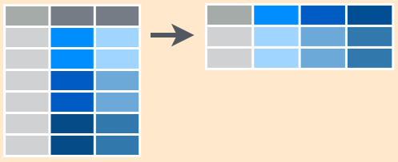

Homework 04: Tidy data and joins
================
Amanda Cheung

Putting my data wrangling skills to the test!

#### Gapminder and tidyveryse

Load gapminder and tidyverse.

``` r
suppressPackageStartupMessages(library(gapminder))
suppressPackageStartupMessages(library(tidyverse))
```

General data reshaping and relationship to aggregation
------------------------------------------------------

**Problem:** You have data in one “shape”, but you wish it were in another...

**Solution:** Reshape your data! Use `gather()` and `spread()` from `tidyr` for simple reshaping!

Activity 1: `tidyr` cheatsheet
------------------------------

A minimal cheatsheet. Check out the [R studio version](https://www.rstudio.com/wp-content/uploads/2015/02/data-wrangling-cheatsheet.pdf), for a more comprehensive one.

### Main functions: `gather()` and `spread()`

| `tidyr` function | action                           |
|------------------|----------------------------------|
| `gather()`       | long format :arrow\_up\_down:    |
| `spread()`       | wide format :left\_right\_arrow: |

### Example data

``` r
student <- c('A', 'B', 'C')
biology <- c(88, 90, 75)
chemistry <- c(95, 85, 90)
french <- c(83, 77, 85) 

ex.data <- data.frame(student, biology, chemistry, french) 

knitr::kable(ex.data)
```

| student |  biology|  chemistry|  french|
|:--------|--------:|----------:|-------:|
| A       |       88|         95|      83|
| B       |       90|         85|      77|
| C       |       75|         90|      85|

### `gather()`

Gather columns into rows.


``` r
knitr::kable(ex.data %>%
               gather(key=subject, value=grade, biology:french))
```

| student | subject   |  grade|
|:--------|:----------|------:|
| A       | biology   |     88|
| B       | biology   |     90|
| C       | biology   |     75|
| A       | chemistry |     95|
| B       | chemistry |     85|
| C       | chemistry |     90|
| A       | french    |     83|
| B       | french    |     77|
| C       | french    |     85|

``` r
## Alternative ways to call gather()
## gather(subject, grade, biology:french)
## gather(subject, grade, -c(student))
## gather(subject, grade, biology, chemistry, french)
```

### `spread()`

Spread rows into columns.



``` r
knitr::kable(ex.data %>%
               gather(key=subject, value=grade, biology:french) %>% 
               spread(key=subject, value=grade))
```

| student |  biology|  chemistry|  french|
|:--------|--------:|----------:|-------:|
| A       |       88|         95|      83|
| B       |       90|         85|      77|
| C       |       75|         90|      85|

Activity 2: Exploring life expectancy
-------------------------------------

### Tibble: One row per year and columns for life expectancy for two or more countries

``` r
lifeExp.tbl <- gapminder %>%
  filter(country %in% c('Australia', 'Canada', 'Denmark')) %>% 
  select(year, country, lifeExp) %>% 
  spread(country, lifeExp)

knitr::kable(lifeExp.tbl)
```

|  year|  Australia|  Canada|  Denmark|
|-----:|----------:|-------:|--------:|
|  1952|     69.120|  68.750|   70.780|
|  1957|     70.330|  69.960|   71.810|
|  1962|     70.930|  71.300|   72.350|
|  1967|     71.100|  72.130|   72.960|
|  1972|     71.930|  72.880|   73.470|
|  1977|     73.490|  74.210|   74.690|
|  1982|     74.740|  75.760|   74.630|
|  1987|     76.320|  76.860|   74.800|
|  1992|     77.560|  77.950|   75.330|
|  1997|     78.830|  78.610|   76.110|
|  2002|     80.370|  79.770|   77.180|
|  2007|     81.235|  80.653|   78.332|

### Scatterplot: Life expectancy for one country against that of another using the new data shape created above

``` r
ggplot(lifeExp.tbl, aes(x=Canada, y=Australia)) + 
  geom_point(aes(colour=year)) +
  theme_bw() +
  labs(title='Canada vs. Australia Life Expectancy Trends') +
  scale_color_continuous("Year") +
  theme(plot.title=element_text(hjust=0.5))
```


``` r
ggplot(lifeExp.tbl, aes(x=Canada, y=Denmark)) + 
  geom_point(aes(colour=year)) +
  theme_bw() +
  labs(title='Canada vs. Denmark Life Expectancy Trends') +
  scale_color_continuous("Year") +
  theme(plot.title=element_text(hjust=0.5))
```


``` r
ggplot(lifeExp.tbl, aes(x=Australia, y=Denmark)) + 
  geom_point(aes(colour=year)) +
  theme_bw() +
  labs(title='Australia vs. Denmark Life Expectancy Trends') +
  scale_color_continuous("Year") +
  theme(plot.title=element_text(hjust=0.5))
```


Activity 3: Maximum life expectancy
-----------------------------------

### Tibble: Maximum life expectancy for all possible combinations of continent and year. One row per year and one variable for each continent.

``` r
maxlifeExp.tbl <- gapminder %>%
  group_by(year, continent) %>%
  summarize(maxlifeExp = max(lifeExp)) %>%
  spread(continent, maxlifeExp) %>%
  arrange(year)

knitr::kable(maxlifeExp.tbl)
```

|  year|  Africa|  Americas|    Asia|  Europe|  Oceania|
|-----:|-------:|---------:|-------:|-------:|--------:|
|  1952|  52.724|    68.750|  65.390|  72.670|   69.390|
|  1957|  58.089|    69.960|  67.840|  73.470|   70.330|
|  1962|  60.246|    71.300|  69.390|  73.680|   71.240|
|  1967|  61.557|    72.130|  71.430|  74.160|   71.520|
|  1972|  64.274|    72.880|  73.420|  74.720|   71.930|
|  1977|  67.064|    74.210|  75.380|  76.110|   73.490|
|  1982|  69.885|    75.760|  77.110|  76.990|   74.740|
|  1987|  71.913|    76.860|  78.670|  77.410|   76.320|
|  1992|  73.615|    77.950|  79.360|  78.770|   77.560|
|  1997|  74.772|    78.610|  80.690|  79.390|   78.830|
|  2002|  75.744|    79.770|  82.000|  80.620|   80.370|
|  2007|  76.442|    80.653|  82.603|  81.757|   81.235|

### Plot???

Activity 4:
-----------

``` r
europe.tbl <- gapminder %>%
  filter(continent == "Europe") %>%
  select(year, country, lifeExp) %>%
  group_by(year) %>%
  filter(min_rank(desc(lifeExp)) < 2 | min_rank(lifeExp) < 2) %>% 
  arrange(year) %>%
  spread(country, lifeExp)

knitr::kable(europe.tbl)
```

|  year|  Iceland|  Norway|  Sweden|  Switzerland|  Turkey|
|-----:|--------:|-------:|-------:|------------:|-------:|
|  1952|       NA|   72.67|      NA|           NA|  43.585|
|  1957|   73.470|      NA|      NA|           NA|  48.079|
|  1962|   73.680|      NA|      NA|           NA|  52.098|
|  1967|       NA|      NA|   74.16|           NA|  54.336|
|  1972|       NA|      NA|   74.72|           NA|  57.005|
|  1977|   76.110|      NA|      NA|           NA|  59.507|
|  1982|   76.990|      NA|      NA|           NA|  61.036|
|  1987|       NA|      NA|      NA|        77.41|  63.108|
|  1992|   78.770|      NA|      NA|           NA|  66.146|
|  1997|       NA|      NA|   79.39|           NA|  68.835|
|  2002|       NA|      NA|      NA|        80.62|  70.845|
|  2007|   81.757|      NA|      NA|           NA|  71.777|
