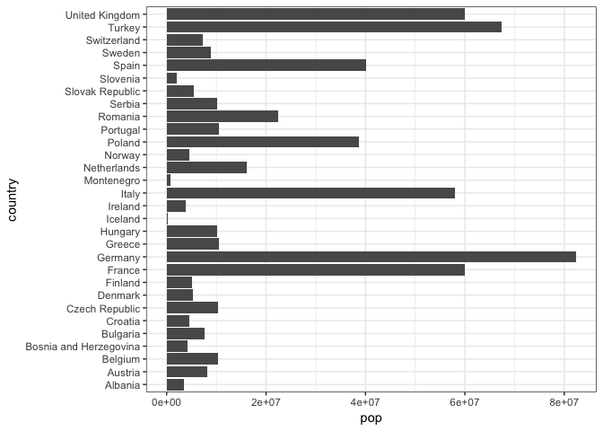
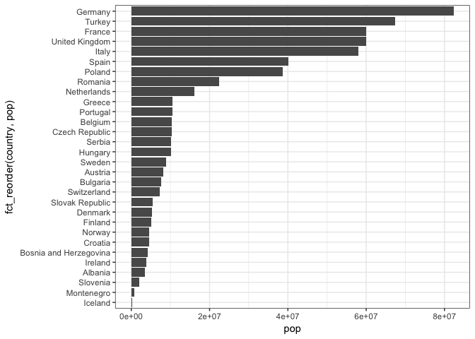
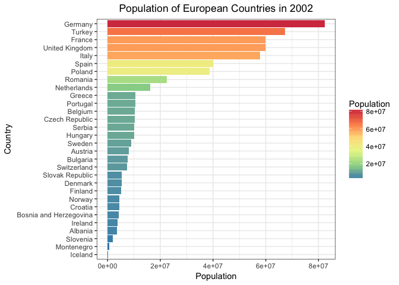
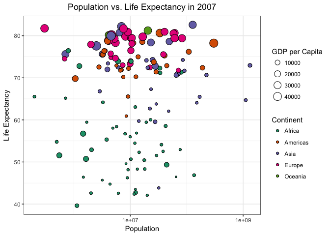
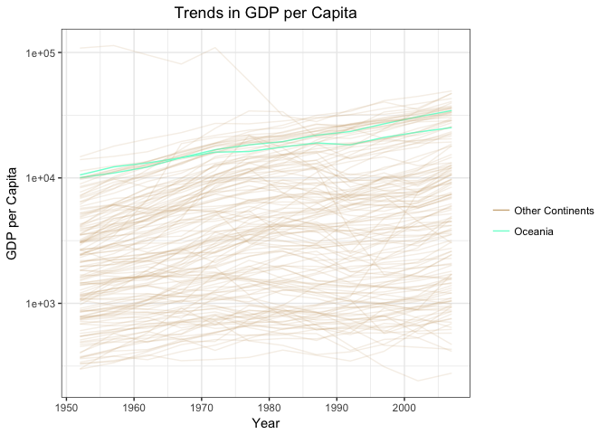
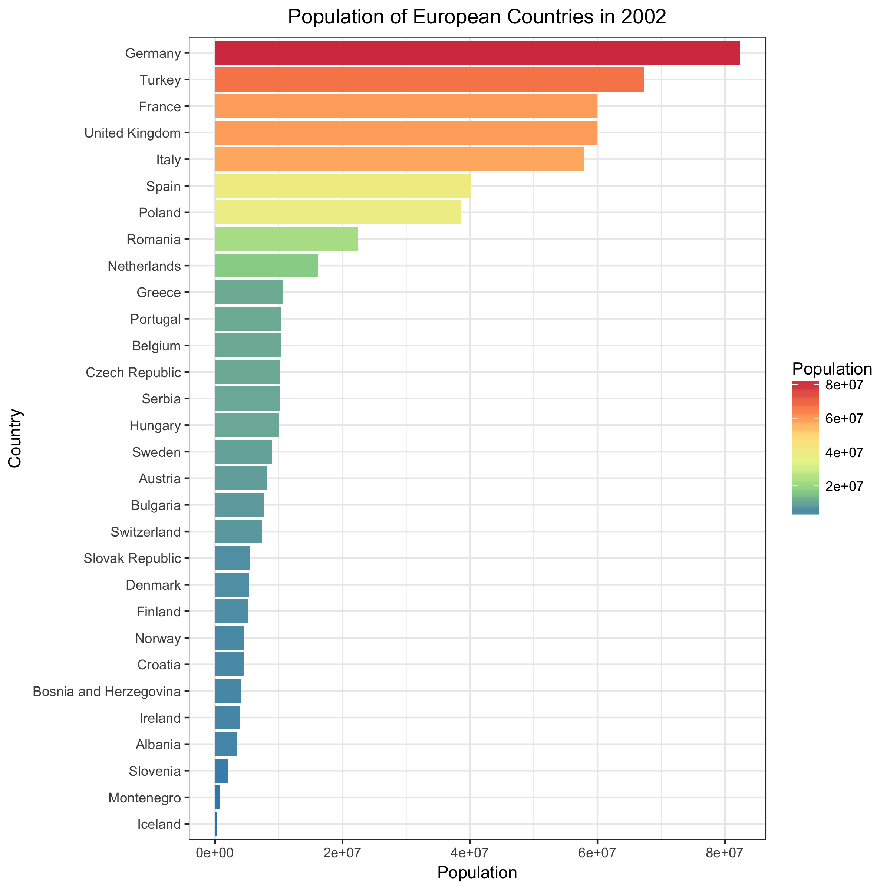
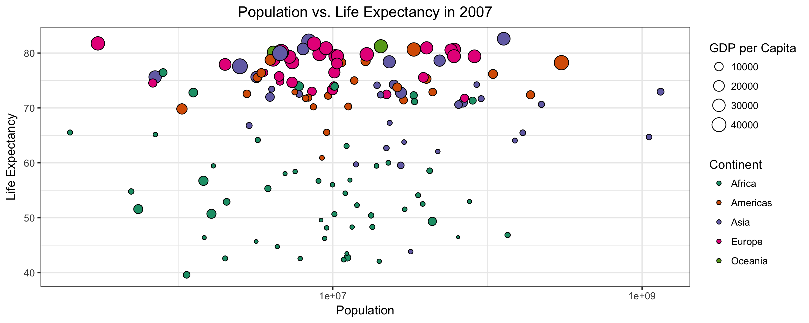
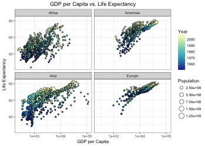
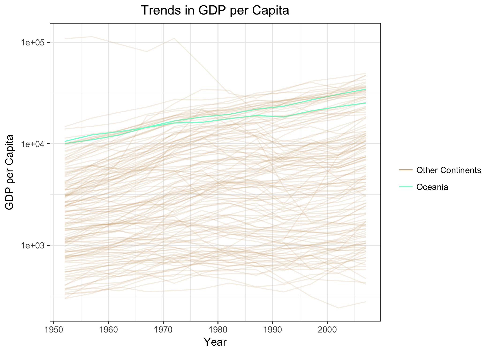

STAT545 Homework 05: Factor and Figure Management
================

The final homework assignment for STAT545 (until STAT547...) -- let's do this! :neckbeard:

### Load packages

Load necessary packages.

``` r
suppressPackageStartupMessages(library(tidyverse))
suppressPackageStartupMessages(library(forcats))
suppressPackageStartupMessages(library(knitr))
suppressPackageStartupMessages(library(RColorBrewer))
suppressPackageStartupMessages(library(viridis))
```

### Locate Gapminder data

``` r
## Locate gapminder package on my system
(gap_tsv <- system.file("gapminder.tsv", package = "gapminder"))
```

    ## [1] "/Library/Frameworks/R.framework/Versions/3.4/Resources/library/gapminder/gapminder.tsv"

Factor Management
-----------------

### GAPMINDER VERSION

### 1. Factorise

Import gapminder data using `read_tsv()`, which reads tab-delimited data.

``` r
gapminder <- read_tsv(gap_tsv)
```

    ## Parsed with column specification:
    ## cols(
    ##   country = col_character(),
    ##   continent = col_character(),
    ##   year = col_integer(),
    ##   lifeExp = col_double(),
    ##   pop = col_integer(),
    ##   gdpPercap = col_double()
    ## )

``` r
str(gapminder, give.attr = FALSE)
```

    ## Classes 'tbl_df', 'tbl' and 'data.frame':    1704 obs. of  6 variables:
    ##  $ country  : chr  "Afghanistan" "Afghanistan" "Afghanistan" "Afghanistan" ...
    ##  $ continent: chr  "Asia" "Asia" "Asia" "Asia" ...
    ##  $ year     : int  1952 1957 1962 1967 1972 1977 1982 1987 1992 1997 ...
    ##  $ lifeExp  : num  28.8 30.3 32 34 36.1 ...
    ##  $ pop      : int  8425333 9240934 10267083 11537966 13079460 14880372 12881816 13867957 16317921 22227415 ...
    ##  $ gdpPercap: num  779 821 853 836 740 ...

Strings are not converted to factors, so let's convert `country` and `continent` to factors.

``` r
gapminder <- gapminder %>%
  mutate(country = factor(country),
         continent = factor(continent))
## as_factor() could also be used in lieu of factor()
## as_factor() is actually safer, since it doesn't change the order of the levels
## however, not important right now since we'll be reordering them later!

str(gapminder)
```

    ## Classes 'tbl_df', 'tbl' and 'data.frame':    1704 obs. of  6 variables:
    ##  $ country  : Factor w/ 142 levels "Afghanistan",..: 1 1 1 1 1 1 1 1 1 1 ...
    ##  $ continent: Factor w/ 5 levels "Africa","Americas",..: 3 3 3 3 3 3 3 3 3 3 ...
    ##  $ year     : int  1952 1957 1962 1967 1972 1977 1982 1987 1992 1997 ...
    ##  $ lifeExp  : num  28.8 30.3 32 34 36.1 ...
    ##  $ pop      : int  8425333 9240934 10267083 11537966 13079460 14880372 12881816 13867957 16317921 22227415 ...
    ##  $ gdpPercap: num  779 821 853 836 740 ...

Ta da! We now see that `country` is a factor with 142 levels, and `continent` is a factor with 5 levels.

### 2. Drop Oceania

Filter the Gapminder data to remove observations associated with the `continent` of Oceania. Additionally, remove unused factor levels. Provide concrete information on the data before and after removing these rows and Oceania; address the number of rows and the levels of the affected factors.

#### Before removing Oceania and unused factor levels...

``` r
str(gapminder) ## structure of original gapminder
```

    ## Classes 'tbl_df', 'tbl' and 'data.frame':    1704 obs. of  6 variables:
    ##  $ country  : Factor w/ 142 levels "Afghanistan",..: 1 1 1 1 1 1 1 1 1 1 ...
    ##  $ continent: Factor w/ 5 levels "Africa","Americas",..: 3 3 3 3 3 3 3 3 3 3 ...
    ##  $ year     : int  1952 1957 1962 1967 1972 1977 1982 1987 1992 1997 ...
    ##  $ lifeExp  : num  28.8 30.3 32 34 36.1 ...
    ##  $ pop      : int  8425333 9240934 10267083 11537966 13079460 14880372 12881816 13867957 16317921 22227415 ...
    ##  $ gdpPercap: num  779 821 853 836 740 ...

``` r
nrow(gapminder) ## total number of rows of original gapminder
```

    ## [1] 1704

``` r
levels(gapminder$continent) ## levels in original gapminder continent
```

    ## [1] "Africa"   "Americas" "Asia"     "Europe"   "Oceania"

``` r
nlevels(gapminder$continent) ## total number of levels in original gapminder continent
```

    ## [1] 5

``` r
class(gapminder$continent) ## class of original gapminder continent
```

    ## [1] "factor"

``` r
summary(gapminder$continent) ## summary of original gapminder continent
```

    ##   Africa Americas     Asia   Europe  Oceania 
    ##      624      300      396      360       24

#### Drop Oceania and unused factor levels.

``` r
## new_gap will be the filtered gapminder data frame
new_gap <- gapminder %>%
  filter(continent != "Oceania") %>% 
  droplevels()
```

#### After removing Oceania and unused factor levels...

``` r
str(new_gap) ## structure of filtered gapminder
```

    ## Classes 'tbl_df', 'tbl' and 'data.frame':    1680 obs. of  6 variables:
    ##  $ country  : Factor w/ 140 levels "Afghanistan",..: 1 1 1 1 1 1 1 1 1 1 ...
    ##  $ continent: Factor w/ 4 levels "Africa","Americas",..: 3 3 3 3 3 3 3 3 3 3 ...
    ##  $ year     : int  1952 1957 1962 1967 1972 1977 1982 1987 1992 1997 ...
    ##  $ lifeExp  : num  28.8 30.3 32 34 36.1 ...
    ##  $ pop      : int  8425333 9240934 10267083 11537966 13079460 14880372 12881816 13867957 16317921 22227415 ...
    ##  $ gdpPercap: num  779 821 853 836 740 ...

``` r
nrow(new_gap) ## total number of rows of filtered gapminder
```

    ## [1] 1680

``` r
levels(new_gap$continent) ## levels in filtered gapminder continent
```

    ## [1] "Africa"   "Americas" "Asia"     "Europe"

``` r
nlevels(new_gap$continent) ## total number of levels of filtered gapminder continent
```

    ## [1] 4

``` r
class(new_gap$continent) ## class of filtered gapminder continent
```

    ## [1] "factor"

``` r
summary(new_gap$continent) ## summary of filtered gapminder continent
```

    ##   Africa Americas     Asia   Europe 
    ##      624      300      396      360

After removing Oceania and unused factor levels, the number of rows decreased to 1680 (from 1704), there are 4 levels in continent, and the levels no longer contain Oceania.

### 3. Reorder the levels of `country` or `continent`

Use the `forcats` package to change the order of the factor levels, based on a principled summary of one of the quantitative variables. Consider experimenting with a summary statistic beyond the most basic choice of the median.

Order gapminder countries by maximum population in descending order. This will display the top 10 countries with the greatest maximum population.

``` r
fct_reorder(gapminder$country, gapminder$pop, max, .desc = TRUE) %>% 
  levels() %>%
  head(10) %>% 
  kable()
```

|               |
|:--------------|
| China         |
| India         |
| United States |
| Indonesia     |
| Brazil        |
| Pakistan      |
| Bangladesh    |
| Nigeria       |
| Japan         |
| Mexico        |

Order gapminder countries by maximum population. This will display the top 10 countries with the smallest maximum population.

``` r
fct_reorder(gapminder$country, gapminder$pop, max) %>% 
  levels() %>%
  head(10) %>%
  kable()
```

|                       |
|:----------------------|
| Sao Tome and Principe |
| Iceland               |
| Djibouti              |
| Equatorial Guinea     |
| Bahrain               |
| Comoros               |
| Montenegro            |
| Reunion               |
| Swaziland             |
| Trinidad and Tobago   |

Let's look at the importance of reordering factor levels! Here is a plot of gapminder European countries in 2002 to population.

``` r
gap_euro <- gapminder %>% filter(year == 2002, continent == "Europe")
ggplot(gap_euro, aes(x = country, y = pop)) +
  geom_bar(stat = "identity") +
  coord_flip() +
  theme_bw()
```



From this plot, we can see that Germany has the greatest population, but it's hard to rank the top 10 countries.

``` r
ggplot(gap_euro, aes(x = fct_reorder(country, pop), y = pop)) +
  geom_bar(stat = "identity") +
  coord_flip() +
  theme_bw()
```



Ahhh, much better! Now we can easily differentiate the countries with the greatest population.

### `arrange()`

#### Explore the effects of `arrange()`. Does merely arranging the data have any effect on, say, a figure?

Arrange population in `gap_euro` which was created above (gapminder European countries in 2002).

``` r
gap_euro2 <- gapminder %>% 
  filter(year == 2002, continent == "Europe") %>% 
  arrange(pop)
```

#### Let's see how the **data** has changed before and after `arrange()`.

**Before `arrange()`**

``` r
## row order
gap_euro %>% head() %>% kable() 
```

| country                | continent |  year|  lifeExp|       pop|  gdpPercap|
|:-----------------------|:----------|-----:|--------:|---------:|----------:|
| Albania                | Europe    |  2002|   75.651|   3508512|   4604.212|
| Austria                | Europe    |  2002|   78.980|   8148312|  32417.608|
| Belgium                | Europe    |  2002|   78.320|  10311970|  30485.884|
| Bosnia and Herzegovina | Europe    |  2002|   74.090|   4165416|   6018.975|
| Bulgaria               | Europe    |  2002|   72.140|   7661799|   7696.778|
| Croatia                | Europe    |  2002|   74.876|   4481020|  11628.389|

``` r
## level order
gap_euro$country %>% fct_drop() %>% levels() %>% head() %>% kable()
```

|                        |
|:-----------------------|
| Albania                |
| Austria                |
| Belgium                |
| Bosnia and Herzegovina |
| Bulgaria               |
| Croatia                |

**After `arrange()`**

``` r
## row order
gap_euro2 %>% head() %>% kable()
```

| country                | continent |  year|  lifeExp|      pop|  gdpPercap|
|:-----------------------|:----------|-----:|--------:|--------:|----------:|
| Iceland                | Europe    |  2002|   80.500|   288030|  31163.202|
| Montenegro             | Europe    |  2002|   73.981|   720230|   6557.194|
| Slovenia               | Europe    |  2002|   76.660|  2011497|  20660.019|
| Albania                | Europe    |  2002|   75.651|  3508512|   4604.212|
| Ireland                | Europe    |  2002|   77.783|  3879155|  34077.049|
| Bosnia and Herzegovina | Europe    |  2002|   74.090|  4165416|   6018.975|

``` r
## level order
gap_euro2$country %>% fct_drop() %>% levels() %>% head() %>% kable()
```

|                        |
|:-----------------------|
| Albania                |
| Austria                |
| Belgium                |
| Bosnia and Herzegovina |
| Bulgaria               |
| Croatia                |

Before `arrange()`, countries were listed in alphabetical order in the row order and level order of the data frame.

After `arrange()`, countries were listed in increasing order of maximum population in the row order, but the level order remained alphabetical.

#### Let's see how the **figure** has changed before and after `arrange()`.

**Before `arrange()`**

``` r
ggplot(gap_euro, aes(x = country, y = pop)) +
  geom_bar(stat = "identity") +
  coord_flip() +
  theme_bw()
```


**After `arrange()`**

``` r
ggplot(gap_euro2, aes(x = country, y = pop)) +
  geom_bar(stat = "identity") +
  coord_flip() +
  theme_bw()
```


No change! Arranging the data does not have any effect on a figure. However, it changes the row order in a data frame.

#### Explore the effects of reordering a factor and factor reordering coupled with `arrange()`. Especially, what effect does this have on a figure?

#### Let's see how the data has changed before and after `arrange()`.

**Before `arrange()`**

``` r
gap_euro_reorder <- gapminder %>% 
  filter(year == 2002, continent == "Europe") %>% 
  mutate(country = fct_reorder(country, pop))

## row order
gap_euro_reorder %>% head() %>% kable()
```

| country                | continent |  year|  lifeExp|       pop|  gdpPercap|
|:-----------------------|:----------|-----:|--------:|---------:|----------:|
| Albania                | Europe    |  2002|   75.651|   3508512|   4604.212|
| Austria                | Europe    |  2002|   78.980|   8148312|  32417.608|
| Belgium                | Europe    |  2002|   78.320|  10311970|  30485.884|
| Bosnia and Herzegovina | Europe    |  2002|   74.090|   4165416|   6018.975|
| Bulgaria               | Europe    |  2002|   72.140|   7661799|   7696.778|
| Croatia                | Europe    |  2002|   74.876|   4481020|  11628.389|

``` r
## level order
gap_euro_reorder$country %>% fct_drop() %>% levels() %>% head() %>% kable()
```

|                        |
|:-----------------------|
| Iceland                |
| Montenegro             |
| Slovenia               |
| Albania                |
| Ireland                |
| Bosnia and Herzegovina |

**After `arrange()`**

``` r
gap_euro_reorder2 <- gapminder %>% 
  filter(year == 2002, continent == "Europe") %>% 
  mutate(country = fct_reorder(country, pop)) %>% 
  arrange(pop)

## row order
gap_euro_reorder2 %>% head() %>% kable()
```

| country                | continent |  year|  lifeExp|      pop|  gdpPercap|
|:-----------------------|:----------|-----:|--------:|--------:|----------:|
| Iceland                | Europe    |  2002|   80.500|   288030|  31163.202|
| Montenegro             | Europe    |  2002|   73.981|   720230|   6557.194|
| Slovenia               | Europe    |  2002|   76.660|  2011497|  20660.019|
| Albania                | Europe    |  2002|   75.651|  3508512|   4604.212|
| Ireland                | Europe    |  2002|   77.783|  3879155|  34077.049|
| Bosnia and Herzegovina | Europe    |  2002|   74.090|  4165416|   6018.975|

``` r
## level order
gap_euro_reorder2$country %>% fct_drop() %>% levels() %>% head() %>% kable()
```

|                        |
|:-----------------------|
| Iceland                |
| Montenegro             |
| Slovenia               |
| Albania                |
| Ireland                |
| Bosnia and Herzegovina |

Before `arrange()`, the row order of countries were listed in alphabetical order. Level order was changed to countries listed in increasing order of maximum population.

After `arrange()`, the row order and level order were changed to countries listed in increasing order of maximum population.

#### Let's see how the **figure** has changed before and after `arrange()`.

**Before `arrange()`**

``` r
ggplot(gap_euro_reorder, aes(x = country, y = pop)) +
  geom_bar(stat = "identity") +
  coord_flip() +
  theme_bw()
```


**After `arrange()`**

``` r
ggplot(gap_euro_reorder2, aes(x = country, y = pop)) +
  geom_bar(stat = "identity") +
  coord_flip() +
  theme_bw()
```


No change! Arranging the data does not have any effect on a figure that has reordered factors. However, it changes the row order in a data frame.

From this activity, we can see that `arrange()` does not effect the order of levels in a factor, but instead it changes the order of rows in a data frame.

File I/O
--------

Experiment with one or more of `write_csv()/read_csv()` (and/or TSV friends), `saveRDS()/readRDS()`, `dput()/dget()`. Create something new, probably by filtering or grouped-summarization of Gapminder. Fiddle with the factor levels, i.e. make them non-alphabetical (see previous section). Explore whether this survives the round trip of writing to file then reading back in.

### Create something new!

Let's make a country level summary of maximum population.

``` r
gap_max_pop <- gapminder %>%
  filter(year == 2002) %>% 
  group_by(country, continent) %>% 
  summarise(max_pop = max(pop)) %>% 
  ungroup()
kable(head(gap_max_pop))
```

| country     | continent |  max\_pop|
|:------------|:----------|---------:|
| Afghanistan | Asia      |  25268405|
| Albania     | Europe    |   3508512|
| Algeria     | Africa    |  31287142|
| Angola      | Africa    |  10866106|
| Argentina   | Americas  |  38331121|
| Australia   | Oceania   |  19546792|

### Reorder the data!

``` r
## countries are in alphabetical order
kable(head(levels(gap_max_pop$country)))
```

|             |
|:------------|
| Afghanistan |
| Albania     |
| Algeria     |
| Angola      |
| Argentina   |
| Australia   |

``` r
## reorder to increasing maximum population
gap_max_pop <- gap_max_pop %>% 
  mutate(country = fct_reorder(country, max_pop))
kable(head(levels(gap_max_pop$country)))
```

|                       |
|:----------------------|
| Sao Tome and Principe |
| Iceland               |
| Djibouti              |
| Equatorial Guinea     |
| Comoros               |
| Bahrain               |

``` r
## the row order has not changed
## but the level order changed!
kable(head(gap_max_pop))
```

| country     | continent |  max\_pop|
|:------------|:----------|---------:|
| Afghanistan | Asia      |  25268405|
| Albania     | Europe    |   3508512|
| Algeria     | Africa    |  31287142|
| Angola      | Africa    |  10866106|
| Argentina   | Americas  |  38331121|
| Australia   | Oceania   |  19546792|

### Write the data out!

``` r
write_csv(gap_max_pop, "gap_max_pop.csv") ## write to comma-delimited file
saveRDS(gap_max_pop, "gap_max_pop.rds") ## save to binary file
dput(gap_max_pop, "gap_max_pop-dput.txt") ## write to plain text
```

### Read the data!

``` r
gap_max_pop_csv <- read_csv("gap_max_pop.csv")
```

    ## Parsed with column specification:
    ## cols(
    ##   country = col_character(),
    ##   continent = col_character(),
    ##   max_pop = col_double()
    ## )

``` r
gap_max_pop_RDS <- readRDS("gap_max_pop.rds")
gap_max_pop_dget <- dget("gap_max_pop-dput.txt")
```

### Compare the different strategies!

``` r
## first convert countries to factors
gap_max_pop_csv <- gap_max_pop_csv %>% mutate(country = factor(country))
gap_max_pop_RDS <- gap_max_pop_RDS %>% mutate(country = factor(country))
gap_max_pop_dget <- gap_max_pop_dget %>% mutate(country = factor(country))

## create a tibble to compare the strategies
country_levels <- tibble(original = head(levels(gap_max_pop$country)))
country_levels <- country_levels %>%
  mutate(via_csv = head(levels(gap_max_pop_csv$country)),
         via_RDS = head(levels(gap_max_pop_RDS$country)),
         via_dput = head(levels(gap_max_pop_dget$country)))
kable(country_levels)
```

| original              | via\_csv    | via\_RDS              | via\_dput             |
|:----------------------|:------------|:----------------------|:----------------------|
| Sao Tome and Principe | Afghanistan | Sao Tome and Principe | Sao Tome and Principe |
| Iceland               | Albania     | Iceland               | Iceland               |
| Djibouti              | Algeria     | Djibouti              | Djibouti              |
| Equatorial Guinea     | Angola      | Equatorial Guinea     | Equatorial Guinea     |
| Comoros               | Argentina   | Comoros               | Comoros               |
| Bahrain               | Australia   | Bahrain               | Bahrain               |

The original (after reordering) country factor levels are restored using the `saveRDS() / readRDS()` and `dput() / dget()` strategy, but return to alphabetical ordering using `write_csv() / read_csv()`.

Visualization design
--------------------

Remake at least one figure or create a new one, in light of something you learned in the recent class meetings about visualization design and color. Maybe juxtapose your first attempt and what you obtained after some time spent working on it. Reflect on the differences. If using Gapminder, you can use the country or continent color scheme that ships with Gapminder. Consult the guest lecture from Tamara Munzner and everything here.

### Remake plot of European countries to population in 2002 (from above)!

``` r
p1 <- ggplot(gap_euro, aes(x = fct_reorder(country, pop), y = pop)) +
  geom_bar(stat = "identity", aes(fill=pop)) +
  coord_flip() +
  theme_bw() +
  labs(title = "Population of European Countries in 2002") +
  scale_x_discrete("Country") +
  scale_y_continuous("Population") +
  theme(plot.title = element_text(hjust=0.5)) +
  scale_fill_distiller("Population", palette="Spectral")
p1
```



### Plot of population vs. life expectancy in 2007

``` r
p2 <- gapminder %>% 
    filter(year==2007) %>% 
  ggplot(aes(x=pop, y=lifeExp)) +
  geom_point(shape=21, aes(size=gdpPercap, fill=continent)) +
  scale_x_log10() +
  theme_bw() +
  labs(title = "Population vs. Life Expectancy in 2007",
       fill = "Continent",
       size = "GDP per Capita",
       x = "Population",
       y = "Life Expectancy") +
  theme(plot.title = element_text(hjust=0.5)) +
  scale_fill_brewer("Continent", palette="Dark2")
p2
```



### Plot of GDP per capita vs. life expectancy

``` r
p3 <- gapminder %>% 
  filter(continent != "Oceania") %>%
  ggplot(aes(x=gdpPercap, y=lifeExp)) +
  geom_point(shape=21, aes(size=pop, fill=year)) +
  facet_wrap(~ continent) +
  scale_x_log10() +
  theme_bw() +
  labs(title = "GDP per Capita vs. Life Expectancy",
       fill = "Year",
       size = "Population",
       x = "GDP per Capita",
       y = "Life Expectancy") +
  theme(plot.title = element_text(hjust=0.5)) +
  scale_fill_distiller(palette="YlGnBu", direction=-1)
p3
```


### Plot of trends in GDP per capita

``` r
p4 <- ggplot(gapminder, aes(x=year, y=gdpPercap)) +
  geom_line(aes(group=country,
                colour=continent=="Oceania",
                alpha=continent=="Oceania")) +
  scale_y_log10() +
  theme_bw() +
  scale_colour_manual("",
                      labels=c("Other Continents", "Oceania"),
                      values=c("tan", "aquamarine")) +
  scale_alpha_discrete(range=c(0.2, 1),
                         guide=FALSE) +
  labs(title = "Trends in GDP per Capita",
       x = "Year",
       y = "GDP per Capita") +
  theme(plot.title = element_text(hjust=0.5))
p4
```



Writing figures to file
-----------------------

`ggsave()`

Manipulating width, height, and resolution in a raster format.

``` r
ggsave("plot1.png", p1, width = 8, height = 8)
ggsave("plot2.png", p2, width = 10, height = 4)
ggsave("plot3.png", p3, dpi = 50)
```

    ## Saving 7 x 5 in image

``` r
ggsave("plot4.png", p4, dpi = 300)
```

    ## Saving 7 x 5 in image









Clean up your repo!
-------------------

But I want to do more!
----------------------

Create an excerpt of the Gapminder data

``` r
country <- c('Argentina', 'Austria', 'Bangladesh', 'Chad', 
             'Ecuador', 'Gambia', 'Italy', 'Nepal', 
             'New Zealand', 'Switzerland', 'Taiwan', 'United Kingdom')
capital_city <- c('Buenos Aires', 'Vienna', 'Dhaka', "N'Djamena", 
                  'Quito', 'Banjul', 'Rome', 'Kathmandu',
                  'Wellington', 'Bern', 'Taipei', 'London')

country_data <- data.frame(country, capital_city)

## factorize capital_city to country levels
country_data <- country_data %>%
  mutate(country = factor(country),
         capital_city = factor(capital_city))

kable(country_data)
```

| country        | capital\_city |
|:---------------|:--------------|
| Argentina      | Buenos Aires  |
| Austria        | Vienna        |
| Bangladesh     | Dhaka         |
| Chad           | N'Djamena     |
| Ecuador        | Quito         |
| Gambia         | Banjul        |
| Italy          | Rome          |
| Nepal          | Kathmandu     |
| New Zealand    | Wellington    |
| Switzerland    | Bern          |
| Taiwan         | Taipei        |
| United Kingdom | London        |
